# Create a Simple Agent with Google ADK for the Impatient: From Novice to Practitioner in Record Time

_"The best time to plant a tree was 20 years ago. The second best time is now."_ - This ancient Chinese proverb perfectly captures why you should start building AI agents today, not tomorrow.

## Why Your Future Depends on AI Agents (And Why ADK is Your Secret Weapon)

Picture this: It's 2019, and a small startup called OpenAI releases something called GPT-2 . Most developers shrugged it off as "another AI experiment." Fast forward to today, and those who dismissed the AI revolution are scrambling to catch up while early adopters are building million-dollar businesses with AI agents.



Here's the uncomfortable truth: **Every minute you delay learning AI agent development, your competitors gain another minute of advantage** . But here's the good news – Google's Agent Development Kit (ADK) is about to level the playing field, and this tutorial will get you there faster than a caffeinated developer on a Friday deadline .

### The "Manual Car vs. Auto-Pilot Car" Analogy

Traditional software is like driving a manual car: you need to know every control, shift gears yourself, and constantly pay attention to the road. Building with AI agents using ADK is like switching to an auto-pilot car: you simply tell it your destination in plain language, and it handles the route, traffic, and driving for you—quickly and efficiently.

**Pro Tip**: The companies winning with AI aren't necessarily the ones with the biggest budgets – they're the ones who moved first and moved fast. Don't be the Blockbuster of your industry.

## What Makes Google ADK the Swiss Army Knife of Agent Development

Google's Agent Development Kit isn't just another AI framework – it's what happens when Google's internal agent-building experience meets the real world's messiness . Let me paint you a picture with a story.

### The Tale of Two Developers

Sarah tried to build a customer service agent from scratch using basic LLM APIs. Months later, she was still stuck on setup and integration problems.

Jake used Google ADK. In just a few weeks, he launched a working multi-agent system that handled real customer requests and integrated with business tools—saving time and delivering results fast.

**The difference?** ADK's "batteries-included" approach versus building from first principles .

```mermaid
flowchart TB
    subgraph "Google ADK"
        ADK[Google ADK]
        style ADK fill:#fff3e0,stroke:#f57f17,stroke-width:3px
    end

    subgraph "Core Features"
        AG[🤖 Agents]
        TL[🔧 Tools]
        WO[⚡ Workflows]
        style AG fill:#e3f2fd,stroke:#1565c0,stroke-width:2px
        style TL fill:#e8f5e8,stroke:#2e7d32,stroke-width:2px
        style WO fill:#f3e5f5,stroke:#7b1fa2,stroke-width:2px
    end

    subgraph "Key Benefits"
        RD[⚡ Rapid Development]
        PR[🚀 Production Ready]
        MA[🔄 Model Agnostic]
        style RD fill:#fce4ec,stroke:#c2185b,stroke-width:2px
        style PR fill:#e1f5fe,stroke:#01579b,stroke-width:2px
        style MA fill:#f1f8e9,stroke:#689f38,stroke-width:2px
    end

    ADK --> AG
    ADK --> TL
    ADK --> WO
    ADK --> RD
    ADK --> PR
    ADK --> MA
```



### Why ADK Wins the Developer Experience Battle

1. **Code-First Philosophy**: Define your agents like you define classes – clean, testable, maintainable
2. **Tool Ecosystem**: Pre-built integrations for Google Search, code execution, and more
3. **Multi-Agent Orchestration**: Build agent teams that coordinate like a well-oiled machine
4. **Production-Ready**: Deploy anywhere from local development to Vertex AI Agent Engine

**Pause and Reflect**: Think about the last time you had to integrate multiple APIs. How long did it take? ADK reduces that complexity by 90% .

## Setting Up Your Modern Python Development Environment

Here's where most tutorials lose you with outdated practices . We're doing this right – modern Python development that your future self will thank you for .

### The Poetry Advantage

Forget `pip install` and `requirements.txt` – we're using Poetry, the tool that makes Python dependency management actually enjoyable .

```bash
# Install Poetry (the modern way)
curl -sSL https://install.python-poetry.org | python3 -

# Verify installation
poetry --version
```

Poetry employs deterministic dependency resolution to identify compatible package versions across all dependency chains, preventing version conflicts that commonly occur when manually managing requirements.txt files . The `poetry.lock` file records exact package versions and hashes for reproducible installations .

### Project Structure That Scales

```
intelligent-assistant/
├── pyproject.toml          # Poetry configuration
├── README.md
├── .env                    # Environment variables
├── .gitignore
├── src/
│   └── intelligent_assistant/
│       ├── __init__.py
│       ├── agents/
│       │   ├── __init__.py
│       │   └── weather_agent.py
│       ├── tools/
│       │   ├── __init__.py
│       │   └── weather_tools.py
│       └── main.py
└── tests/
    ├── __init__.py
    └── test_agents.py
```

### Quick Setup (Copy-Paste Ready)

```bash
# Create project directory
mkdir intelligent-assistant && cd intelligent-assistant

# Initialize Poetry project
poetry init --name intelligent-assistant --python "^3.9"

# Add ADK dependency
poetry add google-adk

# Add development dependencies
poetry add --group dev pytest black ruff mypy

# Create virtual environment and activate
poetry shell
```

Poetry automatically creates and isolates project-specific virtual environments, eliminating manual activation/deactivation . It detects existing Python installations and manages environment paths through the `poetry env` command family .

**Pro Tip**: Poetry automatically creates isolated virtual environments . No more "it works on my machine" problems or accidentally installing packages globally .

## Authentication: Your Keys to the AI Kingdom

Authentication is where 80% of beginners get stuck . Let's fix that with a foolproof approach.

### Google AI Studio Setup (The Fast Track)


1. **Get Your API Key** (2 minutes) :
   - Visit Google AI Studio
   - Click "Create API key"
   - Copy the key (starts with `AIza...`)
2. **Secure Configuration** :

```bash
# Create .env file
echo "GOOGLE_API_KEY=your_actual_api_key_here" > .env
echo "GOOGLE_GENAI_USE_VERTEXAI=FALSE" >> .env
```

3. **Load Environment Variables** :

```python
# src/intelligent_assistant/config.py
import os
from dotenv import load_dotenv

load_dotenv()

GOOGLE_API_KEY = os.getenv("GOOGLE_API_KEY")
USE_VERTEX_AI = os.getenv("GOOGLE_GENAI_USE_VERTEXAI", "FALSE").upper() == "TRUE"
```

### Vertex AI Setup (The Enterprise Track)

For production applications, Vertex AI offers better security, scaling, and enterprise features. The setup involves configuring IAM roles, enabling APIs, and setting up authentication.

**Quick Setup Summary:**

```bash
# Basic Vertex AI configuration
export PROJECT_ID="your-project-id"
gcloud config set project $PROJECT_ID
gcloud auth application-default login

# Environment variables
echo "GOOGLE_CLOUD_PROJECT=$PROJECT_ID" > .env
echo "GOOGLE_GENAI_USE_VERTEXAI=TRUE" >> .env
```

**📖 For complete Vertex AI setup instructions**, including detailed IAM roles, API enablement, and troubleshooting, see: **[How to Configure Vertex AI for ADK](30_how_to_configure_vertex_ai_for_adk.md)**

#### Step 7: Verify Your Setup

```bash
# Test Vertex AI access
gcloud ai models list --region=us-central1 --project=$PROJECT_ID

# Test ADK installation with Vertex AI
python -c "
import vertexai
from vertexai import agent_engines
print('✅ Vertex AI setup successful!')
"
```

#### Step 8: Configure Python Environment for Vertex AI

```python
# src/intelligent_assistant/config.py
import os
from dotenv import load_dotenv

load_dotenv()

# Vertex AI Configuration
GOOGLE_CLOUD_PROJECT = os.getenv("GOOGLE_CLOUD_PROJECT")
GOOGLE_CLOUD_LOCATION = os.getenv("GOOGLE_CLOUD_LOCATION", "us-central1")
USE_VERTEX_AI = os.getenv("GOOGLE_GENAI_USE_VERTEXAI", "FALSE").upper() == "TRUE"
STAGING_BUCKET = f"gs://{GOOGLE_CLOUD_PROJECT}-adk-agents"

# Initialize Vertex AI
if USE_VERTEX_AI:
    import vertexai
    vertexai.init(
        project=GOOGLE_CLOUD_PROJECT,
        location=GOOGLE_CLOUD_LOCATION,
        staging_bucket=STAGING_BUCKET
    )
```

### Troubleshooting Common Setup Issues

#### Permission Denied Errors

**Error**: `Permission denied` when running ADK commands

**Solution**:

```bash
# Check your current permissions
gcloud auth list
gcloud config get-value project

# Re-authenticate if needed
gcloud auth application-default login
```

#### API Not Enabled Errors

**Error**: `API [aiplatform.googleapis.com] not enabled`

**Solution**:

```bash
# Enable the API and wait for propagation
gcloud services enable aiplatform.googleapis.com --project=$PROJECT_ID
sleep 30  # Wait 30 seconds for API to be fully enabled
```

#### Service Agent Not Found

**Error**: `Service agent not found` during deployment

**Solution**:

```bash
# Manually create the service agent
gcloud beta services identity create --service=aiplatform.googleapis.com --project=$PROJECT_ID

# Grant additional permissions if needed
gcloud projects add-iam-policy-binding $PROJECT_ID \
    --member="serviceAccount:service-PROJECT_NUMBER@gcp-sa-aiplatform-re.iam.gserviceaccount.com" \
    --role="roles/aiplatform.reasoningEngineServiceAgent"
```

#### Quota Exceeded Errors

**Error**: `Quota exceeded for requests`

**Solution**: Request quota increases via Google Cloud Console → IAM & Admin → Quotas

### Security Best Practices

1. **Use Least Privilege**: Only grant the minimum required roles
2. **Environment Variables**: Never hardcode project IDs or credentials
3. **Service Accounts**: For production, use dedicated service accounts instead of personal accounts
4. **Audit Logs**: Enable Cloud Audit Logs to monitor API usage

```bash
# Create a dedicated service account for production
gcloud iam service-accounts create adk-agent-sa \
    --display-name="ADK Agent Service Account" \
    --project=$PROJECT_ID

# Grant only necessary roles to the service account
gcloud projects add-iam-policy-binding $PROJECT_ID \
    --member="serviceAccount:adk-agent-sa@$PROJECT_ID.iam.gserviceaccount.com" \
    --role="roles/aiplatform.user"
```

### Regional Availability and Cost Considerations

#### Supported Regions for Vertex AI Agent Engine (June 2025)

Choose the region closest to your users for optimal performance:

- **Americas**: `us-central1` (Iowa), `us-east1` (South Carolina), `us-west1` (Oregon)
- **Europe**: `europe-west1` (Belgium), `europe-west4` (Netherlands)
- **Asia Pacific**: `asia-southeast1` (Singapore), `asia-northeast1` (Tokyo)

```bash
# Set your preferred region
export GOOGLE_CLOUD_LOCATION="us-central1"  # Recommended for tutorials
```

#### Cost Estimation

**Vertex AI Agent Engine Pricing** (as of June 2025):

- **Model Usage**: Pay per token (input/output)
  - Gemini 2.0 Flash: ~$0.075 per 1M input tokens, ~$0.30 per 1M output tokens
- **Agent Engine Hosting**: ~$0.50-2.00 per hour depending on instance size
- **Cloud Storage**: ~$0.020 per GB/month for bucket storage

**Cost Optimization Tips**:

```bash
# Use efficient model configurations
# In your agent code:
generate_content_config = types.GenerateContentConfig(
    temperature=0.1,        # Lower temperature = more deterministic
    max_output_tokens=500,  # Limit output length
    top_p=0.95,
)
```

### Alternative: Local Development vs Cloud Deployment

| Feature                | Google AI Studio (Local) | Vertex AI (Cloud)      |
| ---------------------- | ------------------------ | ---------------------- |
| **Setup Complexity**   | ⭐⭐ Simple              | ⭐⭐⭐⭐ Advanced      |
| **Cost**               | Free tier available      | Pay-as-you-use         |
| **Production Ready**   | ❌ Development only      | ✅ Production ready    |
| **Security**           | API Key based            | IAM & Service Accounts |
| **Scalability**        | Limited                  | Auto-scaling           |
| **Team Collaboration** | ❌ Individual            | ✅ Team-friendly       |

**Recommendation**: Start with Google AI Studio for learning, migrate to Vertex AI for production.

## Author

### Raphaël MANSUY

- Website: [Elitizon](https://www.elitizon.com)
- LinkedIn: [Raphaël Mansuy](https://www.linkedin.com/in/raphaelmansuy/)

---

_Last updated: June 2025_

## Complete ADK Development Example: From Setup to Production

This section demonstrates a comprehensive approach to building production-ready AI agents with Google ADK, incorporating modern development practices and real-world deployment strategies.

### Modern Development Workflow

The most effective ADK development follows a structured approach that combines rapid prototyping with production-ready practices:

```mermaid
flowchart TB
    subgraph "Traditional Approach"
        A[📝 Traditional Software]
        B[⚙️ Static Rules]
        C[📊 Predictable Output]
        style A fill:#ffcccc,stroke:#d32f2f,stroke-width:2px
        style B fill:#ffcccc,stroke:#d32f2f,stroke-width:2px
        style C fill:#ffcccc,stroke:#d32f2f,stroke-width:2px
    end

    subgraph "AI Agent Approach"
        D[🤖 AI Agents]
        E[🧠 Dynamic Reasoning]
        F[🔧 Tool Integration]
        G[🤝 Multi-Agent Coordination]
        H[✨ Adaptive Solutions]
        I[🌍 Real-World Actions]
        J[⚡ Complex Workflows]
        style D fill:#ccffcc,stroke:#388e3c,stroke-width:2px
        style E fill:#e8f5e8,stroke:#2e7d32,stroke-width:2px
        style F fill:#e8f5e8,stroke:#2e7d32,stroke-width:2px
        style G fill:#e8f5e8,stroke:#2e7d32,stroke-width:2px
        style H fill:#ccffcc,stroke:#388e3c,stroke-width:2px
        style I fill:#ccffcc,stroke:#388e3c,stroke-width:2px
        style J fill:#ccffcc,stroke:#388e3c,stroke-width:2px
    end

    A --> B
    B --> C
    D --> E
    D --> F
    D --> G
    E --> H
    F --> I
    G --> J
```


### Example: Intelligent Task Management Assistant

Let's build a complete task management system that demonstrates all key ADK concepts working together:

#### Production-Ready Project Structure

```text
intelligent-task-assistant/
├── pyproject.toml              # Poetry configuration
├── README.md
├── .env                        # Environment variables
├── docker-compose.yml          # Container orchestration
├── Dockerfile                  # Container definition
├── src/
│   └── task_assistant/
│       ├── __init__.py
│       ├── main.py
│       ├── config.py           # Configuration management
│       ├── agents/
│       │   ├── __init__.py
│       │   ├── coordinator.py  # Main coordinator agent
│       │   └── specialists.py  # Specialized agents
│       ├── tools/
│       │   ├── __init__.py
│       │   ├── task_tools.py   # Task management functions
│       │   ├── calendar_tools.py
│       │   └── notification_tools.py
│       ├── workflows/
│       │   ├── __init__.py
│       │   └── daily_planning.py
│       └── utils/
│           ├── __init__.py
│           ├── error_handling.py
│           └── monitoring.py
└── tests/
    ├── __init__.py
    ├── test_agents.py
    ├── test_tools.py
    └── test_workflows.py
```

#### Configuration Management

```python
# src/task_assistant/config.py
import os
from dotenv import load_dotenv
from pathlib import Path

# Load environment variables
load_dotenv()

class Config:
    """Centralized configuration management"""
    
    # Authentication
    GOOGLE_API_KEY = os.getenv("GOOGLE_API_KEY")
    USE_VERTEX_AI = os.getenv("GOOGLE_GENAI_USE_VERTEXAI", "FALSE").upper() == "TRUE"
    
    # Vertex AI Configuration
    GOOGLE_CLOUD_PROJECT = os.getenv("GOOGLE_CLOUD_PROJECT")
    GOOGLE_CLOUD_LOCATION = os.getenv("GOOGLE_CLOUD_LOCATION", "us-central1")
    STAGING_BUCKET = f"gs://{GOOGLE_CLOUD_PROJECT}-adk-agents" if GOOGLE_CLOUD_PROJECT else None
    
    # Database Configuration
    DATABASE_URL = os.getenv("DATABASE_URL", "sqlite:///tasks.db")
    
    # Monitoring
    ENABLE_MONITORING = os.getenv("ENABLE_MONITORING", "TRUE").upper() == "TRUE"
    LOG_LEVEL = os.getenv("LOG_LEVEL", "INFO")
    
    # Validation
    @classmethod
    def validate(cls):
        """Validate required configuration"""
        if not cls.GOOGLE_API_KEY and not cls.USE_VERTEX_AI:
            raise ValueError("Either GOOGLE_API_KEY or Vertex AI configuration required")
        
        if cls.USE_VERTEX_AI and not cls.GOOGLE_CLOUD_PROJECT:
            raise ValueError("GOOGLE_CLOUD_PROJECT required for Vertex AI")

# Initialize Vertex AI if configured
if Config.USE_VERTEX_AI:
    import vertexai
    vertexai.init(
        project=Config.GOOGLE_CLOUD_PROJECT,
        location=Config.GOOGLE_CLOUD_LOCATION,
        staging_bucket=Config.STAGING_BUCKET
    )
```

#### Advanced Tool Implementation

```python
# src/task_assistant/tools/task_tools.py
from typing import List, Dict, Any, Optional
from datetime import datetime, timedelta
from dataclasses import dataclass
import json
import logging
from functools import wraps

logger = logging.getLogger(__name__)

@dataclass
class Task:
    """Task data model"""
    id: int
    title: str
    description: str = ""
    priority: str = "medium"  # low, medium, high, urgent
    due_date: Optional[str] = None
    status: str = "pending"  # pending, in_progress, completed, cancelled
    created_at: str = ""
    completed_at: Optional[str] = None
    tags: List[str] = None
    
    def __post_init__(self):
        if self.tags is None:
            self.tags = []
        if not self.created_at:
            self.created_at = datetime.now().isoformat()

# In-memory storage (replace with database in production)
TASKS: List[Task] = []
TASK_ID_COUNTER = 1

def error_handler(func):
    """Decorator for consistent error handling"""
    @wraps(func)
    def wrapper(*args, **kwargs) -> Dict[str, Any]:
        try:
            return func(*args, **kwargs)
        except Exception as e:
            logger.error(f"Tool {func.__name__} failed: {str(e)}")
            return {
                "status": "error",
                "message": f"Operation failed: {str(e)}",
                "tool": func.__name__
            }
    return wrapper

@error_handler
def create_task(
    title: str, 
    description: str = "", 
    priority: str = "medium", 
    due_date: str = None,
    tags: List[str] = None
) -> Dict[str, Any]:
    """
    Create a new task with comprehensive metadata.
    
    Args:
        title (str): Task title
        description (str): Detailed description
        priority (str): Priority level (low, medium, high, urgent)
        due_date (str): Due date in ISO format
        tags (List[str]): Task tags for categorization
        
    Returns:
        dict: Operation result with task details
    """
    global TASK_ID_COUNTER
    
    if not title.strip():
        return {
            "status": "error",
            "message": "Task title cannot be empty"
        }
    
    # Validate priority
    valid_priorities = ["low", "medium", "high", "urgent"]
    if priority not in valid_priorities:
        return {
            "status": "error",
            "message": f"Priority must be one of: {', '.join(valid_priorities)}"
        }
    
    # Validate due date if provided
    if due_date:
        try:
            datetime.fromisoformat(due_date.replace('Z', '+00:00'))
        except ValueError:
            return {
                "status": "error",
                "message": "Due date must be in ISO format"
            }
    
    task = Task(
        id=TASK_ID_COUNTER,
        title=title.strip(),
        description=description.strip(),
        priority=priority,
        due_date=due_date,
        tags=tags or []
    )
    
    TASKS.append(task)
    TASK_ID_COUNTER += 1
    
    logger.info(f"Created task: {task.title} (ID: {task.id})")
    
    return {
        "status": "success",
        "message": f"Task '{task.title}' created successfully",
        "task": {
            "id": task.id,
            "title": task.title,
            "description": task.description,
            "priority": task.priority,
            "due_date": task.due_date,
            "status": task.status,
            "tags": task.tags,
            "created_at": task.created_at
        }
    }

@error_handler
def list_tasks(
    status: str = "all", 
    priority: str = "all",
    tag: str = None,
    limit: int = 50
) -> Dict[str, Any]:
    """
    List tasks with filtering and pagination.
    
    Args:
        status (str): Filter by status (all, pending, completed, etc.)
        priority (str): Filter by priority (all, low, medium, high, urgent)
        tag (str): Filter by tag
        limit (int): Maximum number of tasks to return
        
    Returns:
        dict: Filtered task list
    """
    filtered_tasks = TASKS.copy()
    
    # Apply filters
    if status != "all":
        filtered_tasks = [t for t in filtered_tasks if t.status == status]
    
    if priority != "all":
        filtered_tasks = [t for t in filtered_tasks if t.priority == priority]
    
    if tag:
        filtered_tasks = [t for t in filtered_tasks if tag in t.tags]
    
    # Sort by priority and creation date
    priority_order = {"urgent": 4, "high": 3, "medium": 2, "low": 1}
    filtered_tasks.sort(
        key=lambda t: (priority_order.get(t.priority, 0), t.created_at),
        reverse=True
    )
    
    # Apply limit
    filtered_tasks = filtered_tasks[:limit]
    
    # Convert to dict format
    task_dicts = []
    for task in filtered_tasks:
        task_dict = {
            "id": task.id,
            "title": task.title,
            "description": task.description,
            "priority": task.priority,
            "due_date": task.due_date,
            "status": task.status,
            "tags": task.tags,
            "created_at": task.created_at
        }
        if task.completed_at:
            task_dict["completed_at"] = task.completed_at
        task_dicts.append(task_dict)
    
    return {
        "status": "success",
        "tasks": task_dicts,
        "count": len(task_dicts),
        "total_tasks": len(TASKS),
        "filters_applied": {
            "status": status,
            "priority": priority,
            "tag": tag,
            "limit": limit
        }
    }

@error_handler
def update_task_status(task_id: int, new_status: str) -> Dict[str, Any]:
    """
    Update task status with validation.
    
    Args:
        task_id (int): Task identifier
        new_status (str): New status value
        
    Returns:
        dict: Operation result
    """
    valid_statuses = ["pending", "in_progress", "completed", "cancelled"]
    
    if new_status not in valid_statuses:
        return {
            "status": "error",
            "message": f"Status must be one of: {', '.join(valid_statuses)}"
        }
    
    for task in TASKS:
        if task.id == task_id:
            old_status = task.status
            task.status = new_status
            
            # Set completion timestamp if completed
            if new_status == "completed":
                task.completed_at = datetime.now().isoformat()
            
            logger.info(f"Updated task {task_id} status: {old_status} -> {new_status}")
            
            return {
                "status": "success",
                "message": f"Task '{task.title}' status updated to '{new_status}'",
                "task": {
                    "id": task.id,
                    "title": task.title,
                    "old_status": old_status,
                    "new_status": new_status,
                    "completed_at": task.completed_at
                }
            }
    
    return {
        "status": "error",
        "message": f"Task with ID {task_id} not found"
    }

@error_handler
def get_task_analytics() -> Dict[str, Any]:
    """
    Generate task analytics and insights.
    
    Returns:
        dict: Analytics data
    """
    if not TASKS:
        return {
            "status": "success",
            "message": "No tasks available for analysis",
            "analytics": {}
        }
    
    # Status distribution
    status_counts = {}
    priority_counts = {}
    overdue_tasks = []
    
    for task in TASKS:
        # Count by status
        status_counts[task.status] = status_counts.get(task.status, 0) + 1
        
        # Count by priority
        priority_counts[task.priority] = priority_counts.get(task.priority, 0) + 1
        
        # Check for overdue tasks
        if task.due_date and task.status != "completed":
            try:
                due_date = datetime.fromisoformat(task.due_date.replace('Z', '+00:00'))
                if due_date.date() < datetime.now().date():
                    overdue_tasks.append({
                        "id": task.id,
                        "title": task.title,
                        "due_date": task.due_date,
                        "priority": task.priority
                    })
            except ValueError:
                pass
    
    # Completion rate
    completed_tasks = status_counts.get("completed", 0)
    total_tasks = len(TASKS)
    completion_rate = (completed_tasks / total_tasks * 100) if total_tasks > 0 else 0
    
    return {
        "status": "success",
        "analytics": {
            "total_tasks": total_tasks,
            "completion_rate": f"{completion_rate:.1f}%",
            "status_distribution": status_counts,
            "priority_distribution": priority_counts,
            "overdue_tasks": overdue_tasks,
            "overdue_count": len(overdue_tasks)
        }
    }
```

#### Sophisticated Agent Architecture

```python
# src/task_assistant/agents/coordinator.py
from google.adk.agents import Agent
from ..tools.task_tools import (
    create_task, 
    list_tasks, 
    update_task_status, 
    get_task_analytics
)

# Main coordinator agent with comprehensive instruction set
task_coordinator = Agent(
    name="intelligent_task_coordinator",
    model="gemini-2.0-flash",
    description="Advanced AI coordinator for comprehensive task and productivity management",
    instruction="""
    You are an intelligent task management coordinator with expertise in productivity optimization. 
    Your role is to help users manage their tasks efficiently and provide strategic insights.

    CORE CAPABILITIES:
    1. Task Creation & Management
       - Create tasks with appropriate priorities and metadata
       - Update task statuses and track progress  
       - Organize tasks by categories and tags
       
    2. Strategic Planning
       - Analyze task workload and suggest optimizations
       - Identify bottlenecks and overdue items
       - Recommend task prioritization strategies
       
    3. Productivity Insights
       - Generate analytics on task completion patterns
       - Provide workload distribution analysis
       - Suggest time management improvements

    INTERACTION GUIDELINES:
    - Always confirm actions taken with clear summaries
    - Proactively suggest improvements and optimizations
    - Use data-driven insights to make recommendations
    - Be concise but thorough in explanations
    - Ask clarifying questions when requirements are ambiguous

    TASK PRIORITY GUIDELINES:
    - Urgent: Must be done today, critical deadlines
    - High: Important, should be done within 2-3 days
    - Medium: Regular tasks, flexible timeline
    - Low: Nice to have, can be deferred

    When users ask for task lists, provide organized, prioritized views.
    When creating tasks, suggest appropriate priorities based on context.
    Always look for opportunities to help users be more productive.
    """,
    tools=[create_task, list_tasks, update_task_status, get_task_analytics]
)

# Specialized analytics agent
analytics_agent = Agent(
    name="task_analytics_specialist",
    model="gemini-2.0-flash",
    description="Specialist in task analytics and productivity insights",
    instruction="""
    You are a task analytics specialist focused on providing data-driven insights 
    about productivity patterns and task management efficiency.
    
    Your expertise includes:
    - Task completion rate analysis
    - Productivity trend identification
    - Workload distribution optimization
    - Time management recommendations
    - Performance bottleneck identification
    
    Always provide actionable insights with concrete recommendations.
    Use data visualization suggestions when appropriate.
    Focus on helping users improve their productivity systematically.
    """,
    tools=[get_task_analytics, list_tasks]
)
```

#### Multi-Agent Workflow Implementation

```python
# src/task_assistant/workflows/daily_planning.py
from google.adk.agents import SequentialAgent, Agent
from ..agents.coordinator import task_coordinator, analytics_agent

# Morning planning specialist
morning_planner = Agent(
    name="morning_productivity_planner",
    model="gemini-2.0-flash",
    description="Specialist in daily morning planning and priority setting",
    instruction="""
    You are a morning productivity planning specialist. Help users start their day effectively by:
    
    1. Reviewing pending tasks and deadlines
    2. Identifying top priorities for the day
    3. Suggesting a realistic daily schedule
    4. Highlighting any overdue or urgent items
    5. Recommending time-blocking strategies
    
    Focus on creating achievable daily plans that balance urgency with importance.
    Consider the user's typical productivity patterns and energy levels.
    Always provide a clear, actionable plan for the day ahead.
    """
)

# Evening review specialist
evening_reviewer = Agent(
    name="evening_progress_reviewer",
    model="gemini-2.0-flash",
    description="Specialist in daily progress review and continuous improvement",
    instruction="""
    You are an evening progress review specialist. Help users reflect on their day by:
    
    1. Reviewing completed tasks and accomplishments
    2. Analyzing what went well and what could be improved
    3. Identifying incomplete tasks and rescheduling strategies
    4. Suggesting process improvements for tomorrow
    5. Celebrating achievements and maintaining motivation
    
    Focus on constructive feedback and continuous improvement.
    Help users learn from their daily experiences to optimize future productivity.
    Maintain a positive, encouraging tone while being realistic about challenges.
    """
)

# Comprehensive daily workflow
daily_productivity_workflow = SequentialAgent(
    name="daily_productivity_workflow",
    sub_agents=[
        morning_planner,      # Start with daily planning
        task_coordinator,     # Handle task management throughout day
        analytics_agent,      # Provide insights and analytics
        evening_reviewer      # End with progress review
    ],
    instruction="""
    Execute a comprehensive daily productivity workflow:
    
    1. MORNING PHASE: Review tasks, set priorities, plan the day
    2. EXECUTION PHASE: Manage tasks, track progress, handle updates
    3. ANALYSIS PHASE: Generate insights and identify patterns
    4. REVIEW PHASE: Reflect on progress, plan improvements for tomorrow
    
    Each phase should build upon the previous one to create a complete
    productivity management cycle. Ensure smooth transitions between phases
    and maintain context throughout the workflow.
    """
)
```

#### Production-Ready Error Handling and Monitoring

```python
# src/task_assistant/utils/error_handling.py
import logging
import traceback
from typing import Dict, Any, Callable
from functools import wraps
from datetime import datetime

# Configure logging
logging.basicConfig(
    level=logging.INFO,
    format='%(asctime)s - %(name)s - %(levelname)s - %(message)s',
    handlers=[
        logging.FileHandler('task_assistant.log'),
        logging.StreamHandler()
    ]
)

logger = logging.getLogger(__name__)

class TaskAssistantError(Exception):
    """Base exception for task assistant operations"""
    pass

class ValidationError(TaskAssistantError):
    """Raised when input validation fails"""
    pass

class ToolExecutionError(TaskAssistantError):
    """Raised when tool execution fails"""
    pass

def comprehensive_error_handler(func: Callable) -> Callable:
    """
    Comprehensive error handling decorator with logging and recovery
    """
    @wraps(func)
    def wrapper(*args, **kwargs) -> Dict[str, Any]:
        start_time = datetime.now()
        
        try:
            result = func(*args, **kwargs)
            
            # Log successful execution
            duration = (datetime.now() - start_time).total_seconds()
            logger.info(f"Tool {func.__name__} executed successfully in {duration:.2f}s")
            
            return result
            
        except ValidationError as e:
            logger.warning(f"Validation error in {func.__name__}: {str(e)}")
            return {
                "status": "error",
                "error_type": "validation",
                "message": f"Input validation failed: {str(e)}",
                "tool": func.__name__,
                "timestamp": datetime.now().isoformat()
            }
            
        except ToolExecutionError as e:
            logger.error(f"Tool execution error in {func.__name__}: {str(e)}")
            return {
                "status": "error",
                "error_type": "execution",
                "message": f"Tool execution failed: {str(e)}",
                "tool": func.__name__,
                "timestamp": datetime.now().isoformat()
            }
            
        except Exception as e:
            # Log full traceback for unexpected errors
            logger.error(f"Unexpected error in {func.__name__}: {str(e)}")
            logger.error(f"Traceback: {traceback.format_exc()}")
            
            return {
                "status": "error",
                "error_type": "unexpected",
                "message": f"An unexpected error occurred: {str(e)}",
                "tool": func.__name__,
                "timestamp": datetime.now().isoformat(),
                "suggestion": "Please try again or contact support if the issue persists."
            }
    
    return wrapper

# Monitoring and metrics collection
class MetricsCollector:
    """Simple metrics collection for monitoring agent performance"""
    
    def __init__(self):
        self.metrics = {
            "tool_executions": {},
            "agent_interactions": {},
            "error_counts": {},
            "response_times": {}
        }
    
    def record_tool_execution(self, tool_name: str, duration: float, success: bool):
        """Record tool execution metrics"""
        if tool_name not in self.metrics["tool_executions"]:
            self.metrics["tool_executions"][tool_name] = {
                "total": 0, "success": 0, "failures": 0, "avg_duration": 0
            }
        
        stats = self.metrics["tool_executions"][tool_name]
        stats["total"] += 1
        
        if success:
            stats["success"] += 1
        else:
            stats["failures"] += 1
        
        # Update average duration
        current_avg = stats["avg_duration"]
        stats["avg_duration"] = (current_avg * (stats["total"] - 1) + duration) / stats["total"]
    
    def get_metrics_summary(self) -> Dict[str, Any]:
        """Get comprehensive metrics summary"""
        return {
            "metrics_snapshot": self.metrics,
            "timestamp": datetime.now().isoformat(),
            "health_status": self._calculate_health_status()
        }
    
    def _calculate_health_status(self) -> str:
        """Calculate overall system health based on metrics"""
        total_executions = sum(
            stats["total"] for stats in self.metrics["tool_executions"].values()
        )
        
        if total_executions == 0:
            return "healthy"
        
        total_failures = sum(
            stats["failures"] for stats in self.metrics["tool_executions"].values()
        )
        
        failure_rate = total_failures / total_executions
        
        if failure_rate > 0.1:  # More than 10% failure rate
            return "degraded"
        elif failure_rate > 0.05:  # More than 5% failure rate
            return "warning"
        else:
            return "healthy"

# Global metrics collector instance
metrics_collector = MetricsCollector()
```

#### Containerization and Deployment

```dockerfile
# Dockerfile
FROM python:3.11-slim

# Set working directory
WORKDIR /app

# Install system dependencies
RUN apt-get update && apt-get install -y \
    curl \
    && rm -rf /var/lib/apt/lists/*

# Install Poetry
RUN pip install poetry

# Configure Poetry
ENV POETRY_NO_INTERACTION=1 \
    POETRY_VENV_IN_PROJECT=1 \
    POETRY_CACHE_DIR=/tmp/poetry_cache

# Copy dependency files
COPY pyproject.toml poetry.lock ./

# Install dependencies
RUN poetry install --without dev && rm -rf $POETRY_CACHE_DIR

# Copy application code
COPY src/ ./src/

# Create non-root user for security
RUN useradd --create-home --shell /bin/bash app
USER app

# Set environment variables
ENV PYTHONPATH=/app
ENV PYTHONUNBUFFERED=1

# Health check
HEALTHCHECK --interval=30s --timeout=30s --start-period=5s --retries=3 \
    CMD python -c "import src.task_assistant.config; print('healthy')" || exit 1

# Expose port
EXPOSE 8000

# Run application
CMD ["poetry", "run", "python", "-m", "src.task_assistant.main"]
```

```yaml
# docker-compose.yml
version: '3.8'

services:
  task-assistant:
    build: .
    container_name: intelligent-task-assistant
    environment:
      - GOOGLE_API_KEY=${GOOGLE_API_KEY}
      - GOOGLE_GENAI_USE_VERTEXAI=${GOOGLE_GENAI_USE_VERTEXAI:-FALSE}
      - GOOGLE_CLOUD_PROJECT=${GOOGLE_CLOUD_PROJECT}
      - LOG_LEVEL=${LOG_LEVEL:-INFO}
      - ENABLE_MONITORING=${ENABLE_MONITORING:-TRUE}
    ports:
      - "8000:8000"
    volumes:
      - ./data:/app/data              # Persistent data storage
      - ./logs:/app/logs              # Log persistence
      - ./config:/app/config          # Configuration files
    restart: unless-stopped
    healthcheck:
      test: ["CMD", "python", "-c", "import src.task_assistant.config; print('healthy')"]
      interval: 30s
      timeout: 10s
      retries: 3
      start_period: 40s

  # Optional: Add a database service for production
  postgres:
    image: postgres:15-alpine
    container_name: task-assistant-db
    environment:
      - POSTGRES_DB=task_assistant
      - POSTGRES_USER=${DB_USER:-task_user}
      - POSTGRES_PASSWORD=${DB_PASSWORD:-secure_password}
    volumes:
      - postgres_data:/var/lib/postgresql/data
    ports:
      - "5432:5432"
    restart: unless-stopped

  # Optional: Add Redis for caching and session management
  redis:
    image: redis:7-alpine
    container_name: task-assistant-cache
    ports:
      - "6379:6379"
    volumes:
      - redis_data:/data
    restart: unless-stopped

volumes:
  postgres_data:
  redis_data:

networks:
  default:
    name: task-assistant-network
```

#### Testing Strategy

```python
# tests/test_agents.py
import pytest
import asyncio
from unittest.mock import patch, MagicMock
from src.task_assistant.agents.coordinator import task_coordinator, analytics_agent
from src.task_assistant.tools.task_tools import TASKS, TASK_ID_COUNTER

class TestTaskCoordinator:
    """Comprehensive test suite for task coordinator agent"""
    
    def setup_method(self):
        """Reset state before each test"""
        global TASKS, TASK_ID_COUNTER
        TASKS.clear()
        TASK_ID_COUNTER = 1
    
    @pytest.mark.asyncio
    async def test_task_creation_flow(self):
        """Test complete task creation workflow"""
        # This would require setting up proper agent testing
        # For now, we'll test the underlying tools
        from src.task_assistant.tools.task_tools import create_task
        
        result = create_task(
            title="Test Task",
            description="Test Description",
            priority="high",
            tags=["test", "important"]
        )
        
        assert result["status"] == "success"
        assert "Test Task" in result["message"]
        assert result["task"]["priority"] == "high"
        assert "test" in result["task"]["tags"]
    
    @pytest.mark.asyncio
    async def test_task_listing_with_filters(self):
        """Test task listing with various filters"""
        from src.task_assistant.tools.task_tools import create_task, list_tasks
        
        # Create test tasks
        create_task("Urgent Task", priority="urgent")
        create_task("High Priority Task", priority="high")
        create_task("Normal Task", priority="medium")
        
        # Test filtering by priority
        result = list_tasks(priority="urgent")
        assert result["status"] == "success"
        assert result["count"] == 1
        assert result["tasks"][0]["priority"] == "urgent"
    
    @pytest.mark.asyncio
    async def test_error_handling(self):
        """Test error handling in task operations"""
        from src.task_assistant.tools.task_tools import create_task
        
        # Test invalid priority
        result = create_task("Test", priority="invalid")
        assert result["status"] == "error"
        assert "Priority must be one of" in result["message"]
        
        # Test empty title
        result = create_task("")
        assert result["status"] == "error"
        assert "empty" in result["message"]
    
    @pytest.mark.asyncio
    async def test_analytics_generation(self):
        """Test analytics generation"""
        from src.task_assistant.tools.task_tools import (
            create_task, 
            update_task_status, 
            get_task_analytics
        )
        
        # Create and complete some tasks
        create_task("Task 1", priority="high")
        create_task("Task 2", priority="medium")
        update_task_status(1, "completed")
        
        result = get_task_analytics()
        assert result["status"] == "success"
        assert "analytics" in result
        assert result["analytics"]["total_tasks"] == 2
        assert "50.0%" in result["analytics"]["completion_rate"]

class TestWorkflowIntegration:
    """Test multi-agent workflow integration"""
    
    def setup_method(self):
        """Reset state before each test"""
        global TASKS, TASK_ID_COUNTER
        TASKS.clear()
        TASK_ID_COUNTER = 1
    
    @pytest.mark.asyncio
    async def test_daily_workflow_execution(self):
        """Test daily productivity workflow"""
        # This would test the complete workflow execution
        # Implementation depends on ADK's testing capabilities
        pass
    
    def test_agent_coordination(self):
        """Test coordination between different agents"""
        # Test that agents can work together effectively
        pass

# Performance tests
class TestPerformance:
    """Performance and load testing"""
    
    @pytest.mark.performance
    def test_large_task_list_performance(self):
        """Test performance with large numbers of tasks"""
        from src.task_assistant.tools.task_tools import create_task, list_tasks
        import time
        
        # Create many tasks
        start_time = time.time()
        for i in range(1000):
            create_task(f"Task {i}", priority="medium")
        creation_time = time.time() - start_time
        
        # Test listing performance
        start_time = time.time()
        result = list_tasks(limit=100)
        list_time = time.time() - start_time
        
        assert creation_time < 5.0  # Should create 1000 tasks in under 5 seconds
        assert list_time < 0.1      # Should list tasks in under 100ms
        assert result["count"] == 100
    
    @pytest.mark.performance  
    def test_concurrent_operations(self):
        """Test concurrent task operations"""
        import threading
        from src.task_assistant.tools.task_tools import create_task
        
        def create_tasks_batch(start_id, count):
            for i in range(count):
                create_task(f"Concurrent Task {start_id + i}")
        
        # Create tasks concurrently
        threads = []
        for i in range(10):
            thread = threading.Thread(target=create_tasks_batch, args=(i*10, 10))
            threads.append(thread)
            thread.start()
        
        for thread in threads:
            thread.join()
        
        # Verify all tasks were created
        from src.task_assistant.tools.task_tools import list_tasks
        result = list_tasks()
        assert result["count"] == 100
```

### Key Takeaways from This Example

This comprehensive example demonstrates several critical aspects of effective ADK development:

1. **Scalable Architecture**: Proper separation of concerns with dedicated modules for agents, tools, workflows, and utilities.

2. **Production-Ready Code**: Comprehensive error handling, logging, monitoring, and configuration management.

3. **Modern Development Practices**: Use of Poetry for dependency management, Docker for containerization, and proper testing strategies.

4. **Advanced ADK Features**: Multi-agent coordination, workflow agents, and sophisticated tool integration.

5. **Real-World Deployment**: Container orchestration with Docker Compose, health checks, and environment management.

6. **Monitoring and Observability**: Built-in metrics collection, logging, and health status monitoring.

This example serves as a template for building production-grade AI agents that can scale from prototype to enterprise deployment while maintaining code quality and reliability.

---

**Implementation Note**: This example shows the full spectrum of ADK development, from basic setup to production deployment. Each component is designed to be modular and extensible, allowing developers to adapt the patterns to their specific use cases while maintaining best practices.

**Next Steps**: Use this as a reference architecture for your own ADK projects, adapting the components and patterns to match your specific requirements and deployment environment.
