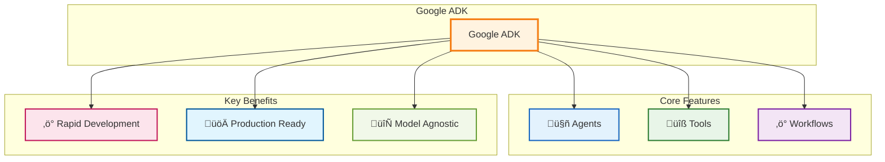

# Google ADK Agent Development: Quick Start to Production

_"The best time to plant a tree was 20 years ago. The second best time is now."_ - This ancient Chinese proverb perfectly captures why you should start building AI agents today, not tomorrow.

## Table of Contents

- [Choose Your Path 🚀](#choose-your-path-)
- [Path Selection Guide](#path-selection-guide)
- [⚡ QUICK START PATH (30 Minutes)](#-quick-start-path-30-minutes)
  - [Step 1: Minimal Setup (5 minutes)](#step-1-minimal-setup-5-minutes)
  - [Step 2: Get API Key (5 minutes)](#step-2-get-api-key-5-minutes)
  - [Step 3: Your First Working Agent (10 minutes)](#step-3-your-first-working-agent-10-minutes)
  - [Step 4: Test Your Agent (5 minutes)](#step-4-test-your-agent-5-minutes)
  - [Step 5: Quick Improvements (5 minutes)](#step-5-quick-improvements-5-minutes)
- [🏗️ PRODUCTION PATH](#️-production-path)
  - [What Makes Google ADK the Swiss Army Knife of Agent Development](#what-makes-google-adk-the-swiss-army-knife-of-agent-development)
  - [Production Setup: Modern Python Development](#production-setup-modern-python-development)
    - [Step 1: uv Project Setup (10 minutes)](#step-1-uv-project-setup-10-minutes)
    - [Step 2: Production Project Structure](#step-2-production-project-structure)
    - [Step 3: Authentication Setup (15 minutes)](#step-3-authentication-setup-15-minutes)
    - [Step 4: Configuration Management](#step-4-configuration-management)
    - [Step 5: Advanced Tool Implementation](#step-5-advanced-tool-implementation)
    - [Step 6: Production Agent Architecture](#step-6-production-agent-architecture)
    - [Step 7: Main Application](#step-7-main-application)
    - [Step 8: Testing Your Production Agent](#step-8-testing-your-production-agent)
    - [Step 9: Testing and Quality Assurance](#step-9-testing-and-quality-assurance)
  - [Production Deployment Options](#production-deployment-options)
    - [Docker Containerization](#docker-containerization)
    - [Cloud Deployment](#cloud-deployment)
  - [Key Production Features Achieved](#key-production-features-achieved)
  - [Next Steps for Production](#next-steps-for-production)
- [Comparison: Quick Start vs Production](#comparison-quick-start-vs-production)
- [The "Manual Car vs. Auto-Pilot Car" Analogy](#the-manual-car-vs-auto-pilot-car-analogy)
- [What Makes Google ADK the Swiss Army Knife of Agent Development](#what-makes-google-adk-the-swiss-army-knife-of-agent-development-1)
  - [The Tale of Two Developers](#the-tale-of-two-developers)
  - [Why ADK Wins the Developer Experience Battle](#why-adk-wins-the-developer-experience-battle)
- [Setting Up Your Modern Python Development Environment](#setting-up-your-modern-python-development-environment)
  - [The uv Advantage](#the-uv-advantage)
  - [Project Structure That Scales](#project-structure-that-scales)
  - [Quick Setup (Copy-Paste Ready)](#quick-setup-copy-paste-ready)
- [Authentication: Your Keys to the AI Kingdom](#authentication-your-keys-to-the-ai-kingdom)
  - [Google AI Studio Setup (The Fast Track)](#google-ai-studio-setup-the-fast-track)
  - [Vertex AI Setup (The Enterprise Track)](#vertex-ai-setup-the-enterprise-track)
  - [Troubleshooting Common Setup Issues](#troubleshooting-common-setup-issues)
  - [Security Best Practices](#security-best-practices)
  - [Regional Availability and Cost Considerations](#regional-availability-and-cost-considerations)
  - [Alternative: Local Development vs Cloud Deployment](#alternative-local-development-vs-cloud-deployment)
- [Author](#author)
- [Summary](#summary)
  - [What You've Accomplished](#what-youve-accomplished)
  - [Next Steps](#next-steps)

## Choose Your Path 🚀

**⚡ Quick Start (30 minutes)** - Get your first agent running with minimal setup

**🏗️ Production Path** - Build scalable, production-ready agent systems

---

## Path Selection Guide

| Aspect             | ⚡ Quick Start             | 🏗️ Production Path               |
| ------------------ | -------------------------- | -------------------------------- |
| **Goal**           | Working agent demo         | Production-ready system          |
| **Time**           | 30 minutes                 | 2-3 hours                        |
| **Setup**          | Minimal (single file)      | Comprehensive (proper structure) |
| **Authentication** | Google AI Studio (API key) | Vertex AI (GCP project)          |
| **Best for**       | Learning, prototyping      | Real applications, teams         |

---

## ⚡ QUICK START PATH (30 Minutes)

_Get a working AI agent with minimal friction - prove to yourself that ADK works!_

### Step 1: Minimal Setup (5 minutes)

```bash
# Create a simple directory and file
mkdir my-first-agent && cd my-first-agent
touch simple_agent.py

# Install uv (the modern Python package manager)
curl -LsSf https://astral.sh/uv/install.sh | sh

# Install ADK using uv
uv add google-adk python-dotenv
```

**Alternative (traditional method):**
```bash
# If you prefer the traditional approach
pip install google-adk python-dotenv
```

### Step 2: Get API Key (5 minutes)

1. Visit [Google AI Studio](https://aistudio.google.com)
2. Click "Get API key" → "Create API key"
3. Copy your key (starts with `AIza...`)
4. Create `.env` file:

```bash
echo "GOOGLE_API_KEY=your_actual_api_key_here" > .env
```

### Step 3: Your First Working Agent (10 minutes)

Create `simple_agent.py`:

```python
import os
from dotenv import load_dotenv
from google.adk.agents import Agent

# Load environment variables
load_dotenv()

def get_weather(location: str) -> str:
    """Mock weather function - replace with real API in production"""
    weather_data = {
        "paris": "Sunny, 22°C",
        "london": "Cloudy, 15°C",
        "tokyo": "Rainy, 18°C",
        "new york": "Partly cloudy, 20°C"
    }
    return weather_data.get(location.lower(), f"Weather data not available for {location}")

def calculate(expression: str) -> str:
    """Safe calculator for basic math"""
    try:
        # Basic safety check
        allowed_chars = set('0123456789+-*/(). ')
        if all(c in allowed_chars for c in expression):
            result = eval(expression)
            return f"{expression} = {result}"
        else:
            return "Invalid expression. Only basic math allowed."
    except:
        return "Error in calculation"

# Create your agent
weather_assistant = Agent(
    name="helpful_assistant",
    model="gemini-2.0-flash",
    description="A helpful assistant that can check weather and do calculations",
    instruction="""
    You are a helpful assistant with access to weather information and basic calculations.

    When users ask about weather:
    - Use the get_weather function for the specified location
    - Be friendly and conversational

    When users ask for calculations:
    - Use the calculate function for math problems
    - Explain the result clearly

    Always be helpful, concise, and engaging in your responses.
    """,
    tools=[get_weather, calculate]
)

# Test your agent
if __name__ == "__main__":
    print("🤖 Your AI Agent is ready! Ask me about weather or math problems.")
    print("Examples: 'What's the weather in Paris?' or 'What's 15 * 24?'")
    print("Type 'quit' to exit.\n")

    while True:
        user_input = input("You: ").strip()
        if user_input.lower() in ['quit', 'exit', 'q']:
            print("Goodbye! 👋")
            break

        if user_input:
            try:
                response = weather_assistant.run(user_input)
                print(f"Agent: {response}\n")
            except Exception as e:
                print(f"Error: {e}\n")
                print("Make sure your GOOGLE_API_KEY is set correctly.")
```

### Step 4: Test Your Agent (5 minutes)

```bash
python simple_agent.py
```

Try these examples:

- "What's the weather in Paris?"
- "Calculate 25 \* 4 + 10"
- "What's 15% of 200?"

### Step 5: Quick Improvements (5 minutes)

Add more personality and capabilities:

```python
def get_joke() -> str:
    """Return a programming joke"""
    jokes = [
        "Why do programmers prefer dark mode? Because light attracts bugs! 🐛",
        "How many programmers does it take to change a light bulb? None. That's a hardware problem.",
        "Why do Java developers wear glasses? Because they don't C# 👓"
    ]
    import random
    return random.choice(jokes)

# Add to your agent's tools list:
tools=[get_weather, calculate, get_joke]
```

### 🎉 Congratulations

You now have a working AI agent! In just 30 minutes, you've:

- ✅ Built a functional AI agent
- ✅ Integrated custom tools
- ✅ Created an interactive experience
- ✅ Proved ADK works for you

**Ready for more?** Jump to the **🏗️ Production Path** below to build scalable, professional-grade agents.

---

## 🏗️ PRODUCTION PATH

Build production-ready, scalable agent systems with modern development practices

Picture this: It's 2019, and a small startup called OpenAI releases something called GPT-2. Most developers shrugged it off as "another AI experiment." Fast forward to today, and those who dismissed the AI revolution are scrambling to catch up while early adopters are building million-dollar businesses with AI agents.

### What Makes Google ADK the Swiss Army Knife of Agent Development

Google's Agent Development Kit isn't just another AI framework – it's what happens when Google's internal agent-building experience meets the real world's messiness.

**Why ADK Wins the Developer Experience Battle:**

1. **Code-First Philosophy**: Define your agents like you define classes – clean, testable, maintainable
2. **Tool Ecosystem**: Pre-built integrations for Google Search, code execution, and more
3. **Multi-Agent Orchestration**: Build agent teams that coordinate like a well-oiled machine
4. **Production-Ready**: Deploy anywhere from local development to Vertex AI Agent Engine

### Production Setup: Modern Python Development

#### Step 1: uv Project Setup (10 minutes)

```bash
# Install uv (the modern Python package manager)
curl -LsSf https://astral.sh/uv/install.sh | sh

# Create project directory
mkdir intelligent-task-assistant && cd intelligent-task-assistant

# Initialize uv project
uv init --name intelligent-task-assistant --python "3.9"

# Add dependencies
uv add google-adk python-dotenv

# Add development dependencies  
uv add --dev pytest black ruff mypy

# Activate environment (uv automatically manages virtual environments)
source .venv/bin/activate
```

#### Step 2: Production Project Structure

```text
intelligent-task-assistant/
├── pyproject.toml          # uv configuration
├── .python-version         # Python version specification
├── uv.lock                 # Lock file for reproducible builds
├── README.md
├── .env                    # Environment variables
├── src/
│   └── task_assistant/
│       ├── __init__.py
│       ├── main.py
│       ├── config.py
│       ├── agents/
│       │   ├── __init__.py
│       │   └── coordinator.py
│       └── tools/
│           ├── __init__.py
│           └── task_tools.py
└── tests/
    ├── __init__.py
    └── test_agents.py
```

#### Step 3: Authentication Setup (15 minutes)

**Option A: Google AI Studio (Simple)**

```bash
# Create .env file
echo "GOOGLE_API_KEY=your_actual_api_key_here" > .env
echo "GOOGLE_GENAI_USE_VERTEXAI=FALSE" >> .env
```

**Option B: Vertex AI (Production)**

For complete Vertex AI setup instructions, see: **[How to Configure Vertex AI for ADK](30_how_to_configure_vertex_ai_for_adk.md)**

Quick setup:

```bash
# Set up GCP project
export PROJECT_ID="your-project-id"
gcloud config set project $PROJECT_ID
gcloud auth application-default login

# Environment variables
echo "GOOGLE_CLOUD_PROJECT=$PROJECT_ID" > .env
echo "GOOGLE_GENAI_USE_VERTEXAI=TRUE" >> .env
```

#### Step 4: Configuration Management

Create `src/task_assistant/config.py`:

```python
import os
from dotenv import load_dotenv

load_dotenv()

class Config:
    """Centralized configuration management"""

    # Authentication
    GOOGLE_API_KEY = os.getenv("GOOGLE_API_KEY")
    USE_VERTEX_AI = os.getenv("GOOGLE_GENAI_USE_VERTEXAI", "FALSE").upper() == "TRUE"

    # Vertex AI Configuration
    GOOGLE_CLOUD_PROJECT = os.getenv("GOOGLE_CLOUD_PROJECT")
    GOOGLE_CLOUD_LOCATION = os.getenv("GOOGLE_CLOUD_LOCATION", "us-central1")

    @classmethod
    def validate(cls):
        """Validate required configuration"""
        if not cls.GOOGLE_API_KEY and not cls.USE_VERTEX_AI:
            raise ValueError("Either GOOGLE_API_KEY or Vertex AI configuration required")

# Initialize Vertex AI if configured
if Config.USE_VERTEX_AI:
    import vertexai
    vertexai.init(
        project=Config.GOOGLE_CLOUD_PROJECT,
        location=Config.GOOGLE_CLOUD_LOCATION
    )
```

#### Step 5: Advanced Tool Implementation

Create `src/task_assistant/tools/task_tools.py`:

```python
from typing import List, Dict, Any, Optional
from datetime import datetime
from dataclasses import dataclass
import logging

logger = logging.getLogger(__name__)

@dataclass
class Task:
    """Task data model"""
    id: int
    title: str
    description: str = ""
    priority: str = "medium"  # low, medium, high, urgent
    status: str = "pending"  # pending, in_progress, completed
    created_at: str = ""

    def __post_init__(self):
        if not self.created_at:
            self.created_at = datetime.now().isoformat()

# In-memory storage (replace with database in production)
TASKS: List[Task] = []
TASK_ID_COUNTER = 1

def create_task(title: str, description: str = "", priority: str = "medium") -> Dict[str, Any]:
    """Create a new task with comprehensive metadata"""
    global TASK_ID_COUNTER

    if not title.strip():
        return {"status": "error", "message": "Task title cannot be empty"}

    valid_priorities = ["low", "medium", "high", "urgent"]
    if priority not in valid_priorities:
        return {
            "status": "error",
            "message": f"Priority must be one of: {', '.join(valid_priorities)}"
        }

    task = Task(
        id=TASK_ID_COUNTER,
        title=title.strip(),
        description=description.strip(),
        priority=priority
    )

    TASKS.append(task)
    TASK_ID_COUNTER += 1

    logger.info(f"Created task: {task.title} (ID: {task.id})")

    return {
        "status": "success",
        "message": f"Task '{task.title}' created successfully",
        "task": {
            "id": task.id,
            "title": task.title,
            "description": task.description,
            "priority": task.priority,
            "status": task.status,
            "created_at": task.created_at
        }
    }

def list_tasks(status: str = "all", priority: str = "all") -> Dict[str, Any]:
    """List tasks with filtering"""
    filtered_tasks = TASKS.copy()

    if status != "all":
        filtered_tasks = [t for t in filtered_tasks if t.status == status]

    if priority != "all":
        filtered_tasks = [t for t in filtered_tasks if t.priority == priority]

    # Sort by priority and creation date
    priority_order = {"urgent": 4, "high": 3, "medium": 2, "low": 1}
    filtered_tasks.sort(
        key=lambda t: (priority_order.get(t.priority, 0), t.created_at),
        reverse=True
    )

    task_dicts = [
        {
            "id": task.id,
            "title": task.title,
            "description": task.description,
            "priority": task.priority,
            "status": task.status,
            "created_at": task.created_at
        }
        for task in filtered_tasks
    ]

    return {
        "status": "success",
        "tasks": task_dicts,
        "count": len(task_dicts),
        "total_tasks": len(TASKS)
    }

def update_task_status(task_id: int, new_status: str) -> Dict[str, Any]:
    """Update task status with validation"""
    valid_statuses = ["pending", "in_progress", "completed", "cancelled"]

    if new_status not in valid_statuses:
        return {
            "status": "error",
            "message": f"Status must be one of: {', '.join(valid_statuses)}"
        }

    for task in TASKS:
        if task.id == task_id:
            old_status = task.status
            task.status = new_status

            logger.info(f"Updated task {task_id} status: {old_status} -> {new_status}")

            return {
                "status": "success",
                "message": f"Task '{task.title}' status updated to '{new_status}'",
                "task": {
                    "id": task.id,
                    "title": task.title,
                    "old_status": old_status,
                    "new_status": new_status
                }
            }

    return {"status": "error", "message": f"Task with ID {task_id} not found"}
```

#### Step 6: Production Agent Architecture

Create `src/task_assistant/agents/coordinator.py`:

```python
from google.adk.agents import Agent
from ..tools.task_tools import create_task, list_tasks, update_task_status

# Main coordinator agent with comprehensive instruction set
task_coordinator = Agent(
    name="intelligent_task_coordinator",
    model="gemini-2.0-flash",
    description="Advanced AI coordinator for comprehensive task and productivity management",
    instruction="""
    You are an intelligent task management coordinator with expertise in productivity optimization.

    CORE CAPABILITIES:
    1. Task Creation & Management
       - Create tasks with appropriate priorities and metadata
       - Update task statuses and track progress
       - Organize tasks by categories

    2. Strategic Planning
       - Analyze task workload and suggest optimizations
       - Identify bottlenecks and overdue items
       - Recommend task prioritization strategies

    3. Productivity Insights
       - Provide workload distribution analysis
       - Suggest time management improvements

    TASK PRIORITY GUIDELINES:
    - Urgent: Must be done today, critical deadlines
    - High: Important, should be done within 2-3 days
    - Medium: Regular tasks, flexible timeline
    - Low: Nice to have, can be deferred

    Always confirm actions taken with clear summaries and look for opportunities
    to help users be more productive.
    """,
    tools=[create_task, list_tasks, update_task_status]
)
```

#### Step 7: Main Application

Create `src/task_assistant/main.py`:

```python
import logging
from .config import Config
from .agents.coordinator import task_coordinator

# Configure logging
logging.basicConfig(level=logging.INFO)
logger = logging.getLogger(__name__)

def main():
    """Main application entry point"""
    try:
        Config.validate()
        logger.info("Configuration validated successfully")

        print("🚀 Intelligent Task Assistant (Production Version)")
        print("Features: Advanced task management, priority optimization, productivity insights")
        print("Type 'quit' to exit.\n")

        while True:
            user_input = input("You: ").strip()
            if user_input.lower() in ['quit', 'exit', 'q']:
                print("Goodbye! 🎯")
                break

            if user_input:
                try:
                    response = task_coordinator.run(user_input)
                    print(f"Assistant: {response}\n")
                except Exception as e:
                    logger.error(f"Agent execution error: {e}")
                    print(f"Error: {e}\n")

    except Exception as e:
        logger.error(f"Application startup error: {e}")
        print(f"Configuration error: {e}")
        print("Please check your .env file and authentication setup.")

if __name__ == "__main__":
    main()
```

#### Step 8: Testing Your Production Agent

```bash
# Run the application
uv run python -m src.task_assistant.main

# Or with proper module execution
cd src && uv run python -m task_assistant.main
```

Try these advanced examples:

- "Create a high-priority task to review quarterly reports by Friday"
- "Show me all pending tasks sorted by priority"
- "Update task 1 status to completed"
- "What's my current workload distribution?"

#### Step 9: Testing and Quality Assurance

Create `tests/test_agents.py`:

```python
import pytest
from src.task_assistant.tools.task_tools import create_task, list_tasks, TASKS, TASK_ID_COUNTER

class TestTaskManagement:
    def setup_method(self):
        """Reset state before each test"""
        global TASKS, TASK_ID_COUNTER
        TASKS.clear()
        TASK_ID_COUNTER = 1

    def test_task_creation(self):
        """Test task creation with validation"""
        result = create_task("Test Task", "Test Description", "high")

        assert result["status"] == "success"
        assert "Test Task" in result["message"]
        assert result["task"]["priority"] == "high"

    def test_invalid_priority(self):
        """Test error handling for invalid priority"""
        result = create_task("Test", priority="invalid")
        assert result["status"] == "error"
        assert "Priority must be one of" in result["message"]

    def test_task_listing(self):
        """Test task listing with filters"""
        create_task("Urgent Task", priority="urgent")
        create_task("Normal Task", priority="medium")

        result = list_tasks(priority="urgent")
        assert result["status"] == "success"
        assert result["count"] == 1
        assert result["tasks"][0]["priority"] == "urgent"

# Run tests
# uv run pytest tests/ -v
```

### Production Deployment Options

#### Docker Containerization

Create `Dockerfile`:

```dockerfile
FROM python:3.11-slim

WORKDIR /app

# Install uv
COPY --from=ghcr.io/astral-sh/uv:latest /uv /bin/uv

# Configure uv
ENV UV_SYSTEM_PYTHON=1

# Copy dependency files
COPY pyproject.toml uv.lock ./

# Install dependencies
RUN uv sync --frozen --no-dev

# Copy application code
COPY src/ ./src/

# Create non-root user for security
RUN useradd --create-home --shell /bin/bash app
USER app

# Health check
HEALTHCHECK --interval=30s --timeout=30s --start-period=5s --retries=3 \
    CMD python -c "import src.task_assistant.config; print('healthy')" || exit 1

# Run application
CMD ["uv", "run", "python", "-m", "src.task_assistant.main"]
```

#### Cloud Deployment

**Option 1: Vertex AI Agent Engine** (Recommended for production)

```bash
# Deploy to Vertex AI Agent Engine
gcloud ai agents deploy \
    --agent-file=agent_config.yaml \
    --region=us-central1 \
    --project=$PROJECT_ID
```

**Option 2: Cloud Run** (For web interfaces)

```bash
# Build and deploy to Cloud Run
gcloud run deploy task-assistant \
    --source . \
    --platform managed \
    --region us-central1 \
    --allow-unauthenticated
```

### Key Production Features Achieved

✅ **Scalable Architecture**: Proper separation of concerns with dedicated modules

✅ **Modern Development**: uv, proper testing, type hints, logging

✅ **Production-Ready Configuration**: Environment-based config, validation

✅ **Comprehensive Error Handling**: Graceful failures and user feedback

✅ **Testing Strategy**: Unit tests for critical components

✅ **Deployment Options**: Docker, Cloud Run, Vertex AI Agent Engine

✅ **Security Best Practices**: Non-root containers, environment variables

### Next Steps for Production

1. **Database Integration**: Replace in-memory storage with PostgreSQL/Firestore
2. **Authentication**: Add user authentication and authorization
3. **Monitoring**: Implement metrics, logging, and alerting
4. **API Layer**: Add REST/GraphQL API for external integrations
5. **Multi-Agent Workflows**: Build specialist agents for different domains
6. **CI/CD Pipeline**: Automated testing, building, and deployment

---

## Comparison: Quick Start vs Production

| Feature              | Quick Start    | Production Path           |
| -------------------- | -------------- | ------------------------- |
| **Time Investment**  | 30 minutes     | 2-3 hours                 |
| **Code Quality**     | Demo-ready     | Production-ready          |
| **Scalability**      | Single file    | Modular architecture      |
| **Testing**          | Manual testing | Automated test suite      |
| **Deployment**       | Local only     | Multi-platform deployment |
| **Maintenance**      | Prototype      | Long-term maintainable    |
| **Team Development** | Individual     | Team-friendly             |
| **Error Handling**   | Basic          | Comprehensive             |

---

## Author

Picture this: It's 2019, and a small startup called OpenAI releases something called GPT-2. Most developers shrugged it off as "another AI experiment." Fast forward to today, and those who dismissed the AI revolution are scrambling to catch up while early adopters are building million-dollar businesses with AI agents.

In 2024, Astral-sh released `uv` - a Python package manager that's 10-100x faster than pip and Poetry, written in Rust. Just like with GPT-2, early adopters are gaining massive productivity advantages while others are still using slower, outdated tools.

```mermaid
flowchart TD
    subgraph "Traditional Approach"
        A[📝 Traditional Software]
        B[⚙️ Static Rules]
        C[📊 Predictable Output]
        style A fill:#ffcccc,stroke:#d32f2f,stroke-width:2px
        style B fill:#ffcccc,stroke:#d32f2f,stroke-width:2px
        style C fill:#ffcccc,stroke:#d32f2f,stroke-width:2px
    end

    subgraph "AI Agent Approach"
        D[🤖 AI Agents]
        E[🧠 Dynamic Reasoning]
        F[🔧 Tool Integration]
        G[🤝 Multi-Agent Coordination]
        H[✨ Adaptive Solutions]
        I[🌍 Real-World Actions]
        J[⚡ Complex Workflows]
        style D fill:#ccffcc,stroke:#388e3c,stroke-width:2px
        style E fill:#e8f5e8,stroke:#2e7d32,stroke-width:2px
        style F fill:#e8f5e8,stroke:#2e7d32,stroke-width:2px
        style G fill:#e8f5e8,stroke:#2e7d32,stroke-width:2px
        style H fill:#ccffcc,stroke:#388e3c,stroke-width:2px
        style I fill:#ccffcc,stroke:#388e3c,stroke-width:2px
        style J fill:#ccffcc,stroke:#388e3c,stroke-width:2px
    end

    A --> B
    B --> C
    D --> E
    D --> F
    D --> G
    E --> H
    F --> I
    G --> J
```



Here's the uncomfortable truth: **Every minute you delay learning AI agent development, your competitors gain another minute of advantage** . But here's the good news – Google's Agent Development Kit (ADK) is about to level the playing field, and this tutorial will get you there faster than a caffeinated developer on a Friday deadline .

### The "Manual Car vs. Auto-Pilot Car" Analogy

Traditional software is like driving a manual car: you need to know every control, shift gears yourself, and constantly pay attention to the road. Building with AI agents using ADK is like switching to an auto-pilot car: you simply tell it your destination in plain language, and it handles the route, traffic, and driving for you—quickly and efficiently.

**Pro Tip**: The companies winning with AI aren't necessarily the ones with the biggest budgets – they're the ones who moved first and moved fast. Don't be the Blockbuster of your industry.

## What Makes Google ADK the Swiss Army Knife of Agent Development

Google's Agent Development Kit isn't just another AI framework – it's what happens when Google's internal agent-building experience meets the real world's messiness . Let me paint you a picture with a story.

### The Tale of Two Developers

Sarah tried to build a customer service agent from scratch using basic LLM APIs. Months later, she was still stuck on setup and integration problems.

Jake used Google ADK. In just a few weeks, he launched a working multi-agent system that handled real customer requests and integrated with business tools—saving time and delivering results fast.

**The difference?** ADK's "batteries-included" approach versus building from first principles .



### Why ADK Wins the Developer Experience Battle

1. **Code-First Philosophy**: Define your agents like you define classes – clean, testable, maintainable
2. **Tool Ecosystem**: Pre-built integrations for Google Search, code execution, and more
3. **Multi-Agent Orchestration**: Build agent teams that coordinate like a well-oiled machine
4. **Production-Ready**: Deploy anywhere from local development to Vertex AI Agent Engine

**Pause and Reflect**: Think about the last time you had to integrate multiple APIs. How long did it take? ADK reduces that complexity by 90% .

## Setting Up Your Modern Python Development Environment

Here's where most tutorials lose you with outdated practices . We're doing this right – modern Python development that your future self will thank you for .

### The uv Advantage

Forget `pip install` and `requirements.txt` – we're using uv, the Astral tool that makes Python dependency management blazingly fast and reliable.

```bash
# Install uv (the modern way)
curl -LsSf https://astral.sh/uv/install.sh | sh

# Verify installation
uv --version
```

**Why uv for AI Agent Development?**

- **Lightning Fast**: 10-100x faster than pip/Poetry - crucial when iterating on AI agents
- **Rust-Powered**: Built in Rust for maximum performance and reliability  
- **Zero Configuration**: Works out of the box with intelligent defaults
- **Universal**: Single tool for Python version management, virtual environments, and package installation
- **Lock Files**: Reproducible builds with `uv.lock` for consistent deployments

uv employs deterministic dependency resolution written in Rust for incredibly fast package installation and resolution. The `uv.lock` file records exact package versions and hashes for reproducible installations across all platforms.

### Project Structure That Scales

```
intelligent-assistant/
├── pyproject.toml          # uv configuration
├── .python-version         # Python version specification  
├── uv.lock                 # Lock file for reproducible builds
├── README.md
├── .env                    # Environment variables
├── .gitignore
├── src/
│   └── intelligent_assistant/
│       ├── __init__.py
│       ├── agents/
│       │   ├── __init__.py
│       │   └── weather_agent.py
│       ├── tools/
│       │   ├── __init__.py
│       │   └── weather_tools.py
│       └── main.py
└── tests/
    ├── __init__.py
    └── test_agents.py
```

### Quick Setup (Copy-Paste Ready)

```bash
# Create project directory
mkdir intelligent-assistant && cd intelligent-assistant

# Initialize uv project
uv init --name intelligent-assistant --python "3.9"

# Add ADK dependency
uv add google-adk

# Add development dependencies
uv add --dev pytest black ruff mypy

# Activate environment (uv automatically manages virtual environments)
source .venv/bin/activate
```

uv automatically creates and isolates project-specific virtual environments with lightning-fast performance thanks to its Rust implementation. It detects existing Python installations and manages environment paths seamlessly through the `uv run` command family.

**Pro Tip**: uv automatically creates isolated virtual environments and is 10-100x faster than traditional tools. No more "it works on my machine" problems or accidentally installing packages globally.

## Authentication: Your Keys to the AI Kingdom

Authentication is where 80% of beginners get stuck . Let's fix that with a foolproof approach.

### Google AI Studio Setup (The Fast Track)


1. **Get Your API Key** (2 minutes) :
   - Visit Google AI Studio
   - Click "Create API key"
   - Copy the key (starts with `AIza...`)
2. **Secure Configuration** :

```bash
# Create .env file
echo "GOOGLE_API_KEY=your_actual_api_key_here" > .env
echo "GOOGLE_GENAI_USE_VERTEXAI=FALSE" >> .env
```

3. **Load Environment Variables** :

```python
# src/intelligent_assistant/config.py
import os
from dotenv import load_dotenv

load_dotenv()

GOOGLE_API_KEY = os.getenv("GOOGLE_API_KEY")
USE_VERTEX_AI = os.getenv("GOOGLE_GENAI_USE_VERTEXAI", "FALSE").upper() == "TRUE"
```

### Vertex AI Setup (The Enterprise Track)

For production applications, Vertex AI offers better security, scaling, and enterprise features. The setup involves configuring IAM roles, enabling APIs, and setting up authentication.

**Quick Setup Summary:**

```bash
# Basic Vertex AI configuration
export PROJECT_ID="your-project-id"
gcloud config set project $PROJECT_ID
gcloud auth application-default login

# Environment variables
echo "GOOGLE_CLOUD_PROJECT=$PROJECT_ID" > .env
echo "GOOGLE_GENAI_USE_VERTEXAI=TRUE" >> .env
```

**📖 For complete Vertex AI setup instructions**, including detailed IAM roles, API enablement, and troubleshooting, see: **[How to Configure Vertex AI for ADK](30_how_to_configure_vertex_ai_for_adk.md)**

#### Step 7: Verify Your Setup

```bash
# Test Vertex AI access
gcloud ai models list --region=us-central1 --project=$PROJECT_ID

# Test ADK installation with Vertex AI
python -c "
import vertexai
from vertexai import agent_engines
print('✅ Vertex AI setup successful!')
"
```

#### Step 8: Configure Python Environment for Vertex AI

```python
# src/intelligent_assistant/config.py
import os
from dotenv import load_dotenv

load_dotenv()

# Vertex AI Configuration
GOOGLE_CLOUD_PROJECT = os.getenv("GOOGLE_CLOUD_PROJECT")
GOOGLE_CLOUD_LOCATION = os.getenv("GOOGLE_CLOUD_LOCATION", "us-central1")
USE_VERTEX_AI = os.getenv("GOOGLE_GENAI_USE_VERTEXAI", "FALSE").upper() == "TRUE"
STAGING_BUCKET = f"gs://{GOOGLE_CLOUD_PROJECT}-adk-agents"

# Initialize Vertex AI
if USE_VERTEX_AI:
    import vertexai
    vertexai.init(
        project=GOOGLE_CLOUD_PROJECT,
        location=GOOGLE_CLOUD_LOCATION,
        staging_bucket=STAGING_BUCKET
    )
```

### Troubleshooting Common Setup Issues

#### Permission Denied Errors

**Error**: `Permission denied` when running ADK commands

**Solution**:

```bash
# Check your current permissions
gcloud auth list
gcloud config get-value project

# Re-authenticate if needed
gcloud auth application-default login
```

#### API Not Enabled Errors

**Error**: `API [aiplatform.googleapis.com] not enabled`

**Solution**:

```bash
# Enable the API and wait for propagation
gcloud services enable aiplatform.googleapis.com --project=$PROJECT_ID
sleep 30  # Wait 30 seconds for API to be fully enabled
```

#### Service Agent Not Found

**Error**: `Service agent not found` during deployment

**Solution**:

```bash
# Manually create the service agent
gcloud beta services identity create --service=aiplatform.googleapis.com --project=$PROJECT_ID

# Grant additional permissions if needed
gcloud projects add-iam-policy-binding $PROJECT_ID \
    --member="serviceAccount:service-PROJECT_NUMBER@gcp-sa-aiplatform-re.iam.gserviceaccount.com" \
    --role="roles/aiplatform.reasoningEngineServiceAgent"
```

#### Quota Exceeded Errors

**Error**: `Quota exceeded for requests`

**Solution**: Request quota increases via Google Cloud Console → IAM & Admin → Quotas

### Security Best Practices

1. **Use Least Privilege**: Only grant the minimum required roles
2. **Environment Variables**: Never hardcode project IDs or credentials
3. **Service Accounts**: For production, use dedicated service accounts instead of personal accounts
4. **Audit Logs**: Enable Cloud Audit Logs to monitor API usage

```bash
# Create a dedicated service account for production
gcloud iam service-accounts create adk-agent-sa \
    --display-name="ADK Agent Service Account" \
    --project=$PROJECT_ID

# Grant only necessary roles to the service account
gcloud projects add-iam-policy-binding $PROJECT_ID \
    --member="serviceAccount:adk-agent-sa@$PROJECT_ID.iam.gserviceaccount.com" \
    --role="roles/aiplatform.user"
```

### Regional Availability and Cost Considerations

#### Supported Regions for Vertex AI Agent Engine (June 2025)

Choose the region closest to your users for optimal performance:

- **Americas**: `us-central1` (Iowa), `us-east1` (South Carolina), `us-west1` (Oregon)
- **Europe**: `europe-west1` (Belgium), `europe-west4` (Netherlands)
- **Asia Pacific**: `asia-southeast1` (Singapore), `asia-northeast1` (Tokyo)

```bash
# Set your preferred region
export GOOGLE_CLOUD_LOCATION="us-central1"  # Recommended for tutorials
```

#### Cost Estimation

**Vertex AI Agent Engine Pricing** (as of June 2025):

- **Model Usage**: Pay per token (input/output)
  - Gemini 2.0 Flash: ~$0.075 per 1M input tokens, ~$0.30 per 1M output tokens
- **Agent Engine Hosting**: ~$0.50-2.00 per hour depending on instance size
- **Cloud Storage**: ~$0.020 per GB/month for bucket storage

**Cost Optimization Tips**:

```bash
# Use efficient model configurations
# In your agent code:
generate_content_config = types.GenerateContentConfig(
    temperature=0.1,        # Lower temperature = more deterministic
    max_output_tokens=500,  # Limit output length
    top_p=0.95,
)
```

### Alternative: Local Development vs Cloud Deployment

| Feature                | Google AI Studio (Local) | Vertex AI (Cloud)      |
| ---------------------- | ------------------------ | ---------------------- |
| **Setup Complexity**   | ⭐⭐ Simple              | ⭐⭐⭐⭐ Advanced      |
| **Cost**               | Free tier available      | Pay-as-you-use         |
| **Production Ready**   | ❌ Development only      | ✅ Production ready    |
| **Security**           | API Key based            | IAM & Service Accounts |
| **Scalability**        | Limited                  | Auto-scaling           |
| **Team Collaboration** | ❌ Individual            | ✅ Team-friendly       |

**Recommendation**: Start with Google AI Studio for learning, migrate to Vertex AI for production.

## Author

### Raphaël MANSUY

- Website: [Elitizon](https://www.elitizon.com)
- LinkedIn: [Raphaël Mansuy](https://www.linkedin.com/in/raphaelmansuy/)

---

**Last updated: June 2025**

## Summary

This tutorial provides two distinct paths for learning Google ADK:

- **⚡ Quick Start (30 minutes)**: Get a working agent with minimal setup to prove the concept
- **🏗️ Production Path (2-3 hours)**: Build scalable, production-ready agent systems

Both paths are designed to be highly actionable and provide immediate value, whether you're exploring ADK capabilities or building real-world applications.

### What You've Accomplished

By following either path, you now have:

- ✅ **Hands-on ADK Experience**: Working code that demonstrates agent capabilities
- ✅ **Modern Development Practices**: Proper project structure, testing, and deployment
- ✅ **Real-World Applications**: Tools and patterns you can adapt to your use cases
- ✅ **Production Knowledge**: Understanding of scalable architecture and deployment options

### Next Steps

1. **Experiment**: Modify the examples to solve your specific problems
2. **Integrate**: Connect your agents with real APIs and data sources
3. **Scale**: Use the production patterns to build larger, more complex systems
4. **Deploy**: Take your agents to production using the deployment strategies provided

**Ready to build the future with AI agents? Start coding and make it happen!** 🚀
