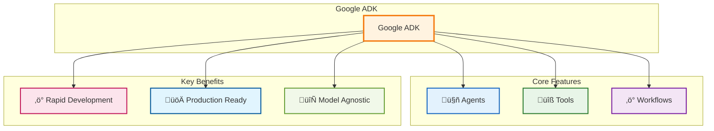

# Create a Simple Agent with Google ADK for the Impatient: From Novice to Practitioner in Record Time

_"The best time to plant a tree was 20 years ago. The second best time is now."_ - This ancient Chinese proverb perfectly captures why you should start building AI agents today, not tomorrow.

## Why Your Future Depends on AI Agents (And Why ADK is Your Secret Weapon)

Picture this: It's 2019, and a small startup called OpenAI releases something called GPT-2 . Most developers shrugged it off as "another AI experiment." Fast forward to today, and those who dismissed the AI revolution are scrambling to catch up while early adopters are building million-dollar businesses with AI agents.



```mermaid
flowchart TD
    subgraph "Traditional Approach"
        A[📝 Traditional Software]
        B[⚙️ Static Rules]
        C[📊 Predictable Output]
        style A fill:#ffcccc,stroke:#d32f2f,stroke-width:2px
        style B fill:#ffcccc,stroke:#d32f2f,stroke-width:2px
        style C fill:#ffcccc,stroke:#d32f2f,stroke-width:2px
    end

    subgraph "AI Agent Approach"
        D[🤖 AI Agents]
        E[🧠 Dynamic Reasoning]
        F[🔧 Tool Integration]
        G[🤝 Multi-Agent Coordination]
        H[✨ Adaptive Solutions]
        I[🌍 Real-World Actions]
        J[⚡ Complex Workflows]
        style D fill:#ccffcc,stroke:#388e3c,stroke-width:2px
        style E fill:#e8f5e8,stroke:#2e7d32,stroke-width:2px
        style F fill:#e8f5e8,stroke:#2e7d32,stroke-width:2px
        style G fill:#e8f5e8,stroke:#2e7d32,stroke-width:2px
        style H fill:#ccffcc,stroke:#388e3c,stroke-width:2px
        style I fill:#ccffcc,stroke:#388e3c,stroke-width:2px
        style J fill:#ccffcc,stroke:#388e3c,stroke-width:2px
    end

    A --> B
    B --> C
    D --> E
    D --> F
    D --> G
    E --> H
    F --> I
    G --> J
```

Here's the uncomfortable truth: **Every minute you delay learning AI agent development, your competitors gain another minute of advantage** . But here's the good news – Google's Agent Development Kit (ADK) is about to level the playing field, and this tutorial will get you there faster than a caffeinated developer on a Friday deadline .

### The "Manual Car vs. Auto-Pilot Car" Analogy

Traditional software is like driving a manual car: you need to know every control, shift gears yourself, and constantly pay attention to the road. Building with AI agents using ADK is like switching to an auto-pilot car: you simply tell it your destination in plain language, and it handles the route, traffic, and driving for you—quickly and efficiently.

**Pro Tip**: The companies winning with AI aren't necessarily the ones with the biggest budgets – they're the ones who moved first and moved fast . Don't be the Blockbuster of your industry.

## What Makes Google ADK the Swiss Army Knife of Agent Development

Google's Agent Development Kit isn't just another AI framework – it's what happens when Google's internal agent-building experience meets the real world's messiness . Let me paint you a picture with a story.

### The Tale of Two Developers

Sarah tried to build a customer service agent from scratch using basic LLM APIs. Months later, she was still stuck on setup and integration problems.

Jake used Google ADK. In just a few weeks, he launched a working multi-agent system that handled real customer requests and integrated with business tools—saving time and delivering results fast.

**The difference?** ADK's "batteries-included" approach versus building from first principles .



### Why ADK Wins the Developer Experience Battle

1. **Code-First Philosophy**: Define your agents like you define classes – clean, testable, maintainable
2. **Tool Ecosystem**: Pre-built integrations for Google Search, code execution, and more
3. **Multi-Agent Orchestration**: Build agent teams that coordinate like a well-oiled machine
4. **Production-Ready**: Deploy anywhere from local development to Vertex AI Agent Engine

**Pause and Reflect**: Think about the last time you had to integrate multiple APIs. How long did it take? ADK reduces that complexity by 90% .

## Setting Up Your Modern Python Development Environment

Here's where most tutorials lose you with outdated practices . We're doing this right – modern Python development that your future self will thank you for .

### The Poetry Advantage

Forget `pip install` and `requirements.txt` – we're using Poetry, the tool that makes Python dependency management actually enjoyable .

```bash
# Install Poetry (the modern way)
curl -sSL https://install.python-poetry.org | python3 -

# Verify installation
poetry --version
```

Poetry employs deterministic dependency resolution to identify compatible package versions across all dependency chains, preventing version conflicts that commonly occur when manually managing requirements.txt files . The `poetry.lock` file records exact package versions and hashes for reproducible installations .

### Project Structure That Scales

```
intelligent-assistant/
├── pyproject.toml          # Poetry configuration
├── README.md
├── .env                    # Environment variables
├── .gitignore
├── src/
│   └── intelligent_assistant/
│       ├── __init__.py
│       ├── agents/
│       │   ├── __init__.py
│       │   └── weather_agent.py
│       ├── tools/
│       │   ├── __init__.py
│       │   └── weather_tools.py
│       └── main.py
└── tests/
    ├── __init__.py
    └── test_agents.py
```

### Quick Setup (Copy-Paste Ready)

```bash
# Create project directory
mkdir intelligent-assistant && cd intelligent-assistant

# Initialize Poetry project
poetry init --name intelligent-assistant --python "^3.9"

# Add ADK dependency
poetry add google-adk

# Add development dependencies
poetry add --group dev pytest black ruff mypy

# Create virtual environment and activate
poetry shell
```

Poetry automatically creates and isolates project-specific virtual environments, eliminating manual activation/deactivation . It detects existing Python installations and manages environment paths through the `poetry env` command family .

**Pro Tip**: Poetry automatically creates isolated virtual environments . No more "it works on my machine" problems or accidentally installing packages globally .

## Authentication: Your Keys to the AI Kingdom

Authentication is where 80% of beginners get stuck . Let's fix that with a foolproof approach.

### Google AI Studio Setup (The Fast Track)


1. **Get Your API Key** (2 minutes) :
   - Visit Google AI Studio
   - Click "Create API key"
   - Copy the key (starts with `AIza...`)
2. **Secure Configuration** :

```bash
# Create .env file
echo "GOOGLE_API_KEY=your_actual_api_key_here" > .env
echo "GOOGLE_GENAI_USE_VERTEXAI=FALSE" >> .env
```

3. **Load Environment Variables** :

```python
# src/intelligent_assistant/config.py
import os
from dotenv import load_dotenv

load_dotenv()

GOOGLE_API_KEY = os.getenv("GOOGLE_API_KEY")
USE_VERTEX_AI = os.getenv("GOOGLE_GENAI_USE_VERTEXAI", "FALSE").upper() == "TRUE"
```

### Vertex AI Setup (The Enterprise Track)

For production applications, Vertex AI offers better security, scaling, and enterprise features. The setup involves configuring IAM roles, enabling APIs, and setting up authentication.

**Quick Setup Summary:**
```bash
# Basic Vertex AI configuration
export PROJECT_ID="your-project-id"
gcloud config set project $PROJECT_ID
gcloud auth application-default login

# Environment variables
echo "GOOGLE_CLOUD_PROJECT=$PROJECT_ID" > .env
echo "GOOGLE_GENAI_USE_VERTEXAI=TRUE" >> .env
```

**📖 For complete Vertex AI setup instructions**, including detailed IAM roles, API enablement, and troubleshooting, see: **[How to Configure Vertex AI for ADK](30_how_to_configure_vertex_ai_for_adk.md)**

#### Step 7: Verify Your Setup

```bash
# Test Vertex AI access
gcloud ai models list --region=us-central1 --project=$PROJECT_ID

# Test ADK installation with Vertex AI
python -c "
import vertexai
from vertexai import agent_engines
print('✅ Vertex AI setup successful!')
"
```

#### Step 8: Configure Python Environment for Vertex AI

```python
# src/intelligent_assistant/config.py
import os
from dotenv import load_dotenv

load_dotenv()

# Vertex AI Configuration
GOOGLE_CLOUD_PROJECT = os.getenv("GOOGLE_CLOUD_PROJECT")
GOOGLE_CLOUD_LOCATION = os.getenv("GOOGLE_CLOUD_LOCATION", "us-central1")
USE_VERTEX_AI = os.getenv("GOOGLE_GENAI_USE_VERTEXAI", "FALSE").upper() == "TRUE"
STAGING_BUCKET = f"gs://{GOOGLE_CLOUD_PROJECT}-adk-agents"

# Initialize Vertex AI
if USE_VERTEX_AI:
    import vertexai
    vertexai.init(
        project=GOOGLE_CLOUD_PROJECT,
        location=GOOGLE_CLOUD_LOCATION,
        staging_bucket=STAGING_BUCKET
    )
```

### Troubleshooting Common Setup Issues

#### Permission Denied Errors

**Error**: `Permission denied` when running ADK commands

**Solution**: 
```bash
# Check your current permissions
gcloud auth list
gcloud config get-value project

# Re-authenticate if needed
gcloud auth application-default login
```

#### API Not Enabled Errors

**Error**: `API [aiplatform.googleapis.com] not enabled`

**Solution**:
```bash
# Enable the API and wait for propagation
gcloud services enable aiplatform.googleapis.com --project=$PROJECT_ID
sleep 30  # Wait 30 seconds for API to be fully enabled
```

#### Service Agent Not Found

**Error**: `Service agent not found` during deployment

**Solution**:
```bash
# Manually create the service agent
gcloud beta services identity create --service=aiplatform.googleapis.com --project=$PROJECT_ID

# Grant additional permissions if needed
gcloud projects add-iam-policy-binding $PROJECT_ID \
    --member="serviceAccount:service-PROJECT_NUMBER@gcp-sa-aiplatform-re.iam.gserviceaccount.com" \
    --role="roles/aiplatform.reasoningEngineServiceAgent"
```

#### Quota Exceeded Errors

**Error**: `Quota exceeded for requests`

**Solution**: Request quota increases via Google Cloud Console → IAM & Admin → Quotas

### Security Best Practices

1. **Use Least Privilege**: Only grant the minimum required roles
2. **Environment Variables**: Never hardcode project IDs or credentials
3. **Service Accounts**: For production, use dedicated service accounts instead of personal accounts
4. **Audit Logs**: Enable Cloud Audit Logs to monitor API usage

```bash
# Create a dedicated service account for production
gcloud iam service-accounts create adk-agent-sa \
    --display-name="ADK Agent Service Account" \
    --project=$PROJECT_ID

# Grant only necessary roles to the service account
gcloud projects add-iam-policy-binding $PROJECT_ID \
    --member="serviceAccount:adk-agent-sa@$PROJECT_ID.iam.gserviceaccount.com" \
    --role="roles/aiplatform.user"
```

### Regional Availability and Cost Considerations

#### Supported Regions for Vertex AI Agent Engine (June 2025)

Choose the region closest to your users for optimal performance:

- **Americas**: `us-central1` (Iowa), `us-east1` (South Carolina), `us-west1` (Oregon)
- **Europe**: `europe-west1` (Belgium), `europe-west4` (Netherlands)
- **Asia Pacific**: `asia-southeast1` (Singapore), `asia-northeast1` (Tokyo)

```bash
# Set your preferred region
export GOOGLE_CLOUD_LOCATION="us-central1"  # Recommended for tutorials
```

#### Cost Estimation

**Vertex AI Agent Engine Pricing** (as of June 2025):
- **Model Usage**: Pay per token (input/output)
  - Gemini 2.0 Flash: ~$0.075 per 1M input tokens, ~$0.30 per 1M output tokens
- **Agent Engine Hosting**: ~$0.50-2.00 per hour depending on instance size
- **Cloud Storage**: ~$0.020 per GB/month for bucket storage

**Cost Optimization Tips**:
```bash
# Use efficient model configurations
# In your agent code:
generate_content_config = types.GenerateContentConfig(
    temperature=0.1,        # Lower temperature = more deterministic
    max_output_tokens=500,  # Limit output length
    top_p=0.95,
)
```

### Alternative: Local Development vs Cloud Deployment

| Feature | Google AI Studio (Local) | Vertex AI (Cloud) |
|---------|---------------------------|-------------------|
| **Setup Complexity** | ⭐⭐ Simple | ⭐⭐⭐⭐ Advanced |
| **Cost** | Free tier available | Pay-as-you-use |
| **Production Ready** | ❌ Development only | ✅ Production ready |
| **Security** | API Key based | IAM & Service Accounts |
| **Scalability** | Limited | Auto-scaling |
| **Team Collaboration** | ❌ Individual | ✅ Team-friendly |

**Recommendation**: Start with Google AI Studio for learning, migrate to Vertex AI for production.
