# How to Configure Vertex AI for Google ADK

This guide provides instructions for setting up Vertex AI authentication and configuration for Google's Agent Development Kit (ADK).

## Overview

For production applications, Vertex AI offers better security, scaling, and enterprise features compared to Google AI Studio. This setup requires proper IAM roles, API enablement, and authentication configuration.

**📋 Navigation:**

- [🚀 Quick Start (5 minutes)](#-quick-start-5-minutes) - Get running immediately
- [📖 Detailed Setup](#-detailed-setup) - Step-by-step configuration
- [🏢 Advanced Configuration](#-advanced-configuration) - Enterprise patterns & best practices
- [🔧 Troubleshooting](#troubleshooting) - Common issues and solutions

---

## 🚀 Quick Start (5 minutes)

**For beginners who want to get started immediately:**

```bash
# 1. Set your project
export PROJECT_ID="your-project-id"
export USER_EMAIL="your-email@domain.com"

# 2. Grant essential roles (minimum permissions)
gcloud projects add-iam-policy-binding $PROJECT_ID \
    --member="user:$USER_EMAIL" \
    --role="roles/aiplatform.user"

gcloud projects add-iam-policy-binding $PROJECT_ID \
    --member="user:$USER_EMAIL" \
    --role="roles/storage.admin"

gcloud projects add-iam-policy-binding $PROJECT_ID \
    --member="user:$USER_EMAIL" \
    --role="roles/serviceusage.serviceUsageAdmin"

# 3. Enable required APIs
gcloud services enable \
    aiplatform.googleapis.com \
    storage.googleapis.com \
    --project=$PROJECT_ID

# 4. Set up authentication
gcloud auth application-default login
gcloud config set project $PROJECT_ID

# 5. Create storage bucket
export BUCKET_NAME="$PROJECT_ID-adk-agents-$(date +%s)"
gsutil mb gs://$BUCKET_NAME

# 6. Configure environment
echo "GOOGLE_CLOUD_PROJECT=$PROJECT_ID" > .env
echo "GOOGLE_CLOUD_LOCATION=us-central1" >> .env
echo "GOOGLE_GENAI_USE_VERTEXAI=TRUE" >> .env
```

**✅ You're ready to use ADK with Vertex AI!**

For production deployments, continue to the [🏢 Advanced Configuration](#-advanced-configuration) section.

---

## 📖 Detailed Setup

### Step 1: Required IAM Roles (Minimum Permissions)

To run ADK with Vertex AI, you need these **minimum IAM roles** on your Google Cloud project:

**Essential Roles:**

- **Vertex AI User** (`roles/aiplatform.user`) - Access to all Vertex AI resources
- **Storage Admin** (`roles/storage.admin`) - Manage Cloud Storage buckets for agent artifacts
- **Service Usage Admin** (`roles/serviceusage.serviceUsageAdmin`) - Enable required APIs

### IAM Roles Detailed Breakdown

| Role                    | Role ID                                | Description                                                                                                                                                                             | Purpose for ADK                                                                                                                                     |
| ----------------------- | -------------------------------------- | --------------------------------------------------------------------------------------------------------------------------------------------------------------------------------------- | --------------------------------------------------------------------------------------------------------------------------------------------------- |
| **Vertex AI User**      | `roles/aiplatform.user`                | Provides access to all Vertex AI resources including models, endpoints, training jobs, and batch prediction jobs. Allows creating, reading, updating, and deleting Vertex AI resources. | Essential for running agents, accessing Gemini models, creating reasoning engines, and deploying to Vertex AI Agent Engine.                         |
| **Storage Admin**       | `roles/storage.admin`                  | Full control over Cloud Storage buckets and objects. Includes permissions to create, delete, and manage buckets and their contents.                                                     | Required for storing agent artifacts, model files, conversation logs, and deployment packages. ADK agents need to read/write data during execution. |
| **Service Usage Admin** | `roles/serviceusage.serviceUsageAdmin` | Ability to enable and disable Google Cloud services and APIs on projects. Can view service usage and quotas.                                                                            | Needed to enable required APIs (Vertex AI, Cloud Storage, Logging, etc.) for the ADK setup process.                                                 |

```mermaid
flowchart TD
    A[ADK User] --> B{Required Permissions}
    B --> C[Vertex AI User<br/>roles/aiplatform.user]
    B --> D[Storage Admin<br/>roles/storage.admin]
    B --> E[Service Usage Admin<br/>roles/serviceusage.serviceUsageAdmin]

    C --> F[🤖 Access Gemini Models<br/>Deploy Agents<br/>Create Reasoning Engines]
    D --> G[📦 Store Agent Artifacts<br/>Manage Buckets<br/>Read/Write Data]
    E --> H[⚙️ Enable APIs<br/>View Service Usage<br/>Manage Quotas]

    style A fill:#e1f5fe,stroke:#01579b,stroke-width:2px
    style C fill:#f3e5f5,stroke:#4a148c,stroke-width:2px
    style D fill:#e8f5e8,stroke:#1b5e20,stroke-width:2px
    style E fill:#fff3e0,stroke:#e65100,stroke-width:2px
    style F fill:#f3e5f5,stroke:#4a148c,stroke-width:1px
    style G fill:#e8f5e8,stroke:#1b5e20,stroke-width:1px
    style H fill:#fff3e0,stroke:#e65100,stroke-width:1px
```



### Additional Optional Roles for Advanced Features

| Role                  | Role ID                  | Description                                                           | When Needed                                                                   |
| --------------------- | ------------------------ | --------------------------------------------------------------------- | ----------------------------------------------------------------------------- |
| **Logging Admin**     | `roles/logging.admin`    | Full access to Cloud Logging resources for viewing and managing logs. | For advanced monitoring and debugging of agent execution logs.                |
| **Monitoring Admin**  | `roles/monitoring.admin` | Full access to Cloud Monitoring resources for metrics and alerting.   | For setting up custom metrics and alerts for agent performance monitoring.    |
| **Cloud Trace Admin** | `roles/cloudtrace.admin` | Full access to Cloud Trace for distributed tracing capabilities.      | For detailed performance analysis and troubleshooting of agent request flows. |

**How to Grant These Roles:**

```bash
# Set your project and user email
export PROJECT_ID="your-project-id"
export USER_EMAIL="your-email@domain.com"

# Grant Vertex AI User role
gcloud projects add-iam-policy-binding $PROJECT_ID \
    --member="user:$USER_EMAIL" \
    --role="roles/aiplatform.user"

# Grant Storage Admin role
gcloud projects add-iam-policy-binding $PROJECT_ID \
    --member="user:$USER_EMAIL" \
    --role="roles/storage.admin"

# Grant Service Usage Admin role (to enable APIs)
gcloud projects add-iam-policy-binding $PROJECT_ID \
    --member="user:$USER_EMAIL" \
    --role="roles/serviceusage.serviceUsageAdmin"
```

### Step 2: Enable Required APIs

```bash
# Enable core required APIs
gcloud services enable \
    aiplatform.googleapis.com \
    storage.googleapis.com \
    --project=$PROJECT_ID

# Optional: Enable additional APIs for advanced features
gcloud services enable \
    logging.googleapis.com \
    monitoring.googleapis.com \
    cloudtrace.googleapis.com \
    --project=$PROJECT_ID
```



```mermaid
flowchart TD
    A[ADK Application] --> B[Vertex AI API<br/>aiplatform.googleapis.com]
    A --> C[Cloud Storage API<br/>storage.googleapis.com]
    A --> D[Cloud Logging API<br/>logging.googleapis.com]
    A --> E[Cloud Monitoring API<br/>monitoring.googleapis.com]

    B --> F[🤖 Gemini Models<br/>Agent Deployment<br/>Reasoning Engine]
    C --> G[📦 Artifact Storage<br/>Configuration Files<br/>Model Assets]
    D --> H[📋 Execution Logs<br/>Error Tracking<br/>Audit Trail]
    E --> I[📊 Performance Metrics<br/>Resource Usage<br/>Health Monitoring]

    style A fill:#e1f5fe,stroke:#01579b,stroke-width:3px
    style B fill:#f3e5f5,stroke:#4a148c,stroke-width:2px
    style C fill:#e8f5e8,stroke:#1b5e20,stroke-width:2px
    style D fill:#fff3e0,stroke:#e65100,stroke-width:2px
    style E fill:#fce4ec,stroke:#ad1457,stroke-width:2px
```

### Step 3: Set Up Authentication

```bash
# Install and authenticate gcloud CLI
gcloud auth application-default login

# Set your project
gcloud config set project $PROJECT_ID

# Verify authentication
gcloud auth list
```


### Step 4: Create Service Agent (For Vertex AI Agent Engine)

When deploying to Vertex AI Agent Engine, you need the Reasoning Engine Service Agent:

```bash
# Generate the Reasoning Engine Service Agent
gcloud beta services identity create \
    --service=aiplatform.googleapis.com \
    --project=$PROJECT_ID

# The service agent email will be:
# service-PROJECT_NUMBER@gcp-sa-aiplatform-re.iam.gserviceaccount.com
```

### Step 5: Environment Configuration

```bash
# Create .env file for Vertex AI
echo "GOOGLE_CLOUD_PROJECT=$PROJECT_ID" > .env
echo "GOOGLE_CLOUD_LOCATION=us-central1" >> .env  # Choose your preferred region
echo "GOOGLE_GENAI_USE_VERTEXAI=TRUE" >> .env
```

### Step 6: Create Cloud Storage Bucket

```bash
# Create a bucket for agent artifacts (bucket name must be globally unique)
export BUCKET_NAME="$PROJECT_ID-adk-agents-$(date +%s)"

gsutil mb gs://$BUCKET_NAME

# Verify bucket creation
gsutil ls gs://$BUCKET_NAME
```

### Python Configuration

Update your Python configuration to use Vertex AI:

```python
# src/intelligent_assistant/config.py
import os
from dotenv import load_dotenv

load_dotenv()

GOOGLE_CLOUD_PROJECT = os.getenv("GOOGLE_CLOUD_PROJECT")
GOOGLE_CLOUD_LOCATION = os.getenv("GOOGLE_CLOUD_LOCATION", "us-central1")
USE_VERTEX_AI = os.getenv("GOOGLE_GENAI_USE_VERTEXAI", "FALSE").upper() == "TRUE"
```

---

## 🏢 Advanced Configuration

This section provides enterprise-grade patterns and security best practices for production ADK deployments.

### 💡 Least Privilege Best Practices for ADK

Following the principle of least privilege is crucial for maintaining security in your ADK deployment. These tips are based on [Google Cloud IAM security best practices](https://cloud.google.com/iam/docs/using-iam-securely) and [Vertex AI access control guidelines](https://cloud.google.com/vertex-ai/docs/general/access-control).

### 🔒 Core Security Principles

| **Principle**                          | **Implementation**                                                                                                  | **ADK-Specific Guidance**                                                                                                               |
| -------------------------------------- | ------------------------------------------------------------------------------------------------------------------- | --------------------------------------------------------------------------------------------------------------------------------------- |
| **Grant Minimal Required Permissions** | Avoid basic roles (Owner, Editor, Viewer) in production environments. Use predefined roles or custom roles instead. | For ADK agents, prefer `aiplatform.user` over `aiplatform.admin` unless you need to manage Vertex AI infrastructure itself.             |
| **Use Resource-Level Access**          | Grant roles at the smallest scope needed (resource > project > folder > organization).                              | Consider granting `Storage Object Viewer` only on specific buckets containing agent artifacts rather than project-wide `Storage Admin`. |
| **Separate Service Concerns**          | Create separate service accounts for each component with different permission requirements.                         | Use different service accounts for development, testing, and production ADK deployments.                                                |
| **Time-Limited Access**                | Use conditional role bindings with expiration dates for temporary elevated access.                                  | Grant temporary `aiplatform.admin` access only during initial setup, then downgrade to `aiplatform.user`.                               |

### 🎯 Role-Specific Optimization Tips

#### Vertex AI User (`roles/aiplatform.user`)

```bash
# ✅ RECOMMENDED: Use for most ADK operations
# - Model inference and prediction
# - Agent deployment to Vertex AI Agent Engine
# - Accessing Gemini models through Vertex AI

# 🚨 AVOID: Using aiplatform.admin unless you need to:
# - Create/delete Vertex AI resources
# - Manage service configurations
# - Set up new endpoints or model deployments
```

#### Storage Admin (`roles/storage.admin`)

```bash
# 🎯 OPTIMIZATION: Replace with more specific roles when possible

# For read-only access to agent artifacts:
gcloud projects add-iam-policy-binding $PROJECT_ID \
    --member="serviceAccount:your-agent-sa@$PROJECT_ID.iam.gserviceaccount.com" \
    --role="roles/storage.objectViewer" \
    --condition="expression=resource.name.startsWith('projects/_/buckets/your-adk-bucket')"

# For write access to specific buckets only:
gcloud projects add-iam-policy-binding $PROJECT_ID \
    --member="serviceAccount:your-agent-sa@$PROJECT_ID.iam.gserviceaccount.com" \
    --role="roles/storage.objectAdmin" \
    --condition="expression=resource.name.startsWith('projects/_/buckets/your-adk-bucket')"
```

#### Service Usage Admin (`roles/serviceusage.serviceUsageAdmin`)

```bash
# 🎯 TEMPORARY USE: Only needed during initial setup
# After enabling required APIs, consider removing this role

# Alternative: Use a dedicated setup service account
gcloud iam service-accounts create adk-setup-sa \
    --display-name="ADK Setup Service Account"

# Grant minimal permissions to setup account
gcloud projects add-iam-policy-binding $PROJECT_ID \
    --member="serviceAccount:adk-setup-sa@$PROJECT_ID.iam.gserviceaccount.com" \
    --role="roles/serviceusage.serviceUsageAdmin"
```

### 🏗️ Production Deployment Patterns

#### Pattern 1: Multi-Environment Setup

```bash
# Development Environment
export DEV_SA="adk-dev-sa@$PROJECT_ID.iam.gserviceaccount.com"
gcloud projects add-iam-policy-binding $PROJECT_ID \
    --member="serviceAccount:$DEV_SA" \
    --role="roles/aiplatform.user" \
    --condition="expression=resource.name.contains('dev')"

# Production Environment (More Restrictive)
export PROD_SA="adk-prod-sa@$PROJECT_ID.iam.gserviceaccount.com"
gcloud projects add-iam-policy-binding $PROJECT_ID \
    --member="serviceAccount:$PROD_SA" \
    --role="roles/aiplatform.user" \
    --condition="expression=resource.name.contains('prod') && request.time < timestamp('2025-12-31T23:59:59Z')"
```

#### Pattern 2: Function-Specific Service Accounts

```bash
# Agent Runtime Service Account (Minimal permissions)
gcloud iam service-accounts create adk-runtime-sa \
    --display-name="ADK Agent Runtime"

gcloud projects add-iam-policy-binding $PROJECT_ID \
    --member="serviceAccount:adk-runtime-sa@$PROJECT_ID.iam.gserviceaccount.com" \
    --role="roles/aiplatform.user"

# Monitoring Service Account (Read-only access)
gcloud iam service-accounts create adk-monitor-sa \
    --display-name="ADK Monitoring"

gcloud projects add-iam-policy-binding $PROJECT_ID \
    --member="serviceAccount:adk-monitor-sa@$PROJECT_ID.iam.gserviceaccount.com" \
    --role="roles/aiplatform.viewer"
```


### 🔍 Security Monitoring & Auditing

```bash
# Set up audit logging for IAM changes
gcloud logging sinks create adk-iam-audit \
    bigquery.googleapis.com/projects/$PROJECT_ID/datasets/security_audit \
    --log-filter="protoPayload.methodName:SetIamPolicy OR protoPayload.methodName:CreateServiceAccount"

# Monitor unusual access patterns
gcloud logging read "resource.type=gce_instance AND severity>=WARNING" \
    --limit=50 --format="table(timestamp,severity,textPayload)"
```

### ⚠️ Common Security Pitfalls to Avoid

| **Pitfall**                              | **Risk**                                                  | **Solution**                                                          |
| ---------------------------------------- | --------------------------------------------------------- | --------------------------------------------------------------------- |
| Using basic roles (`Owner`, `Editor`)    | Overly broad permissions across all Google Cloud services | Use predefined roles like `aiplatform.user` and `storage.objectAdmin` |
| Project-wide Storage Admin               | Access to all buckets in the project                      | Use bucket-level permissions with conditional bindings                |
| Long-lived service account keys          | Key compromise risk                                       | Use Workload Identity Federation or Application Default Credentials   |
| Single service account for all functions | Difficult to track and limit access                       | Create function-specific service accounts                             |
| No expiration on elevated access         | Persistent security risk                                  | Use conditional bindings with time limits                             |

### 📋 Security Checklist

- [ ] **No basic roles** granted in production
- [ ] **Service accounts** used instead of user accounts for automated processes
- [ ] **Conditional bindings** applied where possible
- [ ] **Audit logging** enabled for IAM changes
- [ ] **Regular access reviews** scheduled (monthly/quarterly)
- [ ] **Service account keys** avoided in favor of Workload Identity
- [ ] **Resource-level permissions** used where supported
- [ ] **Monitoring alerts** set up for unusual access patterns

**How to Grant These Roles:**

```bash
# Set your project and user email
export PROJECT_ID="your-project-id"
export USER_EMAIL="your-email@domain.com"

# Grant Vertex AI User role
gcloud projects add-iam-policy-binding $PROJECT_ID \
    --member="user:$USER_EMAIL" \
    --role="roles/aiplatform.user"

# Grant Storage Admin role
gcloud projects add-iam-policy-binding $PROJECT_ID \
    --member="user:$USER_EMAIL" \
    --role="roles/storage.admin"

# Grant Service Usage Admin role (to enable APIs)
gcloud projects add-iam-policy-binding $PROJECT_ID \
    --member="user:$USER_EMAIL" \
    --role="roles/serviceusage.serviceUsageAdmin"
```

---

## Troubleshooting

```mermaid
flowchart TD
    A[ADK Error Encountered] --> B{Error Type?}

    B -->|Permission Denied| C[Check IAM Roles<br/>& Authentication]
    B -->|API Not Enabled| D[Enable Required<br/>APIs]
    B -->|Authentication Failed| E[Reset Application<br/>Default Credentials]
    B -->|Bucket Access Denied| F[Verify Storage<br/>Permissions]
    B -->|Deployment Failed| G[Check Agent Engine<br/>Service Account]

    C --> C1[✓ Verify gcloud auth<br/>✓ Check IAM bindings<br/>✓ Re-authenticate]
    D --> D1[✓ gcloud services enable<br/>✓ Verify APIs list<br/>✓ Check quotas]
    E --> E1[✓ gcloud auth login<br/>✓ Check project setting<br/>✓ Test token]
    F --> F1[✓ Check bucket IAM<br/>✓ Grant storage roles<br/>✓ Test access]
    G --> G1[✓ Create service agent<br/>✓ Check deployment logs<br/>✓ Monitor status]

    style A fill:#ffebee,stroke:#c62828,stroke-width:2px
    style B fill:#fff3e0,stroke:#ef6c00,stroke-width:2px
    style C fill:#e8f5e8,stroke:#2e7d32,stroke-width:2px
    style D fill:#e8f5e8,stroke:#2e7d32,stroke-width:2px
    style E fill:#e8f5e8,stroke:#2e7d32,stroke-width:2px
    style F fill:#e8f5e8,stroke:#2e7d32,stroke-width:2px
    style G fill:#e8f5e8,stroke:#2e7d32,stroke-width:2px
```



### Common Issues & Solutions

#### 🚫 Permission Denied Errors

**Problem:** `Permission denied` when running ADK operations

**Solutions:**

```bash
# 1. Check current user permissions
gcloud auth list

# 2. Verify project is set correctly
gcloud config get-value project

# 3. Check IAM roles assigned to your account
gcloud projects get-iam-policy $PROJECT_ID \
    --flatten="bindings[].members" \
    --format='table(bindings.role)' \
    --filter="bindings.members:$(gcloud config get-value account)"

# 4. Re-authenticate if needed
gcloud auth application-default login
```

#### 🔧 API Not Enabled

**Problem:** `API [aiplatform.googleapis.com] not enabled`

**Solutions:**

```bash
# Check which APIs are enabled
gcloud services list --enabled --project=$PROJECT_ID

# Enable missing APIs
gcloud services enable aiplatform.googleapis.com storage.googleapis.com --project=$PROJECT_ID

# Verify API is now enabled
gcloud services list --enabled --filter="name:aiplatform.googleapis.com" --project=$PROJECT_ID
```

#### 🔑 Authentication Issues

**Problem:** `Could not automatically determine credentials`

**Solutions:**

```bash
# 1. Set up Application Default Credentials
gcloud auth application-default login

# 2. For service accounts, set environment variable
export GOOGLE_APPLICATION_CREDENTIALS="/path/to/service-account-key.json"

# 3. For Cloud Run/GCE, ensure service account is attached
gcloud run services update your-service \
    --service-account=your-sa@project.iam.gserviceaccount.com

# 4. Test authentication
gcloud auth application-default print-access-token
```

#### 🪣 Bucket Access Issues

**Problem:** `Access denied` when accessing Cloud Storage

**Solutions:**

```bash
# 1. Check bucket permissions
gsutil iam get gs://your-bucket-name

# 2. Grant necessary permissions
gsutil iam ch user:$(gcloud config get-value account):roles/storage.objectAdmin gs://your-bucket-name

# 3. For service accounts
gsutil iam ch serviceAccount:your-sa@project.iam.gserviceaccount.com:roles/storage.objectAdmin gs://your-bucket-name

# 4. Test access
gsutil ls gs://your-bucket-name
```

#### ⚡ Vertex AI Agent Engine Deployment Issues

**Problem:** Agent deployment fails or times out

**Solutions:**

```bash
# 1. Check if Reasoning Engine Service Agent exists
gcloud beta services identity create --service=aiplatform.googleapis.com --project=$PROJECT_ID

# 2. Verify agent engine quotas
gcloud compute project-info describe --project=$PROJECT_ID

# 3. Check deployment logs
gcloud logging read "resource.type=vertex_ai_reasoning_engine AND severity>=ERROR" \
    --project=$PROJECT_ID --limit=10

# 4. Monitor deployment status
gcloud ai reasoning-engines list --region=us-central1 --project=$PROJECT_ID
```

### Advanced Troubleshooting

#### 🔍 Debugging with Cloud Logging

```bash
# Search for ADK-related errors
gcloud logging read "resource.type=vertex_ai_reasoning_engine OR resource.type=cloud_run_revision" \
    --project=$PROJECT_ID \
    --filter="severity>=ERROR AND timestamp>=\"2025-06-20T00:00:00Z\"" \
    --limit=50

# Monitor real-time logs
gcloud logging tail "resource.type=vertex_ai_reasoning_engine" --project=$PROJECT_ID
```

#### 🧪 Testing Connectivity

```bash
# Test Vertex AI API connectivity
curl -H "Authorization: Bearer $(gcloud auth application-default print-access-token)" \
    https://aiplatform.googleapis.com/v1/projects/$PROJECT_ID/locations/us-central1/models

# Test storage connectivity
curl -H "Authorization: Bearer $(gcloud auth application-default print-access-token)" \
    https://storage.googleapis.com/storage/v1/b?project=$PROJECT_ID
```

#### 📊 Performance Diagnostics

```bash
# Check quota usage
gcloud compute project-info describe --project=$PROJECT_ID

# Monitor API usage
gcloud logging read "protoPayload.serviceName=aiplatform.googleapis.com" \
    --project=$PROJECT_ID \
    --format="table(timestamp,protoPayload.methodName,protoPayload.status.code)"

# Check billing status
gcloud billing accounts list
gcloud billing projects describe $PROJECT_ID
```

### Verification Commands

```bash
# Complete system verification script
#!/bin/bash
echo "🔍 ADK Vertex AI Configuration Verification"

# Check project configuration
echo "Project: $(gcloud config get-value project)"
echo "Account: $(gcloud config get-value account)"

# Verify APIs are enabled
echo "✅ Checking APIs..."
gcloud services list --enabled --filter="name:aiplatform.googleapis.com OR name:storage.googleapis.com" --project=$PROJECT_ID

# Test authentication
echo "🔑 Testing authentication..."
if gcloud auth application-default print-access-token > /dev/null 2>&1; then
    echo "✅ Authentication successful"
else
    echo "❌ Authentication failed"
fi

# Check IAM permissions
echo "👤 Checking IAM permissions..."
gcloud projects get-iam-policy $PROJECT_ID \
    --flatten="bindings[].members" \
    --format='table(bindings.role)' \
    --filter="bindings.members:$(gcloud config get-value account)"

# Test Vertex AI access
echo "🤖 Testing Vertex AI access..."
if gcloud ai models list --region=us-central1 --project=$PROJECT_ID > /dev/null 2>&1; then
    echo "✅ Vertex AI access successful"
else
    echo "❌ Vertex AI access failed"
fi

echo "🎉 Verification complete!"
```

---

## Security Best Practices

### Production Security Checklist

- [ ] **Remove temporary permissions** after initial setup
- [ ] **Use service accounts** for automated processes
- [ ] **Implement least privilege** access patterns
- [ ] **Rotate credentials** regularly
- [ ] **Monitor usage** through Cloud Logging
- [ ] **Set up billing alerts** to avoid unexpected costs
- [ ] **Enable audit logging** for compliance
- [ ] **Review access** monthly/quarterly

### Quick Security Commands

```bash
# Remove Service Usage Admin role after setup (if no longer needed)
gcloud projects remove-iam-policy-binding $PROJECT_ID \
    --member="user:$USER_EMAIL" \
    --role="roles/serviceusage.serviceUsageAdmin"

# Set up billing alert
gcloud alpha billing budgets create \
    --billing-account=$BILLING_ACCOUNT_ID \
    --display-name="ADK Vertex AI Budget" \
    --budget-amount=100USD \
    --threshold-rule=percent=90,basis=CURRENT_SPEND
```

---

## Next Steps

### For Beginners

1. **Test your setup** with a simple ADK agent example
2. **Explore ADK documentation** for available features
3. **Start with basic use cases** before scaling up
4. **Join the community** for support and best practices

### For Advanced Users

1. **Implement enterprise security patterns** from the Advanced Configuration section
2. **Set up CI/CD pipelines** for automated deployments
3. **Configure monitoring and alerting** for production workloads
4. **Plan multi-project architecture** for larger organizations
5. **Implement cost optimization** strategies

### Recommended Learning Path


---

## Resources

### Essential Documentation

- [Vertex AI Documentation](https://cloud.google.com/vertex-ai/docs) - Official Vertex AI guide
- [ADK Documentation](https://google.github.io/adk-docs/) - Agent Development Kit docs
- [IAM Best Practices](https://cloud.google.com/iam/docs/using-iam-securely) - Security guidelines
- [Cloud Storage Setup](https://cloud.google.com/storage/docs/quickstart) - Storage configuration

### Advanced Resources

- [Vertex AI Agent Engine](https://cloud.google.com/vertex-ai/docs/agent-engine) - Advanced agent deployment
- [Workload Identity Federation](https://cloud.google.com/iam/docs/workload-identity-federation) - Keyless authentication
- [VPC Service Controls](https://cloud.google.com/vpc-service-controls/docs) - Network security
- [Binary Authorization](https://cloud.google.com/binary-authorization/docs) - Container security

### Community & Support

- [Google Cloud Community](https://www.googlecloudcommunity.com/) - Community discussions
- [Stack Overflow](https://stackoverflow.com/questions/tagged/google-vertex-ai) - Technical Q&A
- [GitHub Discussions](https://github.com/google/adk/discussions) - ADK-specific discussions
- [Google Cloud Support](https://cloud.google.com/support) - Official support channels

### Tools & Utilities

- [gcloud CLI](https://cloud.google.com/sdk/gcloud) - Command-line interface
- [Cloud Console](https://console.cloud.google.com/) - Web interface
- [Terraform Provider](https://registry.terraform.io/providers/hashicorp/google/latest) - Infrastructure as Code
- [Cloud Monitoring](https://cloud.google.com/monitoring/dashboards) - Monitoring and dashboards

---

## Appendix

### Environment Variables Reference

```bash
# Core Configuration
GOOGLE_CLOUD_PROJECT=your-project-id
GOOGLE_CLOUD_LOCATION=us-central1
GOOGLE_GENAI_USE_VERTEXAI=TRUE

# Authentication (if using service account key - not recommended for production)
GOOGLE_APPLICATION_CREDENTIALS=/path/to/service-account-key.json

# Optional Configuration
GOOGLE_CLOUD_QUOTA_PROJECT=your-quota-project-id
GOOGLE_CLOUD_UNIVERSE_DOMAIN=googleapis.com
```

### IAM Roles Quick Reference

| Use Case               | Recommended Role                        | Alternative                           |
| ---------------------- | --------------------------------------- | ------------------------------------- |
| **Development**        | `aiplatform.user`                       | Custom role with minimal permissions  |
| **Production Runtime** | `aiplatform.user`                       | Custom role with specific permissions |
| **CI/CD Pipeline**     | Service account with `aiplatform.user`  | Workload Identity Federation          |
| **Monitoring**         | `aiplatform.viewer`                     | `monitoring.viewer`                   |
| **Storage Access**     | `storage.objectAdmin` (bucket-specific) | `storage.objectViewer` (read-only)    |

### Cost Optimization Tips

1. **Use regional endpoints** to reduce latency and costs
2. **Implement request batching** where possible
3. **Set up billing alerts** at 50%, 75%, and 90% thresholds
4. **Monitor unused resources** regularly
5. **Use committed use discounts** for predictable workloads
6. **Implement auto-scaling** for variable workloads

---

## Author

### Raphaël MANSUY

- Website: [Elitizon](https://www.elitizon.com)
- LinkedIn: [Raphaël Mansuy](https://www.linkedin.com/in/raphaelmansuy/)

---

_Last updated: June 2025_
