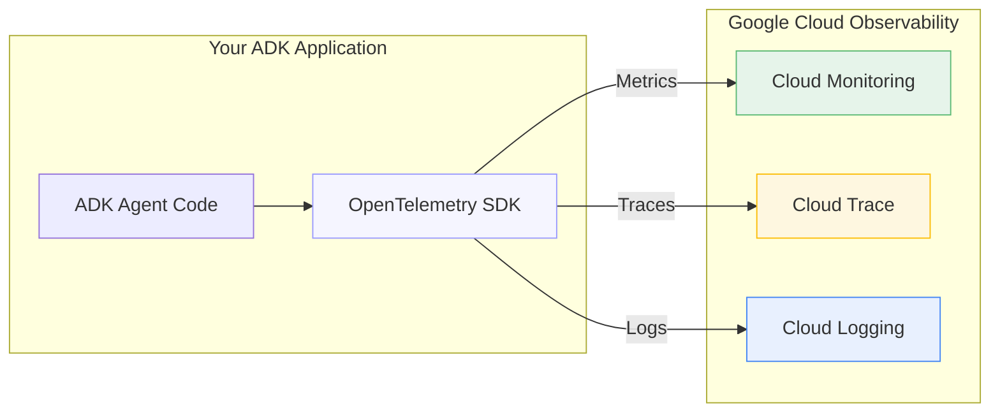

# ADK Observability: Monitoring, Tracing, and Security for Production Agents

## Table of Contents

- [Prerequisites](#prerequisites)
- [Overview](#overview)
- [Understanding Observability: Metrics, Logs, and Traces](#understanding-observability-metrics-logs-and-traces)
- [⚡ Quick Wins Path (5 Minutes)](#-quick-wins-path-5-minutes)
- [🏢 Production Path](#-production-path)
- [Observability for ADK Agents on Cloud Run](#observability-for-adk-agents-on-cloud-run)
- [Best Practices for All Deployments](#best-practices-for-all-deployments)
- [Quotas, Limits, and Retention](#quotas-limits-and-retention)
- [Troubleshooting Guide](#troubleshooting-guide)
- [References and Additional Resources](#references-and-additional-resources)

## Prerequisites

Before starting with this guide, ensure you have:

### Required Setup

- [ ] **Google Cloud Project** with billing enabled
- [ ] **Python 3.9+** installed locally
- [ ] **Google Cloud CLI** (`gcloud`) installed and configured
- [ ] **Project Editor or Owner** permissions (or specific IAM roles listed below)

### Required IAM Permissions

For Quick Wins Path:

- `roles/monitoring.viewer` - View monitoring dashboards
- `roles/cloudtrace.user` - View trace data

For Production Path:

- `roles/monitoring.admin` - Configure custom metrics and alerts
- `roles/cloudtrace.admin` - Configure trace settings
- `roles/logging.admin` - Configure log-based metrics
- `roles/iam.serviceAccountAdmin` - Manage service accounts

### Dependencies Installation

```bash
# Core dependencies for ADK observability
pip install google-cloud-monitoring>=2.15.1
pip install google-cloud-trace>=1.13.0
pip install google-cloud-logging>=3.8.0
pip install opentelemetry-api>=1.20.0
pip install opentelemetry-sdk>=1.20.0
pip install opentelemetry-exporter-otlp>=1.20.0
```

### Verification

```bash
# Verify your setup
gcloud auth list
gcloud config get-value project
python --version  # Should be 3.9+
```

> **⚠️ Important:** If you don't have the required permissions, work with your GCP administrator to grant them or use a dedicated observability project.

## Overview

Observability is essential for running production-grade AI agents. With Google ADK and Vertex AI Agent Engine, you get robust, cloud-native monitoring, logging, and distributed tracing out of the box. This guide offers two paths:

- **Quick Wins Path (5 minutes)**: Get immediate visibility with built-in tools
- **Production Path**: Enterprise-grade observability with security and best practices

### Executive Summary

| Feature         | Quick Wins Path                | Production Path              |
| --------------- | ------------------------------ | ---------------------------- |
| **Setup Time**  | 5 minutes                      | 2-4 hours                    |
| **Monitoring**  | Built-in metrics               | Custom metrics + alerting    |
| **Tracing**     | Basic distributed tracing      | Advanced OpenTelemetry       |
| **Security**    | Default permissions            | Least privilege + audit logs |
| **Maintenance** | Minimal                        | Requires monitoring team     |
| **Cost**        | Low (built-in features)        | Medium (custom metrics)      |
| **Best For**    | Development, proof-of-concepts | Production, enterprise       |

### Cost Considerations

- **Quick Wins Path**: Primarily uses built-in monitoring at no additional cost
- **Production Path**: Custom metrics pricing ~$0.30 per million data points
- **Tracing**: Free tier of 2 million spans/month, then $0.20 per million spans
- **Logging**: First 50GB/month free, then $0.50 per GB

> **💡 Recommendation:** Start with Quick Wins Path for immediate value, then gradually implement Production Path features based on your specific needs.

## Observability Architecture: OpenTelemetry and Google Cloud

When implementing observability for ADK agents, understanding the relationship between OpenTelemetry and Google Cloud services is essential for effective instrumentation:



## Understanding Observability: Metrics, Logs, and Traces

Before diving into implementation, let's understand the three pillars of observability and how they work together for AI agents:

### **Metrics**

**What they are:** Numerical measurements of system behavior over time  
**When to use:**

- Performance monitoring
- Resource utilization
- Business KPIs
- Alerting thresholds

**ADK Examples:**

- Request count
- Latency percentiles
- Token usage
- Error rates

### **Logs**

**What they are:** Time-stamped records of discrete events  
**When to use:**

- Debugging
- Audit trails
- Error investigation
- Security monitoring

**ADK Examples:**

- Tool execution details
- LLM prompt/response
- Authentication events
- Error messages

### **Traces**

**What they are:** End-to-end request flows across components  
**When to use:**

- Performance bottlenecks
- Component dependencies
- Request path analysis

**ADK Examples:**

- Full agent query flow
- Tool call sequences
- LLM invocation timing
- Cross-service calls

> **🔑 Quick Tip:** Think of observability like a detective story: **Metrics** tell you something happened (system is slow), **Logs** provide clues and context (error in tool X), and **Traces** show the complete timeline and connections between events (exactly how the request flowed through your system).

Using all three together provides a complete picture of your ADK agent's behavior, enabling both proactive monitoring and effective troubleshooting.

---

## ⚡ Quick Wins Path (5 Minutes)

This path provides immediate visibility into your ADK agents with minimal configuration.

> **🎯 Success Criteria:** By the end of this section, you'll have basic monitoring, tracing, and logging working for your ADK agent.

### Progress Checklist

- [ ] Built-in monitoring enabled and verified
- [ ] Distributed tracing configured and tested
- [ ] Structured logging implemented and validated

### 1. Built-in Monitoring with Cloud Monitoring (2 minutes)

Vertex AI Agent Engine automatically exports key operational metrics to Cloud Monitoring with no additional configuration required:

```python
# No additional code needed - metrics are collected automatically
```

**Metrics available out-of-the-box:**

- **Request count**
- **Request latencies (p50, p95, p99)**
- **CPU and memory allocation**

**How to view metrics (2 minutes):**

1. Go to [Metrics Explorer](https://console.cloud.google.com/monitoring/metrics-explorer)
2. Select your project
3. Search for `Vertex AI Reasoning Engine`
4. Choose metrics like `request_count` or `request_latencies`

**✅ Validation:**

```bash
# Verify metrics are being collected
gcloud monitoring metrics list --filter="metric.type:aiplatform.googleapis.com/reasoning_engine*" --limit=5

# Expected output: List of available reasoning engine metrics
```

**❌ If no metrics appear:**

- Wait 2-3 minutes after your first agent request
- Check that your agent is actually receiving and processing requests
- Verify you're looking in the correct GCP project

### 2. Enable Distributed Tracing (1 minute)

Distributed tracing lets you analyze the end-to-end flow of agent queries, tool calls, and LLM invocations:

```python
from vertexai.preview.reasoning_engines import AdkApp
from google.adk.agents import Agent
import logging

# Configure logging for better observability
logging.basicConfig(level=logging.INFO)
logger = logging.getLogger(__name__)

try:
    agent = Agent(
        model="gemini-2.5-flash",
        name="my_agent",
        # Agent configuration...
    )

    app = AdkApp(
        agent=agent,
        enable_tracing=True,  # <--- Just add this one line!
    )

    logger.info("ADK Agent with tracing enabled successfully")

except Exception as e:
    logger.error(f"Failed to initialize ADK Agent with tracing: {e}")
    raise
```

**How to view traces (2 minutes):**

1. Go to [Trace Explorer](https://console.cloud.google.com/traces/list)
2. Select your project
3. Filter by `Vertex AI Reasoning Engine` resource
4. Inspect traces and spans for each agent query

**✅ Validation:**

```bash
# Check if tracing is working
gcloud logging read "resource.type=aiplatform.googleapis.com/ReasoningEngine" --limit=5

# Look for trace IDs in the log entries
# Example log entry should contain: "trace": "projects/PROJECT_ID/traces/TRACE_ID"
```

**❌ If no traces appear:**

- Ensure `enable_tracing=True` is set in your AdkApp configuration
- Make at least one request to your agent after enabling tracing
- Check service account has `roles/cloudtrace.agent` permission

### 3. Basic Logging (Already Working!)

All your `print()` statements and Python logging are automatically captured:

```python
import logging
import time
from typing import Dict, Any

# Configure structured logging
logging.basicConfig(
    level=logging.INFO,
    format='%(asctime)s - %(name)s - %(levelname)s - %(message)s'
)
logger = logging.getLogger(__name__)

# Standard Python print statements work automatically
def process_request(request_id: str) -> None:
    print(f"Processing request: {request_id}")

# Better: Use structured logging with extra fields
def process_request_structured(request_id: str, user_query: str) -> Dict[str, Any]:
    start_time = time.time()

    try:
        # Your ADK agent processing logic here
        result = {"response": "Agent response", "tokens_used": 150}

        duration_ms = (time.time() - start_time) * 1000

        logger.info(
            "Request processed successfully",
            extra={
                "request_id": request_id,
                "duration_ms": duration_ms,
                "tokens_used": result.get("tokens_used", 0),
                "query_length": len(user_query)
            }
        )

        return result

    except Exception as e:
        duration_ms = (time.time() - start_time) * 1000

        logger.error(
            "Request processing failed",
            extra={
                "request_id": request_id,
                "duration_ms": duration_ms,
                "error": str(e),
                "query_length": len(user_query)
            }
        )
        raise
```

**View logs:**

1. Go to [Logs Explorer](https://console.cloud.google.com/logs/query)
2. Filter by `Vertex AI Reasoning Engine` resource

**✅ Validation:**

```bash
# Test that your logs are being captured
gcloud logging read "resource.type=aiplatform.googleapis.com/ReasoningEngine" --limit=10

# You should see your print statements and logging calls in the output
```

**❌ If no logs appear:**

- Check that you're filtering by the correct resource type
- Ensure your agent is running and processing requests
- Verify logging is not disabled in your environment

### 🎉 Quick Wins Path Complete

**Congratulations!** You now have basic observability for your ADK agents. Here's what you've accomplished:

- ✅ **Monitoring**: View request counts, latencies, and resource usage
- ✅ **Tracing**: Analyze end-to-end request flows
- ✅ **Logging**: Capture application events and debug information

**Next Steps:**

- Test your observability setup by making several requests to your agent
- Create a simple dashboard in Cloud Monitoring
- Consider proceeding to the Production Path for advanced features

---

## 🏢 Production Path

For enterprise deployments requiring robust monitoring, security, and advanced observability.

> **🎯 Success Criteria:** By the end of this section, you'll have enterprise-grade observability with custom metrics, advanced security, and comprehensive alerting.

### Implementation Order (Recommended)

1. **Security & IAM Configuration** (Foundation)
2. **Advanced Monitoring** (Core metrics and alerts)
3. **OpenTelemetry Integration** (Custom instrumentation)
4. **Audit Logging** (Security monitoring)
5. **CI/CD Integration** (Automated validation)

### Production Path Checklist

- [ ] Enhanced security and IAM configured
- [ ] Custom metrics and log-based metrics implemented
- [ ] Comprehensive alerting policies created
- [ ] OpenTelemetry custom instrumentation added
- [ ] Audit logging and security monitoring enabled
- [ ] CI/CD observability testing integrated

### 1. Enhanced Security & IAM Configuration

### IAM Role Configuration for Observability

ADK agents run using the Vertex AI Reasoning Engine Service Agent (`service-PROJECT_NUMBER@gcp-sa-aiplatform-re.iam.gserviceaccount.com`).

```bash
# Grant minimal monitoring roles to the service account
gcloud projects add-iam-policy-binding $PROJECT_ID \
    --member="serviceAccount:service-$PROJECT_NUMBER@gcp-sa-aiplatform-re.iam.gserviceaccount.com" \
    --role="roles/monitoring.metricWriter"

# Grant tracing permissions
gcloud projects add-iam-policy-binding $PROJECT_ID \
    --member="serviceAccount:service-$PROJECT_NUMBER@gcp-sa-aiplatform-re.iam.gserviceaccount.com" \
    --role="roles/cloudtrace.agent"
```

### Least Privilege Security Checklist

- [ ] Use dedicated service accounts for different agent functions
- [ ] Apply resource-level access controls where possible
- [ ] Configure VPC Service Controls for sensitive deployments
- [ ] Enable audit logging for IAM changes
- [ ] Set up Secret Manager for API keys and credentials
- [ ] Schedule regular access reviews (monthly/quarterly)

### Security Best Practices

1. **Separate Monitoring Account**: Consider routing observability data to a dedicated monitoring project
2. **Data Redaction**: Configure log filters to prevent sensitive data from appearing in logs
3. **Conditional IAM Bindings**: Use time-limited access for elevated privileges
4. **Workload Identity**: Avoid using service account keys in favor of Workload Identity Federation

### 2. Advanced Monitoring Configuration

### Custom Metrics for Business KPIs

Define business-specific metrics for your agents:

```python
# Using Cloud Monitoring client libraries
from google.cloud import monitoring_v3

client = monitoring_v3.MetricServiceClient()
project_name = client.common_project_path(PROJECT_ID)

# Create a custom metric to track token usage
series = monitoring_v3.TimeSeries()
series.metric.type = "custom.googleapis.com/adk/token_usage"
series.resource.type = "aiplatform.googleapis.com/ReasoningEngine"
series.resource.labels["reasoning_engine_id"] = RESOURCE_ID
series.resource.labels["location"] = LOCATION
series.resource.labels["project_id"] = PROJECT_ID

# Add metric labels for analysis dimensions
series.metric.labels["model"] = "gemini-2.5-flash"
series.metric.labels["agent"] = "customer_service_agent"

# Add the data point
point = series.points.add()
point.value.int64_value = 2500  # Number of tokens used
now = time.time()
point.interval.end_time.seconds = int(now)
point.interval.end_time.nanos = int((now - int(now)) * 10**9)
client.create_time_series(name=project_name, time_series=[series])
```

### Log-Based Metrics for Tool Analytics

Create log-based metrics to track tool execution patterns:

1. Go to [Log-based Metrics](https://console.cloud.google.com/logs/metrics)
2. Create a counter metric named `tool_execution_count`
3. Filter: `resource.type="aiplatform.googleapis.com/ReasoningEngine" textPayload=~"Tool .* executed"`
4. Add labels to extract tool name and execution status

### Comprehensive Alerting Strategy

Set up alerts for critical conditions:

1. Go to [Alerting](https://console.cloud.google.com/monitoring/alerting)
2. Create policies for:
   - Error rate > 5% over 5 minutes
   - P95 latency > 2000ms over 10 minutes
   - Failed tool executions > 10 in 5 minutes
   - Token usage approaching quota limits

### 3. OpenTelemetry Integration

For custom agents, implement advanced tracing with OpenTelemetry:

```python
from opentelemetry import trace
from opentelemetry.sdk.trace import TracerProvider
from opentelemetry.exporter.otlp.proto.grpc.trace_exporter import OTLPSpanExporter
from opentelemetry.sdk.trace.export import BatchSpanProcessor
from opentelemetry.sdk.resources import Resource
from opentelemetry.semconv.resource import ResourceAttributes

# Configure trace provider with semantic conventions
resource = Resource.create({
    ResourceAttributes.SERVICE_NAME: "customer-service-agent",
    ResourceAttributes.DEPLOYMENT_ENVIRONMENT: "production",
})

trace.set_tracer_provider(TracerProvider(resource=resource))
tracer = trace.get_tracer(__name__)

# Configure Cloud Trace exporter
span_processor = BatchSpanProcessor(OTLPSpanExporter())
trace.get_tracer_provider().add_span_processor(span_processor)

# Instrument your tool execution
def my_custom_tool(input_data):
    with tracer.start_as_current_span("my_custom_tool") as span:
        span.set_attribute("tool.name", "my_custom_tool")
        span.set_attribute("tool.input", str(input_data))

        # Tool implementation
        result = process_data(input_data)

        span.set_attribute("tool.result", str(result))
        return result
```

### 4. Audit Logging and Security Monitoring

Enable comprehensive audit logging for security events:

```bash
# Enable audit logging for data access and admin activity
gcloud logging sinks create adk-audit \
    bigquery.googleapis.com/projects/$PROJECT_ID/datasets/security_audit \
    --log-filter="protoPayload.methodName:SetIamPolicy OR protoPayload.methodName:CreateServiceAccount"

# Create a log-based metric for security violations
gcloud logging metrics create adk-security-violations \
    --description="ADK security violations" \
    --log-filter="resource.type=aiplatform.googleapis.com/ReasoningEngine severity>=WARNING textPayload:\"security violation\""
```

Set up security dashboards and alerts:

1. Monitor unusual access patterns
2. Track authentication failures
3. Monitor service account usage
4. Set up alerts for policy violations

### 5. Observability Testing in CI/CD

Integrate observability testing into your CI/CD pipeline:

```yaml
# Example GitHub Actions workflow step
- name: Validate observability configuration
  run: |
    # Validate monitoring configuration
    python ./tests/validate_monitoring.py

    # Test custom metrics
    python ./tests/test_custom_metrics.py

    # Verify alerts are properly configured
    python ./tests/verify_alerts.py
```

---

## Best Practices for All Deployments

### Monitoring Best Practices

#### 1. **Enable tracing in production** for all agents

```python
# Always enable tracing for production deployments
app = AdkApp(
    agent=agent,
    enable_tracing=True,  # Essential for debugging and performance analysis
)
```

#### 2. **Set up alerts** for error rates and high latency

```yaml
# Example alerting policy configuration
- name: "High Error Rate"
  conditions:
    - displayName: "Error rate > 5%"
      conditionThreshold:
        filter: 'resource.type="aiplatform.googleapis.com/ReasoningEngine"'
        comparison: COMPARISON_GREATER_THAN
        thresholdValue: 0.05
  notificationChannels:
    - "projects/PROJECT_ID/notificationChannels/CHANNEL_ID"
```

#### 3. **Instrument custom tools** with proper logging and tracing

```python
import time
from opentelemetry import trace

tracer = trace.get_tracer(__name__)

def custom_tool_with_observability(input_data):
    with tracer.start_as_current_span("custom_tool") as span:
        start_time = time.time()

        span.set_attribute("tool.name", "custom_tool")
        span.set_attribute("input.size", len(str(input_data)))

        try:
            result = process_tool_logic(input_data)

            span.set_attribute("tool.success", True)
            span.set_attribute("output.size", len(str(result)))

            duration = time.time() - start_time
            logger.info(
                "Tool execution completed",
                extra={
                    "tool_name": "custom_tool",
                    "duration_ms": duration * 1000,
                    "success": True
                }
            )

            return result

        except Exception as e:
            span.set_attribute("tool.success", False)
            span.set_attribute("error.message", str(e))

            duration = time.time() - start_time
            logger.error(
                "Tool execution failed",
                extra={
                    "tool_name": "custom_tool",
                    "duration_ms": duration * 1000,
                    "error": str(e)
                }
            )
            raise
```

#### 4. **Correlate logs and traces** using trace IDs

```python
import logging
from opentelemetry import trace

class TraceContextFormatter(logging.Formatter):
    def format(self, record):
        # Add trace context to log records
        span = trace.get_current_span()
        if span:
            trace_id = span.get_span_context().trace_id
            span_id = span.get_span_context().span_id
            record.trace_id = f"{trace_id:032x}"
            record.span_id = f"{span_id:016x}"

        return super().format(record)

# Configure logging with trace context
formatter = TraceContextFormatter(
    '%(asctime)s - %(name)s - %(levelname)s - [trace_id=%(trace_id)s] - %(message)s'
)
```

#### 5. **Review dashboards regularly** to catch regressions early

**Weekly Review Checklist:**

- [ ] Check for error rate increases
- [ ] Monitor latency trends (P95, P99)
- [ ] Review token usage patterns for cost optimization
- [ ] Validate that all tools are functioning correctly
- [ ] Check for any new error patterns in logs

#### 6. **Implement proper security boundaries** between agents

```bash
# Create separate service accounts for different agent types
gcloud iam service-accounts create customer-service-agent-sa
gcloud iam service-accounts create internal-tools-agent-sa

# Grant minimal required permissions
gcloud projects add-iam-policy-binding $PROJECT_ID \
    --member="serviceAccount:customer-service-agent-sa@$PROJECT_ID.iam.gserviceaccount.com" \
    --role="roles/aiplatform.user"
```

#### 7. **Use structured logging** for machine-parseable logs

```python
import json
import logging
from typing import Dict, Any

def structured_log(level: str, message: str, **kwargs: Any) -> None:
    log_entry = {
        "timestamp": time.time(),
        "level": level,
        "message": message,
        "service": "adk-agent",
        **kwargs
    }
    print(json.dumps(log_entry))

# Usage
structured_log(
    "INFO",
    "Request processed",
    request_id="req-123",
    duration_ms=1500,
    tokens_used=200
)
```

#### 8. **Monitor token usage** to control costs

```python
def log_token_usage(model: str, prompt_tokens: int, completion_tokens: int, request_id: str):
    total_tokens = prompt_tokens + completion_tokens

    # Log for analysis
    logger.info(
        "Token usage recorded",
        extra={
            "request_id": request_id,
            "model": model,
            "prompt_tokens": prompt_tokens,
            "completion_tokens": completion_tokens,
            "total_tokens": total_tokens
        }
    )

    # Create custom metric
    create_token_usage_metric(model, total_tokens)

    # Alert if usage is high
    if total_tokens > 10000:
        logger.warning(
            "High token usage detected",
            extra={"request_id": request_id, "total_tokens": total_tokens}
        )
```

### Observability Security Best Practices

#### Identity and Access Management

1. **Use dedicated service accounts** for each agent type
2. **Apply principle of least privilege** - grant only necessary permissions
3. **Rotate service account keys** regularly (or use Workload Identity)
4. **Monitor service account usage** for unusual patterns

#### Data Protection

1. **Redact sensitive information** from logs and traces
2. **Use Secret Manager** for API keys and credentials
3. **Enable audit logging** for all security-related events
4. **Implement data retention policies** for compliance

#### Network Security

1. **Use VPC Service Controls** for sensitive workloads
2. **Implement IP allowlisting** where appropriate
3. **Enable Private Google Access** for internal communications
4. **Monitor network traffic** for anomalies

### Performance Optimization

#### Monitoring Performance

```python
# Monitor key performance indicators
def track_performance_metrics(request_id: str, start_time: float):
    duration = time.time() - start_time

    # Log performance data
    logger.info(
        "Performance metrics",
        extra={
            "request_id": request_id,
            "total_duration_ms": duration * 1000,
            "performance_grade": get_performance_grade(duration)
        }
    )

def get_performance_grade(duration: float) -> str:
    if duration < 1.0:
        return "excellent"
    elif duration < 3.0:
        return "good"
    elif duration < 10.0:
        return "acceptable"
    else:
        return "needs_improvement"
```

#### Optimization Strategies

1. **Cache frequently used data** to reduce latency
2. **Optimize tool execution order** based on success rates
3. **Implement request batching** where appropriate
4. **Use connection pooling** for external API calls
5. **Monitor and optimize memory usage** to prevent garbage collection pauses

### Operational Excellence

#### Monitoring Maturity Levels

##### Level 1 - Basic (Quick Wins Path)

- Built-in metrics collection
- Basic tracing enabled
- Standard logging configured
- Manual dashboard reviews

##### Level 2 - Intermediate

- Custom metrics for business KPIs
- Automated alerting policies
- Log-based metrics configured
- Weekly performance reviews

##### Level 3 - Advanced (Production Path)

- Full OpenTelemetry instrumentation
- Comprehensive security monitoring
- Automated anomaly detection
- Continuous observability testing

##### Level 4 - Expert

- Predictive monitoring and alerting
- Advanced correlation analysis
- Custom observability tools
- Cross-team observability standards

#### Continuous Improvement

1. **Regular observability reviews** (monthly)
2. **Alert tuning** to reduce false positives
3. **Dashboard optimization** based on user feedback
4. **Tool performance benchmarking**
5. **Cost optimization** for observability infrastructure

## Observability for ADK Agents on Cloud Run

When deploying ADK agents to Cloud Run instead of using Vertex AI Agent Engine directly, you need a different approach to observability. Cloud Run provides its own built-in monitoring capabilities while requiring some custom configuration for advanced tracing and metrics.

### Key Differences in Observability Approach

| Vertex AI Agent Engine               | Cloud Run Deployment                                      |
| ------------------------------------ | --------------------------------------------------------- |
| Built-in metric collection           | Built-in Cloud Run metrics with option for custom metrics |
| Distributed tracing with simple flag | Automatic trace generation with optional custom spans     |
| Automatic context propagation        | W3C trace context propagation header support              |
| Uses Vertex AI service identity      | Requires custom service account configuration             |
| Higher tracing sampling rate         | Limited to 0.1 requests per second per instance           |

### 1. Metrics Collection for Cloud Run ADK Agents

Cloud Run automatically provides built-in operational metrics without any configuration required:

```python
# Cloud Run built-in metrics (no code needed)
# - Container CPU utilization
# - Container memory utilization
# - Request count and latencies
# - Container instance count
# - Maximum concurrent requests
# - Sent/received bytes
```

For ADK-specific metrics (like token usage or tool execution counts), you have two options:

1. **Use log-based metrics** (simpler approach)
   - Structure your logs to include key metrics data
   - Create log-based metrics in Cloud Monitoring
2. **Deploy an OpenTelemetry Collector sidecar** (more powerful approach):

```yaml
# service.yaml for Cloud Run deployment with OpenTelemetry sidecar
apiVersion: serving.knative.dev/v1
kind: Service
metadata:
  name: adk-agent-service
  annotations:
    run.googleapis.com/launch-stage: BETA
spec:
  template:
    metadata:
      annotations:
        run.googleapis.com/container-dependencies: "{app:[collector]}"
    spec:
      containers:
        - image: gcr.io/PROJECT_ID/adk-agent:latest
          name: app
          env:
            - name: "OTEL_EXPORTER_OTLP_ENDPOINT"
              value: "http://localhost:4317"
        - image: us-docker.pkg.dev/cloud-ops-agents-artifacts/google-cloud-opentelemetry-collector/otelcol-google:latest
          name: collector
          startupProbe:
            httpGet:
              path: /
              port: 13133
          # OpenTelemetry collector configuration
```

### 2. Distributed Tracing for Cloud Run ADK Agents

Cloud Run automatically generates traces without any instrumentation required. The standard W3C trace context propagation header (`traceparent`) is automatically populated for Cloud Run requests.

**Important note:** Automatically generated traces in Cloud Run do not result in billing charges. Cloud Run samples traces at a maximum rate of 0.1 requests per second for each instance (one request every 10 seconds).

If you need to add custom spans to measure specific ADK operations (optional):

```python
from opentelemetry import trace
from opentelemetry.sdk.trace import TracerProvider
from opentelemetry.exporter.otlp.proto.grpc.trace_exporter import OTLPSpanExporter
from opentelemetry.sdk.trace.export import BatchSpanProcessor

# Configure tracer for ADK agent on Cloud Run
tracer_provider = TracerProvider()
tracer_provider.add_span_processor(
    BatchSpanProcessor(OTLPSpanExporter(endpoint="localhost:4317"))
)
trace.set_tracer_provider(tracer_provider)
tracer = trace.get_tracer(__name__)

# Instrument ADK agent requests with custom spans
def handle_request(request):
    with tracer.start_as_current_span("adk_agent_request") as span:
        span.set_attribute("user_query", request.query)

        # ADK agent processing
        result = process_with_adk(request)

        span.set_attribute("response_tokens", len(result.text))
        return result
```

**Important:** Custom spans created through instrumentation will incur standard Cloud Trace billing charges. You only need to add this custom instrumentation if you require detailed timing information about specific operations within your ADK agent.

### 3. Service Identity and Security

When running on Cloud Run, ADK agents use Cloud Run's service identity to access Google APIs. There are two types of service accounts that can be used:

1. **User-managed service account (recommended)**: Create a dedicated service account with minimal permissions for your ADK agent.
2. **Compute Engine default service account**: Automatically provided but often has more permissions than needed.

**Important security recommendation**: Avoid using the default service account for production deployments. Instead, create a user-managed service account with only the necessary permissions:

```bash
# Create a dedicated service account for your ADK agent
gcloud iam service-accounts create adk-agent-sa \
    --description="Service account for ADK agent" \
    --display-name="ADK Agent Service Account"

# Grant necessary permissions to the service account
gcloud projects add-iam-policy-binding $PROJECT_ID \
    --member="serviceAccount:adk-agent-sa@$PROJECT_ID.iam.gserviceaccount.com" \
    --role="roles/monitoring.metricWriter"

gcloud projects add-iam-policy-binding $PROJECT_ID \
    --member="serviceAccount:adk-agent-sa@$PROJECT_ID.iam.gserviceaccount.com" \
    --role="roles/cloudtrace.agent"

# For ADK-specific permissions (e.g., for Vertex AI model access)
gcloud projects add-iam-policy-binding $PROJECT_ID \
    --member="serviceAccount:adk-agent-sa@$PROJECT_ID.iam.gserviceaccount.com" \
    --role="roles/aiplatform.user"
```

Then specify this service account when deploying your Cloud Run service:

```bash
gcloud run deploy adk-agent-service \
    --image=gcr.io/PROJECT_ID/adk-agent:latest \
    --service-account=adk-agent-sa@$PROJECT_ID.iam.gserviceaccount.com
```

### 4. Structured Logging for Cloud Run ADK Agents

Implement structured logging that works well with Cloud Logging and enables creating log-based metrics:

```python
import logging
import json
import os
import time
import uuid
import google.cloud.logging
from flask import request

# Optional: Configure Cloud Logging client
client = google.cloud.logging.Client()
client.setup_logging()

# Configure structured logging for Cloud Run
class StructuredLogFormatter(logging.Formatter):
    def format(self, record):
        log_record = {
            "severity": record.levelname,
            "message": super().format(record),
            "time": self.formatTime(record, self.datefmt),
            "service": os.environ.get("K_SERVICE", "adk-agent"),
            "revision": os.environ.get("K_REVISION", "unknown"),
        }

        # Add trace context if available
        trace_header = request.headers.get('X-Cloud-Trace-Context', '')
        if trace_header:
            trace_id = trace_header.split('/')[0]
            log_record['logging.googleapis.com/trace'] = f"projects/{os.environ.get('GOOGLE_CLOUD_PROJECT')}/traces/{trace_id}"

        # Add any extra attributes from the record
        if hasattr(record, 'extras'):
            for key, value in record.extras.items():
                log_record[key] = value

        return json.dumps(log_record)

# Set up logger
logger = logging.getLogger("adk_agent")
handler = logging.StreamHandler()
handler.setFormatter(StructuredLogFormatter())
logger.addHandler(handler)
logger.setLevel(logging.INFO)

# Example usage with context information for observability
def log_adk_event(event_type, details, trace_id=None):
    request_id = str(uuid.uuid4())
    logger.info(
        f"ADK Event: {event_type}",
        extra={
            "extras": {
                "event_type": event_type,
                "request_id": request_id,
                "details": details,
                "trace_id": trace_id,
                "timestamp_ms": int(time.time() * 1000)
            }
        }
    )
    return request_id
```

This structured logging format:

- Automatically includes service name and revision
- Links logs to traces when available
- Includes consistent fields for filtering and creating log-based metrics
- Works with Cloud Logging's built-in JSON parsing

### 5. Viewing and Dashboarding Cloud Run ADK Agent Metrics

Access your metrics through Google Cloud Monitoring:

1. Go to [Metrics Explorer](https://console.cloud.google.com/monitoring/metrics-explorer)
2. Select resource type: `Cloud Run Revision`
3. Browse available metrics:
   - Request count
   - Request latencies
   - Container CPU utilization
   - Container memory utilization
   - Instance count
   - Network sent/received bytes

For custom metrics created with OpenTelemetry:

1. Select resource type: `Prometheus Target`
2. Browse your custom metrics (like token usage, tool execution counts, etc.)

For log-based metrics:

1. Look under the "Logging Metrics" section in Metrics Explorer
2. Select the log-based metrics you've created

Create custom dashboards specifically for ADK agent monitoring:

1. Go to [Dashboards](https://console.cloud.google.com/monitoring/dashboards)
2. Create a new dashboard with these recommended panels:

   **Operational Health:**

   - Request volume (requests/min)
   - Error rate (% of total requests)
   - P50/P95/P99 latency
   - Instance count

   **ADK-Specific Metrics:**

   - Token usage by model
   - Tool execution count by tool type
   - Success rate by tool
   - Response generation time

   **Resource Utilization:**

   - CPU utilization
   - Memory utilization
   - Network traffic

You can also set up alerts based on these metrics, for example:

- High error rates (>5%)
- Elevated P95 latency (>2s)
- Excessive token usage
- Abnormal tool failure rates

---

## Quotas, Limits, and Retention

Understanding the limitations of observability tools is crucial for proper planning and implementation:

### Vertex AI Agent Engine

- **Trace Data Retention**: Cloud Trace stores data for 30 days
- **Trace API Limits**:
  - Maximum 1,000 spans per trace
  - Maximum trace size: 50 MB
  - Maximum 32 attributes per span

### Cloud Run

- **Trace Sampling Rate**: Maximum 0.1 requests per second per instance (one request every 10 seconds)
- **Custom Metrics**: No charge for built-in metrics on Cloud Run
- **Trace Data Retention**: 30 days, same as all Cloud Trace data

### Monitoring Quotas

- **API Read Operations**: 300 per 60 seconds across all read operations
- **API Write Operations**: 4,800 per 60 seconds across all write operations
- **Ingested Spans**: 3-5 billion per day (depending on your account)

### Managing Quotas

You can monitor your quota usage in the Google Cloud console:

1. Go to [IAM & Admin > Quotas](https://console.cloud.google.com/iam-admin/quotas)
2. Filter by service: "Cloud Trace API" or "Monitoring API"
3. View your current usage and limits

For production systems, consider:

- Creating alerting policies on quota usage
- Implementing sampling strategies for high-volume systems
- Requesting quota increases for critical workloads

## Troubleshooting Guide

### Common Issues and Solutions

#### 1. **No Metrics Showing in Cloud Monitoring**

**Symptoms:**

- Metrics Explorer shows no data for your ADK agent
- Dashboards are empty

**Solutions:**

```bash
# Check if your agent is running and receiving requests
gcloud logging read "resource.type=aiplatform.googleapis.com/ReasoningEngine" --limit=10

# Verify service account permissions
gcloud projects get-iam-policy $PROJECT_ID --format="table(bindings.role,bindings.members)"

# Check quota usage
gcloud logging metrics list --filter="name:*adk*"
```

**Most Common Causes:**

- Service account missing `roles/monitoring.metricWriter` permission
- Agent not receiving any requests (no activity to monitor)
- Wrong resource type filter in Metrics Explorer

#### 2. **Traces Not Appearing in Cloud Trace**

**Symptoms:**

- Trace Explorer shows no traces
- `enable_tracing=True` not working

**Solutions:**

```python
# Verify tracing is properly enabled
import os
print(f"Tracing enabled: {os.environ.get('ENABLE_TRACING', 'not set')}")

# Check service account permissions
# gcloud projects add-iam-policy-binding $PROJECT_ID \
#     --member="serviceAccount:your-service-account@project.iam.gserviceaccount.com" \
#     --role="roles/cloudtrace.agent"
```

**Most Common Causes:**

- Service account missing `roles/cloudtrace.agent` permission
- Tracing not enabled in the ADK app configuration
- Low traffic volume (traces are sampled)

#### 3. **Permission Denied Errors**

**Symptoms:**

- `403 Forbidden` errors in logs
- "Permission denied" when accessing monitoring APIs

**Solutions:**

```bash
# Check current authenticated user
gcloud auth list

# Verify project configuration
gcloud config get-value project

# Check service account key (if using one)
export GOOGLE_APPLICATION_CREDENTIALS="/path/to/your/service-account-key.json"

# Test API access
gcloud monitoring metrics list --limit=1
```

**Most Common Causes:**

- Wrong Google Cloud project selected
- Service account key not configured
- Insufficient IAM permissions

#### 4. **High Latency or Performance Issues**

**Symptoms:**

- Agent responses are slow
- High P95/P99 latencies in monitoring

**Debugging Steps:**

```python
# Add performance logging to your agent
import time
import logging

logger = logging.getLogger(__name__)

def timed_agent_call(query):
    start_time = time.time()

    try:
        result = your_agent.process(query)
        duration = time.time() - start_time

        logger.info(f"Agent call completed", extra={
            "duration_ms": duration * 1000,
            "query_length": len(query),
            "response_length": len(result.text) if result else 0
        })

        return result
    except Exception as e:
        duration = time.time() - start_time
        logger.error(f"Agent call failed", extra={
            "duration_ms": duration * 1000,
            "error": str(e)
        })
        raise
```

**Investigation Areas:**

- Tool execution times
- LLM model response times
- Network latency to external APIs
- Resource allocation (CPU/memory)

#### 5. **Missing Log Entries**

**Symptoms:**

- Expected log entries not appearing in Cloud Logging
- Structured logging not working

**Solutions:**

```python
# Verify logging configuration
import logging
import sys

# Check log level
print(f"Root logger level: {logging.getLogger().level}")
print(f"Handlers: {logging.getLogger().handlers}")

# Test logging with different levels
logging.debug("Debug message - should not appear by default")
logging.info("Info message - should appear")
logging.warning("Warning message - should appear")
logging.error("Error message - should appear")

# For Cloud Run, ensure JSON logging
import json
import os

def structured_log(message, severity="INFO", **kwargs):
    log_entry = {
        "message": message,
        "severity": severity,
        "timestamp": time.time(),
        "service": os.environ.get("K_SERVICE", "adk-agent"),
        **kwargs
    }
    print(json.dumps(log_entry))
```

#### 6. **OpenTelemetry Integration Problems**

**Symptoms:**

- Custom spans not appearing
- OpenTelemetry errors in logs

**Solutions:**

```python
# Verify OpenTelemetry configuration
from opentelemetry import trace
from opentelemetry.sdk.trace import TracerProvider

# Check if tracer provider is configured
tracer_provider = trace.get_tracer_provider()
print(f"Tracer provider: {type(tracer_provider)}")

# Test span creation
tracer = trace.get_tracer(__name__)
with tracer.start_as_current_span("test_span") as span:
    span.set_attribute("test", "value")
    print("Test span created successfully")
```

### Diagnostic Commands Reference

#### Quick Health Check

```bash
# Check service status
gcloud run services list --filter="name:your-agent"

# Check recent logs
gcloud logging read "resource.type=cloud_run_revision" --limit=20

# Check metrics availability
gcloud monitoring metrics list --filter="metric.type:run.googleapis.com"
```

#### Performance Investigation

```bash
# Check latency metrics
gcloud monitoring metrics list --filter="metric.type:run.googleapis.com/request_latencies"

# Check error rates
gcloud monitoring metrics list --filter="metric.type:run.googleapis.com/request_count"

# Check resource utilization
gcloud monitoring metrics list --filter="metric.type:run.googleapis.com/container/cpu/utilizations"
```

#### Security Audit

```bash
# Check service account permissions
gcloud projects get-iam-policy $PROJECT_ID --format="table(bindings.role,bindings.members)" \
  | grep your-service-account

# Check audit logs
gcloud logging read "protoPayload.authenticationInfo.principalEmail:your-service-account@" --limit=10

# Check for security violations
gcloud logging read "severity>=WARNING" --limit=20
```

### When to Contact Support

Contact Google Cloud Support if you encounter:

1. **Persistent quota exceeded errors** despite normal usage
2. **Data loss or corruption** in monitoring systems
3. **Severe performance degradation** without obvious cause
4. **Billing discrepancies** related to observability services
5. **Service outages** affecting monitoring infrastructure

**Information to Include in Support Requests:**

- Project ID and region
- Timestamp of the issue
- Relevant log entries and error messages
- Steps to reproduce the problem
- Configuration details (sanitized)

### Additional Resources

- [Cloud Monitoring Troubleshooting](https://cloud.google.com/monitoring/support/troubleshooting)
- [Cloud Trace Troubleshooting](https://cloud.google.com/trace/docs/troubleshooting)
- [Cloud Logging Troubleshooting](https://cloud.google.com/logging/docs/troubleshooting)
- [OpenTelemetry Troubleshooting](https://opentelemetry.io/docs/reference/specification/troubleshooting/)

---

## References and Additional Resources

### Official Google Cloud Documentation

- [Vertex AI Agent Engine Monitoring](https://cloud.google.com/vertex-ai/generative-ai/docs/agent-engine/manage/monitoring)
- [Vertex AI Agent Engine Tracing](https://cloud.google.com/vertex-ai/generative-ai/docs/agent-engine/manage/tracing)
- [Cloud Trace Python Setup](https://cloud.google.com/trace/docs/setup/python)
- [OpenTelemetry Python](https://opentelemetry.io/docs/languages/python/)
- [Cloud Logging for Agents](https://cloud.google.com/vertex-ai/generative-ai/docs/agent-engine/manage/logging)
- [Managing Access for Deployed Agents](https://cloud.google.com/vertex-ai/generative-ai/docs/agent-engine/manage/access)
- [Google Cloud IAM Best Practices](https://cloud.google.com/iam/docs/using-iam-securely)
- [Cloud Run Monitoring](https://cloud.google.com/run/docs/monitoring)
- [Cloud Run Distributed Tracing](https://cloud.google.com/run/docs/trace)
- [Cloud Run OpenTelemetry Integration](https://cloud.google.com/run/docs/tutorials/custom-metrics-opentelemetry-sidecar)
- [Cloud Run Service Identity](https://cloud.google.com/run/docs/securing/service-identity)
- [OpenTelemetry Semantic Conventions for GenAI](https://opentelemetry.io/docs/specs/semconv/gen-ai/)

### Community Resources

- [OpenTelemetry Community](https://opentelemetry.io/community/)
- [Google Cloud Community](https://cloud.google.com/community)
- [Stack Overflow - Google Cloud](https://stackoverflow.com/questions/tagged/google-cloud-platform)

### Training and Certification

- [Google Cloud Observability Certification](https://cloud.google.com/learn/certification)
- [Coursera - Site Reliability Engineering](https://www.coursera.org/learn/site-reliability-engineering-slos)
- [OpenTelemetry Bootcamp](https://opentelemetry.io/docs/getting-started/)

---

## Last Updated

June 2025

## Contributors

This guide was created with input from Google Cloud engineers and the ADK community. For questions or suggestions, please open an issue in the repository.

---
