# Vertex AI & Agent Engine Observability: A Practical Guide

This tutorial provides a comprehensive, step-by-step guide to implementing robust observability for your Vertex AI Generative AI and Agent Engine applications. You'll learn how to monitor, trace, and log your AI systems to ensure reliability, optimize performance, and control costs.

## 🎯 What You'll Build

By following this guide, you will create a complete observability solution for your Vertex AI applications, featuring:

- **Live Log Streaming:** Real-time logs from your Gemini API calls and Agent Engine deployments, sent directly to Google Cloud Logging.
- **Token Usage Tracking:** Detailed monitoring of token consumption with cost estimates, provided in structured JSON logs.
- **Request Tracing:** End-to-end tracing to identify performance bottlenecks and understand request flows.
- **Custom Dashboards:** Ready-to-use dashboards in the Google Cloud Console to visualize key metrics.
- **Agent Engine Built-in Observability:** Leverage Agent Engine's automatic integration with Google Cloud's operations suite.

## 🚀 Key Outcomes

Upon completing this tutorial, you will be able to:

- **Debug AI Issues Faster:** Use correlated logs and traces to resolve problems in seconds, not hours.
- **Prevent Costly Surprises:** Proactively monitor token usage and set up alerts to avoid unexpected expenses.
- **Ensure Compliance:** Implement comprehensive audit logging to meet security and compliance requirements.
- **Optimize Performance:** Leverage detailed latency and throughput metrics to enhance application performance.
- **Scale with Confidence:** Deploy production-grade monitoring and alerting to support your applications as they grow.

## 📖 Tutorial Structure

This tutorial is divided into two main paths, allowing you to choose the level of depth that best suits your needs:

- **⚡ Quick Wins Path (5 Minutes):** Get immediate, valuable insights into your applications with minimal setup.
- **🏢 Production Path (2-4 Hours):** Implement an enterprise-ready observability solution with advanced security, custom metrics, and automated alerting.

---

## 📖 Table of Contents

<details>
<summary>Click to expand/collapse Table of Contents</summary>

- [🎯 What You'll Build](#-what-youll-build)
- [🚀 Key Outcomes](#-key-outcomes)
- [📖 Tutorial Structure](#-tutorial-structure)
- [✅ Prerequisites](#-prerequisites)
  - [Required Tools and Accounts](#required-tools-and-accounts)
  - [Required IAM Permissions](#required-iam-permissions)
  - [Cost Considerations](#cost-considerations)
  - [Dependency Installation](#dependency-installation)
  - [Verify Your Setup](#verify-your-setup)
- [🧪 Quick Environment Test (2 minutes)](#-quick-environment-test-2-minutes)
  - [Step 1: Test Your Google Cloud Setup](#step-1-test-your-google-cloud-setup)
  - [Step 2: Test Vertex AI Access](#step-2-test-vertex-ai-access)
  - [Expected Output](#expected-output)
  - [⚠️ If You See Errors](#️-if-you-see-errors)
- [🧠 Understanding Observability: Metrics, Logs, and Traces](#-understanding-observability-metrics-logs-and-traces)
  - [The Three Pillars of Observability](#the-three-pillars-of-observability)
  - [Direct LLM Generation Call Observability](#direct-llm-generation-call-observability)
- [⚡ Quick Wins Path (5 Minutes)](#-quick-wins-path-5-minutes)
  - [Option A: Direct Vertex AI Gemini Applications](#option-a-direct-vertex-ai-gemini-applications)
    - [1. Instant Logging (30 seconds) ⚡](#1-instant-logging-30-seconds-)
    - [✅ Checkpoint 1: Verify Basic Logging](#-checkpoint-1-verify-basic-logging)
    - [2. Structured Logging with Token Tracking (2 minutes) 📊](#2-structured-logging-with-token-tracking-2-minutes-)
    - [✅ Checkpoint 2: View Structured Logs](#-checkpoint-2-view-structured-logs)
    - [3. Add Tracing (3 minutes) 🔍](#3-add-tracing-3-minutes-)
    - [✅ Checkpoint 3: View Traces](#-checkpoint-3-view-traces)
  - [Option B: Agent Engine Applications](#option-b-agent-engine-applications)
    - [1. Create a Simple Agent Engine Application (10 minutes) 🛠️](#1-create-a-simple-agent-engine-application-10-minutes-️)
    - [2. Deploy to Agent Engine (5 minutes) 🚀](#2-deploy-to-agent-engine-5-minutes-)
    - [3. Test the Deployed Agent](#3-test-the-deployed-agent)
    - [✅ Checkpoint 4: View Agent Engine Observability](#-checkpoint-4-view-agent-engine-observability)
    - [Key Benefits of Agent Engine Observability](#key-benefits-of-agent-engine-observability)
- [🏢 Production Path (2-4 Hours)](#-production-path-2-4-hours)
  - [Custom Dashboards and Alerts](#custom-dashboards-and-alerts)
  - [Security and Compliance](#security-and-compliance)
  - [Cost Optimization](#cost-optimization)
- [Advanced Observability with OpenTelemetry and Datadog](#advanced-observability-with-opentelemetry-and-datadog)
  - [OpenTelemetry Architecture with Google Cloud](#opentelemetry-architecture-with-google-cloud)
  - [Multi-Platform Observability with Datadog](#multi-platform-observability-with-datadog)
  - [Exporting to Datadog: Two Primary Approaches](#exporting-to-datadog-two-primary-approaches)
    - [Approach 1: OpenTelemetry Collector with Datadog Exporter](#approach-1-opentelemetry-collector-with-datadog-exporter)
    - [Approach 2: Datadog Agent with OTLP Ingestion](#approach-2-datadog-agent-with-otlp-ingestion)
  - [Recommendations](#recommendations)
- [📚 References and Additional Resources](#-references-and-additional-resources)
  - [Google Cloud Documentation](#google-cloud-documentation)
  - [OpenTelemetry](#opentelemetry)
  - [Third-Party Integrations](#third-party-integrations)
  - [Code and Libraries](#code-and-libraries)

</details>

---

## ✅ Prerequisites

<details>
<summary>Click to expand/collapse Prerequisites</summary>

Before you begin, ensure you have the following set up:

### Required Tools and Accounts

- [ ] **Google Cloud Project:** You need a Google Cloud project with billing enabled.
- [ ] **Python:** Python 3.11 or higher must be installed on your local machine (Python 3.9+ is supported, but 3.11+ is recommended for optimal performance).
- [ ] **Google Cloud CLI:** The `gcloud` command-line tool should be installed and configured.
- [ ] **Permissions:** You need "Editor" or "Owner" permissions for the project, or a custom role with the necessary permissions.

### Required IAM Permissions

For the **Quick Wins Path**, you will need the following IAM roles:

- `roles/monitoring.viewer`: Allows you to view monitoring dashboards.
- `roles/cloudtrace.user`: Allows you to view trace data.

For the **Production Path**, you will also need these roles:

- `roles/monitoring.admin`: Allows you to configure custom metrics and alerts.
- `roles/cloudtrace.admin`: Allows you to configure trace settings.
- `roles/logging.admin`: Allows you to configure log-based metrics.
- `roles/iam.serviceAccountAdmin`: Allows you to manage service accounts.

### Cost Considerations

While many services used in this tutorial have a generous free tier, be aware of potential costs as you scale:

- **Vertex AI:** Pricing is based on token usage. See the [official pricing page](https://cloud.google.com/vertex-ai/pricing) for details.
- **Cloud Run:** You are charged for CPU and memory consumed by your container instances.
- **Cloud Logging/Monitoring/Tracing:** These services have free monthly allotments. Costs are incurred for data ingested or stored beyond the free tier.

> **💡 Recommendation:** Always set up budget alerts in your Google Cloud project to avoid unexpected charges.

### Dependency Installation

Install the required Python libraries by running the following command:

```bash
pip install google-genai>=1.21.0 \
            google-cloud-aiplatform>=1.71.0 \
            google-cloud-monitoring>=2.15.1 \
            google-cloud-trace>=1.13.0 \
            google-cloud-logging>=3.8.0 \
            opentelemetry-api>=1.20.0 \
            opentelemetry-sdk>=1.20.0 \
            opentelemetry-exporter-otlp>=1.20.0 \
            opentelemetry-instrumentation-flask>=0.41b0 \
            flask>=3.0.0 \
            gunicorn>=22.0.0 \
            langchain>=0.1.0 \
            langchain-google-vertexai>=2.0.0
```

> **📝 Important:** The Google Gen AI SDK (`google-genai`) replaces the deprecated `vertexai.generative_models` module. The Vertex AI generative models are deprecated as of June 2025 and will be removed in June 2026. For agents, we use the Vertex AI Agent Engine (formerly Reasoning Engine) which provides a managed runtime for deploying agents built with LangChain, LangGraph, and other frameworks.

### Verify Your Setup

Run the following commands to ensure your environment is correctly configured:

```bash
gcloud auth list
gcloud config get-value project
python --version
```

> **⚠️ Important:** If you do not have the required permissions, please work with your GCP administrator to have them granted. Alternatively, you can use a dedicated project for this tutorial where you have full access.

</details>

---

## 🧪 Quick Environment Test (2 minutes)

Before diving into the full tutorial, let's verify your environment is ready with a simple test.

### Step 1: Test Your Google Cloud Setup

Create a file named `test_setup.py` and run it to ensure your local environment can authenticate and connect to Google Cloud observability services.

```python
# test_setup.py
import google.cloud.logging
import google.cloud.monitoring_v3
import google.cloud.trace_v1
import sys

def test_gcp_setup():
    """Verify that GCP clients can be initialized."""
    try:
        google.cloud.logging.Client()
        print("✅ Cloud Logging client created successfully")
        google.cloud.monitoring_v3.MetricServiceClient()
        print("✅ Cloud Monitoring client created successfully")
        google.cloud.trace_v1.TraceServiceClient()
        print("✅ Cloud Trace client created successfully")
        print("\n🎉 Your environment is ready for the tutorial!")
        return True
    except Exception as e:
        print(f"❌ GCP setup test failed: {e}")
        return False

if __name__ == "__main__":
    success = test_gcp_setup()
    sys.exit(0 if success else 1)
```

```bash
python test_setup.py
```

### Step 2: Test Vertex AI Access

Next, create a file named `test_vertex_ai.py` to confirm you can access the Vertex AI Gemini API using the new Google Gen AI SDK.

```python
# test_vertex_ai.py
from google import genai
import sys

def test_vertex_ai():
    """Verify access to the Vertex AI Gemini API using Google Gen AI SDK."""
    try:
        # Create client for Vertex AI
        client = genai.Client(
            vertexai=True,
            project='your-project-id',  # Replace with your project ID
            location='us-central1'
        )
        print("✅ Google Gen AI client for Vertex AI created successfully")

        # Test Gemini API call
        response = client.models.generate_content(
            model='gemini-2.0-flash-001',
            contents='Hello!'
        )
        print("✅ Gemini API call successful")
        print(f"✅ Response received: {response.text[:40]}...")
        print(f"✅ Token usage: {response.usage_metadata.total_token_count} tokens")
        print("\n🎉 Vertex AI access is working!")
        return True
    except Exception as e:
        print(f"❌ Vertex AI test failed: {e}")
        return False

if __name__ == "__main__":
    success = test_vertex_ai()
    sys.exit(0 if success else 1)
```

```bash
python test_vertex_ai.py
```

### Expected Output

If everything is configured correctly, you should see output similar to this:

```text
✅ Cloud Logging client created successfully
✅ Cloud Monitoring client created successfully
✅ Cloud Trace client created successfully

🎉 Your environment is ready for the tutorial!

✅ Google Gen AI client for Vertex AI created successfully
✅ Gemini API call successful
✅ Response received: Hello! I am a large language model, trained by Google....
✅ Token usage: 12 tokens

🎉 Vertex AI access is working!
```

### ⚠️ If You See Errors

- **Authentication Issues:** If you see authentication errors, run `gcloud auth application-default login`.
- **Permission Issues:** Ensure your account has the required IAM roles listed in the prerequisites.
- **API Not Enabled:** If you see errors about APIs being disabled, run `gcloud services enable aiplatform.googleapis.com monitoring.googleapis.com logging.googleapis.com cloudtrace.googleapis.com`.

---

## 🧠 Understanding Observability: Metrics, Logs, and Traces

Before we dive in, let's briefly cover the three pillars of observability and how they apply to AI applications.

### The Three Pillars of Observability

```mermaid
flowchart TB
    subgraph "🔍 Observability Pillars"
        METRICS[📊 Metrics<br/>Numbers over time]
        LOGS[📋 Logs<br/>Event records]
        TRACES[🔗 Traces<br/>Request flows]
    end

    subgraph "🤖 AI Agent Example"
        REQUEST[User Query:<br/>What are your hours?]
        AGENT[ADK Agent Processing]
        TOOLS[Tool Execution]
        LLM[LLM Generation]
        RESPONSE[Agent Response]
    end

    subgraph "📈 What Each Pillar Shows"
        M_DATA[• Request count: 1,250/hour<br/>• Latency P95: 850ms<br/>• Token usage: 2,500<br/>• Error rate: 2.1%]
        L_DATA[• Query started: ID req_123<br/>• Tool get_hours executed<br/>• LLM response: 145 tokens<br/>• Query completed successfully]
        T_DATA[• Request span: 850ms<br/>• Tool span: 200ms<br/>• LLM span: 600ms<br/>• Response span: 50ms]
    end

    REQUEST --> AGENT
    AGENT --> TOOLS
    TOOLS --> LLM
    LLM --> RESPONSE

    AGENT -.->|Count, Rate, Duration| METRICS
    TOOLS -.->|Events, Errors, Details| LOGS
    REQUEST -.->|End-to-end Flow| TRACES

    METRICS --> M_DATA
    LOGS --> L_DATA
    TRACES --> T_DATA

    REQUEST --> LOGS
    RESPONSE --> LOGS


    style METRICS fill:#e6f4ea,stroke:#5bb974
    style LOGS fill:#e8f0fe,stroke:#4285f4
    style TRACES fill:#fef7e0,stroke:#fbbc04
    style M_DATA fill:#e6f4ea,stroke:#5bb974
    style L_DATA fill:#e8f0fe,stroke:#4285f4
    style T_DATA fill:#fef7e0,stroke:#fbbc04
```



### Direct LLM Generation Call Observability

For direct Vertex AI Gemini API calls, here's how the three pillars work together in practice:


---

## ⚡ Quick Wins Path (5 Minutes)

Get immediate observability for your AI applications with minimal setup. This section covers both direct Vertex AI Gemini API usage and ADK agents.

> **🎯 Success Criteria:** By the end of this section, you'll have logs, traces, and metrics working for your Generative AI applications in under 5 minutes.

### Option A: Direct Vertex AI Gemini Applications

#### 1. Instant Logging (30 seconds) ⚡

Add just three lines to your existing Gemini code to get started:

```python
# Add these 3 lines at the top of your script
import google.cloud.logging
client = google.cloud.logging.Client()
client.setup_logging()

# Your existing Gemini code works unchanged with the new Google Gen AI SDK
from google import genai
import logging

logger = logging.getLogger(__name__)

def generate_content(prompt: str):
    try:
        # Create client for Vertex AI using the new Google Gen AI SDK
        client = genai.Client(
            vertexai=True,
            project='your-project-id',  # Replace with your project ID
            location='us-central1'
        )

        response = client.models.generate_content(
            model='gemini-2.0-flash-001',
            contents=prompt
        )

        # This log will automatically appear in Cloud Logging
        logger.info(f"Generated response with {response.usage_metadata.total_token_count} tokens")
        return response.text

    except Exception as e:
        logger.error(f"Generation failed: {e}")
        raise

# Test it
result = generate_content("Write a short poem about observability")
print(result)
```

#### ✅ Checkpoint 1: Verify Basic Logging

1. **Run the code** and make a few requests.
2. **Go to the [Logs Explorer](https://console.cloud.google.com/logs/query)** in the Google Cloud Console.
3. Look for your logs under the "Global" resource type.
4. Filter by severity using the query `severity>=INFO`.

You should see log entries similar to this:

```text
2025-06-25 10:30:15  INFO  Generated response with 156 tokens
```

**🚨 Not seeing logs?**

- Check that your project ID is correct: `gcloud config get-value project`
- Verify that authentication is working: `gcloud auth list`
- Ensure the Cloud Logging API is enabled: `gcloud services list --enabled | grep logging`

#### 2. Structured Logging with Token Tracking (2 minutes) 📊

Enhance your logging with structured JSON payloads to track token usage and other metadata:

```python
import google.cloud.logging
import json
import time
from google import genai

# Setup Cloud Logging
client = google.cloud.logging.Client()
client.setup_logging()

import logging
logger = logging.getLogger(__name__)

def monitored_generate_content(prompt: str, model: str = "gemini-2.0-flash-001"):
    """Generate content with comprehensive logging using Google Gen AI SDK."""
    request_id = f"req_{int(time.time() * 1000)}"
    start_time = time.time()

    # Log the request start, including the prompt
    logger.info("Gemini request started", extra={
        "json_fields": {
            "request_id": request_id,
            "event_type": "request_start",
            "prompt": prompt,
            "model": model
        }
    })

    try:
        # Create client for Vertex AI using the new Google Gen AI SDK
        client = genai.Client(
            vertexai=True,
            project='your-project-id',  # Replace with your project ID
            location='us-central1'
        )

        response = client.models.generate_content(
            model=model,
            contents=prompt
        )

        duration_ms = (time.time() - start_time) * 1000
        usage = response.usage_metadata
        completion = response.text

        # Log successful completion with structured data
        logger.info("Gemini request completed", extra={
            "json_fields": {
                "request_id": request_id,
                "event_type": "request_success",
                "model": model,
                "prompt": prompt,
                "completion": completion,
                "total_tokens": usage.total_token_count,
                "prompt_tokens": usage.prompt_token_count,
                "completion_tokens": usage.candidates_token_count,
                "latency_ms": duration_ms,
                "success": True
            }
        })

        return {
            "text": completion,
            "request_id": request_id,
            "usage": {
                "total_tokens": usage.total_token_count
            }
        }

    except Exception as e:
        duration_ms = (time.time() - start_time) * 1000

        logger.error("Gemini request failed", extra={
            "json_fields": {
                "request_id": request_id,
                "event_type": "request_error",
                "model": model,
                "prompt": prompt,
                "error": str(e),
                "latency_ms": duration_ms,
                "success": False
            }
        })
        raise

# Test with structured logging
result = monitored_generate_content("Explain machine learning in simple terms")
print(f"Generated {result['usage']['total_tokens']} tokens")
```

#### ✅ Checkpoint 2: View Structured Logs

1. Go to the **[Logs Explorer](https://console.cloud.google.com/logs/query)**.
2. Switch to the "Advanced filter" mode.
3. Use the filter `jsonPayload.event_type="request_success"`.
4. Click on a log entry to see the structured JSON payload with token counts and other metadata.

#### 3. Add Tracing (3 minutes) 🔍

Add OpenTelemetry tracing to track request flows and identify performance bottlenecks:

```bash
# Install OpenTelemetry dependencies if you haven't already
pip install opentelemetry-api opentelemetry-sdk opentelemetry-exporter-otlp opentelemetry-instrumentation-flask
```

```python
import google.cloud.logging
from opentelemetry import trace
from opentelemetry.sdk.trace import TracerProvider
from opentelemetry.sdk.trace.export import BatchSpanProcessor
from opentelemetry.exporter.otlp.proto.grpc.trace_exporter import OTLPSpanExporter
from opentelemetry.instrumentation.flask import FlaskInstrumentor

# --- Observability Setup ---
# 1. Standard Logging Setup
logging_client = google.cloud.logging.Client()
logging_client.setup_logging()

# 2. OpenTelemetry Setup
trace.set_tracer_provider(TracerProvider())
span_processor = BatchSpanProcessor(OTLPSpanExporter())
trace.get_tracer_provider().add_span_processor(span_processor)
tracer = trace.get_tracer(__name__)
# --- End Observability Setup ---

from google import genai
from flask import Flask, request, jsonify
import logging
import os
import time

logger = logging.getLogger(__name__)

app = Flask(__name__)
FlaskInstrumentor().instrument_app(app)

def traced_generate_content(prompt: str, model: str = "gemini-2.0-flash-001"):
    """Generate content with tracing and logging using Google Gen AI SDK."""
    with tracer.start_as_current_span("gemini_generation") as span:
        span.set_attribute("model", model)
        span.set_attribute("prompt", prompt)
        span.set_attribute("prompt_length", len(prompt))

        request_id = f"req_{int(time.time() * 1000)}"
        start_time = time.time()

        try:
            # Create client for Vertex AI using the new Google Gen AI SDK
            client = genai.Client(
                vertexai=True,
                project='your-project-id',  # Replace with your project ID
                location='us-central1'
            )

            response = client.models.generate_content(
                model=model,
                contents=prompt
            )

            duration_ms = (time.time() - start_time) * 1000
            usage = response.usage_metadata
            completion = response.text

            # Add span attributes, including the response
            span.set_attribute("response_text", response.text)
            span.set_attribute("total_tokens", usage.total_token_count)
            span.set_attribute("duration_ms", duration_ms)
            span.set_attribute("success", True)

            # Log with trace correlation, including prompt and response
            logger.info("Traced Gemini request completed", extra={
                "json_fields": {
                    "request_id": request_id,
                    "prompt": prompt,
                    "response_text": response.text,
                    "total_tokens": usage.total_token_count,
                    "duration_ms": duration_ms,
                    "trace_id": format(span.get_span_context().trace_id, '032x')
                }
            })

            return response.text

        except Exception as e:
            span.set_attribute("error", str(e))
            span.set_attribute("success", False)
            logger.error(f"Traced request failed: {e}")
            raise

# Test with tracing
result = traced_generate_content("What is observability?")
print(result)
```

#### ✅ Checkpoint 3: View Traces

1. Go to the **[Trace Explorer](https://console.cloud.google.com/traces/list)**.
2. Find traces with the span name "gemini_generation".
3. Click on a trace to see the full request flow, including timing and attributes.

### Option B: Agent Engine Applications

Vertex AI Agent Engine (formerly Reasoning Engine) provides a managed runtime for deploying AI agents built with frameworks like LangChain, LangGraph, and others. Agent Engine automatically integrates with Google Cloud's observability suite without requiring additional setup.

#### Key Agent Engine Observability Features

- **Automatic Integration:** Built-in logging, monitoring, and tracing with zero configuration
- **Structured Logs:** Agent logs are automatically sent to Cloud Logging with proper resource attribution
- **Built-in Metrics:** Request count, latency, CPU, and memory metrics are automatically captured
- **OpenTelemetry Support:** Native support for Cloud Trace with OpenTelemetry instrumentation
- **Dashboard Integration:** Pre-built dashboards in the Google Cloud Console

#### 1. Create a Simple Agent Engine Application (10 minutes) 🛠️

Let's create a simple agent using LangChain and deploy it to Agent Engine with built-in observability.

**Create the agent code (`langchain_agent.py`):**

```python
from typing import Union, List, Dict
import vertexai
from vertexai.preview import reasoning_engines
from langchain_core.prompts import ChatPromptTemplate
from langchain_google_vertexai import ChatVertexAI
import logging

# The Agent Engine automatically handles logging setup
logger = logging.getLogger(__name__)

class ObservableAgent:
    def __init__(self, project: str, location: str) -> None:
        self.project_id = project
        self.location = location

    def set_up(self) -> None:
        """Initialize the LangChain components."""
        system = (
            "You are a helpful assistant that answers questions "
            "about Google Cloud services. Be concise and helpful."
        )
        human = "{text}"
        prompt = ChatPromptTemplate.from_messages(
            [("system", system), ("human", human)]
        )
        chat = ChatVertexAI(
            project=self.project_id,
            location=self.location,
            model_name="gemini-2.0-flash-001"
        )
        self.chain = prompt | chat

    def query(self, question: str) -> Union[str, List[Union[str, Dict]]]:
        """Query the agent with observability logging."""
        # Agent Engine automatically adds request tracing and logging
        logger.info(f"Processing query: {question}")

        try:
            response = self.chain.invoke({"text": question})
            logger.info(f"Query completed successfully")
            return response.content
        except Exception as e:
            logger.error(f"Query failed: {str(e)}")
            raise

# Test locally first
if __name__ == "__main__":
    import os
    PROJECT_ID = os.getenv("GOOGLE_CLOUD_PROJECT", "your-project-id")

    agent = ObservableAgent(project=PROJECT_ID, location="us-central1")
    agent.set_up()
    print(agent.query("What is Vertex AI?"))
```

#### 2. Deploy to Agent Engine (5 minutes) 🚀

Deploy your agent to the managed runtime with automatic observability:

```python
import vertexai
from vertexai.preview import reasoning_engines

# Initialize Vertex AI
PROJECT_ID = "your-project-id"  # Replace with your project ID
LOCATION = "us-central1"
vertexai.init(project=PROJECT_ID, location=LOCATION)

# Deploy the agent
reasoning_engine = reasoning_engines.ReasoningEngine.create(
    ObservableAgent(project=PROJECT_ID, location=LOCATION),
    requirements=[
        "google-cloud-aiplatform[langchain,reasoningengine]",
        "langchain-google-vertexai>=2.0.0",
        "cloudpickle==3.0.0",
        "pydantic==2.7.4",
    ],
    display_name="Observable LangChain Agent",
    description="A LangChain agent with built-in observability",
)

print(f"Agent deployed: {reasoning_engine.resource_name}")
```

#### 3. Test the Deployed Agent

```python
# Query the deployed agent
response = reasoning_engine.query(
    input={"question": "What are the benefits of using Agent Engine?"}
```

#### ✅ Checkpoint 4: View Agent Engine Observability

1. **View Logs in Cloud Logging:**

   - Go to [Logs Explorer](https://console.cloud.google.com/logs/query)
   - Filter by resource type: `Vertex AI Reasoning Engine`
   - You'll see structured logs for each query automatically

2. **View Metrics in Cloud Monitoring:**

   - Go to [Metrics Explorer](https://console.cloud.google.com/monitoring/metrics-explorer)
   - Search for "Vertex AI Reasoning Engine" metrics
   - View request count, latency, CPU, and memory metrics

3. **View Traces in Cloud Trace:**
   - Go to [Trace Explorer](https://console.cloud.google.com/traces/list)
   - Find traces with spans showing LangChain execution
   - View detailed timing for each component

**Sample Log Entry:**

```json
{
  "textPayload": "Processing query: What is Vertex AI?",
  "resource": {
    "type": "aiplatform.googleapis.com/ReasoningEngine",
    "labels": {
      "location": "us-central1",
      "reasoning_engine_id": "your-engine-id",
      "resource_container": "your-project-id"
    }
  },
  "timestamp": "2025-06-25T10:30:15.123Z",
  "logName": "projects/your-project-id/logs/python"
}
```

**Built-in Metrics Available:**

- `aiplatform.googleapis.com/reasoning_engine/request_count`
- `aiplatform.googleapis.com/reasoning_engine/request_latencies`
- `aiplatform.googleapis.com/reasoning_engine/cpu/allocation_time`
- `aiplatform.googleapis.com/reasoning_engine/memory/allocation_time`

#### Key Benefits of Agent Engine Observability

- **Zero Configuration:** Observability works out-of-the-box without any additional setup
- **Managed Infrastructure:** Google handles all the observability infrastructure
- **Integrated Dashboard:** Pre-built dashboards available in Google Cloud Console
- **Automatic Resource Attribution:** All logs and metrics are properly tagged with agent information
- **Enterprise Security:** VPC-SC support and enterprise-grade security features

---

<details>
<summary>🏢 <strong>Production Path (2-4 Hours)</strong> — Enterprise Observability, Security, and Cost Optimization</summary>

The Production Path provides a comprehensive, enterprise-ready observability solution for your Vertex AI applications. This section covers custom dashboards, alerting, security, and cost optimization.

> **🎯 Success Criteria:** By the end of this section, you'll have a complete observability solution in place, including custom metrics, alerts, and production-grade security.

## </details>

### Custom Dashboards and Alerts

<details><summary>Click to expand/collapse Custom Dashboards and Alerts</summary>
Custom dashboards and alerts are crucial for proactive monitoring and quick incident response in production environments. This section provides detailed, step-by-step instructions for creating enterprise-grade monitoring solutions.

1. Custom Dashboards in Google Cloud Console

Create comprehensive dashboards that provide real-time visibility into your Vertex AI applications' performance and health.

**Step-by-Step Dashboard Creation:**

1. **Navigate to Monitoring:**

   - Go to the [Google Cloud Console](https://console.cloud.google.com/)
   - Select **Monitoring** > **Dashboards**
   - Click **Create Dashboard**

2. **Configure Dashboard Settings:**

   ```json
   {
     "displayName": "Vertex AI Observability Dashboard",
     "mosaicLayout": {
       "tiles": []
     }
   }
   ```

##### Widget 1: Request Rate and Success Rate

```json
{
  "title": "Request Rate & Success Rate",
  "xyChart": {
    "dataSets": [
      {
     "dataSets": [
        {
          "timeSeriesQuery": {
             "timeSeriesFilter": {
                "filter": "resource.type=\"aiplatform.googleapis.com/ReasoningEngine\"",
                "aggregation": {
                  "alignmentPeriod": "60s",
                  "perSeriesAligner": "ALIGN_RATE",
                  "crossSeriesReducer": "REDUCE_SUM"
                }
             }
          },
          "plotType": "LINE",
          "targetAxis": "Y1"
        }
     ],
     "timeshiftDuration": "0s",
     "yAxis": {
        "label": "Requests/sec",
        "scale": "LINEAR"
     }
  }
}
```

**Widget 2: Token Usage and Cost Tracking**

```json
{
  "title": "Token Usage & Estimated Costs",
  "xyChart": {
    "dataSets": [
      {
        "timeSeriesQuery": {
          "timeSeriesFilter": {
            "filter": "resource.type=\"global\" AND jsonPayload.total_tokens>0",
            "aggregation": {
              "alignmentPeriod": "300s",
              "perSeriesAligner": "ALIGN_SUM",
              "crossSeriesReducer": "REDUCE_SUM"
            }
          }
        },
        "plotType": "STACKED_AREA"
      }
    ]
  }
}
```

**Widget 3: Response Latency Distribution**

```json
{
  "title": "Response Latency Distribution",
  "xyChart": {
     "dataSets": [
        {
          "timeSeriesQuery":
          "timeSeriesFilter": {
            "filter": "resource.type=\"aiplatform.googleapis.com/ReasoningEngine\" AND metric.type=\"aiplatform.googleapis.com/reasoning_engine/request_latencies\"",
            "aggregation": {
              "alignmentPeriod": "60s",
              "perSeriesAligner": "ALIGN_DELTA",
              "crossSeriesReducer": "REDUCE_PERCENTILE_95"
            }
          }
        },
        "plotType": "LINE"
      }
    ]
  }
}
```

4. **Create Log-Based Metrics for Custom Tracking:**

```bash
# Create a log-based metric for token usage
gcloud logging metrics create token_usage_metric \
    --description="Track token usage from Gemini API calls" \
    --log-filter='jsonPayload.event_type="request_success" AND jsonPayload.total_tokens>0' \
    --value-extractor='EXTRACT(jsonPayload.total_tokens)'
```

#### 2. Advanced Alerting Policies

Implement multi-layered alerting to catch issues before they impact users.

##### Alert Policy 1: High Latency Detection

```yaml
# alert-policy-latency.yaml
displayName: "High Latency Alert - Vertex AI"
conditions:
  - displayName: "P95 Latency > 2 seconds"
    conditionThreshold:
      filter: 'resource.type="aiplatform.googleapis.com/ReasoningEngine"'
      comparison: COMPARISON_GT
      thresholdValue: 2000 # 2 seconds in milliseconds
      duration: 300s # 5 minutes
      aggregations:
        - alignmentPeriod: 60s
          perSeriesAligner: ALIGN_PERCENTILE_95
          crossSeriesReducer: REDUCE_MEAN
  - displayName: "Error Rate > 5%"
    conditionThreshold:
      filter: 'resource.type="global" AND jsonPayload.event_type="request_error"'
      comparison: COMPARISON_GT
      thresholdValue: 0.05 # 5%
      duration: 180s # 3 minutes
      aggregations:
        - alignmentPeriod: 60s
          perSeriesAligner: ALIGN_RATE
          crossSeriesReducer: REDUCE_SUM
  - displayName: "Daily token usage > 80% of budget"
    conditionThreshold:
      filter: 'metric.type="logging.googleapis.com/user/token_usage_metric"'
      comparison: COMPARISON_GT
      thresholdValue: 800000 # 80% of 1M token daily budget
      duration: 60s
      aggregations:
        - alignmentPeriod: 3600s # 1 hour
          perSeriesAligner: ALIGN_SUM
          crossSeriesReducer: REDUCE_SUM
```

**Create Alerts via CLI:**

```bash
# Create the high latency alert
gcloud alpha monitoring policies create --policy-from-file=alert-policy-latency.yaml

# Create notification channels
gcloud alpha monitoring channels create \
    --display-name="Production Alerts Email" \
    --type=email \
    --channel-labels=email_address=alerts@yourcompany.com

# Create PagerDuty integration for critical alerts
gcloud alpha monitoring channels create \
    --display-name="Critical Alerts PagerDuty" \
    --type=pagerduty \
    --channel-labels=service_key=YOUR_PAGERDUTY_SERVICE_KEY
```

#### 3. SLI/SLO Implementation

Define and monitor Service Level Indicators (SLIs) and Service Level Objectives (SLOs):

**SLI Definition:**

```yaml
# sli-definition.yaml
serviceLevelIndicator:
  requestBased:
    goodTotalRatio:
      goodServiceFilter: 'resource.type="aiplatform.googleapis.com/ReasoningEngine" AND jsonPayload.success=true AND jsonPayload.latency_ms<=1000'
      totalServiceFilter: 'resource.type="aiplatform.googleapis.com/ReasoningEngine"'
```

**SLO Configuration:**

```yaml
# slo-config.yaml
displayName: "99.9% availability with <1s latency"
serviceLevelObjective:
  performanceGoal:
    period: 2592000s # 30 days
    goal: 0.999 # 99.9%
```

### Security and Compliance

Security and compliance are critical in production environments. This section provides comprehensive, actionable guidance for implementing enterprise-grade security controls and meeting regulatory requirements.

#### 1. Comprehensive Access Control and Security

**IAM Role-Based Access Control (RBAC) Implementation:**

Create granular roles for different team members and services:

```bash
# Create custom roles for observability access
gcloud iam roles create observability_viewer \
    --project=your-project-id \
    --title="Observability Viewer" \
    --description="View-only access to monitoring, logging, and tracing" \
    --permissions="monitoring.dashboards.get,monitoring.dashboards.list,logging.logEntries.list,cloudtrace.traces.get,cloudtrace.traces.list"

gcloud iam roles create observability_admin \
    --project=your-project-id \
    --title="Observability Admin" \
    --description="Full access to observability configuration" \
    --permissions="monitoring.*,logging.*,cloudtrace.*"
```

**Service Account Security:**

```bash
# Create dedicated service accounts for different environments
gcloud iam service-accounts create vertex-ai-prod-sa \
    --display-name="Vertex AI Production Service Account" \
    --description="Service account for production Vertex AI workloads"

# Grant minimal required permissions
gcloud projects add-iam-policy-binding your-project-id \
    --member="serviceAccount:vertex-ai-prod-sa@your-project-id.iam.gserviceaccount.com" \
    --role="roles/aiplatform.user"

gcloud projects add-iam-policy-binding your-project-id \
    --member="serviceAccount:vertex-ai-prod-sa@your-project-id.iam.gserviceaccount.com" \
    --role="projects/your-project-id/roles/observability_viewer"
```

**VPC Service Controls Implementation:**

```json
{
  "name": "accessPolicies/policy-id/servicePerimeters/vertex-ai-perimeter",
  "title": "Vertex AI Secure Perimeter",
  "description": "Service perimeter for Vertex AI and observability services",
  "perimeterType": "PERIMETER_TYPE_REGULAR",
  "status": {
    "resources": ["projects/your-project-id"],
    "accessLevels": ["accessPolicies/policy-id/accessLevels/corporate_network"],
    "restrictedServices": [
      "aiplatform.googleapis.com",
      "monitoring.googleapis.com",
      "logging.googleapis.com",
      "cloudtrace.googleapis.com"
    ],
    "vpcAccessibleServices": {
      "enableRestriction": true,
      "allowedServices": [
        "aiplatform.googleapis.com",
        "monitoring.googleapis.com"
      ]
    }
  }
}
```

**Private Google Access Configuration:**

```bash
# Enable Private Google Access for your subnet
gcloud compute networks subnets update your-subnet \
    --region=us-central1 \
    --enable-private-ip-google-access

# Create firewall rules for secure access
gcloud compute firewall-rules create allow-vertex-ai-egress \
    --direction=EGRESS \
    --priority=1000 \
    --network=your-vpc \
    --action=ALLOW \
    --rules=tcp:443 \
    --destination-ranges=199.36.153.8/30 \
    --target-tags=vertex-ai-workload
```

#### 2. Advanced Compliance and Audit Controls

**Comprehensive Audit Logging:**

```yaml
# audit-config.yaml
auditConfigs:
  - service: aiplatform.googleapis.com
    auditLogConfigs:
      - logType: ADMIN_READ
      - logType: DATA_READ
      - logType: DATA_WRITE
  - service: monitoring.googleapis.com
    auditLogConfigs:
      - logType: ADMIN_READ
      - logType: DATA_READ
  - service: logging.googleapis.com
    auditLogConfigs:
      - logType: ADMIN_READ
      - logType: DATA_READ
```

```bash
# Apply audit configuration
gcloud logging sinks create vertex-ai-audit-sink \
    bigquery.googleapis.com/projects/your-project-id/datasets/audit_logs \
    --log-filter='protoPayload.serviceName="aiplatform.googleapis.com" OR protoPayload.serviceName="monitoring.googleapis.com" OR protoPayload.serviceName="logging.googleapis.com"' \
    --use-partitioned-tables
```

**Data Classification and Retention Policies:**

```bash
# Set up log retention policies based on compliance requirements
gcloud logging buckets update _Default \
    --location=global \
    --retention-days=2555  # 7 years for financial compliance

# Create separate buckets for different data classifications
gcloud logging buckets create pii-logs \
    --location=us-central1 \
    --retention-days=90 \  # Shorter retention for PII data
    --description="Bucket for logs containing PII data"
```

**Encryption and Key Management:**

```bash
# Create customer-managed encryption keys
gcloud kms keyrings create vertex-ai-keyring \
    --location=global

gcloud kms keys create vertex-ai-logs-key \
    --location=global \
    --keyring=vertex-ai-keyring \
    --purpose=encryption

# Configure Cloud Logging to use CMEK
gcloud logging buckets update _Default \
    --location=global \
    --cmek-kms-key-name="projects/your-project-id/locations/global/keyRings/vertex-ai-keyring/cryptoKeys/vertex-ai-logs-key"
```

#### 3. Continuous Security Monitoring

**Security Monitoring Dashboard:**

```python
# security_monitoring.py
import google.cloud.monitoring_v3 as monitoring_v3
import google.cloud.logging_v2 as logging_v2

def create_security_dashboard():
    """Create a dashboard for security monitoring."""
    client = monitoring_v3.DashboardsServiceClient()
    project_name = f"projects/{PROJECT_ID}"

    dashboard = monitoring_v3.Dashboard(
        display_name="Vertex AI Security Dashboard",
        mosaic_layout=monitoring_v3.MosaicLayout(
            tiles=[
                # Failed authentication attempts
                monitoring_v3.Tile(
                    width=6, height=4,
                    widget=monitoring_v3.Widget(
                        title="Failed Authentication Attempts",
                        xy_chart=monitoring_v3.XyChart(
                            data_sets=[
                                monitoring_v3.XyChart.DataSet(
                                    time_series_query=monitoring_v3.TimeSeriesQuery(
                                        time_series_filter=monitoring_v3.TimeSeriesQuery.TimeSeriesFilter(
                                            filter='resource.type="gce_instance" AND log_name="projects/your-project-id/logs/auth"',
                                            aggregation=monitoring_v3.Aggregation(
                                                alignment_period={"seconds": 300},
                                                per_series_aligner=monitoring_v3.Aggregation.Aligner.ALIGN_RATE,
                                                cross_series_reducer=monitoring_v3.Aggregation.Reducer.REDUCE_SUM
                                            )
                                        )
                                    )
                                )
                            ]
                        )
                    )
                ),
                # Unusual API access patterns
                monitoring_v3.Tile(
                    width=6, height=4,
                    widget=monitoring_v3.Widget(
                        title="Unusual API Access Patterns",
                        xy_chart=monitoring_v3.XyChart(
                            data_sets=[
                                monitoring_v3.XyChart.DataSet(
                                    time_series_query=monitoring_v3.TimeSeriesQuery(
                                        time_series_filter=monitoring_v3.TimeSeriesQuery.TimeSeriesFilter(
                                            filter='resource.type="aiplatform.googleapis.com/ReasoningEngine" AND jsonPayload.unusual_access=true'
                                        )
                                    )
                                )
                            ]
                        )
                    )
                )
            ]
        )
    )

    return client.create_dashboard(parent=project_name, dashboard=dashboard)
```

**Automated Security Alerts:**

```yaml
# security-alerts.yaml
displayName: "Security Alert - Unusual Activity"
conditions:
  - displayName: "Multiple Failed Authentication Attempts"
    conditionThreshold:
      filter: 'resource.type="gce_instance" AND log_name="projects/your-project-id/logs/auth" AND jsonPayload.event="auth_failure"'
      comparison: COMPARISON_GT
      thresholdValue: 10 # More than 10 failed attempts
      duration: 300s # 5 minutes
      aggregations:
        - alignmentPeriod: 60s
          perSeriesAligner: ALIGN_RATE
          crossSeriesReducer: REDUCE_SUM
          groupByFields: ["resource.labels.instance_id"]
alertStrategy:
  autoClose: 3600s # 1 hour
notificationChannels:
  - "projects/your-project/notificationChannels/security-team"
```

#### 4. Compliance Reporting and Documentation

**Automated Compliance Reporting:**

```python
# compliance_reporter.py
from google.cloud import bigquery
from google.cloud import logging_v2
import pandas as pd
from datetime import datetime, timedelta

class ComplianceReporter:
    def __init__(self, project_id):
        self.project_id = project_id
        self.bq_client = bigquery.Client()
        self.logging_client = logging_v2.Client()

    def generate_access_report(self, days_back=30):
        """Generate access report for compliance audit."""
        query = f"""
        SELECT
            timestamp,
            protoPayload.authenticationInfo.principalEmail as user_email,
            protoPayload.resourceName as resource,
            protoPayload.methodName as method,
            protoPayload.requestMetadata.callerIp as source_ip
        FROM `{self.project_id}.audit_logs.cloudaudit_googleapis_com_activity`
        WHERE timestamp >= TIMESTAMP_SUB(CURRENT_TIMESTAMP(), INTERVAL {days_back} DAY)
            AND protoPayload.serviceName = "aiplatform.googleapis.com"
        ORDER BY timestamp DESC
        """

        df = self.bq_client.query(query).to_dataframe()
        return df

    def generate_data_processing_report(self):
        """Generate data processing report for GDPR compliance."""
        query = f"""
        SELECT
            DATE(timestamp) as date,
            COUNT(*) as total_requests,
            COUNT(DISTINCT jsonPayload.user_id) as unique_users,
            SUM(CAST(jsonPayload.total_tokens AS INT64)) as total_tokens_processed
        FROM `{self.project_id}.vertex_ai_logs.vertex_ai_requests`
        WHERE timestamp >= TIMESTAMP_SUB(CURRENT_TIMESTAMP(), INTERVAL 30 DAY)
        GROUP BY DATE(timestamp)
        ORDER BY date DESC
        """

        df = self.bq_client.query(query).to_dataframe()
        return df
```

### Cost Optimization

Cost optimization ensures that your observability solution provides maximum value while remaining within budget. This section covers comprehensive strategies for monitoring, controlling, and optimizing costs across your entire Vertex AI observability stack.

#### 1. Advanced Cost Monitoring and Control

**Comprehensive Budget Management:**

```bash
# Create detailed budgets for different cost categories
gcloud billing budgets create \
    --billing-account=BILLING_ACCOUNT_ID \
    --display-name="Vertex AI Monthly Budget" \
    --budget-amount=5000 \
    --threshold-rule=percent=0.8,basis=CURRENT_SPEND \
    --threshold-rule=percent=0.9,basis=CURRENT_SPEND \
    --threshold-rule=percent=1.0,basis=CURRENT_SPEND \
    --filter-projects=your-project-id \
    --filter-services=aiplatform.googleapis.com,monitoring.googleapis.com,logging.googleapis.com
```

**Cost Breakdown and Analysis:**

```python
# cost_analyzer.py
from google.cloud import billing_v1
from google.cloud import bigquery
import pandas as pd
from datetime import datetime, timedelta

class CostAnalyzer:
    def __init__(self, project_id, billing_account_id):
        self.project_id = project_id
        self.billing_account_id = billing_account_id
        self.billing_client = billing_v1.CloudBillingServiceClient()
        self.bq_client = bigquery.Client()

    def analyze_vertex_ai_costs(self, days_back=30):
        """Analyze Vertex AI costs by service and usage pattern."""
        query = f"""
        SELECT
            service.description as service_name,
            sku.description as sku_description,
            DATE(usage_start_time) as usage_date,
            SUM(cost) as daily_cost,
            SUM(CAST(JSON_EXTRACT_SCALAR(labels, '$.token_count') AS INT64)) as token_count,
            AVG(cost / NULLIF(CAST(JSON_EXTRACT_SCALAR(labels, '$.token_count') AS INT64), 0)) as cost_per_token
        FROM `{self.project_id}.cloud_billing_export.gcp_billing_export_v1_{self.billing_account_id.replace('-', '_')}`
        WHERE service.description LIKE '%Vertex AI%'
            AND usage_start_time >= TIMESTAMP_SUB(CURRENT_TIMESTAMP(), INTERVAL {days_back} DAY)
        GROUP BY service_name, sku_description, usage_date
        ORDER BY usage_date DESC, daily_cost DESC
        """

        return self.bq_client.query(query).to_dataframe()

    def get_cost_optimization_recommendations(self):
        """Generate cost optimization recommendations."""
        # Analyze usage patterns
        usage_query = f"""
        SELECT
            EXTRACT(HOUR FROM timestamp) as hour,
            EXTRACT(DAYOFWEEK FROM timestamp) as day_of_week,
            COUNT(*) as request_count,
            AVG(CAST(jsonPayload.total_tokens AS INT64)) as avg_tokens_per_request
        FROM `{self.project_id}.vertex_ai_logs.vertex_ai_requests`
        WHERE timestamp >= TIMESTAMP_SUB(CURRENT_TIMESTAMP(), INTERVAL 7 DAY)
        GROUP BY hour, day_of_week
        ORDER BY hour, day_of_week
        """

        usage_df = self.bq_client.query(usage_query).to_dataframe()

        recommendations = []

        # Identify low-usage periods
        low_usage_threshold = usage_df['request_count'].quantile(0.25)
        low_usage_periods = usage_df[usage_df['request_count'] < low_usage_threshold]

        if not low_usage_periods.empty:
            recommendations.append({
                'type': 'scaling',
                'description': 'Consider scaling down during low-usage periods',
                'potential_savings': '15-30%',
                'periods': low_usage_periods[['hour', 'day_of_week']].to_dict('records')
            })

        return recommendations
```

**Real-time Cost Monitoring Dashboard:**

```python
# cost_dashboard.py
import google.cloud.monitoring_v3 as monitoring_v3

def create_cost_monitoring_dashboard():
    """Create a comprehensive cost monitoring dashboard."""
    client = monitoring_v3.DashboardsServiceClient()
    project_name = f"projects/{PROJECT_ID}"

    dashboard = monitoring_v3.Dashboard(
        display_name="Vertex AI Cost Optimization Dashboard",
        mosaic_layout=monitoring_v3.MosaicLayout(
            tiles=[
                # Daily spend tracking
                monitoring_v3.Tile(
                    width=6, height=4,
                    widget=monitoring_v3.Widget(
                        title="Daily Vertex AI Spend",
                        xy_chart=monitoring_v3.XyChart(
                            data_sets=[
                                monitoring_v3.XyChart.DataSet(
                                    time_series_query=monitoring_v3.TimeSeriesQuery(
                                        time_series_filter=monitoring_v3.TimeSeriesQuery.TimeSeriesFilter(
                                            filter='resource.type="billing_account" AND metric.type="billing.googleapis.com/billing/total_cost"',
                                            aggregation=monitoring_v3.Aggregation(
                                                alignment_period={"seconds": 86400},  # Daily
                                                per_series_aligner=monitoring_v3.Aggregation.Aligner.ALIGN_SUM,
                                                cross_series_reducer=monitoring_v3.Aggregation.Reducer.REDUCE_SUM
                                            )
                                        )
                                    )
                                )
                            ]
                        )
                    )
                ),
                # Cost per token trends
                monitoring_v3.Tile(
                    width=6, height=4,
                    widget=monitoring_v3.Widget(
                        title="Cost Efficiency (Cost per 1K Tokens)",
                        xy_chart=monitoring_v3.XyChart(
                            data_sets=[
                                monitoring_v3.XyChart.DataSet(
                                    time_series_query=monitoring_v3.TimeSeriesQuery(
                                        time_series_filter=monitoring_v3.TimeSeriesQuery.TimeSeriesFilter(
                                            filter='resource.type="global" AND metric.type="logging.googleapis.com/user/cost_per_token"'
                                        )
                                    )
                                )
                            ]
                        )
                    )
                ),
                # Budget utilization
                monitoring_v3.Tile(
                    width=12, height=3,
                    widget=monitoring_v3.Widget(
                        title="Budget Utilization",
                        scorecard=monitoring_v3.Scorecard(
                            time_series_query=monitoring_v3.TimeSeriesQuery(
                                time_series_filter=monitoring_v3.TimeSeriesQuery.TimeSeriesFilter(
                                    filter='resource.type="billing_account" AND metric.type="billing.googleapis.com/billing/total_cost"'
                                )
                            ),
                            gauge_view=monitoring_v3.Scorecard.GaugeView(
                                lower_bound=0.0,
                                upper_bound=5000.0  # Monthly budget
                            )
                        )
                    )
                )
            ]
        )
    )

    return client.create_dashboard(parent=project_name, dashboard=dashboard)
```

#### 2. Intelligent Resource Optimization

**Dynamic Scaling Based on Usage Patterns:**

```python
# auto_scaler.py
from google.cloud import aiplatform
from google.cloud import monitoring_v3
import numpy as np
from datetime import datetime, timedelta

class IntelligentScaler:
    def __init__(self, project_id, location):
        self.project_id = project_id
        self.location = location
        self.monitoring_client = monitoring_v3.MetricServiceClient()

    def analyze_usage_patterns(self, days_back=7):
        """Analyze usage patterns to optimize scaling."""
        project_name = f"projects/{self.project_id}"

        # Query for request patterns
        interval = monitoring_v3.TimeInterval({
            "end_time": {"seconds": int(datetime.now().timestamp())},
            "start_time": {"seconds": int((datetime.now() - timedelta(days=days_back)).timestamp())}
        })

        request = monitoring_v3.ListTimeSeriesRequest({
            "name": project_name,
            "filter": 'resource.type="aiplatform.googleapis.com/ReasoningEngine"',
            "interval": interval,
            "view": monitoring_v3.ListTimeSeriesRequest.TimeSeriesView.FULL
        })

        results = self.monitoring_client.list_time_series(request=request)

        # Process results to identify patterns
        usage_data = []
        for result in results:
            for point in result.points:
                usage_data.append({
                    'timestamp': point.interval.end_time,
                    'value': point.value.double_value
                })

        return self.generate_scaling_recommendations(usage_data)

    def generate_scaling_recommendations(self, usage_data):
        """Generate scaling recommendations based on usage patterns."""
        if not usage_data:
            return []

        # Analyze patterns
        values = [d['value'] for d in usage_data]
        avg_usage = np.mean(values)
        peak_usage = np.max(values)
        low_usage = np.min(values)

        recommendations = []

        # Recommend scaling strategies
        if peak_usage > avg_usage * 2:
            recommendations.append({
                'type': 'auto_scaling',
                'description': 'Enable auto-scaling for peak traffic handling',
                'min_instances': max(1, int(low_usage / 100)),
                'max_instances': int(peak_usage / 100) + 1,
                'target_utilization': 70
            })

        if low_usage < avg_usage * 0.3:
            recommendations.append({
                'type': 'scheduled_scaling',
                'description': 'Implement scheduled scaling for predictable patterns',
                'scale_down_periods': self.identify_low_usage_periods(usage_data)
            })

        return recommendations

    def identify_low_usage_periods(self, usage_data):
        """Identify periods of consistently low usage."""
        # Group by hour of day
        hourly_usage = {}
        for data in usage_data:
            hour = data['timestamp'].hour
            if hour not in hourly_usage:
                hourly_usage[hour] = []
            hourly_usage[hour].append(data['value'])

        # Find hours with consistently low usage
        low_usage_hours = []
        overall_avg = np.mean([d['value'] for d in usage_data])

        for hour, values in hourly_usage.items():
            if np.mean(values) < overall_avg * 0.3:
                low_usage_hours.append(hour)

        return low_usage_hours
```

**Model Selection and Optimization:**

```python
# model_optimizer.py
from google.cloud import aiplatform
import pandas as pd

class ModelOptimizer:
    def __init__(self, project_id, location):
        self.project_id = project_id
        self.location = location
        aiplatform.init(project=project_id, location=location)

    def analyze_model_performance_cost(self):
        """Analyze cost-performance trade-offs for different models."""
        models_performance = {
            'gemini-2.0-flash-001': {
                'cost_per_1k_tokens': 0.00025,
                'avg_latency_ms': 800,
                'quality_score': 0.92
            },
            'gemini-1.5-pro': {
                'cost_per_1k_tokens': 0.0035,
                'avg_latency_ms': 1200,
                'quality_score': 0.96
            },
            'gemini-1.5-flash': {
                'cost_per_1k_tokens': 0.000075,
                'avg_latency_ms': 600,
                'quality_score': 0.88
            }
        }

        # Calculate cost-effectiveness score
        for model, metrics in models_performance.items():
            cost_effectiveness = (
                metrics['quality_score'] / metrics['cost_per_1k_tokens']
            )
            latency_factor = 1000 / metrics['avg_latency_ms']  # Preference for lower latency

            metrics['cost_effectiveness_score'] = cost_effectiveness * latency_factor

        # Sort by cost-effectiveness
        sorted_models = sorted(
            models_performance.items(),
            key=lambda x: x[1]['cost_effectiveness_score'],
            reverse=True
        )

        return sorted_models

    def recommend_model_selection(self, use_case_requirements):
        """Recommend model based on specific use case requirements."""
        models = self.analyze_model_performance_cost()

        recommendations = []

        for model_name, metrics in models:
            score = 0
            reasons = []

            # Evaluate against requirements
            if use_case_requirements.get('budget_sensitive', False):
                if metrics['cost_per_1k_tokens'] <= 0.0005:
                    score += 3
                    reasons.append("Cost-effective for budget-sensitive applications")

            if use_case_requirements.get('low_latency', False):
                if metrics['avg_latency_ms'] <= 800:
                    score += 2
                    reasons.append("Meets low-latency requirements")

            if use_case_requirements.get('high_quality', False):
                if metrics['quality_score'] >= 0.94:
                    score += 3
                    reasons.append("High quality output")

            recommendations.append({
                'model': model_name,
                'score': score,
                'reasons': reasons,
                'metrics': metrics
            })

        return sorted(recommendations, key=lambda x: x['score'], reverse=True)
```

#### 3. Automated Cost Optimization Alerts

**Cost Anomaly Detection:**

```yaml
# cost-anomaly-alert.yaml
displayName: "Cost Anomaly Detection"
conditions:
  - displayName: "Unusual spending spike"
    conditionThreshold:
      filter: 'resource.type="billing_account" AND metric.type="billing.googleapis.com/billing/total_cost"'
      comparison: COMPARISON_GT
      thresholdValue: 1500 # 50% above normal daily spend
      duration: 3600s # 1 hour
      aggregations:
        - alignmentPeriod: 3600s
          perSeriesAligner: ALIGN_SUM
          crossSeriesReducer: REDUCE_SUM
alertStrategy:
  autoClose: 86400s
notificationChannels:
  - "projects/your-project/notificationChannels/finance-team"
```

**Budget Threshold Alerts:**

```bash
# Create progressive budget alerts
gcloud billing budgets create \
    --billing-account=BILLING_ACCOUNT_ID \
    --display-name="Vertex AI Progressive Alerts" \
    --budget-amount=5000 \
    --threshold-rule=percent=0.5,basis=CURRENT_SPEND,spend-basis=FORECASTED_SPEND \
    --threshold-rule=percent=0.8,basis=CURRENT_SPEND \
    --threshold-rule=percent=0.9,basis=CURRENT_SPEND \
    --threshold-rule=percent=1.0,basis=CURRENT_SPEND \
    --all-updates-rule-monitoring-notification-channels=projects/your-project-id/notificationChannels/your-channel-id
```

#### 4. Resource Right-Sizing and Efficiency

**Automated Resource Recommendations:**

```python
# resource_advisor.py
from google.cloud import recommender_v1
from google.cloud import compute_v1

class ResourceAdvisor:
    def __init__(self, project_id):
        self.project_id = project_id
        self.recommender_client = recommender_v1.RecommenderClient()
        self.compute_client = compute_v1.InstancesClient()

    def get_vertex_ai_recommendations(self):
        """Get cost optimization recommendations for Vertex AI resources."""
        parent = f"projects/{self.project_id}/locations/global/recommenders/google.compute.instance.MachineTypeRecommender"

        request = recommender_v1.ListRecommendationsRequest({
            "parent": parent,
            "filter": "recommenderSubtype:RIGHTSIZING"
        })

        recommendations = []
        for recommendation in self.recommender_client.list_recommendations(request=request):
            if 'vertex-ai' in recommendation.description.lower():
                recommendations.append({
                    'resource': recommendation.name,
                    'description': recommendation.description,
                    'impact': recommendation.primary_impact,
                    'savings': self.calculate_potential_savings(recommendation)
                })

        return recommendations

    def calculate_potential_savings(self, recommendation):
        """Calculate potential cost savings from a recommendation."""
        if recommendation.primary_impact.category == recommender_v1.Impact.Category.COST:
            monthly_savings = abs(recommendation.primary_impact.cost_projection.cost.units)
            return {
                'monthly_usd': monthly_savings,
                'annual_usd': monthly_savings * 12,
                'percentage': recommendation.primary_impact.cost_projection.cost.units / recommendation.primary_impact.cost_projection.cost.units * 100
            }
        return None
```

This comprehensive cost optimization section provides enterprise-level strategies for monitoring, controlling, and optimizing costs while maintaining performance and reliability.

</details>

---

## Advanced Observability with OpenTelemetry and Datadog

For organizations that require multi-platform observability or want to standardize on a vendor-neutral solution, **OpenTelemetry** is the industry standard. It provides a unified way to collect metrics, logs, and traces from your applications and export them to various backends, including Google Cloud, Datadog, and others.

### OpenTelemetry Architecture with Google Cloud

When you use OpenTelemetry, your application code is instrumented with the OpenTelemetry SDK. This SDK collects telemetry data and exports it. For Google Cloud, you can use an OTLP (OpenTelemetry Protocol) exporter that sends data directly to Cloud Monitoring, Cloud Trace, and Cloud Logging.


### Multi-Platform Observability with Datadog

OpenTelemetry's real power comes from its flexibility. You can configure it to send telemetry data to multiple destinations simultaneously. This is ideal for organizations that use Datadog for their primary observability platform but still want to leverage Google Cloud's native integration.

A common pattern is to use the **OpenTelemetry Collector**, a standalone service that receives telemetry data, processes it, and exports it to one or more backends.


### Exporting to Datadog: Two Primary Approaches

#### Approach 1: OpenTelemetry Collector with Datadog Exporter

This approach uses the standard OpenTelemetry Collector with Datadog's exporter component.

**Benefits:**

- Complete vendor neutrality and flexibility.
- Centralized processing, batching, and sampling.
- Works without needing to install the Datadog Agent on every host.

**Conceptual Configuration (`collector.yaml`):**

```yaml
receivers:
  otlp:
    protocols:
      grpc:
      http:

exporters:
  datadog:
    api:
      key: ${DD_API_KEY}
  googlecloud:
    project: ${GCP_PROJECT_ID}

service:
  pipelines:
    traces:
      receivers: [otlp]
      exporters: [datadog, googlecloud]
    metrics:
      receivers: [otlp]
      exporters: [datadog, googlecloud]
```

#### Approach 2: Datadog Agent with OTLP Ingestion

This approach leverages the Datadog Agent's built-in OTLP support. Your application sends OTLP data to the Datadog Agent, which then forwards it to Datadog and potentially other backends.

**Benefits:**

- Access to all of Datadog's features, including 850+ integrations.
- Unified agent for metrics, logs, traces, and application security.
- Simplified fleet management through Datadog.

**Conceptual Configuration (`datadog.yaml`):**

```yaml
otlp_config:
  receiver:
    protocols:
      grpc:
        endpoint: "0.0.0.0:4317"
      http:
        endpoint: "0.0.0.0:4318"

logs_enabled: true
```

### Recommendations

- **For Google Cloud-first teams:** Start with the direct Google Cloud exporters. Add the OpenTelemetry Collector and Datadog exporter if you need to integrate with Datadog for specific use cases.
- **For Datadog-centric teams:** Use the OpenTelemetry Collector with dual exporters to get the best of both worlds. This gives you a unified view in Datadog while retaining deep integration with Google Cloud services.
- **For simplicity:** If you are already using the Datadog Agent for other monitoring, using its OTLP ingestion capabilities is often the easiest path.

By leveraging OpenTelemetry, you can build a flexible and future-proof observability strategy for your Vertex AI and ADK applications.

---

## 📚 References and Additional Resources

### Google Cloud Documentation

- **Vertex AI:**
  - [Vertex AI Documentation](https://cloud.google.com/vertex-ai/docs)
  - [Generative AI on Vertex AI](https://cloud.google.com/vertex-ai/docs/generative-ai/learn/overview)
  - [Vertex AI Pricing](https://cloud.google.com/vertex-ai/pricing)
- **ADK (Application Development Kit):**
  - [ADK Overview](https://cloud.google.com/adk/docs) (Note: Link is conceptual as ADK may be in private preview)
- **Observability:**
  - [Google Cloud's operations suite](https://cloud.google.com/products/operations)
  - [Cloud Logging Documentation](https://cloud.google.com/logging/docs)
  - [Cloud Monitoring Documentation](https://cloud.google.com/monitoring/docs)
  - [Cloud Trace Documentation](https://cloud.google.com/trace/docs)
- **Compute:**
  - [Cloud Run Documentation](https://cloud.google.com/run/docs)
  - [AI Agent Engine](https://cloud.google.com/vertex-ai/docs/agent-engine/overview) (Note: Link is conceptual as Agent Engine may be in private preview)

### OpenTelemetry

- [OpenTelemetry Project](https://opentelemetry.io/)
- [OpenTelemetry Python SDK](https://opentelemetry.io/docs/instrumentation/python/)
- [OTLP Exporter Specification](https://github.com/open-telemetry/opentelemetry-specification/blob/main/specification/protocol/otlp.md)

### Third-Party Integrations

- [Datadog Documentation](https://docs.datadoghq.com/)
- [Datadog OpenTelemetry Integration](https://docs.datadoghq.com/opentelemetry/)

### Code and Libraries

- [google-cloud-python on GitHub](https://github.com/googleapis/google-cloud-python)
- [OpenTelemetry Python on GitHub](https://github.com/open-telemetry/opentelemetry-python)
