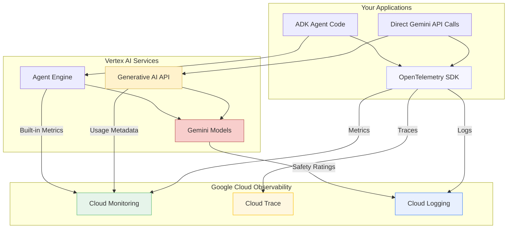
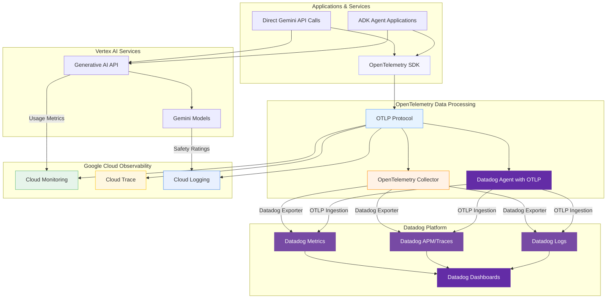

# Vertex AI Generative AI & ADK Observability: Complete Monitoring, Tracing, and Security Guide

## Table of Contents

- [Prerequisites](#prerequisites)
- [Overview](#overview)
- [Observability Architecture: OpenTelemetry and Google Cloud](#observability-architecture-opentelemetry-and-google-cloud)
  - [Core Architecture Overview](#core-architecture-overview)
  - [Multi-Platform Observability with Datadog Integration](#multi-platform-observability-with-datadog-integration)
  - [Exporting to Datadog: Two Primary Approaches](#exporting-to-datadog-two-primary-approaches)
  - [Implementation Recommendations](#implementation-recommendations)
  - [Summary: Enhanced Observability Options](#summary-enhanced-observability-options)
- [Understanding Observability: Metrics, Logs, and Traces](#understanding-observability-metrics-logs-and-traces)
- [⚡ Quick Wins Path (5 Minutes)](#-quick-wins-path-5-minutes)
- [🏢 Production Path](#-production-path)
- [🤖 Generative AI Model Observability](#-generative-ai-model-observability)
- [Cloud Run](#cloud-run)
- [Best Practices for All Deployments](#best-practices-for-all-deployments)
- [Quotas, Limits, and Retention](#quotas-limits-and-retention)
- [Troubleshooting Guide](#troubleshooting-guide)
- [References and Additional Resources](#references-and-additional-resources)

## Prerequisites

Before starting with this guide, ensure you have:

### Required Setup

- [ ] **Google Cloud Project** with billing enabled
- [ ] **Python 3.9+** installed locally
- [ ] **Google Cloud CLI** (`gcloud`) installed and configured
- [ ] **Project Editor or Owner** permissions (or specific IAM roles listed below)

### Required IAM Permissions

For Quick Wins Path:

- `roles/monitoring.viewer` - View monitoring dashboards
- `roles/cloudtrace.user` - View trace data

For Production Path:

- `roles/monitoring.admin` - Configure custom metrics and alerts
- `roles/cloudtrace.admin` - Configure trace settings
- `roles/logging.admin` - Configure log-based metrics
- `roles/iam.serviceAccountAdmin` - Manage service accounts

### Dependencies Installation

```bash
# Core dependencies for ADK observability
pip install google-cloud-monitoring>=2.15.1
pip install google-cloud-trace>=1.13.0
pip install google-cloud-logging>=3.8.0
pip install opentelemetry-api>=1.20.0
pip install opentelemetry-sdk>=1.20.0
pip install opentelemetry-exporter-otlp>=1.20.0
```

### Verification

```bash
# Verify your setup
gcloud auth list
gcloud config get-value project
python --version  # Should be 3.9+
```

> **⚠️ Important:** If you don't have the required permissions, work with your GCP administrator to grant them or use a dedicated observability project.

## Overview

Observability is essential for running production-grade AI applications built with Vertex AI Generative AI. This comprehensive guide covers observability for both direct Generative AI API usage and ADK-based agents. With Google's Vertex AI platform, you get robust, cloud-native monitoring, logging, and distributed tracing capabilities. This guide offers two paths plus specialized coverage:

- **Quick Wins Path (5 minutes)**: Get immediate visibility with built-in tools
- **Production Path**: Enterprise-grade observability with security and best practices
- **Generative AI Model Observability**: Specialized monitoring for LLM applications, token usage, safety, and multi-modal requests

### Executive Summary

| Feature             | Quick Wins Path                | Production Path              | Generative AI Focus             |
| ------------------- | ------------------------------ | ---------------------------- | ------------------------------- |
| **Setup Time**      | 5 minutes                      | 2-4 hours                    | 1-2 hours                       |
| **Monitoring**      | Built-in metrics               | Custom metrics + alerting    | Token usage + model performance |
| **Tracing**         | Basic distributed tracing      | Advanced OpenTelemetry       | Multi-modal request flows       |
| **Security**        | Default permissions            | Least privilege + audit logs | Safety filter monitoring        |
| **Cost Management** | Basic usage tracking           | Advanced cost optimization   | Token-based cost control        |
| **AI-Specific**     | Basic error monitoring         | Custom business metrics      | Safety, hallucination detection |
| **Best For**        | Development, proof-of-concepts | Production, enterprise       | AI-first applications           |

### Cost Considerations

- **Quick Wins Path**: Primarily uses built-in monitoring at no additional cost
- **Production Path**: Custom metrics pricing ~$0.30 per million data points
- **Generative AI Monitoring**: Token usage tracking and quota management with Dynamic Shared Quota (DSQ)
- **Tracing**: Free tier of 2 million spans/month, then $0.20 per million spans
- **Logging**: First 50GB/month free, then $0.50 per GB

> **💡 Recommendation:** Start with Quick Wins Path for immediate value, then implement Generative AI Model Observability for AI-specific monitoring, and gradually adopt Production Path features based on your specific needs.

## Observability Architecture: OpenTelemetry and Google Cloud

When implementing observability for Vertex AI Generative AI applications, understanding the relationship between OpenTelemetry, direct API calls, and Google Cloud services is essential for effective instrumentation. Modern architectures also support exporting observability data to third-party platforms like Datadog using the OpenTelemetry Protocol (OTLP).

### Core Architecture Overview



### Multi-Platform Observability with Datadog Integration

For organizations using multiple observability platforms or seeking advanced analytics, OpenTelemetry enables seamless export to external systems like Datadog. This architecture provides flexibility while maintaining Google Cloud's native observability benefits:



### Exporting to Datadog: Two Primary Approaches

#### Approach 1: OpenTelemetry Collector with Datadog Exporter

This approach uses the standard OpenTelemetry Collector with Datadog's exporter component:

**Benefits:**

- Complete vendor neutrality
- Flexible data processing and transformations
- Supports advanced sampling strategies
- Works without Datadog Agent

**Configuration Example:**

```yaml
# collector.yaml
receivers:
  otlp:
    protocols:
      grpc:
        endpoint: 0.0.0.0:4317
      http:
        endpoint: 0.0.0.0:4318

processors:
  batch:
    send_batch_max_size: 100
    send_batch_size: 10
    timeout: 10s

connectors:
  datadog/connector:

exporters:
  datadog/exporter:
    api:
      site: datadoghq.com
      key: ${env:DD_API_KEY}

service:
  pipelines:
    metrics:
      receivers: [otlp, datadog/connector]
      processors: [batch]
      exporters: [datadog/exporter]
    traces:
      receivers: [otlp]
      processors: [batch]
      exporters: [datadog/connector, datadog/exporter]
    logs:
      receivers: [otlp]
      processors: [batch]
      exporters: [datadog/exporter]
```

#### Approach 2: Datadog Agent with OTLP Ingestion

This approach leverages the Datadog Agent's built-in OTLP support:

**Benefits:**

- Access to 850+ Datadog integrations
- Fleet management via Datadog Fleet Automation
- Live Container Monitoring and Network Monitoring
- Unified agent for multiple data sources

**Configuration Example:**

```yaml
# datadog.yaml
otlp_config:
  receiver:
    protocols:
      grpc:
        endpoint: 0.0.0.0:4317
      http:
        endpoint: 0.0.0.0:4318
  logs:
    enabled: true

logs_enabled: true
```

### Implementation Recommendations

**For Google Cloud-first organizations:**

- Start with native Google Cloud Observability
- Add Datadog integration for advanced analytics or compliance requirements
- Use Approach 2 (Datadog Agent) if you need additional integrations

**For multi-cloud or Datadog-centric organizations:**

- Use Approach 1 (OpenTelemetry Collector) for maximum flexibility
- Maintain dual export to both platforms during transition periods
- Leverage Datadog's unified service tagging for consistent labeling

**Key Configuration Considerations:**

- **Batch Processing:** Configure appropriate batch sizes (traces: 3.2MB limit, logs: 5MB limit, metrics: 500KB limit)
- **Resource Attributes:** Use OpenTelemetry semantic conventions (`service.name`, `deployment.environment`, `service.version`)
- **Correlation:** Ensure trace/log correlation by extracting `trace_id` and `span_id` in log processing
- **Security:** Use environment variables for API keys and follow OpenTelemetry security best practices

### Summary: Enhanced Observability Options

The updated architecture provides comprehensive observability options for Vertex AI and ADK applications:

**✅ Google Cloud Native:** Direct integration with Cloud Monitoring, Logging, and Trace for seamless GCP-first observability

**✅ Multi-Platform Flexibility:** Export to Datadog using OpenTelemetry Protocol (OTLP) with two proven approaches:

- **OpenTelemetry Collector + Datadog Exporter:** Maximum vendor neutrality and flexibility
- **Datadog Agent + OTLP Ingestion:** Access to 850+ integrations and fleet management

**✅ Unified Instrumentation:** Single OpenTelemetry SDK codebase works across all export destinations

**✅ Enterprise-Ready:** Supports compliance requirements, advanced analytics, and multi-cloud architectures

This approach enables organizations to start with Google Cloud's native observability while maintaining the flexibility to expand to enterprise observability platforms as needed.

## Understanding Observability: Metrics, Logs, and Traces

Before diving into implementation, let's understand the three pillars of observability and how they work together for AI agents:

### **Metrics**

**What they are:** Numerical measurements of system behavior over time  
**When to use:**

- Performance monitoring
- Resource utilization
- Business KPIs
- Alerting thresholds

**ADK Examples:**

- Request count
- Latency percentiles
- Token usage
- Error rates

### **Logs**

**What they are:** Time-stamped records of discrete events  
**When to use:**

- Debugging
- Audit trails
- Error investigation
- Security monitoring

**ADK Examples:**

- Tool execution details
- LLM prompt/response
- Authentication events
- Error messages

### **Traces**

**What they are:** End-to-end request flows across components  
**When to use:**

- Performance bottlenecks
- Component dependencies
- Request path analysis

**ADK Examples:**

- Full agent query flow
- Tool call sequences
- LLM invocation timing
- Cross-service calls

> **🔑 Quick Tip:** Think of observability like a detective story: **Metrics** tell you something happened (system is slow), **Logs** provide clues and context (error in tool X), and **Traces** show the complete timeline and connections between events (exactly how the request flowed through your system).

Using all three together provides a complete picture of your ADK agent's behavior, enabling both proactive monitoring and effective troubleshooting.

---

## ⚡ Quick Wins Path (5 Minutes)

Get immediate observability for your AI applications with minimal configuration. This section covers both **direct Vertex AI Gemini API usage** and **ADK agents** on Cloud Run/App Engine.

> **🎯 Success Criteria:** By the end of this section, you'll have logs, traces, and metrics working for your Generative AI applications in under 5 minutes.

### Progress Checklist

- [ ] **30-second logging** setup and verified
- [ ] **2-minute structured logging** with trace correlation
- [ ] **5-minute metrics and tracing** configured and tested

---

## Option A: Direct Vertex AI Gemini Applications

### 1. Instant Logging (30 seconds) ⚡

**Just add 3 lines to your existing Gemini code:**

```python
# Add these 3 lines at the top of your script
import google.cloud.logging
client = google.cloud.logging.Client()
client.setup_logging()

# Your existing Gemini code works unchanged
from google import genai
import logging

logger = logging.getLogger(__name__)

def generate_content(prompt: str):
    try:
        client = genai.Client()
        response = client.models.generate_content(
            model="gemini-2.5-flash",
            contents=prompt
        )

        # This log will automatically appear in Cloud Logging
        logger.info(f"Generated response with {response.usage_metadata.total_token_count} tokens")
        return response.text

    except Exception as e:
        logger.error(f"Generation failed: {e}")
        raise

# Test it
result = generate_content("Write a short poem about observability")
print(result)
```

**✅ View logs immediately:**

1. Go to [Logs Explorer](https://console.cloud.google.com/logs/query)
2. Your logs appear under "Global" resource type
3. Filter by `severity>=INFO` to see your messages

### 2. Structured Logging with Token Tracking (2 minutes) 📊

**Enhanced logging with JSON structure and token monitoring:**

```python
import google.cloud.logging
import json
import time
from google import genai

# Setup Cloud Logging
client = google.cloud.logging.Client()
client.setup_logging()

import logging
logger = logging.getLogger(__name__)

def monitored_generate_content(prompt: str, model: str = "gemini-2.5-flash"):
    """Generate content with comprehensive logging."""
    request_id = f"req_{int(time.time() * 1000)}"
    start_time = time.time()

    # Log the request start
    logger.info("Gemini request started", extra={
        "request_id": request_id,
        "model": model,
        "prompt_length": len(prompt),
        "event_type": "request_start"
    })

    try:
        client = genai.Client()
        response = client.models.generate_content(model=model, contents=prompt)

        duration_ms = (time.time() - start_time) * 1000
        usage = response.usage_metadata

        # Log successful completion with structured data
        logger.info("Gemini request completed", extra={
            "request_id": request_id,
            "model": model,
            "duration_ms": duration_ms,
            "prompt_tokens": usage.prompt_token_count,
            "candidate_tokens": usage.candidates_token_count,
            "total_tokens": usage.total_token_count,
            "cost_estimate_usd": (usage.total_token_count / 1_000_000) * 0.075,  # Flash pricing
            "event_type": "request_success"
        })

        return {
            "text": response.text,
            "usage": {
                "prompt_tokens": usage.prompt_token_count,
                "candidate_tokens": usage.candidates_token_count,
                "total_tokens": usage.total_token_count
            },
            "request_id": request_id
        }

    except Exception as e:
        duration_ms = (time.time() - start_time) * 1000

        logger.error("Gemini request failed", extra={
            "request_id": request_id,
            "model": model,
            "duration_ms": duration_ms,
            "error": str(e),
            "event_type": "request_error"
        })
        raise

# Test with structured logging
result = monitored_generate_content("Explain machine learning in simple terms")
print(f"Generated {result['usage']['total_tokens']} tokens")
```

**✅ View structured logs:**

1. Go to [Logs Explorer](https://console.cloud.google.com/logs/query)
2. Switch to "Advanced filter" mode
3. Use filter: `jsonPayload.event_type="request_success"`
4. Click on log entries to see JSON structure with token counts

### 3. Add Tracing (3 minutes) 🔍

**Add OpenTelemetry tracing to track request flows:**

```bash
# Install OpenTelemetry dependencies
pip install opentelemetry-api opentelemetry-sdk opentelemetry-exporter-otlp
```

```python
import google.cloud.logging
from opentelemetry import trace
from opentelemetry.sdk.trace import TracerProvider
from opentelemetry.sdk.trace.export import BatchSpanProcessor
from opentelemetry.exporter.otlp.proto.grpc.trace_exporter import OTLPSpanExporter
from google import genai
import logging
import time

# Setup logging and tracing
logging_client = google.cloud.logging.Client()
logging_client.setup_logging()

# Configure OpenTelemetry
trace.set_tracer_provider(TracerProvider())
span_processor = BatchSpanProcessor(OTLPSpanExporter())
trace.get_tracer_provider().add_span_processor(span_processor)
tracer = trace.get_tracer(__name__)

logger = logging.getLogger(__name__)

def traced_generate_content(prompt: str, model: str = "gemini-2.5-flash"):
    """Generate content with tracing and logging."""
    with tracer.start_as_current_span("gemini_generation") as span:
        span.set_attribute("model", model)
        span.set_attribute("prompt_length", len(prompt))

        request_id = f"req_{int(time.time() * 1000)}"
        start_time = time.time()

        try:
            client = genai.Client()
            response = client.models.generate_content(model=model, contents=prompt)

            duration_ms = (time.time() - start_time) * 1000
            usage = response.usage_metadata

            # Add span attributes
            span.set_attribute("total_tokens", usage.total_token_count)
            span.set_attribute("duration_ms", duration_ms)
            span.set_attribute("success", True)

            # Log with trace correlation
            logger.info("Traced Gemini request completed", extra={
                "request_id": request_id,
                "total_tokens": usage.total_token_count,
                "duration_ms": duration_ms,
                "trace_id": format(span.get_span_context().trace_id, '032x')
            })

            return response.text

        except Exception as e:
            span.set_attribute("error", str(e))
            span.set_attribute("success", False)
            logger.error(f"Traced request failed: {e}")
            raise

# Test with tracing
result = traced_generate_content("What is observability?")
print(result)
```

**✅ View traces:**

1. Go to [Trace Explorer](https://console.cloud.google.com/traces/list)
2. Find traces with span name "gemini_generation"
3. Click on traces to see timing and attributes

---

## Option B: ADK Agents (Cloud Run/App Engine)

### 1. Instant Logging (Cloud Run) ⚡

**Cloud Run automatically captures all stdout/stderr - no setup needed!**

```python
from google.adk.agents import Agent
from vertexai.preview.reasoning_engines import AdkApp
import json
import time

def create_logged_agent():
    """Create ADK agent with instant logging."""

    # All print statements automatically go to Cloud Logging
    print("🚀 Starting ADK Agent initialization")

    agent = Agent(
        model="gemini-2.5-flash",
        name="customer_service_agent",
        instructions="You are a helpful customer service agent."
    )

    # This will appear in Cloud Logging
    print(f"✅ Agent '{agent.name}' created successfully")

    return agent

def logged_agent_query(agent, query: str):
    """Process query with automatic logging."""
    request_id = f"req_{int(time.time() * 1000)}"

    # Simple text logging (appears in Cloud Logging immediately)
    print(f"🔄 Processing query: {query[:50]}... [ID: {request_id}]")

    start_time = time.time()
    try:
        response = agent.query(query)
        duration_ms = (time.time() - start_time) * 1000

        print(f"✅ Query completed in {duration_ms:.0f}ms [ID: {request_id}]")
        return response

    except Exception as e:
        duration_ms = (time.time() - start_time) * 1000
        print(f"❌ Query failed after {duration_ms:.0f}ms: {e} [ID: {request_id}]")
        raise

# Test instant logging
agent = create_logged_agent()
result = logged_agent_query(agent, "What are your business hours?")
print(f"Response: {result}")
```

**✅ View logs immediately:**

1. Go to [Cloud Run Console](https://console.cloud.google.com/run)
2. Click your service → **LOGS** tab
3. See all print statements in real-time

### 2. Structured JSON Logging (Cloud Run) 📊

**Enhanced logging with JSON structure for better filtering:**

```python
import json
import time
from google.adk.agents import Agent

def structured_logged_agent():
    """ADK agent with structured JSON logging."""

    def log_json(event_type: str, **kwargs):
        """Log structured JSON to stdout (automatically captured by Cloud Run)."""
        log_entry = {
            "timestamp": time.time(),
            "event_type": event_type,
            "service": "adk_agent",
            **kwargs
        }
        # Print JSON to stdout - Cloud Run automatically captures this
        print(json.dumps(log_entry))

    # Initialize agent with structured logging
    log_json("agent_init_start", message="Initializing ADK Agent")

    agent = Agent(
        model="gemini-2.5-flash",
        name="structured_agent",
        instructions="You are a helpful assistant with structured logging."
    )

    log_json("agent_init_complete",
             agent_name=agent.name,
             model=agent.model,
             status="success")

    def query_with_structured_logs(query: str):
        request_id = f"req_{int(time.time() * 1000)}"
        start_time = time.time()

        log_json("query_start",
                 request_id=request_id,
                 query_length=len(query),
                 query_preview=query[:100])

        try:
            response = agent.query(query)
            duration_ms = (time.time() - start_time) * 1000

            log_json("query_success",
                     request_id=request_id,
                     duration_ms=duration_ms,
                     response_length=len(str(response)),
                     status="completed")

            return response

        except Exception as e:
            duration_ms = (time.time() - start_time) * 1000

            log_json("query_error",
                     request_id=request_id,
                     duration_ms=duration_ms,
                     error=str(e),
                     status="failed")
            raise

    return query_with_structured_logs

# Test structured logging
query_func = structured_logged_agent()
result = query_func("How can I track my order?")
```

**✅ View structured logs:**

1. Go to [Logs Explorer](https://console.cloud.google.com/logs/query)
2. Filter by `resource.type="cloud_run_revision"`
3. Use advanced filter: `jsonPayload.event_type="query_success"`
4. See structured data with timing and metadata

### 3. Complete Observability (App Engine) 🔍

**App Engine has built-in trace correlation and automatic request logging:**

```python
import google.cloud.logging
from google.adk.agents import Agent
import logging
import json
import time
import os

# App Engine automatically integrates with Cloud Logging
client = google.cloud.logging.Client()
client.setup_logging()

logger = logging.getLogger(__name__)

def create_traced_agent():
    """Create ADK agent with full observability for App Engine."""

    def get_trace_id():
        """Extract trace ID from App Engine request headers."""
        trace_header = os.environ.get('HTTP_X_CLOUD_TRACE_CONTEXT', '')
        if trace_header:
            trace_id = trace_header.split('/')[0]
            return f"projects/{client.project}/traces/{trace_id}"
        return None

    def correlated_log(message: str, **kwargs):
        """Log with trace correlation for App Engine."""
        trace_id = get_trace_id()
        extra_data = {
            "event_type": "adk_agent",
            **kwargs
        }

        if trace_id:
            extra_data["logging.googleapis.com/trace"] = trace_id

        logger.info(message, extra=extra_data)

    # Initialize with correlated logging
    correlated_log("ADK Agent initialization started")

    agent = Agent(
        model="gemini-2.5-flash",
        name="traced_agent",
        instructions="You are an agent with full observability."
    )

    correlated_log("ADK Agent ready",
                   agent_name=agent.name,
                   model=agent.model)

    def traced_query(query: str):
        request_id = f"req_{int(time.time() * 1000)}"
        start_time = time.time()

        correlated_log("Query processing started",
                       request_id=request_id,
                       query_length=len(query))

        try:
            response = agent.query(query)
            duration_ms = (time.time() - start_time) * 1000

            correlated_log("Query completed successfully",
                           request_id=request_id,
                           duration_ms=duration_ms,
                           response_length=len(str(response)))

            return response

        except Exception as e:
            duration_ms = (time.time() - start_time) * 1000

            correlated_log("Query failed",
                           request_id=request_id,
                           duration_ms=duration_ms,
                           error=str(e),
                           level="ERROR")
            raise

    return traced_query

# For App Engine deployment
app = Flask(__name__)

@app.route('/query', methods=['POST'])
def handle_query():
    query_func = create_traced_agent()
    data = request.get_json()
    result = query_func(data['query'])
    return jsonify({"response": str(result)})
```

**✅ View correlated logs:**

1. Go to [Logs Explorer](https://console.cloud.google.com/logs/query)
2. Filter by `resource.type="gae_application"`
3. Click on request logs to see nested app logs
4. Traces automatically correlated with request logs

---

## Quick Wins Complete

**Congratulations!** You now have immediate observability for your Generative AI applications:

### What You've Accomplished

| Feature             | Direct Gemini       | ADK on Cloud Run      | ADK on App Engine         |
| ------------------- | ------------------- | --------------------- | ------------------------- |
| **Basic Logging**   | ✅ 30 seconds       | ✅ Instant (built-in) | ✅ Automatic              |
| **Structured Logs** | ✅ JSON with tokens | ✅ JSON to stdout     | ✅ With trace correlation |
| **Tracing**         | ✅ OpenTelemetry    | ✅ Built-in traces    | ✅ Automatic correlation  |
| **Metrics**         | ✅ Custom metrics   | ✅ Built-in metrics   | ✅ Built-in metrics       |

### Immediate Next Steps

1. **Test your setup** - Make several requests and verify logs appear
2. **Create a dashboard** - Use Cloud Monitoring to visualize your data
3. **Set up alerts** - Get notified of errors or high usage
4. **Explore the data** - Use Logs Explorer filters to analyze patterns

### Where to Go Next

- **Need more advanced features?** → Go to **Production Path**
- **Want AI-specific monitoring?** → Check out **Generative AI Model Observability**
- **Building for production?** → Review **Best Practices for All Deployments**

---

## 🏢 Production Path

For enterprise deployments requiring robust monitoring, security, and advanced observability.

> **🎯 Success Criteria:** By the end of this section, you'll have enterprise-grade observability with custom metrics, advanced security, and comprehensive alerting.

### Implementation Order (Recommended)

1. **Security & IAM Configuration** (Foundation)
2. **Advanced Monitoring** (Core metrics and alerts)
3. **OpenTelemetry Integration** (Custom instrumentation)
4. **Audit Logging** (Security monitoring)
5. **CI/CD Integration** (Automated validation)

### Production Path Checklist

- [ ] Enhanced security and IAM configured
- [ ] Custom metrics and log-based metrics implemented
- [ ] Comprehensive alerting policies created
- [ ] OpenTelemetry custom instrumentation added
- [ ] Audit logging and security monitoring enabled
- [ ] CI/CD observability testing integrated

### 1. Enhanced Security & IAM Configuration

### IAM Role Configuration for Observability

ADK agents run using the Vertex AI Reasoning Engine Service Agent (`service-PROJECT_NUMBER@gcp-sa-aiplatform-re.iam.gserviceaccount.com`).

```bash
# Grant minimal monitoring roles to the service account
gcloud projects add-iam-policy-binding $PROJECT_ID \
    --member="serviceAccount:service-$PROJECT_NUMBER@gcp-sa-aiplatform-re.iam.gserviceaccount.com" \
    --role="roles/monitoring.metricWriter"

# Grant tracing permissions
gcloud projects add-iam-policy-binding $PROJECT_ID \
    --member="serviceAccount:service-$PROJECT_NUMBER@gcp-sa-aiplatform-re.iam.gserviceaccount.com" \
    --role="roles/cloudtrace.agent"
```

### Least Privilege Security Checklist

- [ ] Use dedicated service accounts for different agent functions
- [ ] Apply resource-level access controls where possible
- [ ] Configure VPC Service Controls for sensitive deployments
- [ ] Enable audit logging for IAM changes
- [ ] Set up Secret Manager for API keys and credentials
- [ ] Schedule regular access reviews (monthly/quarterly)

### Security Best Practices

1. **Separate Monitoring Account**: Consider routing observability data to a dedicated monitoring project
2. **Data Redaction**: Configure log filters to prevent sensitive data from appearing in logs
3. **Conditional IAM Bindings**: Use time-limited access for elevated privileges
4. **Workload Identity**: Avoid using service account keys in favor of Workload Identity Federation

### 2. Advanced Monitoring Configuration

### Custom Metrics for Business KPIs

Define business-specific metrics for your agents:

```python
# Using Cloud Monitoring client libraries
from google.cloud import monitoring_v3

client = monitoring_v3.MetricServiceClient()
project_name = client.common_project_path(PROJECT_ID)

# Create a custom metric to track token usage
series = monitoring_v3.TimeSeries()
series.metric.type = "custom.googleapis.com/adk/token_usage"
series.resource.type = "aiplatform.googleapis.com/ReasoningEngine"
series.resource.labels["reasoning_engine_id"] = RESOURCE_ID
series.resource.labels["location"] = LOCATION
series.resource.labels["project_id"] = PROJECT_ID

# Add metric labels for analysis dimensions
series.metric.labels["model"] = "gemini-2.5-flash"
series.metric.labels["agent"] = "customer_service_agent"

# Add the data point
point = series.points.add()
point.value.int64_value = 2500  # Number of tokens used
now = time.time()
point.interval.end_time.seconds = int(now)
point.interval.end_time.nanos = int((now - int(now)) * 10**9)
client.create_time_series(name=project_name, time_series=[series])
```

### Log-Based Metrics for Tool Analytics

Create log-based metrics to track tool execution patterns:

1. Go to [Log-based Metrics](https://console.cloud.google.com/logs/metrics)
2. Create a counter metric named `tool_execution_count`
3. Filter: `resource.type="aiplatform.googleapis.com/ReasoningEngine" textPayload=~"Tool .* executed"`
4. Add labels to extract tool name and execution status

### Comprehensive Alerting Strategy

Set up alerts for critical conditions:

1. Go to [Alerting](https://console.cloud.google.com/monitoring/alerting)
2. Create policies for:
   - Error rate > 5% over 5 minutes
   - P95 latency > 2000ms over 10 minutes
   - Failed tool executions > 10 in 5 minutes
   - Token usage approaching quota limits

### 3. OpenTelemetry Integration

For custom agents, implement advanced tracing with OpenTelemetry:

```python
from opentelemetry import trace
from opentelemetry.sdk.trace import TracerProvider
from opentelemetry.exporter.otlp.proto.grpc.trace_exporter import OTLPSpanExporter
from opentelemetry.sdk.trace.export import BatchSpanProcessor
from opentelemetry.sdk.resources import Resource
from opentelemetry.semconv.resource import ResourceAttributes

# Configure trace provider with semantic conventions
resource = Resource.create({
    ResourceAttributes.SERVICE_NAME: "customer-service-agent",
    ResourceAttributes.DEPLOYMENT_ENVIRONMENT: "production",
})

trace.set_tracer_provider(TracerProvider(resource=resource))
tracer = trace.get_tracer(__name__)

# Configure Cloud Trace exporter
span_processor = BatchSpanProcessor(OTLPSpanExporter())
trace.get_tracer_provider().add_span_processor(span_processor)

# Instrument your tool execution
def my_custom_tool(input_data):
    with tracer.start_as_current_span("my_custom_tool") as span:
        span.set_attribute("tool.name", "my_custom_tool")
        span.set_attribute("tool.input", str(input_data))

        # Tool implementation
        result = process_data(input_data)

        span.set_attribute("tool.result", str(result))
        return result
```

### 4. Audit Logging and Security Monitoring

Enable comprehensive audit logging for security events:

```bash
# Enable audit logging for data access and admin activity
gcloud logging sinks create adk-audit \
    bigquery.googleapis.com/projects/$PROJECT_ID/datasets/security_audit \
    --log-filter="protoPayload.methodName:SetIamPolicy OR protoPayload.methodName:CreateServiceAccount"

# Create a log-based metric for security violations
gcloud logging metrics create adk-security-violations \
    --description="ADK security violations" \
    --log-filter="resource.type=aiplatform.googleapis.com/ReasoningEngine severity>=WARNING textPayload:\"security violation\""
```

Set up security dashboards and alerts:

1. Monitor unusual access patterns
2. Track authentication failures
3. Monitor service account usage
4. Set up alerts for policy violations

### 5. Observability Testing in CI/CD

Integrate observability testing into your CI/CD pipeline:

```yaml
# Example GitHub Actions workflow step
- name: Validate observability configuration
  run: |
    # Validate monitoring configuration
    python ./tests/validate_monitoring.py

    # Test custom metrics
    python ./tests/test_custom_metrics.py

    # Verify alerts are properly configured
    python ./tests/verify_alerts.py
```

---

## 🤖 Generative AI Model Observability

This section focuses specifically on monitoring direct Vertex AI Generative AI API usage, including Gemini models for text generation, multi-modal requests, function calling, and other generative AI workloads.

> **🎯 Success Criteria:** By the end of this section, you'll have comprehensive monitoring for token usage, model performance, safety attributes, and cost optimization for your Generative AI applications.

### Generative AI Observability Checklist

- [ ] Token usage monitoring and alerting configured
- [ ] Model performance metrics (latency, throughput, error rates) tracked
- [ ] Safety and responsible AI monitoring implemented
- [ ] Cost optimization dashboards created
- [ ] Multi-modal request monitoring (text, image, video, audio) configured
- [ ] Dynamic Shared Quota (DSQ) monitoring setup

### 1. Token Usage Monitoring and Cost Optimization

Token usage is the primary cost driver for Generative AI applications. Implement comprehensive token monitoring:

```python
from google import genai
from google.cloud import monitoring_v3
import time
import logging
from typing import Dict, Any, Optional

# Configure structured logging for token tracking
logging.basicConfig(level=logging.INFO)
logger = logging.getLogger(__name__)

class TokenUsageMonitor:
    def __init__(self, project_id: str):
        self.project_id = project_id
        self.monitoring_client = monitoring_v3.MetricServiceClient()
        self.project_name = self.monitoring_client.common_project_path(project_id)

    def log_token_usage(self,
                       model: str,
                       prompt_tokens: int,
                       candidate_tokens: int,
                       total_tokens: int,
                       request_id: str,
                       user_id: Optional[str] = None,
                       application: str = "default") -> None:
        """Log token usage with structured fields for analysis."""

        # Structured logging for token usage
        logger.info(
            "Generative AI token usage recorded",
            extra={
                "event_type": "token_usage",
                "model": model,
                "prompt_tokens": prompt_tokens,
                "candidate_tokens": candidate_tokens,
                "total_tokens": total_tokens,
                "request_id": request_id,
                "user_id": user_id,
                "application": application,
                "timestamp": time.time(),
                "cost_estimate": self._estimate_cost(model, total_tokens)
            }
        )

        # Create custom metric for token usage
        self._create_token_usage_metric(model, total_tokens, application)

        # Alert on high usage
        if total_tokens > 50000:  # Configurable threshold
            logger.warning(
                "High token usage detected",
                extra={
                    "event_type": "high_token_usage",
                    "request_id": request_id,
                    "total_tokens": total_tokens,
                    "model": model,
                    "threshold_exceeded": True
                }
            )

    def _create_token_usage_metric(self, model: str, tokens: int, application: str) -> None:
        """Create custom metric for token usage."""
        series = monitoring_v3.TimeSeries()
        series.metric.type = "custom.googleapis.com/genai/token_usage"
        series.resource.type = "global"

        # Add metric labels for analysis dimensions
        series.metric.labels["model"] = model
        series.metric.labels["application"] = application

        # Add the data point
        point = series.points.add()
        point.value.int64_value = tokens
        now = time.time()
        point.interval.end_time.seconds = int(now)
        point.interval.end_time.nanos = int((now - int(now)) * 10**9)

        try:
            self.monitoring_client.create_time_series(
                name=self.project_name,
                time_series=[series]
            )
        except Exception as e:
            logger.error(f"Failed to create token usage metric: {e}")

    def _estimate_cost(self, model: str, tokens: int) -> float:
        """Estimate cost based on model and token count."""
        # Cost per 1M tokens (approximate, check current pricing)
        cost_per_million = {
            "gemini-2.5-flash": 0.075,  # Input: $0.075, Output: $0.30
            "gemini-2.5-pro": 1.25,     # Input: $1.25, Output: $5.00
            "gemini-2.0-flash": 0.075,
            "gemini-1.5-flash": 0.075,
            "gemini-1.5-pro": 1.25
        }

        rate = cost_per_million.get(model, 0.075)  # Default to Flash pricing
        return (tokens / 1_000_000) * rate

# Usage monitoring with Gemini API
def monitored_generate_content(prompt: str,
                             model: str = "gemini-2.5-flash",
                             application: str = "default",
                             user_id: Optional[str] = None) -> Dict[str, Any]:
    """Generate content with comprehensive monitoring."""

    monitor = TokenUsageMonitor(PROJECT_ID)
    request_id = f"req_{int(time.time() * 1000)}"
    start_time = time.time()

    try:
        client = genai.Client()

        # Generate content
        response = client.models.generate_content(
            model=model,
            contents=prompt
        )

        # Extract usage metadata
        usage = response.usage_metadata
        prompt_tokens = usage.prompt_token_count
        candidate_tokens = usage.candidates_token_count
        total_tokens = usage.total_token_count

        # Calculate performance metrics
        duration_ms = (time.time() - start_time) * 1000
        tokens_per_second = total_tokens / (duration_ms / 1000) if duration_ms > 0 else 0

        # Log token usage
        monitor.log_token_usage(
            model=model,
            prompt_tokens=prompt_tokens,
            candidate_tokens=candidate_tokens,
            total_tokens=total_tokens,
            request_id=request_id,
            user_id=user_id,
            application=application
        )

        # Log performance metrics
        logger.info(
            "Generative AI request completed",
            extra={
                "event_type": "request_performance",
                "request_id": request_id,
                "model": model,
                "duration_ms": duration_ms,
                "tokens_per_second": tokens_per_second,
                "prompt_length": len(prompt),
                "response_length": len(response.text),
                "finish_reason": response.candidates[0].finish_reason if response.candidates else None
            }
        )

        return {
            "text": response.text,
            "usage": {
                "prompt_tokens": prompt_tokens,
                "candidate_tokens": candidate_tokens,
                "total_tokens": total_tokens
            },
            "performance": {
                "duration_ms": duration_ms,
                "tokens_per_second": tokens_per_second
            },
            "request_id": request_id
        }

    except Exception as e:
        duration_ms = (time.time() - start_time) * 1000

        logger.error(
            "Generative AI request failed",
            extra={
                "event_type": "request_error",
                "request_id": request_id,
                "model": model,
                "duration_ms": duration_ms,
                "error": str(e),
                "prompt_length": len(prompt)
            }
        )
        raise
```

### 2. Safety and Responsible AI Monitoring

Monitor safety attributes, content filtering, and responsible AI compliance:

```python
def monitor_safety_attributes(response, request_id: str, model: str) -> None:
    """Monitor safety ratings and content filtering."""

    if not response.candidates:
        logger.warning(
            "No candidates in response - potential safety filtering",
            extra={
                "event_type": "safety_no_candidates",
                "request_id": request_id,
                "model": model
            }
        )
        return

    candidate = response.candidates[0]

    # Log finish reason
    finish_reason = candidate.finish_reason
    if finish_reason in ["SAFETY", "RECITATION", "PROHIBITED_CONTENT", "SPII"]:
        logger.warning(
            "Content blocked by safety filters",
            extra={
                "event_type": "content_blocked",
                "request_id": request_id,
                "model": model,
                "finish_reason": finish_reason,
                "safety_concern": True
            }
        )

    # Monitor safety ratings
    if hasattr(candidate, 'safety_ratings') and candidate.safety_ratings:
        for rating in candidate.safety_ratings:
            if rating.probability in ["MEDIUM", "HIGH"]:
                logger.warning(
                    "High safety concern detected",
                    extra={
                        "event_type": "safety_rating_concern",
                        "request_id": request_id,
                        "model": model,
                        "category": rating.category,
                        "probability": rating.probability,
                        "blocked": rating.blocked
                    }
                )

    # Monitor citations for attribution
    if hasattr(candidate, 'citation_metadata') and candidate.citation_metadata:
        logger.info(
            "Citations detected in response",
            extra={
                "event_type": "citations_found",
                "request_id": request_id,
                "model": model,
                "citation_count": len(candidate.citation_metadata.citations)
            }
        )

# Enhanced monitored generation with safety
def safe_monitored_generate_content(prompt: str,
                                  model: str = "gemini-2.5-flash",
                                  safety_settings: Optional[list] = None) -> Dict[str, Any]:
    """Generate content with safety monitoring."""

    request_id = f"req_{int(time.time() * 1000)}"

    try:
        client = genai.Client()

        # Configure safety settings if provided
        generate_config = {
            "model": model,
            "contents": prompt
        }

        if safety_settings:
            generate_config["safety_settings"] = safety_settings

        response = client.models.generate_content(**generate_config)

        # Monitor safety attributes
        monitor_safety_attributes(response, request_id, model)

        # Extract and monitor usage
        monitor = TokenUsageMonitor(PROJECT_ID)
        usage = response.usage_metadata
        monitor.log_token_usage(
            model=model,
            prompt_tokens=usage.prompt_token_count,
            candidate_tokens=usage.candidates_token_count,
            total_tokens=usage.total_token_count,
            request_id=request_id
        )

        return {
            "text": response.text,
            "safety_ratings": [
                {
                    "category": rating.category,
                    "probability": rating.probability,
                    "blocked": rating.blocked
                }
                for rating in (response.candidates[0].safety_ratings if response.candidates else [])
            ],
            "finish_reason": response.candidates[0].finish_reason if response.candidates else None,
            "request_id": request_id
        }

    except Exception as e:
        logger.error(
            "Safe generation failed",
            extra={
                "event_type": "safe_generation_error",
                "request_id": request_id,
                "error": str(e)
            }
        )
        raise
```

### 3. Multi-Modal Request Monitoring

Monitor requests that include text, images, video, and audio:

```python
def monitor_multimodal_request(request_parts: list,
                              response,
                              request_id: str,
                              model: str) -> None:
    """Monitor multi-modal request characteristics."""

    # Analyze input modalities
    modalities = []
    total_size = 0

    for part in request_parts:
        if hasattr(part, 'text') and part.text:
            modalities.append("text")
        elif hasattr(part, 'inline_data') and part.inline_data:
            modalities.append(part.inline_data.mime_type.split('/')[0])
            # Estimate size from base64 data
            if hasattr(part.inline_data, 'data'):
                total_size += len(part.inline_data.data) * 3 / 4  # Base64 to bytes
        elif hasattr(part, 'file_data') and part.file_data:
            modalities.append(part.file_data.mime_type.split('/')[0])

    unique_modalities = list(set(modalities))

    logger.info(
        "Multi-modal request processed",
        extra={
            "event_type": "multimodal_request",
            "request_id": request_id,
            "model": model,
            "modalities": unique_modalities,
            "modality_count": len(unique_modalities),
            "total_parts": len(request_parts),
            "estimated_size_bytes": total_size,
            "is_multimodal": len(unique_modalities) > 1
        }
    )

    # Monitor for large requests
    if total_size > 10 * 1024 * 1024:  # 10MB threshold
        logger.warning(
            "Large multi-modal request detected",
            extra={
                "event_type": "large_multimodal_request",
                "request_id": request_id,
                "estimated_size_mb": total_size / (1024 * 1024),
                "modalities": unique_modalities
            }
        )

def monitored_multimodal_generate(parts: list,
                                model: str = "gemini-2.5-flash") -> Dict[str, Any]:
    """Generate content from multi-modal input with monitoring."""

    request_id = f"mm_req_{int(time.time() * 1000)}"
    start_time = time.time()

    try:
        client = genai.Client()

        response = client.models.generate_content(
            model=model,
            contents=parts
        )

        # Monitor the multi-modal request
        monitor_multimodal_request(parts, response, request_id, model)

        # Standard monitoring
        duration_ms = (time.time() - start_time) * 1000

        logger.info(
            "Multi-modal generation completed",
            extra={
                "event_type": "multimodal_completion",
                "request_id": request_id,
                "model": model,
                "duration_ms": duration_ms,
                "response_length": len(response.text) if response.text else 0
            }
        )

        return {
            "text": response.text,
            "request_id": request_id,
            "duration_ms": duration_ms
        }

    except Exception as e:
        duration_ms = (time.time() - start_time) * 1000

        logger.error(
            "Multi-modal generation failed",
            extra={
                "event_type": "multimodal_error",
                "request_id": request_id,
                "model": model,
                "duration_ms": duration_ms,
                "error": str(e)
            }
        )
        raise
```

### 4. Dynamic Shared Quota (DSQ) Monitoring

Monitor quota usage for models that use Dynamic Shared Quota:

```python
import requests
from google.auth import default
from google.auth.transport.requests import Request

class DSQMonitor:
    def __init__(self, project_id: str):
        self.project_id = project_id
        self.credentials, _ = default()

    def monitor_quota_usage(self, model: str, request_count: int = 1) -> None:
        """Monitor quota usage for DSQ-enabled models."""

        # List of DSQ-enabled models (as of 2025)
        dsq_models = [
            "gemini-2.5-flash",
            "gemini-2.5-pro",
            "gemini-2.0-flash",
            "gemini-2.0-flash-lite",
            "gemini-1.5-pro",
            "gemini-1.5-flash"
        ]

        if model in dsq_models:
            logger.info(
                "DSQ model usage tracked",
                extra={
                    "event_type": "dsq_usage",
                    "model": model,
                    "request_count": request_count,
                    "quota_type": "dynamic_shared",
                    "timestamp": time.time()
                }
            )
        else:
            logger.info(
                "Standard quota model usage tracked",
                extra={
                    "event_type": "standard_quota_usage",
                    "model": model,
                    "request_count": request_count,
                    "quota_type": "standard",
                    "timestamp": time.time()
                }
            )

    def get_quota_status(self) -> Dict[str, Any]:
        """Get current quota status (requires appropriate permissions)."""
        try:
            # Refresh credentials
            self.credentials.refresh(Request())

            # This is a simplified example - actual implementation would use
            # the appropriate Vertex AI APIs to check quota status
            return {
                "status": "monitored",
                "timestamp": time.time(),
                "note": "Use Cloud Monitoring for detailed quota metrics"
            }
        except Exception as e:
            logger.error(f"Failed to get quota status: {e}")
            return {"error": str(e)}
```

### 5. Function Calling Monitoring

Monitor function calling and tool usage patterns:

```python
def monitor_function_calling(response, request_id: str, model: str, functions_declared: list) -> None:
    """Monitor function calling behavior."""

    if not response.candidates:
        return

    candidate = response.candidates[0]

    # Check for function calls in the response
    function_calls = []
    if hasattr(candidate, 'content') and candidate.content.parts:
        for part in candidate.content.parts:
            if hasattr(part, 'function_call') and part.function_call:
                function_calls.append({
                    "name": part.function_call.name,
                    "args_count": len(part.function_call.args) if part.function_call.args else 0
                })

    logger.info(
        "Function calling analysis",
        extra={
            "event_type": "function_calling",
            "request_id": request_id,
            "model": model,
            "functions_declared": len(functions_declared),
            "functions_called": len(function_calls),
            "function_calls": function_calls,
            "function_usage_rate": len(function_calls) / len(functions_declared) if functions_declared else 0
        }
    )

    # Alert on unexpected function usage patterns
    if len(function_calls) > 5:
        logger.warning(
            "High function call volume",
            extra={
                "event_type": "high_function_usage",
                "request_id": request_id,
                "function_call_count": len(function_calls)
            }
        )

def monitored_function_calling_generate(prompt: str,
                                      functions: list,
                                      model: str = "gemini-2.5-flash") -> Dict[str, Any]:
    """Generate content with function calling monitoring."""

    request_id = f"fc_req_{int(time.time() * 1000)}"

    try:
        client = genai.Client()

        response = client.models.generate_content(
            model=model,
            contents=prompt,
            tools=[{"function_declarations": functions}]
        )

        # Monitor function calling
        monitor_function_calling(response, request_id, model, functions)

        # Standard monitoring
        monitor = TokenUsageMonitor(PROJECT_ID)
        usage = response.usage_metadata
        monitor.log_token_usage(
            model=model,
            prompt_tokens=usage.prompt_token_count,
            candidate_tokens=usage.candidates_token_count,
            total_tokens=usage.total_token_count,
            request_id=request_id,
            application="function_calling"
        )

        return {
            "response": response,
            "request_id": request_id
        }

    except Exception as e:
        logger.error(
            "Function calling generation failed",
            extra={
                "event_type": "function_calling_error",
                "request_id": request_id,
                "error": str(e),
                "functions_count": len(functions)
            }
        )
        raise
```

### 6. Generative AI Dashboards and Alerting

Create specific dashboards and alerts for Generative AI applications:

#### Log-Based Metrics for Generative AI

1. Go to [Log-based Metrics](https://console.cloud.google.com/logs/metrics)
2. Create the following metrics:

**Token Usage Counter:**

```yaml
Filter: jsonPayload.event_type="token_usage"
Metric Type: Counter
Labels: model, application
```

**High Token Usage Alerts:**

```yaml
Filter: jsonPayload.event_type="high_token_usage"
Metric Type: Counter
Labels: model, threshold_exceeded
```

**Safety Filtering Counter:**

```yaml
Filter: jsonPayload.event_type="content_blocked"
Metric Type: Counter
Labels: model, finish_reason, safety_concern
```

**Multi-modal Request Counter:**

```yaml
Filter: jsonPayload.event_type="multimodal_request"
Metric Type: Counter
Labels: modalities, is_multimodal
```

#### Recommended Alerting Policies

1. **High Token Usage**: Alert when hourly token usage exceeds budget
2. **Increased Safety Filtering**: Alert when content blocking rate > 5%
3. **Model Error Rate**: Alert when error rate > 2% over 5 minutes
4. **High Latency**: Alert when P95 latency > 10 seconds
5. **Cost Threshold**: Alert when daily costs exceed budget

### 7. Cost Optimization Strategies

Implement cost optimization based on monitoring data:

```python
class CostOptimizer:
    def __init__(self):
        self.cost_thresholds = {
            "daily": 100.0,    # Daily budget in USD
            "hourly": 10.0,    # Hourly budget in USD
            "per_request": 0.50 # Max cost per request
        }

    def check_cost_optimization(self, tokens: int, model: str) -> Dict[str, Any]:
        """Check if request fits within cost constraints."""

        estimated_cost = self._estimate_cost(model, tokens)

        recommendations = []

        # Check if we should suggest a cheaper model
        if estimated_cost > self.cost_thresholds["per_request"]:
            if model.startswith("gemini-2.5-pro"):
                recommendations.append({
                    "type": "model_downgrade",
                    "suggestion": "Consider using gemini-2.5-flash for this request",
                    "potential_savings": estimated_cost * 0.9  # Flash is ~90% cheaper
                })

        # Check token optimization
        if tokens > 100000:
            recommendations.append({
                "type": "token_optimization",
                "suggestion": "Consider breaking large requests into smaller chunks",
                "current_tokens": tokens,
                "recommended_max": 50000
            })

        return {
            "current_cost": estimated_cost,
            "within_budget": estimated_cost <= self.cost_thresholds["per_request"],
            "recommendations": recommendations
        }

    def _estimate_cost(self, model: str, tokens: int) -> float:
        """Estimate cost based on current pricing."""
        # Update these based on current Vertex AI pricing
        rates = {
            "gemini-2.5-flash": 0.075,
            "gemini-2.5-pro": 1.25,
            "gemini-2.0-flash": 0.075,
            "gemini-2.0-flash-lite": 0.075
        }

        rate = rates.get(model, 0.075)
        return (tokens / 1_000_000) * rate
```

### 8. Integration with Existing Monitoring Stack

If you have an existing monitoring stack, integrate Generative AI metrics:

```python
# Example integration with Prometheus/Grafana
from prometheus_client import Counter, Histogram, Gauge
import time

# Prometheus metrics
genai_requests_total = Counter(
    'genai_requests_total',
    'Total Generative AI requests',
    ['model', 'application', 'status']
)

genai_tokens_total = Counter(
    'genai_tokens_total',
    'Total tokens used',
    ['model', 'token_type']  # prompt, candidate, total
)

genai_request_duration = Histogram(
    'genai_request_duration_seconds',
    'Request duration in seconds',
    ['model']
)

genai_cost_total = Counter(
    'genai_cost_total_usd',
    'Total estimated cost in USD',
    ['model', 'application']
)

def export_to_prometheus(model: str,
                        duration: float,
                        prompt_tokens: int,
                        candidate_tokens: int,
                        total_tokens: int,
                        estimated_cost: float,
                        application: str = "default",
                        status: str = "success") -> None:
    """Export metrics to Prometheus."""

    genai_requests_total.labels(
        model=model,
        application=application,
        status=status
    ).inc()

    genai_tokens_total.labels(model=model, token_type="prompt").inc(prompt_tokens)
    genai_tokens_total.labels(model=model, token_type="candidate").inc(candidate_tokens)
    genai_tokens_total.labels(model=model, token_type="total").inc(total_tokens)

    genai_request_duration.labels(model=model).observe(duration)

    genai_cost_total.labels(model=model, application=application).inc(estimated_cost)
```

---

## Best Practices for All Deployments

Implementing comprehensive observability for Generative AI applications requires following established best practices that ensure reliability, cost efficiency, and responsible AI usage. This section outlines essential practices for monitoring, alerting, and optimizing your Vertex AI Generative AI implementations.

### 1. Monitoring Strategy

#### Set Up Comprehensive Metrics Collection

- **Token Usage Monitoring**: Track input and output tokens across all models
- **Latency Tracking**: Monitor P50, P95, and P99 response times
- **Error Rate Monitoring**: Track 4xx and 5xx errors, including quota exceeded errors
- **Cost Tracking**: Monitor spend across projects, models, and regions
- **Safety Filter Monitoring**: Track safety filter activations and blocked requests

```yaml
# Example monitoring configuration
monitoring:
  metrics:
    - vertex_ai_prediction_count
    - vertex_ai_prediction_latency
    - vertex_ai_token_count
    - vertex_ai_error_count
    - vertex_ai_safety_filter_count
  aggregation_period: 60s
  retention_period: 90d
```

#### Implement Proactive Alerting

- **Quota Alerts**: Set alerts at 80% and 95% of quota limits
- **Cost Alerts**: Configure budget alerts with multiple thresholds
- **Error Rate Alerts**: Alert on error rates exceeding 5%
- **Latency Alerts**: Alert on P95 latency exceeding SLA thresholds
- **Safety Alerts**: Monitor unusual safety filter activation patterns

### 2. Cost Optimization and Control

#### Dynamic Shared Quota (DSQ) Management

- **Enable DSQ**: Use Dynamic Shared Quota for better resource utilization
- **Monitor Quota Efficiency**: Track quota utilization across regions
- **Implement Failover**: Configure multi-region deployments for quota exhaustion scenarios

```python
# Example quota monitoring
def monitor_quota_usage():
    """Monitor and alert on quota usage patterns."""
    quota_usage = get_quota_metrics()
    for region, usage in quota_usage.items():
        if usage['utilization'] > 0.8:
            send_alert(f"High quota usage in {region}: {usage['utilization']:.1%}")
```

#### Cost Control Mechanisms

- **Budget Controls**: Set project-level and model-specific budgets
- **Rate Limiting**: Implement application-level rate limiting
- **Model Selection**: Choose appropriate model sizes for your use cases
- **Batch Processing**: Use batch requests when possible to reduce costs

### 3. Safety and Responsible AI

#### Content Safety Monitoring

- **Safety Filter Analytics**: Analyze patterns in blocked content
- **Bias Detection**: Monitor for potential bias in model outputs
- **Content Classification**: Track content categories and safety scores
- **Audit Trails**: Maintain comprehensive logs for compliance

```python
# Example safety monitoring
def analyze_safety_patterns():
    """Analyze safety filter patterns for insights."""
    safety_logs = query_safety_logs(days=7)
    patterns = {
        'harassment': count_category(safety_logs, 'HARASSMENT'),
        'hate_speech': count_category(safety_logs, 'HATE_SPEECH'),
        'dangerous_content': count_category(safety_logs, 'DANGEROUS_CONTENT')
    }
    return patterns
```

#### Responsible AI Practices

- **Human Review Loops**: Implement human oversight for high-risk applications
- **Model Evaluation**: Regularly evaluate model performance and fairness
- **Documentation**: Maintain model cards and usage documentation
- **Incident Response**: Have clear procedures for handling AI-related incidents

### 4. Performance Optimization

#### Multi-Modal Request Optimization

- **Image Processing**: Optimize image sizes and formats for vision models
- **Audio Processing**: Use appropriate audio formats and compression
- **Batch Multimodal**: Group multimodal requests efficiently
- **Caching Strategies**: Implement intelligent caching for repeated requests

#### Model Performance Tuning

- **Parameter Optimization**: Tune temperature, top-p, and other parameters
- **Prompt Engineering**: Optimize prompts for better performance and cost
- **Model Comparison**: A/B test different models for your use cases
- **Response Caching**: Cache common responses to reduce API calls

### 5. Error Handling and Resilience

#### Robust Error Handling

- **Retry Logic**: Implement exponential backoff for transient errors
- **Circuit Breakers**: Prevent cascade failures with circuit breaker patterns
- **Graceful Degradation**: Handle quota exceeded and rate limit errors
- **Error Classification**: Categorize and track different error types

```python
# Example resilient request handling
@retry(
    stop=stop_after_attempt(3),
    wait=wait_exponential(multiplier=1, min=4, max=10),
    retry=retry_if_exception_type(QuotaExceededError)
)
async def make_resilient_request(prompt, model="gemini-1.5-pro"):
    """Make a resilient request with proper error handling."""
    try:
        response = await vertex_ai_client.generate_content(
            prompt=prompt,
            model=model,
            safety_settings=safety_settings
        )
        log_successful_request(model, len(prompt))
        return response
    except QuotaExceededError as e:
        log_quota_exceeded(model, e)
        raise
    except Exception as e:
        log_error(model, e)
        raise
```

### 6. Dashboard and Visualization

#### Essential Dashboards

- **Executive Dashboard**: High-level metrics for business stakeholders
- **Operations Dashboard**: Real-time system health and performance
- **Cost Dashboard**: Detailed cost breakdown and trends
- **Safety Dashboard**: Content safety and responsible AI metrics

#### Key Visualizations

- **Token Usage Trends**: Track token consumption over time
- **Model Performance**: Compare latency and accuracy across models
- **Geographic Usage**: Monitor usage patterns across regions
- **Error Analysis**: Visualize error patterns and root causes

### 7. Compliance and Governance

#### Data Governance

- **Data Lineage**: Track data flow through your AI pipeline
- **Access Controls**: Implement proper IAM for AI resources
- **Audit Logging**: Maintain comprehensive audit trails
- **Data Retention**: Follow data retention policies for AI interactions

#### Compliance Monitoring

- **Regulatory Compliance**: Monitor for industry-specific requirements
- **Privacy Protection**: Ensure PII handling compliance
- **Content Policies**: Enforce organizational content policies
- **Model Governance**: Track model versions and deployments

### 8. Continuous Improvement

#### Performance Analysis

- **Usage Pattern Analysis**: Identify optimization opportunities
- **Cost Trend Analysis**: Track cost efficiency improvements
- **Quality Metrics**: Monitor output quality and user satisfaction
- **A/B Testing**: Continuously test model and parameter improvements

#### Feedback Loops

- **User Feedback Integration**: Collect and analyze user feedback
- **Model Drift Detection**: Monitor for model performance degradation
- **Continuous Training**: Update monitoring based on new patterns
- **Documentation Updates**: Keep monitoring documentation current

### Implementation Checklist

- [ ] Set up comprehensive metrics collection for all Generative AI models
- [ ] Configure proactive alerting for quotas, costs, errors, and performance
- [ ] Implement Dynamic Shared Quota (DSQ) for optimal resource utilization
- [ ] Enable safety monitoring and responsible AI practices
- [ ] Set up robust error handling with retry logic and circuit breakers
- [ ] Create essential dashboards for different stakeholder groups
- [ ] Implement compliance monitoring and audit trails
- [ ] Establish continuous improvement processes and feedback loops
- [ ] Document all monitoring procedures and escalation processes
- [ ] Train teams on monitoring tools and incident response procedures

These best practices provide a comprehensive foundation for observing and optimizing Generative AI applications on Vertex AI, ensuring they operate efficiently, safely, and in compliance with organizational and regulatory requirements.

---

## Quotas, Limits, and Retention

Understanding the limitations of observability tools is crucial for proper planning and implementation:

### Vertex AI Agent Engine

- **Trace Data Retention**: Cloud Trace stores data for 30 days
- **Trace API Limits**:
  - Maximum 1,000 spans per trace
  - Maximum trace size: 50 MB
  - Maximum 32 attributes per span

### Cloud Run

- **Trace Sampling Rate**: Maximum 0.1 requests per second per instance (one request every 10 seconds)
- **Custom Metrics**: No charge for built-in metrics on Cloud Run
- **Trace Data Retention**: 30 days, same as all Cloud Trace data

### Monitoring Quotas

- **API Read Operations**: 300 per 60 seconds across all read operations
- **API Write Operations**: 4,800 per 60 seconds across all write operations
- **Ingested Spans**: 3-5 billion per day (depending on your account)

### Managing Quotas

You can monitor your quota usage in the Google Cloud console:

1. Go to [IAM & Admin > Quotas](https://console.cloud.google.com/iam-admin/quotas)
2. Filter by service: "Cloud Trace API" or "Monitoring API"
3. View your current usage and limits

For production systems, consider:

- Creating alerting policies on quota usage
- Implementing sampling strategies for high-volume systems
- Requesting quota increases for critical workloads

## Troubleshooting Guide

### Common Issues and Solutions

#### 1. **No Metrics Showing in Cloud Monitoring**

**Symptoms:**

- Metrics Explorer shows no data for your ADK agent
- Dashboards are empty

**Solutions:**

```bash
# Check if your agent is running and receiving requests
gcloud logging read "resource.type=aiplatform.googleapis.com/ReasoningEngine" --limit=10

# Verify service account permissions
gcloud projects get-iam-policy $PROJECT_ID --format="table(bindings.role,bindings.members)"

# Check quota usage
gcloud logging metrics list --filter="name:*adk*"
```

**Most Common Causes:**

- Service account missing `roles/monitoring.metricWriter` permission
- Agent not receiving any requests (no activity to monitor)
- Wrong resource type filter in Metrics Explorer

#### 2. **Traces Not Appearing in Cloud Trace**

**Symptoms:**

- Trace Explorer shows no traces
- `enable_tracing=True` not working

**Solutions:**

```python
# Verify tracing is properly enabled
import os
print(f"Tracing enabled: {os.environ.get('ENABLE_TRACING', 'not set')}")

# Check service account permissions
# gcloud projects add-iam-policy-binding $PROJECT_ID \
#     --member="serviceAccount:your-service-account@project.iam.gserviceaccount.com" \
#     --role="roles/cloudtrace.agent"
```

**Most Common Causes:**

- Service account missing `roles/cloudtrace.agent` permission
- Tracing not enabled in the ADK app configuration
- Low traffic volume (traces are sampled)

#### 3. **Permission Denied Errors**

**Symptoms:**

- `403 Forbidden` errors in logs
- "Permission denied" when accessing monitoring APIs

**Solutions:**

```bash
# Check current authenticated user
gcloud auth list

# Verify project configuration
gcloud config get-value project

# Check service account key (if using one)
export GOOGLE_APPLICATION_CREDENTIALS="/path/to/your/service-account-key.json"

# Test API access
gcloud monitoring metrics list --limit=1
```

**Most Common Causes:**

- Wrong Google Cloud project selected
- Service account key not configured
- Insufficient IAM permissions

#### 4. **High Latency or Performance Issues**

**Symptoms:**

- Agent responses are slow
- High P95/P99 latencies in monitoring

**Debugging Steps:**

```python
# Add performance logging to your agent
import time
import logging

logger = logging.getLogger(__name__)

def timed_agent_call(query):
    start_time = time.time()

    try:
        result = your_agent.process(query)
        duration = time.time() - start_time

        logger.info(f"Agent call completed", extra={
            "duration_ms": duration * 1000,
            "query_length": len(query),
            "response_length": len(result.text) if result else 0
        })

        return result
    except Exception as e:
        duration = time.time() - start_time
        logger.error(f"Agent call failed", extra={
            "duration_ms": duration * 1000,
            "error": str(e)
        })
        raise
```

**Investigation Areas:**

- Tool execution times
- LLM model response times
- Network latency to external APIs
- Resource allocation (CPU/memory)

#### 5. **Missing Log Entries**

**Symptoms:**

- Expected log entries not appearing in Cloud Logging
- Structured logging not working

**Solutions:**

```python
# Verify logging configuration
import logging
import sys

# Check log level
print(f"Root logger level: {logging.getLogger().level}")
print(f"Handlers: {logging.getLogger().handlers}")

# Test logging with different levels
logging.debug("Debug message - should not appear by default")
logging.info("Info message - should appear")
logging.warning("Warning message - should appear")
logging.error("Error message - should appear")

# For Cloud Run, ensure JSON logging
import json
import os

def structured_log(message, severity="INFO", **kwargs):
    log_entry = {
        "message": message,
        "severity": severity,
        "timestamp": time.time(),
        "service": os.environ.get("K_SERVICE", "adk-agent"),
        **kwargs
    }
    print(json.dumps(log_entry))
```

#### 6. **OpenTelemetry Integration Problems**
**Solutions:**

```python
# Verify OpenTelemetry configuration
from opentelemetry import trace
from opentelemetry.sdk.trace import TracerProvider

# Check if tracer provider is configured
tracer_provider = trace.get_tracer_provider()
print(f"Tracer provider: {type(tracer_provider)}")

# Test span creation
tracer = trace.get_tracer(__name__)
with tracer.start_as_current_span("test_span") as span:
    span.set_attribute("test", "value")
    print("Test span created successfully")
```

### Diagnostic Commands Reference

#### Quick Health Check

```bash
# Check service status
gcloud run services list --filter="name:your-agent"

# Check recent logs
gcloud logging read "resource.type=cloud_run_revision" --limit=20

# Check metrics availability
gcloud monitoring metrics list --filter="metric.type:run.googleapis.com"
```

#### Performance Investigation

```bash
# Check latency metrics
gcloud monitoring metrics list --filter="metric.type:run.googleapis.com/request_latencies"

# Check error rates
gcloud monitoring metrics list --filter="metric.type:run.googleapis.com/request_count"

# Check resource utilization
gcloud monitoring metrics list --filter="metric.type:run.googleapis.com/container/cpu/utilizations"
```

#### Security Audit

```bash
# Check service account permissions
gcloud projects get-iam-policy $PROJECT_ID --format="table(bindings.role,bindings.members)" \
  | grep your-service-account

# Check audit logs
gcloud logging read "protoPayload.authenticationInfo.principalEmail:your-service-account@" --limit=10

# Check for security violations
gcloud logging read "severity>=WARNING" --limit=20
```

### When to Contact Support

Contact Google Cloud Support if you encounter:

1. **Persistent quota exceeded errors** despite normal usage
2. **Data loss or corruption** in monitoring systems
3. **Severe performance degradation** without obvious cause
4. **Billing discrepancies** related to observability services
5. **Service outages** affecting monitoring infrastructure

**Information to Include in Support Requests:**

- Project ID and region
- Timestamp of the issue
- Relevant log entries and error messages
- Steps to reproduce the problem
- Configuration details (sanitized)

### Additional Resources

- [Cloud Monitoring Troubleshooting](https://cloud.google.com/monitoring/support/troubleshooting)
- [Cloud Trace Troubleshooting](https://cloud.google.com/trace/docs/troubleshooting)
- [Cloud Logging Troubleshooting](https://cloud.google.com/logging/docs/troubleshooting)
- [OpenTelemetry Troubleshooting](https://opentelemetry.io/docs/reference/specification/troubleshooting/)

---

## References and Additional Resources

### Official Google Cloud Documentation

#### Vertex AI Generative AI

- [Vertex AI Generative AI Overview](https://cloud.google.com/vertex-ai/generative-ai/docs)
- [Generate content with Gemini API](https://cloud.google.com/vertex-ai/generative-ai/docs/model-reference/inference)
- [Generative AI quotas and limits](https://cloud.google.com/vertex-ai/generative-ai/docs/quotas)
- [Dynamic Shared Quota (DSQ)](https://cloud.google.com/vertex-ai/generative-ai/docs/dynamic-shared-quota)
- [Gemini model versions and lifecycle](https://cloud.google.com/vertex-ai/generative-ai/docs/learn/model-versioning)
- [Responsible AI practices](https://cloud.google.com/vertex-ai/generative-ai/docs/learn/responsible-ai)
- [Configure safety attributes](https://cloud.google.com/vertex-ai/generative-ai/docs/multimodal/configure-safety-attributes)

#### Vertex AI Agent Engine & ADK

- [Vertex AI Agent Engine Monitoring](https://cloud.google.com/vertex-ai/generative-ai/docs/agent-engine/manage/monitoring)
- [Vertex AI Agent Engine Tracing](https://cloud.google.com/vertex-ai/generative-ai/docs/agent-engine/manage/tracing)
- [Cloud Logging for Agents](https://cloud.google.com/vertex-ai/generative-ai/docs/agent-engine/manage/logging)
- [Managing Access for Deployed Agents](https://cloud.google.com/vertex-ai/generative-ai/docs/agent-engine/manage/access)
- [ADK API Reference](https://google.github.io/adk-docs/api-reference/)

#### Observability and Monitoring

- [Cloud Trace Python Setup](https://cloud.google.com/trace/docs/setup/python)
- [OpenTelemetry Python](https://opentelemetry.io/docs/languages/python/)
- [Google Cloud Platform Logs](https://cloud.google.com/logging/docs/api/platform-logs#vertex-ai-api)
- [Cloud Monitoring Custom Metrics](https://cloud.google.com/monitoring/custom-metrics)
- [Cloud Run Monitoring](https://cloud.google.com/run/docs/monitoring)
- [Cloud Run Distributed Tracing](https://cloud.google.com/run/docs/trace)
- [Cloud Run OpenTelemetry Integration](https://cloud.google.com/run/docs/tutorials/custom-metrics-opentelemetry-sidecar)

#### Security and IAM

- [Google Cloud IAM Best Practices](https://cloud.google.com/iam/docs/using-iam-securely)
- [Cloud Run Service Identity](https://cloud.google.com/run/docs/securing/service-identity)
- [OpenTelemetry Semantic Conventions for GenAI](https://opentelemetry.io/docs/specs/semconv/gen-ai/)

### Community Resources

- [OpenTelemetry Community](https://opentelemetry.io/community/)
- [Google Cloud Community](https://cloud.google.com/community)
- [Stack Overflow - Google Cloud](https://stackoverflow.com/questions/tagged/google-cloud-platform)
- [Stack Overflow - Vertex AI](https://stackoverflow.com/questions/tagged/google-vertex-ai)

### Training and Certification

- [Google Cloud Observability Certification](https://cloud.google.com/learn/certification)
- [Coursera - Site Reliability Engineering](https://www.coursera.org/learn/site-reliability-engineering-slos)
- [OpenTelemetry Bootcamp](https://opentelemetry.io/docs/getting-started/)
- [Vertex AI Generative AI Learning Path](https://cloud.google.com/learn/training/ai-ml)

---

## Last Updated

June 2025

## Contributors

This guide was created with input from Google Cloud engineers and the ADK community. For questions or suggestions, please open an issue in the repository.

---
