# Vertex AI & ADK Observability: A Practical Guide

This tutorial provides a comprehensive, step-by-step guide to implementing robust observability for your Vertex AI Generative AI and ADK applications. You'll learn how to monitor, trace, and log your AI systems to ensure reliability, optimize performance, and control costs.

## 🎯 What You'll Build

By following this guide, you will create a complete observability solution for your Vertex AI applications, featuring:

- **Live Log Streaming:** Real-time logs from your Gemini API calls and ADK agents, sent directly to Google Cloud Logging.
- **Token Usage Tracking:** Detailed monitoring of token consumption with cost estimates, provided in structured JSON logs.
- **Request Tracing:** End-to-end tracing to identify performance bottlenecks and understand request flows.
- **Custom Dashboards:** Ready-to-use dashboards in the Google Cloud Console to visualize key metrics.

## 🚀 Key Outcomes

Upon completing this tutorial, you will be able to:

- **Debug AI Issues Faster:** Use correlated logs and traces to resolve problems in seconds, not hours.
- **Prevent Costly Surprises:** Proactively monitor token usage and set up alerts to avoid unexpected expenses.
- **Ensure Compliance:** Implement comprehensive audit logging to meet security and compliance requirements.
- **Optimize Performance:** Leverage detailed latency and throughput metrics to enhance application performance.
- **Scale with Confidence:** Deploy production-grade monitoring and alerting to support your applications as they grow.

## 📖 Tutorial Structure

This tutorial is divided into two main paths, allowing you to choose the level of depth that best suits your needs:

- **⚡ Quick Wins Path (5 Minutes):** Get immediate, valuable insights into your applications with minimal setup.
- **🏢 Production Path (2-4 Hours):** Implement an enterprise-ready observability solution with advanced security, custom metrics, and automated alerting.

---

## ✅ Prerequisites

Before you begin, ensure you have the following set up:

### Required Tools and Accounts

- [ ] **Google Cloud Project:** You need a Google Cloud project with billing enabled.
- [ ] **Python:** Python 3.9 or higher must be installed on your local machine.
- [ ] **Google Cloud CLI:** The `gcloud` command-line tool should be installed and configured.
- [ ] **Permissions:** You need "Editor" or "Owner" permissions for the project, or a custom role with the necessary permissions.

### Required IAM Permissions

For the **Quick Wins Path**, you will need the following IAM roles:

- `roles/monitoring.viewer`: Allows you to view monitoring dashboards.
- `roles/cloudtrace.user`: Allows you to view trace data.

For the **Production Path**, you will also need these roles:

- `roles/monitoring.admin`: Allows you to configure custom metrics and alerts.
- `roles/cloudtrace.admin`: Allows you to configure trace settings.
- `roles/logging.admin`: Allows you to configure log-based metrics.
- `roles/iam.serviceAccountAdmin`: Allows you to manage service accounts.

### Dependency Installation

Install the required Python libraries by running the following command:

```bash
pip install google-cloud-monitoring>=2.15.1 \
            google-cloud-trace>=1.13.0 \
            google-cloud-logging>=3.8.0 \
            opentelemetry-api>=1.20.0 \
            opentelemetry-sdk>=1.20.0 \
            opentelemetry-exporter-otlp>=1.20.0 \
            adk "flask[async]" gunicorn
```

### Verify Your Setup

Run the following commands to ensure your environment is correctly configured:

```bash
gcloud auth list
gcloud config get-value project
python --version
```

> **⚠️ Important:** If you do not have the required permissions, please work with your GCP administrator to have them granted. Alternatively, you can use a dedicated project for this tutorial where you have full access.

---

## 🧠 Understanding Observability: Metrics, Logs, and Traces

Before we dive in, let's briefly cover the three pillars of observability and how they apply to AI applications.

### The Three Pillars of Observability

```mermaid
flowchart TB
    subgraph "🔍 Observability Pillars"
        METRICS[📊 Metrics<br/>Numbers over time]
        LOGS[📋 Logs<br/>Event records]
        TRACES[🔗 Traces<br/>Request flows]
    end

    subgraph "🤖 AI Agent Example"
        REQUEST[User Query:<br/>What are your hours?]
        AGENT[ADK Agent Processing]
        TOOLS[Tool Execution]
        LLM[LLM Generation]
        RESPONSE[Agent Response]
    end

    subgraph "📈 What Each Pillar Shows"
        M_DATA[• Request count: 1,250/hour<br/>• Latency P95: 850ms<br/>• Token usage: 2,500<br/>• Error rate: 2.1%]
        L_DATA[• Query started: ID req_123<br/>• Tool get_hours executed<br/>• LLM response: 145 tokens<br/>• Query completed successfully]
        T_DATA[• Request span: 850ms<br/>• Tool span: 200ms<br/>• LLM span: 600ms<br/>• Response span: 50ms]
    end

    REQUEST --> AGENT
    AGENT --> TOOLS
    TOOLS --> LLM
    LLM --> RESPONSE

    AGENT -.->|Count, Rate, Duration| METRICS
    TOOLS -.->|Events, Errors, Details| LOGS
    REQUEST -.->|End-to-end Flow| TRACES

    METRICS --> M_DATA
    LOGS --> L_DATA
    TRACES --> T_DATA

    REQUEST --> LOGS
    RESPONSE --> LOGS


    style METRICS fill:#e6f4ea,stroke:#5bb974
    style LOGS fill:#e8f0fe,stroke:#4285f4
    style TRACES fill:#fef7e0,stroke:#fbbc04
    style M_DATA fill:#e6f4ea,stroke:#5bb974
    style L_DATA fill:#e8f0fe,stroke:#4285f4
    style T_DATA fill:#fef7e0,stroke:#fbbc04
```



### Direct LLM Generation Call Observability

For direct Vertex AI Gemini API calls, here's how the three pillars work together in practice:


---

## ⚡ Quick Wins Path (5 Minutes)

Get immediate observability for your AI applications with minimal setup. This section covers both direct Vertex AI Gemini API usage and ADK agents.

> **🎯 Success Criteria:** By the end of this section, you'll have logs, traces, and metrics working for your Generative AI applications in under 5 minutes.

### Option A: Direct Vertex AI Gemini Applications

#### 1. Instant Logging (30 seconds) ⚡

Add just three lines to your existing Gemini code to get started:

```python
# Add these 3 lines at the top of your script
import google.cloud.logging
client = google.cloud.logging.Client()
client.setup_logging()

# Your existing Gemini code works unchanged
from google import genai
import logging

logger = logging.getLogger(__name__)

def generate_content(prompt: str):
    try:
        client = genai.Client()
        response = client.models.generate_content(
            model="gemini-2.5-flash",
            contents=prompt
        )

        # This log will automatically appear in Cloud Logging
        logger.info(f"Generated response with {response.usage_metadata.total_token_count} tokens")
        return response.text

    except Exception as e:
        logger.error(f"Generation failed: {e}")
        raise

# Test it
result = generate_content("Write a short poem about observability")
print(result)
```

#### ✅ Checkpoint 1: Verify Basic Logging

1. **Run the code** and make a few requests.
2. **Go to the [Logs Explorer](https://console.cloud.google.com/logs/query)** in the Google Cloud Console.
3. Look for your logs under the "Global" resource type.
4. Filter by severity using the query `severity>=INFO`.

You should see log entries similar to this:

```text
2025-06-25 10:30:15  INFO  Generated response with 156 tokens
```

**🚨 Not seeing logs?**

- Check that your project ID is correct: `gcloud config get-value project`
- Verify that authentication is working: `gcloud auth list`
- Ensure the Cloud Logging API is enabled: `gcloud services list --enabled | grep logging`

#### 2. Structured Logging with Token Tracking (2 minutes) 📊

Enhance your logging with structured JSON payloads to track token usage and other metadata:

```python
import google.cloud.logging
import json
import time
from google import genai

# Setup Cloud Logging
client = google.cloud.logging.Client()
client.setup_logging()

import logging
logger = logging.getLogger(__name__)

def monitored_generate_content(prompt: str, model: str = "gemini-2.5-flash"):
    """Generate content with comprehensive logging."""
    request_id = f"req_{int(time.time() * 1000)}"
    start_time = time.time()

    # Log the request start
    logger.info("Gemini request started", extra={
        "json_fields": {
            "request_id": request_id,
            "model": model,
            "prompt_length": len(prompt),
            "event_type": "request_start"
        }
    })

    try:
        client = genai.Client()
        response = client.models.generate_content(model=model, contents=prompt)

        duration_ms = (time.time() - start_time) * 1000
        usage = response.usage_metadata

        # Log successful completion with structured data
        logger.info("Gemini request completed", extra={
            "json_fields": {
                "request_id": request_id,
                "model": model,
                "duration_ms": duration_ms,
                "prompt_tokens": usage.prompt_token_count,
                "candidate_tokens": usage.candidates_token_count,
                "total_tokens": usage.total_token_count,
                "cost_estimate_usd": (usage.total_token_count / 1_000_000) * 0.075,  # Flash pricing
                "event_type": "request_success"
            }
        })

        return {
            "text": response.text,
            "usage": {
                "prompt_tokens": usage.prompt_token_count,
                "candidate_tokens": usage.candidates_token_count,
                "total_tokens": usage.total_token_count
            },
            "request_id": request_id
        }

    except Exception as e:
        duration_ms = (time.time() - start_time) * 1000

        logger.error("Gemini request failed", extra={
            "json_fields": {
                "request_id": request_id,
                "model": model,
                "duration_ms": duration_ms,
                "error": str(e),
                "event_type": "request_error"
            }
        })
        raise

# Test with structured logging
result = monitored_generate_content("Explain machine learning in simple terms")
print(f"Generated {result['usage']['total_tokens']} tokens")
```

#### ✅ Checkpoint 2: View Structured Logs

1. Go to the **[Logs Explorer](https://console.cloud.google.com/logs/query)**.
2. Switch to the "Advanced filter" mode.
3. Use the filter `jsonPayload.event_type="request_success"`.
4. Click on a log entry to see the structured JSON payload with token counts and other metadata.

#### 3. Add Tracing (3 minutes) 🔍

Add OpenTelemetry tracing to track request flows and identify performance bottlenecks:

```bash
# Install OpenTelemetry dependencies if you haven't already
pip install opentelemetry-api opentelemetry-sdk opentelemetry-exporter-otlp
```

```python
import google.cloud.logging
from opentelemetry import trace
from opentelemetry.sdk.trace import TracerProvider
from opentelemetry.sdk.trace.export import BatchSpanProcessor
from opentelemetry.exporter.otlp.proto.grpc.trace_exporter import OTLPSpanExporter
from opentelemetry.instrumentation.flask import FlaskInstrumentor

# --- Observability Setup ---
# 1. Standard Logging Setup
logging_client = google.cloud.logging.Client()
logging_client.setup_logging()

# 2. OpenTelemetry Setup
trace.set_tracer_provider(TracerProvider())
span_processor = BatchSpanProcessor(OTLPSpanExporter())
trace.get_tracer_provider().add_span_processor(span_processor)
tracer = trace.get_tracer(__name__)
# --- End Observability Setup ---

from google import genai
from flask import Flask, request, jsonify
import logging
import os
import time

logger = logging.getLogger(__name__)

app = Flask(__name__)

def traced_generate_content(prompt: str, model: str = "gemini-2.5-flash"):
    """Generate content with tracing and logging."""
    with tracer.start_as_current_span("gemini_generation") as span:
        span.set_attribute("model", model)
        span.set_attribute("prompt_length", len(prompt))

        request_id = f"req_{int(time.time() * 1000)}"
        start_time = time.time()

        try:
            client = genai.Client()
            response = client.models.generate_content(model=model, contents=prompt)

            duration_ms = (time.time() - start_time) * 1000
            usage = response.usage_metadata

            # Add span attributes
            span.set_attribute("total_tokens", usage.total_token_count)
            span.set_attribute("duration_ms", duration_ms)
            span.set_attribute("success", True)

            # Log with trace correlation
            logger.info("Traced Gemini request completed", extra={
                "json_fields": {
                    "request_id": request_id,
                    "total_tokens": usage.total_token_count,
                    "duration_ms": duration_ms,
                    "trace_id": format(span.get_span_context().trace_id, '032x')
                }
            })

            return response.text

        except Exception as e:
            span.set_attribute("error", str(e))
            span.set_attribute("success", False)
            logger.error(f"Traced request failed: {e}")
            raise

# Test with tracing
result = traced_generate_content("What is observability?")
print(result)
```

#### ✅ Checkpoint 3: View Traces

1. Go to the **[Trace Explorer](https://console.cloud.google.com/traces/list)**.
2. Find traces with the span name "gemini_generation".
3. Click on a trace to see the full request flow, including timing and attributes.

### Option B: ADK Agent Applications

For applications built with the Application Development Kit (ADK), observability is integrated into the agent's lifecycle. ADK helps you build, evaluate, and deploy AI agents. When deployed as a service (e.g., on Cloud Run), you can apply the same logging and tracing principles.

#### 1. Create a Simple ADK Agent (3 minutes) 🛠️

First, let's define a simple agent with a single tool. This agent will be served using Flask. You will need to create three files: `app.py`, `Dockerfile`, and `requirements.txt`.

**`app.py`:**

```python
from flask import Flask, request, jsonify
from adk.agent import Agent
from adk.tool import Tool
import google.cloud.logging
import logging
import os
from opentelemetry import trace
from opentelemetry.sdk.trace import TracerProvider
from opentelemetry.sdk.trace.export import BatchSpanProcessor
from opentelemetry.exporter.otlp.proto.grpc.trace_exporter import OTLPSpanExporter
from opentelemetry.instrumentation.flask import FlaskInstrumentor

# --- Observability Setup ---
# 1. Standard Logging Setup
logging_client = google.cloud.logging.Client()
logging_client.setup_logging()
logger = logging.getLogger(__name__)

# 2. OpenTelemetry Setup
trace.set_tracer_provider(TracerProvider())
span_processor = BatchSpanProcessor(OTLPSpanExporter())
trace.get_tracer_provider().add_span_processor(span_processor)
tracer = trace.get_tracer(__name__)
# --- End Observability Setup ---


# Define a simple tool for the agent
class SimpleTool(Tool):
    def call(self, query: str) -> str:
        """A simple tool that echoes the query."""
        logger.info(f"SimpleTool called with query: {query}")
        return f"Tool received: {query}"

# Initialize the Flask app and ADK Agent
app = Flask(__name__)
FlaskInstrumentor().instrument_app(app)

agent = Agent(
    llm="gemini-1.5-flash",  # Using a placeholder; direct LLM call isn't made here
    tools=[SimpleTool()]
)

@app.route("/run", methods=["POST"])
def run_agent():
    """Run the agent and return the response."""
    span = trace.get_current_span()
    data = request.get_json()
    if not data or "query" not in data:
        return jsonify({"error": "Missing 'query' in request body"}), 400

    query = data["query"]
    request_id = request.headers.get("X-Request-ID", f"local_{os.urandom(4).hex()}")
    trace_id = format(span.get_span_context().trace_id, '032x') if span.is_recording() else None

    logger.info("ADK Agent request started", extra={
        "json_fields": {
            "request_id": request_id,
            "query": query,
            "event_type": "agent_request_start",
            "trace_id": trace_id
        }
    })

    try:
        start_time = time.time()
        with tracer.start_as_current_span("adk_tool_call") as tool_span:
            tool_span.set_attribute("tool_name", "SimpleTool")
            tool_span.set_attribute("query", query)
            # In a real agent, you would use agent.run() which might call an LLM.
            # For this simple example, we'll call the tool directly to focus on observability.
            result = agent.tools[0].call(query)
            # In a real scenario with an LLM, you would get token counts from the response.
            # For this example, we'll simulate it.
            simulated_tokens = len(query.split()) + len(result.split())
            tool_span.set_attribute("result_length", len(result))
            tool_span.set_attribute("total_tokens", simulated_tokens)

        latency_ms = (time.time() - start_time) * 1000

        logger.info("ADK Agent request completed", extra={
            "json_fields": {
                "request_id": request_id,
                "result": result,
                "event_type": "agent_request_success",
                "trace_id": trace_id,
                "total_tokens": simulated_tokens, # <-- ADDED
                "latency_ms": latency_ms # <-- ADDED
            }
        })
        return jsonify({"response": result})

    except Exception as e:
        span.set_status(trace.Status(trace.StatusCode.ERROR, str(e)))
        logger.error("ADK Agent request failed", extra={
            "json_fields": {
                "request_id": request_id,
                "error": str(e),
                "event_type": "agent_request_error",
                "trace_id": trace_id
            }
        })
        return jsonify({"error": "Agent processing failed"}), 500

if __name__ == "__main__":
    app.run(debug=True, host="0.0.0.0", port=int(os.environ.get("PORT", 8080)))
```

**`Dockerfile`:**

```Dockerfile
# Use the official Python image.
FROM python:3.11-slim

# Set the working directory.
WORKDIR /app

# Copy requirements and install dependencies.
COPY requirements.txt .
RUN pip install --no-cache-dir -r requirements.txt

# Copy the application code.
COPY app.py .

# Set the entrypoint for the container.
CMD ["gunicorn", "--bind", "0.0.0.0:8080", "app:app"]
```

**`requirements.txt`:**

```text
google-cloud-adk>=0.1.0
Flask>=3.0.0
gunicorn>=22.0.0
google-cloud-logging>=3.8.0
opentelemetry-api>=1.20.0
opentelemetry-sdk>=1.20.0
opentelemetry-exporter-otlp>=1.20.0
opentelemetry-instrumentation-flask>=0.41b0
```

#### 2. Deploy to Cloud Run (5 minutes) 🚀

Now, deploy your agent as a containerized service on Cloud Run.

1. **Enable Required APIs:**

   ```bash
   gcloud services enable run.googleapis.com artifactregistry.googleapis.com
   ```

2. **Create an Artifact Registry Repository:**

   ```bash
   export REPO_NAME="my-agents-repo"
   export REGION="us-central1" # Choose your preferred region
   gcloud artifacts repositories create $REPO_NAME --repository-format=docker --location=$REGION
   ```

3. **Build and Push the Docker Image:**

   ```bash
   export PROJECT_ID=$(gcloud config get-value project)
   export IMAGE_TAG="$REGION-docker.pkg.dev/$PROJECT_ID/$REPO_NAME/adk-obs-agent:latest"
   gcloud builds submit --tag $IMAGE_TAG
   ```

4. **Deploy to Cloud Run:**

   ```bash
   gcloud run deploy adk-observability-agent \
     --image $IMAGE_TAG \
     --region $REGION \
     --allow-unauthenticated \
     --platform managed
   ```

#### ✅ Checkpoint 4: Test the Deployed Agent & View Logs and Traces

1. **Get the Service URL:** After deployment, Cloud Run will provide a URL.

2. **Send a Test Request:**

   ```bash
   export SERVICE_URL=$(gcloud run services describe adk-observability-agent --platform managed --region $REGION --format 'value(status.url)')
   curl -X POST -H "Content-Type: application/json" -d '{"query": "hello world"}' $SERVICE_URL/run
   ```

   You should get a response like: `{"response":"Tool received: hello world"}`

3. **View Logs in Cloud Run:**
   - Go to the **[Cloud Run](https://console.cloud.google.com/run)** section in the console.
   - Click on the `adk-observability-agent` service.
   - Go to the **Logs** tab.
   - Filter for `jsonPayload.event_type="agent_request_success"`. You will see the structured logs from your agent.

4. **View Traces in Trace Explorer:**
   - Go to the **[Trace Explorer](https://console.cloud.google.com/traces/list)**.
   - You should now see traces for your `adk-observability-agent`. Each trace will have a root span for the incoming `/run` request and a child span named `adk_tool_call`.

## The Production Path: Beyond the Basics

Once you have foundational logging and tracing, the next step is to build a robust monitoring and alerting system suitable for production workloads. This involves creating custom metrics, setting up automated alerts, and ensuring your application is secure and auditable.

### 1. Custom Metrics & Advanced Monitoring (10 minutes) 📊

While standard logs and traces are powerful, custom metrics provide at-a-glance insights into the specific behaviors of your LLM application. Let's create custom metrics for token counts and latency.

**a. Create Log-Based Metrics**

We can create metrics from the structured logs we set up earlier.

1. **Go to Log-Based Metrics:** Navigate to **[Logs Explorer](https://console.cloud.google.com/logs/viewer)** and enter the following filter to isolate successful Gemini generation logs:

   ```text
   resource.type="cloud_run_revision"
   resource.labels.service_name="adk-observability-agent"
   jsonPayload.event_type="agent_request_success"
   ```

2. **Create Metric for Token Count:**
   - Click **Create Metric**.
   - **Metric Type:** Distribution
   - **Name:** `llm/token_count`
   - **Description:** `Tracks the total tokens used in LLM responses.`
   - **Field Name:** `jsonPayload.total_tokens` (This assumes you add `total_tokens` to your log entry. Let's add it to the `app.py` later).
   - **Units:** `1`
   - Click **Create Metric**.

3. **Create Metric for Latency:**
   - Use the same filter.
   - **Metric Type:** Distribution
   - **Name:** `llm/generation_latency_ms`
   - **Description:** `Tracks the latency of LLM generation in milliseconds.`
   - **Field Name:** `jsonPayload.latency_ms` (We will add this to `app.py`).
   - **Units:** `ms`
   - Click **Create Metric**.

**b. Update `app.py` to Include New Metrics**

Let's modify the `run_agent` function in `app.py` to log the latency and a placeholder for token count.

```python
# ... existing imports ...
import time

# ... inside run_agent() ...
    try:
        start_time = time.time()
        with tracer.start_as_current_span("adk_tool_call") as tool_span:
            tool_span.set_attribute("tool_name", "SimpleTool")
            tool_span.set_attribute("query", query)
            # In a real agent, you would use agent.run() which might call an LLM.
            # For this simple example, we'll call the tool directly to focus on observability.
            result = agent.tools[0].call(query)
            # In a real scenario with an LLM, you would get token counts from the response.
            # For this example, we'll simulate it.
            simulated_tokens = len(query.split()) + len(result.split())
            tool_span.set_attribute("result_length", len(result))
            tool_span.set_attribute("total_tokens", simulated_tokens)

        latency_ms = (time.time() - start_time) * 1000

        logger.info("ADK Agent request completed", extra={
            "json_fields": {
                "request_id": request_id,
                "result": result,
                "event_type": "agent_request_success",
                "trace_id": trace_id,
                "total_tokens": simulated_tokens, # <-- ADDED
                "latency_ms": latency_ms # <-- ADDED
            }
        })
        return jsonify({"response": result})

    except Exception as e:
        span.set_status(trace.Status(trace.StatusCode.ERROR, str(e)))
        logger.error("ADK Agent request failed", extra={
            "json_fields": {
                "request_id": request_id,
                "error": str(e),
                "event_type": "agent_request_error",
                "trace_id": trace_id
            }
        })
        return jsonify({"error": "Agent processing failed"}), 500
```

**c. Redeploy and Verify**

1. Rebuild and push your Docker image:

   ```bash
   gcloud builds submit --tag $IMAGE_TAG
   ```

2. Deploy a new revision to Cloud Run:

   ```bash
   gcloud run deploy adk-observability-agent --image $IMAGE_TAG --region $REGION --platform managed
   ```

3. Send a few more test requests.

#### ✅ Checkpoint 5: View Custom Metrics

1. Go to **[Metrics Explorer](https://console.cloud.google.com/monitoring/metrics-explorer)**.
2. In the **Metric** dropdown, search for your custom metrics by name (`llm/token_count` and `llm/generation_latency_ms`).
3. You should see data points appearing for your new metrics. You can now add these to a dashboard for easy monitoring.

### 2. Automated Alerting (5 minutes) 🔔

Monitoring is only useful if it drives action. Let's create an alert that notifies us if the P95 latency goes above a certain threshold.

1. **Go to Alerting:** Navigate to **[Alerting](https://console.cloud.google.com/monitoring/alerting)** in the Cloud Monitoring console.
2. Click **Create Policy**.
3. **Select a Metric:**
   - Find and select your `llm/generation_latency_ms` metric.
   - Set the **Aggregation** to `95th percentile`.
4. **Configure Trigger:**
   - **Trigger Type:** `Threshold`
   - **Alert trigger if:** `Any time series violates`
   - **Threshold Position:** `Above threshold`
   - **Threshold Value:** `2000` (i.e., 2 seconds)
5. **Configure Notifications:**
   - Choose a notification channel (e.g., email). You may need to configure one first under **Notification Channels**.
6. **Name and Save:** Give the policy a descriptive name like `P95 Latency > 2s` and save it.

#### ✅ Checkpoint 6: Trigger a Test Alert

To test the alert, you can temporarily lower the threshold to a value you know will be breached (e.g., 10ms) and send a request. Remember to set it back to a reasonable value afterward.

### 3. Security & Audit Logging (5 minutes) 🛡️

For production systems, it's crucial to know who is accessing your services and what they are doing. Cloud Audit Logs provide this visibility.

#### a. Understanding Audit Logs

Google Cloud automatically generates several types of audit logs:

- **Admin Activity logs:** Records administrative actions (e.g., creating a VM, changing IAM permissions). Always enabled.
- **Data Access logs:** Records API calls that read, write, or modify user-provided data. These are high-volume and disabled by default, except for BigQuery.
- **System Event logs:** Records actions taken by Google Cloud systems.

For our Cloud Run service, enabling Data Access logs for the Run API can provide detailed insight into every request made to your service.

#### b. Enabling Data Access Logs

1. Go to **[IAM & Admin -> Audit Logs](https://console.cloud.google.com/iam-admin/audit)**.
2. Find **Cloud Run API** in the list and select it.
3. In the info panel on the right, check the boxes for **Admin Read**, **Data Read**, and **Data Write**.
4. Click **Save**.

#### c. Querying Audit Logs

You can now query these logs in the **[Logs Explorer](https://console.cloud.google.com/logs/viewer)**. Use a filter like the following to see all requests to your specific Cloud Run service:

```text
protoPayload.authenticationInfo.principalEmail!=""
protoPayload.methodName="run.googleapis.com/services.run"
resource.labels.service_name="adk-observability-agent"
```

This query shows you:

- `principalEmail`: The identity that called the service.
- `methodName`: The specific API method invoked.
- `request`: The full request payload (if enabled and configured).

#### ✅ Checkpoint 7: Verify Audit Logs

1. After enabling Data Access logs, send another test request to your Cloud Run service.
2. Go to the Logs Explorer and run the query above.
3. You should see a new log entry detailing your request, including your identity as the `principalEmail`.

## Advanced Topics: AI-Specific Monitoring

Beyond operational metrics, monitoring the *quality* of LLM outputs is essential. This includes tracking for safety, content quality, and tool usage.

### 1. Monitoring for Safety & Content Quality

Vertex AI includes built-in safety filters that block harmful content. You can monitor when these filters are triggered.

- **Monitor Safety Attributes:** When you make a call to the Gemini API, the response includes `safetyAttributes`. A response is blocked if the probability for a harmful category (e.g., `HARM_CATEGORY_HATE_SPEECH`) exceeds a threshold.
- **Log Safety Scores:** Log the `safetyAttributes` scores for every response. This allows you to create metrics or alerts if you see a spike in responses with high (but not blocking) scores for certain categories.

### 2. Monitoring Tool Use & Grounding

For agent-based systems, it's critical to monitor how the agent uses its tools and whether its responses are grounded in the information provided by those tools.

- **Log Tool Calls:** Your ADK agent code should already log when tools are called. You can create log-based metrics to track the frequency of each tool's usage.
- **Analyze Grounding:** Use Vertex AI's built-in grounding features. The API response can include `groundingMetadata` that indicates whether the output was based on the provided context. Log this information to track how often the model generates ungrounded or hallucinatory responses.

## Conclusion & Next Steps

In this tutorial, you have built a comprehensive observability framework for your Vertex AI and ADK applications. You started with foundational logging and tracing, then moved to production-grade monitoring with custom metrics and alerting, and finally explored advanced AI-specific monitoring techniques.

### What we've covered

- **Structured Logging:** Creating detailed, queryable logs for both direct LLM calls and ADK agents.
- **Distributed Tracing:** Visualizing request flows and identifying performance bottlenecks with OpenTelemetry.
- **Custom Metrics:** Building log-based metrics to monitor key performance indicators like token usage and latency.
- **Automated Alerting:** Setting up policies to be notified of production issues proactively.
- **Security Auditing:** Enabling and querying audit logs to track access and usage.

From here, you can continue to build on this foundation:

- **Create Dashboards:** Build a custom monitoring dashboard in Cloud Monitoring to visualize all your key metrics in one place.
- **Integrate with Evaluation:** Connect your observability data with evaluation pipelines to correlate online performance with offline evaluation scores.
- **Cost Optimization:** Use token count and latency metrics to identify expensive queries and optimize your prompts or model choices.

For more information, refer to the official documentation:

- [Google Cloud Observability](https://cloud.google.com/products/observability)
- [Vertex AI Monitoring](https://cloud.google.com/vertex-ai/docs/general/monitoring)
- [Application Development Kit (ADK)](https://cloud.google.com/adk)
