# Chapter 3: What's Context Engineering? The Nuts and Bolts

## The Definition That Changes Everything

Context Engineering is the **systematic discipline of architecting information flows** that enable AI systems to understand, reason about, and respond to queries with precision and relevance. Think of it as building the nervous system for artificial intelligence—a sophisticated network that connects scattered information into coherent, actionable knowledge.

**Drawing from three foundational sciences:**

- **🧠 Cognitive Science**: How humans organize and retrieve memories
- **🔍 Information Retrieval**: The art and science of finding relevant information
- **⚙️ Distributed Systems**: Building scalable, reliable information architectures

This interdisciplinary approach transforms how AI accesses and processes knowledge, moving from simple keyword matching to intelligent context-aware reasoning that rivals human information processing patterns.


**The Science Behind It**: Research from Stanford's AI Lab and MIT's CSAIL shows that context-aware systems achieve 40-60% higher accuracy on domain-specific tasks compared to general-purpose models. The key lies in mimicking human cognitive patterns—we don't recall everything at once; we selectively retrieve relevant memories based on situational cues.

---

## Navigation

- [← Previous: Why Context Engineering?](02_why_context_engineering.md)
- [Next: How to Implement →](04_how_to_implement.md)
- [🏠 Back to Main](README.md)

---

## 3.1 The Context Taxonomy: Your AI's Information Diet

Just like you wouldn't feed a bodybuilder the same diet as a marathon runner, different AI tasks need different types of context. Here are the six flavors your AI craves—think of them as food groups for smart systems:

```mermaid
graph TB
    subgraph "🍽️ AI's Information Diet - Context Taxonomy"
        A[AI System] --> B{Context Types}
        
        B --> C[🗂️ Static Context<br/>Reference Library]
        B --> D[⚡ Dynamic Context<br/>Live News Feed]
        B --> E[💬 Conversational Context<br/>Memory Bank]
        B --> F[🎯 Behavioral Context<br/>Personal Shopper]
        B --> G[🌍 Environmental Context<br/>Situation Reader]
        B --> H[⏰ Temporal Context<br/>Time Traveler]
        
        C --> C1[Policy Manuals<br/>Product Specs<br/>Documentation]
        D --> D1[Stock Prices<br/>Weather Data<br/>Inventory Levels]
        E --> E1[Chat History<br/>User Intent<br/>Session State]
        F --> F1[User Preferences<br/>Usage Patterns<br/>Purchase History]
        G --> G1[Location<br/>Device Type<br/>Network Status]
        H --> H1[Time Patterns<br/>Seasonal Trends<br/>Business Cycles]
        
        C1 --> I[Fast Reliable Answers]
        D1 --> J[Fresh Real-time Data]
        E1 --> K[Natural Conversations]
        F1 --> L[Personalized Experience]
        G1 --> M[Situational Awareness]
        H1 --> N[Time-aware Intelligence]
    end
    
    classDef aiSystem fill:#e1f5fe,stroke:#0277bd,stroke-width:3px,color:#01579b
    classDef contextHub fill:#f3e5f5,stroke:#7b1fa2,stroke-width:2px,color:#4a148c
    classDef staticContext fill:#e8f5e8,stroke:#388e3c,stroke-width:2px,color:#1b5e20
    classDef dynamicContext fill:#fff3e0,stroke:#f57c00,stroke-width:2px,color:#e65100
    classDef conversationalContext fill:#e3f2fd,stroke:#1976d2,stroke-width:2px,color:#0d47a1
    classDef behavioralContext fill:#fce4ec,stroke:#c2185b,stroke-width:2px,color:#880e4f
    classDef environmentalContext fill:#f1f8e9,stroke:#689f38,stroke-width:2px,color:#33691e
    classDef temporalContext fill:#f3e5f5,stroke:#7b1fa2,stroke-width:2px,color:#4a148c
    classDef examples fill:#fafafa,stroke:#757575,stroke-width:1px,color:#424242
    classDef outcomes fill:#fff8e1,stroke:#ffa000,stroke-width:2px,color:#ff6f00
    
    class A aiSystem
    class B contextHub
    class C,C1 staticContext
    class D,D1 dynamicContext
    class E,E1 conversationalContext
    class F,F1 behavioralContext
    class G,G1 environmentalContext
    class H,H1 temporalContext
    class I,J,K,L,M,N outcomes
```



### 🗂️ Static Context (The Reference Library)

Picture your AI having a personal Wikipedia that never changes—policy manuals, product specs, that kind of stuff.

- **What it is**: Your AI's permanent reference materials—the stuff that doesn't change much
- **Real example**: When someone asks about your return policy, your bot pulls from the same document every time
- **Why it matters**: Fast, reliable answers from your knowledge vault

_Tech Deep-Dive (Skip if you're just starting):_

- **Definition**: Immutable reference materials that form the foundational knowledge base
- **Examples**: Technical documentation, policy manuals, product specifications, regulatory guidelines  
- **Storage Strategy**: Vector embeddings in high-dimensional spaces (typically 768-1536 dimensions) with hierarchical indexing
- **Retrieval Pattern**: Dense vector similarity search with semantic ranking
- **Performance**: Sub-100ms retrieval times for enterprise-scale deployments

### ⚡ Dynamic Context (The Live News Feed)

Your AI's real-time intelligence—like having a constantly updating dashboard of what's happening right now.

- **What it is**: Info that changes constantly—stock prices, weather, inventory levels
- **Real example**: "Is my item in stock?" pulls live inventory data, not yesterday's numbers
- **Why it matters**: Fresh answers that reflect reality, not history

_Tech Deep-Dive:_

- **Definition**: Continuously updating information streams that reflect current state
- **Examples**: Stock prices, weather data, system metrics, inventory levels, user activity
- **Architecture**: Event-driven pipelines with streaming data processing (Apache Kafka, Amazon Kinesis)
- **Freshness Requirements**: Latency targets from milliseconds (trading) to minutes (analytics)
- **Challenge**: Balancing freshness with computational cost

### 💬 Conversational Context (The Memory Bank)

Your AI remembers what you just said—like having a conversation with someone who actually listens.

- **What it is**: Everything that happened in your chat so far
- **Real example**: You say "I ordered a red one" and later ask "When will it arrive?"—your bot knows what "it" means
- **Why it matters**: Natural conversations instead of starting over every message

_Tech Deep-Dive:_

- **Definition**: Multi-turn conversation history and session metadata
- **Components**: User utterances, AI responses, intent classification, entity extraction, conversation flow state
- **Memory Architecture**: Sliding window buffers with hierarchical summarization
- **Optimization**: Context compression techniques reduce token usage by 30-50% while preserving semantic integrity

### 🎯 Behavioral Context (The Personal Shopper)

Your AI learns your patterns—like a barista who knows your "usual" before you ask.

- **What it is**: Your preferences, habits, and history rolled into smart suggestions
- **Real example**: "Show me flights" becomes "Here are evening flights to Chicago like you usually prefer"
- **Why it matters**: Personalized experiences that feel like mind-reading (in a good way)

_Tech Deep-Dive:_

- **Definition**: Aggregated user patterns, preferences, and historical interactions
- **Data Sources**: Click streams, purchase history, support interactions, feature usage analytics
- **Privacy Considerations**: Differential privacy and federated learning approaches for sensitive data
- **Personalization Impact**: Can improve task completion rates by 25-40% in enterprise applications

### 🌍 Environmental Context (The Situation Reader)

Your AI knows where you are and what you're working with—mobile vs. desktop, WiFi vs. cellular, New York vs. Tokyo.

- **What it is**: Your current situation and constraints
- **Real example**: Suggests lighter content when you're on mobile data, local restaurants when you're traveling
- **Why it matters**: Smart adjustments based on your reality, not assumptions

_Tech Deep-Dive:_

- **Definition**: Contextual metadata about the user's current situation and constraints
- **Dimensions**: Geographic location, device type, network conditions, time zones, accessibility needs
- **Integration**: Multi-modal sensor data and implicit signal processing
- **Use Cases**: Mobile applications, IoT systems, location-based services

### ⏰ Temporal Context (The Time Traveler)

Your AI understands timing—rush hour traffic patterns, holiday shopping spikes, "end of quarter" business cycles.

- **What it is**: Time-aware intelligence that recognizes patterns and cycles
- **Real example**: "Traffic to airport" gives different answers at 3 PM vs. 3 AM, and knows about typical Friday delays
- **Why it matters**: Predictions and advice that factor in time-based patterns

_Tech Deep-Dive:_

- **Definition**: Time-series patterns and temporal relationships in data
- **Applications**: Forecasting, trend analysis, seasonal adjustments, business cycle awareness
- **Techniques**: Temporal embeddings, time-aware attention mechanisms, causal reasoning
- **Benefits**: Improves prediction accuracy by incorporating historical context and cyclical patterns

---

## Key Takeaways

- Context comes in six distinct flavors, each serving different purposes
- Modern AI systems can reason about what context they need before retrieving it
- Latent knowledge in LLMs must be carefully balanced with fresh context
- Enterprise-grade context systems follow sophisticated lifecycle patterns
- Six proven architecture patterns solve most context engineering challenges
- Performance optimization is critical for sub-100ms response times
- Quality measurement requires both technical and business metrics
- Next-generation technologies are rapidly advancing the field
- Start simple with basic patterns and scale complexity based on needs

---

## Next Steps

Now that you understand what context is and the advanced patterns available, let's learn how to actually implement these systems in practice.

---

**🎯 Quick Decision Guide**: New to this? Start with **Static Context** (easiest wins) and **Conversational Context** (immediate user impact). Ready for more? Add **Dynamic Context** for live data. Going pro? Layer in **Behavioral**, **Environmental**, and **Temporal** for AI that feels psychic.

## 3.2 Reasoning-Aware Context Selection: Teaching AI to Think About What It Needs

**The Game Changer**: Modern reasoning models don't just retrieve information—they actively reason about what information they need, what's missing, and what's relevant for each specific query.

**Think of it like this**: Instead of a librarian who just finds books based on keywords, you now have a research assistant who thinks, "For this medical question, I need recent studies, contraindication data, AND the patient's history—but I'm missing the dosage guidelines."

### The Smart Context Selection Process

```python
def reasoning_context_selection(query, available_contexts):
    reasoning_prompt = f"""
    Query: {query}
    Available context sources: {list(available_contexts.keys())}
    
    Reasoning process:
    1. What type of question is this? (factual, analytical, diagnostic)
    2. What information categories are essential vs. nice-to-have?
    3. What contradictions should I watch for?
    4. What missing information would make my answer incomplete?
    
    Select top 3 most relevant sources and explain why.
    """
    return llm.reason_about_context(reasoning_prompt)
```

**Real-World Impact**: Medical diagnosis systems using reasoning-enhanced context selection show 45% better accuracy in identifying critical missing information, leading to safer recommendations.

**Performance Boost**: Reasoning-driven context selection reduces irrelevant retrievals by 60% while improving answer quality by 35%.

## 3.3 Latent Knowledge Navigation: Mining Your Model's Memory

**The Hidden Goldmine**: Your LLM already contains encyclopedic knowledge—the trick is knowing how to dig it out strategically while avoiding the fool's gold of outdated information.

### The Two-Brain Problem

Your AI has two knowledge sources:

- **Latent Space**: What it learned during training (frozen in time)
- **Context Space**: What you feed it now (fresh and relevant)

**The Challenge**: When these conflict, chaos ensues. The solution? Strategic knowledge fusion.

**Real Example**:

- **Query**: "What's the latest Python version?"
- **Latent**: "Python 3.9 is current" (from training)
- **Context**: "Python 3.12 released December 2023"
- **Smart Resolution**: "My training data shows Python 3.9, but current context indicates Python 3.12 is now available. Using the updated information."

### Smart Knowledge Excavation Techniques

**Technique 1: Archaeological Prompting**
Target specific knowledge layers instead of generic queries:

```python
# Weak prompt
"What are machine learning best practices?"

# Strong prompt  
"Based on fundamental ML principles that haven't changed since 2020, what core concepts remain constant regardless of new frameworks?"
```

**Technique 2: Temporal Bifurcation**
Separate timeless knowledge from time-sensitive facts:

```python
def create_temporal_prompt(query):
    return f"""
    For: {query}
    
    TIMELESS FOUNDATION: Core principles that remain constant
    CURRENT CONTEXT: Facts that likely changed (flag for verification)
    
    Rate confidence: HIGH/MEDIUM/LOW for each point.
    """
```

**Technique 3: Conflict Resolution**
When latent knowledge conflicts with fresh context:

```python
def resolve_knowledge_conflict(latent_info, context_info):
    conflict_prompt = f"""
    My training suggests: {latent_info}
    Current context shows: {context_info}
    
    Resolution strategy:
    1. Acknowledge the conflict explicitly
    2. Prioritize recent verified data
    3. Explain what likely changed
    4. Provide updated answer with confidence level
    """
    return process_conflict(conflict_prompt)
```

**Performance Impact**: Systems using latent-context fusion show 35% better accuracy on domain-specific tasks with mixed temporal requirements.

---

## 3.4 The Advanced Context Lifecycle: From Chaos to Clarity

**🚀 Ready to Level Up?** This section is for when you're past the basics and want to build enterprise-grade systems. If you're just starting, bookmark this and come back later.

Think of this as your AI's digestive system—how it takes in raw information, processes it, and serves up exactly what's needed. Here's how the pros do it:

**The Big Picture**: Google DeepMind and Microsoft Research identified seven stages that separate amateur context systems from the ones that actually work at scale. It's like the difference between a home kitchen and a Michelin-starred restaurant—same basic function, completely different execution.


**Stage Breakdown with Performance Metrics:**

- **Multi-Source Ingestion**: Enterprise systems typically handle 15+ data sources simultaneously (APIs, databases, documents, streams). Average processing: 50,000+ documents/hour with 99.9% uptime.

- **Intelligent Preprocessing**: Advanced text normalization, entity resolution, and semantic chunking. Modern systems achieve 85-90% accuracy in automated metadata tagging.

- **Semantic Embedding & Indexing**: Multi-modal embeddings (text, images, structured data) with dimensionality optimization. Current best practices use 1024-1536 dimensional embeddings with quantization for 40% storage reduction.

- **Distributed Storage & Caching**: Hybrid architectures combining vector databases (Pinecone, Weaviate) with traditional search (Elasticsearch). Query response times: <50ms for 10M+ documents.

- **Context-Aware Retrieval**: Sophisticated query expansion and multi-stage retrieval. Top systems combine dense + sparse retrieval for 25-30% improvement in relevance metrics.

- **Dynamic Ranking & Fusion**: Machine learning models for result ranking and context fusion. Neural reranking models achieve 15-20% improvements in task completion rates.

- **Model Integration & Serving**: Optimized prompt engineering and context injection. Advanced systems use adaptive context windowing to maximize information density.

- **Continuous Learning**: Automated feedback loops and model updates. Production systems show 5-10% monthly improvements in context relevance through reinforcement learning.

## 3.5 Architecture Patterns: The Greatest Hits

**Translation**: These are battle-tested recipes that actually work. Think of them as the "classic dishes" of context engineering—tried, true, and guaranteed not to blow up in your face.

### Pattern 1: Hierarchical RAG (H-RAG) - The Russian Nesting Doll

**What it solves**: Ever try to find something in a massive document? This breaks it down like chapters → sections → paragraphs, so your AI doesn't get lost in the weeds.

**Perfect for**: Legal contracts, technical manuals, any big documents with structure

- **Use Case**: Complex documents with nested structures (legal contracts, technical manuals)
- **Architecture**: Multi-level indexing with parent-child relationships
- **Performance**: 35% better accuracy on document-level questions vs. flat RAG
- **Implementation**: Document → Section → Subsection → Paragraph embeddings

### Pattern 2: Temporal-Aware Context (TAC) - The Time Machine

**What it solves**: Information has expiration dates. This pattern knows that last week's stock price is useless for trading decisions.

**Perfect for**: News, financial data, anything where "when" matters as much as "what"

- **Use Case**: Time-sensitive information (news, financial data, system monitoring)
- **Architecture**: Time-weighted embeddings with decay functions
- **Performance**: 60% improvement in freshness-dependent queries
- **Key Feature**: Automatic context aging and refresh triggers

### Pattern 3: Multi-Modal Context Fusion (MMCF) - The Translator

**What it solves**: Your AI needs to understand text, images, and data tables as one cohesive story, not separate pieces.

**Perfect for**: E-commerce (products have descriptions AND photos), content management, anywhere media meets data

- **Use Case**: Rich media applications (e-commerce, content management)
- **Architecture**: Unified embedding space for text, images, and structured data
- **Performance**: 40% better user engagement in search applications
- **Challenges**: Cross-modal alignment and computational complexity

### Pattern 4: Federated Context Networks (FCN) - The Diplomat

**What it solves**: Your data lives in different places with different rules. This lets your AI access everything while respecting boundaries.

**Perfect for**: Large enterprises, anywhere data can't all live in one place for legal/security reasons

- **Use Case**: Enterprise systems with distributed data sources
- **Architecture**: Decentralized context retrieval with privacy preservation
- **Benefits**: Maintains data sovereignty while enabling global context access
- **Security**: Zero-trust architecture with end-to-end encryption

### Pattern 5: Agentic Context Orchestration (ACO) - The Smart Conductor

**What it solves**: Instead of you deciding what context to retrieve, intelligent agents figure out what they need and delegate to specialists automatically.

**Perfect for**: Complex queries requiring multi-step reasoning, research tasks, anything where context needs evolve as the AI learns more

- **Use Case**: Research analysis, complex troubleshooting, multi-domain expertise
- **Architecture**: Orchestrator agent coordinates specialist retrieval agents  
- **Performance**: 35% better accuracy on complex queries vs. static retrieval
- **Key Feature**: Agents reason about missing information and actively seek it out

### Pattern 6: Model Context Protocol (MCP) Integration - The Universal Translator

**What it solves**: Eliminates the complexity of building custom integrations for every data source by providing a standardized protocol for AI-context communication.

**Perfect for**: Enterprise environments with diverse data sources, security-conscious applications, systems requiring rapid integration of new context sources

- **Use Case**: Multi-source enterprise systems, secure context access, rapid prototyping
- **Architecture**: Standardized client-server protocol with built-in authentication and resource discovery
- **Performance**: 60% reduction in integration time, 40% improvement in security posture
- **Key Innovation**: Universal protocol that works across different AI models and context sources
- **Implementation**: MCP servers expose context resources, clients consume them through standardized interfaces

```python
# Agentic pattern in action
class ContextOrchestrator:
    def __init__(self):
        self.specialists = {
            'recent_data': RecentDataAgent(),
            'domain_expert': DomainExpertAgent(),
            'fact_checker': FactCheckAgent()
        }
    
    async def smart_retrieval(self, query):
        # Agent reasons about what it needs
        plan = await self.analyze_query_requirements(query)
        
        # Delegates to specialists
        contexts = await self.delegate_to_specialists(plan)
        
        # Synthesizes results intelligently
        return self.synthesize_contexts(contexts, query)

# MCP-enhanced pattern
class MCPContextSystem:
    def __init__(self):
        self.mcp_client = MCPClient()
        self.available_servers = [
            'mcp://crm-server',
            'mcp://knowledge-base',
            'mcp://real-time-data'
        ]
    
    async def unified_retrieval(self, query):
        # Discover available context resources
        resources = await self.mcp_client.list_resources()
        
        # Select relevant resources using MCP protocol
        selected = await self.mcp_client.select_resources(query, resources)
        
        # Retrieve context through standardized interface
        contexts = await self.mcp_client.get_contexts(selected)
        
        return self.synthesize_response(query, contexts)
```

---

## 3.6 Performance Optimization: Making It Lightning Fast

**Real talk**: Context systems can be slow as molasses if you don't optimize them. Here's how to make your AI respond faster than a New Yorker honking at a green light.

**The Speed Hierarchy**: Think of this like tuning a race car—you optimize the engine (embeddings), transmission (indexing), and fuel system (caching) to get maximum performance.

**Embedding Optimization Strategies:**

1. **Dimensionality Tuning**: Research shows optimal ranges by domain:

   - General knowledge: 768-1024 dimensions
   - Technical documentation: 1024-1536 dimensions
   - Conversational AI: 512-768 dimensions
   - Multi-lingual: 1536+ dimensions

2. **Quantization Techniques**:

   - INT8 quantization: 50% storage reduction, <2% accuracy loss
   - Product quantization: 75% storage reduction, 5-8% accuracy loss
   - Binary embeddings: 95% storage reduction for similarity-only tasks

3. **Indexing Algorithms**:

   - HNSW (Hierarchical Navigable Small World): Best for high-recall scenarios
   - LSH (Locality-Sensitive Hashing): Optimal for approximate similarity
   - IVF (Inverted File Index): Excellent for large-scale exact searches

**Caching Strategies with Measured Impact:**

- **L1 Cache (In-Memory)**: Frequently accessed embeddings (hit rate: 85-90%)
- **L2 Cache (SSD)**: Recent query results and session data (hit rate: 70-75%)
- **L3 Cache (Distributed)**: Cross-instance sharing for common queries (hit rate: 40-50%)

**Query Optimization Pipeline:**


## 3.7 Context Quality: How to Know If You're Winning

**The Bottom Line**: If your AI is giving good answers, your context system is working. If it's giving weird answers, time to debug. Here's how to measure success:

**The "Does It Actually Work?" Test**: Primary metrics that matter most

**Primary Metrics:**

- **Relevance Score**: Semantic similarity between query and retrieved context (target: >0.85)
- **Coverage Completeness**: Percentage of query aspects addressed by context (target: >90%)
- **Information Density**: Relevant information per token in context window (optimize for 70-80%)
- **Temporal Freshness**: Age-weighted relevance for time-sensitive queries (half-life: domain-dependent)

**Secondary Metrics:**

- **Diversity Index**: Variety of information sources in retrieved context
- **Bias Detection**: Demographic and ideological balance in context selection
- **Factual Accuracy**: Verification against authoritative sources (>95% for critical domains)
- **Response Consistency**: Stability of context retrieval across similar queries

**Advanced Evaluation Techniques:**

- **Human-in-the-Loop (HITL) Validation**: Expert review of 1-5% of contexts
- **Adversarial Testing**: Stress-testing with edge cases and ambiguous queries
- **A/B Testing**: Continuous optimization through controlled experiments
- **Synthetic Query Generation**: Automated testing at scale using LLM-generated queries

## 3.8 Next-Generation Technologies: The Future's Wild

**Heads up**: This stuff is bleeding-edge. Perfect for impressing your boss or planning your next startup, but maybe not for your first context project.

**The Sci-Fi Stuff That's Actually Happening**:

### Graph-Based Context Networks

- **Technology**: Knowledge graphs with neural embeddings
- **Benefits**: Captures complex relationships and multi-hop reasoning
- **Performance**: 25-40% improvement in complex query answering
- **Applications**: Scientific research, legal analysis, enterprise knowledge management

### Neuro-Symbolic Integration

- **Approach**: Combining neural retrieval with symbolic reasoning
- **Advantages**: Explainable context selection and logical consistency
- **Use Cases**: Healthcare diagnostics, financial compliance, safety-critical systems

### Model Context Protocol (MCP) Integration

- **Technology**: Standardized protocol for AI-context communication developed by Anthropic
- **Benefits**: Eliminates custom integration overhead, provides built-in security and monitoring
- **Performance**: 60% reduction in integration time, 40% improvement in security posture  
- **Applications**: Enterprise systems, rapid prototyping, multi-vendor context integration
- **Current Status**: Production-ready with growing ecosystem of MCP servers and clients

### Privacy-Preserving Context

- **Technologies**: Homomorphic encryption, differential privacy, federated learning
- **Requirements**: GDPR compliance, healthcare data protection, enterprise security
- **Challenge**: Balancing privacy with context quality and performance

## 3.9 Key Techniques and Tools: Your Starter Kit

**Cut to the chase**: Here's what you actually need to build context systems that work. No fluff, just the essentials that separate working systems from weekend experiments.

**Your Context Engineering Toolkit**:

- **Embedding Models**: Use domain-tuned models (e.g., OpenAI's `text-embedding-ada-002`, or SentenceTransformers) to capture semantic meaning.
- **Chunking Strategies**: Slide windows, semantic segmentation, or hierarchical chunking to balance granularity and coherence.
- **Vector Stores**: FAISS, Pinecone, Weaviate, or Elasticsearch with k-NN plugins for high-performance similarity search.
- **Retrieval Methods**: Dense retrieval (vectors) vs. sparse retrieval (BM25), hybrid search to combine strengths of both.
- **Prompt Templates**: Structured wrappers that inject context slices into fixed prompts to guide model completion.
- **Memory Architectures**: Session memory buffers, long-term memory caches, and summary trees to manage conversational state and history.
- **Monitoring & Evaluation**: Track retrieval accuracy (recall@k), prompt performance, and end-to-end latency to optimize the pipeline.

**🎯 Your Next Move**: Start with one context type. Build it. Test it. Make it work. Then add another. Rome wasn't built in a day, but they were laying bricks every hour.

By mastering these concepts and staying current with emerging technologies, you can architect context systems that not only meet today's demands but scale for tomorrow's challenges—delivering precise, context-rich responses at enterprise scale.

**Ready to build?** Chapter 4 shows you exactly how, step by step.

---
