# Chapter 3: What's Context Engineering? The Nuts and Bolts

## The Definition That Changes Everything

Context Engineering is the **systematic discipline of architecting information flows** that enable AI systems to understand, reason about, and respond to queries with precision and relevance. Think of it as building the nervous system for artificial intelligence—a sophisticated network that connects scattered information into coherent, actionable knowledge.

**Drawing from three foundational sciences:**

- **🧠 Cognitive Science**: How humans organize and retrieve memories
- **🔍 Information Retrieval**: The art and science of finding relevant information
- **⚙️ Distributed Systems**: Building scalable, reliable information architectures

This interdisciplinary approach transforms how AI accesses and processes knowledge, moving from simple keyword matching to intelligent context-aware reasoning that rivals human information processing patterns.


**The Science Behind It**: Research from Stanford's AI Lab and MIT's CSAIL shows that context-aware systems achieve 40-60% higher accuracy on domain-specific tasks compared to general-purpose models. The key lies in mimicking human cognitive patterns—we don't recall everything at once; we selectively retrieve relevant memories based on situational cues.

---

## Navigation

- [← Previous: Why Context Engineering?](02_why_context_engineering.md)
- [Next: How to Implement →](04_how_to_implement.md)
- [🏠 Back to Main](README.md)

---

## 3.1 The Context Taxonomy: Your AI's Information Diet

Just like you wouldn't feed a bodybuilder the same diet as a marathon runner, different AI tasks need different types of context. Here are the seven flavors your AI craves—think of them as food groups for smart systems:



```mermaid
graph TB
    subgraph "🍽️ AI's Information Diet - Context Taxonomy"
        A[AI System] --> B{Context Types}

        B --> C[🗂️ Static Context<br/>Reference Library]
        B --> D[⚡ Dynamic Context<br/>Live News Feed]
        B --> E[💬 Conversational Context<br/>Memory Bank]
        B --> F[🎯 Behavioral Context<br/>Personal Shopper]
        B --> G[🌍 Environmental Context<br/>Situation Reader]
        B --> H[⏰ Temporal Context<br/>Time Traveler]
        B --> I[🧠 Latent Knowledge<br/>Internal Expert]

        C --> C1[Policy Manuals<br/>Product Specs<br/>Documentation]
        D --> D1[Stock Prices<br/>Weather Data<br/>Inventory Levels]
        E --> E1[Chat History<br/>User Intent<br/>Session State]
        F --> F1[User Preferences<br/>Usage Patterns<br/>Purchase History]
        G --> G1[Location<br/>Device Type<br/>Network Status]
        H --> H1[Time Patterns<br/>Seasonal Trends<br/>Business Cycles]
        I --> I1[Prompt Steering<br/>Chain-of-Thought<br/>Role-Based Prompts]

        C1 --> J[Fast Reliable Answers]
        D1 --> K[Fresh Real-time Data]
        E1 --> L[Natural Conversations]
        F1 --> M[Personalized Experience]
        G1 --> N[Situational Awareness]
        H1 --> O[Time-aware Intelligence]
        I1 --> P[Expert-Level Reasoning]
    end

    classDef aiSystem fill:#e1f5fe,stroke:#0277bd,stroke-width:3px,color:#01579b
    classDef contextHub fill:#f3e5f5,stroke:#7b1fa2,stroke-width:2px,color:#4a148c
    classDef staticContext fill:#e8f5e8,stroke:#388e3c,stroke-width:2px,color:#1b5e20
    classDef dynamicContext fill:#fff3e0,stroke:#f57c00,stroke-width:2px,color:#e65100
    classDef conversationalContext fill:#e3f2fd,stroke:#1976d2,stroke-width:2px,color:#0d47a1
    classDef behavioralContext fill:#fce4ec,stroke:#c2185b,stroke-width:2px,color:#880e4f
    classDef environmentalContext fill:#f1f8e9,stroke:#689f38,stroke-width:2px,color:#33691e
    classDef temporalContext fill:#f3e5f5,stroke:#7b1fa2,stroke-width:2px,color:#4a148c
    classDef latentContext fill:#f9f9f9,stroke:#424242,stroke-width:2px,color:#212121
    classDef examples fill:#fafafa,stroke:#757575,stroke-width:1px,color:#424242
    classDef outcomes fill:#fff8e1,stroke:#ffa000,stroke-width:2px,color:#ff6f00

    class A aiSystem
    class B contextHub
    class C,C1 staticContext
    class D,D1 dynamicContext
    class E,E1 conversationalContext
    class F,F1 behavioralContext
    class G,G1 environmentalContext
    class H,H1 temporalContext
    class I,I1 latentContext
    class J,K,L,M,N,O,P outcomes
```

### 🗂️ Static Context (The Reference Library)

Picture your AI having a personal Wikipedia that never changes—policy manuals, product specs, that kind of stuff.


- **What it is**: Your AI's permanent reference materials—the stuff that doesn't change much
- **Real example**: When someone asks about your return policy, your bot pulls from the same document every time
- **Why it matters**: Fast, reliable answers from your knowledge vault

_Tech Deep-Dive (Skip if you're just starting):_

- **Definition**: Immutable reference materials that form the foundational knowledge base
- **Examples**: Technical documentation, policy manuals, product specifications, regulatory guidelines  
- **Storage Strategy**: Vector embeddings in high-dimensional spaces (typically 768-1536 dimensions) with hierarchical indexing
- **Retrieval Pattern**: Dense vector similarity search with semantic ranking
- **Performance**: Sub-100ms retrieval times for enterprise-scale deployments

### ⚡ Dynamic Context (The Live News Feed)

Your AI's real-time intelligence—like having a constantly updating dashboard of what's happening right now.

```mermaid
flowchart TD
    A[User Query] --> B{Context Freshness<br/>Check}
    B -->|Fresh| C[✅ Use Cached Data]
    B -->|Stale| D[🔄 Fetch Live Data]

    D --> E[📈 Stock Prices<br/>🌤️ Weather API<br/>📦 Inventory DB]
    E --> F[Update Cache]
    F --> G[📊 Real-time Answer]
    C --> G

    G --> H[⏰ Set Expiry Timer]

    classDef query fill:#e3f2fd,stroke:#1976d2,stroke-width:2px,color:#0d47a1
    classDef decision fill:#fff3e0,stroke:#f57c00,stroke-width:2px,color:#e65100
    classDef live fill:#ffebee,stroke:#d32f2f,stroke-width:2px,color:#b71c1c
    classDef cache fill:#e8f5e8,stroke:#388e3c,stroke-width:2px,color:#1b5e20
    classDef result fill:#fff8e1,stroke:#ffa000,stroke-width:2px,color:#ff6f00

    class A query
    class B decision
    class D,E live
    class C,F,H cache
    class G result
```



- **What it is**: Info that changes constantly—stock prices, weather, inventory levels
- **Real example**: "Is my item in stock?" pulls live inventory data, not yesterday's numbers
- **Why it matters**: Fresh answers that reflect reality, not history

_Tech Deep-Dive:_

- **Definition**: Continuously updating information streams that reflect current state
- **Examples**: Stock prices, weather data, system metrics, inventory levels, user activity
- **Architecture**: Event-driven pipelines with streaming data processing (Apache Kafka, Amazon Kinesis)
- **Freshness Requirements**: Latency targets from milliseconds (trading) to minutes (analytics)
- **Challenge**: Balancing freshness with computational cost

### 💬 Conversational Context (The Memory Bank)

Your AI remembers what you just said—like having a conversation with someone who actually listens.


- **What it is**: Everything that happened in your chat so far
- **Real example**: You say "I ordered a red one" and later ask "When will it arrive?"—your bot knows what "it" means
- **Why it matters**: Natural conversations instead of starting over every message

_Tech Deep-Dive:_

- **Definition**: Multi-turn conversation history and session metadata
- **Components**: User utterances, AI responses, intent classification, entity extraction, conversation flow state
- **Memory Architecture**: Sliding window buffers with hierarchical summarization
- **Optimization**: Context compression techniques reduce token usage by 30-50% while preserving semantic integrity

### 🎯 Behavioral Context (The Personal Shopper)

Your AI learns your patterns—like a barista who knows your "usual" before you ask.

```mermaid
flowchart TD
    A[User Interactions] --> B[📊 Pattern Analysis]
    B --> C[🏷️ Preference Profile]

    subgraph "Learning Sources"
        D[🛒 Purchase History]
        E[👆 Click Patterns]
        F[⏰ Usage Times]
        G[📍 Location Data]
    end

    D --> B
    E --> B
    F --> B
    G --> B

    H[New Query] --> I[Context Enrichment]
    C --> I

    I --> J[🎯 Personalized<br/>Suggestions]
    J --> K[User Feedback]
    K --> A

    classDef input fill:#e3f2fd,stroke:#1976d2,stroke-width:2px,color:#0d47a1
    classDef learning fill:#fce4ec,stroke:#c2185b,stroke-width:2px,color:#880e4f
    classDef profile fill:#f3e5f5,stroke:#7b1fa2,stroke-width:2px,color:#4a148c
    classDef result fill:#fff8e1,stroke:#ffa000,stroke-width:2px,color:#ff6f00

    class A,H,K input
    class B,D,E,F,G learning
    class C,I profile
    class J result
```



- **What it is**: Your preferences, habits, and history rolled into smart suggestions
- **Real example**: "Show me flights" becomes "Here are evening flights to Chicago like you usually prefer"
- **Why it matters**: Personalized experiences that feel like mind-reading (in a good way)

_Tech Deep-Dive:_

- **Definition**: Aggregated user patterns, preferences, and historical interactions
- **Data Sources**: Click streams, purchase history, support interactions, feature usage analytics
- **Privacy Considerations**: Differential privacy and federated learning approaches for sensitive data
- **Personalization Impact**: Can improve task completion rates by 25-40% in enterprise applications

### 🌍 Environmental Context (The Situation Reader)

Your AI knows where you are and what you're working with—mobile vs. desktop, WiFi vs. cellular, New York vs. Tokyo.

```mermaid
flowchart LR
    A[User Request] --> B[🔍 Environmental<br/>Detection]

    subgraph "Context Signals"
        C[📱 Device Type]
        D[📶 Network Speed]
        E[📍 Location]
        F[🕐 Time Zone]
        G[♿ Accessibility]
    end

    B --> C
    B --> D
    B --> E
    B --> F
    B --> G

    C --> H[⚙️ Response<br/>Adaptation]
    D --> H
    E --> H
    F --> H
    G --> H

    H --> I{Optimization}
    I -->|Mobile + Slow| J[📋 Text Summary]
    I -->|Desktop + Fast| K[🎥 Rich Media]
    I -->|Accessibility| L[♿ Screen Reader<br/>Friendly]

    classDef input fill:#e3f2fd,stroke:#1976d2,stroke-width:2px,color:#0d47a1
    classDef detection fill:#f1f8e9,stroke:#689f38,stroke-width:2px,color:#33691e
    classDef signals fill:#fff3e0,stroke:#f57c00,stroke-width:2px,color:#e65100
    classDef result fill:#fff8e1,stroke:#ffa000,stroke-width:2px,color:#ff6f00

    class A input
    class B detection
    class C,D,E,F,G signals
    class H,I,J,K,L result
```



- **What it is**: Your current situation and constraints
- **Real example**: Suggests lighter content when you're on mobile data, local restaurants when you're traveling
- **Why it matters**: Smart adjustments based on your reality, not assumptions

_Tech Deep-Dive:_

- **Definition**: Contextual metadata about the user's current situation and constraints
- **Dimensions**: Geographic location, device type, network conditions, time zones, accessibility needs
- **Integration**: Multi-modal sensor data and implicit signal processing
- **Use Cases**: Mobile applications, IoT systems, location-based services

### ⏰ Temporal Context (The Time Traveler)

Your AI understands timing—rush hour traffic patterns, holiday shopping spikes, "end of quarter" business cycles.

```mermaid
flowchart TD
    A[Query + Timestamp] --> B[⏰ Temporal Analysis]

    subgraph "Time Patterns"
        C[📅 Seasonal Trends<br/>Holiday Spikes]
        D[🕐 Daily Cycles<br/>Rush Hours]
        E[📈 Business Cycles<br/>Quarter Ends]
        F[📊 Historical Data<br/>Year-over-Year]
    end

    B --> C
    B --> D
    B --> E
    B --> F

    C --> G[🧠 Pattern Recognition]
    D --> G
    E --> G
    F --> G

    G --> H{Time-Aware Decision}
    H -->|Morning Rush| I[🚗 'Heavy traffic,<br/>allow 45 mins']
    H -->|Holiday Season| J[🛍️ 'Expected delays<br/>in shipping']
    H -->|Quarter End| K[💼 'Sales teams<br/>very busy now']

    classDef input fill:#e3f2fd,stroke:#1976d2,stroke-width:2px,color:#0d47a1
    classDef temporal fill:#f3e5f5,stroke:#7b1fa2,stroke-width:2px,color:#4a148c
    classDef patterns fill:#fff3e0,stroke:#f57c00,stroke-width:2px,color:#e65100
    classDef result fill:#fff8e1,stroke:#ffa000,stroke-width:2px,color:#ff6f00

    class A input
    class B temporal
    class C,D,E,F patterns
    class G,H,I,J,K result
```



- **What it is**: Time-aware intelligence that recognizes patterns and cycles
- **Real example**: "Traffic to airport" gives different answers at 3 PM vs. 3 AM, and knows about typical Friday delays
- **Why it matters**: Predictions and advice that factor in time-based patterns

_Tech Deep-Dive:_

- **Definition**: Time-series patterns and temporal relationships in data
- **Applications**: Forecasting, trend analysis, seasonal adjustments, business cycle awareness
- **Techniques**: Temporal embeddings, time-aware attention mechanisms, causal reasoning
- **Benefits**: Improves prediction accuracy by incorporating historical context and cyclical patterns

### 🧠 Latent Knowledge (The Internal Expert)

Your AI's built-in expertise—like having a specialist consultant who's already absorbed thousands of books and papers.

```mermaid
flowchart TD
    A[User Query] --> B[🧠 Knowledge Assessment]

    B --> C{Confidence Check}
    C -->|High| D[✅ Direct Response<br/>from Training]
    C -->|Medium| E[🔍 Prompt Steering<br/>Activation]
    C -->|Low| F[⚠️ Flag for External<br/>Context Needed]

    E --> G[👨‍⚕️ Role-Based Prompting<br/>'As a doctor...']
    E --> H[🔗 Chain-of-Thought<br/>'Let me think step by step...']
    E --> I[📚 Few-Shot Examples<br/>'Here are similar cases...']

    G --> J[🎯 Activated Expert<br/>Knowledge]
    H --> J
    I --> J

    J --> K{Quality Gate}
    K -->|Pass| L[📋 Expert Response]
    K -->|Fail| M[🔄 Hybrid Approach<br/>+ External Context]

    classDef input fill:#e3f2fd,stroke:#1976d2,stroke-width:2px,color:#0d47a1
    classDef assessment fill:#f3e5f5,stroke:#7b1fa2,stroke-width:2px,color:#4a148c
    classDef activation fill:#fff3e0,stroke:#f57c00,stroke-width:2px,color:#e65100
    classDef result fill:#fff8e1,stroke:#ffa000,stroke-width:2px,color:#ff6f00
    classDef warning fill:#ffebee,stroke:#d32f2f,stroke-width:2px,color:#b71c1c

    class A input
    class B,C assessment
    class E,G,H,I,J activation
    class D,L result
    class F,M warning
```



- **What it is**: The knowledge already embedded in your AI from training—no external lookups required
- **Real example**: Ask about Python programming and get expert advice instantly, no docs needed
- **Why it matters**: Lightning-fast responses with built-in expertise, perfect for common domains

_Tech Deep-Dive:_

- **Definition**: Pre-trained knowledge embedded in model parameters, activated through sophisticated prompting
- **Activation Techniques**: Role-based prompting, chain-of-thought reasoning, constitutional AI methods
- **Strengths**: Instant response, broad domain coverage, coherent reasoning chains
- **Limitations**: Training data cutoffs, potential hallucinations, confidence calibration challenges
- **Quality Control**: Multi-stage verification, confidence scoring, hybrid validation approaches

---

## Key Takeaways

- Context comes in seven distinct flavors, each serving different purposes
- **External Context** (6 types): Static, Dynamic, Conversational, Behavioral, Environmental, Temporal
- **Internal Context** (1 type): Latent Knowledge through prompt steering and activation techniques
- Modern AI systems can reason about what context they need before retrieving it
- Latent knowledge provides instant expert responses but requires careful confidence assessment
- Hybrid approaches combining latent and external context achieve the best performance
- Enterprise-grade context systems follow sophisticated lifecycle patterns
- Seven proven architecture patterns solve most context engineering challenges
- Performance optimization is critical for sub-100ms response times
- Quality measurement requires both technical and business metrics
- Next-generation technologies are rapidly advancing the field
- Start simple with basic patterns and scale complexity based on needs

---

## 3.2 Reasoning-Aware Context Selection: Teaching AI to Think About What It Needs

**The Game Changer**: Modern reasoning models don't just retrieve information—they actively reason about what information they need, what's missing, and what's relevant for each specific query.

**Think of it like this**: Instead of a librarian who just finds books based on keywords, you now have a research assistant who thinks, "For this medical question, I need recent studies, contraindication data, AND the patient's history—but I'm missing the dosage guidelines."

### The Smart Context Selection Process

```python
def reasoning_context_selection(query, available_contexts):
    reasoning_prompt = f"""
    Query: {query}
    Available context sources: {list(available_contexts.keys())}
    
    Reasoning process:
    1. What type of question is this? (factual, analytical, diagnostic)
    2. What information categories are essential vs. nice-to-have?
    3. What contradictions should I watch for?
    4. What missing information would make my answer incomplete?
    
    Select top 3 most relevant sources and explain why.
    """
    return llm.reason_about_context(reasoning_prompt)
```

**Real-World Impact**: Medical diagnosis systems using reasoning-enhanced context selection show 45% better accuracy in identifying critical missing information, leading to safer recommendations.

**Performance Boost**: Reasoning-driven context selection reduces irrelevant retrievals by 60% while improving answer quality by 35%.

## 3.3 Latent Knowledge Navigation: Mining Your Model's Memory

**The Hidden Goldmine**: Your LLM already contains encyclopedic knowledge—the trick is knowing how to dig it out strategically while avoiding the fool's gold of outdated information.

```mermaid
flowchart TD
    A[User Query] --> B[🧠 Latent Knowledge<br/>Assessment]

    subgraph "Prompt Steering Techniques"
        C[🎭 Role-Based<br/>'Act as expert...']
        D[🔗 Chain-of-Thought<br/>'Think step by step...']
        E[📚 Few-Shot Examples<br/>'Here are examples...']
        F[🎯 Constitutional AI<br/>'Follow principles...']
        G[🔍 Knowledge Probing<br/>'What do you know about...']
    end

    B --> H{Knowledge<br/>Availability Check}
    H -->|High Confidence| I[Direct Latent<br/>Extraction]
    H -->|Medium Confidence| J[Guided Prompting]
    H -->|Low Confidence| K[⚠️ Flag for External<br/>Context Needed]

    I --> C
    I --> D
    J --> E
    J --> F
    J --> G

    C --> L[🎓 Expert-Level<br/>Response]
    D --> M[📋 Step-by-Step<br/>Reasoning]
    E --> N[📖 Pattern-Based<br/>Answer]
    F --> O[✅ Principle-Guided<br/>Response]
    G --> P[🔍 Knowledge<br/>Synthesis]

    L --> Q[⚖️ Confidence<br/>Assessment]
    M --> Q
    N --> Q
    O --> Q
    P --> Q

    Q -->|High| R[✨ Reliable Latent<br/>Knowledge]
    Q -->|Low| S[🔄 Trigger External<br/>Context Retrieval]

    classDef query fill:#e3f2fd,stroke:#1976d2,stroke-width:2px,color:#0d47a1
    classDef assessment fill:#f3e5f5,stroke:#7b1fa2,stroke-width:2px,color:#4a148c
    classDef techniques fill:#e8f5e8,stroke:#388e3c,stroke-width:2px,color:#1b5e20
    classDef decision fill:#fff3e0,stroke:#f57c00,stroke-width:2px,color:#e65100
    classDef result fill:#fff8e1,stroke:#ffa000,stroke-width:2px,color:#ff6f00
    classDef warning fill:#ffebee,stroke:#d32f2f,stroke-width:2px,color:#b71c1c

    class A query
    class B,H,Q assessment
    class C,D,E,F,G techniques
    class I,J decision
    class K,S warning
    class L,M,N,O,P,R result
```



### The Two-Brain Problem

Your AI has two knowledge sources:

- **Latent Space**: What it learned during training (frozen in time)
- **Context Space**: What you feed it now (fresh and relevant)

**The Challenge**: When these conflict, chaos ensues. The solution? Strategic knowledge fusion.

**Real Example**:

- **Query**: "What's the latest Python version?"
- **Latent**: "Python 3.9 is current" (from training)
- **Context**: "Python 3.12 released December 2023"
- **Smart Resolution**: "My training data shows Python 3.9, but current context indicates Python 3.12 is now available. Using the updated information."

### Smart Knowledge Excavation Techniques

**The Art of Prompt Steering**: Modern context engineering isn't just about external retrieval—it's about becoming a master archaeologist of AI knowledge, using sophisticated prompting techniques to unearth the gems buried in your model's training.

**Technique 1: Role-Based Knowledge Steering**
Transform your AI into domain experts through strategic role assignment:

```python
# Basic prompt
"What are the risks of this medication?"

# Expert-steered prompt
"""Act as a board-certified pharmacologist with 20 years of clinical experience. 
Analyze the following medication for potential risks, considering:
- Drug interactions
- Contraindications
- Side effect profiles
- Special populations (elderly, pregnant, renal impairment)

Medication: [medication name]
Provide your expert analysis with confidence levels for each risk category."""
```

**Technique 2: Chain-of-Thought Knowledge Extraction**
Guide the model through structured reasoning to access deeper knowledge layers:

```python
def structured_reasoning_prompt(query):
    return f"""
    Question: {query}
    
    Let me work through this systematically:
    
    1. KNOWLEDGE ASSESSMENT: What do I know about this topic from my training?
    2. CORE PRINCIPLES: What fundamental concepts apply here?
    3. STEP-BY-STEP ANALYSIS: Let me break this down...
    4. CONFIDENCE CHECK: How certain am I about each component?
    5. SYNTHESIS: Bringing it all together...
    
    Final Answer with confidence level (High/Medium/Low):
    """
```

**Technique 3: Few-Shot Pattern Activation**
Use examples to activate specific knowledge patterns within the model:

```python
few_shot_template = """
Here are examples of how I analyze complex technical problems:

Example 1: [Technical problem] → [Structured analysis] → [Solution]
Example 2: [Technical problem] → [Structured analysis] → [Solution]
Example 3: [Technical problem] → [Structured analysis] → [Solution]

Now apply the same analytical framework to: {new_problem}
"""
```

**Technique 4: Constitutional Knowledge Steering**
Guide the model to follow specific principles while accessing its knowledge:

```python
constitutional_prompt = f"""
Core Principles for Analysis:
1. Prioritize factual accuracy over speculation
2. Acknowledge uncertainty when knowledge is incomplete
3. Provide balanced perspectives on controversial topics
4. Ground responses in established scientific consensus
5. Flag when external verification is recommended

Question: {query}

Following these principles, provide your most reliable knowledge on this topic.
"""
```

**Technique 5: Archaeological Prompting**
Target specific knowledge layers instead of generic queries:

```python
# Weak prompt
"What are machine learning best practices?"

# Strong prompt  
"Based on fundamental ML principles that haven't changed since 2020, what core concepts remain constant regardless of new frameworks?"
```

**Technique 6: Temporal Bifurcation**
Separate timeless knowledge from time-sensitive facts:

```python
def create_temporal_prompt(query):
    return f"""
    For: {query}
    
    TIMELESS FOUNDATION: Core principles that remain constant
    CURRENT CONTEXT: Facts that likely changed (flag for verification)
    
    Rate confidence: HIGH/MEDIUM/LOW for each point.
    """
```

**Technique 7: Conflict Resolution**
When latent knowledge conflicts with fresh context:

```python
def resolve_knowledge_conflict(latent_info, context_info):
    conflict_prompt = f"""
    My training suggests: {latent_info}
    Current context shows: {context_info}
    
    Resolution strategy:
    1. Acknowledge the conflict explicitly
    2. Prioritize recent verified data
    3. Explain what likely changed
    4. Provide updated answer with confidence level
    """
    return process_conflict(conflict_prompt)
```

**Performance Impact**: Systems using latent-context fusion show 35% better accuracy on domain-specific tasks with mixed temporal requirements.

### When to Use Latent Knowledge Steering vs External Context

**Strategic Decision Matrix**:

| Scenario | Use Latent Knowledge When | Use External Context When |
|----------|---------------------------|----------------------------|
| **Domain Expertise** | General principles, established concepts | Latest research, specific protocols |
| **Speed Requirements** | Sub-second responses needed | Accuracy more critical than speed |
| **Knowledge Stability** | Timeless fundamentals | Rapidly changing information |
| **Cost Considerations** | Minimize API calls/retrieval costs | Budget allows comprehensive searches |
| **Privacy Concerns** | Avoid external data exposure | Data governance permits external access |

**Hybrid Approach - The Best of Both Worlds**:

```python
async def intelligent_context_strategy(query):
    # Step 1: Assess what's available in latent knowledge
    latent_confidence = await assess_latent_knowledge(query)
    
    if latent_confidence > 0.8:
        # High confidence - use prompt steering
        return await latent_knowledge_extraction(query)
    
    elif latent_confidence > 0.5:
        # Medium confidence - hybrid approach
        latent_baseline = await latent_knowledge_extraction(query)
        external_context = await retrieve_external_context(query)
        return await fuse_latent_and_external(latent_baseline, external_context)
    
    else:
        # Low confidence - prioritize external context
        return await external_context_retrieval(query)
```

**Real-World Success Stories**:

- **Medical AI**: Combining latent medical knowledge with current drug databases achieves 92% diagnostic accuracy vs 76% with external context alone
- **Legal AI**: Latent legal principles + current case law improves contract analysis by 45%
- **Technical Support**: Fundamental troubleshooting knowledge + live system data reduces resolution time by 60%

---

## The 7 Context Types: Your AI's Information Diet

Just like you wouldn't feed a bodybuilder the same diet as a marathon runner, different AI tasks need different types of context. Here are the seven flavors your AI craves—think of them as food groups for smart systems:

1. **🗂️ Static Context**: The Reference Library
   - **What**: Immutable, foundational knowledge
   - **Why**: Fast, reliable answers from a stable knowledge base
   - **Real Example**: Policy manuals, product specs
   - **Tech Specs**: Vector embeddings, hierarchical indexing, sub-100ms retrieval

2. **⚡ Dynamic Context**: The Live News Feed
   - **What**: Real-time, changing information
   - **Why**: Fresh answers that reflect the current state of the world
   - **Real Example**: Stock prices, weather data
   - **Tech Specs**: Event-driven pipelines, streaming data processing

3. **💬 Conversational Context**: The Memory Bank
   - **What**: Multi-turn conversation history
   - **Why**: Natural, contextually aware conversations
   - **Real Example**: Remembering user preferences within a session
   - **Tech Specs**: Sliding window buffers, hierarchical summarization

4. **🎯 Behavioral Context**: The Personal Shopper
   - **What**: User behavior patterns and preferences
   - **Why**: Personalized experiences and recommendations
   - **Real Example**: "Show me flights" adapts to your usual preferences
   - **Tech Specs**: Click streams, purchase history, federated learning

5. **🌍 Environmental Context**: The Situation Reader
   - **What**: Metadata about the user's current situation
   - **Why**: Smart adjustments based on real-world conditions
   - **Real Example**: Mobile vs. desktop, location-based suggestions
   - **Tech Specs**: Multi-modal sensor data, implicit signal processing

6. **⏰ Temporal Context**: The Time Traveler
   - **What**: Time-based patterns and cycles
   - **Why**: Predictions and advice that consider timing
   - **Real Example**: Traffic predictions that account for rush hour
   - **Tech Specs**: Temporal embeddings, causal reasoning

7. **🧠 Latent Knowledge**: The Internal Expert
   - **What**: Knowledge embedded in the AI's training
   - **Why**: Instant expert-level responses with zero retrieval latency
   - **Real Example**: Explaining complex topics like quantum computing
   - **Tech Specs**: Role-based prompting, chain-of-thought reasoning, constitutional AI

---

## Next Steps

Now that you understand the seven context types and their advanced patterns, let's learn how to implement these systems in practice.

---

**🎯 Quick Decision Guide**: New to this? Start with **Static Context** (easiest wins) and **Conversational Context** (immediate user impact). Ready for more? Add **Dynamic Context** for live data. Going pro? Layer in **Behavioral**, **Environmental**, **Temporal**, and **Latent Knowledge** for AI that feels psychic.
