# Chapter 4: How to Do It—Build Smarter AI, Step by Step

Let's build a customer support bot that doesn't make users want to yeet their phones. This is your hands-on bootcamp—practical, fast, and fierce.

---

## Navigation

- [← Previous: What's Context Engineering?](03_what_is_context_engineering.md)
- [Next: When to Use It →](05_when_to_use.md)
- [🏠 Back to Main](README.md)

---

## 4.1 Plan Like a Boss

- **Goal**: Answer "Where's my order?" with swagger.
- **Context Needs**: Order history, shipping updates, return policies.
- **Strategy**: Pull from CRM, scrape FAQs, tap live logistics APIs.

**Quiz**: What's critical for a travel bot?  
A) Flight schedules  
B) User preferences  
C) Weather updates  
D) All of the above  
_Answer: D_

## 4.2 Build It, Break It, Fix It

1. **Gather**: Load FAQs into a searchable database.
2. **Retrieve**: Use Retrieval-Augmented Generation (RAG) to grab relevant bits.
3. **Blend**: Merge the query with order data and policies.
4. **Test**: Ask "Why's it late?"—does it say "Flood in Texas" or "Beats me"?

**Pro Tip**: Scrub your data—dirty inputs kill results.

## 4.3 Advanced Moves

- **RAG**: Links AI to fresh info.

```python
from transformers import pipeline
rag_pipeline = pipeline("text2text-generation", model="facebook/rag-sequence-nq")
query = "Where's my order?"
result = rag_pipeline(query)
print(result)
```

- **Multi-Context Processing (MCP)**: This is a conceptual approach for handling multiple, shifting sources of context in AI systems. While not a formal framework, it refers to designing systems that can dynamically integrate and prioritize different context streams.
- **Contextual Retrieval**: Tags data for pinpoint accuracy.

```mermaid
sequenceDiagram
    participant User
    participant AI
    participant Retriever
    User->>AI: "Where's my order?"
    AI->>Retriever: Fetch order + shipping
    Retriever-->>AI: "Delayed in transit"
    AI-->>User: "Stuck due to snow—ETA Tuesday."
```



## 4.4 Reasoning-Enhanced Bot Implementation

**Level Up**: Build a customer service bot that thinks before it retrieves.

```python
class ReasoningContextBot:
    def __init__(self):
        self.reasoning_templates = {
            'customer_service': self._customer_service_reasoning,
            'technical': self._technical_reasoning,
            'general': self._general_reasoning
        }
    
    def intelligent_response(self, query):
        # Step 1: Classify the reasoning domain
        domain = self.classify_domain(query)
        
        # Step 2: Apply domain-specific reasoning
        reasoning_result = self.reasoning_templates[domain](query)
        
        # Step 3: Retrieve based on reasoned requirements
        contexts = self.retrieve_reasoned_contexts(reasoning_result)
        
        # Step 4: Generate with transparency
        return self.generate_with_reasoning(query, contexts, reasoning_result)
    
    def _customer_service_reasoning(self, query):
        reasoning_prompt = f"""
        Customer query: "{query}"
        
        Reasoning about context needs:
        1. Is this a complaint, question, or request?
        2. Do I need account information?
        3. Do I need policy information?
        4. What would resolve this completely?
        
        Priority ranking (1-5): Account data__, Policy docs__, FAQ__, Product info__
        """
        return self.llm.reason(reasoning_prompt)
```

**Real Example**:

- **Query**: "My package is late!"
- **Reasoning**: "This is a complaint requiring: order status, shipping info, and compensation policy"
- **Result**: "Your Chicago shipment is delayed by weather. Here's tracking and a $10 credit."

**Performance**: 45% better task completion vs. traditional retrieval.

## 4.5 MCP-Enhanced Implementation

**The Standardization Breakthrough**: Build context systems using the Model Context Protocol for enterprise-grade integration.

```python
class MCPContextBot:
    def __init__(self):
        self.mcp_client = MCPClient()
        # Connect to MCP servers instead of custom integrations
        self.context_servers = {
            'customer_data': 'mcp://crm-server',
            'product_info': 'mcp://catalog-server',
            'real_time_updates': 'mcp://tracking-server'
        }
    
    async def smart_response(self, query):
        # Step 1: Discover available resources via MCP
        available_resources = await self.mcp_client.discover_resources()
        
        # Step 2: Select relevant resources using standardized protocol
        relevant = await self.mcp_client.select_resources(query, available_resources)
        
        # Step 3: Retrieve context through unified interface
        contexts = await self.mcp_client.batch_retrieve(relevant)
        
        # Step 4: Generate response with integrated context
        return self.generate_contextual_response(query, contexts)
```

**Real Benefits**:

- **60% faster integration** of new data sources
- **Built-in security** and authentication
- **Standardized monitoring** and health checks
- **Zero custom API management** overhead

**When to Use MCP**:

- Enterprise environments with multiple data sources
- Systems requiring rapid context source addition
- Security-conscious applications needing audit trails
- Teams wanting to avoid custom integration maintenance

## 4.6 Your First Win

Start small: a bot that checks order status with smart conflict resolution. Scale up later. Impatient? Good—speed is your edge.

---

## Key Implementation Steps

1. **Start Simple**: Choose one context type and build it well
2. **Add Reasoning**: Implement basic context selection logic
3. **Scale Up**: Add more context sources and sophistication
4. **Optimize**: Measure performance and iterate
5. **Go Pro**: Consider MCP for enterprise deployments

---

## Next Steps

Ready to learn when to use these techniques? Chapter 5 shows you how to pick your battles wisely.
