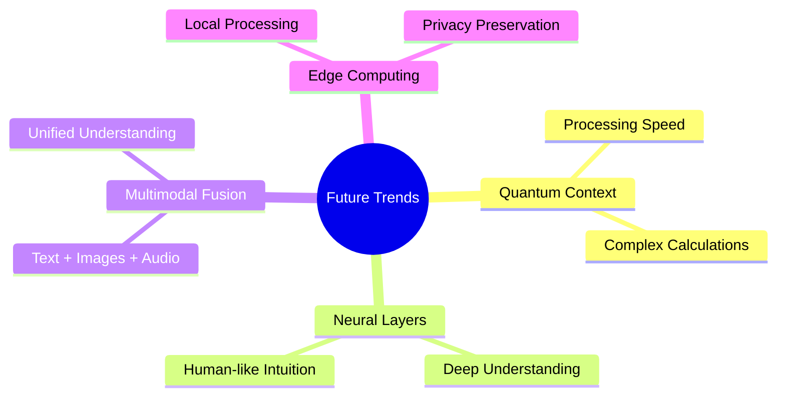

# Chapter 10: What's Next—The Future's Nuts

The horizon's wild—peek ahead:

---

## Navigation

- [← Previous: Success Metrics](09_success_metrics.md)
- [Next: Wrap-Up →](11_wrap_up.md)
- [🏠 Back to Main](README.md)

---

## 10.1 Emerging Trends

- **Quantum Context**: Crunches data at warp speed.
- **Neural Layers**: AI brains that think deeper.

## 10.2 Why It's Cool

- **Quantum**: Sorts context like a superhero.
- **Neural**: Mimics human intuition—creepy, but awesome.

## 10.3 Next-Generation Technologies

### Quantum-Enhanced Context Processing

**Current State**: Research phase, limited availability
**Promise**: Exponential improvement in complex context matching
**Timeline**: 5-10 years for practical applications
**Impact**: Could solve the "needle in haystack" problem for massive knowledge bases

### Multimodal Context Fusion

**Current State**: Early adoption in specialized applications  
**Promise**: Seamless integration of text, images, audio, and structured data
**Timeline**: 2-3 years for mainstream adoption
**Impact**: More natural, comprehensive AI interactions

### Edge-Based Context Systems

**Current State**: Pilot deployments in privacy-sensitive industries
**Promise**: Context processing without cloud dependency
**Timeline**: 1-2 years for enterprise adoption
**Impact**: Faster responses, better privacy, offline capability

### Neuromorphic Context Processing

**Current State**: Academic research with some commercial prototypes
**Promise**: Brain-inspired processing that adapts and learns continuously
**Timeline**: 3-5 years for specialized applications
**Impact**: Context systems that truly understand and remember like humans

## 10.4 Standards and Protocols Evolution

### Model Context Protocol (MCP) 2.0

**Expected Features**:

- Enhanced security with zero-trust architecture
- Improved performance with streaming context updates
- Better resource discovery and management
- Native support for multimodal contexts

### Context Quality Standards

**Industry Initiatives**:
- ISO standards for context system evaluation
- Open-source benchmarking frameworks
- Certification programs for context engineers

### Interoperability Protocols

**Future Vision**:
- Universal context exchange between different AI systems
- Standardized context formats across vendors
- Federated context networks enabling global knowledge sharing

## 10.5 Societal and Business Implications

### The Democratization of Expertise

**Impact**: Context-enhanced AI will make expert-level knowledge accessible to everyone
**Examples**: 
- Rural doctors accessing specialist knowledge
- Small businesses getting enterprise-level insights
- Students learning from world-class educators

### Privacy and Ownership Challenges

**Issues**:
- Who owns the insights derived from aggregated context?
- How do we protect individual privacy in context-rich systems?
- What are the implications of AI systems that "know everything"?

### Economic Disruption

**Predictions**:
- New job categories: Context Engineers, AI Trainers, System Architects
- Transformation of existing roles: Enhanced capabilities rather than replacement
- Economic advantages for organizations with superior context systems

## 10.6 Research Frontiers

### Causal Context Understanding

**Goal**: AI systems that understand not just correlation but causation
**Applications**: Medical diagnosis, financial planning, scientific research
**Challenges**: Distinguishing causation from correlation in complex systems

### Temporal Context Reasoning

**Goal**: AI that understands how context changes over time
**Applications**: Historical analysis, trend prediction, lifecycle management
**Challenges**: Balancing historical knowledge with current information

### Emotional and Social Context

**Goal**: AI that understands human emotions and social dynamics
**Applications**: Mental health support, team collaboration, customer service
**Challenges**: Cultural sensitivity, privacy concerns, ethical implications

## 10.7 Preparing for the Future

### Skills to Develop

**Technical Skills**:
- Advanced prompt engineering
- Multimodal AI system design
- Distributed systems architecture
- Privacy-preserving technologies

**Business Skills**:
- AI ethics and governance
- Change management for AI adoption
- ROI measurement for AI systems
- Cross-functional collaboration

### Investment Areas

**For Individuals**:
- Continuous learning in AI/ML technologies
- Hands-on experience with emerging tools
- Understanding of domain-specific applications

**For Organizations**:
- Context system infrastructure
- Data quality and governance programs
- AI talent acquisition and development
- Strategic partnerships with AI vendors

## 10.8 Predictions and Timeline

### Near Term (1-2 years)

- MCP becomes the standard for enterprise context integration
- Multimodal context systems go mainstream
- Edge computing enables new privacy-preserving applications
- Industry-specific context standards emerge

### Medium Term (3-5 years)

- Quantum-enhanced context processing in specialized domains
- Fully autonomous context discovery and management
- Global federated context networks
- Context systems with human-level reasoning capabilities

### Long Term (5+ years)

- Ubiquitous context-aware computing
- AI systems with persistent, evolving memory
- Context systems that predict user needs before they're expressed
- Integration of context AI with augmented reality and brain-computer interfaces

---

## Preparing Your Organization

### Strategic Planning

1. **Assess Current State**: Where are you now with context systems?
2. **Define Vision**: Where do you want to be in 3-5 years?
3. **Identify Gaps**: What capabilities do you need to develop?
4. **Create Roadmap**: Prioritized plan for context system evolution

### Investment Priorities

1. **Foundation**: Solid data infrastructure and governance
2. **Capabilities**: Team skills and technical expertise
3. **Innovation**: Pilot projects and experimental initiatives
4. **Partnerships**: Relationships with technology providers and research institutions

---

## Key Takeaways

- The future of context engineering is incredibly promising
- Multiple breakthrough technologies are converging
- Organizations need to start preparing now for these changes
- The competitive advantage will go to those who master context systems early

---

## Next Steps

Ready to start your context engineering journey? Chapter 11 provides the action plan to get you building immediately.
