# Chapter 1: Introduction to Embeddings

## What Are Embeddings?

Embeddings are numerical representations of data that capture semantic meaning and relationships in a high-dimensional vector space. In the context of retrieval-intensive systems, embeddings transform human-readable content like text, images, or audio into numerical vectors that machines can efficiently process and compare.

Think of embeddings as a universal translator that converts diverse data types into a common mathematical language. Just as humans can understand that "car" and "automobile" are similar concepts, embeddings place related items closer together in vector space, enabling machines to understand and compute semantic similarity.

## The Evolution of Embeddings in 2025

The embedding landscape has evolved dramatically since the early days of Word2Vec and GloVe. In 2025, we're witnessing several key developments:

### Current State of the Art

Based on the latest MTEB (Massive Text Embedding Benchmark) leaderboard and industry developments:

- **OpenAI's text-embedding-3-large** leads many benchmarks with 64.6% average MTEB score
- **Sentence Transformers** ecosystem provides over 10,000 pre-trained models
- **Multimodal embeddings** enabling text-image-audio understanding
- **Specialized domain models** for code, scientific literature, and legal documents

### Key Trends in 2025

1. **Efficiency Focus**: Models like text-embedding-3-small offer 5x cost reduction while maintaining performance
2. **Matryoshka Representations**: Variable-dimension embeddings allowing flexible trade-offs
3. **Quantization Advances**: 8-bit and binary embeddings for edge deployment
4. **Real-time Adaptation**: Dynamic embeddings that update with new information
5. **Multilingual Capabilities**: Unified models supporting 100+ languages

```mermaid
flowchart TD
    %% Data Sources
    subgraph "Data Sources"
        A1[📄 Text Documents]
        A2[🖼️ Images]
        A3[🔊 Audio]
        A4[💻 Code]
    end
    %% Embedding Models
    subgraph "Embedding Models"
        B1[⚙️ Dense Models<br/>BERT, OpenAI]
        B2[⚙️ Sparse Models<br/>BM25, SPLADE]
        B3[⚙️ Multimodal Models<br/>CLIP, ALIGN]
    end
    %% Vector Representations
    subgraph "Vector Representations"
        C1[🔢 384-3072 dims]
        C2[🔢 Semantic Vectors]
        C3[🔢 Compressed Formats]
    end
    %% Retrieval Systems
    subgraph "Retrieval Systems"
        D1[🔍 Semantic Search]
        D2[🎯 Recommendation]
        D3[📊 Classification]
        D4[🔗 Clustering]
    end
    A1 --> B1
    A2 --> B3
    A3 --> B3
    A4 --> B1
    B1 --> C2
    B2 --> C1
    B3 --> C3
    C1 --> D1
    C2 --> D2
    C3 --> D3
    C2 --> D4
    classDef source fill:#e1f5fe,stroke:#01579b,stroke-width:2px,color:#000;
    classDef model fill:#f3e5f5,stroke:#4a148c,stroke-width:2px,color:#000;
    classDef vector fill:#e8f5e8,stroke:#1b5e20,stroke-width:2px,color:#000;
    classDef retrieval fill:#fff3e0,stroke:#e65100,stroke-width:2px,color:#000;
    class A1,A2,A3,A4 source;
    class B1,B2,B3 model;
    class C1,C2,C3 vector;
    class D1,D2,D3,D4 retrieval;
```

## Why Embeddings Matter for Retrieval-Intensive Systems

### Traditional vs. Embedding-Based Approaches

Traditional keyword-based search systems rely on exact or fuzzy string matching. While effective for specific queries, they struggle with:

- **Semantic understanding**: "car" vs. "automobile" are treated as different
- **Context awareness**: "bank" (financial) vs. "bank" (river) disambiguation
- **Multilingual content**: Cross-language information retrieval
- **Complex queries**: Natural language questions requiring inference

Embedding-based systems address these limitations by:

- **Capturing semantic relationships**: Similar concepts cluster in vector space
- **Enabling fuzzy matching**: Similarity scores instead of exact matches
- **Supporting multimodal queries**: Text queries matching images or vice versa
- **Facilitating personalization**: User preferences encoded as vectors

### Performance Benefits

Modern embedding systems demonstrate significant improvements:

- **Recall improvements**: 20-40% better than keyword-only systems
- **User satisfaction**: Higher relevance scores in A/B tests
- **Multilingual support**: Single model handling 100+ languages
- **Real-time performance**: Sub-millisecond similarity computations

## The Six Core Embedding Types

This tutorial focuses on six fundamental embedding approaches, each optimized for different scenarios:

### 1. Sparse Embeddings

High-dimensional vectors with mostly zero values, excellent for keyword-based retrieval.

**Examples**: BM25, TF-IDF, SPLADE

**Use cases**: Document search, exact matching

**Advantages**: Fast, interpretable, low memory for storage

**Limitations**: Limited semantic understanding

### 2. Dense Embeddings

Compact vectors where most dimensions contain non-zero values, capturing rich semantic information.

**Examples**: BERT, Sentence-BERT, OpenAI embeddings

**Use cases**: Semantic search, recommendation systems

**Advantages**: Rich semantic representation, good generalization

**Limitations**: Higher computational cost, less interpretable

### 3. Quantized Embeddings

Compressed versions of dense embeddings using lower precision (int8, int4).

**Examples**: FAISS quantization, product quantization

**Use cases**: Large-scale retrieval, memory-constrained environments

**Advantages**: Reduced memory usage, faster computation

**Limitations**: Slight accuracy loss, quantization artifacts

### 4. Binary Embeddings

Ultra-compact representations using only 0s and 1s.

**Examples**: Binary BERT, HashNet

**Use cases**: Edge devices, ultra-fast similarity computation

**Advantages**: Minimal storage, very fast operations

**Limitations**: Significant accuracy trade-offs

### 5. Variable-Dimension Embeddings

Flexible embeddings that can be truncated to different sizes based on requirements.

**Examples**: Matryoshka embeddings, Universal Sentence Encoder variants

**Use cases**: Adaptive systems, multi-tier architectures

**Advantages**: Flexible resource allocation, single model for multiple use cases

**Limitations**: Complex optimization, potential performance degradation

### 6. Multi-Vector Embeddings

Systems using multiple vectors per item for fine-grained representation.

**Examples**: ColBERT, Poly-encoders

**Use cases**: Complex reasoning, high-precision retrieval

**Advantages**: Very high accuracy, detailed matching

**Limitations**: High computational and storage costs

```mermaid
flowchart LR
    subgraph "Embedding Types"
        Sparse[🟦 Sparse]
        Dense[🟢 Dense]
        Quantized[📦 Quantized]
        Binary[🔢 Binary]
        VarDim[🔀 Variable-Dimension]
        MultiVec[🔁 Multi-Vector]
    end
    Sparse --> SparseInfo1[🔹 High dims<br/>Mostly zeros]
    Sparse --> SparseInfo2[🔹 Exact match<br/>Fast]
    Dense --> DenseInfo1[🔹 Compact size<br/>Rich semantics]
    Dense --> DenseInfo2[🔹 Versatile<br/>General purpose]
    Quantized --> QuantInfo1[🔹 Compressed dense<br/>Lower precision]
    Quantized --> QuantInfo2[🔹 Memory efficient]
    Binary --> BinaryInfo1[🔹 Ultra compact<br/>Binary values]
    Binary --> BinaryInfo2[🔹 Ultra-fast ops]
    VarDim --> VarInfo1[🔹 Adaptive size<br/>Task aware]
    VarDim --> VarInfo2[🔹 Resource efficient]
    MultiVec --> MultiInfo1[🔹 Multiple vectors<br/>Per item]
    MultiVec --> MultiInfo2[🔹 Highest accuracy]

    %% Styles
    classDef type fill:#f0f4c3,stroke:#827717,stroke-width:2px,color:#000;
    classDef info fill:#e8eaf6,stroke:#3949ab,stroke-width:1px,color:#000;
    class Sparse,Dense,Quantized,Binary,VarDim,MultiVec type;
    class SparseInfo1,SparseInfo2,DenseInfo1,DenseInfo2,QuantInfo1,QuantInfo2,BinaryInfo1,BinaryInfo2,VarInfo1,VarInfo2,MultiInfo1,MultiInfo2 info;
``` 

## Understanding Vector Similarity

At the heart of embedding-based retrieval is the concept of vector similarity. When we encode text, images, or other data as embeddings, we can measure how "similar" two pieces of content are by computing the distance or similarity between their vector representations.

### Common Similarity Metrics

1. **Cosine Similarity**: Measures the angle between vectors, ranging from -1 to 1
   - Best for: Most text applications, normalized embeddings
   - Formula: `cos(θ) = (A·B) / (||A|| × ||B||)`

2. **Euclidean Distance**: Measures straight-line distance between vectors
   - Best for: When magnitude matters, spatial relationships
   - Formula: `d = sqrt(Σ(ai - bi)²)`

3. **Dot Product**: Direct multiplication of vector components
   - Best for: When embeddings are normalized, efficiency is crucial
   - Formula: `A·B = Σ(ai × bi)`

### Practical Implications

The choice of similarity metric affects:
- **Search results ranking**: Different metrics may return different orderings
- **Performance**: Dot product is fastest, cosine similarity most robust
- **Interpretability**: Cosine similarity scores are easier to interpret

## The Modern Embedding Ecosystem

### Key Players and Models

**Commercial Solutions:**
- **OpenAI**: text-embedding-3-small/large, best overall performance
- **Cohere**: Multilingual models, strong fine-tuning capabilities
- **Google**: Universal Sentence Encoder, PaLM embeddings
- **Anthropic**: Claude-based embeddings for long contexts

**Open Source Leaders:**
- **Sentence Transformers**: Largest ecosystem, easy fine-tuning
- **MTEB**: Comprehensive benchmarking framework
- **Hugging Face**: Model hub with 10,000+ embedding models
- **FAISS**: Facebook's similarity search library

### Benchmarking Standards

The **Massive Text Embedding Benchmark (MTEB)** has become the de facto standard for evaluating embedding quality across:
- **Retrieval tasks**: Information retrieval, semantic search
- **Classification**: Text categorization and labeling
- **Clustering**: Document grouping and topic modeling
- **Pair classification**: Textual entailment, paraphrase detection
- **Reranking**: Improving initial retrieval results
- **Semantic Textual Similarity**: Direct similarity scoring

### Cost Considerations in 2025

Understanding the economics of embedding systems:

**API Costs (per 1M tokens):**
- OpenAI text-embedding-3-small: $0.02
- OpenAI text-embedding-3-large: $0.13
- Cohere Embed v3: $0.10
- Self-hosted Sentence Transformers: Hardware costs only

**Self-Hosting Considerations:**
- **Hardware requirements**: GPU memory for large models
- **Operational overhead**: Model updates, monitoring, scaling
- **Performance optimization**: Batching, caching, load balancing

## Learning Path and Prerequisites

### What You Need to Know

**Essential Background:**
- Python programming (intermediate level)
- Basic machine learning concepts
- Understanding of vectors and linear algebra
- Familiarity with APIs and REST services

**Helpful but Not Required:**
- Deep learning fundamentals
- Natural language processing experience
- Database and indexing concepts
- Cloud computing knowledge

### How to Use This Tutorial

This tutorial is designed for progressive learning:

1. **Start with Chapter 2** for immediate hands-on experience
2. **Deep dive in Chapter 3** for comprehensive understanding
3. **Apply knowledge in Chapters 4-6** with real implementations
4. **Explore advanced topics in Chapter 7** for cutting-edge techniques
5. **Reference Chapter 8** for troubleshooting and optimization

Each chapter includes:
- **Theoretical foundations**: Why and when to use each approach
- **Practical examples**: Working code you can run immediately
- **Real-world case studies**: How companies use these techniques
- **Performance comparisons**: Benchmarks and trade-off analysis

## Industry Applications and Success Stories

### E-commerce Giants
- **Amazon**: Product search using dense embeddings for semantic matching
- **eBay**: Multilingual search supporting 20+ languages with unified embeddings
- **Alibaba**: Visual-textual embeddings for cross-modal product discovery

### Technology Companies
- **Google**: Universal search across docs, images, and videos
- **Microsoft**: GitHub Copilot using code embeddings for suggestion
- **Meta**: Facebook's news feed ranking with user preference embeddings

### Specialized Domains
- **Medical**: PubMed search with biomedical embeddings
- **Legal**: Case law retrieval using legal domain embeddings
- **Finance**: Document analysis for compliance and risk assessment

## Measuring Success

### Key Performance Indicators

**Retrieval Quality:**
- **Precision@K**: Relevant results in top K retrieved items
- **Recall**: Coverage of relevant documents in the corpus
- **Mean Reciprocal Rank (MRR)**: Average reciprocal rank of first relevant result
- **NDCG**: Normalized Discounted Cumulative Gain

**System Performance:**
- **Latency**: Time from query to results
- **Throughput**: Queries processed per second
- **Resource utilization**: CPU, memory, storage efficiency
- **Cost per query**: Total system cost divided by query volume

**Business Metrics:**
- **User engagement**: Click-through rates, session duration
- **Conversion rates**: Purchases, sign-ups, goal completions
- **User satisfaction**: Ratings, feedback scores
- **Revenue impact**: Direct business value attribution

## Chapter Summary

Embeddings represent a fundamental shift in how we approach information retrieval and similarity computation. They enable systems to understand semantic meaning rather than just matching keywords, opening possibilities for more intelligent and user-friendly applications.

Key takeaways from this introduction:

1. **Embeddings are universal translators** converting diverse data into comparable numerical representations
2. **Six core types** each optimized for different use cases and constraints
3. **The 2025 landscape** offers mature tools, standardized benchmarks, and clear best practices
4. **Success requires** understanding trade-offs between accuracy, speed, and resource consumption
5. **Real-world impact** is measurable through both technical and business metrics

### What's Next

In Chapter 2, we'll get hands-on immediately with a 5-minute semantic search implementation. You'll see embeddings in action and understand their practical value before diving deeper into the technical details.

The journey from novice to expert in embeddings requires both theoretical understanding and practical experience. This tutorial provides both, ensuring you can not only implement embedding systems but also optimize them for your specific use cases.

---

**Ready to start building?** Continue to [Chapter 2: Quick Start - Your First Embedding-based Search](02_quick_start.md) to get your hands dirty with code and see immediate results.
