# Chapter 3: Deep Dive into Embedding Types

## Introduction to the Six Core Embedding Types

Building on the quick start from Chapter 2, this chapter provides a comprehensive exploration of the six fundamental embedding approaches. Each type represents a different trade-off between accuracy, efficiency, storage requirements, and computational complexity. Understanding these trade-offs is crucial for selecting the right approach for your specific use case.

The six types we'll explore are:

1. **Sparse Embeddings** - High-dimensional, mostly zero vectors
2. **Dense Embeddings** - Compact, information-rich representations  
3. **Quantized Embeddings** - Compressed dense embeddings with reduced precision
4. **Binary Embeddings** - Ultra-compact binary representations
5. **Variable-Dimension Embeddings** - Flexible, adaptive vector sizes
6. **Multi-Vector Embeddings** - Multiple vectors per item for detailed matching

## Understanding the Embedding Landscape

Before diving into specifics, let's understand how these types relate to each other and the problems they solve:

```mermaid
flowchart TD
    %% Input and Strategy
    subgraph "Input"
        Text[💬 Text Input]
    end
    subgraph "Embedding Strategy"
        Strategy[🧩 Choose Strategy]
    end
    %% Sparse Path
    subgraph "Sparse Embeddings"
        Sparse[🟦 Sparse]
        BM25[🔍 BM25/TF-IDF]
        SPLADE[🧠 SPLADE]
        Fast[⚡ Fast]
        Interp[🔎 Interpretable]
    end
    %% Dense Path
    subgraph "Dense Embeddings"
        Dense[🟩 Dense]
        StdDense[🔧 Standard]
        Quant[🟨 Quantized]
        Binary[🔢 Binary]
        VarDim[🌀 Variable-Dim]
        Multi[🧬 Multi-Vector]
        Best[🏆 Top Accuracy]
        MemEff[💾 Memory Efficient]
        Ultra[⚡ Ultra Fast]
        Adapt[🔄 Adaptive]
        Precise[🎯 High Precision]
    end
    %% Connections
    Text --> Strategy
    Strategy --> Sparse
    Strategy --> Dense
    Sparse --> BM25
    Sparse --> SPLADE
    BM25 --> Fast
    SPLADE --> Interp
    Dense --> StdDense
    StdDense --> Multi
    StdDense --> Best
    StdDense --> MemEff
    StdDense --> Ultra
    StdDense --> Adapt
    StdDense --> Precise
    StdDense --> Quant
    Quant --> Binary
    Quant --> VarDim
    %% Styling
    classDef input fill:#e1f5fe,stroke:#01579b,stroke-width:2px,color:#222;
    classDef strategy fill:#f3e5f5,stroke:#4a148c,stroke-width:2px,color:#222;
    classDef sparse fill:#fff3e0,stroke:#e65100,stroke-width:2px,color:#222;
    classDef dense fill:#e8f5e8,stroke:#2e7d32,stroke-width:2px,color:#222;
    classDef detail fill:#f8f9f9,stroke:#616a6b,stroke-width:1px,color:#222;
    class Text input;
    class Strategy strategy;
    class Sparse sparse;
    class Dense dense;
    class BM25,SPLADE,Fast,Interp,Quant,Binary,VarDim,Multi,Best,MemEff,Ultra,Adapt,Precise detail;
```

``` 
```

## 1. Sparse Embeddings: The Foundation of Information Retrieval

### Conceptual Foundation

Sparse embeddings represent text as high-dimensional vectors where most elements are zero. This approach mirrors traditional information retrieval methods but can be enhanced with neural components for better semantic understanding.

**Key Characteristics:**

- **High dimensionality** (10K-100K+ dimensions)
- **Mostly zeros** (95%+ sparsity)
- **Interpretable** (each dimension often corresponds to a term)
- **Efficient storage** (only store non-zero values)

### Traditional Sparse Methods

#### TF-IDF (Term Frequency-Inverse Document Frequency)

The classic approach where each dimension represents a term in the vocabulary:

```python
# Traditional TF-IDF Implementation
from sklearn.feature_extraction.text import TfidfVectorizer
import numpy as np
from scipy.sparse import csr_matrix

def create_tfidf_embeddings(documents, max_features=10000):
    """Create TF-IDF sparse embeddings."""
    
    # Initialize TF-IDF vectorizer
    vectorizer = TfidfVectorizer(
        max_features=max_features,
        lowercase=True,
        stop_words='english',
        ngram_range=(1, 2)  # Include bigrams
    )
    
    # Fit and transform documents
    tfidf_matrix = vectorizer.fit_transform(documents)
    feature_names = vectorizer.get_feature_names_out()
    
    print(f"TF-IDF Matrix Shape: {tfidf_matrix.shape}")
    print(f"Sparsity: {1 - tfidf_matrix.nnz / np.prod(tfidf_matrix.shape):.3f}")
    
    return tfidf_matrix, vectorizer, feature_names

# Example usage
documents = [
    "Machine learning algorithms process large datasets",
    "Natural language processing enables computer understanding",
    "Deep learning networks require extensive training data",
    "Artificial intelligence transforms various industries",
    "Data science combines statistics and programming"
]

tfidf_matrix, vectorizer, features = create_tfidf_embeddings(documents)

# Examine a document's representation
doc_idx = 0
doc_vector = tfidf_matrix[doc_idx]
non_zero_indices = doc_vector.nonzero()[1]

print(f"\nDocument: '{documents[doc_idx]}'")
print("Non-zero terms and weights:")
for idx in non_zero_indices:
    weight = doc_vector[0, idx]
    term = features[idx]
    print(f"  {term}: {weight:.3f}")
```

#### BM25: The Gold Standard

BM25 remains a cornerstone of search systems due to its robust performance:

```python
import math
from collections import Counter, defaultdict

class BM25:
    """BM25 implementation for sparse retrieval."""
    
    def __init__(self, k1=1.2, b=0.75):
        self.k1 = k1  # Term frequency saturation parameter
        self.b = b    # Length normalization parameter
        
    def fit(self, documents):
        """Fit BM25 on document collection."""
        self.documents = documents
        self.doc_count = len(documents)
        
        # Tokenize and compute statistics
        self.doc_tokens = [doc.lower().split() for doc in documents]
        self.doc_lengths = [len(tokens) for tokens in self.doc_tokens]
        self.avg_doc_length = sum(self.doc_lengths) / self.doc_count
        
        # Build vocabulary and document frequency
        self.vocab = set()
        self.doc_freq = defaultdict(int)
        
        for tokens in self.doc_tokens:
            unique_tokens = set(tokens)
            for token in unique_tokens:
                self.vocab.add(token)
                self.doc_freq[token] += 1
                
    def get_scores(self, query):
        """Compute BM25 scores for query against all documents."""
        query_tokens = query.lower().split()
        scores = []
        
        for doc_idx, doc_tokens in enumerate(self.doc_tokens):
            score = 0.0
            doc_length = self.doc_lengths[doc_idx]
            
            # Count term frequencies in document
            term_freq = Counter(doc_tokens)
            
            for term in query_tokens:
                if term in self.vocab:
                    tf = term_freq[term]
                    df = self.doc_freq[term]
                    idf = math.log((self.doc_count - df + 0.5) / (df + 0.5))
                    
                    # BM25 formula
                    numerator = tf * (self.k1 + 1)
                    denominator = tf + self.k1 * (1 - self.b + self.b * doc_length / self.avg_doc_length)
                    score += idf * (numerator / denominator)
                    
            scores.append(score)
            
        return scores

# Example usage
bm25 = BM25()
bm25.fit(documents)

query = "machine learning data"
scores = bm25.get_scores(query)

# Rank documents by BM25 score
ranked_docs = sorted(enumerate(scores), key=lambda x: x[1], reverse=True)

print(f"Query: '{query}'")
print("BM25 Rankings:")
for rank, (doc_idx, score) in enumerate(ranked_docs[:3], 1):
    print(f"  {rank}. [{score:.3f}] {documents[doc_idx]}")
```

### Neural Sparse Embeddings: SPLADE

SPLADE (SParse Lexical And expansion modDEl) represents the state-of-the-art in neural sparse embeddings, combining interpretability with semantic understanding:

```python
# Using SPLADE from Hugging Face
from transformers import AutoModelForMaskedLM, AutoTokenizer
import torch
import torch.nn.functional as F

class SPLADEEncoder:
    """SPLADE encoder for neural sparse embeddings."""
    
    def __init__(self, model_name="naver/splade-cocondenser-ensembledistil"):
        self.device = torch.device("cuda" if torch.cuda.is_available() else "cpu")
        
        # Load pre-trained SPLADE model
        self.tokenizer = AutoTokenizer.from_pretrained(model_name)
        self.model = AutoModelForMaskedLM.from_pretrained(model_name)
        self.model.to(self.device)
        self.model.eval()
        
        print(f"Loaded SPLADE model: {model_name}")
        print(f"Vocabulary size: {len(self.tokenizer)}")
        
    def encode(self, texts, max_length=256):
        """Encode texts to SPLADE sparse representations."""
        
        if isinstance(texts, str):
            texts = [texts]
            
        # Tokenize
        inputs = self.tokenizer(
            texts,
            padding=True,
            truncation=True,
            max_length=max_length,
            return_tensors="pt"
        )
        inputs = {k: v.to(self.device) for k, v in inputs.items()}
        
        # Forward pass
        with torch.no_grad():
            outputs = self.model(**inputs)
            logits = outputs.logits
            
            # Apply ReLU and log transformation (SPLADE activation)
            sparse_embeddings = F.relu(logits)
            sparse_embeddings = torch.log(1 + sparse_embeddings)
            
            # Max pooling over sequence length
            sparse_embeddings = torch.max(
                sparse_embeddings * inputs["attention_mask"].unsqueeze(-1), 
                dim=1
            )[0]
            
        return sparse_embeddings.cpu()
    
    def get_sparse_representation(self, text, top_k=50):
        """Get interpretable sparse representation."""
        embedding = self.encode(text)[0]
        
        # Get top-k non-zero terms
        values, indices = torch.topk(embedding, k=min(top_k, len(embedding)))
        
        terms_weights = []
        for idx, weight in zip(indices, values):
            if weight > 0:
                term = self.tokenizer.decode([idx])
                terms_weights.append((term, weight.item()))
                
        return terms_weights

# Example usage (requires GPU for optimal performance)
if torch.cuda.is_available():
    splade = SPLADEEncoder()
    
    # Encode documents
    documents = [
        "Machine learning algorithms analyze patterns in data",
        "Natural language processing understands human communication"
    ]
    
    doc_embeddings = splade.encode(documents)
    print(f"SPLADE embeddings shape: {doc_embeddings.shape}")
    
    # Examine sparse representation
    query = "artificial intelligence machine learning"
    sparse_terms = splade.get_sparse_representation(query)
    
    print(f"\nQuery: '{query}'")
    print("SPLADE expansion terms:")
    for term, weight in sparse_terms[:10]:
        print(f"  {term}: {weight:.3f}")
```

### Performance Characteristics

**Advantages of Sparse Embeddings:**

- **Interpretability**: Can see exactly which terms contribute to matches
- **Exact lexical matching**: Preserves traditional IR benefits
- **Efficient storage**: Only store non-zero values
- **Fast retrieval**: Leverage inverted index data structures

**Limitations:**

- **Vocabulary mismatch**: Struggle with synonyms and paraphrases
- **High dimensionality**: Can require large vocabulary spaces
- **Limited semantic understanding**: Traditional methods lack contextual understanding

**Performance Benchmarks (MTEB):**

- **BM25**: ~42% average score
- **SPLADE++**: ~37.6% (with interpretability benefits)
- **TF-IDF**: ~35% average score

## 2. Dense Embeddings: The Semantic Powerhouse

### Conceptual Foundation

Dense embeddings represent the current state-of-the-art for most retrieval tasks. Every dimension contributes meaningful information, creating rich semantic representations in relatively low-dimensional spaces.

**Key Characteristics:**

- **Low dimensionality** (128-1024 dimensions)
- **Every dimension is meaningful** (no zeros)
- **Rich semantic content** (captures context and meaning)
- **Pre-trained on large corpora** (billions of text pairs)

### Modern Dense Embedding Models

#### Sentence Transformers Ecosystem

The most popular framework for dense embeddings, with thousands of pre-trained models:

```python
from sentence_transformers import SentenceTransformer, util
import numpy as np
import time

class DenseEmbeddingBenchmark:
    """Compare different dense embedding models."""
    
    def __init__(self):
        self.models = {}
        self.results = {}
        
    def load_models(self, model_names):
        """Load multiple embedding models for comparison."""
        for name in model_names:
            print(f"Loading {name}...")
            start_time = time.time()
            self.models[name] = SentenceTransformer(name)
            load_time = time.time() - start_time
            
            # Get model info
            dim = self.models[name].get_sentence_embedding_dimension()
            print(f"  Dimensions: {dim}, Load time: {load_time:.2f}s")
            
    def benchmark_models(self, texts, queries):
        """Benchmark encoding speed and search accuracy."""
        
        for model_name, model in self.models.items():
            print(f"\nBenchmarking {model_name}:")
            
            # Encode documents
            start_time = time.time()
            doc_embeddings = model.encode(texts, show_progress_bar=False)
            encode_time = time.time() - start_time
            
            # Encode queries and search
            query_embeddings = model.encode(queries, show_progress_bar=False)
            
            # Compute similarities
            start_time = time.time()
            similarities = util.cos_sim(query_embeddings, doc_embeddings)
            search_time = time.time() - start_time
            
            # Store results
            self.results[model_name] = {
                'dimensions': doc_embeddings.shape[1],
                'encode_time': encode_time,
                'search_time': search_time,
                'docs_per_second': len(texts) / encode_time,
                'queries_per_second': len(queries) / search_time,
                'similarities': similarities
            }
            
            print(f"  Encoding: {encode_time:.3f}s ({len(texts)/encode_time:.1f} docs/s)")
            print(f"  Search: {search_time:.3f}s ({len(queries)/search_time:.1f} queries/s)")
            
    def show_search_results(self, query_idx=0, top_k=3):
        """Show search results for different models."""
        for model_name, results in self.results.items():
            similarities = results['similarities']
            scores, indices = torch.topk(similarities[query_idx], top_k)
            
            print(f"\n{model_name} results:")
            for i, (score, idx) in enumerate(zip(scores, indices)):
                print(f"  {i+1}. [{score:.3f}] {texts[idx][:60]}...")

# Benchmark different dense models
benchmark = DenseEmbeddingBenchmark()

# Models to compare (from small to large)
model_names = [
    'all-MiniLM-L6-v2',           # 22.7M parameters, 384 dim
    'all-mpnet-base-v2',          # 109M parameters, 768 dim  
    'paraphrase-multilingual-mpnet-base-v2'  # Multilingual, 768 dim
]

# Load models
benchmark.load_models(model_names)

# Test documents
texts = [
    "Machine learning enables computers to learn from data without explicit programming",
    "Natural language processing helps computers understand human language",
    "Computer vision allows machines to interpret and analyze visual information",
    "Robotics combines AI with mechanical engineering for autonomous systems",
    "Data science extracts insights from structured and unstructured data",
    "Cloud computing provides scalable resources over the internet",
    "Cybersecurity protects digital systems from malicious attacks",
    "Blockchain creates secure and transparent distributed ledgers"
]

queries = [
    "How do computers learn from data?",
    "What helps machines understand text?",
    "How do robots see the world?"
]

# Run benchmark
benchmark.benchmark_models(texts, queries)
benchmark.show_search_results(query_idx=0)
```

#### OpenAI Embeddings: The Current Gold Standard

OpenAI's text-embedding-3 models represent the current state-of-the-art:

```python
import openai
import numpy as np
from typing import List, Optional

class OpenAIEmbeddings:
    """Wrapper for OpenAI embedding models."""
    
    def __init__(self, model="text-embedding-3-small", api_key=None):
        self.model = model
        self.client = openai.OpenAI(api_key=api_key)
        
        # Model specifications
        self.model_specs = {
            'text-embedding-3-small': {'max_dim': 1536, 'cost_per_1k': 0.02},
            'text-embedding-3-large': {'max_dim': 3072, 'cost_per_1k': 0.13},
            'text-embedding-ada-002': {'max_dim': 1536, 'cost_per_1k': 0.10}
        }
        
    def encode(self, texts: List[str], dimensions: Optional[int] = None) -> np.ndarray:
        """Encode texts using OpenAI embeddings."""
        
        if isinstance(texts, str):
            texts = [texts]
            
        # Prepare API call parameters
        params = {"input": texts, "model": self.model}
        if dimensions and self.model.startswith('text-embedding-3'):
            params["dimensions"] = dimensions
            
        # Call OpenAI API
        response = self.client.embeddings.create(**params)
        
        # Extract embeddings
        embeddings = [item.embedding for item in response.data]
        return np.array(embeddings)
    
    def estimate_cost(self, texts: List[str]) -> float:
        """Estimate API cost for embedding texts."""
        total_tokens = sum(len(text.split()) for text in texts)
        cost_per_token = self.model_specs[self.model]['cost_per_1k'] / 1000
        return total_tokens * cost_per_token

# Example usage (requires OpenAI API key)
# openai_embeddings = OpenAIEmbeddings(api_key="your-api-key")
# embeddings = openai_embeddings.encode(["Hello world", "Machine learning"])
```

### Understanding Dense Embedding Quality

#### Semantic Similarity Demonstration

```python
def demonstrate_semantic_understanding():
    """Show how dense embeddings capture semantic relationships."""
    
    model = SentenceTransformer('all-mpnet-base-v2')
    
    # Test semantic understanding
    test_cases = [
        {
            'query': 'dog',
            'candidates': ['puppy', 'canine', 'cat', 'automobile', 'house']
        },
        {
            'query': 'happy',
            'candidates': ['joyful', 'sad', 'ecstatic', 'angry', 'car']
        },
        {
            'query': 'machine learning',
            'candidates': ['artificial intelligence', 'deep learning', 'cooking', 'neural networks', 'gardening']
        }
    ]
    
    for case in test_cases:
        query = case['query']
        candidates = case['candidates']
        
        # Encode query and candidates
        query_emb = model.encode([query])
        candidate_embs = model.encode(candidates)
        
        # Compute similarities
        similarities = util.cos_sim(query_emb, candidate_embs)[0]
        
        # Sort by similarity
        results = list(zip(candidates, similarities))
        results.sort(key=lambda x: x[1], reverse=True)
        
        print(f"\nQuery: '{query}'")
        print("Semantic similarity ranking:")
        for candidate, similarity in results:
            print(f"  {similarity:.3f} - {candidate}")

demonstrate_semantic_understanding()
```

### Performance Characteristics

**Advantages of Dense Embeddings:**

- **Superior semantic understanding**: Captures meaning beyond keywords
- **Compact representation**: High information density
- **Transfer learning**: Pre-trained models work across domains
- **Multilingual capabilities**: Single model for multiple languages

**Limitations:**

- **Less interpretable**: Difficult to understand what each dimension represents
- **Higher computational cost**: Require neural network inference
- **Storage requirements**: Full precision floating point numbers

**Performance Benchmarks (MTEB Leaderboard 2024):**

- **OpenAI text-embedding-3-large**: 64.6% average
- **Sentence-T5-xl**: 63.5% average  
- **all-mpnet-base-v2**: 57.8% average
- **all-MiniLM-L6-v2**: 56.3% average

## 3. Quantized Embeddings: Efficiency Through Compression

### Conceptual Foundation

Quantized embeddings reduce memory usage and increase search speed by using lower precision representations. Instead of 32-bit floats, we use 8-bit integers, 4-bit integers, or even 2-bit representations.

**Quantization Benefits:**

- **4x-8x memory reduction** (from float32 to int8/int4)
- **Faster similarity computation** (integer operations)
- **Better cache utilization** (more vectors fit in memory)
- **Lower bandwidth requirements** (faster data transfer)

### Quantization Techniques

#### Scalar Quantization

The simplest approach maps floating-point values to integers:

```python
import numpy as np
import faiss
from sentence_transformers import SentenceTransformer

class QuantizedEmbeddings:
    """Implement various quantization techniques for embeddings."""
    
    def __init__(self, model_name='all-MiniLM-L6-v2'):
        self.model = SentenceTransformer(model_name)
        self.dimension = self.model.get_sentence_embedding_dimension()
        
    def scalar_quantization(self, embeddings, bits=8):
        """Apply scalar quantization to embeddings."""
        
        # Normalize embeddings to [-1, 1] range
        embeddings_normalized = embeddings / np.abs(embeddings).max(axis=1, keepdims=True)
        
        # Quantize to specified bit precision
        if bits == 8:
            quantized = np.round((embeddings_normalized + 1) * 127.5).astype(np.int8) - 128
            scale = 1.0 / 127.5
            offset = -1.0
        elif bits == 4:
            quantized = np.round((embeddings_normalized + 1) * 7.5).astype(np.int8) - 8
            scale = 1.0 / 7.5  
            offset = -1.0
        else:
            raise ValueError(f"Unsupported bit precision: {bits}")
            
        return quantized, scale, offset
    
    def dequantize(self, quantized, scale, offset):
        """Convert quantized embeddings back to float."""
        return (quantized.astype(np.float32) - offset) * scale
    
    def product_quantization(self, embeddings, n_subvectors=8, n_bits=8):
        """Apply product quantization (PQ)."""
        
        n_samples, dimension = embeddings.shape
        subvector_dim = dimension // n_subvectors
        n_centroids = 2 ** n_bits
        
        # Reshape embeddings into subvectors
        embeddings_reshaped = embeddings[:, :subvector_dim * n_subvectors].reshape(
            n_samples, n_subvectors, subvector_dim
        )
        
        # Train codebooks for each subvector
        codebooks = []
        codes = np.zeros((n_samples, n_subvectors), dtype=np.uint8)
        
        for i in range(n_subvectors):
            subvectors = embeddings_reshaped[:, i, :]
            
            # Use k-means to create codebook
            from sklearn.cluster import KMeans
            kmeans = KMeans(n_clusters=n_centroids, random_state=42, n_init=10)
            cluster_labels = kmeans.fit_predict(subvectors)
            
            codebooks.append(kmeans.cluster_centers_)
            codes[:, i] = cluster_labels
            
        return codes, codebooks
    
    def pq_decode(self, codes, codebooks):
        """Reconstruct embeddings from product quantization codes."""
        n_samples, n_subvectors = codes.shape
        subvector_dim = codebooks[0].shape[1]
        
        reconstructed = np.zeros((n_samples, n_subvectors * subvector_dim))
        
        for i in range(n_subvectors):
            start_idx = i * subvector_dim
            end_idx = start_idx + subvector_dim
            
            for j in range(n_samples):
                code = codes[j, i]
                reconstructed[j, start_idx:end_idx] = codebooks[i][code]
                
        return reconstructed

# Demonstration of quantization effects
def quantization_comparison():
    """Compare different quantization techniques."""
    
    quantizer = QuantizedEmbeddings()
    
    # Generate test embeddings
    texts = [
        "Machine learning transforms data into insights",
        "Natural language processing enables text understanding", 
        "Computer vision interprets visual information",
        "Robotics creates autonomous intelligent systems"
    ]
    
    original_embeddings = quantizer.model.encode(texts)
    print(f"Original embeddings shape: {original_embeddings.shape}")
    print(f"Original memory usage: {original_embeddings.nbytes / 1024:.2f} KB")
    
    # Test different quantization approaches
    quantization_methods = [
        ('8-bit scalar', lambda x: quantizer.scalar_quantization(x, bits=8)),
        ('4-bit scalar', lambda x: quantizer.scalar_quantization(x, bits=4)),
        ('Product Quantization', lambda x: quantizer.product_quantization(x, n_subvectors=8))
    ]
    
    for method_name, quantize_func in quantization_methods:
        print(f"\n{method_name}:")
        
        if 'scalar' in method_name:
            quantized, scale, offset = quantize_func(original_embeddings)
            reconstructed = quantizer.dequantize(quantized, scale, offset)
            memory_usage = quantized.nbytes / 1024
            compression_ratio = original_embeddings.nbytes / quantized.nbytes
            
        else:  # Product Quantization
            codes, codebooks = quantize_func(original_embeddings)
            reconstructed = quantizer.pq_decode(codes, codebooks)
            memory_usage = (codes.nbytes + sum(cb.nbytes for cb in codebooks)) / 1024
            compression_ratio = original_embeddings.nbytes / (codes.nbytes + sum(cb.nbytes for cb in codebooks))
        
        # Compute reconstruction error
        mse = np.mean((original_embeddings - reconstructed) ** 2)
        cosine_similarity = np.mean([
            np.dot(orig, recon) / (np.linalg.norm(orig) * np.linalg.norm(recon))
            for orig, recon in zip(original_embeddings, reconstructed)
        ])
        
        print(f"  Memory usage: {memory_usage:.2f} KB")
        print(f"  Compression ratio: {compression_ratio:.1f}x")
        print(f"  Reconstruction MSE: {mse:.6f}")
        print(f"  Average cosine similarity: {cosine_similarity:.4f}")

quantization_comparison()
```

#### FAISS Quantization

FAISS provides industrial-strength quantization implementations:

```python
def faiss_quantization_demo():
    """Demonstrate FAISS quantization techniques."""
    
    model = SentenceTransformer('all-MiniLM-L6-v2')
    
    # Generate larger dataset for meaningful comparison
    texts = [f"Document {i} about machine learning and artificial intelligence" for i in range(1000)]
    embeddings = model.encode(texts, show_progress_bar=True)
    embeddings = embeddings.astype('float32')
    
    dimension = embeddings.shape[1]
    print(f"Dataset: {embeddings.shape[0]} embeddings, {dimension} dimensions")
    
    # Different FAISS index types
    index_configs = [
        ('Flat (No compression)', faiss.IndexFlatL2(dimension)),
        ('IVF with 100 clusters', faiss.IndexIVFFlat(faiss.IndexFlatL2(dimension), dimension, 100)),
        ('Product Quantization', faiss.IndexPQ(dimension, 8, 8)),  # 8 subvectors, 8 bits each
        ('IVF + PQ', faiss.IndexIVFPQ(faiss.IndexFlatL2(dimension), dimension, 100, 8, 8))
    ]
    
    # Test each index type
    results = {}
    query_embedding = embeddings[:5]  # Use first 5 as queries
    
    for name, index in index_configs:
        print(f"\nTesting {name}:")
        
        # Train index if needed
        if hasattr(index, 'train'):
            index.train(embeddings)
            
        # Add embeddings to index
        start_time = time.time()
        index.add(embeddings)
        index_time = time.time() - start_time
        
        # Search
        k = 10
        start_time = time.time()
        distances, indices = index.search(query_embedding, k)
        search_time = time.time() - start_time
        
        # Calculate memory usage (approximate)
        if hasattr(index, 'sa_code_size'):
            memory_mb = (index.sa_code_size() * embeddings.shape[0]) / (1024 * 1024)
        else:
            memory_mb = (embeddings.nbytes) / (1024 * 1024)
        
        print(f"  Index time: {index_time:.3f}s")
        print(f"  Search time: {search_time:.3f}s")
        print(f"  Memory usage: {memory_mb:.2f} MB")
        print(f"  Queries per second: {len(query_embedding) / search_time:.1f}")
        
        results[name] = {
            'index_time': index_time,
            'search_time': search_time,
            'memory_mb': memory_mb,
            'qps': len(query_embedding) / search_time
        }

faiss_quantization_demo()
```

### Performance Impact Analysis

#### Quality vs. Efficiency Trade-offs

```python
def analyze_quantization_tradeoffs():
    """Analyze the trade-offs between compression and accuracy."""
    
    model = SentenceTransformer('all-mpnet-base-v2')
    
    # Create test dataset with known similarity relationships
    documents = [
        "Machine learning algorithms learn patterns from data",
        "Deep learning uses neural networks with multiple layers", 
        "Artificial intelligence mimics human cognitive functions",
        "Computer vision processes and analyzes visual information",
        "Natural language processing handles human language data",
        "The weather today is sunny and warm",
        "Cooking recipes require precise ingredient measurements",
        "Travel destinations offer unique cultural experiences"
    ]
    
    queries = [
        "How do computers learn from data?",
        "What is computer vision used for?",
        "Tell me about the weather"
    ]
    
    # Generate embeddings
    doc_embeddings = model.encode(documents)
    query_embeddings = model.encode(queries)
    
    # Compute ground truth similarities
    ground_truth = util.cos_sim(query_embeddings, doc_embeddings)
    
    # Test different quantization levels
    quantization_levels = [
        ('Original (32-bit)', None),
        ('8-bit quantization', 8),
        ('4-bit quantization', 4),
        ('2-bit quantization', 2)
    ]
    
    results = {}
    
    for name, bits in quantization_levels:
        if bits is None:
            # Original embeddings
            similarities = ground_truth
            memory_reduction = 1.0
        else:
            # Quantize embeddings
            quantizer = QuantizedEmbeddings()
            
            # Quantize documents and queries
            doc_quantized, doc_scale, doc_offset = quantizer.scalar_quantization(doc_embeddings, bits)
            query_quantized, query_scale, query_offset = quantizer.scalar_quantization(query_embeddings, bits)
            
            # Reconstruct for similarity computation
            doc_reconstructed = quantizer.dequantize(doc_quantized, doc_scale, doc_offset)
            query_reconstructed = quantizer.dequantize(query_quantized, query_scale, query_offset)
            
            similarities = util.cos_sim(query_reconstructed, doc_reconstructed)
            memory_reduction = 32 / bits
        
        # Compute similarity preservation
        similarity_correlation = np.corrcoef(
            ground_truth.flatten(), similarities.flatten()
        )[0, 1]
        
        # Compute ranking preservation (Spearman correlation)
        from scipy.stats import spearmanr
        ranking_correlation = spearmanr(
            ground_truth.flatten(), similarities.flatten()
        )[0]
        
        results[name] = {
            'memory_reduction': memory_reduction,
            'similarity_correlation': similarity_correlation,
            'ranking_correlation': ranking_correlation,
            'similarities': similarities
        }
        
        print(f"{name}:")
        print(f"  Memory reduction: {memory_reduction:.1f}x")
        print(f"  Similarity correlation: {similarity_correlation:.4f}")
        print(f"  Ranking correlation: {ranking_correlation:.4f}")
    
    # Show how rankings change
    print("\nRanking comparison for first query:")
    query_idx = 0
    
    for name, result in results.items():
        similarities = result['similarities'][query_idx]
        ranked_indices = torch.argsort(similarities, descending=True)
        
        print(f"\n{name}:")
        for rank, doc_idx in enumerate(ranked_indices[:3], 1):
            score = similarities[doc_idx]
            print(f"  {rank}. [{score:.3f}] {documents[doc_idx][:50]}...")

analyze_quantization_tradeoffs()
```

### Production Considerations

**When to Use Quantized Embeddings:**

- **Large-scale systems** (millions of documents)
- **Memory-constrained environments** (mobile, edge devices)
- **Real-time applications** (low latency requirements)
- **Cost optimization** (reducing cloud storage/compute costs)

**Quantization Guidelines:**

- **8-bit quantization**: Minimal quality loss, 4x memory reduction
- **4-bit quantization**: Slight quality loss, 8x memory reduction  
- **Product Quantization**: Best compression for very large collections
- **Binary quantization**: Extreme speed, significant quality trade-offs

## Chapter Summary

This chapter explored three of the six core embedding types in detail:

### Key Takeaways

1. **Sparse Embeddings** excel at interpretability and exact matching:
   - Traditional methods (BM25, TF-IDF) remain competitive
   - Neural sparse models (SPLADE) combine interpretability with semantics
   - Best for applications requiring explainable retrieval

2. **Dense Embeddings** provide the best semantic understanding:
   - Current state-of-the-art for most retrieval tasks
   - OpenAI and Sentence Transformers lead the field
   - Essential for applications requiring deep semantic matching

3. **Quantized Embeddings** enable scalable deployment:
   - Critical for production systems with memory constraints
   - 8-bit quantization offers excellent compression with minimal quality loss
   - FAISS provides production-ready quantization implementations

### Performance Hierarchy

```mermaid
flowchart LR
    subgraph "Performance Criteria"
        Accuracy[🎯 Accuracy]
        Speed[⚡ Speed]
        Memory[💾 Memory]
        Interpretability[🔍 Interpretability]
    end

    subgraph "Embedding Types"
        Dense[🟦 Dense]
        Sparse[🟩 Sparse]
        Quantized[🟨 Quantized]
    end

    Accuracy -- Best: Dense, then Sparse, then Quantized --> Dense
    Accuracy -- Next Best --> Sparse
    Accuracy -- Least --> Quantized

    Speed -- Best: Quantized, then Sparse, then Dense --> Quantized
    Speed -- Next Best --> Sparse
    Speed -- Least --> Dense

    Memory -- Best: Quantized, then Sparse, then Dense --> Quantized
    Memory -- Next Best --> Sparse
    Memory -- Least --> Dense

    Interpretability -- Best: Sparse, then Quantized, then Dense --> Sparse
    Interpretability -- Next Best --> Quantized
    Interpretability -- Least --> Dense

    classDef criteria fill:#E8F6F3,stroke:#1B5E4F,stroke-width:2px,color:#000;
    classDef type fill:#FFF2CC,stroke:#B7950B,stroke-width:2px,color:#000;
    class Accuracy,Speed,Memory,Interpretability criteria;
    class Dense,Sparse,Quantized type;
```



### What's Next

In the next chapter, we'll complete our exploration of embedding types by covering:

- **Binary Embeddings**: Ultra-fast, ultra-compact representations
- **Variable-Dimension Embeddings**: Adaptive sizing for optimal efficiency
- **Multi-Vector Embeddings**: Maximum accuracy through detailed matching

We'll also dive into practical applications and see how to choose the right embedding type for specific use cases.

---

**Continue to [Chapter 4: Applying Embeddings to Retrieval Tasks](04_retrieval_tasks.md)** to see these embedding types in action across different retrieval scenarios.
