# Chapter 5: Practical Implementation Guide

## Introduction to Production-Ready Embedding Systems

Moving from prototypes to production requires addressing scalability, reliability, and maintainability. This chapter provides comprehensive guidance for implementing embedding-based retrieval systems that can handle real-world demands including high throughput, low latency, and fault tolerance.

## System Architecture Patterns

### Basic Architecture Components

Every production embedding system requires these core components:

```mermaid
flowchart TD
    subgraph "Client & API"
        Client[🌐 Client App]
        Gateway[🔀 API Gateway]
        Client --> Gateway
    end
    subgraph "Core Services"
        SearchSvc[🔍 Search Service]
        EmbedSvc[✨ Embedding Service]
        VectorDB[🗄️ Vector Database]
        MetaStore[📚 Metadata Store]
        Gateway --> SearchSvc
        SearchSvc --> EmbedSvc
        SearchSvc --> VectorDB
        SearchSvc --> MetaStore
    end
    subgraph "Data Pipeline"
        DataPipe[🔄 Data Pipeline]
        DocProc[📄 Document Processor]
        EmbedGen[🔢 Embedding Generator]
        DataPipe --> DocProc
        DocProc --> EmbedGen
        EmbedGen --> VectorDB
        EmbedGen --> MetaStore
    end
    subgraph "Platform Services"
        ModelReg[🏷️ Model Registry]
        Monitoring[📈 Monitoring]
        ModelReg --> EmbedSvc
        ModelReg --> EmbedGen
        Monitoring --> SearchSvc
        Monitoring --> EmbedSvc
        Monitoring --> VectorDB
    end
    %% Styles (see copilot-instructions.md)
    style Client fill:#E8F4FD,stroke:#2C5AA0
    style Gateway fill:#E8F6F3,stroke:#1B5E4F
    style SearchSvc fill:#FFF2CC,stroke:#B7950B
    style EmbedSvc fill:#FADBD8,stroke:#A93226
    style VectorDB fill:#F4ECF7,stroke:#7D3C98
    style MetaStore fill:#EAEDED,stroke:#566573
    style DataPipe fill:#E1F5FE,stroke:#1976D2
    style DocProc fill:#FFF2CC,stroke:#B7950B
    style EmbedGen fill:#FFE7C6,stroke:#D68910
    style ModelReg fill:#FEF9E7,stroke:#D68910
    style Monitoring fill:#EAEDED,stroke:#566573
```  



### Scalable Embedding Service Architecture

```python
from abc import ABC, abstractmethod
from typing import List, Dict, Optional, Union
import asyncio
import aiohttp
import numpy as np
from dataclasses import dataclass
from enum import Enum
import logging
import time
from concurrent.futures import ThreadPoolExecutor
import redis
import hashlib
import pickle

# Configuration and data models
@dataclass
class EmbeddingRequest:
    texts: List[str]
    model: str
    request_id: Optional[str] = None
    cache_ttl: Optional[int] = 3600  # Cache for 1 hour by default

@dataclass 
class EmbeddingResponse:
    embeddings: np.ndarray
    model: str
    request_id: Optional[str] = None
    processing_time: float = 0.0
    cached: bool = False

class ModelType(Enum):
    SENTENCE_TRANSFORMER = "sentence_transformer"
    OPENAI = "openai"
    CUSTOM = "custom"

# Abstract base classes
class EmbeddingModel(ABC):
    """Abstract base class for embedding models."""
    
    @abstractmethod
    async def encode(self, texts: List[str]) -> np.ndarray:
        """Encode texts to embeddings."""
        pass
    
    @abstractmethod
    def get_dimension(self) -> int:
        """Get embedding dimension."""
        pass
    
    @abstractmethod
    def get_model_info(self) -> Dict:
        """Get model information."""
        pass

class CacheBackend(ABC):
    """Abstract base class for caching backends."""
    
    @abstractmethod
    async def get(self, key: str) -> Optional[bytes]:
        """Get cached value."""
        pass
    
    @abstractmethod
    async def set(self, key: str, value: bytes, ttl: int) -> None:
        """Set cached value with TTL."""
        pass

# Concrete implementations
class SentenceTransformerModel(EmbeddingModel):
    """Sentence Transformer model implementation."""
    
    def __init__(self, model_name: str, device: str = "cuda"):
        from sentence_transformers import SentenceTransformer
        
        self.model_name = model_name
        self.device = device
        self.model = SentenceTransformer(model_name, device=device)
        self.dimension = self.model.get_sentence_embedding_dimension()
        
        logging.info(f"Loaded SentenceTransformer: {model_name} on {device}")
    
    async def encode(self, texts: List[str]) -> np.ndarray:
        """Encode texts using sentence transformer."""
        
        # Run in thread pool to avoid blocking the event loop
        loop = asyncio.get_event_loop()
        with ThreadPoolExecutor() as executor:
            embeddings = await loop.run_in_executor(
                executor, 
                lambda: self.model.encode(texts, show_progress_bar=False)
            )
        
        return embeddings
    
    def get_dimension(self) -> int:
        return self.dimension
    
    def get_model_info(self) -> Dict:
        return {
            "model_name": self.model_name,
            "model_type": "sentence_transformer",
            "dimension": self.dimension,
            "device": self.device
        }

class OpenAIEmbeddingModel(EmbeddingModel):
    """OpenAI embedding model implementation."""
    
    def __init__(self, model_name: str = "text-embedding-3-small", api_key: str = None):
        import openai
        
        self.model_name = model_name
        self.client = openai.AsyncOpenAI(api_key=api_key)
        
        # Model specifications
        self.model_specs = {
            'text-embedding-3-small': 1536,
            'text-embedding-3-large': 3072,
            'text-embedding-ada-002': 1536
        }
        
        self.dimension = self.model_specs.get(model_name, 1536)
        
        logging.info(f"Initialized OpenAI model: {model_name}")
    
    async def encode(self, texts: List[str]) -> np.ndarray:
        """Encode texts using OpenAI API."""
        
        response = await self.client.embeddings.create(
            input=texts,
            model=self.model_name
        )
        
        embeddings = [item.embedding for item in response.data]
        return np.array(embeddings)
    
    def get_dimension(self) -> int:
        return self.dimension
    
    def get_model_info(self) -> Dict:
        return {
            "model_name": self.model_name,
            "model_type": "openai",
            "dimension": self.dimension
        }

class RedisCache(CacheBackend):
    """Redis-based caching implementation."""
    
    def __init__(self, redis_url: str = "redis://localhost:6379"):
        self.redis_client = redis.from_url(redis_url, decode_responses=False)
        
    async def get(self, key: str) -> Optional[bytes]:
        """Get cached embeddings."""
        try:
            value = self.redis_client.get(key)
            return value
        except Exception as e:
            logging.error(f"Redis get error: {e}")
            return None
    
    async def set(self, key: str, value: bytes, ttl: int) -> None:
        """Cache embeddings with TTL."""
        try:
            self.redis_client.setex(key, ttl, value)
        except Exception as e:
            logging.error(f"Redis set error: {e}")

class EmbeddingService:
    """Production-ready embedding service with caching and batching."""
    
    def __init__(
        self, 
        models: Dict[str, EmbeddingModel],
        cache_backend: Optional[CacheBackend] = None,
        max_batch_size: int = 32,
        max_text_length: int = 8192
    ):
        self.models = models
        self.cache_backend = cache_backend
        self.max_batch_size = max_batch_size
        self.max_text_length = max_text_length
        
        # Metrics
        self.request_count = 0
        self.cache_hits = 0
        self.total_processing_time = 0.0
        
        logging.info(f"EmbeddingService initialized with models: {list(models.keys())}")
    
    def _generate_cache_key(self, texts: List[str], model: str) -> str:
        """Generate cache key for texts and model."""
        
        # Create deterministic hash of texts and model
        content = f"{model}::{':'.join(texts)}"
        return hashlib.md5(content.encode()).hexdigest()
    
    def _truncate_texts(self, texts: List[str]) -> List[str]:
        """Truncate texts to maximum length."""
        return [text[:self.max_text_length] for text in texts]
    
    async def _get_from_cache(self, cache_key: str) -> Optional[np.ndarray]:
        """Retrieve embeddings from cache."""
        
        if not self.cache_backend:
            return None
        
        try:
            cached_data = await self.cache_backend.get(cache_key)
            if cached_data:
                embeddings = pickle.loads(cached_data)
                self.cache_hits += 1
                return embeddings
        except Exception as e:
            logging.error(f"Cache retrieval error: {e}")
        
        return None
    
    async def _store_in_cache(self, cache_key: str, embeddings: np.ndarray, ttl: int):
        """Store embeddings in cache."""
        
        if not self.cache_backend:
            return
        
        try:
            serialized = pickle.dumps(embeddings)
            await self.cache_backend.set(cache_key, serialized, ttl)
        except Exception as e:
            logging.error(f"Cache storage error: {e}")
    
    async def encode(self, request: EmbeddingRequest) -> EmbeddingResponse:
        """Encode texts with caching and error handling."""
        
        start_time = time.time()
        self.request_count += 1
        
        # Validate request
        if not request.texts:
            raise ValueError("No texts provided")
        
        if request.model not in self.models:
            raise ValueError(f"Model {request.model} not available")
        
        # Truncate texts if needed
        texts = self._truncate_texts(request.texts)
        
        # Check cache
        cache_key = self._generate_cache_key(texts, request.model)
        cached_embeddings = await self._get_from_cache(cache_key)
        
        if cached_embeddings is not None:
            processing_time = time.time() - start_time
            return EmbeddingResponse(
                embeddings=cached_embeddings,
                model=request.model,
                request_id=request.request_id,
                processing_time=processing_time,
                cached=True
            )
        
        # Process in batches
        model = self.models[request.model]
        all_embeddings = []
        
        for i in range(0, len(texts), self.max_batch_size):
            batch = texts[i:i + self.max_batch_size]
            batch_embeddings = await model.encode(batch)
            all_embeddings.append(batch_embeddings)
        
        # Combine batches
        embeddings = np.vstack(all_embeddings)
        
        # Cache results
        if request.cache_ttl:
            await self._store_in_cache(cache_key, embeddings, request.cache_ttl)
        
        processing_time = time.time() - start_time
        self.total_processing_time += processing_time
        
        return EmbeddingResponse(
            embeddings=embeddings,
            model=request.model,
            request_id=request.request_id,
            processing_time=processing_time,
            cached=False
        )
    
    def get_metrics(self) -> Dict:
        """Get service metrics."""
        
        avg_processing_time = (
            self.total_processing_time / self.request_count 
            if self.request_count > 0 else 0
        )
        
        cache_hit_rate = (
            self.cache_hits / self.request_count 
            if self.request_count > 0 else 0
        )
        
        return {
            "request_count": self.request_count,
            "cache_hits": self.cache_hits,
            "cache_hit_rate": cache_hit_rate,
            "avg_processing_time": avg_processing_time,
            "available_models": list(self.models.keys())
        }

# Example usage and testing
async def embedding_service_demo():
    """Demonstrate the embedding service."""
    
    # Initialize models
    models = {
        "small": SentenceTransformerModel("all-MiniLM-L6-v2"),
        "large": SentenceTransformerModel("all-mpnet-base-v2")
    }
    
    # Initialize cache (optional)
    # cache = RedisCache("redis://localhost:6379")
    cache = None
    
    # Create service
    service = EmbeddingService(models, cache_backend=cache)
    
    # Test requests
    texts = [
        "Machine learning is transforming industries",
        "Natural language processing enables text understanding",
        "Computer vision interprets visual information"
    ]
    
    request = EmbeddingRequest(
        texts=texts,
        model="small",
        request_id="test_001"
    )
    
    # First request (should hit model)
    print("First request (no cache):")
    response1 = await service.encode(request)
    print(f"Processing time: {response1.processing_time:.3f}s")
    print(f"Cached: {response1.cached}")
    print(f"Embeddings shape: {response1.embeddings.shape}")
    
    # Second request (should hit cache if available)
    print("\nSecond request (with cache):")
    response2 = await service.encode(request)
    print(f"Processing time: {response2.processing_time:.3f}s")
    print(f"Cached: {response2.cached}")
    
    # Get service metrics
    print("\nService metrics:")
    metrics = service.get_metrics()
    for key, value in metrics.items():
        print(f"  {key}: {value}")

# asyncio.run(embedding_service_demo())
```

### Vector Database Integration

```python
import faiss
import hnswlib
import weaviate
from typing import Protocol, runtime_checkable

@runtime_checkable
class VectorDatabase(Protocol):
    """Protocol for vector database implementations."""
    
    async def add_vectors(self, vectors: np.ndarray, metadata: List[Dict]) -> List[str]:
        """Add vectors with metadata and return IDs."""
        ...
    
    async def search(self, query_vector: np.ndarray, k: int, filters: Dict = None) -> List[Tuple[str, float, Dict]]:
        """Search for similar vectors."""
        ...
    
    async def delete_vectors(self, ids: List[str]) -> None:
        """Delete vectors by IDs."""
        ...
    
    async def update_metadata(self, id: str, metadata: Dict) -> None:
        """Update metadata for a vector."""
        ...

class FAISSVectorDB:
    """FAISS-based vector database implementation."""
    
    def __init__(self, dimension: int, index_type: str = "flat"):
        self.dimension = dimension
        self.index_type = index_type
        
        # Create FAISS index
        if index_type == "flat":
            self.index = faiss.IndexFlatIP(dimension)
        elif index_type == "ivf":
            quantizer = faiss.IndexFlatIP(dimension)
            self.index = faiss.IndexIVFFlat(quantizer, dimension, 100)
        elif index_type == "hnsw":
            self.index = faiss.IndexHNSWFlat(dimension, 32)
        else:
            raise ValueError(f"Unsupported index type: {index_type}")
        
        # Metadata storage
        self.id_to_metadata = {}
        self.next_id = 0
        
        # Track if index is trained
        self.is_trained = False
        
        logging.info(f"Initialized FAISS index: {index_type}, dimension: {dimension}")
    
    async def add_vectors(self, vectors: np.ndarray, metadata: List[Dict]) -> List[str]:
        """Add vectors to FAISS index."""
        
        if vectors.shape[1] != self.dimension:
            raise ValueError(f"Vector dimension {vectors.shape[1]} doesn't match index dimension {self.dimension}")
        
        # Train index if needed
        if not self.is_trained and hasattr(self.index, 'train'):
            self.index.train(vectors.astype('float32'))
            self.is_trained = True
        
        # Normalize vectors for cosine similarity
        faiss.normalize_L2(vectors)
        
        # Add to index
        self.index.add(vectors.astype('float32'))
        
        # Generate IDs and store metadata
        ids = []
        for i, meta in enumerate(metadata):
            doc_id = str(self.next_id)
            ids.append(doc_id)
            self.id_to_metadata[doc_id] = meta
            self.next_id += 1
        
        return ids
    
    async def search(self, query_vector: np.ndarray, k: int, filters: Dict = None) -> List[Tuple[str, float, Dict]]:
        """Search for similar vectors."""
        
        # Normalize query vector
        query_vector = query_vector.reshape(1, -1).astype('float32')
        faiss.normalize_L2(query_vector)
        
        # Search
        scores, indices = self.index.search(query_vector, k)
        
        results = []
        for score, idx in zip(scores[0], indices[0]):
            if idx >= 0:  # Valid index
                doc_id = str(idx)
                metadata = self.id_to_metadata.get(doc_id, {})
                
                # Apply filters if specified
                if filters and not self._apply_filters(metadata, filters):
                    continue
                
                results.append((doc_id, float(score), metadata))
        
        return results
    
    def _apply_filters(self, metadata: Dict, filters: Dict) -> bool:
        """Apply metadata filters."""
        
        for key, value in filters.items():
            if key not in metadata:
                return False
            
            if isinstance(value, list):
                if metadata[key] not in value:
                    return False
            else:
                if metadata[key] != value:
                    return False
        
        return True
    
    async def delete_vectors(self, ids: List[str]) -> None:
        """Delete vectors (not supported in basic FAISS)."""
        
        # Remove from metadata
        for doc_id in ids:
            self.id_to_metadata.pop(doc_id, None)
        
        logging.warning("FAISS doesn't support efficient deletion. Consider rebuilding index.")
    
    async def update_metadata(self, id: str, metadata: Dict) -> None:
        """Update metadata for a vector."""
        
        if id in self.id_to_metadata:
            self.id_to_metadata[id].update(metadata)

class WeaviateVectorDB:
    """Weaviate-based vector database implementation."""
    
    def __init__(self, url: str, class_name: str = "Document"):
        self.client = weaviate.Client(url)
        self.class_name = class_name
        
        # Ensure class exists
        self._ensure_class_exists()
        
        logging.info(f"Connected to Weaviate at {url}")
    
    def _ensure_class_exists(self):
        """Ensure the document class exists in Weaviate."""
        
        class_definition = {
            "class": self.class_name,
            "properties": [
                {
                    "name": "content",
                    "dataType": ["text"]
                },
                {
                    "name": "metadata",
                    "dataType": ["object"]
                }
            ]
        }
        
        # Check if class exists
        try:
            existing_class = self.client.schema.get(self.class_name)
            if not existing_class:
                self.client.schema.create_class(class_definition)
        except Exception:
            # Class might not exist, create it
            self.client.schema.create_class(class_definition)
    
    async def add_vectors(self, vectors: np.ndarray, metadata: List[Dict]) -> List[str]:
        """Add vectors to Weaviate."""
        
        ids = []
        
        with self.client.batch as batch:
            for i, (vector, meta) in enumerate(zip(vectors, metadata)):
                properties = {
                    "content": meta.get("content", ""),
                    "metadata": meta
                }
                
                doc_id = batch.add_data_object(
                    data_object=properties,
                    class_name=self.class_name,
                    vector=vector.tolist()
                )
                
                ids.append(doc_id)
        
        return ids
    
    async def search(self, query_vector: np.ndarray, k: int, filters: Dict = None) -> List[Tuple[str, float, Dict]]:
        """Search using Weaviate."""
        
        # Build query
        query = (
            self.client.query
            .get(self.class_name, ["content", "metadata"])
            .with_near_vector({
                "vector": query_vector.tolist(),
                "certainty": 0.7
            })
            .with_limit(k)
        )
        
        # Add filters if specified
        if filters:
            where_filter = self._build_where_filter(filters)
            query = query.with_where(where_filter)
        
        result = query.do()
        
        # Process results
        results = []
        documents = result.get("data", {}).get("Get", {}).get(self.class_name, [])
        
        for doc in documents:
            doc_id = doc.get("_additional", {}).get("id", "")
            certainty = doc.get("_additional", {}).get("certainty", 0.0)
            metadata = doc.get("metadata", {})
            
            results.append((doc_id, certainty, metadata))
        
        return results
    
    def _build_where_filter(self, filters: Dict) -> Dict:
        """Build Weaviate where filter from filters dict."""
        
        conditions = []
        
        for key, value in filters.items():
            condition = {
                "path": f"metadata.{key}",
                "operator": "Equal",
                "valueString": str(value)
            }
            conditions.append(condition)
        
        if len(conditions) == 1:
            return conditions[0]
        else:
            return {
                "operator": "And",
                "operands": conditions
            }
    
    async def delete_vectors(self, ids: List[str]) -> None:
        """Delete vectors from Weaviate."""
        
        for doc_id in ids:
            self.client.data_object.delete(doc_id)
    
    async def update_metadata(self, id: str, metadata: Dict) -> None:
        """Update metadata in Weaviate."""
        
        self.client.data_object.update(
            uuid=id,
            class_name=self.class_name,
            data_object={"metadata": metadata}
        )

# Complete retrieval system
class ProductionRetrievalSystem:
    """Complete production-ready retrieval system."""
    
    def __init__(
        self,
        embedding_service: EmbeddingService,
        vector_db: VectorDatabase,
        default_model: str
    ):
        self.embedding_service = embedding_service
        self.vector_db = vector_db
        self.default_model = default_model
        
        logging.info("ProductionRetrievalSystem initialized")
    
    async def index_documents(
        self, 
        documents: List[str], 
        metadata: List[Dict],
        model: str = None
    ) -> List[str]:
        """Index documents into the system."""
        
        model = model or self.default_model
        
        # Generate embeddings
        request = EmbeddingRequest(texts=documents, model=model)
        response = await self.embedding_service.encode(request)
        
        # Add to vector database
        doc_ids = await self.vector_db.add_vectors(response.embeddings, metadata)
        
        logging.info(f"Indexed {len(documents)} documents")
        return doc_ids
    
    async def search(
        self, 
        query: str, 
        k: int = 10, 
        model: str = None,
        filters: Dict = None
    ) -> List[Tuple[str, float, Dict]]:
        """Search for similar documents."""
        
        model = model or self.default_model
        
        # Generate query embedding
        request = EmbeddingRequest(texts=[query], model=model)
        response = await self.embedding_service.encode(request)
        
        query_vector = response.embeddings[0]
        
        # Search vector database
        results = await self.vector_db.search(query_vector, k, filters)
        
        return results
    
    async def get_recommendations(
        self, 
        document_id: str, 
        k: int = 5
    ) -> List[Tuple[str, float, Dict]]:
        """Get recommendations based on a document."""
        
        # This would require getting the vector for the document
        # Implementation depends on vector database capabilities
        pass

# Example usage
async def production_system_demo():
    """Demonstrate the complete production system."""
    
    # Initialize components
    models = {
        "default": SentenceTransformerModel("all-MiniLM-L6-v2")
    }
    
    embedding_service = EmbeddingService(models)
    vector_db = FAISSVectorDB(dimension=384)
    
    # Create complete system
    system = ProductionRetrievalSystem(
        embedding_service=embedding_service,
        vector_db=vector_db,
        default_model="default"
    )
    
    # Sample documents
    documents = [
        "Machine learning algorithms process data to find patterns",
        "Natural language processing helps computers understand text",
        "Computer vision enables machines to interpret images",
        "Robotics combines AI with mechanical engineering"
    ]
    
    metadata = [
        {"category": "ML", "author": "Alice", "date": "2024-01-01"},
        {"category": "NLP", "author": "Bob", "date": "2024-01-02"},
        {"category": "CV", "author": "Charlie", "date": "2024-01-03"},
        {"category": "Robotics", "author": "Diana", "date": "2024-01-04"}
    ]
    
    # Index documents
    doc_ids = await system.index_documents(documents, metadata)
    print(f"Indexed documents: {doc_ids}")
    
    # Search
    query = "How do computers understand language?"
    results = await system.search(query, k=3)
    
    print(f"\nSearch results for: '{query}'")
    for doc_id, score, meta in results:
        print(f"  {doc_id}: {score:.3f} - {meta}")

# asyncio.run(production_system_demo())
```

## Model Selection and Fine-tuning Strategies

### Selecting the Right Model

Model selection should be based on your specific requirements:

```python
from dataclasses import dataclass
from typing import Dict, List, Tuple
import numpy as np

@dataclass
class ModelEvaluationMetric:
    accuracy: float
    latency_ms: float
    memory_mb: float
    cost_per_1k_requests: float
    
@dataclass
class UseCase:
    name: str
    accuracy_weight: float
    latency_weight: float
    cost_weight: float
    memory_weight: float

def evaluate_model_for_usecase(
    metrics: Dict[str, ModelEvaluationMetric],
    use_case: UseCase
) -> Dict[str, float]:
    """Evaluate models for a specific use case."""
    
    scores = {}
    
    # Normalize metrics (higher is better)
    max_accuracy = max(m.accuracy for m in metrics.values())
    min_latency = min(m.latency_ms for m in metrics.values())
    min_memory = min(m.memory_mb for m in metrics.values())
    min_cost = min(m.cost_per_1k_requests for m in metrics.values())
    
    for model_name, metric in metrics.items():
        # Normalize each metric (0-1 scale, higher is better)
        norm_accuracy = metric.accuracy / max_accuracy
        norm_latency = min_latency / metric.latency_ms
        norm_memory = min_memory / metric.memory_mb
        norm_cost = min_cost / metric.cost_per_1k_requests
        
        # Calculate weighted score
        score = (
            use_case.accuracy_weight * norm_accuracy +
            use_case.latency_weight * norm_latency +
            use_case.memory_weight * norm_memory +
            use_case.cost_weight * norm_cost
        )
        
        scores[model_name] = score
    
    return scores

# Example model comparison
def model_selection_example():
    """Example of model selection process."""
    
    # Model performance metrics (example data)
    model_metrics = {
        "all-MiniLM-L6-v2": ModelEvaluationMetric(
            accuracy=0.85, latency_ms=50, memory_mb=90, cost_per_1k_requests=0.0
        ),
        "all-mpnet-base-v2": ModelEvaluationMetric(
            accuracy=0.91, latency_ms=120, memory_mb=420, cost_per_1k_requests=0.0
        ),
        "text-embedding-3-small": ModelEvaluationMetric(
            accuracy=0.89, latency_ms=200, memory_mb=0, cost_per_1k_requests=0.02
        ),
        "text-embedding-3-large": ModelEvaluationMetric(
            accuracy=0.94, latency_ms=350, memory_mb=0, cost_per_1k_requests=0.13
        )
    }
    
    # Different use cases with different priorities
    use_cases = {
        "real_time_mobile": UseCase(
            name="Real-time Mobile App",
            accuracy_weight=0.3,
            latency_weight=0.5,
            cost_weight=0.1,
            memory_weight=0.1
        ),
        "high_accuracy_research": UseCase(
            name="High Accuracy Research",
            accuracy_weight=0.7,
            latency_weight=0.1,
            cost_weight=0.1,
            memory_weight=0.1
        ),
        "cost_sensitive_startup": UseCase(
            name="Cost-Sensitive Startup",
            accuracy_weight=0.4,
            latency_weight=0.2,
            cost_weight=0.3,
            memory_weight=0.1
        )
    }
    
    print("Model Selection Results:")
    print("=" * 50)
    
    for use_case_name, use_case in use_cases.items():
        scores = evaluate_model_for_usecase(model_metrics, use_case)
        
        print(f"\n{use_case.name}:")
        sorted_models = sorted(scores.items(), key=lambda x: x[1], reverse=True)
        
        for rank, (model, score) in enumerate(sorted_models, 1):
            metrics = model_metrics[model]
            print(f"  {rank}. {model} (Score: {score:.3f})")
            print(f"     Accuracy: {metrics.accuracy:.3f}, Latency: {metrics.latency_ms}ms")

model_selection_example()
```

### Fine-tuning for Domain-Specific Applications

```python
from sentence_transformers import SentenceTransformer, InputExample, losses
from sentence_transformers.evaluation import EmbeddingSimilarityEvaluator
from torch.utils.data import DataLoader
import torch

class DomainSpecificFineTuner:
    """Fine-tune embedding models for specific domains."""
    
    def __init__(self, base_model: str, domain: str):
        self.base_model = base_model
        self.domain = domain
        self.model = SentenceTransformer(base_model)
        
        print(f"Initialized fine-tuner for {domain} domain using {base_model}")
    
    def prepare_training_data(self, positive_pairs: List[Tuple[str, str]], 
                            negative_pairs: List[Tuple[str, str]]) -> List[InputExample]:
        """Prepare training data from positive and negative pairs."""
        
        train_examples = []
        
        # Add positive examples (similar pairs)
        for text1, text2 in positive_pairs:
            train_examples.append(InputExample(texts=[text1, text2], label=1.0))
        
        # Add negative examples (dissimilar pairs)  
        for text1, text2 in negative_pairs:
            train_examples.append(InputExample(texts=[text1, text2], label=0.0))
        
        return train_examples
    
    def fine_tune(self, 
                  train_examples: List[InputExample],
                  validation_examples: List[InputExample] = None,
                  output_path: str = None,
                  epochs: int = 1,
                  batch_size: int = 16,
                  learning_rate: float = 2e-5):
        """Fine-tune the model on domain-specific data."""
        
        # Create data loader
        train_dataloader = DataLoader(train_examples, shuffle=True, batch_size=batch_size)
        
        # Define loss function
        train_loss = losses.CosineSimilarityLoss(self.model)
        
        # Setup evaluation if validation data provided
        evaluator = None
        if validation_examples:
            evaluator = EmbeddingSimilarityEvaluator.from_input_examples(
                validation_examples, name='validation'
            )
        
        # Configure output path
        if output_path is None:
            output_path = f"./fine_tuned_{self.domain}_{self.base_model.replace('/', '_')}"
        
        # Fine-tune
        print(f"Starting fine-tuning for {epochs} epochs...")
        
        self.model.fit(
            train_objectives=[(train_dataloader, train_loss)],
            epochs=epochs,
            evaluator=evaluator,
            evaluation_steps=500,
            warmup_steps=100,
            output_path=output_path,
            save_best_model=True,
            optimizer_params={'lr': learning_rate}
        )
        
        print(f"Fine-tuning completed. Model saved to {output_path}")
        return output_path

# Example: Fine-tuning for legal domain
def legal_domain_finetuning_example():
    """Example of fine-tuning for legal domain."""
    
    # Sample legal text pairs (positive examples - similar meaning)
    legal_positive_pairs = [
        (
            "The defendant violated the terms of the contract by failing to deliver goods on time.",
            "Breach of contract occurred when the defendant did not fulfill delivery obligations within the specified timeframe."
        ),
        (
            "The court granted summary judgment in favor of the plaintiff.",
            "Summary judgment was awarded to the plaintiff by the court."
        ),
        (
            "The statute of limitations has expired for this claim.",
            "This claim is time-barred due to the expiration of the statutory limitation period."
        )
    ]
    
    # Sample negative pairs (dissimilar legal concepts)
    legal_negative_pairs = [
        (
            "The defendant violated the terms of the contract.",
            "The weather forecast predicts rain tomorrow."
        ),
        (
            "The court granted summary judgment.",
            "The restaurant serves delicious pizza."
        ),
        (
            "The statute of limitations has expired.",
            "Machine learning algorithms process data efficiently."
        )
    ]
    
    # Initialize fine-tuner
    fine_tuner = DomainSpecificFineTuner("all-MiniLM-L6-v2", "legal")
    
    # Prepare training data
    train_examples = fine_tuner.prepare_training_data(
        legal_positive_pairs, legal_negative_pairs
    )
    
    print(f"Prepared {len(train_examples)} training examples")
    
    # Fine-tune (commented out to avoid actual training in demo)
    # model_path = fine_tuner.fine_tune(train_examples, epochs=3)
    # print(f"Legal domain model saved to: {model_path}")

legal_domain_finetuning_example()
```

## Performance Optimization Techniques

### Caching Strategies

```python
import asyncio
import time
from typing import Optional, Dict, Any
import hashlib
import json

class MultiLevelCache:
    """Multi-level caching for embedding systems."""
    
    def __init__(self, 
                 memory_cache_size: int = 1000,
                 redis_ttl: int = 3600):
        # Level 1: In-memory cache (fastest)
        self.memory_cache = {}
        self.memory_cache_size = memory_cache_size
        self.memory_access_order = []
        
        # Level 2: Redis cache (persistent)
        self.redis_ttl = redis_ttl
        try:
            import redis
            self.redis_client = redis.Redis(host='localhost', port=6379, db=0)
            self.redis_available = True
        except:
            self.redis_available = False
            print("Redis not available, using memory cache only")
        
        # Metrics
        self.memory_hits = 0
        self.redis_hits = 0
        self.misses = 0
    
    def _generate_key(self, texts: List[str], model: str) -> str:
        """Generate cache key."""
        content = f"{model}::{json.dumps(sorted(texts))}"
        return hashlib.md5(content.encode()).hexdigest()
    
    async def get(self, texts: List[str], model: str) -> Optional[np.ndarray]:
        """Get embeddings from cache (multi-level)."""
        
        key = self._generate_key(texts, model)
        
        # Level 1: Check memory cache
        if key in self.memory_cache:
            self.memory_hits += 1
            # Update access order
            self.memory_access_order.remove(key)
            self.memory_access_order.append(key)
            return self.memory_cache[key]
        
        # Level 2: Check Redis cache
        if self.redis_available:
            try:
                cached_data = self.redis_client.get(key)
                if cached_data:
                    import pickle
                    embeddings = pickle.loads(cached_data)
                    
                    # Store in memory cache for faster access
                    await self._store_memory(key, embeddings)
                    
                    self.redis_hits += 1
                    return embeddings
            except Exception as e:
                print(f"Redis error: {e}")
        
        self.misses += 1
        return None
    
    async def set(self, texts: List[str], model: str, embeddings: np.ndarray):
        """Store embeddings in cache (multi-level)."""
        
        key = self._generate_key(texts, model)
        
        # Store in memory cache
        await self._store_memory(key, embeddings)
        
        # Store in Redis cache
        if self.redis_available:
            try:
                import pickle
                serialized = pickle.dumps(embeddings)
                self.redis_client.setex(key, self.redis_ttl, serialized)
            except Exception as e:
                print(f"Redis storage error: {e}")
    
    async def _store_memory(self, key: str, embeddings: np.ndarray):
        """Store in memory cache with LRU eviction."""
        
        # Evict least recently used if cache is full
        if len(self.memory_cache) >= self.memory_cache_size:
            lru_key = self.memory_access_order.pop(0)
            del self.memory_cache[lru_key]
        
        self.memory_cache[key] = embeddings
        self.memory_access_order.append(key)
    
    def get_stats(self) -> Dict[str, Any]:
        """Get cache statistics."""
        
        total_requests = self.memory_hits + self.redis_hits + self.misses
        
        return {
            "total_requests": total_requests,
            "memory_hits": self.memory_hits,
            "redis_hits": self.redis_hits,
            "misses": self.misses,
            "memory_hit_rate": self.memory_hits / total_requests if total_requests > 0 else 0,
            "overall_hit_rate": (self.memory_hits + self.redis_hits) / total_requests if total_requests > 0 else 0,
            "memory_cache_size": len(self.memory_cache)
        }

# Batching optimization
class BatchOptimizer:
    """Optimize embedding generation through intelligent batching."""
    
    def __init__(self, 
                 optimal_batch_size: int = 32,
                 max_wait_time: float = 0.1):
        self.optimal_batch_size = optimal_batch_size
        self.max_wait_time = max_wait_time
        self.pending_requests = []
        self.batch_timer = None
    
    async def add_request(self, texts: List[str], model: str) -> np.ndarray:
        """Add request to batch and return embeddings."""
        
        future = asyncio.Future()
        request = {
            'texts': texts,
            'model': model,
            'future': future
        }
        
        self.pending_requests.append(request)
        
        # Start timer if this is the first request
        if len(self.pending_requests) == 1:
            self.batch_timer = asyncio.create_task(self._wait_and_process())
        
        # Process immediately if batch is full
        if len(self.pending_requests) >= self.optimal_batch_size:
            if self.batch_timer:
                self.batch_timer.cancel()
            await self._process_batch()
        
        return await future
    
    async def _wait_and_process(self):
        """Wait for max time then process batch."""
        
        try:
            await asyncio.sleep(self.max_wait_time)
            await self._process_batch()
        except asyncio.CancelledError:
            pass
    
    async def _process_batch(self):
        """Process the current batch of requests."""
        
        if not self.pending_requests:
            return
        
        # Group requests by model
        model_groups = {}
        for request in self.pending_requests:
            model = request['model']
            if model not in model_groups:
                model_groups[model] = []
            model_groups[model].append(request)
        
        # Process each model group
        for model, requests in model_groups.items():
            # Combine all texts
            all_texts = []
            text_counts = []
            
            for request in requests:
                all_texts.extend(request['texts'])
                text_counts.append(len(request['texts']))
            
            # Generate embeddings for all texts
            # This would use your actual embedding service
            # embeddings = await embedding_service.encode(all_texts, model)
            
            # For demo, create dummy embeddings
            embeddings = np.random.random((len(all_texts), 384))
            
            # Distribute results back to requests
            start_idx = 0
            for request, count in zip(requests, text_counts):
                end_idx = start_idx + count
                request_embeddings = embeddings[start_idx:end_idx]
                request['future'].set_result(request_embeddings)
                start_idx = end_idx
        
        # Clear processed requests
        self.pending_requests.clear()
        self.batch_timer = None

# Example usage
async def optimization_demo():
    """Demonstrate optimization techniques."""
    
    # Test multi-level caching
    cache = MultiLevelCache(memory_cache_size=100)
    
    texts = ["Machine learning", "Natural language processing"]
    model = "test-model"
    
    # Simulate cache miss
    result = await cache.get(texts, model)
    print(f"Cache miss: {result is None}")
    
    # Store in cache
    dummy_embeddings = np.random.random((2, 384))
    await cache.set(texts, model, dummy_embeddings)
    
    # Simulate cache hit
    result = await cache.get(texts, model)
    print(f"Cache hit: {result is not None}")
    
    # Show cache stats
    stats = cache.get_stats()
    print("Cache statistics:")
    for key, value in stats.items():
        print(f"  {key}: {value}")

asyncio.run(optimization_demo())
```

## Chapter Summary

This chapter covered the essential elements of production-ready embedding systems:

### Key Components

1. **Scalable Architecture**
   - Modular service design with clear interfaces
   - Async processing for high throughput
   - Proper error handling and logging

2. **Vector Database Integration**
   - Abstract interfaces for vendor independence
   - FAISS for self-hosted solutions
   - Weaviate for managed services

3. **Model Management**
   - Systematic model selection process
   - Domain-specific fine-tuning strategies
   - Performance evaluation frameworks

4. **Performance Optimization**
   - Multi-level caching strategies
   - Intelligent request batching
   - Resource usage optimization

### Production Checklist

When deploying embedding systems to production:

**Infrastructure:**
- [ ] Load balancing across multiple service instances
- [ ] Health checks and monitoring endpoints
- [ ] Graceful degradation when models are unavailable
- [ ] Backup and disaster recovery procedures

**Performance:**
- [ ] Caching strategy implementation
- [ ] Batch processing optimization
- [ ] Resource monitoring and auto-scaling
- [ ] Performance benchmarking and alerting

**Security:**
- [ ] API authentication and authorization
- [ ] Rate limiting and DDoS protection
- [ ] Data encryption in transit and at rest
- [ ] Audit logging for compliance

**Reliability:**
- [ ] Circuit breakers for external dependencies
- [ ] Retry logic with exponential backoff
- [ ] Fallback mechanisms for model failures
- [ ] Comprehensive error handling

### What's Next

The next chapter explores real-world applications and case studies, showing how these production patterns are applied across different industries and use cases.

---

**Continue to [Chapter 6: Real-World Use Cases and Applications](06_use_cases.md)** to see these implementation patterns in action across various industries.
