# Chapter 6: Real-World Applications and Advanced Use Cases

## Introduction: From Theory to Impact

Welcome to Chapter 6. In our journey so far, we have navigated the theoretical underpinnings of embeddings, learned how to generate them, and engineered a production-ready system to serve them. Now, we pivot from the "how" to the "why." This chapter explores the transformative impact of embeddings across diverse, real-world applications, showcasing their power to solve complex problems that were once intractable.

We will move beyond abstract concepts to dissect practical, state-of-the-art use cases that are shaping industries in 2025. You will learn how leading technology companies leverage embeddings for everything from hyper-personalized recommendations to sophisticated fraud detection. Each section is designed to be a self-contained guide, complete with architectural diagrams, conceptual explanations, and code snippets that you can adapt for your own projects. Our focus is on providing you with the knowledge to not only understand these systems but also to build them.

Let's dive into the real-world applications where embeddings are making a significant difference.

---

## 1. The Evolution of Search: Semantic and Vector-Based Retrieval

For decades, search was dominated by keywords. Systems like BM25 and TF-IDF were effective at matching exact terms but fell short of understanding the user's true *intent*. The advent of dense embeddings has catalyzed a paradigm shift from lexical to semantic search, creating systems that understand meaning, context, and nuance.

### Concept: Beyond Keywords

Semantic search uses embeddings to find documents that are conceptually related to a query, even if they don't share any keywords. When a user searches for "how to make my laptop faster," a semantic system understands the underlying intent is "improving computer performance" and can retrieve documents about "optimizing memory usage," "upgrading your SSD," or "closing background processes."

This is achieved by embedding both the user's query and the documents into the same high-dimensional vector space. The search then becomes a nearest neighbor problem: finding the document vectors closest to the query vector.

### Architecture: Retrieval-Augmented Generation (RAG)

Modern semantic search is often the foundation of a more advanced architecture known as Retrieval-Augmented Generation (RAG). RAG combines the factual grounding of a vector database with the generative power of a Large Language Model (LLM) to provide natural, accurate, and context-aware answers.

Here is a high-level view of a typical RAG pipeline for a customer support chatbot:

```mermaid
flowchart TD
    subgraph "User Interaction"
        User[🙋 User Query]
        Preproc[🛠️ Preprocessing]
        User --> Preproc
    end
    subgraph "Retrieval Pipeline"
        QEmbed[🔢 Query Embedding]
        VectorSearch[🔍 Vector DB Search]
        Retrieve[📄 Retrieve Documents]
        Preproc --> QEmbed
        QEmbed --> VectorSearch
        VectorSearch --> Retrieve
    end
    subgraph "Generation Pipeline"
        Prompt[✍️ Prompt Construction]
        LLM[🤖 Language Model]
        AnswerGen[📤 Answer Generation]
        Retrieve --> Prompt
        Prompt --> LLM
        LLM --> AnswerGen
    end
    subgraph "Final Output"
        Output[🏁 Final Answer]
        AnswerGen --> Output
    end

    %% Styles (see copilot-instructions.md)
    style User fill:#E8F4FD,stroke:#2C5AA0
    style Preproc fill:#E8F6F3,stroke:#1B5E4F
    style QEmbed fill:#FFF2CC,stroke:#B7950B
    style VectorSearch fill:#FEF9E7,stroke:#D68910
    style Retrieve fill:#EAEDED,stroke:#566573
    style Prompt fill:#E8F6F3,stroke:#1B5E4F
    style LLM fill:#FADBD8,stroke:#A93226
    style AnswerGen fill:#E1F5FE,stroke:#1976D2
    style Output fill:#F4ECF7,stroke:#7D3C98
```



### State-of-the-Art (2024-2025)

The performance of a semantic search system hinges on the quality of its embedding model. As of mid-2025, the landscape is dominated by highly performant and efficient models.

*   **Leading Models:** The Massive Text Embedding Benchmark (MTEB) leaderboard remains a crucial resource. Models like **BGE-M3 (BAAI)**, **E5-Mistral-7B (Microsoft)**, and the **FlagEmbedding series** consistently top the charts. These models excel at understanding long-context queries and diverse domains. `text-embedding-3-large` from OpenAI also remains a powerful, albeit proprietary, option.
*   **Hybrid Search:** The most robust systems now employ hybrid search, which combines the scores from both semantic (vector) and lexical (keyword-based, e.g., BM25) search. This approach leverages the strengths of both methods, ensuring that exact keyword matches are still valued while capturing broader semantic relationships. Vector databases like Weaviate, Qdrant, and Pinecone offer built-in hybrid search capabilities.
*   **Cross-Lingual Search:** Models like BGE-M3 support over 100 languages, enabling powerful cross-lingual search where a query in one language can retrieve documents in another.

### Code Example: A Simple RAG Implementation

Here’s a simplified Python snippet demonstrating the core logic of a RAG system.

```python
import numpy as np
from sentence_transformers import SentenceTransformer
import faiss

# 1. Setup: Load model and create a simple document store
print("Loading embedding model...")
model = SentenceTransformer('BAAI/bge-small-en-v1.5')

documents = [
    "Our return policy allows for returns within 30 days of purchase.",
    "To track your order, please visit the tracking page with your order number.",
    "We offer free shipping on all orders over $50.",
    "For customer support, you can contact us via email or phone.",
    "Our products are made from high-quality, sustainable materials."
]

print("Embedding documents...")
doc_embeddings = model.encode(documents, convert_to_tensor=False)

# 2. Indexing: Create a FAISS index for vector search
dimension = doc_embeddings.shape[1]
index = faiss.IndexFlatL2(dimension)
index.add(doc_embeddings)

# 3. Retrieval: User query processing
def search(query: str, k: int = 2):
    print(f"
Searching for: '{query}'")
    query_embedding = model.encode([query])
    distances, indices = index.search(query_embedding, k)
    
    retrieved_docs = [documents[i] for i in indices[0]]
    return retrieved_docs

# 4. Generation (Simplified): Combine context and query for an "LLM"
def generate_answer(query: str, context_docs: list):
    prompt = f"""
    Context:
    - {' '.join(context_docs)}

    Question: {query}

    Answer:
    """
    # In a real system, this prompt would be sent to an LLM API.
    # Here, we simulate the output.
    print("
---LLM Prompt---")
    print(prompt.strip())
    print("---End of Prompt---")
    
    # Simulated LLM response based on context
    if "return" in query:
        return "Based on our policy, you can return items within 30 days of purchase."
    elif "track" in query:
        return "You can track your order on our website using your order number."
    else:
        return "I have found some relevant information. Please see the context provided."

# --- Run the pipeline ---
user_query = "how can I return an item?"
retrieved_context = search(user_query)
final_answer = generate_answer(user_query, retrieved_context)

print(f"
Final Answer: {final_answer}")
```

---

## 2. Hyper-Personalization: The New Wave of Recommendation Systems

Recommendation engines are the lifeblood of modern e-commerce and content platforms. Embeddings have revolutionized this field by enabling systems to move beyond simple collaborative filtering (i.e., "users who bought X also bought Y") to deep, content-based, and hybrid recommendations.

### Concept: Unified Embedding Space

The core idea is to represent both users and items (products, articles, movies) as vectors in the same embedding space.
*   **Item Embeddings:** Generated from item metadata like product descriptions, titles, images, and specifications.
*   **User Embeddings:** Can be derived in several ways:
    1.  **Aggregation:** Averaging the embeddings of items a user has interacted with (viewed, purchased, liked).
    2.  **Model-Based:** Training a dedicated model (like a two-tower network) to learn user embeddings directly from their interaction history.

Once users and items coexist in this space, recommendations become intuitive: to find items for a user, we simply find the item vectors that are closest to that user's vector.

### Architecture: Two-Tower Models

A dominant architecture in modern recommendation systems is the **Two-Tower Model**. This neural network has two separate "towers" (sub-networks) that learn to generate embeddings for users and items independently.


During training, the model learns to produce high similarity scores for positive user-item pairs (items the user interacted with) and low scores for negative pairs. At inference time, the item tower can pre-compute and index all item embeddings in a vector database. When a user logs in, their embedding is generated by the user tower and used to query the database for the closest item recommendations in milliseconds.

### State-of-the-Art (2024-2025)

*   **Multimodality:** Leading e-commerce sites now use multimodal embeddings that combine text (descriptions) and images (product photos) to create a richer representation of items. Models like **CLIP** and its successors are foundational here.
*   **Session-Based Recommendations:** For anonymous users or to capture in-the-moment intent, session-based models generate recommendations based only on the user's actions in the current session.
*   **Graph Neural Networks (GNNs):** Companies like Pinterest and Alibaba use GNNs to model the complex relationships in their user-item interaction graphs, producing highly effective embeddings that capture not just direct interactions but also second- and third-order connections.

---

## 3. Unseen Threats: Anomaly and Outlier Detection

Embeddings provide a powerful way to capture the "normal" behavior of a system. By mapping data points into a vector space, we can identify outliers that deviate significantly from the norm, which is often a sign of fraud, error, or a security threat.

### Concept: Distance as a Proxy for Anomaly

The core principle is simple: normal data points, when embedded, will cluster together in the vector space. Anomalous data points will be located far from these clusters.

This technique is domain-agnostic and can be applied to:
*   **Fraud Detection:** Identifying unusual financial transactions.
*   **Cybersecurity:** Detecting novel network intrusion patterns.
*   **System Monitoring:** Flagging abnormal log entries or metric fluctuations.
*   **Manufacturing:** Finding defective products from sensor readings.

### Architecture: Clustering and Distance-Based Detection

A typical anomaly detection pipeline works as follows:

```mermaid
flowchart LR
    subgraph "Data Ingestion"
        Data[📥 Streaming Data: Transactions, Logs, Sensor Readings]
        Feature[🔍 Feature Extraction]
        Data --> Feature
    end
    subgraph "Embedding & Analysis"
        Embedding[🔢 Generate Embeddings]
        Clustering[🔎 Cluster (DBSCAN, Isolation Forest)]
        Outliers[🚨 Identify Outliers]
        Feature --> Embedding
        Embedding --> Clustering
        Clustering --> Outliers
    end
    subgraph "Action"
        Alert[🚨 Alert System]
        Review[👀 Human/Automated Review]
        Outliers --> Alert
        Alert --> Review
    end

    %% Styling (see copilot-instructions.md)
    style Data fill:#E1F5FE,stroke:#1976D2
    style Feature fill:#E8F6F3,stroke:#1B5E4F
    style Embedding fill:#FFF2CC,stroke:#B7950B
    style Clustering fill:#FEF9E7,stroke:#D68910
    style Outliers fill:#FCE4EC,stroke:#AD1457
    style Alert fill:#FFEBEE,stroke:#A93226
    style Review fill:#E0F7FA,stroke:#006064
```  

### Code Example: Detecting Anomalous Log Entries

This example uses embeddings to find unusual server log messages.

```python
import numpy as np
from sentence_transformers import SentenceTransformer
from sklearn.cluster import DBSCAN

# 1. Sample log data
logs = [
    "User 123 logged in successfully.",
    "GET /api/v1/users HTTP/1.1 200 OK",
    "POST /api/v1/orders HTTP/1.1 201 Created",
    "User 456 logged in successfully.",
    "GET /api/v1/products HTTP/1.1 200 OK",
    "Failed login attempt for user: admin", # Potential anomaly
    "GET /api/v1/users HTTP/1.1 200 OK",
    "SQL Injection attempt detected: ' OR 1=1; --", # Clear anomaly
    "User 789 logged out.",
    "System rebooting due to scheduled maintenance."
]

# 2. Generate embeddings
model = SentenceTransformer('all-MiniLM-L6-v2')
embeddings = model.encode(logs)

# 3. Use DBSCAN to find outliers
# DBSCAN is great for this because it doesn't require specifying the number of clusters.
# It finds core samples of high density and expands clusters from them.
# Points that are not part of any cluster are labeled as outliers (-1).
dbscan = DBSCAN(eps=0.7, min_samples=2, metric='cosine')
clusters = dbscan.fit_predict(embeddings)

# 4. Identify and print anomalies
print("Anomaly Detection Results:")
for i, cluster_id in enumerate(clusters):
    if cluster_id == -1:
        print(f"  - ANOMALY DETECTED: '{logs[i]}'")
```

This simple yet powerful technique can be scaled up with more sophisticated models and real-time data streams to build robust security and monitoring systems.

---

## 4. Multimodal Magic: Fusing Text, Images, and More

The final frontier we'll explore is multimodal AI, where embeddings act as a "Rosetta Stone" to create a shared language between different data types like text, images, and audio.

### Concept: The Shared Embedding Space

Multimodal models like OpenAI's **CLIP** (Contrastive Language–Image Pre-training) are trained to map images and their corresponding text descriptions to nearby points in a shared vector space. This unlocks incredible capabilities:

*   **Text-to-Image Search:** Search a photo library using natural language queries (e.g., "a dog catching a frisbee at the beach").
*   **Image-to-Text Retrieval:** Find articles or documents related to the content of an image.
*   **Zero-Shot Image Classification:** Classify an image into categories it has never seen during training, simply by comparing the image embedding to the text embeddings of the category names.

### Architecture: CLIP-like Model

The architecture involves two encoders, one for each modality, that are trained to align their outputs.

```mermaid
flowchart TD
    subgraph "Training Phase"
        Txt[📝 Text Input: Photo of a cat] --> TxtEnc[🔤 Text Encoder]
        Img[🖼️ Image Input: cat.jpg] --> ImgEnc[🧠 Image Encoder]
        TxtEnc --> TxtEmb[🔢 Text Embedding]
        ImgEnc --> ImgEmb[🔢 Image Embedding]
        subgraph "Contrastive Loss"
            TxtEmb -- Similarity --> ImgEmb
            TxtEmb -- Similarity (Negative) --> ImgEmbNeg[Other Image Embeddings]
        end
    end

    subgraph "Inference: Text-to-Image Search"
        Query[📝 Query: A running dog] --> QueryEnc[🔤 Text Encoder]
        QueryEnc --> QueryEmb[🔢 Query Embedding]
        QueryEmb --> VSearch{🔍 Vector Search: Find similar images}
        VSearch --> Results[🖼️ Top-K Images]
    end

    classDef input fill:#e3f2fd,stroke:#1565c0,stroke-width:2px;
    classDef encoder fill:#e8f5e9,stroke:#2e7d32,stroke-width:2px;
    classDef embedding fill:#fff3e0,stroke:#e65100,stroke-width:2px;
    classDef loss fill:#f3e5f5,stroke:#6a1b9a,stroke-width:2px;
    classDef search fill:#fffde7,stroke:#f57f17,stroke-width:2px;
    classDef result fill:#e0f7fa,stroke:#006064,stroke-width:2px;
    class Txt,Img,Query input;
    class TxtEnc,ImgEnc,QueryEnc encoder;
    class TxtEmb,ImgEmb,QueryEmb embedding;
    class ImgEmbNeg loss;
    class VSearch search;
    class Results result;
```



### State-of-the-Art (2024-2025)

*   **Video and Audio:** The same principles are now being extended to video and audio. Models can find specific moments in a video based on a text query or identify sound effects from a description.
*   **Generative Synergy:** Multimodal embeddings are the backbone of generative models like DALL-E 3 and Midjourney. The text embedding provides the semantic guidance that the image generation process uses to create a visual representation.
*   **Real-World Integration:** E-commerce platforms use this for visual search, allowing users to upload a photo of a product they like and find similar items in the store's inventory.

## Conclusion

Embeddings are more than just a technical curiosity; they are a fundamental building block for modern AI. As we've seen, their ability to capture meaning allows us to build systems that are more intelligent, intuitive, and personalized than ever before. From powering semantic search and RAG to driving recommendation engines and detecting anomalies, the applications are vast and continue to grow.

By understanding these real-world use cases, you are now equipped to identify opportunities in your own work where embeddings can provide a powerful solution. The journey doesn't end here. In the next chapter, we will delve into the critical and complex topics of fine-tuning, optimization, and the operational challenges of maintaining large-scale embedding systems.
