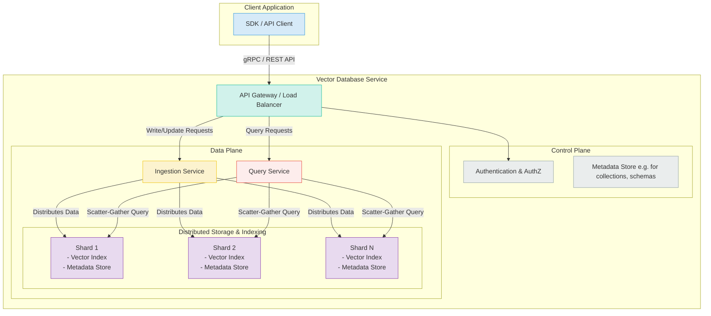
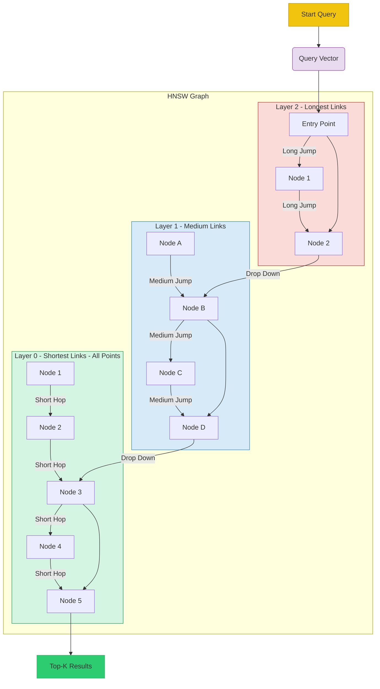
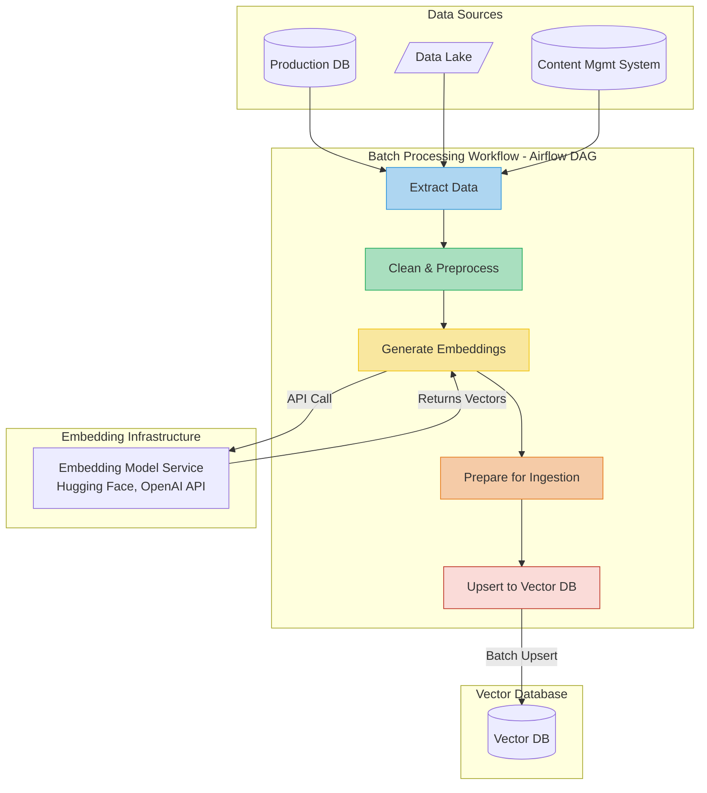
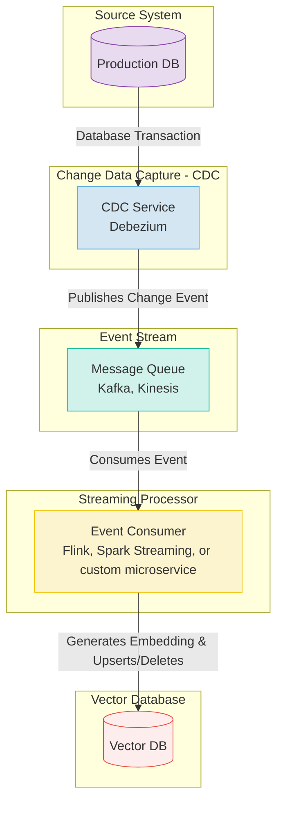

# Chapter 7: Scaling Embeddings: From Prototype to Production

## Introduction: The Leap from Laptop to Live System

In the previous chapters, we explored the power of embeddings, building functional semantic search systems and recommendation engines. These prototypes work beautifully on a laptop with a few thousand or even a hundred thousand data points. However, the journey from a Jupyter notebook to a production environment—serving millions of users and handling billions of vectors in real-time—is a significant engineering challenge. This is where the concept of "scaling" becomes paramount.

Scaling an embedding system isn't just about using a more powerful server. It involves a fundamental shift in architecture, tooling, and strategy. The brute-force similarity search that works for 10,000 vectors will be unacceptably slow and resource-intensive for 10 million. The simple data loading script will crumble under the demand for real-time updates.

**Key Challenges in Scaling Embedding Systems:**

1.  **Search Speed:** As the number of vectors grows, the time required to find the nearest neighbors increases linearly with brute-force search. A production system requires sub-second latency, which is impossible without specialized indexing.
2.  **Memory Consumption:** High-dimensional dense embeddings are memory-hungry. A 768-dimension floating-point vector (common for models like `all-MiniLM-L6-v2`) takes up 3,072 bytes. Storing one billion of these vectors would require over 3 terabytes of RAM, which is both expensive and technically complex to manage.
3.  **Data Ingestion and Freshness:** Production systems are rarely static. New data is constantly being added, and old data may need to be updated or deleted. The system must handle these changes efficiently without downtime or significant performance degradation.
4.  **Filtering and Hybrid Search:** Real-world applications often need to combine vector search with traditional metadata filters (e.g., "find products similar to this one, but only show those in stock and under $50"). This requires a system that can efficiently pre-filter candidates before performing the vector search.
5.  **Reliability and Availability:** A production system must be highly available, fault-tolerant, and resilient. This requires infrastructure that can handle hardware failures, traffic spikes, and routine maintenance without interruption.

This chapter provides a comprehensive guide to navigating these challenges. We will dive deep into the core components of a scalable embedding architecture: specialized **vector databases**, advanced **indexing algorithms**, and robust **data pipelines**. By the end, you will understand the principles and practices needed to build a production-grade embedding system that is fast, efficient, and reliable.

Let's begin by exploring the foundational technology that makes large-scale vector search possible: the vector database.

## 1. Vector Databases: The Foundation of Scalable Search

At a small scale, a simple vector index library like FAISS (Facebook AI Similarity Search) is often sufficient. You can load your vectors into an in-memory index and perform lightning-fast searches. However, as your dataset grows from thousands to millions or billions of vectors, the limitations of a standalone index become painfully clear.

A **vector database** is a specialized database system purpose-built to store, manage, and query large collections of vector embeddings. It goes far beyond what a simple index can offer by providing a complete, production-ready solution that handles the entire lifecycle of vector data.

Think of the difference between a simple file-based data store (like a CSV or JSON file) and a full-fledged relational database like PostgreSQL. While both can store data, only the latter provides the robust features needed for real applications, such as transactional integrity, advanced querying, user management, and scalability. The same analogy applies to vector indexes versus vector databases.

### From Vector Index to Vector Database: The Key Differences

A standalone vector index is a powerful component, but a vector database is a complete system. Here’s a breakdown of the critical features that vector databases provide:

| Feature | Standalone Vector Index (e.g., FAISS) | Vector Database (e.g., Pinecone, Qdrant, Weaviate) |
| :--- | :--- | :--- |
| **Data Management** | Requires manual handling. No built-in API for creating, updating, or deleting individual vectors. Re-indexing is often required. | Full CRUD (Create, Read, Update, Delete) operations on a per-vector basis, often in real-time. |
| **Metadata Storage** | Not supported. You must maintain a separate database to link vector IDs to their original content and metadata. | Natively stores metadata alongside vectors. This allows for powerful **filtered searches**. |
| **Scalability** | Limited to a single machine's memory. Scaling requires complex, custom-built sharding and replication logic. | Designed for distributed environments. Handles sharding, replication, and load balancing automatically to scale to billions of vectors. |
| **Real-time Updates** | Inefficient. Adding or changing data often requires rebuilding the entire index, leading to downtime or stale results. | Optimized for incremental, real-time updates. New data becomes searchable within seconds without performance degradation. |
| **Data Persistence** | Typically in-memory. Requires custom solutions for saving indexes to disk and loading them, which can be slow. | Manages data persistence automatically, with built-in backup and recovery mechanisms. |
| **Developer Experience** | Low-level API. Requires significant engineering effort to integrate into a larger application. | High-level, user-friendly SDKs (Python, TypeScript, etc.) and APIs that simplify development. |
| **Security** | No built-in security features. Access control must be managed externally. | Provides robust security features, including API key management, access control, and data encryption. |

### Core Architecture of a Vector Database

While specific implementations vary, most modern vector databases share a common architectural pattern designed for performance and scale. This architecture decouples different concerns, such as data ingestion, indexing, and querying, allowing each component to be optimized and scaled independently.

Here is a conceptual diagram of a typical vector database architecture:

**Key Components Explained:**

1.  **API Gateway:** The single entry point for all client requests. It handles authentication, routing, and load balancing, directing write requests to the ingestion service and read (query) requests to the query service.
2.  **Ingestion Service:** This service manages the data lifecycle. It receives new vectors and metadata, validates them, and then writes them to the appropriate shard in the distributed storage layer. It also handles updates and deletions.
3.  **Query Service:** This is the workhorse of the read path. When a query arrives, the service broadcasts it to all relevant shards (a "scatter" operation). Each shard performs the ANN search on its local data and returns its top-k results. The query service then aggregates these results (a "gather" operation), re-ranks them, and returns the final top-k results to the client.
4.  **Distributed Storage and Indexing (Shards):** The data is partitioned (sharded) across multiple nodes. Each shard contains a subset of the vectors and their associated metadata. Crucially, each shard maintains its own independent vector index (e.g., an HNSW graph). This parallelization is what allows the database to search through billions of vectors in milliseconds.
5.  **Control Plane:** This manages the overall state of the cluster, including the schema of the collections, user permissions, and the health of the different nodes.

### Popular Vector Databases: A Quick Overview

The vector database market has exploded in recent years. While they all solve the same fundamental problem, they have different strengths and architectural philosophies. Here are some of the leading players in 2024:

*   **Pinecone:** One of the first and most popular managed vector databases. Known for its ease of use, serverless architecture, and excellent performance. It abstracts away most of the complexity of managing a distributed system, making it a great choice for teams that want to move fast.
*   **Weaviate:** An open-source vector database that is highly flexible. It has a strong focus on modularity, allowing users to plug in different embedding models (from OpenAI, Cohere, Hugging Face, etc.) directly within the database. It supports GraphQL APIs and offers both self-hosting and managed cloud options.
*   **Qdrant:** An open-source vector database written in Rust, known for its performance and efficiency. It offers advanced features like filtering, sharding, and a focus on quantization for memory optimization. Qdrant is designed to be reliable and fast, making it suitable for demanding, large-scale applications.
*   **Milvus:** A highly scalable, open-source vector database that is a graduated project of the LF AI & Data Foundation. It is designed for massive-scale deployments and offers a high degree of configurability over its indexing and storage components. It is a popular choice for large enterprises that need to self-host and customize their vector search infrastructure.

Choosing the right vector database depends on your specific needs, including your desired scale, whether you prefer a managed service or self-hosting, and the specific features you require (like multimodal support or advanced filtering).

Now that we have a solid understanding of what vector databases are and why they are essential, the next section will delve into the "magic" that makes them so fast: the indexing algorithms that power Approximate Nearest Neighbor (ANN) search.

## 2. The Heart of Fast Search: Approximate Nearest Neighbor (ANN) Indexing

The reason vector databases are so powerful is their ability to sidestep the impossibly slow process of exact k-Nearest Neighbor (k-NN) search. For a dataset with N vectors, a brute-force k-NN search requires comparing a query vector to every single one of the N vectors in the database. This has a time complexity of O(N*d), where d is the vector dimension. While feasible for a few thousand vectors, it becomes computationally prohibitive for millions or billions.

This is where **Approximate Nearest Neighbor (ANN)** search comes in. ANN algorithms trade a small amount of accuracy for a massive gain in speed. Instead of guaranteeing the *exact* nearest neighbors, they aim to find *most* of the nearest neighbors, or vectors that are "close enough." In practice, the accuracy (recall) is often well above 95%, while the search speed can be orders of magnitude faster than exact k-NN.

ANN algorithms achieve this by creating sophisticated data structures—indexes—that organize the vectors in a way that allows for intelligent, guided searching, eliminating the need to check every single vector.

Over the years, several families of ANN algorithms have been developed, including tree-based methods (like Annoy), hashing-based methods (LSH), and quantization-based methods (IVF). However, the undisputed state-of-the-art for performance and accuracy today is a graph-based algorithm called **Hierarchical Navigable Small World (HNSW)**.

### HNSW: The King of ANN Algorithms

HNSW, introduced by Malkov and Yashunin, is a graph-based algorithm that has consistently demonstrated superior performance in ANN benchmarks. It builds a multi-layered, hierarchical graph structure that enables incredibly fast and accurate searches.

To understand HNSW, let's first grasp its foundational concepts:

1.  **Proximity Graph:** Imagine representing each vector as a node (or vertex) in a graph. We then draw connections (edges) between nodes that are close to each other in the vector space. To search this graph, you could start at a random entry point, check its connected neighbors, move to the neighbor closest to your query, and repeat this process greedily until you can't find a closer neighbor. This is a "Navigable Small World" (NSW) graph.

2.  **The Problem with a Single Graph:** A single-layer graph has a major drawback. It works well for short-range navigation but can easily get stuck in a local minimum, failing to find the true nearest neighbors that are far away in the graph. To find these long-range connections, you would need to increase the number of links per node, which makes the graph dense and slow to traverse.

3.  **The Hierarchical Solution:** HNSW solves this by borrowing an idea from skip lists and creating a hierarchy of graphs. It builds multiple layers of proximity graphs. The top layer is very sparse, containing only the longest-range connections. As you move down the layers, the graphs become progressively denser, with shorter and shorter connections. The bottom layer contains all the vectors and their most immediate neighbors.

#### How HNSW Search Works

The search process is a brilliant combination of zooming out and zooming in:

1.  **Enter at the Top:** The search starts at a predefined entry point in the *topmost, sparsest layer*.
2.  **Greedy Search in the Top Layer:** The algorithm traverses the graph greedily, just like in the single-graph approach, always moving to the neighbor closest to the query vector.
3.  **Drop Down a Layer:** When it finds a local minimum in the current layer (a point where no neighbor is closer), it uses that point as the entry point to the *next layer down*.
4.  **Repeat Until the Bottom:** This process is repeated—greedy search followed by dropping down a layer—until the algorithm reaches the bottom layer (Layer 0).
5.  **Final Search in the Bottom Layer:** In the dense bottom layer, it performs a final, more exhaustive greedy search to find the k-nearest neighbors.

This hierarchical approach is incredibly efficient. The top layers allow the search to quickly jump across the vector space to the general vicinity of the query, while the bottom layers enable a precise, fine-grained search in that local neighborhood.

Here is a diagram illustrating the HNSW search process:

### The Trade-off Triangle: Recall, Speed, and Cost

The performance of an HNSW index is governed by a fundamental trade-off between three factors:

1.  **Recall (Accuracy):** What percentage of the true nearest neighbors does the search return? Higher is better.
2.  **Query Speed (Latency):** How fast does the search execute? Lower is better.
3.  **Memory/Build Cost:** How much memory does the index consume, and how long does it take to build? Lower is better.

You cannot maximize all three simultaneously. Improving recall typically requires building a denser, more complex graph, which increases memory usage and slows down queries. Conversely, making queries faster might involve a sparser graph, which could lower recall.

HNSW provides several parameters to navigate this trade-off:

*   `M`: The maximum number of connections (neighbors) each node can have. A higher `M` creates a denser graph, which generally improves recall but increases index size and build time.
*   `efConstruction`: "Effective Factor for Construction." This parameter controls the quality of the graph build. A higher value means the construction process will explore more potential neighbors for each new node, leading to a higher-quality graph (and better recall) at the cost of a longer build time.
*   `efSearch`: "Effective Factor for Search." This parameter controls the breadth of the search at query time. It defines the size of the dynamic list of candidate nodes that are kept during the greedy search. A higher `efSearch` value leads to a more exhaustive search, increasing recall but also increasing query latency.

In a production environment, these parameters are tuned based on the specific application's requirements. For a use case where accuracy is paramount (like legal document search), you might choose higher values for `M` and `efSearch`. For a real-time recommendation engine where latency is critical, you might opt for lower values.

With a firm grasp of vector databases and the ANN indexing that powers them, we can now move on to the final piece of the puzzle: building the data pipelines that feed and maintain these powerful systems.

## 3. Building Production-Ready Data Pipelines

A scalable vector search system is more than just a database; it's a living system that must be fed with a constant stream of high-quality, fresh data. The data pipeline is the circulatory system of your application, responsible for sourcing, processing, embedding, and ingesting data into your vector database. A poorly designed pipeline can lead to stale results, poor search quality, and operational headaches.

A robust data pipeline for an embedding-based system typically consists of several stages:

1.  **Data Sourcing:** Identifying and accessing the raw data (e.g., user profiles from a production database, product descriptions from a CMS, articles from a web scrape).
2.  **Data Processing & Cleaning:** Transforming the raw data into a clean, consistent format suitable for embedding. This might involve removing HTML tags, correcting typos, or structuring disparate JSON blobs.
3.  **Embedding Generation:** Passing the cleaned data through an embedding model to generate vector representations.
4.  **Data Ingestion:** Loading the vectors and their associated metadata into the vector database.

There are two primary models for how these pipelines operate: **batch processing** and **real-time (or streaming) processing**.

### Batch Ingestion: The Foundational Load

Batch ingestion is the process of loading a large volume of data into the vector database at once. This is typically the first step when setting up a new system or when performing periodic, large-scale updates.

**Common Scenarios for Batch Processing:**

*   **Initial System Bootstrap:** Loading your entire existing dataset into the vector database for the first time.
*   **Model Upgrades:** When you switch to a new, improved embedding model, you must re-embed and re-index your entire corpus of data.
*   **Periodic Refreshes:** For data sources that don't require up-to-the-second freshness, you might run a daily or weekly batch job to update the index.

**Architecture of a Batch Pipeline:**

Batch pipelines are often orchestrated using workflow management tools like **Apache Airflow**, or implemented as scripts running on a schedule (e.g., a cron job). They are designed for throughput and efficiency, processing large amounts of data in parallel.

### Real-Time Ingestion: Keeping Data Fresh

For many applications, search results must reflect the state of the world *right now*. A newly listed product should be immediately searchable. A deleted user comment should instantly disappear from results. This requires a real-time, or streaming, ingestion pipeline.

Real-time pipelines are event-driven. They listen for changes in a source system and propagate those changes to the vector database within seconds.

**Architecture of a Real-Time Pipeline:**

These pipelines are commonly built using message queues or event streams like **Apache Kafka** or **AWS Kinesis**. A change in a source database (an `INSERT`, `UPDATE`, or `DELETE`) publishes an event to a topic. A downstream consumer service then processes this event and updates the vector database accordingly.

**Handling Updates and Deletes:**

This is a critical and often overlooked aspect of pipeline design. Vector databases provide APIs to `update` or `delete` vectors by their ID. Your pipeline must be able to correctly map a change in the source system to the corresponding vector ID.

*   **Updates:** When a source record is updated (e.g., a product description changes), the pipeline should trigger a re-embedding of the new content and then use the `update` or `upsert` (update if exists, otherwise insert) operation in the vector database with the record's unique ID.
*   **Deletes:** When a record is deleted, the pipeline must capture this event and issue a `delete` command to the vector database using the record's ID to ensure it is removed from the index.

### Data Quality and Monitoring

A production pipeline is not "set it and forget it." Continuous monitoring is essential to ensure data quality and system health.

**Key Areas to Monitor:**

*   **Pipeline Lag:** How long does it take for a change in the source system to be reflected in the search results? High lag can defeat the purpose of a real-time system.
*   **Error Rates:** Are there failures in the embedding generation step (e.g., API errors from the model provider)? Are there errors during ingestion into the vector database?
*   **Data Drift:** Has the statistical distribution of your source data changed over time? This could impact the performance of your embedding model and may signal that it's time to retrain or fine-tune it.
*   **Vector Quality:** Monitor the distribution of vector norms and the distances between them. Anomalies could indicate problems with the embedding model or the input data.

## Conclusion: From Prototype to Production-Grade

Scaling an embedding system from a prototype to a production service is a multi-faceted engineering challenge. It requires moving beyond simple in-memory indexes to robust, specialized **vector databases** that provide the necessary features for data management, scalability, and reliability.

At the heart of these databases are sophisticated **ANN indexing algorithms**, with **HNSW** leading the pack in performance. Understanding how to tune these indexes is key to achieving the right balance between search accuracy, speed, and cost for your specific application.

Finally, none of this is possible without well-architected **data pipelines**. Whether batch, real-time, or a hybrid of the two, these pipelines are essential for feeding the system with fresh, high-quality data and handling the full lifecycle of updates and deletes.

By combining these three pillars—a powerful vector database, a well-tuned ANN index, and a robust data pipeline—you can build scalable, real-time, and intelligent search and recommendation systems that unlock the true potential of your data.

In the next chapter, we will explore advanced topics, including multimodal embeddings, fine-tuning models for specific domains, and strategies for building more complex, multi-stage retrieval systems.
