# Chapter 7: Scaling Embeddings: From Prototype to Production

## Introduction: The Leap from Laptop to Live System

In the previous chapters, we explored the power of embeddings, building functional semantic search systems and recommendation engines. These prototypes work beautifully on a laptop with a few thousand or even a hundred thousand data points. However, the journey from a Jupyter notebook to a production environment—serving millions of users and handling billions of vectors in real-time—is a significant engineering challenge. This is where the concept of "scaling" becomes paramount.

Scaling an embedding system isn't just about using a more powerful server. It involves a fundamental shift in architecture, tooling, and strategy. The brute-force similarity search that works for 10,000 vectors will be unacceptably slow and resource-intensive for 10 million. The simple data loading script will crumble under the demand for real-time updates.

**Key Challenges in Scaling Embedding Systems:**

1. **Search Speed:** As the number of vectors grows, the time required to find the nearest neighbors increases linearly with brute-force search. A production system requires sub-second latency, which is impossible without specialized indexing.
2. **Memory Consumption:** High-dimensional dense embeddings are memory-hungry. A 768-dimension floating-point vector (common for models like `all-MiniLM-L6-v2`) takes up 3,072 bytes. Storing one billion of these vectors would require over 3 terabytes of RAM, which is both expensive and technically complex to manage.
3. **Data Ingestion and Freshness:** Production systems are rarely static. New data is constantly being added, and old data may need to be updated or deleted. The system must handle these changes efficiently without downtime or significant performance degradation.
4. **Filtering and Hybrid Search:** Real-world applications often need to combine vector search with traditional metadata filters (e.g., "find products similar to this one, but only show those in stock and under $50"). This requires a system that can efficiently pre-filter candidates before performing the vector search.
5. **Reliability and Availability:** A production system must be highly available, fault-tolerant, and resilient. This requires infrastructure that can handle hardware failures, traffic spikes, and routine maintenance without interruption.

This chapter provides a comprehensive guide to navigating these challenges. We will dive deep into the core components of a scalable embedding architecture: specialized **vector databases**, advanced **indexing algorithms**, and robust **data pipelines**. By the end, you will understand the principles and practices needed to build a production-grade embedding system that is fast, efficient, and reliable.

Let's begin by exploring the foundational technology that makes large-scale vector search possible: the vector database.

## 1. Vector Databases: The Foundation of Scalable Search

At a small scale, a simple vector index library like FAISS (Facebook AI Similarity Search) is often sufficient. You can load your vectors into an in-memory index and perform lightning-fast searches. However, as your dataset grows from thousands to millions or billions of vectors, the limitations of a standalone index become painfully clear.

A **vector database** is a specialized database system purpose-built to store, manage, and query large collections of vector embeddings. It goes far beyond what a simple index can offer by providing a complete, production-ready solution that handles the entire lifecycle of vector data.

Think of the difference between a simple file-based data store (like a CSV or JSON file) and a full-fledged relational database like PostgreSQL. While both can store data, only the latter provides the robust features needed for real applications, such as transactional integrity, advanced querying, user management, and scalability. The same analogy applies to vector indexes versus vector databases.

### From Vector Index to Vector Database: The Key Differences

A standalone vector index is a powerful component, but a vector database is a complete system. Here's a breakdown of the critical features that vector databases provide:

| Feature | Standalone Vector Index (e.g., FAISS) | Vector Database (e.g., Pinecone, Qdrant, Weaviate) |
| :--- | :--- | :--- |
| **Data Management** | Requires manual handling. No built-in API for creating, updating, or deleting individual vectors. Re-indexing is often required. | Full CRUD (Create, Read, Update, Delete) operations on a per-vector basis, often in real-time. |
| **Metadata Storage** | Not supported. You must maintain a separate database to link vector IDs to their original content and metadata. | Natively stores metadata alongside vectors. This allows for powerful **filtered searches**. |
| **Scalability** | Limited to a single machine's memory. Scaling requires complex, custom-built sharding and replication logic. | Designed for distributed environments. Handles sharding, replication, and load balancing automatically to scale to billions of vectors. |
| **Real-time Updates** | Inefficient. Adding or changing data often requires rebuilding the entire index, leading to downtime or stale results. | Optimized for incremental, real-time updates. New data becomes searchable within seconds without performance degradation. |
| **Data Persistence** | Typically in-memory. Requires custom solutions for saving indexes to disk and loading them, which can be slow. | Manages data persistence automatically, with built-in backup and recovery mechanisms. |
| **Developer Experience** | Low-level API. Requires significant engineering effort to integrate into a larger application. | High-level, user-friendly SDKs (Python, TypeScript, etc.) and APIs that simplify development. |
| **Security** | No built-in security features. Access control must be managed externally. | Provides robust security features, including API key management, access control, and data encryption. |

### Core Architecture of a Vector Database

While specific implementations vary, most modern vector databases share a common architectural pattern designed for performance and scale. This architecture decouples different concerns, such as data ingestion, indexing, and querying, allowing each component to be optimized and scaled independently.

Here is a conceptual diagram of a typical vector database architecture:

```mermaid
flowchart TD
    subgraph ClientLayer ["Client Layer"]
        Client[🌐 API Client]
    end
    subgraph ControlPlane ["Control Plane"]
        Gateway[🔀 API Gateway / Load Balancer]
        Auth[🔐 Authentication & AuthZ]
        Meta[📚 Metadata Store]
        Gateway --> Auth
        Gateway --> Meta
    end
    subgraph DataPlane ["Data Plane"]
        subgraph ProcessingServices ["Processing Services"]
            Ingest[🚚 Ingestion Service]
            QuerySvc[🔍 Query Service]
        end
        
        subgraph DistributedStorage ["Distributed Storage Layer"]
            Shard1[🗄️ Shard 1<br/>Vector + Metadata<br/>+ HNSW Index]
            Shard2[🗄️ Shard 2<br/>Vector + Metadata<br/>+ HNSW Index]
            ShardN[🗄️ Shard N<br/>Vector + Metadata<br/>+ HNSW Index]
        end
        
        %% Simplified connections within Data Plane
        Ingest --> DistributedStorage
        QuerySvc --> DistributedStorage
    end

    %% Main client flow connections
    Client --> Gateway
    Gateway --> ProcessingServices

    %% Styles (see copilot-instructions.md)
    style Client fill:#E8F4FD,stroke:#2C5AA0
    style Gateway fill:#E8F6F3,stroke:#1B5E4F
    style Auth fill:#EAEDED,stroke:#95A5A6
    style Meta fill:#EAEDED,stroke:#95A5A6
    style Ingest fill:#FCF3CF,stroke:#F1C40F
    style QuerySvc fill:#FDEDEC,stroke:#E74C3C
    style Shard1 fill:#E8DAEF,stroke:#8E44AD
    style Shard2 fill:#E8DAEF,stroke:#8E44AD
    style ShardN fill:#E8DAEF,stroke:#8E44AD
    style ProcessingServices fill:#F0F8FF,stroke:#4682B4,stroke-width:2px
    style DistributedStorage fill:#F5F5F5,stroke:#696969,stroke-width:2px
```



**Key Components Explained:**

1.  **API Gateway:** The single entry point for all client requests. It handles authentication, routing, and load balancing, directing write requests to the ingestion service and read (query) requests to the query service.
2.  **Ingestion Service:** This service manages the data lifecycle. It receives new vectors and metadata, validates them, and then writes them to the appropriate shard in the distributed storage layer. It also handles updates and deletions.
3.  **Query Service:** This is the workhorse of the read path. When a query arrives, the service broadcasts it to all relevant shards (a "scatter" operation). Each shard performs the ANN search on its local data and returns its top-k results. The query service then aggregates these results (a "gather" operation), re-ranks them, and returns the final top-k results to the client.
4.  **Distributed Storage and Indexing (Shards):** The data is partitioned (sharded) across multiple nodes. Each shard contains a subset of the vectors and their associated metadata. Crucially, each shard maintains its own independent vector index (e.g., an HNSW graph). This parallelization is what allows the database to search through billions of vectors in milliseconds.
5.  **Control Plane:** This manages the overall state of the cluster, including the schema of the collections, user permissions, and the health of the different nodes.

### Popular Vector Databases: A Quick Overview

The vector database market has exploded in recent years. While they all solve the same fundamental problem, they have different strengths and architectural philosophies. Here are some of the leading players in 2024:

* **Pinecone:** One of the first and most popular managed vector databases. Known for its ease of use, serverless architecture, and excellent performance. It abstracts away most of the complexity of managing a distributed system, making it a great choice for teams that want to move fast.
* **Weaviate:** An open-source vector database that is highly flexible. It has a strong focus on modularity, allowing users to plug in different embedding models (from OpenAI, Cohere, Hugging Face, etc.) directly within the database. It supports GraphQL APIs and offers both self-hosting and managed cloud options.
* **Qdrant:** An open-source vector database written in Rust, known for its performance and efficiency. It offers advanced features like filtering, sharding, and a focus on quantization for memory optimization. Qdrant is designed to be reliable and fast, making it suitable for demanding, large-scale applications.
* **Milvus:** A highly scalable, open-source vector database that is a graduated project of the LF AI & Data Foundation. It is designed for massive-scale deployments and offers a high degree of configurability over its indexing and storage components. It is a popular choice for large enterprises that need to self-host and customize their vector search infrastructure.

Choosing the right vector database depends on your specific needs, including your desired scale, whether you prefer a managed service or self-hosting, and the specific features you require (like multimodal support or advanced filtering).

Now that we have a solid understanding of what vector databases are and why they are essential, the next section will delve into the "magic" that makes them so fast: the indexing algorithms that power Approximate Nearest Neighbor (ANN) search.

## 1.1. The Hybrid Approach: Leveraging Traditional Databases

While specialized vector databases offer powerful capabilities, there's an alternative approach that has gained significant traction: **hybrid databases**. Rather than replacing your existing database infrastructure entirely, hybrid databases extend traditional relational databases with vector search capabilities, creating a unified system that supports both structured data queries and semantic search.

The most prominent example of this approach is **PostgreSQL with the pgvector extension**, which has become a popular choice for organizations that want to add vector search capabilities to their existing data stack without the complexity of managing separate systems.

### Why Consider Hybrid Databases?

Hybrid databases offer several compelling advantages, particularly for organizations already invested in traditional database infrastructure:

**1. Infrastructure Consolidation:** Instead of managing separate systems for structured data (PostgreSQL, MySQL) and vector search (Pinecone, Weaviate), you can handle both in a single database instance.

**2. ACID Compliance:** Your vector data benefits from the same transactional guarantees as your structured data, ensuring consistency and reliability.

**3. Mature Ecosystem:** You can leverage decades of database tooling, monitoring, backup solutions, and operational expertise.

**4. Cost Efficiency:** Reduce the operational overhead and licensing costs associated with multiple specialized systems.

**5. Simplified Architecture:** Fewer moving parts mean less complexity in your application architecture and data pipelines.

### PostgreSQL + pgvector: A Practical Implementation

PostgreSQL with the pgvector extension represents the gold standard for hybrid database implementations. pgvector adds native vector data types and similarity search functions to PostgreSQL, enabling efficient storage and querying of high-dimensional vectors alongside traditional relational data.

Here's a simple example of setting up a hybrid system:

```sql
-- Enable the pgvector extension
CREATE EXTENSION vector;

-- Create a table that combines traditional data with vectors
CREATE TABLE products (
    id SERIAL PRIMARY KEY,
    name TEXT NOT NULL,
    description TEXT,
    price DECIMAL(10,2),
    category_id INTEGER,
    created_at TIMESTAMP DEFAULT NOW(),
    -- Traditional full-text search column
    search_vector tsvector,
    -- Dense semantic embedding
    embedding vector(384)
);

-- Create indexes for both traditional and vector search
CREATE INDEX ON products USING GIN(search_vector);
CREATE INDEX ON products USING hnsw (embedding vector_cosine_ops);

-- Trigger to automatically update full-text search vectors
CREATE TRIGGER tsvectorupdate BEFORE INSERT OR UPDATE
ON products FOR EACH ROW EXECUTE FUNCTION
tsvector_update_trigger(search_vector, 'pg_catalog.english', name, description);
```

### Hybrid Search: Best of Both Worlds

The real power of hybrid databases emerges when you combine vector similarity search with traditional full-text search techniques. This approach, called **hybrid search**, leverages the strengths of both methods:

* **Vector Search:** Captures semantic meaning and handles synonyms, paraphrasing, and conceptual similarity
* **Full-Text Search:** Excels at exact keyword matching, proper nouns, and domain-specific terminology

PostgreSQL provides sophisticated full-text search capabilities with BM25-style ranking through functions like `ts_rank` and `ts_rank_cd`. When combined with vector similarity, you can create search systems that are both semantically aware and precision-focused.

### Reciprocal Rank Fusion (RRF): Combining Search Results

The challenge in hybrid search is meaningfully combining results from two different ranking systems. **Reciprocal Rank Fusion (RRF)** is a proven technique that merges ranked lists by considering the reciprocal of each item's rank position.

Here's a practical implementation using PostgreSQL:

```sql
WITH semantic_search AS (
    SELECT id, RANK() OVER (ORDER BY embedding <=> %(query_embedding)s) AS rank
    FROM products
    ORDER BY embedding <=> %(query_embedding)s
    LIMIT 20
),
keyword_search AS (
    SELECT id, RANK() OVER (ORDER BY ts_rank_cd(search_vector, query) DESC) AS rank
    FROM products, plainto_tsquery('english', %(query_text)s) query
    WHERE search_vector @@ query
    ORDER BY ts_rank_cd(search_vector, query) DESC
    LIMIT 20
)
SELECT 
    COALESCE(semantic_search.id, keyword_search.id) AS id,
    COALESCE(1.0 / (%(k)s + semantic_search.rank), 0.0) +
    COALESCE(1.0 / (%(k)s + keyword_search.rank), 0.0) AS rrf_score
FROM semantic_search
FULL OUTER JOIN keyword_search ON semantic_search.id = keyword_search.id
ORDER BY rrf_score DESC
LIMIT 10;
```

In this query:

* Each search method returns its top 20 results with rankings
* RRF combines the rankings using the formula: `1 / (k + rank)` where `k` is typically 60
* Higher RRF scores indicate better overall relevance

### Advanced Filtering and Metadata Search

One of the strongest advantages of hybrid databases is their ability to efficiently combine vector search with complex metadata filtering. Unlike some specialized vector databases where filtering happens after vector search, PostgreSQL can leverage its query planner to optimize these operations:

```sql
-- Complex hybrid query with metadata filtering
SELECT p.*, 
       p.embedding <=> %(query_embedding)s AS similarity_score,
       ts_rank_cd(p.search_vector, query) AS text_score
FROM products p, plainto_tsquery('english', %(query_text)s) query
WHERE p.price BETWEEN %(min_price)s AND %(max_price)s
  AND p.category_id = ANY(%(category_ids)s)
  AND p.created_at >= %(date_threshold)s
  AND (
      p.search_vector @@ query OR
      p.embedding <=> %(query_embedding)s < 0.5
  )
ORDER BY 
    (p.embedding <=> %(query_embedding)s) * 0.6 + 
    (1 - ts_rank_cd(p.search_vector, query)) * 0.4
LIMIT 20;
```

### When to Choose Hybrid vs. Specialized Vector Databases

The choice between hybrid databases and specialized vector databases depends on your specific requirements:

**Choose Hybrid Databases When:**

* You have existing PostgreSQL infrastructure and expertise
* You need strong ACID guarantees for your vector data
* Your vector dataset is moderate in size (millions to low hundreds of millions)
* You require complex relational queries alongside vector search
* You want to minimize operational complexity
* Budget constraints favor consolidation

**Choose Specialized Vector Databases When:**

* You're dealing with billions of vectors requiring extreme scale
* You need cutting-edge vector search performance optimizations
* Your use case is purely vector search without complex relational requirements
* You have dedicated teams for managing specialized infrastructure
* You need features like dynamic indexing, advanced quantization, or multi-vector search

### Performance Considerations

While hybrid databases offer convenience and consolidation benefits, they do come with performance trade-offs:

**Advantages:**

* Excellent performance for moderate-scale vector datasets
* Superior performance for filtered queries combining metadata and vector search
* Mature query optimization for complex hybrid queries

**Limitations:**

* May not match specialized vector databases at extreme scale (billions of vectors)
* Memory management between relational and vector operations requires tuning
* HNSW index performance may lag behind highly optimized vector database implementations

In practice, hybrid databases like PostgreSQL with pgvector can efficiently handle most real-world vector search applications while providing the operational benefits of a unified data platform.

## 2. The Heart of Fast Search: Approximate Nearest Neighbor (ANN) Indexing

The reason vector databases are so powerful is their ability to sidestep the impossibly slow process of exact k-Nearest Neighbor (k-NN) search. For a dataset with N vectors, a brute-force k-NN search requires comparing a query vector to every single one of the N vectors in the database. This has a time complexity of O(N*d), where d is the vector dimension. While feasible for a few thousand vectors, it becomes computationally prohibitive for millions or billions.

This is where **Approximate Nearest Neighbor (ANN)** search comes in. ANN algorithms trade a small amount of accuracy for a massive gain in speed. Instead of guaranteeing the *exact* nearest neighbors, they aim to find *most* of the nearest neighbors, or vectors that are "close enough." In practice, the accuracy (recall) is often well above 95%, while the search speed can be orders of magnitude faster than exact k-NN.

ANN algorithms achieve this by creating sophisticated data structures—indexes—that organize the vectors in a way that allows for intelligent, guided searching, eliminating the need to check every single vector.

Over the years, several families of ANN algorithms have been developed, including tree-based methods (like Annoy), hashing-based methods (LSH), and quantization-based methods (IVF). However, the undisputed state-of-the-art for performance and accuracy today is a graph-based algorithm called **Hierarchical Navigable Small World (HNSW)**.

### HNSW: The King of ANN Algorithms

HNSW, introduced by Malkov and Yashunin, is a graph-based algorithm that has consistently demonstrated superior performance in ANN benchmarks. It builds a multi-layered, hierarchical graph structure that enables incredibly fast and accurate searches.

To understand HNSW, let's first grasp its foundational concepts:

1.  **Proximity Graph:** Imagine representing each vector as a node (or vertex) in a graph. We then draw connections (edges) between nodes that are close to each other in the vector space. To search this graph, you could start at a random entry point, check its connected neighbors, move to the neighbor closest to your query, and repeat this process greedily until you can't find a closer neighbor. This is a "Navigable Small World" (NSW) graph.

2.  **The Problem with a Single Graph:** A single-layer graph has a major drawback. It works well for short-range navigation but can easily get stuck in a local minimum, failing to find the true nearest neighbors that are far away in the graph. To find these long-range connections, you would need to increase the number of links per node, which makes the graph dense and slow to traverse.

3.  **The Hierarchical Solution:** HNSW solves this by borrowing an idea from skip lists and creating a hierarchy of graphs. It builds multiple layers of proximity graphs. The top layer is very sparse, containing only the longest-range connections. As you move down the layers, the graphs become progressively denser, with shorter and shorter connections. The bottom layer contains all the vectors and their most immediate neighbors.

#### How HNSW Search Works

The search process is a brilliant combination of zooming out and zooming in:

1.  **Enter at the Top:** The search starts at a predefined entry point in the *topmost, sparsest layer*.
2.  **Greedy Search in the Top Layer:** The algorithm traverses the graph greedily, just like in the single-graph approach, always moving to the neighbor closest to the query vector.
3.  **Drop Down a Layer:** When it finds a local minimum in the current layer (a point where no neighbor is closer), it uses that point as the entry point to the *next layer down*.
4.  **Repeat Until the Bottom:** This process is repeated—greedy search followed by dropping down a layer—until the algorithm reaches the bottom layer (Layer 0).
5.  **Final Search in the Bottom Layer:** In the dense bottom layer, it performs a final, more exhaustive greedy search to find the k-nearest neighbors.

This hierarchical approach is incredibly efficient. The top layers allow the search to quickly jump across the vector space to the general vicinity of the query, while the bottom layers enable a precise, fine-grained search in that local neighborhood.

Here is a diagram illustrating the HNSW search process:


### The Trade-off Triangle: Recall, Speed, and Cost

The performance of an HNSW index is governed by a fundamental trade-off between three factors:

1.  **Recall (Accuracy):** What percentage of the true nearest neighbors does the search return? Higher is better.
2.  **Query Speed (Latency):** How fast does the search execute? Lower is better.
3.  **Memory/Build Cost:** How much memory does the index consume, and how long does it take to build? Lower is better.

You cannot maximize all three simultaneously. Improving recall typically requires building a denser, more complex graph, which increases memory usage and slows down queries. Conversely, making queries faster might involve a sparser graph, which could lower recall.

HNSW provides several parameters to navigate this trade-off:

*   `M`: The maximum number of connections (neighbors) each node can have. A higher `M` creates a denser graph, which generally improves recall but increases index size and build time.
*   `efConstruction`: "Effective Factor for Construction." This parameter controls the quality of the graph build. A higher value means the construction process will explore more potential neighbors for each new node, leading to a higher-quality graph (and better recall) at the cost of a longer build time.
*   `efSearch`: "Effective Factor for Search." This parameter controls the breadth of the search at query time. It defines the size of the dynamic list of candidate nodes that are kept during the greedy search. A higher `efSearch` value leads to a more exhaustive search, increasing recall but also increasing query latency.

In a production environment, these parameters are tuned based on the specific application's requirements. For a use case where accuracy is paramount (like legal document search), you might choose higher values for `M` and `efSearch`. For a real-time recommendation engine where latency is critical, you might opt for lower values.

## 2.1. Performance Expectations and Benchmarking

Understanding the performance characteristics of vector search systems is crucial for capacity planning and setting realistic expectations. This section provides concrete benchmarks and guidelines for different scales and configurations.

### Latency Expectations by Scale

| Dataset Size | Index Type | p50 Latency | p95 Latency | p99 Latency | Hardware Profile |
|-------------|------------|-------------|-------------|-------------|-----------------|
| **1M vectors** | HNSW (M=16, ef=100) | 2-5ms | 8-15ms | 15-30ms | 8 vCPU, 32GB RAM |
| **10M vectors** | HNSW (M=16, ef=100) | 5-10ms | 15-25ms | 30-50ms | 16 vCPU, 64GB RAM |
| **100M vectors** | HNSW (M=16, ef=100) | 10-20ms | 25-40ms | 50-80ms | 32 vCPU, 128GB RAM |
| **1B vectors** | HNSW (M=16, ef=100) | 20-40ms | 40-70ms | 80-150ms | Distributed cluster |

**Key Insights:**
- Latency scales roughly logarithmically with dataset size due to HNSW's hierarchical structure
- p99 latencies are typically 3-5x higher than p50, requiring careful tail latency optimization
- Memory-bound workloads benefit significantly from faster storage (NVMe SSD)

### Throughput Benchmarks

| Configuration | QPS (Queries/Second) | Concurrent Users | Resource Utilization |
|--------------|---------------------|------------------|---------------------|
| **Single Node** (32 vCPU) | 1,000-2,000 | 50-100 | CPU: 70%, Memory: 80% |
| **3-Node Cluster** | 3,000-5,000 | 150-250 | CPU: 60%, Memory: 75% |
| **10-Node Cluster** | 8,000-15,000 | 400-750 | CPU: 55%, Memory: 70% |

### Memory Consumption Calculator

Understanding memory requirements is critical for infrastructure planning:

```python
def calculate_memory_requirements(
    num_vectors: int,
    vector_dimension: int,
    metadata_size_bytes: int = 512,
    hnsw_m: int = 16,
    overhead_factor: float = 1.3
) -> dict:
    """Calculate memory requirements for vector storage and HNSW index."""
    
    # Base vector storage (float32)
    vector_storage_gb = (num_vectors * vector_dimension * 4) / (1024**3)
    
    # Metadata storage
    metadata_storage_gb = (num_vectors * metadata_size_bytes) / (1024**3)
    
    # HNSW graph overhead (connections + layer info)
    avg_connections_per_node = hnsw_m * 1.5  # Account for layer distribution
    graph_overhead_gb = (num_vectors * avg_connections_per_node * 8) / (1024**3)
    
    # Total with system overhead
    total_gb = (vector_storage_gb + metadata_storage_gb + graph_overhead_gb) * overhead_factor
    
    return {
        "vector_storage_gb": round(vector_storage_gb, 2),
        "metadata_storage_gb": round(metadata_storage_gb, 2),
        "graph_overhead_gb": round(graph_overhead_gb, 2),
        "total_memory_gb": round(total_gb, 2),
        "recommended_instance_memory_gb": round(total_gb * 1.5, 2)  # Leave headroom
    }

# Example calculations
print("1M vectors (768-dim):", calculate_memory_requirements(1_000_000, 768))
print("10M vectors (384-dim):", calculate_memory_requirements(10_000_000, 384))
print("100M vectors (1536-dim):", calculate_memory_requirements(100_000_000, 1536))
```

**Example Output:**
```
1M vectors (768-dim): {
    'vector_storage_gb': 2.86,
    'metadata_storage_gb': 0.48,
    'graph_overhead_gb': 0.18,
    'total_memory_gb': 4.61,
    'recommended_instance_memory_gb': 6.91
}
```

### Cost Analysis Framework

| Cloud Provider | Instance Type | Memory (GB) | Cost/Hour | Cost/1M Vectors/Month |
|----------------|---------------|-------------|-----------|----------------------|
| **AWS** | r6i.2xlarge | 64 | $0.504 | $121 |
| **AWS** | r6i.4xlarge | 128 | $1.008 | $242 |
| **GCP** | n2-highmem-8 | 64 | $0.476 | $114 |
| **Azure** | E8s v5 | 64 | $0.504 | $121 |

**Managed Vector DB Costs (Approximate):**
- **Pinecone**: $0.096/1M vectors/month + query costs
- **Weaviate Cloud**: $0.12/1M vectors/month + compute
- **Qdrant Cloud**: $0.08/1M vectors/month + infrastructure

### Performance Tuning Guidelines

**For Latency-Critical Applications:**
```python
# Recommended HNSW parameters for <10ms p95 latency
hnsw_config = {
    "M": 12,                    # Lower connections for faster traversal
    "efConstruction": 100,      # Moderate build quality
    "efSearch": 64,            # Faster search, slight recall trade-off
    "max_connections": 24       # Limit graph density
}
```

**For High-Recall Applications:**
```python
# Recommended HNSW parameters for >98% recall
hnsw_config = {
    "M": 24,                    # More connections for better paths
    "efConstruction": 200,      # Higher build quality
    "efSearch": 200,           # Exhaustive search
    "max_connections": 48       # Denser graph structure
}
```

**For Balanced Production Workloads:**
```python
# Recommended HNSW parameters for production balance
hnsw_config = {
    "M": 16,                    # Standard connectivity
    "efConstruction": 128,      # Good build quality
    "efSearch": 100,           # Balanced search breadth
    "max_connections": 32       # Moderate graph density
}
```

## 2.2. Advanced Vector Optimization Techniques

As vector databases mature and datasets grow larger, several advanced optimization techniques have emerged to improve performance, reduce memory consumption, and handle specialized use cases. This section covers the cutting-edge methods that are reshaping how we build and deploy vector systems at scale.

### Vector Compression: Doing More with Less Memory

One of the biggest challenges in scaling vector systems is memory consumption. Advanced compression techniques can reduce memory usage by 4-32x while maintaining acceptable search quality.

#### Product Quantization (PQ)

Product Quantization divides high-dimensional vectors into smaller subvectors and quantizes each subvector independently using learned codebooks.

```python
# Example: Setting up Product Quantization with FAISS
import faiss
import numpy as np

# Configuration for PQ compression
dimension = 768  # Original vector dimension
m = 32          # Number of subquantizers (dimension must be divisible by m)
nbits = 8       # Bits per subquantizer (256 centroids per subquantizer)

# Create PQ index
pq_index = faiss.IndexPQ(dimension, m, nbits)

# Train the quantizer (requires training data)
training_vectors = np.random.random((100000, dimension)).astype('float32')
pq_index.train(training_vectors)

# Add vectors (they will be compressed automatically)
vectors = np.random.random((1000000, dimension)).astype('float32')
pq_index.add(vectors)

print(f"Memory reduction: {32 / (m * nbits / 8):.1f}x")  # ~32x compression
print(f"Expected recall: ~85-95% depending on data distribution")
```

#### Scalar Quantization (SQ)

Scalar Quantization reduces precision by mapping float32 values to 8-bit or 4-bit integers.

```python
# Example: 8-bit scalar quantization
sq_index = faiss.IndexScalarQuantizer(dimension, faiss.ScalarQuantizer.QT_8bit)
sq_index.train(training_vectors)
sq_index.add(vectors)

print(f"Memory reduction: 4x (float32 → uint8)")
print(f"Expected recall: ~95-98%")
```

### GPU Acceleration: Unleashing Parallel Computing Power

Modern GPUs can dramatically accelerate both index construction and query processing through massive parallelization.

#### GPU-Optimized Vector Databases

```python
# Example: Using GPU-accelerated FAISS
# Requires FAISS compiled with GPU support

# Create GPU resources
gpu_resources = []
for i in range(faiss.get_num_gpus()):
    res = faiss.StandardGpuResources()
    gpu_resources.append(res)

# Create GPU index
cpu_index = faiss.IndexIVFFlat(
    faiss.IndexFlatL2(dimension), 
    dimension, 
    nlist=1024
)

# Move to GPU
gpu_index = faiss.index_cpu_to_gpu(gpu_resources[0], 0, cpu_index)

# GPU training and search is now 10-100x faster
gpu_index.train(training_vectors)
gpu_index.add(vectors)

# Batch queries for maximum GPU utilization
query_batch = np.random.random((1000, dimension)).astype('float32')
distances, indices = gpu_index.search(query_batch, k=10)
```

#### Performance Comparison: CPU vs GPU

| Operation | CPU (32 cores) | GPU (V100) | Speedup |
|-----------|----------------|------------|---------|
| **Index Building** | 45 minutes | 3 minutes | 15x |
| **Query Processing** | 1,000 QPS | 15,000 QPS | 15x |
| **Batch Search** | 10ms/1000 queries | 0.5ms/1000 queries | 20x |

### Modern Embedding Architectures

Recent advances in embedding models have introduced new architectures that change how we approach vector search.

#### ColBERT: Late Interaction for Fine-Grained Relevance

ColBERT represents documents as collections of contextualized embeddings, enabling more nuanced similarity calculation.

```python
# Conceptual example of ColBERT-style search
class ColBERTIndex:
    def __init__(self, model_name="colbert-ir/colbertv2.0"):
        from colbert import Indexer, Searcher
        self.indexer = Indexer(checkpoint=model_name)
        self.searcher = None
    
    def build_index(self, documents, index_name):
        """Build ColBERT index from documents."""
        self.indexer.index(
            name=index_name,
            collection=documents,
            overwrite=True
        )
        self.searcher = Searcher(index=index_name)
    
    def search(self, query, k=10):
        """Search using late interaction."""
        if not self.searcher:
            raise ValueError("Index not built")
        
        # Returns more nuanced relevance scores
        return self.searcher.search(query, k=k)

# Usage
colbert_index = ColBERTIndex()
documents = ["Document 1 text...", "Document 2 text..."]
colbert_index.build_index(documents, "my_collection")

results = colbert_index.search("What is machine learning?", k=5)
```

#### Multi-Vector Search Patterns

Some applications benefit from multiple embeddings per document to capture different aspects of content.

```python
# Example: Multi-aspect document embedding
class MultiVectorDocument:
    def __init__(self, doc_id, content):
        self.doc_id = doc_id
        self.content = content
        
        # Generate multiple embeddings for different aspects
        self.title_embedding = self.embed_text(content['title'])
        self.summary_embedding = self.embed_text(content['summary'])
        self.full_text_embedding = self.embed_text(content['full_text'])
        
    def compute_relevance(self, query_embedding, weights=None):
        """Compute weighted relevance across multiple embeddings."""
        if weights is None:
            weights = {'title': 0.4, 'summary': 0.3, 'full_text': 0.3}
        
        similarities = {
            'title': cosine_similarity(query_embedding, self.title_embedding),
            'summary': cosine_similarity(query_embedding, self.summary_embedding),
            'full_text': cosine_similarity(query_embedding, self.full_text_embedding)
        }
        
        return sum(similarities[aspect] * weight 
                  for aspect, weight in weights.items())
```

### Latest Embedding Models (2024-2025)

The embedding model landscape continues to evolve rapidly. Here are the current state-of-the-art models:

#### Performance Comparison Table

| Model | Dimensions | MTEB Score | Best Use Case | Provider |
|-------|------------|------------|---------------|-----------|
| **text-embedding-3-large** | 3072 | 64.6 | General purpose, high quality | OpenAI |
| **e5-large-v2** | 1024 | 62.8 | Open-source, balanced performance | Microsoft |
| **bge-large-en-v1.5** | 1024 | 63.2 | English text, research | BAAI |
| **gte-large** | 1024 | 62.4 | Multilingual, efficient | Alibaba |
| **instructor-xl** | 768 | 61.9 | Task-specific instructions | HKUNLP |

#### Model Selection Guidelines

```python
# Production model selection framework
def select_embedding_model(requirements):
    """Select optimal embedding model based on requirements."""
    
    if requirements.get('budget') == 'low' and requirements.get('latency') == 'critical':
        return {
            'model': 'all-MiniLM-L6-v2',
            'dimensions': 384,
            'cost_per_1m_tokens': 'Free (self-hosted)',
            'latency': '~1ms',
            'quality': 'Good'
        }
    
    elif requirements.get('quality') == 'highest':
        return {
            'model': 'text-embedding-3-large',
            'dimensions': 3072,
            'cost_per_1m_tokens': '$0.13',
            'latency': '~50ms',
            'quality': 'Excellent'
        }
    
    else:  # Balanced production workload
        return {
            'model': 'e5-large-v2',
            'dimensions': 1024,
            'cost_per_1m_tokens': 'Free (self-hosted)',
            'latency': '~10ms',
            'quality': 'Very Good'
        }

# Example usage
production_requirements = {
    'quality': 'high',
    'budget': 'medium',
    'latency': 'moderate',
    'scale': '10M+ documents'
}

recommended_model = select_embedding_model(production_requirements)
print(f"Recommended: {recommended_model}")
```

### Quantization in Production

Advanced quantization techniques are becoming essential for large-scale deployments:

```python
# Example: Binary quantization for extreme compression
class BinaryQuantizedIndex:
    def __init__(self, original_vectors):
        self.original_vectors = original_vectors
        self.binary_vectors = self.quantize_to_binary(original_vectors)
        self.centroids = self.compute_centroids()
    
    def quantize_to_binary(self, vectors):
        """Convert float vectors to binary (1-bit per dimension)."""
        # Simple thresholding at median
        median = np.median(vectors, axis=0)
        return (vectors > median).astype(np.uint8)
    
    def search(self, query, k=10):
        """Fast binary search with reranking."""
        query_binary = self.quantize_to_binary(query.reshape(1, -1))
        
        # Fast Hamming distance computation
        hamming_distances = np.sum(
            self.binary_vectors != query_binary, axis=1
        )
        
        # Get top candidates (more than k for reranking)
        candidate_indices = np.argpartition(hamming_distances, k*3)[:k*3]
        
        # Rerank with full precision
        candidates = self.original_vectors[candidate_indices]
        full_distances = np.linalg.norm(candidates - query, axis=1)
        
        final_indices = candidate_indices[np.argsort(full_distances)[:k]]
        return final_indices, full_distances[np.argsort(full_distances)[:k]]

# Memory reduction: 32x (float32 → 1-bit)
# Search speed: 5-10x faster initial filtering
# Quality: ~80-90% recall with proper reranking
```

These advanced optimization techniques represent the cutting edge of vector database technology. The choice of which techniques to implement depends on your specific requirements for quality, speed, memory usage, and operational complexity.

With a firm grasp of vector databases and the ANN indexing that powers them, we can now move on to the final piece of the puzzle: building the data pipelines that feed and maintain these powerful systems.

## 3. Building Production-Ready Data Pipelines

A scalable vector search system is more than just a database; it's a living system that must be fed with a constant stream of high-quality, fresh data. The data pipeline is the circulatory system of your application, responsible for sourcing, processing, embedding, and ingesting data into your vector database. A poorly designed pipeline can lead to stale results, poor search quality, and operational headaches.

A robust data pipeline for an embedding-based system typically consists of several stages:

1.  **Data Sourcing:** Identifying and accessing the raw data (e.g., user profiles from a production database, product descriptions from a CMS, articles from a web scrape).
2.  **Data Processing & Cleaning:** Transforming the raw data into a clean, consistent format suitable for embedding. This might involve removing HTML tags, correcting typos, or structuring disparate JSON blobs.
3.  **Embedding Generation:** Passing the cleaned data through an embedding model to generate vector representations.
4.  **Data Ingestion:** Loading the vectors and their associated metadata into the vector database.

There are two primary models for how these pipelines operate: **batch processing** and **real-time (or streaming) processing**.

### Batch Ingestion: The Foundational Load

Batch ingestion is the process of loading a large volume of data into the vector database at once. This is typically the first step when setting up a new system or when performing periodic, large-scale updates.

**Common Scenarios for Batch Processing:**

*   **Initial System Bootstrap:** Loading your entire existing dataset into the vector database for the first time.
*   **Model Upgrades:** When you switch to a new, improved embedding model, you must re-embed and re-index your entire corpus of data.
*   **Periodic Refreshes:** For data sources that don't require up-to-the-second freshness, you might run a daily or weekly batch job to update the index.

**Architecture of a Batch Pipeline:**

Batch pipelines are often orchestrated using workflow management tools like **Apache Airflow**, or implemented as scripts running on a schedule (e.g., a cron job). They are designed for throughput and efficiency, processing large amounts of data in parallel.

```mermaid
flowchart TD
    subgraph "Data Sources"
        direction LR
        DB[🗄️ Production DB]
        DataLake[📁 Data Lake]
        CMS[📝 Content Mgmt System]
    end

    subgraph "Batch Processing Workflow - Airflow DAG"
        direction TB
        A[📥 Extract Data]
        B[🧹 Clean & Preprocess]
        C[🔧 Generate Embeddings]
        D[📦 Prepare for Ingestion]
        E[💾 Upsert to Vector DB]
    end

    subgraph "Embedding Infrastructure"
        direction TB
        ModelService[🤖 Embedding Model Service<br/>Hugging Face, OpenAI API]
    end

    subgraph "Vector Database"
        direction TB
        VectorDB[🗄️ Vector DB]
    end

    DB --> A
    DataLake --> A
    CMS --> A
    A --> B
    B --> C
    C -- "API Call" --> ModelService
    ModelService -- "Returns Vectors" --> C
    C --> D
    D --> E
    E -- "Batch Upsert" --> VectorDB

    %% Professional Color Palette (High Contrast Pastels)
    style A fill:#E8F4FD,stroke:#2C5AA0
    style B fill:#E8F6F3,stroke:#1B5E4F
    style C fill:#FFF2CC,stroke:#B7950B
    style D fill:#FADBD8,stroke:#A93226
    style E fill:#F4ECF7,stroke:#7D3C98
    style DB fill:#EAEDED,stroke:#566573
    style DataLake fill:#EAEDED,stroke:#566573
    style CMS fill:#EAEDED,stroke:#566573
    style ModelService fill:#FEF9E7,stroke:#D68910
    style VectorDB fill:#E1F5FE,stroke:#1976D2
```



### Real-Time Ingestion: Keeping Data Fresh

For many applications, search results must reflect the state of the world *right now*. A newly listed product should be immediately searchable. A deleted user comment should instantly disappear from results. This requires a real-time, or streaming, ingestion pipeline.

Real-time pipelines are event-driven. They listen for changes in a source system and propagate those changes to the vector database within seconds.

**Architecture of a Real-Time Pipeline:**

These pipelines are commonly built using message queues or event streams like **Apache Kafka** or **AWS Kinesis**. A change in a source database (an `INSERT`, `UPDATE`, or `DELETE`) publishes an event to a topic. A downstream consumer service then processes this event and updates the vector database accordingly.

```mermaid
flowchart TD
    subgraph "Source System"
        SourceDB[🗄️ Production DB]
    end

    subgraph "Change Data Capture - CDC"
        CDC[🔄 CDC Service<br/>Debezium]
    end

    subgraph "Event Stream"
        Kafka[📡 Message Queue<br/>Kafka, Kinesis]
    end

    subgraph "Streaming Processor"
        Processor[⚙️ Event Consumer<br/>Flink, Spark Streaming, or custom microservice]
    end

    subgraph "Vector Database"
        VectorDB[🗄️ Vector DB]
    end

    SourceDB -- "Database Transaction" --> CDC
    CDC -- "Publishes Change Event" --> Kafka
    Kafka -- "Consumes Event" --> Processor
    Processor -- "Generates Embedding & Upserts/Deletes" --> VectorDB

    %% Professional Color Palette (High Contrast Pastels)
    style SourceDB fill:#E8F4FD,stroke:#2C5AA0
    style CDC fill:#E8F6F3,stroke:#1B5E4F
    style Kafka fill:#FFF2CC,stroke:#B7950B
    style Processor fill:#FADBD8,stroke:#A93226
    style VectorDB fill:#F4ECF7,stroke:#7D3C98
```



**Handling Updates and Deletes:**

This is a critical and often overlooked aspect of pipeline design. Vector databases provide APIs to `update` or `delete` vectors by their ID. Your pipeline must be able to correctly map a change in the source system to the corresponding vector ID.

*   **Updates:** When a source record is updated (e.g., a product description changes), the pipeline should trigger a re-embedding of the new content and then use the `update` or `upsert` (update if exists, otherwise insert) operation in the vector database with the record's unique ID.
*   **Deletes:** When a record is deleted, the pipeline must capture this event and issue a `delete` command to the vector database using the record's ID to ensure it is removed from the index.

### Data Quality and Monitoring

A production pipeline is not "set it and forget it." Continuous monitoring is essential to ensure data quality and system health.

**Key Areas to Monitor:**

*   **Pipeline Lag:** How long does it take for a change in the source system to be reflected in the search results? High lag can defeat the purpose of a real-time system.
*   **Error Rates:** Are there failures in the embedding generation step (e.g., API errors from the model provider)? Are there errors during ingestion into the vector database?
*   **Data Drift:** Has the statistical distribution of your source data changed over time? This could impact the performance of your embedding model and may signal that it's time to retrain or fine-tune it.
*   **Vector Quality:** Monitor the distribution of vector norms and the distances between them. Anomalies could indicate problems with the embedding model or the input data.

## 3.1. Production Implementation Examples

Building production-ready vector systems requires more than just understanding the theory. This section provides concrete code examples, configuration templates, and best practices for implementing robust vector search systems.

### Python Client Implementation with Error Handling

```python
import asyncio
import logging
from typing import List, Dict, Optional, Any
from dataclasses import dataclass
from tenacity import retry, stop_after_attempt, wait_exponential
import numpy as np

@dataclass
class VectorSearchResult:
    id: str
    score: float
    metadata: Dict[str, Any]

class ProductionVectorClient:
    """Production-ready vector database client with comprehensive error handling."""
    
    def __init__(self, config: Dict[str, Any]):
        self.config = config
        self.logger = logging.getLogger(__name__)
        self.client = None
        self._setup_client()
    
    def _setup_client(self):
        """Initialize vector database client with retry logic."""
        try:
            # Example using Pinecone
            import pinecone
            pinecone.init(
                api_key=self.config['api_key'],
                environment=self.config['environment']
            )
            self.client = pinecone.Index(self.config['index_name'])
            self.logger.info("Vector client initialized successfully")
        except Exception as e:
            self.logger.error(f"Failed to initialize vector client: {e}")
            raise
    
    @retry(
        stop=stop_after_attempt(3),
        wait=wait_exponential(multiplier=1, min=4, max=10)
    )
    async def search(
        self, 
        query_vector: List[float], 
        k: int = 10,
        filter_conditions: Optional[Dict[str, Any]] = None,
        namespace: Optional[str] = None
    ) -> List[VectorSearchResult]:
        """
        Search for similar vectors with automatic retry and error handling.
        
        Args:
            query_vector: Query embedding vector
            k: Number of results to return
            filter_conditions: Metadata filters
            namespace: Optional namespace for multi-tenancy
            
        Returns:
            List of search results with scores and metadata
        """
        try:
            # Validate input
            if not query_vector or len(query_vector) == 0:
                raise ValueError("Query vector cannot be empty")
            
            if k <= 0 or k > 1000:
                raise ValueError("k must be between 1 and 1000")
            
            # Prepare search parameters
            search_params = {
                'vector': query_vector,
                'top_k': k,
                'include_metadata': True,
                'include_values': False
            }
            
            if filter_conditions:
                search_params['filter'] = filter_conditions
            
            if namespace:
                search_params['namespace'] = namespace
            
            # Execute search
            response = await asyncio.to_thread(
                self.client.query, **search_params
            )
            
            # Process results
            results = []
            for match in response.get('matches', []):
                result = VectorSearchResult(
                    id=match['id'],
                    score=match['score'],
                    metadata=match.get('metadata', {})
                )
                results.append(result)
            
            self.logger.info(f"Search completed: {len(results)} results")
            return results
            
        except Exception as e:
            self.logger.error(f"Search failed: {e}")
            raise
    
    @retry(
        stop=stop_after_attempt(3),
        wait=wait_exponential(multiplier=1, min=4, max=10)
    )
    async def upsert_batch(
        self,
        vectors: List[Dict[str, Any]],
        batch_size: int = 100,
        namespace: Optional[str] = None
    ) -> Dict[str, int]:
        """
        Batch upsert vectors with automatic batching and retry logic.
        
        Args:
            vectors: List of vector dictionaries with id, values, and metadata
            batch_size: Size of each batch for upload
            namespace: Optional namespace for multi-tenancy
            
        Returns:
            Dictionary with statistics about the upsert operation
        """
        try:
            if not vectors:
                raise ValueError("Vectors list cannot be empty")
            
            total_vectors = len(vectors)
            successful_upserts = 0
            failed_upserts = 0
            
            # Process in batches
            for i in range(0, total_vectors, batch_size):
                batch = vectors[i:i + batch_size]
                
                try:
                    upsert_params = {'vectors': batch}
                    if namespace:
                        upsert_params['namespace'] = namespace
                    
                    await asyncio.to_thread(
                        self.client.upsert, **upsert_params
                    )
                    
                    successful_upserts += len(batch)
                    self.logger.info(f"Batch {i//batch_size + 1} upserted successfully")
                    
                except Exception as e:
                    failed_upserts += len(batch)
                    self.logger.error(f"Batch {i//batch_size + 1} failed: {e}")
                    # Continue with next batch rather than failing completely
            
            stats = {
                'total_vectors': total_vectors,
                'successful_upserts': successful_upserts,
                'failed_upserts': failed_upserts,
                'success_rate': successful_upserts / total_vectors if total_vectors > 0 else 0
            }
            
            self.logger.info(f"Upsert completed: {stats}")
            return stats
            
        except Exception as e:
            self.logger.error(f"Batch upsert failed: {e}")
            raise

# Example usage
async def main():
    config = {
        'api_key': 'your-api-key',
        'environment': 'production',
        'index_name': 'your-index'
    }
    
    client = ProductionVectorClient(config)
    
    # Search example
    query_vector = [0.1] * 768  # Your actual query embedding
    results = await client.search(
        query_vector=query_vector,
        k=10,
        filter_conditions={'category': 'electronics'}
    )
    
    for result in results:
        print(f"ID: {result.id}, Score: {result.score}")
```

### Configuration Management for Production

```yaml
# config/production.yaml
vector_database:
  provider: "pinecone"  # or "qdrant", "weaviate", etc.
  
  pinecone:
    api_key: "${PINECONE_API_KEY}"
    environment: "us-west1-gcp"
    index_name: "production-vectors"
    
  connection:
    timeout_seconds: 30
    retry_attempts: 3
    backoff_multiplier: 2
    
  performance:
    batch_size: 100
    max_concurrent_requests: 10
    
embedding_service:
  provider: "openai"  # or "huggingface", "cohere"
  
  openai:
    api_key: "${OPENAI_API_KEY}"
    model: "text-embedding-3-large"
    dimensions: 3072
    
  huggingface:
    model_name: "sentence-transformers/all-MiniLM-L6-v2"
    device: "cuda"  # or "cpu"
    
  batch_processing:
    max_batch_size: 1000
    timeout_seconds: 60
    
monitoring:
  prometheus:
    enabled: true
    port: 9090
    metrics_path: "/metrics"
    
  logging:
    level: "INFO"
    format: "json"
    
  alerts:
    latency_threshold_ms: 100
    error_rate_threshold: 0.05
    memory_threshold_percent: 85

data_pipeline:
  source_database:
    host: "${DB_HOST}"
    port: 5432
    database: "production"
    username: "${DB_USER}"
    password: "${DB_PASSWORD}"
    
  kafka:
    bootstrap_servers: "${KAFKA_SERVERS}"
    consumer_group: "vector-pipeline"
    topics:
      - "document-updates"
      - "user-events"
      
  processing:
    worker_count: 4
    queue_size: 10000
    checkpoint_interval: 1000
```

### Monitoring and Alerting Setup

```python
# monitoring/metrics.py
from prometheus_client import Counter, Histogram, Gauge, start_http_server
import time
import functools

# Define metrics
search_requests_total = Counter(
    'vector_search_requests_total',
    'Total number of search requests',
    ['status', 'namespace']
)

search_duration_seconds = Histogram(
    'vector_search_duration_seconds',
    'Duration of search requests',
    ['namespace']
)

vector_index_size = Gauge(
    'vector_index_size_total',
    'Total number of vectors in index',
    ['namespace']
)

embedding_generation_duration = Histogram(
    'embedding_generation_duration_seconds',
    'Duration of embedding generation',
    ['model', 'batch_size']
)

def monitor_search_performance(namespace: str = "default"):
    """Decorator to monitor search performance."""
    def decorator(func):
        @functools.wraps(func)
        async def wrapper(*args, **kwargs):
            start_time = time.time()
            status = "success"
            
            try:
                result = await func(*args, **kwargs)
                return result
            except Exception as e:
                status = "error"
                raise
            finally:
                duration = time.time() - start_time
                search_requests_total.labels(status=status, namespace=namespace).inc()
                search_duration_seconds.labels(namespace=namespace).observe(duration)
        
        return wrapper
    return decorator

# Usage in your vector client
class MonitoredVectorClient(ProductionVectorClient):
    @monitor_search_performance()
    async def search(self, *args, **kwargs):
        return await super().search(*args, **kwargs)

# Start metrics server
def start_metrics_server(port: int = 9090):
    start_http_server(port)
    print(f"Metrics server started on port {port}")
```

### Kubernetes Deployment Configuration

```yaml
# k8s/vector-search-deployment.yaml
apiVersion: apps/v1
kind: Deployment
metadata:
  name: vector-search-service
  labels:
    app: vector-search
spec:
  replicas: 3
  selector:
    matchLabels:
      app: vector-search
  template:
    metadata:
      labels:
        app: vector-search
    spec:
      containers:
      - name: vector-search
        image: your-registry/vector-search:latest
        ports:
        - containerPort: 8080
        - containerPort: 9090  # Metrics
        
        env:
        - name: PINECONE_API_KEY
          valueFrom:
            secretKeyRef:
              name: vector-secrets
              key: pinecone-api-key
        - name: OPENAI_API_KEY
          valueFrom:
            secretKeyRef:
              name: vector-secrets
              key: openai-api-key
              
        resources:
          requests:
            memory: "4Gi"
            cpu: "2"
          limits:
            memory: "8Gi"
            cpu: "4"
            
        livenessProbe:
          httpGet:
            path: /health
            port: 8080
          initialDelaySeconds: 30
          periodSeconds: 10
          
        readinessProbe:
          httpGet:
            path: /ready
            port: 8080
          initialDelaySeconds: 5
          periodSeconds: 5
          
        volumeMounts:
        - name: config
          mountPath: /app/config
          
      volumes:
      - name: config
        configMap:
          name: vector-search-config

---
apiVersion: v1
kind: Service
metadata:
  name: vector-search-service
spec:
  selector:
    app: vector-search
  ports:
  - name: http
    port: 80
    targetPort: 8080
  - name: metrics
    port: 9090
    targetPort: 9090
  type: ClusterIP

---
apiVersion: v1
kind: ConfigMap
metadata:
  name: vector-search-config
data:
  production.yaml: |
    # Configuration content here
```

## 4. Production Operations and Maintenance

Operating vector systems at scale requires sophisticated operational practices, monitoring strategies, and maintenance procedures. This section covers the essential aspects of running production vector search systems.

### Capacity Planning Methodology

Effective capacity planning prevents performance degradation and unexpected costs as your system scales.

#### Memory and Compute Planning Framework

```python
# capacity_planning/calculator.py
from dataclasses import dataclass
from typing import Dict, Tuple
import math

@dataclass
class CapacityRequirements:
    """Data class for capacity planning results."""
    total_memory_gb: float
    recommended_instance_memory_gb: float
    cpu_cores: int
    storage_gb: float
    estimated_monthly_cost: float
    max_qps: int

class VectorCapacityPlanner:
    """Comprehensive capacity planning for vector systems."""
    
    def __init__(self):
        # Instance specifications (AWS r6i family)
        self.instance_specs = {
            'r6i.large': {'memory': 16, 'vcpu': 2, 'cost_per_hour': 0.252},
            'r6i.xlarge': {'memory': 32, 'vcpu': 4, 'cost_per_hour': 0.504},
            'r6i.2xlarge': {'memory': 64, 'vcpu': 8, 'cost_per_hour': 1.008},
            'r6i.4xlarge': {'memory': 128, 'vcpu': 16, 'cost_per_hour': 2.016},
            'r6i.8xlarge': {'memory': 256, 'vcpu': 32, 'cost_per_hour': 4.032},
        }
    
    def calculate_requirements(
        self,
        num_vectors: int,
        vector_dimension: int,
        expected_qps: int,
        metadata_size_bytes: int = 512,
        index_type: str = "hnsw",
        growth_factor: float = 2.0
    ) -> CapacityRequirements:
        """
        Calculate comprehensive capacity requirements.
        
        Args:
            num_vectors: Number of vectors to store
            vector_dimension: Dimensionality of vectors
            expected_qps: Expected queries per second
            metadata_size_bytes: Average metadata size per vector
            index_type: Type of index (hnsw, ivf, etc.)
            growth_factor: Factor to account for future growth
            
        Returns:
            CapacityRequirements object with all recommendations
        """
        
        # Memory calculations
        vector_memory_gb = (num_vectors * vector_dimension * 4) / (1024**3)  # float32
        metadata_memory_gb = (num_vectors * metadata_size_bytes) / (1024**3)
        
        # Index overhead varies by type
        index_overhead_factor = {
            'hnsw': 1.5,  # Graph connections
            'ivf': 1.2,   # Inverted file index
            'flat': 1.0   # No additional overhead
        }.get(index_type, 1.3)
        
        total_data_memory = (vector_memory_gb + metadata_memory_gb) * index_overhead_factor
        
        # System overhead and growth planning
        system_overhead_factor = 1.3  # OS, buffers, etc.
        total_memory_gb = total_data_memory * system_overhead_factor * growth_factor
        
        # Instance memory should have headroom
        recommended_instance_memory = total_memory_gb * 1.4
        
        # CPU requirements based on QPS
        # Rule of thumb: 1 vCPU can handle ~500 QPS for vector search
        required_vcpus = math.ceil(expected_qps / 500)
        
        # Storage for backups and logs
        storage_gb = total_memory_gb * 1.5  # 1.5x memory for safety
        
        # Cost estimation
        best_instance = self._select_optimal_instance(
            recommended_instance_memory, required_vcpus
        )
        monthly_cost = best_instance['cost_per_hour'] * 24 * 30
        
        # Theoretical max QPS based on selected instance
        max_qps = best_instance['vcpu'] * 500
        
        return CapacityRequirements(
            total_memory_gb=round(total_memory_gb, 2),
            recommended_instance_memory_gb=round(recommended_instance_memory, 2),
            cpu_cores=required_vcpus,
            storage_gb=round(storage_gb, 2),
            estimated_monthly_cost=round(monthly_cost, 2),
            max_qps=max_qps
        )
    
    def _select_optimal_instance(self, memory_gb: float, vcpus: int) -> Dict:
        """Select the most cost-effective instance that meets requirements."""
        suitable_instances = []
        
        for instance_type, specs in self.instance_specs.items():
            if specs['memory'] >= memory_gb and specs['vcpu'] >= vcpus:
                cost_per_gb = specs['cost_per_hour'] / specs['memory']
                suitable_instances.append({
                    'type': instance_type,
                    'cost_per_gb': cost_per_gb,
                    **specs
                })
        
        if not suitable_instances:
            # Return largest instance if none fit
            return max(self.instance_specs.values(), key=lambda x: x['memory'])
        
        # Return most cost-effective option
        return min(suitable_instances, key=lambda x: x['cost_per_gb'])

# Usage example
planner = VectorCapacityPlanner()

# Plan for 50M vectors with moderate load
requirements = planner.calculate_requirements(
    num_vectors=50_000_000,
    vector_dimension=1024,
    expected_qps=2000,
    metadata_size_bytes=256,
    index_type="hnsw",
    growth_factor=2.0
)

print(f"Memory needed: {requirements.total_memory_gb} GB")
print(f"Recommended instance memory: {requirements.recommended_instance_memory_gb} GB")
print(f"CPU cores needed: {requirements.cpu_cores}")
print(f"Estimated monthly cost: ${requirements.estimated_monthly_cost}")
print(f"Max QPS capacity: {requirements.max_qps}")
```

### Migration Strategies for Zero-Downtime Updates

Updating embedding models or scaling infrastructure without downtime requires careful planning.

#### Blue-Green Deployment for Model Updates

```python
# migration/blue_green_deployment.py
import asyncio
from typing import Dict, Any, Optional
from enum import Enum

class DeploymentColor(Enum):
    BLUE = "blue"
    GREEN = "green"

class BlueGreenMigration:
    """Orchestrates blue-green deployments for vector index updates."""
    
    def __init__(self, config: Dict[str, Any]):
        self.config = config
        self.current_color = DeploymentColor.BLUE
        self.target_color = DeploymentColor.GREEN
        
    async def execute_migration(
        self,
        new_vectors: List[Dict[str, Any]],
        validation_queries: List[Dict[str, Any]],
        rollback_threshold: float = 0.95
    ) -> bool:
        """
        Execute a blue-green migration with automatic validation and rollback.
        
        Args:
            new_vectors: Vectors to load into new index
            validation_queries: Test queries for validation
            rollback_threshold: Minimum quality score to proceed
            
        Returns:
            True if migration successful, False if rolled back
        """
        
        print(f"Starting migration from {self.current_color.value} to {self.target_color.value}")
        
        try:
            # Step 1: Build new index
            print("Building new index...")
            await self._build_target_index(new_vectors)
            
            # Step 2: Validate new index
            print("Validating new index...")
            validation_score = await self._validate_index(validation_queries)
            
            if validation_score < rollback_threshold:
                print(f"Validation failed: {validation_score} < {rollback_threshold}")
                await self._cleanup_target_index()
                return False
            
            # Step 3: Gradual traffic shift
            print("Starting gradual traffic shift...")
            await self._gradual_traffic_shift()
            
            # Step 4: Final validation under load
            print("Final validation under production load...")
            final_score = await self._validate_under_load()
            
            if final_score < rollback_threshold:
                print(f"Load validation failed: {final_score} < {rollback_threshold}")
                await self._rollback_traffic()
                return False
            
            # Step 5: Complete migration
            print("Completing migration...")
            await self._complete_migration()
            
            print("Migration completed successfully!")
            return True
            
        except Exception as e:
            print(f"Migration failed: {e}")
            await self._emergency_rollback()
            return False
    
    async def _build_target_index(self, vectors: List[Dict[str, Any]]):
        """Build the target index with new vectors."""
        # Implementation depends on your vector database
        pass
    
    async def _validate_index(self, queries: List[Dict[str, Any]]) -> float:
        """Validate index quality using test queries."""
        # Run validation queries and calculate quality score
        return 0.98  # Placeholder
    
    async def _gradual_traffic_shift(self):
        """Gradually shift traffic from current to target index."""
        traffic_percentages = [10, 25, 50, 75, 100]
        
        for percentage in traffic_percentages:
            print(f"Shifting {percentage}% traffic to {self.target_color.value}")
            await self._update_load_balancer(percentage)
            await asyncio.sleep(300)  # Wait 5 minutes between shifts
            
            # Monitor metrics during shift
            if not await self._monitor_health_metrics():
                raise Exception("Health metrics degraded during traffic shift")
    
    async def _update_load_balancer(self, percentage: int):
        """Update load balancer to route traffic percentage to target."""
        # Implementation specific to your load balancer
        pass
    
    async def _monitor_health_metrics(self) -> bool:
        """Monitor system health during migration."""
        # Check latency, error rates, memory usage
        return True  # Placeholder
    
    async def _rollback_traffic(self):
        """Rollback traffic to current index."""
        await self._update_load_balancer(0)
    
    async def _complete_migration(self):
        """Complete migration and cleanup old index."""
        # Swap current and target colors
        self.current_color, self.target_color = self.target_color, self.current_color
        
        # Cleanup old index
        await self._cleanup_old_index()
```

### Disaster Recovery and Backup Strategies

```python
# disaster_recovery/backup_manager.py
import asyncio
import json
from datetime import datetime, timedelta
from typing import List, Dict, Any

class VectorBackupManager:
    """Manages backups and disaster recovery for vector databases."""
    
    def __init__(self, config: Dict[str, Any]):
        self.config = config
        self.backup_storage = config['backup_storage']  # S3, GCS, etc.
        
    async def create_full_backup(self, index_name: str) -> str:
        """
        Create a full backup of vector index.
        
        Returns:
            Backup identifier for restoration
        """
        timestamp = datetime.utcnow().strftime("%Y%m%d_%H%M%S")
        backup_id = f"{index_name}_full_{timestamp}"
        
        print(f"Starting full backup: {backup_id}")
        
        try:
            # Export all vectors and metadata
            vectors = await self._export_all_vectors(index_name)
            metadata = await self._export_index_metadata(index_name)
            
            # Create backup manifest
            manifest = {
                'backup_id': backup_id,
                'index_name': index_name,
                'backup_type': 'full',
                'created_at': timestamp,
                'vector_count': len(vectors),
                'vector_dimension': len(vectors[0]['values']) if vectors else 0,
                'metadata': metadata
            }
            
            # Upload to backup storage
            await self._upload_backup(backup_id, vectors, manifest)
            
            print(f"Full backup completed: {backup_id}")
            return backup_id
            
        except Exception as e:
            print(f"Backup failed: {e}")
            raise
    
    async def create_incremental_backup(
        self, 
        index_name: str, 
        since_timestamp: datetime
    ) -> str:
        """Create incremental backup since specified timestamp."""
        timestamp = datetime.utcnow().strftime("%Y%m%d_%H%MS")
        backup_id = f"{index_name}_incremental_{timestamp}"
        
        # Get vectors modified since timestamp
        changed_vectors = await self._get_changed_vectors(index_name, since_timestamp)
        
        manifest = {
            'backup_id': backup_id,
            'index_name': index_name,
            'backup_type': 'incremental',
            'created_at': timestamp,
            'since_timestamp': since_timestamp.isoformat(),
            'vector_count': len(changed_vectors)
        }
        
        await self._upload_backup(backup_id, changed_vectors, manifest)
        return backup_id
    
    async def restore_from_backup(self, backup_id: str, target_index: str) -> bool:
        """
        Restore index from backup.
        
        Args:
            backup_id: Backup to restore from
            target_index: Target index name
            
        Returns:
            True if restoration successful
        """
        print(f"Starting restoration: {backup_id} -> {target_index}")
        
        try:
            # Download backup
            vectors, manifest = await self._download_backup(backup_id)
            
            # Validate backup integrity
            if not await self._validate_backup(vectors, manifest):
                raise Exception("Backup validation failed")
            
            # Create new index
            await self._create_index(target_index, manifest['metadata'])
            
            # Restore vectors in batches
            batch_size = 1000
            for i in range(0, len(vectors), batch_size):
                batch = vectors[i:i + batch_size]
                await self._upsert_batch(target_index, batch)
                print(f"Restored {i + len(batch)}/{len(vectors)} vectors")
            
            print(f"Restoration completed: {target_index}")
            return True
            
        except Exception as e:
            print(f"Restoration failed: {e}")
            return False
    
    async def automated_backup_schedule(self):
        """Run automated backup schedule."""
        while True:
            try:
                # Daily full backup
                if datetime.utcnow().hour == 2:  # 2 AM UTC
                    for index_name in self.config['monitored_indexes']:
                        await self.create_full_backup(index_name)
                
                # Hourly incremental backup
                elif datetime.utcnow().minute == 0:
                    since = datetime.utcnow() - timedelta(hours=1)
                    for index_name in self.config['monitored_indexes']:
                        await self.create_incremental_backup(index_name, since)
                
                # Cleanup old backups
                await self._cleanup_old_backups()
                
            except Exception as e:
                print(f"Backup schedule error: {e}")
            
            # Wait 1 hour
            await asyncio.sleep(3600)
    
    async def _cleanup_old_backups(self):
        """Remove backups older than retention period."""
        retention_days = self.config.get('backup_retention_days', 30)
        cutoff_date = datetime.utcnow() - timedelta(days=retention_days)
        
        # Implementation depends on backup storage system
        pass
```

### Troubleshooting Guide and Common Issues

```python
# troubleshooting/diagnostic_tools.py
from typing import Dict, List, Any
import psutil
import time

class VectorSystemDiagnostics:
    """Comprehensive diagnostic tools for vector systems."""
    
    def __init__(self):
        self.alerts = []
    
    async def run_full_diagnostic(self) -> Dict[str, Any]:
        """Run comprehensive system diagnostic."""
        diagnostic_report = {
            'timestamp': time.time(),
            'system_health': await self._check_system_health(),
            'index_health': await self._check_index_health(),
            'performance_metrics': await self._check_performance_metrics(),
            'data_quality': await self._check_data_quality(),
            'alerts': self.alerts
        }
        
        return diagnostic_report
    
    async def _check_system_health(self) -> Dict[str, Any]:
        """Check overall system health."""
        memory = psutil.virtual_memory()
        cpu = psutil.cpu_percent(interval=1)
        disk = psutil.disk_usage('/')
        
        health = {
            'memory_usage_percent': memory.percent,
            'cpu_usage_percent': cpu,
            'disk_usage_percent': (disk.used / disk.total) * 100,
            'status': 'healthy'
        }
        
        # Generate alerts for concerning metrics
        if memory.percent > 85:
            self.alerts.append({
                'severity': 'warning',
                'message': f'High memory usage: {memory.percent}%',
                'recommendation': 'Consider scaling up or optimizing memory usage'
            })
        
        if cpu > 80:
            self.alerts.append({
                'severity': 'warning',
                'message': f'High CPU usage: {cpu}%',
                'recommendation': 'Check for long-running queries or scale horizontally'
            })
        
        return health
    
    async def _check_index_health(self) -> Dict[str, Any]:
        """Check vector index health and statistics."""
        # This would integrate with your specific vector database
        index_stats = {
            'total_vectors': 1000000,  # Placeholder
            'index_size_gb': 15.2,
            'fragmentation_percent': 5.1,
            'last_optimization': '2024-01-15T10:30:00Z'
        }
        
        if index_stats['fragmentation_percent'] > 20:
            self.alerts.append({
                'severity': 'info',
                'message': f'Index fragmentation at {index_stats["fragmentation_percent"]}%',
                'recommendation': 'Consider running index optimization'
            })
        
        return index_stats
    
    async def _check_performance_metrics(self) -> Dict[str, Any]:
        """Check query performance metrics."""
        # Integration with monitoring system
        metrics = {
            'avg_query_latency_ms': 25.3,
            'p95_query_latency_ms': 78.1,
            'queries_per_second': 1250,
            'error_rate_percent': 0.02
        }
        
        if metrics['p95_query_latency_ms'] > 100:
            self.alerts.append({
                'severity': 'warning',
                'message': f'High p95 latency: {metrics["p95_query_latency_ms"]}ms',
                'recommendation': 'Investigate slow queries and consider index tuning'
            })
        
        return metrics
    
    async def _check_data_quality(self) -> Dict[str, Any]:
        """Check for data quality issues."""
        quality_metrics = {
            'duplicate_vectors': 0,
            'zero_vectors': 0,
            'abnormal_vector_norms': 0,
            'metadata_completeness_percent': 98.5
        }
        
        if quality_metrics['duplicate_vectors'] > 100:
            self.alerts.append({
                'severity': 'info',
                'message': f'{quality_metrics["duplicate_vectors"]} duplicate vectors found',
                'recommendation': 'Run deduplication process'
            })
        
        return quality_metrics

# Common troubleshooting runbook
TROUBLESHOOTING_RUNBOOK = {
    'high_latency': {
        'symptoms': ['Query latency > 100ms', 'User complaints about slow search'],
        'investigation_steps': [
            '1. Check system resource usage (CPU, memory, disk I/O)',
            '2. Analyze query patterns for complexity',
            '3. Review index configuration (M, efSearch parameters)',
            '4. Check for concurrent maintenance operations',
            '5. Examine network latency to database'
        ],
        'solutions': [
            'Tune HNSW parameters for faster search',
            'Scale horizontally with more shards',
            'Optimize queries (reduce k, add filters)',
            'Upgrade to faster hardware (more memory, SSD)',
            'Implement query result caching'
        ]
    },
    
    'memory_pressure': {
        'symptoms': ['High memory usage', 'OOM errors', 'Swap usage'],
        'investigation_steps': [
            '1. Check vector index size vs available memory',
            '2. Review metadata storage overhead',
            '3. Look for memory leaks in application code',
            '4. Check for unused indexes or data'
        ],
        'solutions': [
            'Implement vector compression (PQ, SQ)',
            'Scale to instances with more memory',
            'Optimize metadata storage',
            'Implement data archival for old vectors',
            'Use memory-mapped files for large indexes'
        ]
    },
    
    'poor_search_quality': {
        'symptoms': ['Irrelevant search results', 'Low user satisfaction'],
        'investigation_steps': [
            '1. Review embedding model quality',
            '2. Check data preprocessing pipeline',
            '3. Analyze query-document alignment',
            '4. Examine index recall metrics'
        ],
        'solutions': [
            'Upgrade to better embedding model',
            'Improve data cleaning and preprocessing',
            'Implement hybrid search (text + vector)',
            'Fine-tune model on domain-specific data',
            'Adjust index parameters for higher recall'
        ]
    }
}
```

These comprehensive operational examples provide the foundation for running production-ready vector systems. The key is to implement monitoring, automation, and robust error handling from day one, rather than retrofitting these capabilities later.

## Conclusion: Your Journey from Prototype to Production

Scaling embedding systems from prototype to production represents one of the most challenging yet rewarding aspects of modern AI system development. Throughout this chapter, we've explored the critical components that transform a simple vector search proof-of-concept into a robust, scalable system capable of serving millions of users with sub-100ms latencies.

### Key Takeaways

The journey from prototype to production is fundamentally about managing complexity across multiple dimensions:

**1. Technical Architecture Evolution**
Your prototype's simple in-memory FAISS index must evolve into a distributed vector database with sophisticated indexing algorithms like HNSW. This transition requires careful consideration of the trade-offs between recall, speed, and cost. The choice between specialized vector databases (Pinecone, Qdrant, Weaviate) and hybrid approaches (PostgreSQL + pgvector) depends on your specific requirements for scale, operational complexity, and integration with existing infrastructure.

**2. Performance Optimization Strategies**
Production systems demand optimization at every layer. Vector compression techniques like Product Quantization can reduce memory usage by 32x while maintaining 90%+ recall. GPU acceleration can provide 15-20x speedups for both index building and query processing. Advanced embedding architectures like ColBERT enable more nuanced relevance scoring through late interaction patterns.

**3. Operational Excellence**
The difference between a working system and a production system lies in operational maturity. This includes comprehensive monitoring with metrics like search latency percentiles, error rates, and data quality indicators. Automated capacity planning prevents performance degradation as data volumes grow. Robust error handling and retry logic ensure system resilience under various failure modes.

**4. Data Pipeline Sophistication**
Production embedding systems are living systems that must continuously ingest fresh data. This requires sophisticated data pipelines that can handle both batch processing for large-scale updates and real-time streaming for immediate data freshness. Change Data Capture (CDC) patterns ensure that updates and deletes in source systems are properly reflected in vector indexes.

### The Production Readiness Checklist

Before declaring your embedding system production-ready, ensure you've addressed these critical areas:

#### Infrastructure & Scalability

* [ ] Distributed vector database with automatic sharding and replication
* [ ] Horizontal scaling capabilities with load balancing
* [ ] Proper resource allocation based on capacity planning models
* [ ] Multi-region deployment for geographic distribution (if required)

#### Performance & Optimization

* [ ] Sub-100ms p95 query latencies under expected load
* [ ] 95%+ recall rates validated through comprehensive testing
* [ ] Memory optimization through compression or quantization techniques
* [ ] Query result caching for frequently accessed data

#### Operational Monitoring

* [ ] Real-time metrics collection and visualization
* [ ] Automated alerting for latency, error rates, and resource usage
* [ ] Data quality monitoring with drift detection
* [ ] Comprehensive logging for debugging and audit trails

#### Data Management

* [ ] Robust data ingestion pipelines with error handling
* [ ] Proper handling of updates and deletes
* [ ] Data backup and disaster recovery procedures
* [ ] Version control for embedding models and index configurations

#### Security & Compliance

* [ ] Authentication and authorization mechanisms
* [ ] Data encryption in transit and at rest
* [ ] Audit logging for compliance requirements
* [ ] Network security and access controls

### Future Considerations

The vector search landscape continues to evolve rapidly. Stay informed about emerging trends that may impact your production systems:

#### Next-Generation Embedding Models

The progression from early transformer models to current state-of-the-art embeddings like `text-embedding-3-large` shows no signs of slowing. New architectures focusing on efficiency, multilingual capabilities, and domain specialization will continue to emerge.

#### Hardware Evolution

The rise of specialized AI hardware, including vector processing units and advanced GPUs, will enable new optimization opportunities. Consider how your architecture can adapt to leverage these improvements.

#### Integration Patterns

The boundary between traditional databases and vector databases continues to blur. Hybrid approaches that seamlessly combine structured queries with semantic search will become increasingly sophisticated.

### Final Recommendations

#### Start Simple, Plan for Complexity

Begin with the simplest architecture that meets your current needs, but design with future scale in mind. A well-architected system can evolve from PostgreSQL + pgvector to a distributed vector database as requirements grow.

#### Invest in Monitoring Early

Implement comprehensive monitoring from day one. The operational insights you gain will be invaluable for optimization and scaling decisions. Performance problems are much easier to prevent than to fix.

#### Prioritize Data Quality

Your embedding system is only as good as the data it contains. Invest in robust data preprocessing, quality monitoring, and pipeline reliability. Poor data quality will undermine even the most sophisticated technical architecture.

#### Build for Reliability

Production systems must handle failures gracefully. Implement proper error handling, retry logic, and fallback mechanisms. Your users will encounter edge cases and failure modes that never appeared during development.

### Looking Ahead

The transformation from prototype to production is not a destination but a continuous journey of optimization and evolution. As your user base grows, your data volumes increase, and your requirements become more sophisticated, your embedding system must adapt and scale accordingly.

The principles, patterns, and practices outlined in this chapter provide a solid foundation for this journey. However, each production deployment is unique, with its own constraints, requirements, and optimization opportunities. Use this knowledge as a starting point, but be prepared to adapt and innovate based on your specific use case.

The future of search is semantic, contextual, and intelligent. By mastering the art and science of production vector systems, you're positioning yourself and your organization to deliver search experiences that truly understand and serve your users' needs. The journey from prototype to production may be complex, but the impact of getting it right—enabling users to find exactly what they're looking for, when they need it—makes every optimization worthwhile.

Remember: great search is invisible to users but transformative for businesses. Your production embedding system is the foundation that makes this magic possible.
