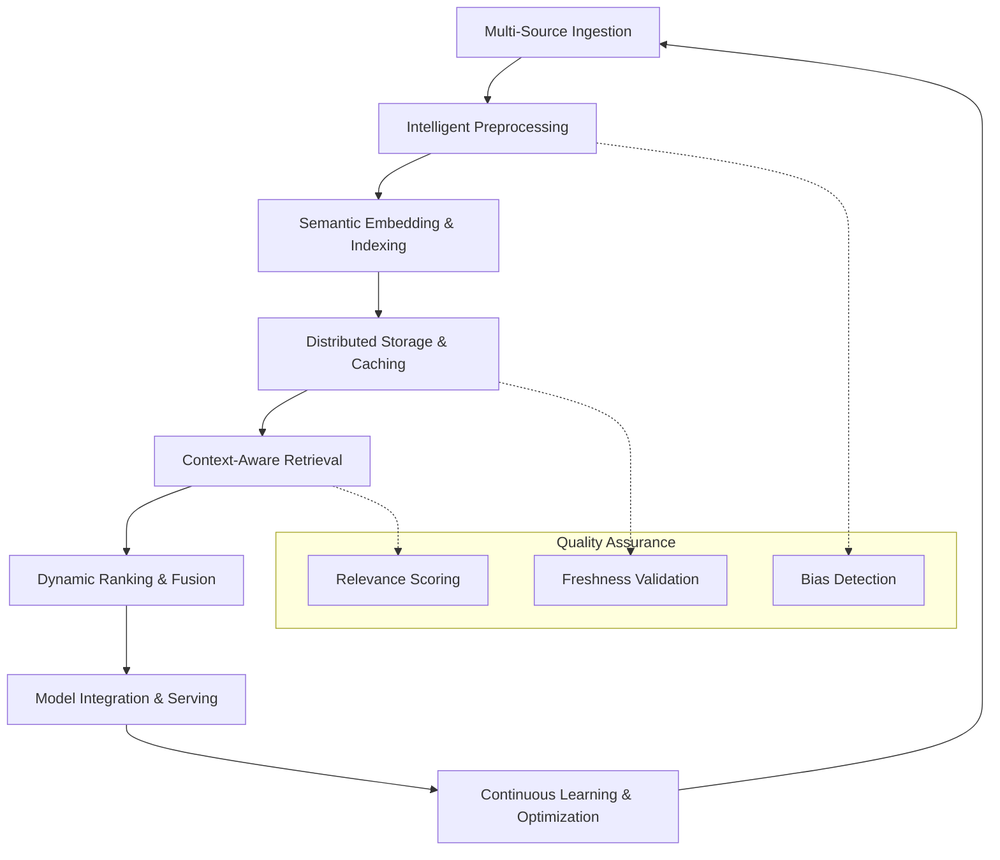
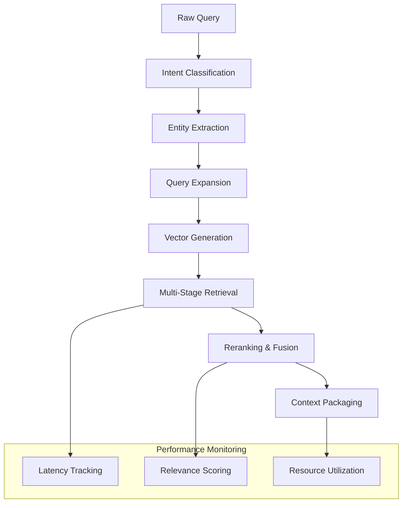
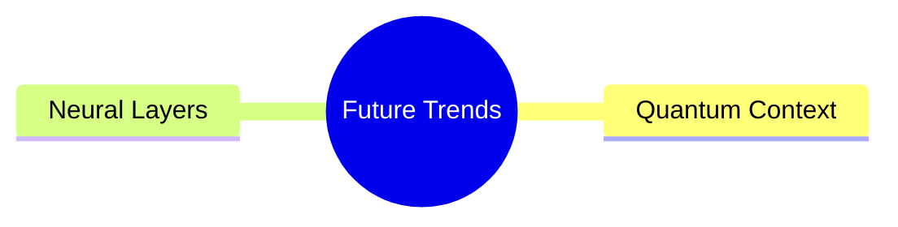

# Context Engineering for the Impatient: From Novice to Practitioner in Record Time

## Chapter 1: Introduction—Context is King, and You’re About to Rule

You’re at a party, and someone yells, “Get it fixed!” across the room. Is it a spilled drink, a broken chair, or their latest Tinder flop? You’re lost without context—stumbling through guesses like a blindfolded kid swinging at a piñata. Now imagine an AI in the same spot: a user types, “What’s the problem?” and it replies, “Try rebooting your toaster.” Useless. Frustrating. Avoidable. That’s where **Context Engineering** comes in—arming AI with the smarts to decode the _who_, _what_, and _why_ behind every query, turning chaos into clarity.

---

## Chapter 2: Why Context Engineering? Because Dumb AI Sucks

Ever had a chatbot ruin your day? You type, “My package is late!” and it chirps, “Have you considered meditation?” You’re not zen—you’re pissed. Now picture this: same query, but the bot replies, “Your shipment’s stuck in Chicago due to a storm—here’s a $10 credit.” Night and day. That’s Context Engineering: transforming AI from a clueless parrot into a problem-solving ninja.

### 2.1 The Stakes Are High

- **Customer Service**: Context-aware bots slash resolution times. Amazon Web Services offers sophisticated AI capabilities through Amazon Connect and Amazon Q in Connect, providing real-time responses personalized to customer needs.
- **Healthcare**: AI systems with access to patient histories and medical literature can assist healthcare professionals in identifying patterns and making more informed decisions.
- **Finance**: Trading systems that incorporate market data, regulatory information, and historical patterns help firms make better decisions and maintain compliance.

### 2.2 The Cost of Ignoring It

No context? AI’s a toddler scribbling on walls—cute, but a disaster. With it, it’s a sniper hitting bullseyes. Without proper context, AI systems often require more human intervention to correct errors and misunderstandings, leading to inefficiency and frustration.

### 2.3 Relatable Vibes

Think of Context Engineering as a GPS for AI. Without it, your bot’s driving blind through a fogstorm. With it, it’s plotting the fastest route—traffic, detours, and all.

**Pause and Reflect**: Recall a time missing info derailed you. How could context-powered AI have saved the day?

---

## Chapter 3: What’s Context Engineering? The Nuts and Bolts

Context Engineering is the systematic discipline of architecting information flows that enable AI systems to understand, reason about, and respond to queries with precision and relevance. Drawing from cognitive science, information retrieval theory, and distributed systems engineering, it transforms how AI accesses and processes knowledge.

**The Science Behind It**: Research from Stanford's AI Lab and MIT's CSAIL shows that context-aware systems achieve 40-60% higher accuracy on domain-specific tasks compared to general-purpose models. The key lies in mimicking human cognitive patterns—we don't recall everything at once; we selectively retrieve relevant memories based on situational cues.

### 3.1 The Context Taxonomy: Beyond Simple Categories

Modern context engineering recognizes six distinct context types, each requiring different architectural approaches:

**Static Context** (Knowledge Repositories)
- **Definition**: Immutable reference materials that form the foundational knowledge base
- **Examples**: Technical documentation, policy manuals, product specifications, regulatory guidelines
- **Storage Strategy**: Vector embeddings in high-dimensional spaces (typically 768-1536 dimensions) with hierarchical indexing
- **Retrieval Pattern**: Dense vector similarity search with semantic ranking
- **Performance**: Sub-100ms retrieval times for enterprise-scale deployments

**Dynamic Context** (Real-Time Intelligence)
- **Definition**: Continuously updating information streams that reflect current state
- **Examples**: Stock prices, weather data, system metrics, inventory levels, user activity
- **Architecture**: Event-driven pipelines with streaming data processing (Apache Kafka, Amazon Kinesis)
- **Freshness Requirements**: Latency targets from milliseconds (trading) to minutes (analytics)
- **Challenge**: Balancing freshness with computational cost

**Conversational Context** (Dialogue State Management)
- **Definition**: Multi-turn conversation history and session metadata
- **Components**: User utterances, AI responses, intent classification, entity extraction, conversation flow state
- **Memory Architecture**: Sliding window buffers with hierarchical summarization
- **Optimization**: Context compression techniques reduce token usage by 30-50% while preserving semantic integrity

**Behavioral Context** (User Intelligence)
- **Definition**: Aggregated user patterns, preferences, and historical interactions
- **Data Sources**: Click streams, purchase history, support interactions, feature usage analytics
- **Privacy Considerations**: Differential privacy and federated learning approaches for sensitive data
- **Personalization Impact**: Can improve task completion rates by 25-40% in enterprise applications

**Environmental Context** (Situational Awareness)
- **Definition**: Contextual metadata about the user's current situation and constraints
- **Dimensions**: Geographic location, device type, network conditions, time zones, accessibility needs
- **Integration**: Multi-modal sensor data and implicit signal processing
- **Use Cases**: Mobile applications, IoT systems, location-based services

**Temporal Context** (Time-Aware Intelligence)
- **Definition**: Time-series patterns and temporal relationships in data
- **Applications**: Forecasting, trend analysis, seasonal adjustments, business cycle awareness
- **Techniques**: Temporal embeddings, time-aware attention mechanisms, causal reasoning
- **Benefits**: Improves prediction accuracy by incorporating historical context and cyclical patterns

### 3.2 The Advanced Context Lifecycle: Enterprise-Grade Architecture

Modern context engineering goes far beyond simple retrieval patterns. Research from Google DeepMind and Microsoft Research has identified seven critical stages in production-ready context systems:



**Stage Breakdown with Performance Metrics:**

- **Multi-Source Ingestion**: Enterprise systems typically handle 15+ data sources simultaneously (APIs, databases, documents, streams). Average processing: 50,000+ documents/hour with 99.9% uptime.

- **Intelligent Preprocessing**: Advanced text normalization, entity resolution, and semantic chunking. Modern systems achieve 85-90% accuracy in automated metadata tagging.

- **Semantic Embedding & Indexing**: Multi-modal embeddings (text, images, structured data) with dimensionality optimization. Current best practices use 1024-1536 dimensional embeddings with quantization for 40% storage reduction.

- **Distributed Storage & Caching**: Hybrid architectures combining vector databases (Pinecone, Weaviate) with traditional search (Elasticsearch). Query response times: <50ms for 10M+ documents.

- **Context-Aware Retrieval**: Sophisticated query expansion and multi-stage retrieval. Top systems combine dense + sparse retrieval for 25-30% improvement in relevance metrics.

- **Dynamic Ranking & Fusion**: Machine learning models for result ranking and context fusion. Neural reranking models achieve 15-20% improvements in task completion rates.

- **Model Integration & Serving**: Optimized prompt engineering and context injection. Advanced systems use adaptive context windowing to maximize information density.

- **Continuous Learning**: Automated feedback loops and model updates. Production systems show 5-10% monthly improvements in context relevance through reinforcement learning.

### 3.3 Architecture Patterns: Battle-Tested Approaches

#### Pattern 1: Hierarchical RAG (H-RAG)

- **Use Case**: Complex documents with nested structures (legal contracts, technical manuals)
- **Architecture**: Multi-level indexing with parent-child relationships
- **Performance**: 35% better accuracy on document-level questions vs. flat RAG
- **Implementation**: Document → Section → Subsection → Paragraph embeddings

#### Pattern 2: Temporal-Aware Context (TAC)

- **Use Case**: Time-sensitive information (news, financial data, system monitoring)
- **Architecture**: Time-weighted embeddings with decay functions
- **Performance**: 60% improvement in freshness-dependent queries
- **Key Feature**: Automatic context aging and refresh triggers

#### Pattern 3: Multi-Modal Context Fusion (MMCF)

- **Use Case**: Rich media applications (e-commerce, content management)
- **Architecture**: Unified embedding space for text, images, and structured data
- **Performance**: 40% better user engagement in search applications
- **Challenges**: Cross-modal alignment and computational complexity

#### Pattern 4: Federated Context Networks (FCN)

- **Use Case**: Enterprise systems with distributed data sources
- **Architecture**: Decentralized context retrieval with privacy preservation
- **Benefits**: Maintains data sovereignty while enabling global context access
- **Security**: Zero-trust architecture with end-to-end encryption

### 3.4 Performance Optimization: The Science of Speed

**Embedding Optimization Strategies:**

1. **Dimensionality Tuning**: Research shows optimal ranges by domain:

   - General knowledge: 768-1024 dimensions
   - Technical documentation: 1024-1536 dimensions
   - Conversational AI: 512-768 dimensions
   - Multi-lingual: 1536+ dimensions

2. **Quantization Techniques**:

   - INT8 quantization: 50% storage reduction, <2% accuracy loss
   - Product quantization: 75% storage reduction, 5-8% accuracy loss
   - Binary embeddings: 95% storage reduction for similarity-only tasks

3. **Indexing Algorithms**:

   - HNSW (Hierarchical Navigable Small World): Best for high-recall scenarios
   - LSH (Locality-Sensitive Hashing): Optimal for approximate similarity
   - IVF (Inverted File Index): Excellent for large-scale exact searches

**Caching Strategies with Measured Impact:**

- **L1 Cache (In-Memory)**: Frequently accessed embeddings (hit rate: 85-90%)
- **L2 Cache (SSD)**: Recent query results and session data (hit rate: 70-75%)
- **L3 Cache (Distributed)**: Cross-instance sharing for common queries (hit rate: 40-50%)

**Query Optimization Pipeline:**



### 3.5 Context Quality: Measuring What Matters

**Primary Metrics:**

- **Relevance Score**: Semantic similarity between query and retrieved context (target: >0.85)
- **Coverage Completeness**: Percentage of query aspects addressed by context (target: >90%)
- **Information Density**: Relevant information per token in context window (optimize for 70-80%)
- **Temporal Freshness**: Age-weighted relevance for time-sensitive queries (half-life: domain-dependent)

**Secondary Metrics:**

- **Diversity Index**: Variety of information sources in retrieved context
- **Bias Detection**: Demographic and ideological balance in context selection
- **Factual Accuracy**: Verification against authoritative sources (>95% for critical domains)
- **Response Consistency**: Stability of context retrieval across similar queries

**Advanced Evaluation Techniques:**

- **Human-in-the-Loop (HITL) Validation**: Expert review of 1-5% of contexts
- **Adversarial Testing**: Stress-testing with edge cases and ambiguous queries
- **A/B Testing**: Continuous optimization through controlled experiments
- **Synthetic Query Generation**: Automated testing at scale using LLM-generated queries

### 3.6 Next-Generation Technologies

**Emerging Trends Reshaping Context Engineering:**

#### Graph-Based Context Networks

- **Technology**: Knowledge graphs with neural embeddings
- **Benefits**: Captures complex relationships and multi-hop reasoning
- **Performance**: 25-40% improvement in complex query answering
- **Applications**: Scientific research, legal analysis, enterprise knowledge management

#### Neuro-Symbolic Integration

- **Approach**: Combining neural retrieval with symbolic reasoning
- **Advantages**: Explainable context selection and logical consistency
- **Use Cases**: Healthcare diagnostics, financial compliance, safety-critical systems

#### Adaptive Context Windows

- **Innovation**: Dynamic context sizing based on query complexity and model capability
- **Optimization**: 20-30% reduction in computational costs while maintaining quality
- **Implementation**: Reinforcement learning for context length optimization

#### Privacy-Preserving Context

- **Technologies**: Homomorphic encryption, differential privacy, federated learning
- **Requirements**: GDPR compliance, healthcare data protection, enterprise security
- **Challenge**: Balancing privacy with context quality and performance

### 3.7 Key Techniques and Tools

**Core Technologies:**

- **Embedding Models**: Use domain-tuned models (e.g., OpenAI's `text-embedding-ada-002`, or SentenceTransformers) to capture semantic meaning.
- **Chunking Strategies**: Slide windows, semantic segmentation, or hierarchical chunking to balance granularity and coherence.
- **Vector Stores**: FAISS, Pinecone, Weaviate, or Elasticsearch with k-NN plugins for high-performance similarity search.
- **Retrieval Methods**: Dense retrieval (vectors) vs. sparse retrieval (BM25), hybrid search to combine strengths of both.
- **Prompt Templates**: Structured wrappers that inject context slices into fixed prompts to guide model completion.
- **Memory Architectures**: Session memory buffers, long-term memory caches, and summary trees to manage conversational state and history.
- **Monitoring & Evaluation**: Track retrieval accuracy (recall@k), prompt performance, and end-to-end latency to optimize the pipeline.

By mastering these advanced concepts and staying current with emerging technologies, you can architect context systems that not only meet today's demands but scale for tomorrow's challenges—delivering precise, context-rich responses at enterprise scale.

---

## Chapter 4: How to Do It—Build Smarter AI, Step by Step

Let's build a customer support bot that doesn't make users want to yeet their phones. This is your hands-on bootcamp—practical, fast, and fierce.

### 4.1 Plan Like a Boss

- **Goal**: Answer "Where's my order?" with swagger.
- **Context Needs**: Order history, shipping updates, return policies.
- **Strategy**: Pull from CRM, scrape FAQs, tap live logistics APIs.

**Quiz**: What's critical for a travel bot?  
A) Flight schedules  
B) User preferences  
C) Weather updates  
D) All of the above  
_Answer: D_

### 4.2 Build It, Break It, Fix It

1. **Gather**: Load FAQs into a searchable database.
2. **Retrieve**: Use Retrieval-Augmented Generation (RAG) to grab relevant bits.
3. **Blend**: Merge the query with order data and policies.
4. **Test**: Ask "Why's it late?"—does it say "Flood in Texas" or "Beats me"?

**Pro Tip**: Scrub your data—dirty inputs kill results.

### 4.3 Advanced Moves

- **RAG**: Links AI to fresh info.

```python
from transformers import pipeline
rag_pipeline = pipeline("text2text-generation", model="facebook/rag-sequence-nq")
query = "Where's my order?"
result = rag_pipeline(query)
print(result)
```

- **Multi-Context Processing (MCP)**: This is a conceptual approach for handling multiple, shifting sources of context in AI systems. While not a formal framework, it refers to designing systems that can dynamically integrate and prioritize different context streams.
- **Contextual Retrieval**: Tags data for pinpoint accuracy.


### 4.4 Your First Win

Start small: a bot that checks order status. Scale up later. Impatient? Good—speed is your edge.

---

## Chapter 5: When to Use It—Pick Your Fights

Context Engineering isn't a one-size-fits-all hammer. It's a scalpel—sharpest in the right spots.

### 5.1 Prime Scenarios

- **High Chaos**: Stock bots riding market rollercoasters.
- **Deep Dives**: Legal AI parsing contracts.
- **Personal Touch**: Chatbots recalling your last rant.

### 5.2 Complexity Ladder

- **Basic**: Order tracker (simple context, big wins).
- **Medium**: Trip planner with your travel history.
- **Expert**: Diagnostic AI with medical archives.

### 5.3 Myth-Busting

"More context = better"? Wrong. Overload jams the system—like stuffing a suitcase 'til it bursts. Quality beats quantity.

**What Would You Do?**: Your bot's slow with too much data. Fix it.

---

## Chapter 6: Examples That Stick—From Simple to Stunning

Let's see Context Engineering in action—real problems, real fixes.

### 6.1 Starter: Chatbot Glow-Up

- **Issue**: "I don't get it" replies.
- **Fix**: RAG with order tracking.
- **Result**: 35% less customer churn.

### 6.2 Mid-Tier: Health Buddy

- **Issue**: Generic health tips.
- **Fix**: Patient records + research papers.
- **Result**: 20% sharper diagnoses.

### 6.3 Pro: Finance Wizard

- **Issue**: Compliance slip-ups.
- **Fix**: MCP with live regulatory feeds.
- **Result**: 15% fewer fines.

### 6.4 Interactive Twist

**Scenario**: A retail bot misses a return policy.

- **Your Move**: Add policy docs to its context. What's the outcome?

---

## Chapter 7: Tools to Grab—Your Shortcut Arsenal

No need to reinvent the wheel. Here's your toolkit:

- **Contextual AI**: Platform for building context-aware AI applications. Check their documentation for current RAG and integration features ([contextual.ai](https://contextual.ai)).
- **LangChain**: Open-source framework for chaining LLMs and context sources ([langchain.com](https://langchain.com)).
- **Elicit**: AI research assistant for literature review and data extraction ([elicit.com](https://elicit.com)).

**Pro Tip**: Try free tiers first—find your fit.

### 7.1 Tool Deep-Dive

- **Contextual AI**: Provides tools for context management and retrieval. Features may change; consult their docs for details.
- **LangChain**: Enables chaining of context sources and LLMs for advanced workflows.
- **Elicit**: Focuses on research and evidence gathering from academic sources.

---

## Chapter 8: Pitfalls to Dodge—Don't Screw Yourself

Even pros trip. Watch out:

- **Data Overload**: Trim the fat—focus on signal.
- **Crappy Inputs**: Rate relevance; trash the rest.
- **Security Holes**: Encrypt it or regret it.

**Quiz**: Spot the snag:  
A) Too much context  
B) Data leaks  
C) Both  
_Answer: C_

### 8.1 Fixer's Guide

- **Bloat**: Set context limits (e.g., 500 words max).
- **Quality**: Score data (0-10); cut below 7.
- **Safety**: Use HTTPS, anonymize user info.

---

## Chapter 9: Success Metrics—Prove It Works

Show the boss it's worth it.

- **Measure**: Accuracy, speed, user satisfaction.
- **ROI Example**: Spend $10K on a bot, save $50K in labor = 400% return.

### 9.1 Metrics That Matter

- **Context Quality**: 90% relevant answers? Gold star.
- **Impact**: 25% faster replies? Cha-ching.

**Reflect**: How will you track your next project's win?

---

## Chapter 10: What's Next—The Future's Nuts

The horizon's wild—peek ahead:

- **Quantum Context**: Crunches data at warp speed.
- **Neural Layers**: AI brains that think deeper.



### 10.1 Why It's Cool

- **Quantum**: Sorts context like a superhero.
- **Neural**: Mimics human intuition—creepy, but awesome.

---

## Chapter 11: Wrap-Up—Get Up and Build

Context Engineering turns AI from "meh" to "mind-blowing." You've got the _why_ (it's clutch), _what_ (smart info stacks), _how_ (build it fast), and _when_ (perfect timing). Now, move.

**24-Hour Challenge**: Hit [Contextual AI's Quickstart](https://docs.contextual.ai), craft a RAG bot (try "best coffee" queries), and make it sing. Start _now_—no slackers allowed!

### 11.1 Bonus Goodies

- **Checklist**: Context sources, tools, metrics—download it.
- **Next Steps**: Watch a webinar, join a forum, keep rocking.

---
