# Context Engineering: From Novice to Practitioner in Record Time

> *Transform your AI from a confused parrot into a problem-solving genius that actually understands what users need.*

---

## What You'll Master

By the end of this guide, you'll architect AI systems that don't just respond—they *understand*. You'll build context-aware applications that deliver precise, relevant answers by intelligently connecting the dots between user queries and the right information at the right time.

**🎯 Learning Outcomes:**

- **Design** context-aware AI architectures that scale from prototypes to enterprise systems
- **Implement** advanced retrieval patterns (RAG, multi-modal fusion, temporal awareness)
- **Navigate** LLM latent knowledge spaces and resolve conflicts with fresh context
- **Optimize** context systems for sub-100ms response times with enterprise-grade reliability
- **Measure** success using proven metrics that demonstrate real business impact

---

## Why This Matters (And Why Now)

Picture this: A customer types "My package is late!" Your current AI chirps back, "Have you tried meditation?" Meanwhile, your competitor's system responds, "Your shipment's delayed in Chicago due to weather—here's a $10 credit and updated delivery estimate." 

**That's the difference Context Engineering makes.**

The AI revolution isn't just about having smart models—it's about building smart *systems* that connect those models to the right information. While everyone else is prompt-tuning their way to mediocrity, you'll be architecting information pipelines that make AI genuinely useful.

**The numbers don't lie:**

- Context-aware systems achieve **40-60% higher accuracy** on domain-specific tasks (Stanford AI Lab, MIT CSAIL)
- Companies using advanced context engineering report **25-40% improvements** in task completion rates
- Enterprise deployments show **5-10% monthly gains** in relevance through continuous learning

---

## Who This Guide Is For

**✅ Perfect if you're:**

- Software engineers building AI-powered applications
- ML engineers moving beyond model training into system design  
- Product managers who need to understand what's actually possible
- Technical leads architecting next-generation AI products
- Anyone who's built a basic RAG system and wants to go pro

**❌ Skip this if you're:**

- Looking for basic "how to use ChatGPT" tutorials
- Expecting pure academic theory without practical implementation
- Not ready to write code and build real systems

---

## How This Guide Works

This isn't your typical dry technical manual. We balance accessible explanations with deep technical insights, so you can both understand the concepts and implement production-ready systems.

**🚀 For Beginners:** Start with Chapters 1-3 for foundational concepts, then try the hands-on examples in Chapter 4
**⚡ For Practitioners:** Jump to Chapter 3 for advanced patterns, then dive into optimization techniques in Chapters 7-8  
**🎯 For Leaders:** Focus on Chapters 2, 5, and 9 for strategic insights and ROI metrics

Each chapter includes:

- **Real-world examples** with actual performance metrics
- **Interactive elements** to test your understanding  
- **Code samples** you can adapt for your projects
- **Decision frameworks** for choosing the right approach

---

## What Makes Context Engineering Different

Think of traditional AI as a brilliant student who's locked in a library with no catalog system. They're smart, but they can't find the right books when they need them. Context Engineering builds that catalog system—but smarter.

**The breakthrough insight:** Just like your brain doesn't store every memory in active recall, AI systems shouldn't try to cram everything into a single model. Instead, we build intelligent information architectures that dynamically retrieve and organize exactly what's needed for each specific query.

**The result:** AI that feels less like talking to a computer and more like consulting with an expert who has perfect recall and infinite patience.

---

## Ready? Let's Build Something Incredible

Context Engineering transforms AI from "impressive demos" to "indispensable tools." You're about to learn the systematic discipline that separates amateur AI experiments from production systems that actually solve real problems.

**Time investment:** 2-3 hours to read, 1-2 weeks to implement your first production system  
**Expected ROI:** 3-5x improvement in user satisfaction, 40-60% reduction in support costs

Let's turn your AI from a confused parrot into a problem-solving genius.

## Chapter 1: Introduction—Context is King, and You’re About to Rule

You’re at a party, and someone yells, “Get it fixed!” across the room. Is it a spilled drink, a broken chair, or their latest Tinder flop? You’re lost without context—stumbling through guesses like a blindfolded kid swinging at a piñata. Now imagine an AI in the same spot: a user types, “What’s the problem?” and it replies, “Try rebooting your toaster.” Useless. Frustrating. Avoidable. That’s where **Context Engineering** comes in—arming AI with the smarts to decode the _who_, _what_, and _why_ behind every query, turning chaos into clarity.

---

## Chapter 2: Why Context Engineering? Because Dumb AI Sucks

Ever had a chatbot ruin your day? You type, “My package is late!” and it chirps, “Have you considered meditation?” You’re not zen—you’re pissed. Now picture this: same query, but the bot replies, “Your shipment’s stuck in Chicago due to a storm—here’s a $10 credit.” Night and day. That’s Context Engineering: transforming AI from a clueless parrot into a problem-solving ninja.

### 2.1 The Stakes Are High

- **Customer Service**: Context-aware bots slash resolution times. Amazon Web Services offers sophisticated AI capabilities through Amazon Connect and Amazon Q in Connect, providing real-time responses personalized to customer needs.
- **Healthcare**: AI systems with access to patient histories and medical literature can assist healthcare professionals in identifying patterns and making more informed decisions.
- **Finance**: Trading systems that incorporate market data, regulatory information, and historical patterns help firms make better decisions and maintain compliance.

### 2.2 The Cost of Ignoring It

No context? AI’s a toddler scribbling on walls—cute, but a disaster. With it, it’s a sniper hitting bullseyes. Without proper context, AI systems often require more human intervention to correct errors and misunderstandings, leading to inefficiency and frustration.

### 2.3 Relatable Vibes

Think of Context Engineering as a GPS for AI. Without it, your bot’s driving blind through a fogstorm. With it, it’s plotting the fastest route—traffic, detours, and all.

**Pause and Reflect**: Recall a time missing info derailed you. How could context-powered AI have saved the day?

---

## Chapter 3: What’s Context Engineering? The Nuts and Bolts

Context Engineering is the systematic discipline of architecting information flows that enable AI systems to understand, reason about, and respond to queries with precision and relevance. Drawing from cognitive science, information retrieval theory, and distributed systems engineering, it transforms how AI accesses and processes knowledge.

**The Science Behind It**: Research from Stanford's AI Lab and MIT's CSAIL shows that context-aware systems achieve 40-60% higher accuracy on domain-specific tasks compared to general-purpose models. The key lies in mimicking human cognitive patterns—we don't recall everything at once; we selectively retrieve relevant memories based on situational cues.

### 3.1 The Context Taxonomy: Your AI's Information Diet

Just like you wouldn't feed a bodybuilder the same diet as a marathon runner, different AI tasks need different types of context. Here are the six flavors your AI craves—think of them as food groups for smart systems:

**🗂️ Static Context** (The Reference Library)

Picture your AI having a personal Wikipedia that never changes—policy manuals, product specs, that kind of stuff.

- **What it is**: Your AI's permanent reference materials—the stuff that doesn't change much
- **Real example**: When someone asks about your return policy, your bot pulls from the same document every time
- **Why it matters**: Fast, reliable answers from your knowledge vault

_Tech Deep-Dive (Skip if you're just starting):_

- **Definition**: Immutable reference materials that form the foundational knowledge base
- **Examples**: Technical documentation, policy manuals, product specifications, regulatory guidelines  
- **Storage Strategy**: Vector embeddings in high-dimensional spaces (typically 768-1536 dimensions) with hierarchical indexing
- **Retrieval Pattern**: Dense vector similarity search with semantic ranking
- **Performance**: Sub-100ms retrieval times for enterprise-scale deployments

**⚡ Dynamic Context** (The Live News Feed)

Your AI's real-time intelligence—like having a constantly updating dashboard of what's happening right now.

- **What it is**: Info that changes constantly—stock prices, weather, inventory levels
- **Real example**: "Is my item in stock?" pulls live inventory data, not yesterday's numbers
- **Why it matters**: Fresh answers that reflect reality, not history

_Tech Deep-Dive:_

- **Definition**: Continuously updating information streams that reflect current state
- **Examples**: Stock prices, weather data, system metrics, inventory levels, user activity
- **Architecture**: Event-driven pipelines with streaming data processing (Apache Kafka, Amazon Kinesis)
- **Freshness Requirements**: Latency targets from milliseconds (trading) to minutes (analytics)
- **Challenge**: Balancing freshness with computational cost

**💬 Conversational Context** (The Memory Bank)

Your AI remembers what you just said—like having a conversation with someone who actually listens.

- **What it is**: Everything that happened in your chat so far
- **Real example**: You say "I ordered a red one" and later ask "When will it arrive?"—your bot knows what "it" means
- **Why it matters**: Natural conversations instead of starting over every message

_Tech Deep-Dive:_

- **Definition**: Multi-turn conversation history and session metadata
- **Components**: User utterances, AI responses, intent classification, entity extraction, conversation flow state
- **Memory Architecture**: Sliding window buffers with hierarchical summarization
- **Optimization**: Context compression techniques reduce token usage by 30-50% while preserving semantic integrity

**🎯 Behavioral Context** (The Personal Shopper)

Your AI learns your patterns—like a barista who knows your "usual" before you ask.

- **What it is**: Your preferences, habits, and history rolled into smart suggestions
- **Real example**: "Show me flights" becomes "Here are evening flights to Chicago like you usually prefer"
- **Why it matters**: Personalized experiences that feel like mind-reading (in a good way)

_Tech Deep-Dive:_

- **Definition**: Aggregated user patterns, preferences, and historical interactions
- **Data Sources**: Click streams, purchase history, support interactions, feature usage analytics
- **Privacy Considerations**: Differential privacy and federated learning approaches for sensitive data
- **Personalization Impact**: Can improve task completion rates by 25-40% in enterprise applications

**🌍 Environmental Context** (The Situation Reader)

Your AI knows where you are and what you're working with—mobile vs. desktop, WiFi vs. cellular, New York vs. Tokyo.

- **What it is**: Your current situation and constraints
- **Real example**: Suggests lighter content when you're on mobile data, local restaurants when you're traveling
- **Why it matters**: Smart adjustments based on your reality, not assumptions

_Tech Deep-Dive:_

- **Definition**: Contextual metadata about the user's current situation and constraints
- **Dimensions**: Geographic location, device type, network conditions, time zones, accessibility needs
- **Integration**: Multi-modal sensor data and implicit signal processing
- **Use Cases**: Mobile applications, IoT systems, location-based services

**⏰ Temporal Context** (The Time Traveler)

Your AI understands timing—rush hour traffic patterns, holiday shopping spikes, "end of quarter" business cycles.

- **What it is**: Time-aware intelligence that recognizes patterns and cycles
- **Real example**: "Traffic to airport" gives different answers at 3 PM vs. 3 AM, and knows about typical Friday delays
- **Why it matters**: Predictions and advice that factor in time-based patterns

_Tech Deep-Dive:_

- **Definition**: Time-series patterns and temporal relationships in data
- **Applications**: Forecasting, trend analysis, seasonal adjustments, business cycle awareness
- **Techniques**: Temporal embeddings, time-aware attention mechanisms, causal reasoning
- **Benefits**: Improves prediction accuracy by incorporating historical context and cyclical patterns

---

**🎯 Quick Decision Guide**: New to this? Start with **Static Context** (easiest wins) and **Conversational Context** (immediate user impact). Ready for more? Add **Dynamic Context** for live data. Going pro? Layer in **Behavioral**, **Environmental**, and **Temporal** for AI that feels psychic.

### 3.2 Latent Knowledge Navigation: Mining Your Model's Memory

**The Hidden Goldmine**: Your LLM already contains encyclopedic knowledge—the trick is knowing how to dig it out strategically while avoiding the fool's gold of outdated information.

#### The Two-Brain Problem

Your AI has two knowledge sources:
- **Latent Space**: What it learned during training (frozen in time)
- **Context Space**: What you feed it now (fresh and relevant)

**The Challenge**: When these conflict, chaos ensues. The solution? Strategic knowledge fusion.

**Real Example**: 
- **Query**: "What's the latest Python version?"
- **Latent**: "Python 3.9 is current" (from training)
- **Context**: "Python 3.12 released December 2023"
- **Smart Resolution**: "My training data shows Python 3.9, but current context indicates Python 3.12 is now available. Using the updated information."

#### Smart Knowledge Excavation Techniques

**Technique 1: Archaeological Prompting**
Target specific knowledge layers instead of generic queries:

```python
# Weak prompt
"What are machine learning best practices?"

# Strong prompt  
"Based on fundamental ML principles that haven't changed since 2020, what core concepts remain constant regardless of new frameworks?"
```

**Technique 2: Temporal Bifurcation**
Separate timeless knowledge from time-sensitive facts:

```python
def create_temporal_prompt(query):
    return f"""
    For: {query}
    
    TIMELESS FOUNDATION: Core principles that remain constant
    CURRENT CONTEXT: Facts that likely changed (flag for verification)
    
    Rate confidence: HIGH/MEDIUM/LOW for each point.
    """
```

**Technique 3: Conflict Resolution**
When latent knowledge conflicts with fresh context:

```python
def resolve_knowledge_conflict(latent_info, context_info):
    conflict_prompt = f"""
    My training suggests: {latent_info}
    Current context shows: {context_info}
    
    Resolution strategy:
    1. Acknowledge the conflict explicitly
    2. Prioritize recent verified data
    3. Explain what likely changed
    4. Provide updated answer with confidence level
    """
    return process_conflict(conflict_prompt)
```

**Performance Impact**: Systems using latent-context fusion show 35% better accuracy on domain-specific tasks with mixed temporal requirements.

### 3.3 The Advanced Context Lifecycle: From Chaos to Clarity

**🚀 Ready to Level Up?** This section is for when you're past the basics and want to build enterprise-grade systems. If you're just starting, bookmark this and come back later.

Think of this as your AI's digestive system—how it takes in raw information, processes it, and serves up exactly what's needed. Here's how the pros do it:

**The Big Picture**: Google DeepMind and Microsoft Research identified seven stages that separate amateur context systems from the ones that actually work at scale. It's like the difference between a home kitchen and a Michelin-starred restaurant—same basic function, completely different execution.


**Stage Breakdown with Performance Metrics:**

- **Multi-Source Ingestion**: Enterprise systems typically handle 15+ data sources simultaneously (APIs, databases, documents, streams). Average processing: 50,000+ documents/hour with 99.9% uptime.

- **Intelligent Preprocessing**: Advanced text normalization, entity resolution, and semantic chunking. Modern systems achieve 85-90% accuracy in automated metadata tagging.

- **Semantic Embedding & Indexing**: Multi-modal embeddings (text, images, structured data) with dimensionality optimization. Current best practices use 1024-1536 dimensional embeddings with quantization for 40% storage reduction.

- **Distributed Storage & Caching**: Hybrid architectures combining vector databases (Pinecone, Weaviate) with traditional search (Elasticsearch). Query response times: <50ms for 10M+ documents.

- **Context-Aware Retrieval**: Sophisticated query expansion and multi-stage retrieval. Top systems combine dense + sparse retrieval for 25-30% improvement in relevance metrics.

- **Dynamic Ranking & Fusion**: Machine learning models for result ranking and context fusion. Neural reranking models achieve 15-20% improvements in task completion rates.

- **Model Integration & Serving**: Optimized prompt engineering and context injection. Advanced systems use adaptive context windowing to maximize information density.

- **Continuous Learning**: Automated feedback loops and model updates. Production systems show 5-10% monthly improvements in context relevance through reinforcement learning.

### 3.4 Architecture Patterns: The Greatest Hits

**Translation**: These are battle-tested recipes that actually work. Think of them as the "classic dishes" of context engineering—tried, true, and guaranteed not to blow up in your face.

#### Pattern 1: Hierarchical RAG (H-RAG) - The Russian Nesting Doll

**What it solves**: Ever try to find something in a massive document? This breaks it down like chapters → sections → paragraphs, so your AI doesn't get lost in the weeds.

**Perfect for**: Legal contracts, technical manuals, any big documents with structure

- **Use Case**: Complex documents with nested structures (legal contracts, technical manuals)
- **Architecture**: Multi-level indexing with parent-child relationships
- **Performance**: 35% better accuracy on document-level questions vs. flat RAG
- **Implementation**: Document → Section → Subsection → Paragraph embeddings

#### Pattern 2: Temporal-Aware Context (TAC) - The Time Machine

**What it solves**: Information has expiration dates. This pattern knows that last week's stock price is useless for trading decisions.

**Perfect for**: News, financial data, anything where "when" matters as much as "what"

- **Use Case**: Time-sensitive information (news, financial data, system monitoring)
- **Architecture**: Time-weighted embeddings with decay functions
- **Performance**: 60% improvement in freshness-dependent queries
- **Key Feature**: Automatic context aging and refresh triggers

#### Pattern 3: Multi-Modal Context Fusion (MMCF) - The Translator

**What it solves**: Your AI needs to understand text, images, and data tables as one cohesive story, not separate pieces.

**Perfect for**: E-commerce (products have descriptions AND photos), content management, anywhere media meets data

- **Use Case**: Rich media applications (e-commerce, content management)
- **Architecture**: Unified embedding space for text, images, and structured data
- **Performance**: 40% better user engagement in search applications
- **Challenges**: Cross-modal alignment and computational complexity

#### Pattern 4: Federated Context Networks (FCN) - The Diplomat

**What it solves**: Your data lives in different places with different rules. This lets your AI access everything while respecting boundaries.

**Perfect for**: Large enterprises, anywhere data can't all live in one place for legal/security reasons

- **Use Case**: Enterprise systems with distributed data sources
- **Architecture**: Decentralized context retrieval with privacy preservation
- **Benefits**: Maintains data sovereignty while enabling global context access
- **Security**: Zero-trust architecture with end-to-end encryption

### 3.5 Performance Optimization: Making It Lightning Fast

**Real talk**: Context systems can be slow as molasses if you don't optimize them. Here's how to make your AI respond faster than a New Yorker honking at a green light.

**The Speed Hierarchy**: Think of this like tuning a race car—you optimize the engine (embeddings), transmission (indexing), and fuel system (caching) to get maximum performance.

**Embedding Optimization Strategies:**

1. **Dimensionality Tuning**: Research shows optimal ranges by domain:

   - General knowledge: 768-1024 dimensions
   - Technical documentation: 1024-1536 dimensions
   - Conversational AI: 512-768 dimensions
   - Multi-lingual: 1536+ dimensions

2. **Quantization Techniques**:

   - INT8 quantization: 50% storage reduction, <2% accuracy loss
   - Product quantization: 75% storage reduction, 5-8% accuracy loss
   - Binary embeddings: 95% storage reduction for similarity-only tasks

3. **Indexing Algorithms**:

   - HNSW (Hierarchical Navigable Small World): Best for high-recall scenarios
   - LSH (Locality-Sensitive Hashing): Optimal for approximate similarity
   - IVF (Inverted File Index): Excellent for large-scale exact searches

**Caching Strategies with Measured Impact:**

- **L1 Cache (In-Memory)**: Frequently accessed embeddings (hit rate: 85-90%)
- **L2 Cache (SSD)**: Recent query results and session data (hit rate: 70-75%)
- **L3 Cache (Distributed)**: Cross-instance sharing for common queries (hit rate: 40-50%)

**Query Optimization Pipeline:**


### 3.6 Context Quality: How to Know If You're Winning

**The Bottom Line**: If your AI is giving good answers, your context system is working. If it's giving weird answers, time to debug. Here's how to measure success:

**The "Does It Actually Work?" Test**: Primary metrics that matter most

**Primary Metrics:**

- **Relevance Score**: Semantic similarity between query and retrieved context (target: >0.85)
- **Coverage Completeness**: Percentage of query aspects addressed by context (target: >90%)
- **Information Density**: Relevant information per token in context window (optimize for 70-80%)
- **Temporal Freshness**: Age-weighted relevance for time-sensitive queries (half-life: domain-dependent)

**Secondary Metrics:**

- **Diversity Index**: Variety of information sources in retrieved context
- **Bias Detection**: Demographic and ideological balance in context selection
- **Factual Accuracy**: Verification against authoritative sources (>95% for critical domains)
- **Response Consistency**: Stability of context retrieval across similar queries

**Advanced Evaluation Techniques:**

- **Human-in-the-Loop (HITL) Validation**: Expert review of 1-5% of contexts
- **Adversarial Testing**: Stress-testing with edge cases and ambiguous queries
- **A/B Testing**: Continuous optimization through controlled experiments
- **Synthetic Query Generation**: Automated testing at scale using LLM-generated queries

### 3.7 Next-Generation Technologies: The Future's Wild

**Heads up**: This stuff is bleeding-edge. Perfect for impressing your boss or planning your next startup, but maybe not for your first context project.

**The Sci-Fi Stuff That's Actually Happening**:

#### Graph-Based Context Networks

- **Technology**: Knowledge graphs with neural embeddings
- **Benefits**: Captures complex relationships and multi-hop reasoning
- **Performance**: 25-40% improvement in complex query answering
- **Applications**: Scientific research, legal analysis, enterprise knowledge management

#### Neuro-Symbolic Integration

- **Approach**: Combining neural retrieval with symbolic reasoning
- **Advantages**: Explainable context selection and logical consistency
- **Use Cases**: Healthcare diagnostics, financial compliance, safety-critical systems

#### Adaptive Context Windows

- **Innovation**: Dynamic context sizing based on query complexity and model capability
- **Optimization**: 20-30% reduction in computational costs while maintaining quality
- **Implementation**: Reinforcement learning for context length optimization

#### Privacy-Preserving Context

- **Technologies**: Homomorphic encryption, differential privacy, federated learning
- **Requirements**: GDPR compliance, healthcare data protection, enterprise security
- **Challenge**: Balancing privacy with context quality and performance

### 3.8 Key Techniques and Tools: Your Starter Kit

**Cut to the chase**: Here's what you actually need to build context systems that work. No fluff, just the essentials that separate working systems from weekend experiments.

**Your Context Engineering Toolkit**:

- **Embedding Models**: Use domain-tuned models (e.g., OpenAI's `text-embedding-ada-002`, or SentenceTransformers) to capture semantic meaning.
- **Chunking Strategies**: Slide windows, semantic segmentation, or hierarchical chunking to balance granularity and coherence.
- **Vector Stores**: FAISS, Pinecone, Weaviate, or Elasticsearch with k-NN plugins for high-performance similarity search.
- **Retrieval Methods**: Dense retrieval (vectors) vs. sparse retrieval (BM25), hybrid search to combine strengths of both.
- **Prompt Templates**: Structured wrappers that inject context slices into fixed prompts to guide model completion.
- **Memory Architectures**: Session memory buffers, long-term memory caches, and summary trees to manage conversational state and history.
- **Monitoring & Evaluation**: Track retrieval accuracy (recall@k), prompt performance, and end-to-end latency to optimize the pipeline.

**🎯 Your Next Move**: Start with one context type. Build it. Test it. Make it work. Then add another. Rome wasn't built in a day, but they were laying bricks every hour.

By mastering these concepts and staying current with emerging technologies, you can architect context systems that not only meet today's demands but scale for tomorrow's challenges—delivering precise, context-rich responses at enterprise scale.

**Ready to build?** Chapter 4 shows you exactly how, step by step.

---

## Chapter 4: How to Do It—Build Smarter AI, Step by Step

Let's build a customer support bot that doesn't make users want to yeet their phones. This is your hands-on bootcamp—practical, fast, and fierce.

### 4.1 Plan Like a Boss

- **Goal**: Answer "Where's my order?" with swagger.
- **Context Needs**: Order history, shipping updates, return policies.
- **Strategy**: Pull from CRM, scrape FAQs, tap live logistics APIs.

**Quiz**: What's critical for a travel bot?  
A) Flight schedules  
B) User preferences  
C) Weather updates  
D) All of the above  
_Answer: D_

### 4.2 Build It, Break It, Fix It

1. **Gather**: Load FAQs into a searchable database.
2. **Retrieve**: Use Retrieval-Augmented Generation (RAG) to grab relevant bits.
3. **Blend**: Merge the query with order data and policies.
4. **Test**: Ask "Why's it late?"—does it say "Flood in Texas" or "Beats me"?

**Pro Tip**: Scrub your data—dirty inputs kill results.

### 4.3 Advanced Moves

- **RAG**: Links AI to fresh info.

```python
from transformers import pipeline
rag_pipeline = pipeline("text2text-generation", model="facebook/rag-sequence-nq")
query = "Where's my order?"
result = rag_pipeline(query)
print(result)
```

- **Multi-Context Processing (MCP)**: This is a conceptual approach for handling multiple, shifting sources of context in AI systems. While not a formal framework, it refers to designing systems that can dynamically integrate and prioritize different context streams.
- **Contextual Retrieval**: Tags data for pinpoint accuracy.

```mermaid
sequenceDiagram
    participant User
    participant AI
    participant Retriever
    User->>AI: "Where's my order?"
    AI->>Retriever: Fetch order + shipping
    Retriever-->>AI: "Delayed in transit"
    AI-->>User: "Stuck due to snow—ETA Tuesday."
```



### 4.4 Smart Context Fusion: Building Contradiction-Aware Systems

**Level Up**: Here's how to build systems that handle knowledge conflicts intelligently.

```python
class SmartContextBot:
    def __init__(self):
        self.knowledge_types = {
            'timeless': ['policies', 'procedures', 'principles'],
            'temporal': ['prices', 'availability', 'schedules'],
            'volatile': ['promotions', 'system_status', 'breaking_news']
        }
    
    def process_query(self, query, context_docs):
        # Classify information needs
        info_type = self.classify_query(query)
        
        # Handle based on volatility
        if info_type in self.knowledge_types['volatile']:
            return self.prioritize_fresh_context(query, context_docs)
        elif info_type in self.knowledge_types['timeless']:
            return self.blend_knowledge(query, context_docs)
        else:
            return self.temporal_fusion(query, context_docs)
    
    def temporal_fusion(self, query, context_docs):
        fusion_prompt = f"""
        Query: {query}
        
        Instructions:
        - Use current context for facts that change frequently
        - Apply training knowledge for stable principles
        - Flag any conflicts between sources
        - Explain reasoning when information differs
        
        Context: {context_docs}
        """
        return self.llm.generate(fusion_prompt)
```

**Quick Test**: Ask "What's our return policy?" (timeless) vs. "What's in stock?" (volatile) and watch your bot handle each appropriately.

### 4.5 Your First Win

Start small: a bot that checks order status with smart conflict resolution. Scale up later. Impatient? Good—speed is your edge.

---

## Chapter 5: When to Use It—Pick Your Fights

Context Engineering isn't a one-size-fits-all hammer. It's a scalpel—sharpest in the right spots.

### 5.1 Prime Scenarios

- **High Chaos**: Stock bots riding market rollercoasters.
- **Deep Dives**: Legal AI parsing contracts.
- **Personal Touch**: Chatbots recalling your last rant.

### 5.2 Complexity Ladder

- **Basic**: Order tracker (simple context, big wins).
- **Medium**: Trip planner with your travel history.
- **Expert**: Diagnostic AI with medical archives.

### 5.3 Myth-Busting

"More context = better"? Wrong. Overload jams the system—like stuffing a suitcase 'til it bursts. Quality beats quantity.

**What Would You Do?**: Your bot's slow with too much data. Fix it.

---

## Chapter 6: Examples That Stick—From Simple to Stunning

Let's see Context Engineering in action—real problems, real fixes.

### 6.1 Starter: Chatbot Glow-Up

- **Issue**: "I don't get it" replies.
- **Fix**: RAG with order tracking.
- **Result**: 35% less customer churn.

### 6.2 Mid-Tier: Health Buddy

- **Issue**: Generic health tips.
- **Fix**: Patient records + research papers.
- **Result**: 20% sharper diagnoses.

### 6.3 Pro: Finance Wizard

- **Issue**: Compliance slip-ups.
- **Fix**: MCP with live regulatory feeds.
- **Result**: 15% fewer fines.

### 6.4 Interactive Twist

**Scenario**: A retail bot misses a return policy.

- **Your Move**: Add policy docs to its context. What's the outcome?

---

## Chapter 7: Tools to Grab—Your Shortcut Arsenal

No need to reinvent the wheel. Here's your toolkit:

- **Contextual AI**: Platform for building context-aware AI applications. Check their documentation for current RAG and integration features ([contextual.ai](https://contextual.ai)).
- **LangChain**: Open-source framework for chaining LLMs and context sources ([langchain.com](https://langchain.com)).
- **Elicit**: AI research assistant for literature review and data extraction ([elicit.com](https://elicit.com)).

**Pro Tip**: Try free tiers first—find your fit.

### 7.1 Tool Deep-Dive

- **Contextual AI**: Provides tools for context management and retrieval. Features may change; consult their docs for details.
- **LangChain**: Enables chaining of context sources and LLMs for advanced workflows.
- **Elicit**: Focuses on research and evidence gathering from academic sources.

---

## Chapter 8: Pitfalls to Dodge—Don't Screw Yourself

Even pros trip. Watch out:

- **Data Overload**: Trim the fat—focus on signal.
- **Crappy Inputs**: Rate relevance; trash the rest.
- **Security Holes**: Encrypt it or regret it.

**Quiz**: Spot the snag:  
A) Too much context  
B) Data leaks  
C) Both  
_Answer: C_

### 8.1 Fixer's Guide

- **Bloat**: Set context limits (e.g., 500 words max).
- **Quality**: Score data (0-10); cut below 7.
- **Safety**: Use HTTPS, anonymize user info.

---

## Chapter 9: Success Metrics—Prove It Works

Show the boss it's worth it.

- **Measure**: Accuracy, speed, user satisfaction.
- **ROI Example**: Spend $10K on a bot, save $50K in labor = 400% return.

### 9.1 Metrics That Matter

**Primary Metrics:**
- **Context Quality**: 90% relevant answers? Gold star.
- **Response Speed**: 25% faster replies? Cha-ching.
- **User Satisfaction**: Track thumbs up/down on responses.

**Knowledge Fusion Metrics:**
- **Temporal Accuracy**: Percentage of time-sensitive queries answered with current data (target: >95%)
- **Conflict Resolution Rate**: How often contradictions are successfully identified and resolved (target: >85%)
- **Latent Knowledge Utilization**: Effective combination of training and context knowledge (target: 60-80%)
- **Freshness Score**: Age-weighted relevance for time-sensitive information

**Quick Implementation**:
```python
def measure_knowledge_fusion(responses):
    temporal_accuracy = sum(1 for r in responses if r.uses_current_data) / len(responses)
    conflict_resolution = sum(1 for r in responses if r.acknowledges_conflicts) / len(responses)
    return {
        'temporal_accuracy': temporal_accuracy,
        'conflict_resolution': conflict_resolution,
        'fusion_quality': (temporal_accuracy + conflict_resolution) / 2
    }
```

**Reflect**: How will you track your next project's win?

---

## Chapter 10: What's Next—The Future's Nuts

The horizon's wild—peek ahead:

- **Quantum Context**: Crunches data at warp speed.
- **Neural Layers**: AI brains that think deeper.


### 10.1 Why It's Cool

- **Quantum**: Sorts context like a superhero.
- **Neural**: Mimics human intuition—creepy, but awesome.

---

## Chapter 11: Wrap-Up—Get Up and Build

Context Engineering turns AI from "meh" to "mind-blowing." You've got the _why_ (it's clutch), _what_ (smart info stacks), _how_ (build it fast), and _when_ (perfect timing). Now, move.

**24-Hour Challenge**: Hit [Contextual AI's Quickstart](https://docs.contextual.ai), craft a RAG bot (try "best coffee" queries), and make it sing. Start *now*—no slackers allowed!

**48-Hour Knowledge Fusion Challenge**: 
**Day 1**: Build a simple contradiction detector
1. Create prompts that test for outdated vs. current information
2. Implement basic conflict resolution using the patterns above
3. Test with 10 queries mixing timeless and temporal elements

**Day 2**: Optimize and measure
1. Add confidence scoring to responses
2. Implement the fusion metrics from Chapter 9
3. A/B test against your baseline system

**Success Criteria**: 
- Detect 80% of knowledge conflicts
- Resolve 70% appropriately
- Maintain response quality while adding temporal awareness

### 11.1 Bonus Goodies

- **Checklist**: Context sources, tools, metrics—download it.
- **Next Steps**: Watch a webinar, join a forum, keep rocking.

---
