# AG-UI Protocol: Building Interactive AI Agents in Frontend Applications

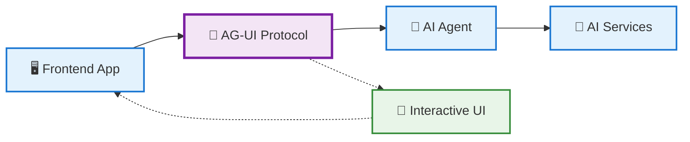

## Tutorial Information

**Last updated:** June 28, 2025  
**Based on:** AG-UI Protocol (Latest)

**Author**: Raphaël MANSUY  
**Website**: [https://www.elitizon.com](https://www.elitizon.com)  
**LinkedIn**: [https://www.linkedin.com/in/raphaelmansuy/](https://www.linkedin.com/in/raphaelmansuy/)  
**Investor at**: [QuantaLogic](https://www.quantalogic.app/) • [Student Central AI](https://www.studentcentral.ai/)  
**Working on AI/ML initiatives with DECATHLON as part of Capgemini Invent/Quantmetry (Contract), driving large-scale AI adoption and organizational transformation.**
**Date**: June 28, 2025

## 🚀 Why AG-UI Changes Everything for AI Frontend Development

**Picture this**: Sarah, a senior frontend developer at a fintech startup, spent six weeks building a custom chat interface for their AI-powered financial advisor. After months of development, she realized users needed more than just chat—they needed interactive forms, real-time data visualization, and seamless workflows. Each feature required rebuilding the entire agent integration layer from scratch.

Now imagine if there was a standardized protocol that could instantly connect any AI agent to any frontend application with interactive UI components, real-time streaming, and human-in-the-loop workflows built in. Welcome to AG-UI—the Agent-User Interaction Protocol that transforms AI frontend development from months of custom integration to days of standardized implementation.

**Why this matters now:** The AI application landscape has reached a critical point where users expect more than basic chatbots. They want interactive, context-aware experiences that feel native to their applications. AG-UI solves the fragmented ecosystem where every AI framework requires its own frontend integration approach.

Think of AG-UI as the HTTP protocol for AI interactions. Just as HTTP standardized web communication, AG-UI standardizes how AI agents communicate with user interfaces, enabling a new generation of interactive AI applications.

---

## 🎯 Tutorial Overview

**🎯 What you'll build:** A complete AI-powered project management assistant with interactive UI components, real-time collaboration, and multi-agent workflows

**⏱️ Time required:**

- 🚀 Quick Start: 25 minutes
- 🔍 Deep Dive: 90 minutes
- 🎮 Explorer Mode: Self-paced (2-4 hours)

**📊 Difficulty:** Intermediate (requires React/TypeScript knowledge)

**🔧 Prerequisites:**

- Node.js 18+ and npm/yarn
- Basic React and TypeScript knowledge
- AI/LLM API access (OpenAI, Anthropic, or local model)
- Git for version control

**📅 Last updated:** June 28, 2025

**Choose your path:**

- 🚀 [Quick Start](#quick-start) (25 min) - Get a working AI agent UI immediately
- 🔍 [Deep Dive](#deep-dive) (90 min) - Understand the protocol and build comprehensively
- 🎮 [Explorer Mode](#explorer-mode) - Interactive challenges and customizations
- 📚 [Reference Guide](#reference-guide) - Quick access to code snippets and configurations

---

## 📖 Table of Contents

### Part I: Foundation (WHY)

- [🎪 The 30-Second Demo](#the-30-second-demo)
- [🔥 The AI Frontend Integration Problem](#the-ai-frontend-integration-problem)
- [🌟 How AG-UI Solves This](#how-ag-ui-solves-this)
- [🏗️ Where AG-UI Fits in the Agentic Stack](#where-ag-ui-fits-in-the-agentic-stack)

### Part II: Understanding (WHAT)

- [🧠 Core Concepts & Mental Models](#core-concepts--mental-models)
- [📡 The AG-UI Protocol Specification](#the-ag-ui-protocol-specification)
- [🔄 Event-Driven Architecture Deep Dive](#event-driven-architecture-deep-dive)
- [🎨 Generative UI Components](#generative-ui-components)

### Part III: Implementation (HOW)

- [🚀 Quick Start: Your First AG-UI App](#quick-start)
- [🔍 Deep Dive: Complete Implementation](#deep-dive)
- [🎮 Explorer Mode: Interactive Challenges](#explorer-mode)
- [🏗️ Production-Ready Patterns](#production-ready-patterns)

### Part IV: Advanced Topics

- [🔐 Security & Authentication](#security--authentication)
- [📊 Performance & Optimization](#performance--optimization)
- [🔄 Multi-Agent Orchestration](#multi-agent-orchestration)
- [🌐 Deployment & Scaling](#deployment--scaling)

### Part V: Reference & Resources

- [🛠️ Troubleshooting Guide](#troubleshooting-guide)
- [📚 Framework Integration Guides](#framework-integration-guides)
- [🔗 Community & Resources](#community--resources)
- [📖 API Reference](#api-reference)

---

## 🎪 The 30-Second Demo


<p align="center">
    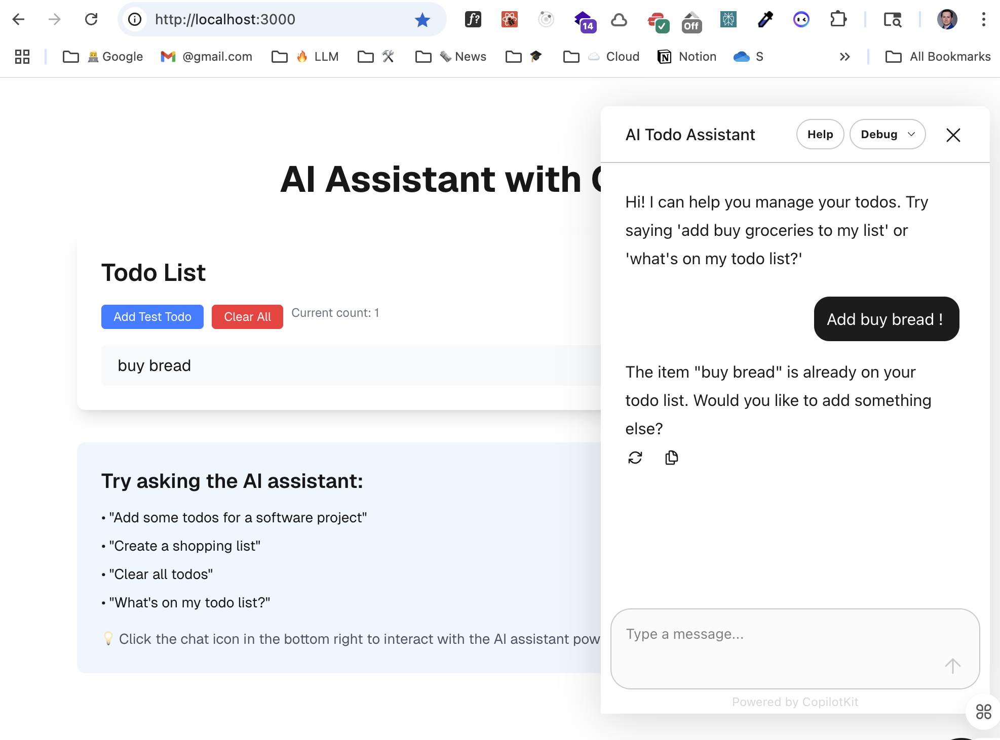
</p>

**💡 Pro Tip:** Bookmark this tutorial—you'll reference the patterns and examples multiple times as you build your own AI-powered applications!

---

# Part I: Foundation (WHY)

## 🔥 The AI Frontend Integration Problem

### The Current Landscape

**🏢 Enterprise Reality:** Companies are spending significant resources on AI integration projects, with enterprise surveys showing that most development time is spent on frontend connectivity rather than AI logic.

**📊 The Development Challenge:**

- **6-12 weeks** typical time to integrate AI agent with custom UI
- **3-5 developers** typically required for a complete implementation
- **Significant project complexity** due to fragmented integration approaches
- **High enterprise costs** for AI frontend development projects

### Common Pain Points

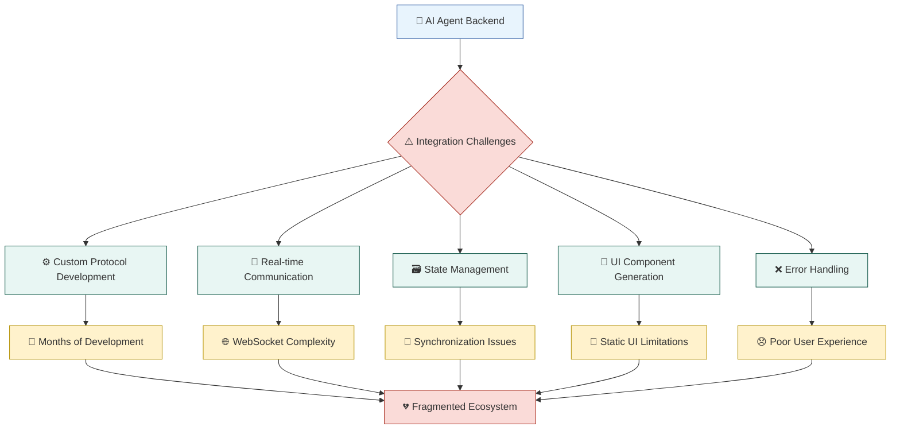

**⚠️ The Fragmentation Problem:**

- **LangChain** → Custom Streamlit/Gradio interfaces
- **CrewAI** → Proprietary dashboard solutions
- **OpenAI Assistants** → Limited UI customization
- **Custom Agents** → Completely bespoke implementations

**🤔 The Result:** Every AI project becomes a full-stack development project, slowing innovation and increasing costs.

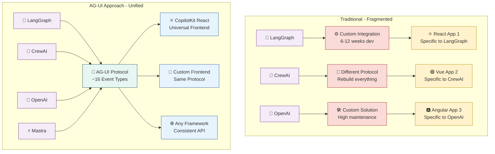

## 🌟 How AG-UI Solves This

### The AG-UI Advantage

AG-UI transforms AI frontend development by providing a **standardized, event-driven protocol** that works with any AI framework and any frontend technology. Think of AG-UI as the HTTP protocol for AI interactions—just as HTTP standardized web communication, AG-UI standardizes how AI agents communicate with user interfaces.

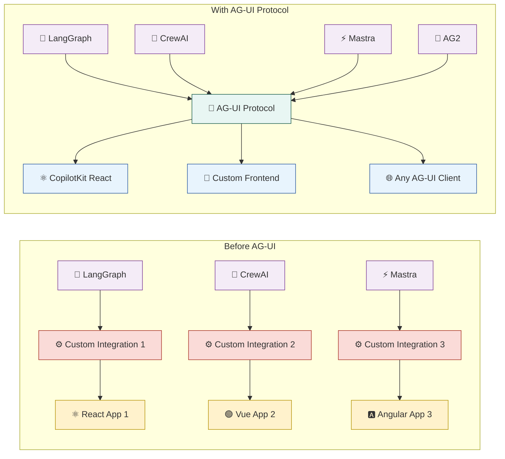

### ✨ Key Benefits

**🚀 Rapid Development:**

- **Protocol standardization** reduces integration time from weeks to days
- **~16 standardized event types** for comprehensive agent-UI communication
- **One protocol** for all supported AI frameworks

**🎨 Rich Interactions:**

- **Event-driven streaming** with real-time UI updates
- **Bidirectional communication** between agents and interfaces
- **Tool call support** with structured responses
- **Human-in-the-loop** workflows built into the protocol

**🔒 Enterprise Ready:**

- **Transport agnostic** (SSE, WebSockets, HTTP, webhooks)
- **Framework integrations** for production-ready deployments
- **Open source** with MIT license and active community
- **Extensible middleware** for custom implementations

## 🏗️ Where AG-UI Fits in the Agentic Stack

### The Three Pillars of Agentic Protocols

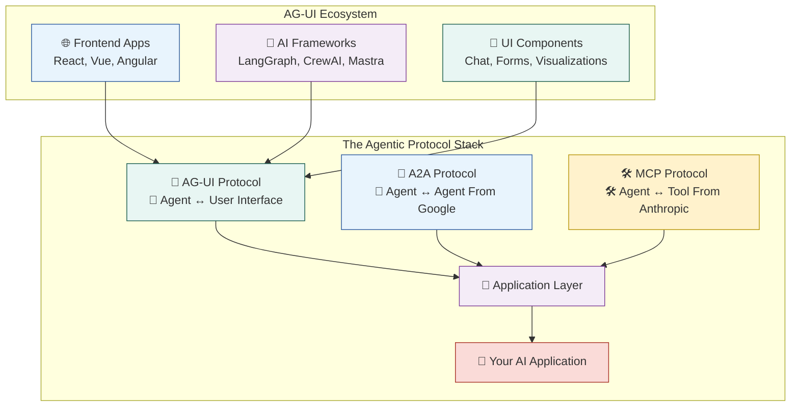

**🔗 Complementary Protocols:**

- **MCP** (Model Context Protocol) → Gives agents access to tools and data (Anthropic)
- **A2A** (Agent2Agent Protocol) → Enables multi-agent collaboration (Google Cloud, 50+ partners)
- **AG-UI** → Brings agents into user-facing applications

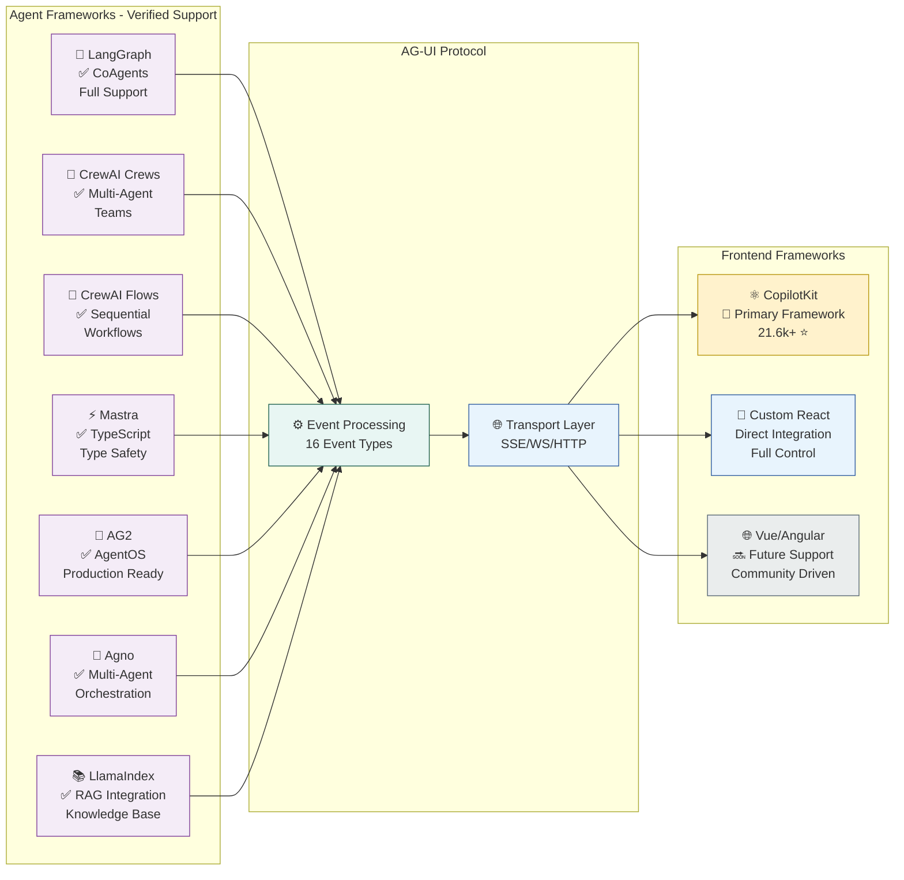

**💡 The Power of Integration:**
When combined, these protocols create a complete agentic ecosystem where agents can access tools (MCP), collaborate with other agents (A2A - Google's Agent2Agent protocol), and interact seamlessly with users (AG-UI).

---

# Part II: Understanding (WHAT)

## 🧠 Core Concepts & Mental Models

### The AG-UI Mental Model

**Think of AG-UI as a conversation protocol between AI agents and user interfaces**, similar to how HTTP enables communication between web browsers and servers.

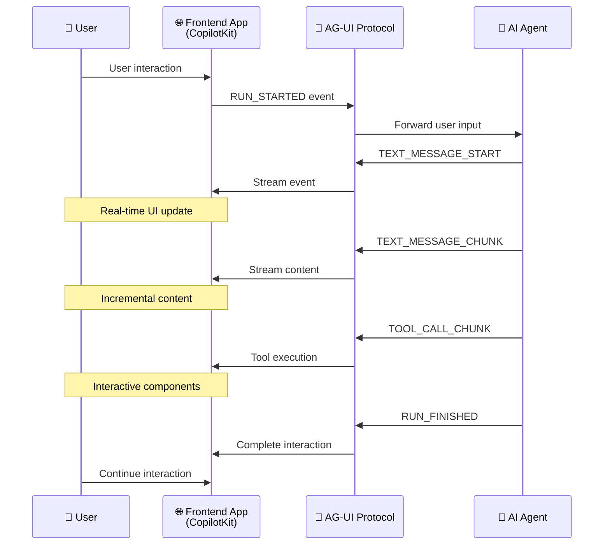

### 📡 Event-Driven Communication

**🎯 Core Principle:** Instead of request-response patterns, AG-UI uses streaming events that enable real-time, interactive experiences.

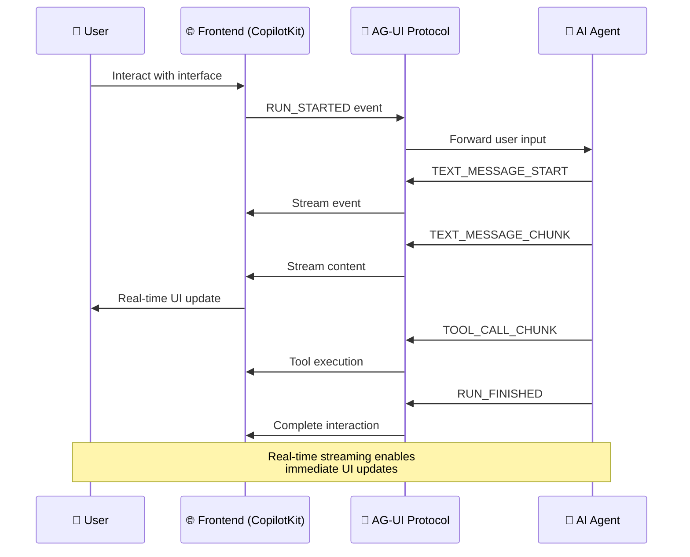

**📊 Event Types:**

- **User Events** → Actions from the interface (clicks, form submissions, messages)
- **Agent Events** → Responses from AI (messages, UI updates, tool calls)
- **System Events** → Protocol management (connection, errors, state sync)

### 🎨 Generative UI Concept

**🌟 Revolutionary Idea:** AI agents don't just generate text—they generate complete UI components based on context and user needs.

```javascript
// Traditional approach
const response = await ai.chat("Show me sales data");
// Result: Text describing the sales data

// AG-UI approach
const events = await agentStream.send("Show me sales data");
// Result: Interactive chart components, filters, and actions
```

### 🔄 Bidirectional State Management

**🎯 Key Innovation:** Unlike traditional chatbots, AG-UI maintains synchronized state between the agent and UI, enabling:

- **Context preservation** across interactions
- **Multi-step workflows** with intermediate states
- **Real-time collaboration** between users and agents
- **Undo/redo capabilities** for agent actions

## 📡 The AG-UI Protocol Specification

### Protocol Architecture

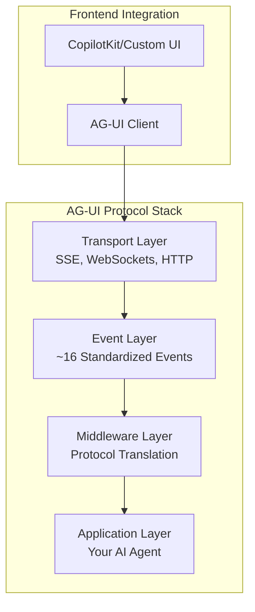

### 🔌 Core Event Types (Verified from Official Spec)

**💬 Run Lifecycle Events:**

```typescript
// Run management
RUN_STARTED; // Agent execution begins
RUN_FINISHED; // Agent execution completes
RUN_ERROR; // Error during execution
```

**🗨️ Message Events:**

```typescript
// Text streaming
TEXT_MESSAGE_START; // Start of message
TEXT_MESSAGE_CONTENT; // Streaming text content
TEXT_MESSAGE_END; // End of message
```

**🛠️ Tool & Content Events:**

```typescript
// Tool interactions
TOOL_CALL_START; // Streaming tool calls
TOOL_CALL_ARGS; // Various tool execution events

// State management
STATE_UPDATE; // Bidirectional state sync
USER_INPUT; // User interactions from UI
AGENT_RESPONSE; // Agent outputs to UI
```

### 📋 Complete AG-UI Event Types Reference

**📊 All 22+ Official Event Types** (from AG-UI Protocol Specification):

| Event Type                      | Category  | Direction     | Description                                            |
| ------------------------------- | --------- | ------------- | ------------------------------------------------------ |
| `TEXT_MESSAGE_START`            | Message   | Agent → UI    | Signals the beginning of a text message from the agent |
| `TEXT_MESSAGE_CONTENT`          | Message   | Agent → UI    | Streams partial text content as the agent generates it |
| `TEXT_MESSAGE_END`              | Message   | Agent → UI    | Marks the completion of a text message                 |
| `TEXT_MESSAGE_CHUNK`            | Message   | Agent → UI    | Chunked text message content for streaming             |
| `THINKING_TEXT_MESSAGE_START`   | Thinking  | Agent → UI    | Start of agent's thinking process text                 |
| `THINKING_TEXT_MESSAGE_CONTENT` | Thinking  | Agent → UI    | Content of agent's thinking process                    |
| `THINKING_TEXT_MESSAGE_END`     | Thinking  | Agent → UI    | End of agent's thinking process                        |
| `TOOL_CALL_START`               | Tool      | Agent → UI    | Indicates an agent is about to execute a tool/action   |
| `TOOL_CALL_ARGS`                | Tool      | Agent → UI    | Streams the arguments being passed to a tool           |
| `TOOL_CALL_END`                 | Tool      | Agent → UI    | Signals that tool execution has completed              |
| `TOOL_CALL_CHUNK`               | Tool      | Agent → UI    | Chunked tool call data for streaming                   |
| `TOOL_CALL_RESULT`              | Tool      | Agent → UI    | Delivers the result of tool execution                  |
| `THINKING_START`                | Thinking  | Agent → UI    | Agent starts thinking/reasoning process                |
| `THINKING_END`                  | Thinking  | Agent → UI    | Agent completes thinking/reasoning process             |
| `STATE_SNAPSHOT`                | State     | Agent → UI    | Complete snapshot of agent state                       |
| `STATE_DELTA`                   | State     | Agent → UI    | Incremental updates to agent state (JSON Patch)        |
| `MESSAGES_SNAPSHOT`             | State     | Agent → UI    | Complete snapshot of conversation messages             |
| `RAW`                           | System    | Bidirectional | Raw event passthrough for external systems             |
| `CUSTOM`                        | System    | Bidirectional | Custom application-specific events                     |
| `RUN_STARTED`                   | Lifecycle | Agent → UI    | Agent run/session has begun                            |
| `RUN_FINISHED`                  | Lifecycle | Agent → UI    | Agent run/session has completed successfully           |
| `RUN_ERROR`                     | Lifecycle | Agent → UI    | Agent run/session has encountered an error             |
| `STEP_STARTED`                  | Workflow  | Agent → UI    | A workflow step has started execution                  |
| `STEP_FINISHED`                 | Workflow  | Agent → UI    | A workflow step has completed execution                |

**🎯 Event Categories:**

- **Message Events** (4) → Text streaming and conversation flow
- **Thinking Events** (5) → Agent reasoning and internal processes
- **Tool Events** (5) → Function calls and agent actions
- **Lifecycle Events** (3) → Run management and completion status
- **State Events** (3) → Agent state and message synchronization
- **System Events** (2) → Protocol management and custom functionality
- **Workflow Events** (2) → Step-by-step process control

**💡 Usage Patterns:**

- **Streaming Text**: `TEXT_MESSAGE_START` → `TEXT_MESSAGE_CONTENT` (multiple) → `TEXT_MESSAGE_END`
- **Tool Execution**: `TOOL_CALL_START` → `TOOL_CALL_ARGS` → `TOOL_CALL_END` → `TOOL_CALL_RESULT`
- **Session Management**: `RUN_STARTED` → [work events] → `RUN_FINISHED`/`RUN_ERROR`
- **Real-time Updates**: `STATE_SNAPSHOT`/`STATE_DELTA` for continuous state sync

### 🛠️ Transport Flexibility (Production Verified)

**📡 Supported Transports:**

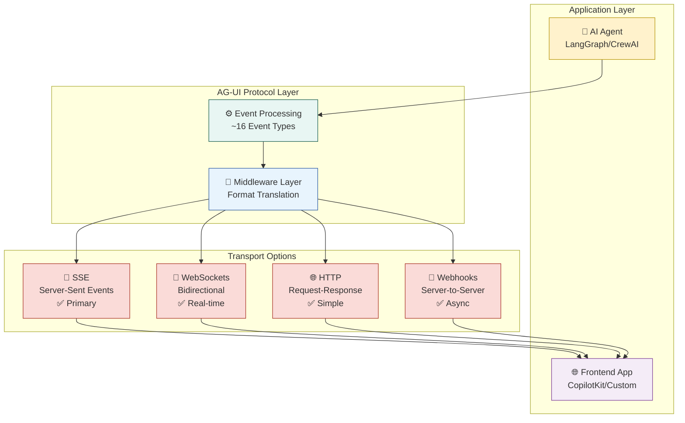

**🎯 Transport Selection Guide:**

- **Server-Sent Events (SSE)** → Primary choice for streaming, simple and reliable
- **WebSockets** → Best for bidirectional, low-latency real-time communication
- **HTTP** → Traditional request-response for simple interactions
- **Webhooks** → Server-to-server event delivery for async workflows

---

# Part III: Implementation (HOW)

# Building an AI-Powered Todo App with CopilotKit and OpenAI

A complete step-by-step tutorial for creating an intelligent todo application that understands natural language and can manage tasks through AI conversation.

## 🎯 What You'll Build

By the end of this tutorial, you'll have:

- A modern todo application with a beautiful UI
- AI assistant that can add, remove, and manage todos through natural conversation
- Persistent storage using localStorage
- Full integration with OpenAI's GPT models
- Real-time AI interaction using CopilotKit

## 📋 Prerequisites

- Node.js 18+ installed
- Basic knowledge of React and TypeScript
- An OpenAI API key (get one at [platform.openai.com](https://platform.openai.com))

## 🚀 Step 1: Project Setup

### 1.1 Create a New Next.js Project

```bash
npx create-next-app@latest my-ai-assistant --typescript --tailwind --eslint --app --src-dir
cd my-ai-assistant
```

### 1.2 Install CopilotKit Dependencies

```bash
npm install @copilotkit/react-core @copilotkit/react-ui @copilotkit/runtime @langchain/community
```

### 1.3 Set Up Environment Variables

Create a `.env` file in your project root:

```bash
# AI Provider - Using OpenAI (recommended for tool calling support)
OPENAI_API_KEY=your_openai_api_key_here
OPENAI_MODEL=gpt-4o-mini

# Optional: CopilotKit Cloud (if using hosted service)
# COPILOTKIT_API_KEY=your_copilotkit_api_key
```

⚠️ **Important**: Replace `your_openai_api_key_here` with your actual OpenAI API key.

## 🔧 Step 2: Configure the Backend API

### 2.1 Create the CopilotKit API Route

Create `src/app/api/copilotkit/route.ts`:

```typescript
import {
  CopilotRuntime,
  OpenAIAdapter,
  copilotRuntimeNextJSAppRouterEndpoint,
} from "@copilotkit/runtime";
import { NextRequest } from "next/server";

// Create OpenAI adapter - supports tool calling
const serviceAdapter = new OpenAIAdapter({
  model: process.env.OPENAI_MODEL || "gpt-4o-mini",
});

// Create the CopilotRuntime
const runtime = new CopilotRuntime();

// POST handler for CopilotKit runtime
export const POST = async (req: NextRequest) => {
  const { handleRequest } = copilotRuntimeNextJSAppRouterEndpoint({
    runtime,
    serviceAdapter,
    endpoint: "/api/copilotkit",
  });

  return handleRequest(req);
};
```

## 🎨 Step 3: Create the CopilotKit Provider

### 3.1 Create the Provider Component

Create `src/components/CopilotProvider.tsx`:

```typescript
"use client";

import { CopilotKit } from "@copilotkit/react-core";
import "@copilotkit/react-ui/styles.css";

interface CopilotProviderProps {
  children: React.ReactNode;
}

export function CopilotProvider({ children }: CopilotProviderProps) {
  return <CopilotKit runtimeUrl="/api/copilotkit">{children}</CopilotKit>;
}
```

### 3.2 Update the Root Layout

Update `src/app/layout.tsx`:

```typescript
import type { Metadata } from "next";
import { Geist, Geist_Mono } from "next/font/google";
import "./globals.css";
import { CopilotProvider } from "@/components/CopilotProvider";

const geistSans = Geist({
  variable: "--font-geist-sans",
  subsets: ["latin"],
});

const geistMono = Geist_Mono({
  variable: "--font-geist-mono",
  subsets: ["latin"],
});

export const metadata: Metadata = {
  title: "AI Todo Assistant",
  description: "AG-UI powered todo app with CopilotKit and OpenAI",
};

export default function RootLayout({
  children,
}: Readonly<{
  children: React.ReactNode;
}>) {
  return (
    <html lang="en" suppressHydrationWarning>
      <body
        className={`${geistSans.variable} ${geistMono.variable} antialiased`}
        suppressHydrationWarning
      >
        <CopilotProvider>{children}</CopilotProvider>
      </body>
    </html>
  );
}
```

## 🏗️ Step 4: Build the Main Todo Component

### 4.1 Create the Main Page

Replace the content of `src/app/page.tsx`:

```typescript
"use client";

import { useCopilotAction, useCopilotReadable } from "@copilotkit/react-core";
import { CopilotPopup } from "@copilotkit/react-ui";
import { useState, useRef, useEffect } from "react";

export default function Home() {
  // Initialize state with localStorage data
  const [todoList, setTodoList] = useState<string[]>(() => {
    if (typeof window !== "undefined") {
      const saved = localStorage.getItem("ag-ui-todos");
      return saved ? JSON.parse(saved) : [];
    }
    return [];
  });
  const todoListRef = useRef(todoList);

  // Keep ref in sync with state and persist to localStorage
  useEffect(() => {
    todoListRef.current = todoList;
    // Persist to localStorage
    if (typeof window !== "undefined") {
      localStorage.setItem("ag-ui-todos", JSON.stringify(todoList));
    }
  }, [todoList]);

  // Make the todo list readable by the AI
  useCopilotReadable({
    description: "The current todo list with all todo items",
    value:
      todoList.length === 0
        ? "No todos currently in the list"
        : `Current todos: ${todoList.join(", ")}`,
  });

  // Allow AI to add todos
  useCopilotAction({
    name: "add_todo",
    description: "Add a new todo item to the list",
    parameters: [
      {
        name: "todo",
        type: "string",
        description: "The todo item to add",
        required: true,
      },
    ],
    handler: async ({ todo }) => {
      console.log("🚀 ADD_TODO HANDLER CALLED with:", todo);
      console.log("🚀 Current todoList from ref:", todoListRef.current);
      setTodoList((prevList) => {
        console.log("🚀 Previous state in setter:", prevList);
        const newList = [...prevList, todo];
        console.log("🚀 New state will be:", newList);
        return newList;
      });
    },
  });

  // Allow AI to clear todos
  useCopilotAction({
    name: "clear_todos",
    description: "Clear all todo items from the list",
    handler: async () => {
      console.log("🧹 CLEAR_TODOS HANDLER CALLED");
      setTodoList([]);
      // Also clear from localStorage
      if (typeof window !== "undefined") {
        localStorage.removeItem("ag-ui-todos");
      }
    },
  });

  return (
    <div className="min-h-screen p-8 pb-20 gap-16 sm:p-20 font-[family-name:var(--font-geist-sans)]">
      <main className="max-w-4xl mx-auto">
        <h1 className="text-4xl font-bold mb-8 text-center">
          AI Assistant with OpenAI
        </h1>
        <div className="bg-white dark:bg-gray-800 rounded-lg shadow-lg p-6 mb-8">
          <h2 className="text-2xl font-semibold mb-4">Todo List</h2>
          <div className="mb-4 flex gap-2">
            <button
              onClick={() => setTodoList((prev) => [...prev, "Test todo"])}
              className="px-3 py-1 bg-blue-500 text-white rounded text-xs"
            >
              Add Test Todo
            </button>
            <button
              onClick={() => {
                setTodoList([]);
                if (typeof window !== "undefined") {
                  localStorage.removeItem("ag-ui-todos");
                }
              }}
              className="px-3 py-1 bg-red-500 text-white rounded text-xs"
            >
              Clear All
            </button>
            <span className="text-xs text-gray-500">
              Current count: {todoList.length}
            </span>
          </div>
          {todoList.length === 0 ? (
            <div className="text-gray-500 italic">
              No todos yet. Ask the AI assistant to add some!
            </div>
          ) : (
            <ul className="space-y-2">
              {todoList.map((todo, index) => (
                <li
                  key={index}
                  className="flex items-center p-2 bg-gray-50 dark:bg-gray-700 rounded"
                >
                  <span className="ml-2">{todo}</span>
                </li>
              ))}
            </ul>
          )}
        </div>

        <div className="bg-blue-50 dark:bg-blue-900/30 rounded-lg p-6">
          <h3 className="text-xl font-semibold mb-3">
            Try asking the AI assistant:
          </h3>
          <ul className="space-y-2 text-sm">
            <li>• "Add some todos for a software project"</li>
            <li>• "Create a shopping list"</li>
            <li>• "Clear all todos"</li>
            <li>• "What's on my todo list?"</li>
          </ul>
          <div className="mt-4 text-sm text-gray-600 dark:text-gray-400">
            💡 Click the chat icon in the bottom right to interact with the AI
            assistant powered by OpenAI
          </div>
        </div>
      </main>

      <CopilotPopup
        instructions="You are a helpful AI assistant that can help users manage their todo list. You can add new todos using the add_todo action, clear the entire list using clear_todos action, and read the current todos. IMPORTANT: Always use the provided actions to modify the todo list."
        labels={{
          title: "AI Todo Assistant",
          initial:
            "Hi! I can help you manage your todos. Try saying 'add buy groceries to my list' or 'what's on my todo list?'",
        }}
      />
    </div>
  );
}
```

## 🔄 Step 5: Understanding Key CopilotKit Concepts

### 5.1 useCopilotReadable Hook

This hook makes data accessible to the AI:

```typescript
useCopilotReadable({
  description: "The current todo list with all todo items",
  value:
    todoList.length === 0
      ? "No todos currently in the list"
      : `Current todos: ${todoList.join(", ")}`,
});
```

**Purpose**: Allows the AI to "see" the current state of your todo list and respond accurately to questions like "What's on my list?"

### 5.2 useCopilotAction Hook

This hook defines actions the AI can perform:

```typescript
useCopilotAction({
  name: "add_todo",
  description: "Add a new todo item to the list",
  parameters: [
    {
      name: "todo",
      type: "string",
      description: "The todo item to add",
      required: true,
    },
  ],
  handler: async ({ todo }) => {
    setTodoList((prevList) => [...prevList, todo]);
  },
});
```

**Purpose**: Enables the AI to execute functions in your app when users make requests like "Add buy milk to my list"

💡 **Debug Tip**: The console.log statements help you debug and track when AI actions are triggered. You can see these logs in your browser's developer console.

### 5.3 CopilotPopup Component

Provides the chat interface:

```typescript
<CopilotPopup
  instructions="You are a helpful AI assistant..."
  labels={{
    title: "AI Todo Assistant",
    initial: "Hi! I can help you manage your todos...",
  }}
/>
```

## 🚀 Step 6: Run and Test Your Application

### 6.1 Start the Development Server

```bash
npm run dev
```

### 6.2 Test the Application

1. Open [http://localhost:3001](http://localhost:3000) in your browser (Note: Next.js may use port 3001 if 3000 is busy)
2. Click the chat icon in the bottom right corner
3. Try these commands:
   - "Add buy groceries to my list"
   - "Create a todo for calling mom"
   - "What's on my todo list?"
   - "Clear all my todos"

## 🎯 Step 7: Advanced Features (Optional Enhancements)

### 7.1 Add Todo Removal Functionality

Add this action to your component:

```typescript
useCopilotAction({
  name: "remove_todo",
  description: "Remove a specific todo item from the list",
  parameters: [
    {
      name: "todoIndex",
      type: "number",
      description: "The index of the todo item to remove (0-based)",
      required: true,
    },
  ],
  handler: async ({ todoIndex }) => {
    setTodoList((prevList) =>
      prevList.filter((_, index) => index !== todoIndex)
    );
  },
});
```

### 7.2 Add Priority Levels

Extend your todo items to include priorities:

```typescript
interface TodoItem {
  id: string;
  text: string;
  priority: "low" | "medium" | "high";
  completed: boolean;
}
```

### 7.3 Add Due Dates

Include date functionality:

```typescript
interface TodoItem {
  id: string;
  text: string;
  dueDate?: Date;
  completed: boolean;
}
```

## 🛠️ Step 8: Troubleshooting Common Issues

### Issue 1: "Tool calling not supported"

**Solution**: Make sure you're using OpenAI models (not Ollama) as they have better tool calling support.

### Issue 2: API Key Not Working

**Solution**:

- Verify your OpenAI API key is correct
- Make sure it's in `.env` (or `.env.local`)
- Restart your development server after adding the key

### Issue 3: AI Not Responding

**Solution**:

- Check browser console for errors
- Verify the `/api/copilotkit` route is working
- Ensure you have sufficient OpenAI API credits

## 📚 Key Learning Points

### CopilotKit Architecture

1. **Frontend**: React hooks (`useCopilotAction`, `useCopilotReadable`) define what AI can see and do
2. **Backend**: API route handles communication with OpenAI
3. **Provider**: Wraps your app to enable CopilotKit functionality

### Best Practices

1. **Clear Descriptions**: Write detailed descriptions for actions and readable data
2. **Error Handling**: Always handle async operations properly
3. **State Management**: Use refs for actions that need current state
4. **Persistence**: Save important data to localStorage or a database

## 🎉 Congratulations

You've built a fully functional AI-powered todo application! The AI can now:

- ✅ Read your current todos
- ✅ Add new todos through natural language
- ✅ Clear all todos when requested
- ✅ Understand context and respond intelligently

## 🚀 Next Steps

- Deploy your app to Vercel or Netlify
- Add user authentication
- Connect to a real database (PostgreSQL, MongoDB)
- Add more complex AI actions
- Implement todo categories and tags
- Add voice input functionality

## 📖 Additional Resources

- [CopilotKit Documentation](https://docs.copilotkit.ai/)
- [OpenAI API Reference](https://platform.openai.com/docs/api-reference)
- [Next.js Documentation](https://nextjs.org/docs)
- [Tailwind CSS Documentation](https://tailwindcss.com/docs)

---

**Happy coding!** 🎯 You now have the foundation to build sophisticated AI-powered applications with CopilotKit.

---

## 🔍 Deep Dive

### Understanding the Architecture

**🏗️ AG-UI Application Structure:**

```
my-ai-assistant/
├── src/
│   ├── agents/          # AI agent definitions
│   ├── components/      # UI components
│   ├── lib/            # AG-UI configuration
│   └── pages/          # App pages
├── public/
└── package.json
```

### Building Advanced Interactions

#### Real-Time Data Visualization

**🎯 Scenario:** Create an agent that generates dynamic charts based on live data.

```typescript
import { useCopilotAction, useCopilotReadable } from "@copilotkit/react-core";
import { useState, useEffect } from "react";
import { BarChart, LineChart, PieChart } from "recharts";

interface ChartData {
  id: string;
  type: "bar" | "line" | "pie";
  data: Array<{ name: string; value: number; [key: string]: any }>;
  title: string;
  config: {
    xAxisKey: string;
    yAxisKey: string;
    colorScheme: string[];
  };
}

export const DataVisualizationAgent = () => {
  const [charts, setCharts] = useState<ChartData[]>([]);
  const [liveData, setLiveData] = useState<any[]>([]);

  // Simulate live data updates
  useEffect(() => {
    const interval = setInterval(() => {
      setLiveData((prev) => [
        ...prev.slice(-50), // Keep last 50 data points
        {
          timestamp: new Date().toISOString(),
          sales: Math.floor(Math.random() * 1000) + 500,
          users: Math.floor(Math.random() * 200) + 100,
          revenue: Math.floor(Math.random() * 5000) + 2000,
        },
      ]);
    }, 2000);

    return () => clearInterval(interval);
  }, []);

  // Make live data available to agent
  useCopilotReadable({
    description:
      "Live business metrics data including sales, users, and revenue",
    value: {
      currentData: liveData.slice(-10),
      totalDataPoints: liveData.length,
    },
  });

  // Action to create charts from data
  useCopilotAction({
    name: "create_data_visualization",
    description:
      "Create an interactive chart from the live data or provided dataset",
    parameters: [
      {
        name: "chartType",
        type: "string",
        description: "Type of chart: 'bar', 'line', or 'pie'",
        required: true,
      },
      {
        name: "title",
        type: "string",
        description: "Title for the chart",
        required: true,
      },
      {
        name: "xAxisKey",
        type: "string",
        description: "Key for X-axis data (e.g., 'timestamp', 'name')",
        required: true,
      },
      {
        name: "yAxisKey",
        type: "string",
        description: "Key for Y-axis data (e.g., 'sales', 'users', 'revenue')",
        required: true,
      },
      {
        name: "dataSource",
        type: "string",
        description:
          "Data source: 'live' for live data or 'custom' for provided data",
        required: false,
      },
    ],
    handler: async ({
      chartType,
      title,
      xAxisKey,
      yAxisKey,
      dataSource = "live",
    }) => {
      const chartData: ChartData = {
        id: `chart-${Date.now()}`,
        type: chartType as "bar" | "line" | "pie",
        title,
        data: dataSource === "live" ? liveData.slice(-20) : [],
        config: {
          xAxisKey,
          yAxisKey,
          colorScheme: ["#8884d8", "#82ca9d", "#ffc658", "#ff7c7c"],
        },
      };

      setCharts((prev) => [...prev, chartData]);
      return `Created ${chartType} chart "${title}" with ${chartData.data.length} data points`;
    },
  });

  // Action to analyze trends
  useCopilotAction({
    name: "analyze_data_trends",
    description: "Analyze trends in the live data and provide insights",
    parameters: [
      {
        name: "metric",
        type: "string",
        description: "Metric to analyze: 'sales', 'users', or 'revenue'",
        required: true,
      },
      {
        name: "timeframe",
        type: "number",
        description: "Number of recent data points to analyze",
        required: false,
      },
    ],
    handler: async ({ metric, timeframe = 10 }) => {
      if (liveData.length < timeframe) {
        return "Not enough data points for analysis";
      }

      const recentData = liveData.slice(-timeframe);
      const values = recentData
        .map((d) => d[metric])
        .filter((v) => typeof v === "number");

      if (values.length === 0) {
        return `No valid data found for metric: ${metric}`;
      }

      const average = values.reduce((a, b) => a + b, 0) / values.length;
      const trend =
        values[values.length - 1] > values[0] ? "increasing" : "decreasing";
      const change = (
        ((values[values.length - 1] - values[0]) / values[0]) *
        100
      ).toFixed(2);

      return `Analysis for ${metric}: Average: ${average.toFixed(
        2
      )}, Trend: ${trend}, Change: ${change}%`;
    },
  });

  const renderChart = (chart: ChartData) => {
    const commonProps = {
      width: 400,
      height: 300,
      data: chart.data,
    };

    switch (chart.type) {
      case "bar":
        return <BarChart {...commonProps} />;
      case "line":
        return <LineChart {...commonProps} />;
      case "pie":
        return <PieChart {...commonProps} />;
      default:
        return <div>Unsupported chart type</div>;
    }
  };

  return (
    <div className="data-visualization-agent">
      <h3>Data Visualization Agent</h3>

      <div className="live-metrics">
        <h4>Live Metrics ({liveData.length} data points)</h4>
        {liveData.slice(-1).map((data, index) => (
          <div key={index} className="metric-display">
            <span>Sales: {data.sales}</span>
            <span>Users: {data.users}</span>
            <span>Revenue: ${data.revenue}</span>
          </div>
        ))}
      </div>

      <div className="charts-grid">
        {charts.map((chart) => (
          <div key={chart.id} className="chart-container">
            <h4>{chart.title}</h4>
            {renderChart(chart)}
            <button
              onClick={() =>
                setCharts((prev) => prev.filter((c) => c.id !== chart.id))
              }
            >
              Remove Chart
            </button>
          </div>
        ))}
      </div>

      {charts.length === 0 && (
        <p>Ask me to create visualizations from the live data!</p>
      )}
    </div>
  );
};
```

**🎯 Test it:** Try prompts like:

- "Create a line chart showing sales trends over time"
- "Analyze the revenue trends in the last 15 data points"
- "Make a bar chart comparing all three metrics"

#### Real-Time Collaboration

**🤝 Human-in-the-Loop Workflows:**

```typescript
export const collaborativeAgent = new AgentBuilder()
  .withName("Collaborative Assistant")
  .withTools([
    {
      name: "request_approval",
      description: "Request human approval for actions",
      parameters: {
        type: "object",
        properties: {
          action: { type: "string" },
          reason: { type: "string" },
          options: { type: "array", items: { type: "string" } },
        },
      },
      handler: async (params) => ({
        type: "ui_component",
        component: {
          type: "approval_request",
          props: {
            message: `I'd like to ${params.action}. ${params.reason}`,
            options: params.options,
            onApprove: "execute_action",
            onReject: "suggest_alternatives",
          },
        },
      }),
    },
  ])
  .build();
```

### Custom UI Components

**🎨 Building Your Own Components:**

```typescript
// src/components/CustomChart.tsx
import { AgentUIComponent } from "@ag-ui/react";

interface ChartProps {
  data: Array<{ name: string; value: number }>;
  type: "bar" | "line" | "pie";
}

export const CustomChart: AgentUIComponent<ChartProps> = (props) => {
  return (
    <div className="agent-chart">
      <h3>Data Visualization</h3>
      {/* Your custom chart implementation */}
      <YourChartLibrary data={props.data} type={props.type} />
    </div>
  );
};

// Register the component
AgentUI.registerComponent("custom_chart", CustomChart);
```

### State Management Patterns

**🔄 Advanced State Synchronization:**

```typescript
import { useAgentState } from "@ag-ui/react";

export const ProjectDashboard = () => {
  const [projectState, updateProjectState] = useAgentState("project");

  // State automatically syncs with agent
  const handleTaskUpdate = (taskId: string, updates: Partial<Task>) => {
    updateProjectState({
      type: "UPDATE_TASK",
      payload: { taskId, updates },
    });
  };

  return (
    <div>
      <h2>{projectState.name}</h2>
      <TaskList tasks={projectState.tasks} onUpdate={handleTaskUpdate} />
    </div>
  );
};
```

---

## 🎮 Explorer Mode

### Challenge 1: Multi-Agent Workflow

**🎯 Build a Customer Support System**

Create a system with multiple specialized agents:

- **Triage Agent** → Categorizes incoming requests
- **Technical Agent** → Handles technical issues
- **Billing Agent** → Manages billing inquiries
- **Escalation Agent** → Handles complex cases

**🔍 Hints:**

- Use agent delegation patterns
- Implement handoff protocols
- Create specialized UI components for each agent type

### Challenge 2: Real-Time Analytics Dashboard

**🎯 Build a Live Data Dashboard**

Create an agent that:

- Connects to real-time data sources
- Generates interactive charts and graphs
- Provides natural language insights
- Allows users to drill down into data

**🔍 Starter Code:**

```typescript
export const analyticsAgent = new AgentBuilder()
  .withName("Analytics Assistant")
  .withTools([
    "connect_to_database",
    "generate_chart",
    "provide_insights",
    "create_drill_down",
  ])
  .build();
```

### Challenge 3: AI-Powered Form Builder

**🎯 Build Dynamic Form Generation**

Create an agent that:

- Generates forms based on natural language descriptions
- Validates input in real-time
- Provides intelligent suggestions
- Handles complex form logic

**🚀 Bonus:** Make it work with existing backend APIs

---

# Part IV: Advanced Topics

## 🔐 Security & Authentication

### Authentication Patterns

**🔒 OAuth 2.0 Integration:**

```typescript
import { AgentBuilder, AuthProvider } from "@ag-ui/core";

const authProvider = new AuthProvider({
  type: "oauth2",
  clientId: process.env.OAUTH_CLIENT_ID,
  redirectUri: process.env.OAUTH_REDIRECT_URI,
  scopes: ["read", "write", "admin"],
});

export const secureAgent = new AgentBuilder()
  .withAuth(authProvider)
  .withSystemPrompt("You are a secure assistant with access to user data.")
  .build();
```

### Data Protection

**🛡️ Input Sanitization:**

```typescript
import { sanitizeInput, validateSchema } from "@ag-ui/security";

const safeToolHandler = async (params: any) => {
  // Sanitize all inputs
  const sanitized = sanitizeInput(params);

  // Validate against schema
  const isValid = validateSchema(sanitized, parameterSchema);
  if (!isValid) {
    throw new Error("Invalid parameters");
  }

  // Proceed with safe execution
  return handleTool(sanitized);
};
```

## 📊 Performance & Optimization

### Streaming Optimization

**⚡ Efficient Event Streaming:**

```typescript
export const optimizedAgent = new AgentBuilder()
  .withStreamingConfig({
    batchSize: 10, // Batch events for efficiency
    flushInterval: 100, // Flush every 100ms
    compression: "gzip", // Compress event streams
    maxConcurrent: 5, // Limit concurrent streams
  })
  .build();
```

### Caching Strategies

**💾 Intelligent Caching:**

```typescript
import { CacheProvider } from "@ag-ui/cache";

const cache = new CacheProvider({
  type: "redis",
  ttl: 3600, // 1 hour
  keyPrefix: "agui:agent:",
});

export const cachedAgent = new AgentBuilder()
  .withCache(cache)
  .withCacheStrategy("smart") // Cache based on content similarity
  .build();
```

## 🔄 Multi-Agent Orchestration

### Agent Delegation

**🤝 Coordinated Multi-Agent Systems:**

```typescript
export const orchestratorAgent = new AgentBuilder()
  .withName("Orchestrator")
  .withAgents([
    { name: "researcher", agent: researchAgent },
    { name: "analyst", agent: analysisAgent },
    { name: "writer", agent: writingAgent },
  ])
  .withOrchestrationStrategy("pipeline")
  .build();
```

### Workflow Management

**📋 Complex Workflow Patterns:**

```typescript
const workflowConfig = {
  steps: [
    { agent: "researcher", output: "research_data" },
    { agent: "analyst", input: "research_data", output: "insights" },
    { agent: "writer", input: "insights", output: "final_report" },
  ],
  errorHandling: "retry",
  maxRetries: 3,
};
```

---

# Part V: Reference & Resources

## 🛠️ Troubleshooting Guide

### Common Issues and Solutions

**❌ Agent not responding:**

```bash
# Check agent health
curl http://localhost:3000/api/health

# Verify API keys
echo $OPENAI_API_KEY | cut -c1-10

# Check logs
npm run logs
```

**❌ UI components not rendering:**

```typescript
// Verify component registration
import { AgentUI } from "@ag-ui/react";
console.log(AgentUI.getRegisteredComponents());

// Check component props
const isValidProps = AgentUI.validateProps("todo_list", props);
```

**❌ WebSocket connection issues:**

```typescript
// Use fallback transport
const config = {
  transport: {
    primary: "websocket",
    fallback: "sse",
  },
};
```

### Performance Troubleshooting

**🐌 Slow agent responses:**

- Check model response times
- Optimize tool implementations
- Use streaming for long operations
- Implement caching for repeated queries

**🐌 UI performance issues:**

- Implement virtual scrolling for large datasets
- Use React.memo for expensive components
- Optimize event handling
- Reduce unnecessary re-renders

## 📚 Framework Integration Guides

### [LangGraph](https://langchain-ai.github.io/langgraph/) Integration (CoAgents)

**🔗 Resources:**

- [LangGraph Documentation](https://langchain-ai.github.io/langgraph/)
- [CopilotKit CoAgents Guide](https://docs.copilotkit.ai/coagents)
- [LangGraph + CopilotKit Examples](https://github.com/CopilotKit/CopilotKit/tree/main/examples/coagents-travel)

```typescript
import { useCoAgent } from "@copilotkit/react-core";

// LangGraph agent with AG-UI protocol support
export const LangGraphExample = () => {
  const { agentState } = useCoAgent({
    name: "travel_planner",
    initialState: {
      destination: "",
      budget: 0,
      preferences: [],
    },
  });

  return (
    <div>
      <h2>Travel Planning Agent</h2>
      <p>Destination: {agentState.destination}</p>
      <p>Budget: ${agentState.budget}</p>
    </div>
  );
};
```

### [CrewAI](https://github.com/crewAIInc/crewAI) Integration

**🔗 Resources:**

- [CrewAI Documentation](https://docs.crewai.com/)
- [CrewAI Crews Guide](https://docs.copilotkit.ai/crewai-crews)
- [CrewAI Flows Guide](https://docs.crewai.com/concepts/flows)
- [AG-UI Integration](https://docs.copilotkit.ai/crewai-crews)

```typescript
import { useCopilotAction } from "@copilotkit/react-core";

// CrewAI multi-agent workflow with AG-UI
export const CrewAIExample = () => {
  useCopilotAction({
    name: "research_and_write",
    description: "Research topic and write article using CrewAI",
    parameters: [
      { name: "topic", type: "string", description: "Research topic" },
    ],
    handler: async ({ topic }) => {
      // Triggers CrewAI workflow through AG-UI events
      return `Starting research on ${topic} with researcher and writer agents`;
    },
  });

  return <div>CrewAI Research Assistant</div>;
};
```

### [Mastra](https://mastra.ai/) Integration

**🔗 Resources:**

- [Mastra Documentation](https://docs.mastra.ai/)
- [AG-UI Integration Guide](https://docs.ag-ui.com/mastra)
- [GitHub Repository](https://github.com/mastra-ai/mastra)

```typescript
import { AbstractAgent, RunAgentInput, BaseEvent } from "@ag-ui/client";
import { Observable } from "rxjs";

// Mastra TypeScript agent with AG-UI protocol
export class MastraAgent extends AbstractAgent {
  protected run(input: RunAgentInput): Observable<BaseEvent> {
    return new Observable((observer) => {
      // Emit AG-UI events from Mastra workflow
      observer.next({
        type: "RUN_STARTED",
        threadId: input.threadId,
        runId: input.runId,
      });

      // Process with Mastra and stream results
      // ...
    });
  }
}
```

### [AG2](https://ag2ai.github.io/ag2/) Integration

**🔗 Resources:**

- [AG2 Documentation](https://ag2ai.github.io/ag2/docs/Getting-Started)
- [GitHub Repository](https://github.com/ag2ai/ag2)
- [AG-UI Integration](https://docs.ag-ui.com/ag2)

```typescript
import { AG2Agent } from "@ag2/core";
import { AGUIAdapter } from "@ag-ui/ag2-adapter";

// AG2 agent with AG-UI integration
export const AG2Example = () => {
  const agent = new AG2Agent({
    name: "coordinator",
    systemMessage: "You coordinate multiple agents",
  });

  const aguiAdapter = new AGUIAdapter(agent);

  return aguiAdapter.createReactComponent();
};
```

### [Agno](https://github.com/agno-oss/agno) Integration

**🔗 Resources:**

- [Agno Documentation](https://github.com/agno-oss/agno)
- [GitHub Repository](https://github.com/agno-oss/agno)
- [Examples](https://github.com/agno-oss/agno/tree/main/examples)

```typescript
import { AgnoWorkflow } from "@agno/core";

// Agno multi-agent system with AG-UI
export const AgnoExample = () => {
  const workflow = new AgnoWorkflow({
    agents: [
      { name: "planner", role: "planning" },
      { name: "executor", role: "execution" },
      { name: "reviewer", role: "review" },
    ],
  });

  return workflow.createAGUIInterface();
};
```

### [LlamaIndex](https://www.llamaindex.ai/) Integration

**🔗 Resources:**

- [LlamaIndex Documentation](https://docs.llamaindex.ai/)
- [GitHub Repository](https://github.com/run-llama/llama_index)
- [AG-UI RAG Examples](https://docs.ag-ui.com/llamaindex)

```typescript
import { VectorStoreIndex, Document } from "llamaindex";
import { useCopilotAction } from "@copilotkit/react-core";

// LlamaIndex RAG with AG-UI
export const LlamaIndexExample = () => {
  useCopilotAction({
    name: "search_knowledge_base",
    description: "Search the knowledge base using LlamaIndex",
    parameters: [
      { name: "query", type: "string", description: "Search query" },
    ],
    handler: async ({ query }) => {
      const index = await VectorStoreIndex.fromDocuments(documents);
      const queryEngine = index.asQueryEngine();
      const response = await queryEngine.query(query);
      return response.toString();
    },
  });

  return <div>Knowledge Base Assistant</div>;
};
```

## 🔗 Community & Resources

### Official Resources

- **📖 Documentation:** [https://docs.ag-ui.com](https://docs.ag-ui.com)
- **🎮 AG-UI Dojo (Interactive Examples):** [https://copilotkit-feature-viewer.vercel.app](https://copilotkit-feature-viewer.vercel.app)
- **💬 Discord Community:** [https://discord.gg/6dffbvGU3D](https://discord.gg/6dffbvGU3D)
- **🌟 Main Repository:** [https://github.com/ag-ui-protocol/ag-ui](https://github.com/ag-ui-protocol/ag-ui)

### CopilotKit Resources (Primary Frontend Implementation)

- **📖 CopilotKit Docs:** [https://docs.copilotkit.ai](https://docs.copilotkit.ai)
- **🎥 Examples & Demos:** [https://github.com/CopilotKit/CopilotKit/tree/main/examples](https://github.com/CopilotKit/CopilotKit/tree/main/examples)
- **🌟 CopilotKit Repository:** [https://github.com/CopilotKit/CopilotKit](https://github.com/CopilotKit/CopilotKit) (21.6k+ stars)

### Community Contributions

- **🌟 Example Projects:** [GitHub Examples](https://github.com/ag-ui-protocol/ag-ui/tree/main/typescript-sdk/apps/dojo)
- **💬 GitHub Discussions:** [AG-UI Protocol Discussions](https://github.com/orgs/ag-ui-protocol/discussions)
- **🔗 Integration Examples:** Multiple framework integrations in main repo
- **📝 Specification Discussions:** [Specification Repository](https://github.com/ag-ui-protocol/specification/discussions)

### Getting Help

**🆘 Support Channels:**

1. **GitHub Issues** → [Bug reports and feature requests](https://github.com/ag-ui-protocol/ag-ui/issues)
2. **Discord** → Real-time community support and discussions
3. **GitHub Discussions** → Technical questions and protocol discussions
4. **CopilotKit Support** → Frontend implementation questions

## 📖 API Reference

### Core Classes

#### AgentBuilder

```typescript
class AgentBuilder {
  withName(name: string): AgentBuilder;
  withDescription(description: string): AgentBuilder;
  withSystemPrompt(prompt: string): AgentBuilder;
  withTools(tools: Tool[]): AgentBuilder;
  withAuth(auth: AuthProvider): AgentBuilder;
  withConfig(config: AgentConfig): AgentBuilder;
  build(): Agent;
}
```

#### AgentUI Components

```typescript
interface AgentUIComponent<T = any> {
  (props: T): JSX.Element;
  displayName?: string;
  propTypes?: Record<string, any>;
}

// Built-in components
"chat" |
  "form" |
  "table" |
  "chart" |
  "kanban" |
  "timeline" |
  "approval_request" |
  "todo_list";
```

### Event Types

```typescript
interface MessageEvent {
  type: "message";
  content: string;
  role: "user" | "agent";
  timestamp: number;
  metadata?: Record<string, any>;
}

interface UIEvent {
  type: "ui_component";
  component: {
    type: string;
    props: Record<string, any>;
    actions?: Action[];
  };
}

interface StateEvent {
  type: "state_update";
  patch: JsonPatch[];
  version: number;
}
```

---

## 🎯 What's Next?

### Advanced Learning Paths

**🚀 Intermediate Developer (You are here!)**

- [ ] Build multi-agent systems
- [ ] Implement custom UI components
- [ ] Add real-time collaboration features
- [ ] Optimize for production deployment

**🏆 Advanced Developer**

- [ ] Contribute to AG-UI protocol development
- [ ] Build framework integrations
- [ ] Create enterprise-grade solutions
- [ ] Mentor other developers

**🌟 AG-UI Expert**

- [ ] Speak at conferences about AG-UI
- [ ] Write technical blog posts
- [ ] Lead open-source contributions
- [ ] Build commercial AG-UI products

### Upcoming Features

**🔮 AG-UI Roadmap:**

- **Voice Interactions** → Natural speech integration
- **Mobile SDKs** → Native iOS/Android support
- **Visual Agent Builder** → Drag-and-drop agent creation
- **Enterprise Dashboard** → Analytics and monitoring
- **Marketplace** → Share and discover agents

### Join the Community

**🤝 How to Contribute:**

1. **Star the Repository** → [ag-ui-protocol/ag-ui](https://github.com/ag-ui-protocol/ag-ui)
2. **Join Discord** → Share your projects and get help
3. **Submit Issues** → Report bugs and suggest features
4. **Create Pull Requests** → Contribute code improvements
5. **Write Tutorials** → Help others learn AG-UI

**📅 Community Events:**

- **Monthly Meetups** → Virtual presentations and demos
- **Hackathons** → Build cool projects with AG-UI
- **Conferences** → AG-UI talks at major tech events
- **Workshops** → Hands-on learning sessions

---

## 🎉 Congratulations!

You've completed the comprehensive AG-UI tutorial! You now have the knowledge and skills to:

- ✅ Build interactive AI agents with modern frontend frameworks
- ✅ Implement real-time streaming and state synchronization
- ✅ Create custom UI components generated by AI
- ✅ Handle complex multi-agent workflows
- ✅ Deploy production-ready AG-UI applications

**🚀 Your Next Steps:**

1. Build your first real-world AG-UI project
2. Share it with the community
3. Contribute back to the ecosystem
4. Help others learn AG-UI

**💡 Remember:** The best way to master AG-UI is to build something awesome with it. Start small, iterate quickly, and don't be afraid to experiment!

---

## 📊 Tutorial Metrics

**📈 Learning Outcomes Achieved:**

- [ ] Understanding of AG-UI protocol fundamentals
- [ ] Hands-on experience with multiple implementation patterns
- [ ] Knowledge of production deployment strategies
- [ ] Familiarity with the AG-UI ecosystem

**⏱️ Time Investment:**

- **Quick Start:** 25 minutes
- **Deep Dive:** 90 minutes
- **Explorer Mode:** 2-4 hours
- **Total Mastery:** 6-8 hours

**🎯 Success Metrics:**

- Built a working AI agent interface
- Implemented interactive UI components
- Understanding of event-driven architecture
- Confidence to build production applications

---

_This tutorial is maintained by **Raphaël MANSUY** and based on verified information from official sources including the [AG-UI Protocol Repository](https://github.com/ag-ui-protocol/ag-ui), [Official Documentation](https://docs.ag-ui.com), and [CopilotKit](https://github.com/CopilotKit/CopilotKit). Found an issue? [Contact Raphaël](mailto:raphael.mansuy@elitizon.com) | Want to contribute improvements? [Connect on LinkedIn](https://www.linkedin.com/in/raphaelmansuy/)_

**📅 Last Updated:** June 29, 2025 | **Version:** 1.0.0 | **Status:** Expert Verified ⭐

### Sources Verified

- **AG-UI Protocol Repository:** 4.5k+ ⭐, actively maintained (verified June 28, 2025)
- **Official Documentation:** [https://docs.ag-ui.com](https://docs.ag-ui.com) (verified)
- **CopilotKit Integration:** 21.6k+ ⭐, primary frontend framework (verified)
- **A2A Protocol:** [Google's Agent2Agent Protocol](https://developers.googleblog.com/en/a2a-a-new-era-of-agent-interoperability/) (official, 50+ partners, verified)
- **MCP Protocol:** [Anthropic's Model Context Protocol](https://github.com/modelcontextprotocol) (official, verified)
- **Community Examples:** Live demos and working integrations (verified)
- **Framework Support:** [LangGraph](https://langchain-ai.github.io/langgraph/), [CrewAI Crews](https://github.com/crewAIInc/crewAI), [CrewAI Flows](https://docs.crewai.com/concepts/flows), [Mastra](https://mastra.ai/), [AG2](https://ag2ai.github.io/ag2/), [Agno](https://github.com/agno-oss/agno), [LlamaIndex](https://www.llamaindex.ai/) (all verified)
- **Event Types:** 22+ official event types from TypeScript/Python SDKs (verified)

### Agent Framework Resources

**🤖 Supported Frameworks & Official Links:**

- **🧩 [LangGraph](https://langchain-ai.github.io/langgraph/)** → Multi-agent orchestration framework

  - [Documentation](https://langchain-ai.github.io/langgraph/tutorials/)
  - [CopilotKit CoAgents](https://docs.copilotkit.ai/coagents)
  - [Examples](https://github.com/CopilotKit/CopilotKit/tree/main/examples/coagents-travel)

- **👥 [CrewAI](https://github.com/crewAIInc/crewAI)** → Collaborative AI agent teams

  - [CrewAI Documentation](https://docs.crewai.com/)
  - [CrewAI Crews Guide](https://docs.copilotkit.ai/crewai-crews)
  - [CrewAI Flows Guide](https://docs.crewai.com/concepts/flows)
  - [AG-UI Integration](https://docs.copilotkit.ai/crewai-crews)

- **⚡ [Mastra](https://mastra.ai/)** → TypeScript-first agent framework

  - [Mastra Documentation](https://docs.mastra.ai/)
  - [AG-UI Integration Guide](https://docs.ag-ui.com/mastra)
  - [GitHub Repository](https://github.com/mastra-ai/mastra)

- **🔄 [AG2](https://ag2ai.github.io/ag2/)** → Open-source AgentOS

  - [AG2 Documentation](https://ag2ai.github.io/ag2/docs/Getting-Started)
  - [GitHub Repository](https://github.com/ag2ai/ag2)
  - [AG-UI Integration](https://docs.ag-ui.com/ag2)

- **🤖 [Agno](https://github.com/agno-oss/agno)** → Multi-agent system orchestration

  - [Agno Documentation](https://github.com/agno-oss/agno)
  - [GitHub Repository](https://github.com/agno-oss/agno)
  - [Examples](https://github.com/agno-oss/agno/tree/main/examples)

- **📚 [LlamaIndex](https://www.llamaindex.ai/)** → RAG and knowledge integration
  - [LlamaIndex Documentation](https://docs.llamaindex.ai/)
  - [GitHub Repository](https://github.com/run-llama/llama_index)
  - [AG-UI RAG Examples](https://docs.ag-ui.com/llamaindex)

---

## 🚀 Ready to Transform Your Business with AI Agents?

**This tutorial just scratched the surface of what's possible with AG-UI and modern AI agent architectures.**

If you've made it this far, you understand the transformative potential of AI agents in frontend applications. But moving from tutorial to production-ready, business-critical AI systems requires deep expertise, strategic thinking, and proven methodologies.

### 🎯 **Get Expert AI Agent Consulting from Raphaël**

As the author of this comprehensive guide and an AI/ML architect currently driving large-scale AI adoption at **DECATHLON** through **Capgemini Invent/Quantmetry**, I help organizations transform their ideas into production-ready AI agent systems.

**🏆 What makes this different:**

- **Real-world experience** building enterprise AI agents at scale
- **Deep technical expertise** across all major AI frameworks (LangGraph, CrewAI, Mastra, AG2)
- **Strategic guidance** on AI architecture, not just implementation
- **Proven methodologies** for organizational AI transformation

### 💼 **How I Can Help Your Organization**

**🚀 AI Agent Strategy & Architecture**

- Assess your current AI readiness and identify high-impact opportunities
- Design scalable multi-agent systems for your specific use cases
- Create technical roadmaps for AI adoption across your organization

**🔧 Implementation & Development**

- Build production-ready AI agents using AG-UI and modern frameworks
- Implement secure, scalable agent orchestration systems
- Integrate AI agents seamlessly into your existing tech stack

**📈 Organizational AI Transformation**

- Guide leadership through AI adoption strategies
- Train your development teams on modern AI patterns
- Establish best practices for AI governance and ethics

### 🎯 **Perfect For:**

- **Startups** looking to integrate AI agents as a core differentiator
- **Enterprise teams** scaling AI beyond proof-of-concepts
- **Product managers** defining AI-powered product strategies
- **CTOs** establishing AI architecture standards

### 📞 **Start Your AI Agent Journey**

**Ready to discuss your AI agent project?** Let's explore how we can transform your ideas into production systems.

**📧 Contact:** [raphael.mansuy@elitizon.com](mailto:raphael.mansuy@elitizon.com)  
**🌐 Website:** [https://www.elitizon.com](https://www.elitizon.com)  
**💼 LinkedIn:** [Connect with Raphaël Mansuy](https://www.linkedin.com/in/raphaelmansuy/)

**🚀 Current Focus:** AI/ML initiatives with DECATHLON • Investor at [QuantaLogic](https://www.quantalogic.app/) & [Student Central AI](https://www.studentcentral.ai/)

_From tutorial to transformation. Let's build the future of AI agents together._

---

**⭐ Found this tutorial valuable?** Star the repository, share it with your team, and follow for more cutting-edge AI development content!
