# The Architecture of Autonomous AI: Essential Design Patterns for Agentic Systems with Context Engineering

---

The landscape of artificial intelligence is transforming rapidly as we move beyond static models toward dynamic, autonomous agents. These agentic AI systems represent a fundamental shift in how we conceptualize and deploy AI—from passive responders to active problem-solvers that can reason, plan, and execute complex tasks independently. This guide explores ten core design patterns that form the backbone of modern agentic AI architecture, with special focus on the critical aspect of context engineering that makes these patterns effective.

## What Makes AI "Agentic"?

Before diving into patterns, it's crucial to understand what distinguishes agentic AI from traditional models. Agentic systems possess three key characteristics:

1. **Autonomy**: The ability to make decisions and take actions without constant human intervention
2. **Goal-oriented behavior**: Working toward specific objectives through planning and execution
3. **Environmental interaction**: Engaging with tools, APIs, and other systems to accomplish tasks


These characteristics enable AI agents to tackle real-world problems that require more than simple text generation.

---

**Author**: Raphaël MANSUY  
**Website**: [https://www.elitizon.com](https://www.elitizon.com)  
**LinkedIn**: [https://www.linkedin.com/in/raphaelmansuy/](https://www.linkedin.com/in/raphaelmansuy/)  
**Investor at**: [QuantaLogic](https://www.quantalogic.app/) • [Student Central AI](https://www.studentcentral.ai/)  
**Working on AI/ML initiatives with DECATHLON as part of Capgemini Invent/Quantmetry (Contract), driving large-scale AI adoption and organizational transformation.**
**Date**: July 2025

---

## The Critical Role of Context Engineering

Context engineering—the art and science of managing, structuring, and flowing information through AI systems—forms the foundation of effective agentic patterns. Unlike simple chatbots that process isolated messages, agentic systems must maintain complex state, track multi-step processes, and coordinate information across multiple components. How context flows through each pattern determines its effectiveness and capabilities.

## Core Agentic Design Patterns

### 1. The Introspection Pattern

At its heart, the Introspection Pattern embodies the principle of continuous self-improvement through critical analysis. This pattern enables AI agents to examine their own outputs, identify weaknesses, and iteratively enhance their responses.


**Context Engineering Specifics:**

The Introspection Pattern employs a sophisticated accumulative context strategy where each iteration builds upon previous attempts. The context structure typically includes:

```
Context Structure:
{
  "original_query": "User's initial request",
  "iteration_history": [
    {
      "iteration": 1,
      "output": "First attempt",
      "critique": "Identified weaknesses",
      "improvements": ["List of planned improvements"]
    }
  ],
  "evaluation_criteria": {
    "accuracy": "Factual correctness standards",
    "completeness": "Coverage requirements",
    "clarity": "Communication effectiveness"
  },
  "quality_threshold": "Minimum acceptable score"
}
```

**Context Flow:** The context flows in a spiral pattern, with each iteration adding layers of refinement. Critical context engineering techniques include:

- **Selective History Retention**: Only keeping relevant critique points to avoid context bloat
- **Progressive Summarization**: Condensing earlier iterations while preserving key insights
- **Criteria Evolution**: Dynamically adjusting evaluation criteria based on discovered requirements

**Context Flow Architecture:**


**Practical applications:**

- Automated code optimization where the agent reviews and refines its own code
- Content creation with built-in quality control
- Scientific hypothesis generation and validation

### 2. The Augmentation Pattern

The Augmentation Pattern transforms limited language models into powerful agents by granting them access to external capabilities. Rather than being confined to their training data, agents can dynamically leverage tools to extend their functionality.

```mermaid
flowchart TD
    A[Task Analysis] --> B{Capability Check}
    B -->|Internal| C[Use Model Knowledge]
    B -->|External| D[Select Tool]
    D --> E[Configure Parameters]
    E --> F[Execute Tool]
    F --> G[Process Output]
    G --> H[Integrate Results]
    C --> H
    H --> I[Complete Task]

    subgraph Toolbox ["🛠️ External Tools"]
        J[Computational Tools]
        K[Information Retrieval]
        L[System Integration]
        M[Data Processing]
    end

    D -.-> Toolbox

    style A fill:#E3F2FD,stroke:#1976D2,stroke-width:2px,color:#0D47A1
    style B fill:#F3E5F5,stroke:#7B1FA2,stroke-width:2px,color:#4A148C
    style C fill:#FFFDE7,stroke:#F9A825,stroke-width:2px,color:#F57F17
    style D fill:#FFF3E0,stroke:#F57C00,stroke-width:2px,color:#E65100
    style E fill:#FFF3E0,stroke:#F57C00,stroke-width:2px,color:#E65100
    style F fill:#FFF3E0,stroke:#F57C00,stroke-width:2px,color:#E65100
    style G fill:#FFFDE7,stroke:#F9A825,stroke-width:2px,color:#F57F17
    style H fill:#E8F5E8,stroke:#388E3C,stroke-width:2px,color:#1B5E20
    style I fill:#E8F5E8,stroke:#4CAF50,stroke-width:3px,color:#1B5E20
    style Toolbox fill:#F5F5F5,stroke:#666,stroke-width:2px,color:#333
    style J fill:#E1F5FE,stroke:#0277BD,stroke-width:1px,color:#01579B
    style K fill:#E1F5FE,stroke:#0277BD,stroke-width:1px,color:#01579B
    style L fill:#E1F5FE,stroke:#0277BD,stroke-width:1px,color:#01579B
    style M fill:#E1F5FE,stroke:#0277BD,stroke-width:1px,color:#01579B
```

**Context Engineering Specifics:**

The Augmentation Pattern requires dynamic context switching between the main agent context and tool-specific contexts. The context architecture includes:

```
Context Structure:
{
  "main_context": {
    "user_goal": "High-level objective",
    "conversation_history": [],
    "constraints": []
  },
  "tool_contexts": {
    "calculator": {
      "precision_requirements": "decimal_places",
      "operation_history": []
    },
    "web_search": {
      "search_scope": "domains_allowed",
      "result_filtering": "relevance_criteria"
    }
  },
  "integration_context": {
    "tool_outputs": [],
    "synthesis_strategy": "How to combine results"
  }
}
```

**Context Flow:** Context flows through three distinct phases:

1. **Pre-tool Context**: Preparing tool-specific parameters from main context
2. **Tool Execution Context**: Isolated environment for tool operation
3. **Post-tool Context**: Merging tool results back into main conversation

Key context engineering techniques:

- **Context Marshaling**: Converting between agent and tool-specific formats
- **Result Contextualization**: Embedding tool outputs within conversational context
- **Error Context Propagation**: Maintaining context through tool failures

**Context Marshaling Flow:**

```mermaid
flowchart LR
    subgraph Agent_Context ["🤖 Agent Context"]
        AC[Main Conversation] 
        UG[User Goal]
        CH[Chat History]
        CS[Constraints]
    end
    
    subgraph Context_Bridge ["🔄 Context Translation"]
        CM[Context Marshal]
        TP[Tool Parameters]
        RF[Result Formatter]
    end
    
    subgraph Tool_Context ["🛠️ Tool Execution"]
        TE[Tool Environment]
        TO[Tool Output]
        TM[Tool Metadata]
    end
    
    Agent_Context --> CM
    CM --> TP
    TP --> TE
    TE --> TO
    TO --> RF
    TM --> RF
    RF --> Agent_Context

    style AC fill:#E3F2FD,stroke:#1976D2,stroke-width:2px,color:#0D47A1
    style UG fill:#E3F2FD,stroke:#1976D2,stroke-width:1px,color:#0D47A1
    style CH fill:#E3F2FD,stroke:#1976D2,stroke-width:1px,color:#0D47A1
    style CS fill:#E3F2FD,stroke:#1976D2,stroke-width:1px,color:#0D47A1
    style CM fill:#FFF3E0,stroke:#F57C00,stroke-width:2px,color:#E65100
    style TP fill:#FFF3E0,stroke:#F57C00,stroke-width:2px,color:#E65100
    style RF fill:#FFF3E0,stroke:#F57C00,stroke-width:2px,color:#E65100
    style TE fill:#E8F5E8,stroke:#388E3C,stroke-width:2px,color:#1B5E20
    style TO fill:#E8F5E8,stroke:#388E3C,stroke-width:1px,color:#1B5E20
    style TM fill:#E8F5E8,stroke:#388E3C,stroke-width:1px,color:#1B5E20
    style Agent_Context fill:#F0F8FF,stroke:#4682B4,stroke-width:2px,color:#2F4F4F
    style Context_Bridge fill:#FFF8DC,stroke:#DAA520,stroke-width:2px,color:#8B4513
    style Tool_Context fill:#F0FFF0,stroke:#228B22,stroke-width:2px,color:#006400
```

**Practical applications:**

- Financial analysis using real-time market data
- Scientific computing with specialized software
- Document processing and manipulation

### 3. The Adaptive Reasoning Pattern (ReAct)

The Adaptive Reasoning Pattern interweaves thinking and doing, creating a dynamic feedback loop between cognition and action. Unlike linear approaches, this pattern allows agents to adjust their strategy based on real-world feedback.


**Thought-Action-Observation Cycle:**

```mermaid
flowchart TD
    subgraph TAO_Cycle ["🔄 ReAct Core Cycle"]
        T[💭 Thought]
        A[⚡ Action]
        O[👁️ Observation]
        
        T --> A
        A --> O
        O --> T
    end
    
    subgraph Context_Flow ["📊 Context Evolution"]
        WM[World Model]
        H[Hypotheses]
        RC[Reasoning Chain]
        
        WM --> H
        H --> RC
        RC --> WM
    end
    
    subgraph External_World ["🌍 Environment"]
        ENV[Environment State]
        FB[Feedback]
        CH[Changes]
    end
    
    T -.-> WM
    A --> ENV
    ENV --> FB
    FB --> O
    O -.-> RC
    RC -.-> H
    ENV --> CH
    CH -.-> O

    style T fill:#FFFDE7,stroke:#F9A825,stroke-width:2px,color:#F57F17
    style A fill:#FFF3E0,stroke:#F57C00,stroke-width:2px,color:#E65100
    style O fill:#E8EAF6,stroke:#3F51B5,stroke-width:2px,color:#1A237E
    style WM fill:#E1F5FE,stroke:#0277BD,stroke-width:2px,color:#01579B
    style H fill:#F3E5F5,stroke:#7B1FA2,stroke-width:2px,color:#4A148C
    style RC fill:#E8F5E8,stroke:#388E3C,stroke-width:2px,color:#1B5E20
    style ENV fill:#FFF8E1,stroke:#FF8F00,stroke-width:2px,color:#E65100
    style FB fill:#FFEBEE,stroke:#D32F2F,stroke-width:2px,color:#B71C1C
    style CH fill:#F1F8E9,stroke:#689F38,stroke-width:2px,color:#33691E
    style TAO_Cycle fill:#F0F8FF,stroke:#4682B4,stroke-width:2px,color:#2F4F4F
    style Context_Flow fill:#F0FFF0,stroke:#228B22,stroke-width:2px,color:#006400
    style External_World fill:#FFF8DC,stroke:#DAA520,stroke-width:2px,color:#8B4513
```

**Context Engineering Specifics:**

ReAct's context engineering centers on maintaining interleaved thought-action-observation chains. The context structure enforces a specific format:

```
Context Structure:
{
  "goal_state": {
    "objective": "What we're trying to achieve",
    "success_criteria": "Measurable outcomes",
    "constraints": "Boundaries and limitations"
  },
  "reasoning_chain": [
    {
      "thought": "Current understanding and hypothesis",
      "action": "Planned intervention",
      "observation": "What actually happened",
      "reflection": "What this means for our goal"
    }
  ],
  "world_model": {
    "assumptions": "What we believe to be true",
    "uncertainties": "What we're unsure about",
    "learned_facts": "Confirmed through observation"
  }
}
```

**Context Flow:** The context follows a cyclical pattern where each observation updates the world model:

1. **Reasoning Context**: Incorporates all previous observations
2. **Action Context**: Focused on specific action parameters
3. **Observation Context**: Captures raw feedback
4. **Integration Context**: Updates world model and planning

Context engineering techniques:

- **Observation Summarization**: Condensing lengthy observations while preserving key information
- **Hypothesis Tracking**: Maintaining multiple competing hypotheses in context
- **Context Windowing**: Keeping only recent N iterations to manage token limits

**Practical applications:**

- Interactive debugging sessions
- Scientific experimentation
- Dynamic customer support

### 4. The Strategic Planning Pattern

The Strategic Planning Pattern enables agents to tackle complex challenges by decomposing them into manageable components. This hierarchical approach mirrors how humans approach large projects.


**Hierarchical Planning Architecture:**

```mermaid
flowchart TD
    subgraph Strategic_Level ["🎯 Strategic Level"]
        SG[Strategic Goal]
        SC[Strategic Constraints]
        SM[Success Metrics]
    end
    
    subgraph Phase_Level ["📋 Phase Level"]
        P1[Phase 1: Foundation]
        P2[Phase 2: Development] 
        P3[Phase 3: Delivery]
        
        P1 --> P2
        P2 --> P3
    end
    
    subgraph Task_Level ["⚙️ Task Level"]
        subgraph P1_Tasks ["Phase 1 Tasks"]
            T1A[Task 1.A]
            T1B[Task 1.B]
            T1C[Task 1.C]
            T1A --> T1B
            T1B --> T1C
        end
        
        subgraph P2_Tasks ["Phase 2 Tasks"]
            T2A[Task 2.A]
            T2B[Task 2.B]
            T2A --> T2B
        end
    end
    
    subgraph Context_Inheritance ["📊 Context Flow"]
        CI[Context Inheritance]
        CA[Context Aggregation]
        CR[Context Refinement]
        
        CI --> CA
        CA --> CR
    end
    
    Strategic_Level --> Phase_Level
    Phase_Level --> Task_Level
    P1 --> P1_Tasks
    P2 --> P2_Tasks
    
    Strategic_Level -.-> CI
    Phase_Level -.-> CA
    Task_Level -.-> CR

    style SG fill:#E3F2FD,stroke:#1976D2,stroke-width:2px,color:#0D47A1
    style SC fill:#E3F2FD,stroke:#1976D2,stroke-width:1px,color:#0D47A1
    style SM fill:#E3F2FD,stroke:#1976D2,stroke-width:1px,color:#0D47A1
    style P1 fill:#FFF3E0,stroke:#F57C00,stroke-width:2px,color:#E65100
    style P2 fill:#FFF3E0,stroke:#F57C00,stroke-width:2px,color:#E65100
    style P3 fill:#FFF3E0,stroke:#F57C00,stroke-width:2px,color:#E65100
    style T1A fill:#E8F5E8,stroke:#388E3C,stroke-width:1px,color:#1B5E20
    style T1B fill:#E8F5E8,stroke:#388E3C,stroke-width:1px,color:#1B5E20
    style T1C fill:#E8F5E8,stroke:#388E3C,stroke-width:1px,color:#1B5E20
    style T2A fill:#E8F5E8,stroke:#388E3C,stroke-width:1px,color:#1B5E20
    style T2B fill:#E8F5E8,stroke:#388E3C,stroke-width:1px,color:#1B5E20
    style CI fill:#FFFDE7,stroke:#F9A825,stroke-width:2px,color:#F57F17
    style CA fill:#FFFDE7,stroke:#F9A825,stroke-width:2px,color:#F57F17
    style CR fill:#FFFDE7,stroke:#F9A825,stroke-width:2px,color:#F57F17
    style Strategic_Level fill:#F0F8FF,stroke:#4682B4,stroke-width:2px,color:#2F4F4F
    style Phase_Level fill:#FFF8DC,stroke:#DAA520,stroke-width:2px,color:#8B4513
    style Task_Level fill:#F0FFF0,stroke:#228B22,stroke-width:2px,color:#006400
    style P1_Tasks fill:#F5F5F5,stroke:#666,stroke-width:1px
    style P2_Tasks fill:#F5F5F5,stroke:#666,stroke-width:1px
    style Context_Inheritance fill:#FFF0F5,stroke:#C2185B,stroke-width:2px,color:#880E4F
```

**Context Engineering Specifics:**

The Strategic Planning Pattern employs hierarchical context propagation where high-level context informs low-level task execution:

```
Context Structure:
{
  "strategic_context": {
    "ultimate_goal": "Final desired outcome",
    "constraints": {
      "time": "deadline",
      "resources": "available_assets",
      "dependencies": "external_factors"
    }
  },
  "plan_hierarchy": {
    "phases": [
      {
        "phase_id": "unique_identifier",
        "objectives": ["phase_specific_goals"],
        "tasks": [
          {
            "task_id": "unique_identifier",
            "context_requirements": "what_info_needed",
            "outputs": "expected_deliverables"
          }
        ]
      }
    ]
  },
  "execution_state": {
    "completed_tasks": [],
    "current_phase": "active_phase_id",
    "blockers": [],
    "adaptations": "plan_modifications"
  }
}
```

**Context Flow:** Context flows both top-down (strategic to tactical) and bottom-up (results to replanning):

1. **Decomposition Context**: Breaking strategic goals into task-specific contexts
2. **Task Execution Context**: Isolated context for each task with necessary information
3. **Aggregation Context**: Combining task results into phase-level understanding
4. **Adaptation Context**: Using results to modify the plan

Context engineering techniques:

- **Context Inheritance**: Tasks inherit relevant context from parent phases
- **Context Isolation**: Preventing task contexts from interfering with each other
- **Progressive Context Refinement**: Adding detail as planning progresses

**Practical applications:**

- Software architecture design
- Research project management
- Business strategy development

### 5. The Collaborative Network Pattern

The Collaborative Network Pattern orchestrates multiple specialized agents to solve problems that exceed any single agent's capabilities. This pattern emphasizes coordination and communication between diverse AI entities.


**Agent Communication Network:**

```mermaid
flowchart TD
    subgraph Orchestrator_Layer ["🎯 Orchestration Layer"]
        OA[Orchestrator Agent]
        TC[Task Coordinator]
        CR[Conflict Resolver]
    end
    
    subgraph Agent_Network ["🤝 Collaborative Agents"]
        RA[🔬 Research Agent]
        DA[📊 Data Agent]
        SA[🔄 Synthesis Agent]
        VA[✅ Validation Agent]
    end
    
    subgraph Communication_Channels ["📡 Communication Matrix"]
        BC[Broadcast Channel]
        PC[Peer-to-Peer Channel]
        RC[Request-Response Channel]
        UC[Update Channel]
    end
    
    subgraph Shared_Knowledge ["📚 Shared Context"]
        KB[Knowledge Base]
        SM[Shared Memory]
        CS[Context Store]
        ML[Message Log]
    end
    
    OA --> TC
    TC --> BC
    BC --> RA
    BC --> DA
    BC --> SA
    BC --> VA
    
    RA <--> PC
    DA <--> PC
    SA <--> PC
    VA <--> PC
    
    RA --> RC
    DA --> RC
    SA --> RC
    VA --> RC
    RC --> TC
    
    RA --> UC
    DA --> UC
    SA --> UC
    VA --> UC
    UC --> KB
    
    KB --> SM
    SM --> CS
    CS --> ML

    style OA fill:#E3F2FD,stroke:#1976D2,stroke-width:2px,color:#0D47A1
    style TC fill:#FFFDE7,stroke:#F9A825,stroke-width:2px,color:#F57F17
    style CR fill:#FFEBEE,stroke:#D32F2F,stroke-width:2px,color:#B71C1C
    style RA fill:#E8EAF6,stroke:#3F51B5,stroke-width:2px,color:#1A237E
    style DA fill:#E8EAF6,stroke:#3F51B5,stroke-width:2px,color:#1A237E
    style SA fill:#E8EAF6,stroke:#3F51B5,stroke-width:2px,color:#1A237E
    style VA fill:#E8EAF6,stroke:#3F51B5,stroke-width:2px,color:#1A237E
    style BC fill:#FFF3E0,stroke:#F57C00,stroke-width:2px,color:#E65100
    style PC fill:#FFF3E0,stroke:#F57C00,stroke-width:2px,color:#E65100
    style RC fill:#FFF3E0,stroke:#F57C00,stroke-width:2px,color:#E65100
    style UC fill:#FFF3E0,stroke:#F57C00,stroke-width:2px,color:#E65100
    style KB fill:#E8F5E8,stroke:#388E3C,stroke-width:2px,color:#1B5E20
    style SM fill:#E8F5E8,stroke:#388E3C,stroke-width:1px,color:#1B5E20
    style CS fill:#E8F5E8,stroke:#388E3C,stroke-width:1px,color:#1B5E20
    style ML fill:#E8F5E8,stroke:#388E3C,stroke-width:1px,color:#1B5E20
    style Orchestrator_Layer fill:#F0F8FF,stroke:#4682B4,stroke-width:2px,color:#2F4F4F
    style Agent_Network fill:#F0F0FF,stroke:#6A5ACD,stroke-width:2px,color:#483D8B
    style Communication_Channels fill:#FFF8DC,stroke:#DAA520,stroke-width:2px,color:#8B4513
    style Shared_Knowledge fill:#F0FFF0,stroke:#228B22,stroke-width:2px,color:#006400
```

**Context Engineering Specifics:**

The Collaborative Network Pattern requires sophisticated distributed context synchronization:

```
Context Structure:
{
  "shared_context": {
    "project_goal": "Common objective",
    "knowledge_base": {
      "facts": "Agreed upon information",
      "assumptions": "Working hypotheses",
      "uncertainties": "Open questions"
    },
    "communication_protocol": {
      "message_format": "Standardized structure",
      "update_frequency": "Synchronization timing"
    }
  },
  "agent_contexts": {
    "research_agent": {
      "specialty": "Domain expertise",
      "private_context": "Agent-specific information",
      "public_outputs": "Shareable results"
    },
    "analysis_agent": {
      "specialty": "Data processing",
      "private_context": "Computational state",
      "public_outputs": "Analysis results"
    }
  },
  "coordination_context": {
    "task_assignments": {},
    "dependencies": {},
    "conflict_resolution": "How disagreements are handled"
  }
}
```

**Context Flow:** Context flows through multiple channels:

1. **Broadcast Context**: Shared information pushed to all agents
2. **Request-Response Context**: Agents querying specific information
3. **Update Propagation**: Changes rippling through the network
4. **Consensus Building**: Merging diverse agent outputs

Context engineering techniques:

- **Context Versioning**: Tracking context evolution across agents
- **Selective Context Sharing**: Agents only receive relevant information
- **Context Conflict Resolution**: Handling contradictory information from different agents

**Practical applications:**

- Multi-disciplinary research projects
- Complex software development
- Organizational decision-making

### 6. The Memory Augmentation Pattern

The Memory Augmentation Pattern equips agents with persistent, searchable memory systems that extend beyond their context window. This enables long-term learning and knowledge accumulation.

```mermaid
flowchart TD
    A[New Information] --> B[Memory Controller]
    B --> C{Memory Operation}
    C -->|Store| D[Encode Information]
    C -->|Retrieve| E[Query Memory]

    D --> F[📚 Vector Database]
    E --> F

    F --> G[Relevant Memories]
    G --> H[Context Integration]
    H --> I[Enhanced Response]

    style A fill:#E3F2FD,stroke:#1976D2,stroke-width:2px,color:#0D47A1
    style B fill:#FFFDE7,stroke:#F9A825,stroke-width:2px,color:#F57F17
    style C fill:#F3E5F5,stroke:#7B1FA2,stroke-width:2px,color:#4A148C
    style D fill:#FFF3E0,stroke:#F57C00,stroke-width:2px,color:#E65100
    style E fill:#FFF3E0,stroke:#F57C00,stroke-width:2px,color:#E65100
    style F fill:#E8F5E8,stroke:#388E3C,stroke-width:2px,color:#1B5E20
    style G fill:#E1F5FE,stroke:#0277BD,stroke-width:2px,color:#01579B
    style H fill:#FFFDE7,stroke:#F9A825,stroke-width:2px,color:#F57F17
    style I fill:#E8F5E8,stroke:#4CAF50,stroke-width:3px,color:#1B5E20
```

**RAG Context Flow Architecture:**

```mermaid
flowchart LR
    subgraph User_Context ["👤 User Input"]
        UQ[User Query]
        CW[Working Context]
        CH[Chat History]
    end
    
    subgraph Query_Processing ["🔍 Query Processing"]
        QE[Query Embedding]
        QF[Query Filtering]
        QP[Query Parameters]
    end
    
    subgraph Memory_System ["🧠 Memory System"]
        VS[Vector Search]
        TF[Temporal Filter]
        RM[Retrieved Memories]
        MD[Memory Metadata]
    end
    
    subgraph Context_Integration ["🔄 Context Integration"]
        RR[Relevance Ranking]
        CS[Context Synthesis]
        CW2[Enhanced Working Context]
    end
    
    subgraph Response_Generation ["💬 Response Generation"]
        AG[Augmented Generation]
        QA[Quality Assessment]
        FR[Final Response]
    end
    
    User_Context --> Query_Processing
    UQ --> QE
    CW --> QF
    CH --> QP
    
    Query_Processing --> Memory_System
    QE --> VS
    QF --> TF
    QP --> RM
    
    Memory_System --> Context_Integration
    RM --> RR
    MD --> CS
    VS --> CW2
    
    Context_Integration --> Response_Generation
    CW2 --> AG
    RR --> QA
    CS --> FR

    style UQ fill:#E3F2FD,stroke:#1976D2,stroke-width:2px,color:#0D47A1
    style CW fill:#E3F2FD,stroke:#1976D2,stroke-width:1px,color:#0D47A1
    style CH fill:#E3F2FD,stroke:#1976D2,stroke-width:1px,color:#0D47A1
    style QE fill:#FFF3E0,stroke:#F57C00,stroke-width:2px,color:#E65100
    style QF fill:#FFF3E0,stroke:#F57C00,stroke-width:2px,color:#E65100
    style QP fill:#FFF3E0,stroke:#F57C00,stroke-width:2px,color:#E65100
    style VS fill:#E8F5E8,stroke:#388E3C,stroke-width:2px,color:#1B5E20
    style TF fill:#E8F5E8,stroke:#388E3C,stroke-width:2px,color:#1B5E20
    style RM fill:#E8F5E8,stroke:#388E3C,stroke-width:2px,color:#1B5E20
    style MD fill:#E8F5E8,stroke:#388E3C,stroke-width:1px,color:#1B5E20
    style RR fill:#FFFDE7,stroke:#F9A825,stroke-width:2px,color:#F57F17
    style CS fill:#FFFDE7,stroke:#F9A825,stroke-width:2px,color:#F57F17
    style CW2 fill:#FFFDE7,stroke:#F9A825,stroke-width:2px,color:#F57F17
    style AG fill:#E8EAF6,stroke:#3F51B5,stroke-width:2px,color:#1A237E
    style QA fill:#F3E5F5,stroke:#7B1FA2,stroke-width:2px,color:#4A148C
    style FR fill:#E8F5E8,stroke:#4CAF50,stroke-width:3px,color:#1B5E20
    style User_Context fill:#F0F8FF,stroke:#4682B4,stroke-width:2px,color:#2F4F4F
    style Query_Processing fill:#FFF8DC,stroke:#DAA520,stroke-width:2px,color:#8B4513
    style Memory_System fill:#F0FFF0,stroke:#228B22,stroke-width:2px,color:#006400
    style Context_Integration fill:#FFFACD,stroke:#FFD700,stroke-width:2px,color:#B8860B
    style Response_Generation fill:#F0F0FF,stroke:#6A5ACD,stroke-width:2px,color:#483D8B
```

**Context Engineering Specifics:**

Memory Augmentation requires sophisticated retrieval-augmented generation (RAG) context management:

```
Context Structure:
{
  "working_context": {
    "current_query": "Active user request",
    "conversation_history": "Recent exchanges",
    "task_parameters": "Current objectives"
  },
  "memory_query_context": {
    "search_parameters": {
      "semantic_similarity": "Vector search criteria",
      "temporal_relevance": "Time-based filtering",
      "importance_weighting": "Priority scoring"
    },
    "retrieval_strategy": "How memories are selected"
  },
  "retrieved_memories": [
    {
      "content": "Memory content",
      "metadata": {
        "timestamp": "When created",
        "confidence": "Reliability score",
        "source": "Origin of information"
      },
      "relevance_score": "Match quality"
    }
  ],
  "integrated_context": {
    "synthesis_strategy": "How memories blend with current context",
    "conflict_resolution": "Handling contradictory memories"
  }
}
```

**Context Flow:** Context flows through a retrieval-integration pipeline:

1. **Query Formation**: Converting current context into memory search parameters
2. **Memory Retrieval**: Fetching relevant memories with metadata
3. **Relevance Filtering**: Selecting most applicable memories
4. **Context Weaving**: Integrating memories into working context

Context engineering techniques:

- **Temporal Decay**: Weighting recent memories more heavily
- **Semantic Chunking**: Breaking memories into retrievable units
- **Context-Aware Embedding**: Encoding memories with their original context

**Practical applications:**

- Personal AI assistants with conversation history
- Knowledge management systems
- Continuous learning applications

### 7. The Delegation Hierarchy Pattern

The Delegation Hierarchy Pattern creates structured chains of command where high-level agents delegate tasks to specialized subordinates. This mirrors organizational structures in human enterprises.

```mermaid
flowchart TD
    A[Strategic Goal] --> B[👔 Executive Agent]
    B --> C[Strategic Planning]
    C --> D[👨‍💼 Manager Agent 1]
    C --> E[👩‍💼 Manager Agent 2]

    D --> F[⚙️ Worker Agent A]
    D --> G[⚙️ Worker Agent B]
    E --> H[⚙️ Worker Agent C]
    E --> I[⚙️ Worker Agent D]

    F --> J[Task Results]
    G --> J
    H --> K[Task Results]
    I --> K

    J --> L[Manager Review]
    K --> M[Manager Review]
    L --> N[Executive Synthesis]
    M --> N
    N --> O[Goal Achievement]

    style A fill:#E3F2FD,stroke:#1976D2,stroke-width:2px,color:#0D47A1
    style B fill:#FFFDE7,stroke:#F9A825,stroke-width:2px,color:#F57F17
    style C fill:#FFF3E0,stroke:#F57C00,stroke-width:2px,color:#E65100
    style D fill:#E8EAF6,stroke:#3F51B5,stroke-width:2px,color:#1A237E
    style E fill:#E8EAF6,stroke:#3F51B5,stroke-width:2px,color:#1A237E
    style F fill:#E1F5FE,stroke:#0277BD,stroke-width:2px,color:#01579B
    style G fill:#E1F5FE,stroke:#0277BD,stroke-width:2px,color:#01579B
    style H fill:#E1F5FE,stroke:#0277BD,stroke-width:2px,color:#01579B
    style I fill:#E1F5FE,stroke:#0277BD,stroke-width:2px,color:#01579B
    style J fill:#F1F8E9,stroke:#689F38,stroke-width:2px,color:#33691E
    style K fill:#F1F8E9,stroke:#689F38,stroke-width:2px,color:#33691E
    style L fill:#E8EAF6,stroke:#3F51B5,stroke-width:2px,color:#1A237E
    style M fill:#E8EAF6,stroke:#3F51B5,stroke-width:2px,color:#1A237E
    style N fill:#FFFDE7,stroke:#F9A825,stroke-width:2px,color:#F57F17
    style O fill:#E8F5E8,stroke:#4CAF50,stroke-width:3px,color:#1B5E20
```

**Organizational Context Flow:**

```mermaid
flowchart TD
    subgraph Executive_Level ["🏢 Executive Level"]
        EV[Executive Vision]
        SC[Strategic Constraints]
        KPI[Success Metrics]
    end
    
    subgraph Manager_Level ["👔 Management Level"]
        subgraph Dept_A ["Department A"]
            MA[Manager A]
            TA[Tactical Plan A]
            RA[Resources A]
        end
        
        subgraph Dept_B ["Department B"]
            MB[Manager B]
            TB[Tactical Plan B]
            RB[Resources B]
        end
    end
    
    subgraph Worker_Level ["⚙️ Execution Level"]
        subgraph Team_A ["Team A"]
            WA1[Worker A1]
            WA2[Worker A2]
            TSA[Task Spec A]
        end
        
        subgraph Team_B ["Team B"]
            WB1[Worker B1]
            WB2[Worker B2]
            TSB[Task Spec B]
        end
    end
    
    subgraph Context_Flow ["📊 Context Inheritance"]
        CI[Context Inheritance]
        CF[Context Filtering]
        CA[Context Aggregation]
        CS[Context Scoping]
    end
    
    Executive_Level --> Manager_Level
    EV --> MA
    EV --> MB
    SC --> TA
    SC --> TB
    
    Manager_Level --> Worker_Level
    MA --> Team_A
    MB --> Team_B
    TA --> TSA
    TB --> TSB
    
    EV -.-> CI
    MA -.-> CF
    WA1 -.-> CA
    Team_A -.-> CS

    style EV fill:#E3F2FD,stroke:#1976D2,stroke-width:2px,color:#0D47A1
    style SC fill:#E3F2FD,stroke:#1976D2,stroke-width:1px,color:#0D47A1
    style KPI fill:#E3F2FD,stroke:#1976D2,stroke-width:1px,color:#0D47A1
    style MA fill:#E8EAF6,stroke:#3F51B5,stroke-width:2px,color:#1A237E
    style MB fill:#E8EAF6,stroke:#3F51B5,stroke-width:2px,color:#1A237E
    style TA fill:#FFF3E0,stroke:#F57C00,stroke-width:2px,color:#E65100
    style TB fill:#FFF3E0,stroke:#F57C00,stroke-width:2px,color:#E65100
    style RA fill:#FFF3E0,stroke:#F57C00,stroke-width:1px,color:#E65100
    style RB fill:#FFF3E0,stroke:#F57C00,stroke-width:1px,color:#E65100
    style WA1 fill:#E1F5FE,stroke:#0277BD,stroke-width:2px,color:#01579B
    style WA2 fill:#E1F5FE,stroke:#0277BD,stroke-width:2px,color:#01579B
    style WB1 fill:#E1F5FE,stroke:#0277BD,stroke-width:2px,color:#01579B
    style WB2 fill:#E1F5FE,stroke:#0277BD,stroke-width:2px,color:#01579B
    style TSA fill:#E8F5E8,stroke:#388E3C,stroke-width:2px,color:#1B5E20
    style TSB fill:#E8F5E8,stroke:#388E3C,stroke-width:2px,color:#1B5E20
    style CI fill:#FFFDE7,stroke:#F9A825,stroke-width:2px,color:#F57F17
    style CF fill:#FFFDE7,stroke:#F9A825,stroke-width:2px,color:#F57F17
    style CA fill:#FFFDE7,stroke:#F9A825,stroke-width:2px,color:#F57F17
    style CS fill:#FFFDE7,stroke:#F9A825,stroke-width:2px,color:#F57F17
    style Executive_Level fill:#F0F8FF,stroke:#4682B4,stroke-width:2px,color:#2F4F4F
    style Manager_Level fill:#F0F0FF,stroke:#6A5ACD,stroke-width:2px,color:#483D8B
    style Worker_Level fill:#F0FFF0,stroke:#228B22,stroke-width:2px,color:#006400
    style Context_Flow fill:#FFFACD,stroke:#FFD700,stroke-width:2px,color:#B8860B
    style Dept_A fill:#F5F5F5,stroke:#666,stroke-width:1px
    style Dept_B fill:#F5F5F5,stroke:#666,stroke-width:1px
    style Team_A fill:#F9F9F9,stroke:#999,stroke-width:1px
    style Team_B fill:#F9F9F9,stroke:#999,stroke-width:1px
```

**Context Engineering Specifics:**

Delegation Hierarchy employs cascading context inheritance with scope management:

```
Context Structure:
{
  "hierarchy_context": {
    "executive_level": {
      "strategic_vision": "Overall objectives",
      "constraints": "High-level boundaries",
      "success_metrics": "Key performance indicators"
    },
    "manager_level": {
      "inherited_context": "From executive",
      "tactical_plans": "Implementation strategies",
      "team_coordination": "Resource allocation",
      "local_context": "Department-specific information"
    },
    "worker_level": {
      "inherited_context": "From manager",
      "task_specifications": "Detailed requirements",
      "execution_context": "Task-specific information",
      "output_format": "Expected deliverables"
    }
  },
  "communication_flows": {
    "downward": {
      "delegation_format": "How tasks are assigned",
      "context_filtering": "What information flows down"
    },
    "upward": {
      "reporting_format": "How results are communicated",
      "aggregation_rules": "How outputs combine"
    }
  }
}
```

**Context Flow:** Context follows organizational hierarchy:

1. **Top-Down Context Propagation**: Strategic context filtered for relevance
2. **Lateral Context Sharing**: Peer-to-peer coordination at same level
3. **Bottom-Up Result Aggregation**: Task outputs enriched with execution context
4. **Cross-Level Feedback**: Performance data influencing strategy

Context engineering techniques:

- **Context Scoping**: Each level only sees necessary information
- **Role-Based Access**: Context filtered by agent capabilities
- **Hierarchical Summarization**: Condensing details for higher levels

**Practical applications:**

- Enterprise automation systems
- Large-scale content production
- Complex project management

### 8. The Consensus Building Pattern

The Consensus Building Pattern enables multiple agents to reach agreements through structured deliberation. This pattern is crucial when decisions require diverse perspectives.

```mermaid
flowchart TD
    A[Decision Required] --> B[Convene Agents]
    B --> C[🔬 Agent 1 Proposal]
    B --> D[📊 Agent 2 Proposal]
    B --> E[⚖️ Agent 3 Proposal]

    C --> F[💬 Debate Phase]
    D --> F
    E --> F

    F --> G[🗳️ Vote/Negotiate]
    G --> H{Consensus?}
    H -->|No| I[Refine Proposals]
    I --> F
    H -->|Yes| J[Implement Decision]

    style A fill:#E3F2FD,stroke:#1976D2,stroke-width:2px,color:#0D47A1
    style B fill:#FFF3E0,stroke:#F57C00,stroke-width:2px,color:#E65100
    style C fill:#E8EAF6,stroke:#3F51B5,stroke-width:2px,color:#1A237E
    style D fill:#E8EAF6,stroke:#3F51B5,stroke-width:2px,color:#1A237E
    style E fill:#E8EAF6,stroke:#3F51B5,stroke-width:2px,color:#1A237E
    style F fill:#FFFDE7,stroke:#F9A825,stroke-width:2px,color:#F57F17
    style G fill:#F3E5F5,stroke:#7B1FA2,stroke-width:2px,color:#4A148C
    style H fill:#F3E5F5,stroke:#7B1FA2,stroke-width:2px,color:#4A148C
    style I fill:#FFEBEE,stroke:#D32F2F,stroke-width:2px,color:#B71C1C
    style J fill:#E8F5E8,stroke:#4CAF50,stroke-width:3px,color:#1B5E20
```

**Multi-Perspective Deliberation Process:**

```mermaid
flowchart TD
    subgraph Decision_Context ["⚖️ Decision Context"]
        DC[Decision Criteria]
        ST[Stakeholders]
        CN[Constraints]
        DL[Deadline]
    end
    
    subgraph Agent_Perspectives ["🤝 Agent Perspectives"]
        A1[Agent 1: Technical Expert]
        A2[Agent 2: Business Analyst] 
        A3[Agent 3: Risk Assessor]
        A4[Agent 4: User Advocate]
    end
    
    subgraph Proposal_Development ["💡 Proposal Development"]
        P1[Technical Proposal]
        P2[Business Proposal]
        P3[Conservative Proposal]
        P4[User-Centric Proposal]
    end
    
    subgraph Deliberation_Matrix ["💬 Deliberation Process"]
        CR[Cross-Review]
        DB[Debate Arguments]
        CC[Challenge Concerns]
        RF[Refine Positions]
    end
    
    subgraph Consensus_Evolution ["🎯 Consensus Building"]
        CG[Common Ground]
        TC[Trade-offs]
        CO[Compromise]
        FD[Final Decision]
    end
    
    Decision_Context --> Agent_Perspectives
    DC --> A1
    ST --> A2
    CN --> A3
    DL --> A4
    
    Agent_Perspectives --> Proposal_Development
    A1 --> P1
    A2 --> P2
    A3 --> P3
    A4 --> P4
    
    Proposal_Development --> Deliberation_Matrix
    P1 --> CR
    P2 --> DB
    P3 --> CC
    P4 --> RF
    
    Deliberation_Matrix --> Consensus_Evolution
    CR --> CG
    DB --> TC
    CC --> CO
    RF --> FD

    style DC fill:#E3F2FD,stroke:#1976D2,stroke-width:2px,color:#0D47A1
    style ST fill:#E3F2FD,stroke:#1976D2,stroke-width:1px,color:#0D47A1
    style CN fill:#E3F2FD,stroke:#1976D2,stroke-width:1px,color:#0D47A1
    style DL fill:#E3F2FD,stroke:#1976D2,stroke-width:1px,color:#0D47A1
    style A1 fill:#E8EAF6,stroke:#3F51B5,stroke-width:2px,color:#1A237E
    style A2 fill:#E8EAF6,stroke:#3F51B5,stroke-width:2px,color:#1A237E
    style A3 fill:#E8EAF6,stroke:#3F51B5,stroke-width:2px,color:#1A237E
    style A4 fill:#E8EAF6,stroke:#3F51B5,stroke-width:2px,color:#1A237E
    style P1 fill:#FFF3E0,stroke:#F57C00,stroke-width:2px,color:#E65100
    style P2 fill:#FFF3E0,stroke:#F57C00,stroke-width:2px,color:#E65100
    style P3 fill:#FFF3E0,stroke:#F57C00,stroke-width:2px,color:#E65100
    style P4 fill:#FFF3E0,stroke:#F57C00,stroke-width:2px,color:#E65100
    style CR fill:#FFFDE7,stroke:#F9A825,stroke-width:2px,color:#F57F17
    style DB fill:#FFFDE7,stroke:#F9A825,stroke-width:2px,color:#F57F17
    style CC fill:#FFFDE7,stroke:#F9A825,stroke-width:2px,color:#F57F17
    style RF fill:#FFFDE7,stroke:#F9A825,stroke-width:2px,color:#F57F17
    style CG fill:#E8F5E8,stroke:#388E3C,stroke-width:2px,color:#1B5E20
    style TC fill:#F3E5F5,stroke:#7B1FA2,stroke-width:2px,color:#4A148C
    style CO fill:#F3E5F5,stroke:#7B1FA2,stroke-width:2px,color:#4A148C
    style FD fill:#E8F5E8,stroke:#4CAF50,stroke-width:3px,color:#1B5E20
    style Decision_Context fill:#F0F8FF,stroke:#4682B4,stroke-width:2px,color:#2F4F4F
    style Agent_Perspectives fill:#F0F0FF,stroke:#6A5ACD,stroke-width:2px,color:#483D8B
    style Proposal_Development fill:#FFF8DC,stroke:#DAA520,stroke-width:2px,color:#8B4513
    style Deliberation_Matrix fill:#FFFACD,stroke:#FFD700,stroke-width:2px,color:#B8860B
    style Consensus_Evolution fill:#F0FFF0,stroke:#228B22,stroke-width:2px,color:#006400
```

**Context Engineering Specifics:**

Consensus Building requires careful management of multiple perspectives within shared context:

```
Context Structure:
{
  "decision_context": {
    "issue": "What needs to be decided",
    "constraints": "Boundaries for decision",
    "stakeholders": "Affected parties",
    "criteria": "Decision-making factors"
  },
  "perspective_contexts": {
    "agent_1": {
      "position": "Proposed solution",
      "rationale": "Supporting arguments",
      "concerns": "Potential issues",
      "flexibility": "Negotiable points"
    },
    "agent_2": {
      "position": "Alternative proposal",
      "rationale": "Different reasoning",
      "concerns": "Risk factors",
      "flexibility": "Compromise areas"
    }
  },
  "deliberation_context": {
    "debate_history": [
      {
        "speaker": "agent_id",
        "argument": "Point made",
        "responses": "Counter-arguments"
      }
    ],
    "emerging_consensus": "Points of agreement",
    "remaining_conflicts": "Unresolved issues"
  }
}
```

**Context Flow:** Context evolves through deliberation phases:

1. **Position Formation**: Each agent develops context-informed proposals
2. **Perspective Sharing**: Broadcasting positions with rationales
3. **Debate Integration**: Merging arguments into shared understanding
4. **Consensus Crystallization**: Identifying common ground

Context engineering techniques:

- **Perspective Isolation**: Preventing premature influence between agents
- **Argument Threading**: Tracking debate chains through context
- **Consensus Metrics**: Quantifying agreement levels in context

**Practical applications:**

- Multi-criteria decision making
- Risk assessment
- Policy development

### 9. The Observability Pattern

The Observability Pattern provides comprehensive monitoring and logging capabilities for agent behavior, enabling debugging, optimization, and compliance.

```mermaid
flowchart TD
    A[Agent Action] --> B[📡 Event Capture]
    B --> C[📝 Log Generation]
    C --> D[📊 Metrics Collection]
    D --> E[🖥️ Monitoring Dashboard]

    E --> F{🚨 Anomaly Detected?}
    F -->|Yes| G[Alert System]
    G --> H[⚡ Intervention]
    F -->|No| I[Continue Monitoring]

    C --> J[📋 Audit Trail]
    J --> K[📑 Compliance Reports]

    style A fill:#E3F2FD,stroke:#1976D2,stroke-width:2px,color:#0D47A1
    style B fill:#FFF3E0,stroke:#F57C00,stroke-width:2px,color:#E65100
    style C fill:#FFF3E0,stroke:#F57C00,stroke-width:2px,color:#E65100
    style D fill:#E8EAF6,stroke:#3F51B5,stroke-width:2px,color:#1A237E
    style E fill:#FFFDE7,stroke:#F9A825,stroke-width:2px,color:#F57F17
    style F fill:#F3E5F5,stroke:#7B1FA2,stroke-width:2px,color:#4A148C
    style G fill:#FFEBEE,stroke:#D32F2F,stroke-width:2px,color:#B71C1C
    style H fill:#FFEBEE,stroke:#D32F2F,stroke-width:2px,color:#B71C1C
    style I fill:#E8F5E8,stroke:#388E3C,stroke-width:2px,color:#1B5E20
    style J fill:#E1F5FE,stroke:#0277BD,stroke-width:2px,color:#01579B
    style K fill:#E8F5E8,stroke:#4CAF50,stroke-width:3px,color:#1B5E20
```

**Comprehensive Observability Architecture:**

```mermaid
flowchart TD
    subgraph Agent_Operations ["🤖 Agent Operations"]
        AO[Agent Actions]
        AD[Agent Decisions]
        AC[Agent Context]
        AR[Agent Results]
    end
    
    subgraph Data_Collection ["📡 Data Collection Layer"]
        EC[Event Capture]
        MC[Metrics Collection]
        LC[Log Collection]
        TC[Trace Collection]
    end
    
    subgraph Processing_Pipeline ["⚙️ Processing Pipeline"]
        EE[Event Enrichment]
        MA[Metrics Aggregation]
        LA[Log Analysis]
        CD[Correlation Detection]
    end
    
    subgraph Storage_Layer ["💾 Storage Layer"]
        TD[Time-Series DB]
        LD[Log Database]
        MD[Metadata Store]
        TS[Trace Store]
    end
    
    subgraph Analysis_Layer ["📊 Analysis & Alerts"]
        RT[Real-time Analysis]
        AD2[Anomaly Detection]
        AL[Alert Logic]
        TH[Threshold Monitoring]
    end
    
    subgraph Visualization ["🖥️ Visualization Layer"]
        DB[Dashboards]
        RP[Reports]
        AL2[Alert Interface]
        QI[Query Interface]
    end
    
    Agent_Operations --> Data_Collection
    AO --> EC
    AD --> MC
    AC --> LC
    AR --> TC
    
    Data_Collection --> Processing_Pipeline
    EC --> EE
    MC --> MA
    LC --> LA
    TC --> CD
    
    Processing_Pipeline --> Storage_Layer
    EE --> TD
    MA --> LD
    LA --> MD
    CD --> TS
    
    Storage_Layer --> Analysis_Layer
    TD --> RT
    LD --> AD2
    MD --> AL
    TS --> TH
    
    Analysis_Layer --> Visualization
    RT --> DB
    AD2 --> RP
    AL --> AL2
    TH --> QI

    style AO fill:#E3F2FD,stroke:#1976D2,stroke-width:2px,color:#0D47A1
    style AD fill:#E3F2FD,stroke:#1976D2,stroke-width:1px,color:#0D47A1
    style AC fill:#E3F2FD,stroke:#1976D2,stroke-width:1px,color:#0D47A1
    style AR fill:#E3F2FD,stroke:#1976D2,stroke-width:1px,color:#0D47A1
    style EC fill:#FFF3E0,stroke:#F57C00,stroke-width:2px,color:#E65100
    style MC fill:#FFF3E0,stroke:#F57C00,stroke-width:2px,color:#E65100
    style LC fill:#FFF3E0,stroke:#F57C00,stroke-width:2px,color:#E65100
    style TC fill:#FFF3E0,stroke:#F57C00,stroke-width:2px,color:#E65100
    style EE fill:#FFFDE7,stroke:#F9A825,stroke-width:2px,color:#F57F17
    style MA fill:#FFFDE7,stroke:#F9A825,stroke-width:2px,color:#F57F17
    style LA fill:#FFFDE7,stroke:#F9A825,stroke-width:2px,color:#F57F17
    style CD fill:#FFFDE7,stroke:#F9A825,stroke-width:2px,color:#F57F17
    style TD fill:#E8F5E8,stroke:#388E3C,stroke-width:2px,color:#1B5E20
    style LD fill:#E8F5E8,stroke:#388E3C,stroke-width:2px,color:#1B5E20
    style MD fill:#E8F5E8,stroke:#388E3C,stroke-width:2px,color:#1B5E20
    style TS fill:#E8F5E8,stroke:#388E3C,stroke-width:2px,color:#1B5E20
    style RT fill:#E8EAF6,stroke:#3F51B5,stroke-width:2px,color:#1A237E
    style AD2 fill:#FFEBEE,stroke:#D32F2F,stroke-width:2px,color:#B71C1C
    style AL fill:#FFEBEE,stroke:#D32F2F,stroke-width:2px,color:#B71C1C
    style TH fill:#E8EAF6,stroke:#3F51B5,stroke-width:2px,color:#1A237E
    style DB fill:#F3E5F5,stroke:#7B1FA2,stroke-width:2px,color:#4A148C
    style RP fill:#F3E5F5,stroke:#7B1FA2,stroke-width:2px,color:#4A148C
    style AL2 fill:#FFEBEE,stroke:#D32F2F,stroke-width:2px,color:#B71C1C
    style QI fill:#F3E5F5,stroke:#7B1FA2,stroke-width:2px,color:#4A148C
    style Agent_Operations fill:#F0F8FF,stroke:#4682B4,stroke-width:2px,color:#2F4F4F
    style Data_Collection fill:#FFF8DC,stroke:#DAA520,stroke-width:2px,color:#8B4513
    style Processing_Pipeline fill:#FFFACD,stroke:#FFD700,stroke-width:2px,color:#B8860B
    style Storage_Layer fill:#F0FFF0,stroke:#228B22,stroke-width:2px,color:#006400
    style Analysis_Layer fill:#F0F0FF,stroke:#6A5ACD,stroke-width:2px,color:#483D8B
    style Visualization fill:#FFF0F5,stroke:#C2185B,stroke-width:2px,color:#880E4F
```

### 10. The Human Integration Pattern

The Human Integration Pattern seamlessly incorporates human judgment and feedback into agent workflows, creating hybrid intelligence systems that combine AI automation with human oversight.

```mermaid
flowchart TD
    A[🤖 Agent Processing] --> B{Confidence Check}
    B -->|High| C[✅ Autonomous Action]
    B -->|Low| D[🙋 Request Human Input]

    D --> E[👤 Human Review]
    E --> F[💭 Feedback/Decision]
    F --> G[🧠 Agent Learning]
    G --> H[🔄 Updated Processing]

    C --> I[📋 Task Completion]
    H --> I

    I --> J[📊 Outcome Analysis]
    J --> K[🚀 Model Improvement]

    style A fill:#E3F2FD,stroke:#1976D2,stroke-width:2px,color:#0D47A1
    style B fill:#F3E5F5,stroke:#7B1FA2,stroke-width:2px,color:#4A148C
    style C fill:#E8F5E8,stroke:#388E3C,stroke-width:2px,color:#1B5E20
    style D fill:#FFF3E0,stroke:#F57C00,stroke-width:2px,color:#E65100
    style E fill:#FFFDE7,stroke:#F9A825,stroke-width:2px,color:#F57F17
    style F fill:#FFFDE7,stroke:#F9A825,stroke-width:2px,color:#F57F17
    style G fill:#E8EAF6,stroke:#3F51B5,stroke-width:2px,color:#1A237E
    style H fill:#E8EAF6,stroke:#3F51B5,stroke-width:2px,color:#1A237E
    style I fill:#E8F5E8,stroke:#4CAF50,stroke-width:3px,color:#1B5E20
    style J fill:#E1F5FE,stroke:#0277BD,stroke-width:2px,color:#01579B
    style K fill:#E8F5E8,stroke:#388E3C,stroke-width:2px,color:#1B5E20
```

**Human-AI Collaboration Framework:**

```mermaid
flowchart TD
    subgraph AI_Domain ["🤖 AI Autonomous Zone"]
        AI_HIGH[High Confidence Tasks]
        AI_AUTO[Automated Decisions]
        AI_EXEC[Direct Execution]
    end
    
    subgraph Hybrid_Zone ["🤝 Human-AI Collaboration"]
        CI[Confidence Indicator]
        RC[Risk Calculator]
        EG[Escalation Gateway]
        HL[Human Loop]
    end
    
    subgraph Human_Domain ["👤 Human Oversight Zone"]
        HR[Human Review]
        HD[Human Decision]
        HF[Human Feedback]
        HL_UPDATE[Learning Update]
    end
    
    subgraph Context_Translation ["🔄 Context Bridge"]
        AC[AI Context]
        HC[Human Context]
        SC[Simplified Context]
        EC[Enhanced Context]
    end
    
    subgraph Feedback_Loop ["📊 Continuous Learning"]
        PM[Performance Monitoring]
        TT[Trust Threshold]
        MA[Model Adaptation]
        PT[Pattern Recognition]
    end
    
    AI_AUTO --> CI
    CI --> RC
    RC --> EG
    EG -->|Low Risk| AI_EXEC
    EG -->|High Risk| HL
    
    HL --> HR
    HR --> HD
    HD --> HF
    HF --> HL_UPDATE
    
    AI_AUTO -.-> AC
    AC --> SC
    SC --> HR
    HD --> EC
    EC -.-> HL_UPDATE
    
    HL_UPDATE --> PM
    PM --> TT
    TT --> MA
    MA --> PT
    PT -.-> CI

    style AI_HIGH fill:#E8F5E8,stroke:#388E3C,stroke-width:2px,color:#1B5E20
    style AI_AUTO fill:#E8F5E8,stroke:#388E3C,stroke-width:2px,color:#1B5E20
    style AI_EXEC fill:#E8F5E8,stroke:#4CAF50,stroke-width:3px,color:#1B5E20
    style CI fill:#F3E5F5,stroke:#7B1FA2,stroke-width:2px,color:#4A148C
    style RC fill:#F3E5F5,stroke:#7B1FA2,stroke-width:2px,color:#4A148C
    style EG fill:#FFF3E0,stroke:#F57C00,stroke-width:2px,color:#E65100
    style HL fill:#FFF3E0,stroke:#F57C00,stroke-width:2px,color:#E65100
    style HR fill:#FFFDE7,stroke:#F9A825,stroke-width:2px,color:#F57F17
    style HD fill:#FFFDE7,stroke:#F9A825,stroke-width:2px,color:#F57F17
    style HF fill:#FFFDE7,stroke:#F9A825,stroke-width:2px,color:#F57F17
    style HL_UPDATE fill:#E8EAF6,stroke:#3F51B5,stroke-width:2px,color:#1A237E
    style AC fill:#E1F5FE,stroke:#0277BD,stroke-width:2px,color:#01579B
    style HC fill:#E1F5FE,stroke:#0277BD,stroke-width:2px,color:#01579B
    style SC fill:#E1F5FE,stroke:#0277BD,stroke-width:2px,color:#01579B
    style EC fill:#E1F5FE,stroke:#0277BD,stroke-width:2px,color:#01579B
    style PM fill:#FFEBEE,stroke:#D32F2F,stroke-width:2px,color:#B71C1C
    style TT fill:#FFEBEE,stroke:#D32F2F,stroke-width:2px,color:#B71C1C
    style MA fill:#E8EAF6,stroke:#3F51B5,stroke-width:2px,color:#1A237E
    style PT fill:#E8EAF6,stroke:#3F51B5,stroke-width:2px,color:#1A237E
    style AI_Domain fill:#F0FFF0,stroke:#228B22,stroke-width:2px,color:#006400
    style Hybrid_Zone fill:#FFF8DC,stroke:#DAA520,stroke-width:2px,color:#8B4513
    style Human_Domain fill:#FFFACD,stroke:#FFD700,stroke-width:2px,color:#B8860B
    style Context_Translation fill:#F0F8FF,stroke:#4682B4,stroke-width:2px,color:#2F4F4F
    style Feedback_Loop fill:#FFF0F5,stroke:#C2185B,stroke-width:2px,color:#880E4F
```

## Agentic AI Design Patterns Overview

```mermaid
flowchart TD
    subgraph Core_Patterns ["🎯 Core Agentic Design Patterns"]
        P1[1️⃣ Introspection<br/>Self-Improvement]
        P2[2️⃣ Augmentation<br/>Tool Integration]
        P3[3️⃣ ReAct<br/>Adaptive Reasoning]
        P4[4️⃣ Strategic Planning<br/>Goal Decomposition]
        P5[5️⃣ Collaborative Network<br/>Multi-Agent Teams]
    end
    
    subgraph Advanced_Patterns ["🚀 Advanced Patterns"]
        P6[6️⃣ Memory Augmentation<br/>Knowledge Retention]
        P7[7️⃣ Delegation Hierarchy<br/>Organizational Structure]
        P8[8️⃣ Consensus Building<br/>Decision Making]
        P9[9️⃣ Observability<br/>Monitoring & Analytics]
        P10[🔟 Human Integration<br/>Hybrid Intelligence]
    end
    
    subgraph Context_Engineering ["🔄 Context Engineering Foundation"]
        CE1[Context Lifecycle]
        CE2[Context Flow]
        CE3[Context Optimization]
        CE4[Pattern Orchestration]
    end
    
    P1 --> CE2
    P2 --> CE1
    P3 --> CE2
    P4 --> CE4
    P5 --> CE3
    P6 --> CE1
    P7 --> CE4
    P8 --> CE3
    P9 --> CE1
    P10 --> CE2
    
    Core_Patterns --> Advanced_Patterns
    Context_Engineering --> Core_Patterns
    Context_Engineering --> Advanced_Patterns

    style P1 fill:#E3F2FD,stroke:#1976D2,stroke-width:2px,color:#0D47A1
    style P2 fill:#FFF3E0,stroke:#F57C00,stroke-width:2px,color:#E65100
    style P3 fill:#FFFDE7,stroke:#F9A825,stroke-width:2px,color:#F57F17
    style P4 fill:#F3E5F5,stroke:#7B1FA2,stroke-width:2px,color:#4A148C
    style P5 fill:#E8EAF6,stroke:#3F51B5,stroke-width:2px,color:#1A237E
    style P6 fill:#E8F5E8,stroke:#388E3C,stroke-width:2px,color:#1B5E20
    style P7 fill:#E1F5FE,stroke:#0277BD,stroke-width:2px,color:#01579B
    style P8 fill:#F1F8E9,stroke:#689F38,stroke-width:2px,color:#33691E
    style P9 fill:#FFEBEE,stroke:#D32F2F,stroke-width:2px,color:#B71C1C
    style P10 fill:#FCE4EC,stroke:#C2185B,stroke-width:2px,color:#880E4F
    style CE1 fill:#FFF8E1,stroke:#FF8F00,stroke-width:2px,color:#E65100
    style CE2 fill:#FFF8E1,stroke:#FF8F00,stroke-width:2px,color:#E65100
    style CE3 fill:#FFF8E1,stroke:#FF8F00,stroke-width:2px,color:#E65100
    style CE4 fill:#FFF8E1,stroke:#FF8F00,stroke-width:2px,color:#E65100
    style Core_Patterns fill:#F0F8FF,stroke:#4682B4,stroke-width:2px,color:#2F4F4F
    style Advanced_Patterns fill:#F0FFF0,stroke:#228B22,stroke-width:2px,color:#006400
    style Context_Engineering fill:#FFFACD,stroke:#FFD700,stroke-width:2px,color:#B8860B
```

## Advanced Context Engineering Principles

### Context Lifecycle Management

Every context in agentic systems has a lifecycle:

1. **Creation**: Initial context formation from user input
2. **Evolution**: Context modification through processing
3. **Propagation**: Context distribution across components
4. **Archival**: Long-term context storage
5. **Disposal**: Secure context cleanup

### Context Optimization Strategies

**Token Economy**: Managing context size within LLM limits

- Dynamic summarization
- Selective detail retention
- Context compression techniques

**Performance Optimization**: Reducing context processing overhead

- Context caching
- Lazy context loading
- Parallel context processing

**Quality Assurance**: Ensuring context integrity

- Context validation
- Consistency checking
- Version control

## Pattern Selection Framework

Choosing the right pattern—or combination of patterns—depends on several factors:

### Task Characteristics

- **Complexity**: Simple tasks may only need basic patterns, while complex challenges benefit from planning and multi-agent approaches
- **Dynamism**: Rapidly changing environments favor adaptive patterns like ReAct
- **Criticality**: High-stakes decisions often require consensus and human integration patterns

### System Requirements

- **Performance**: Some patterns introduce latency through multiple processing steps
- **Scalability**: Hierarchical patterns handle scale better than flat architectures
- **Reliability**: Observability and human integration patterns enhance system trustworthiness

### Resource Constraints

- **Computational**: Multi-agent patterns consume more resources
- **Financial**: Each LLM call incurs costs—optimize pattern usage accordingly
- **Time**: Balance thoroughness with response time requirements

## Implementation Best Practices

### 1. Start Simple

Begin with basic patterns and gradually increase complexity as needed. Over-engineering early can lead to unnecessary complications.

### 2. Combine Thoughtfully

Many real-world applications benefit from combining multiple patterns. For example, a research assistant might use:

- Memory Augmentation for knowledge retention
- Tool Augmentation for data access
- Planning for structured investigation
- Human Integration for validation

### 3. Monitor and Iterate

Implement observability from the start. Understanding how your agents behave in production is crucial for improvement.

### 4. Design for Failure

Build robust error handling and fallback mechanisms. Agents operating autonomously must handle unexpected situations gracefully.

### 5. Context-First Design

Always consider context flow before implementing functionality. Poor context design is the leading cause of agentic system failures.

## The Future of Agentic AI

As we advance toward more sophisticated AI systems, these patterns will evolve and new ones will emerge. Key trends to watch include:

- **Self-Organizing Systems**: Agents that dynamically form teams and hierarchies
- **Continuous Learning**: Patterns that enable ongoing improvement from experience
- **Ethical Governance**: Built-in patterns for ensuring responsible AI behavior
- **Cross-Domain Integration**: Agents that seamlessly operate across different knowledge domains
- **Adaptive Context Engineering**: Systems that optimize their own context handling

---

### Expert Consultation

For enterprise implementations requiring specialized architecture guidance:

**Raphaël MANSUY** - Context Engineering Architect

- **Contact**: [LinkedIn](https://www.linkedin.com/in/raphaelmansuy/) | [Website](https://www.elitizon.com)
- **Expertise**: AI Architecture, Enterprise Context Systems, Large-Scale AI Transformations
- **Current Role**: Leading AI/ML initiatives at DECATHLON through Capgemini Invent/Quantmetry
- **Investment Portfolio**: [QuantaLogic](https://www.quantalogic.app/) • [Student Central AI](https://www.studentcentral.ai/)


## Conclusion

Agentic AI design patterns represent more than technical architectures—they embody a new philosophy of AI development where systems are partners rather than tools. By understanding and implementing these patterns with careful attention to context engineering, we can create AI agents that not only process information but actively engage with the world to solve problems, make decisions, and augment human capabilities.

The journey from static models to dynamic agents marks a pivotal moment in AI evolution. These patterns provide the blueprint for building systems that think, plan, and act with increasing sophistication. The mastery of context engineering—understanding how information flows through these patterns—is what separates functional agents from truly intelligent systems.

As we continue to refine and expand these patterns, we move closer to AI systems that can truly collaborate with humans in tackling the complex challenges of our time. The key to success lies not in choosing a single perfect pattern, but in understanding how to orchestrate multiple patterns with seamless context flow to create systems that are greater than the sum of their parts.

The future belongs to those who can master this orchestration, creating AI agents that are not just intelligent, but truly agentic—capable of understanding, reasoning, and acting within complex contexts to achieve meaningful goals.
