# Data Context Modeling: A Key Sub-Discipline of Context Engineering for AI Agents

## Introduction

Modern AI agents face a fundamental challenge that distinguishes them from traditional AI systems: they must maintain awareness across extended interactions while making decisions with limited computational resources. Consider a customer service agent helping with a complex technical issue. It needs to remember the customer's purchase history, track the current troubleshooting state, access relevant knowledge bases, and maintain awareness of previous failed solutions—all while operating within the constraints of finite context windows and processing capabilities.


This challenge has given rise to Context Engineering, a discipline focused on managing information flow through AI systems. Within this field, Data Context Modeling specifically addresses how to design optimal data structures and management strategies that enable AI agents to perform complex tasks effectively.

## The Nature of Context in AI Agents

Context for AI agents encompasses far more than the immediate input or query. Consider three scenarios that illustrate this complexity:

**Scenario 1: Personal Shopping Assistant**

- _User says_: "Find me something for the meeting tomorrow"
- _Agent needs_: User's calendar (to know the meeting type), past purchase preferences, current wardrobe inventory, weather forecast, budget constraints, and style preferences

**Scenario 2: Medical Consultation Assistant**

- _User says_: "My symptoms are getting worse"
- _Agent needs_: Patient's medical history, current medications, previous symptom reports, treatment timeline, relevant medical guidelines, and family history

**Scenario 3: Project Management Agent**

- _User says_: "How are we doing on the deadline?"
- _Agent needs_: Project timeline, team member status updates, resource allocations, risk assessments, stakeholder communications, and historical project performance data


The complexity arises because this information exists in different forms and changes at different rates. User preferences might remain stable for months, while conversation state shifts with every exchange. Background knowledge could be vast but rarely accessed, while current task status requires constant attention.

## Anatomy of Effective Data Context Models

Successful data context models organize information into distinct layers, each optimized for specific types of data and access patterns.


### Structured Data Layer

This foundation contains relatively stable information that changes infrequently but provides essential context for all operations.

**Example: E-commerce Personal Shopper Agent**

```json
{
  "user_profile": {
    "style_preferences": ["minimalist", "sustainable"],
    "size_chart": { "tops": "M", "bottoms": "32" },
    "budget_range": { "min": 50, "max": 200 },
    "color_preferences": ["navy", "white", "gray"],
    "brand_exclusions": ["fast-fashion-brand-x"],
    "lifestyle": "business-casual-professional"
  }
}
```

### Dynamic Context Layer

This serves as the agent's working memory, holding information that changes frequently during task execution.

**Example: Meeting Scheduling Agent - Dynamic Context Evolution**

_Initial State:_

```json
{
  "current_request": "Schedule team standup",
  "participants": ["alice@company.com", "bob@company.com"],
  "constraints": { "duration": "30min", "frequency": "weekly" },
  "preferences_discovered": [],
  "conflicts_identified": []
}
```

_After gathering preferences:_

```json
{
  "current_request": "Schedule team standup",
  "participants": ["alice@company.com", "bob@company.com"],
  "constraints": { "duration": "30min", "frequency": "weekly" },
  "preferences_discovered": [
    { "user": "alice", "prefers": "mornings", "avoid": "fridays" },
    { "user": "bob", "prefers": "after-10am", "avoid": "monday-morning" }
  ],
  "conflicts_identified": ["alice_vacation_march_15_20"]
}
```

### Memory Systems Layer

Memory systems provide access to historical data and external knowledge without cluttering immediate context.

**Example: Customer Support Agent Memory Architecture**


**Practical Example: Support Agent Retrieving Relevant Context**

_User Query:_ "My premium subscription isn't working since the update"

_Memory Retrieval Process:_

1. **Knowledge Base**: Retrieves known issues with recent updates affecting premium features
2. **Ticket History**: Finds similar issues and their resolutions
3. **User Logs**: Accesses this user's subscription details, previous support interactions, and technical setup
4. **External Systems**: Queries subscription status, recent system changes, and current service health

### Relevance Mechanisms

These systems determine what information should be active in the agent's immediate context at any given time.

**Example: Travel Planning Agent Relevance Scoring**

```python
def calculate_relevance_score(info_item, current_context):
    score = 0

    # Recency factor (0-1)
    recency = min(1.0, 7 / max(1, info_item.days_since_updated))
    score += recency * 0.3

    # Semantic similarity to current topic (0-1)
    similarity = semantic_similarity(info_item.content, current_context.topic)
    score += similarity * 0.4

    # User interaction frequency (0-1)
    frequency = min(1.0, info_item.access_count / 10)
    score += frequency * 0.2

    # Explicit priority (0-1)
    priority = info_item.priority_level / 5
    score += priority * 0.1

    return score
```

## Designing Context Models for Real-World Tasks

Creating an effective data context model begins with understanding the specific task and environment where the agent will operate. Let's examine a comprehensive example that illustrates the complete design process.

### Case Study: Financial Advisory Agent

A financial advisory agent designed to help users plan retirement investments demonstrates the full complexity of context modeling in action.

```mermaid
flowchart TD
    subgraph "Task Analysis Phase"
        A[Core Objectives<br/>• Retirement Planning<br/>• Risk Assessment<br/>• Investment Recommendations]
        B[Decision Types<br/>• Asset Allocation<br/>• Risk Tolerance<br/>• Timeline Planning]
        C[Information Sources<br/>• User Financial Data<br/>• Market Information<br/>• Regulatory Guidelines]
    end

    subgraph "Context Model Design"
        D[Structured Data<br/>• User Financial Profile<br/>• Investment Products DB<br/>• Regulatory Rules]
        E[Dynamic Context<br/>• Current Conversation<br/>• Market Conditions<br/>• Evolving Plan]
        F[Memory Systems<br/>• Historical Analysis<br/>• Market Trends<br/>• Past User Sessions]
        G[Relevance Engine<br/>• Current Topic Focus<br/>• User Risk Profile<br/>• Market Conditions]
    end

    A --> D
    B --> E
    C --> F
    D --> G
    E --> G
    F --> G

    style A fill:#E8F4FD,stroke:#1565C0,color:#000
    style B fill:#E8F4FD,stroke:#1565C0,color:#000
    style C fill:#E8F4FD,stroke:#1565C0,color:#000
    style D fill:#E8F5E8,stroke:#2E7D32,color:#000
    style E fill:#FFF3E0,stroke:#EF6C00,color:#000
    style F fill:#F3E5F5,stroke:#6A1B9A,color:#000
    style G fill:#FCE4EC,stroke:#C2185B,color:#000
```



**Structured Data Example:**

```json
{
  "user_financial_profile": {
    "demographics": {
      "age": 45,
      "retirement_target_age": 65,
      "dependents": 2,
      "employment_status": "full-time"
    },
    "financial_situation": {
      "annual_income": 85000,
      "current_savings": 150000,
      "monthly_expenses": 4200,
      "debt_obligations": 45000
    },
    "investment_preferences": {
      "risk_tolerance": "moderate",
      "ethical_investing": true,
      "sectors_to_avoid": ["tobacco", "weapons"],
      "liquidity_needs": "low"
    },
    "goals": {
      "retirement_income_target": 60000,
      "other_goals": ["emergency_fund", "education_savings"]
    }
  }
}
```

**Dynamic Context Evolution During Planning Session:**

_Session Start:_

```json
{
  "conversation_state": "initial_assessment",
  "current_topic": "risk_tolerance_evaluation",
  "questions_answered": [],
  "recommendations_made": [],
  "user_reactions": [],
  "market_snapshot": {
    "date": "2025-07-04",
    "sp500": 4200,
    "bond_yields": { "10yr": 3.8 },
    "volatility_index": 18
  }
}
```

_Mid-Session (after risk assessment):_

```json
{
  "conversation_state": "portfolio_construction",
  "current_topic": "asset_allocation_discussion",
  "questions_answered": [
    { "topic": "risk_tolerance", "result": "confirmed_moderate" },
    { "topic": "time_horizon", "result": "20_years" },
    { "topic": "liquidity_needs", "result": "minimal_until_retirement" }
  ],
  "recommendations_made": [
    {
      "type": "asset_allocation",
      "stocks": 70,
      "bonds": 25,
      "alternatives": 5,
      "rationale": "age-appropriate_moderate_risk"
    }
  ],
  "user_reactions": [
    {
      "recommendation": "70_30_allocation",
      "reaction": "interested_but_concerned_about_volatility"
    }
  ]
}
```

### Information Flow Management Over Time

The temporal dimension of context management presents unique challenges that require sophisticated strategies.


**Intelligent Summarization Example:**

_Original conversation snippet (consumes 450 tokens):_

```text
User: "I'm really worried about putting too much in stocks. My father lost a lot in 2008."
Agent: "I understand your concern about market volatility, especially given your family's experience. The 2008 financial crisis was particularly severe, with the S&P 500 declining about 37% that year. However, it's worth noting that markets recovered..."
[continues for several exchanges about risk management, historical returns, diversification]
```

_Intelligent summary (45 tokens):_

```
Key insight: User has heightened volatility concern due to family 2008 losses. Addressed through diversification education and conservative allocation adjustment (70% → 65% equities). User comfortable with revised approach.
```

## Advanced Context Management Techniques

### Hierarchical Context Organization

Different types of information require different levels of accessibility and retention strategies.


### Dynamic Retrieval Example: Legal Research Assistant

Consider a legal research assistant helping with contract analysis. When a user asks about "force majeure clauses in supply agreements during pandemics," the system needs to dynamically retrieve relevant context.

```mermaid
flowchart LR
    A["User Query:<br/>Force majeure clauses<br/>in supply agreements<br/>during pandemics"] --> B{Query Analysis}

    B --> C[Extract Key Concepts:<br/>• Force majeure<br/>• Supply agreements<br/>• Pandemic events]

    C --> D[Relevance Scoring]

    D --> E[Legal Precedents<br/>Score: 0.95]
    D --> F[Contract Templates<br/>Score: 0.87]
    D --> G[Recent Legislation<br/>Score: 0.82]
    D --> H[Client History<br/>Score: 0.71]
    D --> I[Industry Guidelines<br/>Score: 0.68]

    E --> J[Synthesized Response<br/>with Supporting Context]
    F --> J
    G --> J
    H --> J
    I --> J

    style A fill:#FCE4EC,stroke:#E91E63,color:#000
    style B fill:#FFF3E0,stroke:#FF8F00,color:#000
    style C fill:#E8F5E8,stroke:#43A047,color:#000
    style D fill:#F3E5F5,stroke:#8E24AA,color:#000
    style E fill:#E1F5FE,stroke:#0277BD,color:#000
    style F fill:#E1F5FE,stroke:#0277BD,color:#000
    style G fill:#E1F5FE,stroke:#0277BD,color:#000
    style H fill:#FFF8E1,stroke:#FFB300,color:#000
    style I fill:#FFF8E1,stroke:#FFB300,color:#000
    style J fill:#F1F8E9,stroke:#689F38,color:#000
```



## Comprehensive Case Study: AI-Powered Project Management Agent

Let's examine a complete implementation that demonstrates all aspects of sophisticated context modeling.

### System Overview

An AI project management agent assists teams in planning, tracking, and optimizing complex software development projects. It must coordinate information from multiple team members, track project status across various dimensions, and provide intelligent recommendations based on historical patterns and current conditions.

```mermaid
graph TB
    subgraph "Project Management Agent Context Model"
        subgraph "Structured Data Layer"
            A[Project Configuration<br/>• Team structure<br/>• Methodologies<br/>• Standards & policies]
            B[Team Member Profiles<br/>• Skills & expertise<br/>• Work preferences<br/>• Historical performance]
            C[Project Templates<br/>• Best practices<br/>• Risk patterns<br/>• Success metrics]
        end

        subgraph "Dynamic Context Layer"
            D[Current Sprint State<br/>• Active tasks<br/>• Blockers & risks<br/>• Team capacity]
            E[Real-time Updates<br/>• Status changes<br/>• New requirements<br/>• External events]
            F[Communication Context<br/>• Recent discussions<br/>• Decisions made<br/>• Action items]
        end

        subgraph "Memory Systems"
            G[Project History<br/>• Past performance<br/>• Lessons learned<br/>• Pattern analysis]
            H[Knowledge Base<br/>• Technical documentation<br/>• Process guides<br/>• Troubleshooting]
            I[External Integrations<br/>• Development tools<br/>• Communication platforms<br/>• Monitoring systems]
        end

        subgraph "Intelligence Layer"
            J[Risk Assessment<br/>• Timeline analysis<br/>• Resource conflicts<br/>• Quality predictions]
            K[Optimization Engine<br/>• Resource allocation<br/>• Process improvements<br/>• Automation opportunities]
            L[Communication Manager<br/>• Stakeholder updates<br/>• Team coordination<br/>• Progress reporting]
        end
    end

    A --> J
    B --> J
    C --> K
    D --> K
    E --> L
    F --> L
    G --> J
    H --> K
    I --> L

    style A fill:#E8F4FD,stroke:#1565C0,color:#000
    style B fill:#E8F4FD,stroke:#1565C0,color:#000
    style C fill:#E8F4FD,stroke:#1565C0,color:#000
    style D fill:#E8F5E8,stroke:#2E7D32,color:#000
    style E fill:#E8F5E8,stroke:#2E7D32,color:#000
    style F fill:#E8F5E8,stroke:#2E7D32,color:#000
    style G fill:#FFF3E0,stroke:#EF6C00,color:#000
    style H fill:#FFF3E0,stroke:#EF6C00,color:#000
    style I fill:#FFF3E0,stroke:#EF6C00,color:#000
    style J fill:#F3E5F5,stroke:#6A1B9A,color:#000
    style K fill:#F3E5F5,stroke:#6A1B9A,color:#000
    style L fill:#F3E5F5,stroke:#6A1B9A,color:#000
```



### Real-World Interaction Scenarios

**Scenario 1: Sprint Planning Session**

_Context State Before Meeting:_

```json
{
  "sprint_context": {
    "sprint_number": 23,
    "capacity": {
      "total_points": 45,
      "available_developers": 5,
      "estimated_velocity": 42
    },
    "backlog_priority": [
      { "story": "user-authentication-v2", "points": 8, "priority": "high" },
      { "story": "payment-integration", "points": 13, "priority": "high" },
      {
        "story": "mobile-responsive-dashboard",
        "points": 5,
        "priority": "medium"
      }
    ],
    "team_availability": {
      "alice": { "capacity": 0.8, "focus_area": "backend" },
      "bob": { "capacity": 1.0, "focus_area": "frontend" },
      "carol": {
        "capacity": 0.6,
        "focus_area": "mobile",
        "note": "vacation_days_3_4"
      }
    },
    "dependencies": [
      { "story": "payment-integration", "depends_on": "user-authentication-v2" }
    ],
    "risks": [
      {
        "type": "external_dependency",
        "description": "payment_provider_api_changes",
        "probability": 0.3
      }
    ]
  }
}
```

_Agent Recommendations Based on Context:_

```
Based on team capacity and dependencies, I recommend:

1. **Sprint Focus**: Prioritize user-authentication-v2 (8 pts) first, as payment-integration depends on it
2. **Resource Allocation**: Assign Alice to authentication (backend expertise), Bob to dashboard (frontend), Carol to mobile components before vacation
3. **Risk Mitigation**: Contact payment provider early in sprint to confirm API stability
4. **Capacity Planning**: With 42-point velocity and Carol's reduced availability, target 38 points to maintain quality
```

**Scenario 2: Mid-Sprint Risk Detection**

The agent continuously monitors project signals and detects emerging risks:

```mermaid
flowchart TD
    A[Continuous Monitoring] --> B{Risk Detection Triggers}

    B --> C[Velocity Deviation<br/>Current: 32% below target]
    B --> D[Quality Metrics<br/>Bug rate: 40% above normal]
    B --> E[Team Signals<br/>Standups show frustration]
    B --> F[External Factors<br/>Dependency delay reported]

    C --> G[Risk Assessment Engine]
    D --> G
    E --> G
    F --> G

    G --> H[Context-Aware Response]

    H --> I[Immediate Actions<br/>• Stakeholder notification<br/>• Resource reallocation<br/>• Scope adjustment options]
    H --> J[Preventive Measures<br/>• Enhanced code review<br/>• Pair programming<br/>• Technical debt sprint]
    H --> K[Communication Plan<br/>• Team meeting<br/>• Stakeholder update<br/>• Process retrospective]

    style A fill:#E8F4FD,stroke:#1565C0,color:#000
    style B fill:#FFF3E0,stroke:#FF8F00,color:#000
    style C fill:#FFE0E6,stroke:#D81B60,color:#000
    style D fill:#FFE0E6,stroke:#D81B60,color:#000
    style E fill:#FFE0E6,stroke:#D81B60,color:#000
    style F fill:#FFE0E6,stroke:#D81B60,color:#000
    style G fill:#F3E5F5,stroke:#8E24AA,color:#000
    style H fill:#E8F5E8,stroke:#43A047,color:#000
    style I fill:#FFF8E1,stroke:#FFB300,color:#000
    style J fill:#FFF8E1,stroke:#FFB300,color:#000
    style K fill:#FFF8E1,stroke:#FFB300,color:#000
```



_Agent's Context-Aware Risk Analysis:_

```text
🚨 **Sprint Risk Alert - Immediate Attention Required**

**Situation Analysis:**
Multiple indicators suggest sprint delivery is at risk:
- Velocity tracking 32% below target (historical pattern suggests 48-hour recovery window)
- Bug introduction rate elevated (similar to Sprint 18 which required scope reduction)
- Team standup sentiment analysis indicates frustration with authentication API complexity

**Recommended Actions:**
1. **Immediate**: Schedule technical review session with Alice and senior architect
2. **Short-term**: Consider descoping mobile-responsive features to focus on core authentication
3. **Communication**: Prepare stakeholder update with revised timeline options

**Historical Context:**
Similar risk profile in Sprint 18 was successfully managed through scope reduction and technical debt allocation. Team velocity recovered within 1.5 sprints.
```

## Managing Common Challenges and Trade-offs

Real-world context modeling involves navigating several inherent tensions that require careful balance and continuous optimization.

### The Comprehensiveness vs. Efficiency Challenge

**Example: Customer Support Agent Optimization**

Consider a customer support agent that must balance comprehensive context with response speed:


**Implementation Strategy:**

```python
class ContextOptimizer:
    def select_context(self, query, available_context):
        # Calculate utility score for each context piece
        scored_context = []
        for item in available_context:
            relevance = self.calculate_relevance(item, query)
            freshness = self.calculate_freshness(item)
            access_cost = self.estimate_retrieval_cost(item)

            utility = (relevance * 0.5 + freshness * 0.3) / access_cost
            scored_context.append((item, utility))

        # Select highest utility items within resource budget
        sorted_context = sorted(scored_context, key=lambda x: x[1], reverse=True)
        selected_context = []
        total_cost = 0

        for item, utility in sorted_context:
            if total_cost + item.retrieval_cost <= self.resource_budget:
                selected_context.append(item)
                total_cost += item.retrieval_cost

        return selected_context
```

### Privacy and Security in Context-Rich Systems

Context-rich systems handle extensive user information, requiring robust privacy protections:


**Example: Healthcare Assistant Privacy Implementation**

```python
class HealthcareContextManager:
    def __init__(self):
        self.privacy_levels = {
            'public': ['general_health_tips', 'appointment_scheduling'],
            'personal': ['medication_reminders', 'exercise_tracking'],
            'sensitive': ['diagnosis_history', 'mental_health_data']
        }

    def get_context_for_query(self, user_id, query, user_consent):
        # Determine minimum necessary context
        required_privacy_level = self.analyze_query_sensitivity(query)

        # Check user consent for required data level
        if not self.has_consent(user_id, required_privacy_level, user_consent):
            return self.get_anonymous_context(query)

        # Retrieve only necessary data with audit logging
        context = self.retrieve_minimal_context(
            user_id,
            required_privacy_level,
            purpose=query.intent
        )

        self.log_data_access(user_id, context.data_types, query.intent)
        return context
```

## Evaluation and Continuous Improvement

Effective context models require sophisticated evaluation frameworks that capture both quantitative performance and qualitative user experience.

### Multi-Dimensional Evaluation Framework


### Practical Evaluation Example: E-commerce Personal Shopper

**Evaluation Scenario:**
An e-commerce personal shopper agent assists users in finding products that match their preferences and needs. The evaluation framework assesses how well the context model supports personalized recommendations.

**Test Case: Repeat Customer with Evolving Preferences**

_Initial Context State:_

```json
{
  "user_profile": {
    "style": "business_casual",
    "size_preferences": { "tops": "L", "bottoms": "34" },
    "budget_range": [100, 300],
    "color_preferences": ["navy", "gray", "white"],
    "purchase_history": [
      { "item": "wool_blazer", "satisfaction": 4.5, "date": "2025-03-15" },
      { "item": "cotton_shirt", "satisfaction": 5.0, "date": "2025-04-02" }
    ]
  }
}
```

_User Query:_ "I need something for weekend casual activities"

**Evaluation Metrics:**

1. **Context Adaptation**: Does the agent recognize the shift from business casual to weekend casual?
2. **Preference Integration**: How well does it balance historical preferences with new context?
3. **Recommendation Relevance**: Are suggested items appropriate for the new use case?
4. **Learning Integration**: Does the interaction update the user model appropriately?

**Expected Context Evolution:**

```json
{
  "session_context": {
    "current_need": "weekend_casual",
    "style_adaptation": "relaxed_from_business_casual",
    "maintained_preferences": ["color_palette", "quality_focus"],
    "adjusted_criteria": ["formality_level", "activity_suitability"]
  },
  "recommendations": [
    {
      "item": "casual_chinos",
      "reasoning": "maintains_preferred_colors, quality_consistent_with_history",
      "adaptation": "more_relaxed_than_typical_business_wear"
    }
  ]
}
```

### Continuous Improvement Loop


## Future Directions and Advanced Techniques

The field of Data Context Modeling continues evolving with advances in AI capabilities and architectural patterns. Several emerging trends promise to significantly enhance context management capabilities.

### Collaborative Context Sharing

Future systems will enable multiple AI agents to share and build upon contextual understanding, creating richer collaborative experiences.


### Adaptive Context Models

Advanced systems will automatically adjust their context management strategies based on user behavior patterns, task complexity, and resource availability.

**Example: Learning Personal Context Preferences**

```python
class AdaptiveContextManager:
    def __init__(self):
        self.user_context_patterns = {}
        self.adaptation_engine = ContextAdaptationEngine()

    def learn_from_interaction(self, user_id, interaction_data):
        # Analyze what context was most valuable
        valuable_context = self.identify_high_impact_context(interaction_data)

        # Update user-specific context preferences
        self.user_context_patterns[user_id] = self.update_preferences(
            self.user_context_patterns.get(user_id, {}),
            valuable_context
        )

        # Adjust context selection strategy
        self.adaptation_engine.update_strategy(user_id, self.user_context_patterns[user_id])
```

## Conclusion

Data Context Modeling represents a critical capability for AI agents operating in complex, real-world environments. As these systems become more sophisticated and handle increasingly complex tasks, effective context management becomes essential for delivering value that truly augments human capability.

The examples and frameworks presented here demonstrate that successful context modeling requires more than just information storage—it demands intelligent information management that enables coherent, contextually-aware behavior across extended interactions. By understanding user needs, designing appropriate data structures, implementing sophisticated relevance mechanisms, and continuously optimizing based on real-world performance, we can create AI agents that maintain awareness and consistency while adapting to evolving requirements.

The investment in sophisticated context modeling pays dividends in agent capability and user satisfaction. As AI agents take on more complex roles in business and personal contexts, mastering these techniques becomes essential for creating systems that engage naturally and effectively with users while maintaining situational awareness across complex, multi-step interactions.

Success in this field requires balancing multiple competing concerns: comprehensiveness versus efficiency, personalization versus privacy, consistency versus adaptability. The frameworks and examples provided offer practical approaches to navigating these challenges while building context models that enable truly intelligent agent behavior.

As the field continues evolving, the principles of thoughtful information architecture, user-centered design, and continuous optimization will remain fundamental to creating AI agents capable of operating effectively in the complex, dynamic environments where they can provide the greatest value.
