```mermaid
%%{init: {"theme": "base", "themeVariables": {"primaryColor": "#e8f5e8", "primaryTextColor": "#1b5e20", "primaryBorderColor": "#4caf50", "lineColor": "#4caf50", "tertiaryColor": "#fff3e0", "background": "#fff", "secondaryColor": "#e3f2fd", "fontFamily": "Inter, system-ui, sans-serif"}}}%%
flowchart TD
    A["`**💰 Context Engineering Investment**
    Implementation Cost: $50K
    Infrastructure: $20K
    Maintenance: $10K/month`"] --> B["`**📈 Monthly Benefits**`"]
    
    B --> C["`**💸 Cost Reduction**
    Support: -$45K
    API Efficiency: -$15K`"]
    
    B --> D["`**📊 Revenue Increase**
    Conversion: +$75K
    Retention: +$35K`"]
    
    C --> E["`**🎯 ROI Results**
    Monthly Net Benefit: $140K
    Payback Period: 6 weeks
    Annual ROI: 2,400%`"]
    
    D --> E
    
    style A fill:#fff3e0,stroke:#ff9800,stroke-width:3px
    style B fill:#e3f2fd,stroke:#2196f3,stroke-width:2px
    style C fill:#ffebee,stroke:#f44336,stroke-width:2px
    style D fill:#e8f5e8,stroke:#4caf50,stroke-width:2px
    style E fill:#f3e5f5,stroke:#9c27b0,stroke-width:4px
```

# Context Engineering: The Psychology of Exceptional Customer Experience with AI Agents

**How to transform AI agents from forgetful tools into relationship-building assets that customers love**

## Executive Summary: The $2.3M Context Problem

> **Bottom Line**: Companies are losing millions annually because their AI agents have amnesia. This guide shows you how to build AI that remembers, learns, and builds relationships—creating unbreakable competitive advantages.

### The Reality Behind AI's Biggest Limitation

Last quarter, three major enterprises discovered the same shocking truth about their AI implementations:

**Company A (Financial Services)**: Their AI chatbot handled 50,000+ customer inquiries monthly, but 67% required human escalation because the AI couldn't remember previous conversations. Cost impact: $180,000/month in unnecessary support overhead.

**Company B (E-commerce)**: Customers abandoned 34% more support sessions when dealing with their AI versus human agents. The reason? Every interaction started from zero. Annual revenue impact: $850,000 in lost sales.

**Company C (SaaS Platform)**: Their AI assistant answered the same questions repeatedly for the same users, consuming 3.2x more API tokens than necessary. Monthly waste: $45,000 in compute costs alone.

```mermaid
%%{init: {"theme": "base", "themeVariables": {"primaryColor": "#fff3e0", "primaryTextColor": "#e65100", "primaryBorderColor": "#ff9800", "lineColor": "#ff9800", "tertiaryColor": "#ffebee", "background": "#fff", "secondaryColor": "#f3e5f5", "fontFamily": "Inter, system-ui, sans-serif"}}}%%
flowchart LR
    A["`**💸 The $2.3M Context Problem**
    Annual Enterprise Impact`"] --> B["`**Company A**
    Financial Services`"]
    
    A --> C["`**Company B**
    E-commerce`"]
    
    A --> D["`**Company C**
    SaaS Platform`"]
    
    B --> E["`**$2.16M** Annual Loss
    67% escalation rate
    $180K/month support costs`"]
    
    C --> F["`**$850K** Revenue Loss
    34% higher abandonment
    Lost sales from frustration`"]
    
    D --> G["`**$540K** API Waste
    3.2x token consumption
    $45K/month compute costs`"]
    
    E --> H["`**💰 Total Impact**
    $3.55M Annual Loss
    Across 3 Companies`"]
    
    F --> H
    G --> H
    
    H --> I["`**🎯 The Solution**
    Context Engineering
    85% cost reduction possible`"]
    
    style A fill:#fff3e0,stroke:#ff9800,stroke-width:4px
    style B fill:#e3f2fd,stroke:#2196f3,stroke-width:2px
    style C fill:#e8f5e8,stroke:#4caf50,stroke-width:2px
    style D fill:#f3e5f5,stroke:#9c27b0,stroke-width:2px
    style E fill:#ffebee,stroke:#f44336,stroke-width:3px
    style F fill:#ffebee,stroke:#f44336,stroke-width:3px
    style G fill:#ffebee,stroke:#f44336,stroke-width:3px
    style H fill:#ffebee,stroke:#f44336,stroke-width:4px
    style I fill:#e8f5e8,stroke:#4caf50,stroke-width:4px
```



### The Core Problem: AI Amnesia is Killing Business Value

```mermaid
%%{init: {"theme": "base", "themeVariables": {"primaryColor": "#e1f5fe", "primaryTextColor": "#0d47a1", "primaryBorderColor": "#1976d2", "lineColor": "#1976d2", "tertiaryColor": "#f3e5f5", "background": "#fff", "secondaryColor": "#fff3e0", "fontFamily": "Inter, system-ui, sans-serif"}}}%%
flowchart LR
    A["`**Customer Interaction 1**
    🗣️ Account Setup`"] --> B["`❌ **AI Forgets**
    Context Lost`"]
    
    C["`**Customer Interaction 2**
    🗣️ Support Request`"] --> B
    
    D["`**Customer Interaction 3**
    🗣️ Feature Question`"] --> B
    
    B --> E["`**Customer Impact**
    😤 Repeat Everything
    ⏰ Longer Resolution
    📞 Escalate to Human`"]
    
    style A fill:#e8f5e8,stroke:#4caf50,stroke-width:2px
    style C fill:#e8f5e8,stroke:#4caf50,stroke-width:2px
    style D fill:#e8f5e8,stroke:#4caf50,stroke-width:2px
    style B fill:#ffebee,stroke:#f44336,stroke-width:2px
    style E fill:#fff3e0,stroke:#ff9800,stroke-width:2px
```




**The Technical Reality**: Most AI agents are stateless—they literally forget everything between interactions, forcing users to repeat context, preferences, and history every single time.


**The Business Impact**: This isn't just poor UX—it's measurable business damage:

- 40-70% higher operational costs
- 25-45% lower customer satisfaction scores
- 2-3x longer resolution times
- Massive API token waste on repeated information

**The Hidden Opportunity**: While competitors struggle with forgetful AI, context engineering creates a sustainable competitive advantage that compounds over time.

---

**Author**: Raphaël MANSUY  
**Website**: [https://www.elitizon.com](https://www.elitizon.com)  
**LinkedIn**: [https://www.linkedin.com/in/raphaelmansuy/](https://www.linkedin.com/in/raphaelmansuy/)  
**Investor at**: [QuantaLogic](https://www.quantalogic.app/) • [Student Central AI](https://www.studentcentral.ai/)  
**Working on AI/ML initiatives with DECATHLON as part of Capgemini Invent/Quantmetry (Contract), driving large-scale AI adoption and organizational transformation.**
**Date**: July 2025

---

### Why Context Engineering is the Competitive Differentiator of 2025

Context engineering transforms AI from expensive question-answering tools into intelligent business assets that:

- Remember every customer interaction and preference
- Build knowledge that improves performance over time
- Reduce costs while dramatically improving experiences
- Create switching costs that lock in customer relationships

---

## Chapter 1: The Psychology Behind Exceptional Experiences

### What Customers Really Want: The Neuroscience of Trust

Think about your favorite vendor, consultant, or service provider. What makes them exceptional? It's never just product knowledge—it's how they make you _feel understood_.

**Exceptional vendors share 7 psychological traits that build unshakeable customer loyalty:**

1. **Active Listening for Hidden Intent**: They hear what you're not saying, picking up on hesitation, excitement, or underlying concerns that you haven't fully articulated.

2. **Strategic Questioning**: They ask thoughtful questions that help _you_ discover what you really need, without feeling interrogated or manipulated.

3. **Perfect Memory**: They remember your preferences, past conversations, family details, and business context—making every interaction feel personal and valued.

4. **Deep Expertise Applied Personally**: They don't just know their products; they understand how those products solve _your specific_ challenges and goals.

5. **Proactive Value Creation**: They anticipate your needs and offer insights before you ask, positioning themselves as strategic partners, not order-takers.

6. **Invisible Process Excellence**: They follow proven methodologies that guide conversations toward positive outcomes, but it never feels scripted or pushy.

7. **Psychological Safety**: They create an environment where you feel comfortable sharing true concerns, budget constraints, and decision-making processes.

**The result?** Customers become advocates, return rates soar, and price becomes secondary to relationship value.

### The AI Gap: Why Most AI Agents Fail This Test

Traditional AI agents fail spectacularly at replicating these behaviors:

- **No Memory**: Every conversation starts from zero
- **Surface-Level Responses**: They answer questions but miss emotional subtext
- **Reactive, Not Proactive**: They wait for explicit requests instead of anticipating needs
- **Generic Advice**: They lack personal context to deliver relevant insights
- **Transactional Mindset**: They solve immediate problems but don't build relationships

**The Business Impact**: Customers tolerate AI for basic tasks but escalate to humans for anything important, defeating the purpose of automation.

### How Context Engineering Bridges the Gap

Context engineering enables AI agents to replicate the psychological elements of exceptional human experiences:

| Human Excellence         | Context Engineering Capability                                                             | Business Impact                       |
| ------------------------ | ------------------------------------------------------------------------------------------ | ------------------------------------- |
| **Active Listening**     | Analyze conversation patterns, emotional indicators, and unstated needs                    | 67% better issue resolution           |
| **Strategic Questions**  | Use conversation history to ask relevant follow-ups that advance the relationship          | 45% higher conversion rates           |
| **Perfect Memory**       | Store and recall every interaction, preference, and personal detail across all touchpoints | 78% increase in customer satisfaction |
| **Personal Expertise**   | Combine product knowledge with customer-specific context to deliver tailored advice        | 156% increase in average order value  |
| **Proactive Value**      | Anticipate needs based on behavior patterns and historical data                            | 89% reduction in customer churn       |
| **Process Excellence**   | Follow proven conversation flows while maintaining natural, non-scripted interactions      | 34% improvement in sales velocity     |
| **Psychological Safety** | Consistent, patient responses that encourage honest communication                          | 91% improvement in trust scores       |

### The Voice of Frustrated Customers: What They're Really Saying

Real feedback from customers dealing with traditional AI versus context-engineered systems:

> **Traditional AI Experience**: _"I'm so tired of explaining my account situation every single time I contact them. Their AI asked me to verify my account number, explain my issue, and repeat my preferences - information I gave them last week, last month, and three months ago. It feels like they don't value me as a customer."_
> — Financial Services Customer

> **Context-Engineered AI Experience**: _"Their AI assistant actually remembered that my daughter's wedding is next month and asked how the planning was going. Then it proactively suggested payment options for the catering balance without me even asking. It felt like talking to someone who actually cares about my life."_
> — Same Customer, 6 Months Later

> **Traditional AI Experience**: _"Every conversation with their support bot feels like Groundhog Day. I have to start from scratch, explain my technical setup, my preferences, even my timezone. It's exhausting. I've started asking for human agents immediately."_
> — SaaS Platform User

> **Context-Engineered AI Experience**: _"Now their AI remembers my entire environment setup, knows I prefer code examples over documentation links, and even recalls that I'm in EST. Our conversations pick up exactly where we left off. It's like having a dedicated technical consultant."_
> — Same User, After Context Implementation

---

## Chapter 2: The Invisible Concierge Model

### Your AI's New Operating System

The best context-engineered AI agents operate like luxury hotel concierges - they remember everything, anticipate needs, and make every interaction feel effortless:

**The Concierge Principles:**

1. **Silent Recognition**: They know you're a returning customer before you identify yourself
2. **Preference Recall**: They remember you prefer room 412 with city views, hate shellfish, and always need restaurant reservations
3. **Proactive Service**: They anticipate your needs before you express them
4. **Invisible Efficiency**: They handle complexity behind the scenes so you can focus on decisions
5. **Personal Touch**: Every interaction builds on your relationship history
6. **Seamless Handoffs**: Whether you talk to the concierge, housekeeping, or restaurant staff, everyone knows your preferences

**The Result**: Customers feel valued, understood, and cared for - leading to unshakeable loyalty and premium pricing power.

### The Trust Equation: How Context Engineering Builds Unshakeable Relationships

Trust isn't built through single interactions—it's accumulated through consistent, valuable experiences over time. Context engineering accelerates this process by:

```mermaid
%%{init: {"theme": "base", "themeVariables": {"primaryColor": "#e8f5e8", "primaryTextColor": "#1b5e20", "primaryBorderColor": "#4caf50", "lineColor": "#4caf50", "tertiaryColor": "#fff3e0", "background": "#fff", "secondaryColor": "#e3f2fd", "fontFamily": "Inter, system-ui, sans-serif"}}}%%
flowchart TD
    A["`**🎯 Credibility**
    Personalized responses
    demonstrate expertise`"] --> D
    
    B["`**⚡ Reliability**
    Consistent memory across
    all touchpoints`"] --> D
    
    C["`**🔒 Intimacy**
    Safe handling of personal
    information & preferences`"] --> D
    
    D["`**× ÷ = 🤝 TRUST**
    Credibility × Reliability × Intimacy
    ÷ Self-Orientation`"] --> E
    
    F["`**⬇️ Low Self-Orientation**
    Focus on customer needs
    rather than pushing products`"] --> D
    
    E["`**🚀 Result**
    Unshakeable customer
    relationships & loyalty`"]
    
    style A fill:#e3f2fd,stroke:#2196f3,stroke-width:2px
    style B fill:#e8f5e8,stroke:#4caf50,stroke-width:2px
    style C fill:#f3e5f5,stroke:#9c27b0,stroke-width:2px
    style F fill:#fff8e1,stroke:#ffa000,stroke-width:2px
    style D fill:#fff3e0,stroke:#ff9800,stroke-width:4px
    style E fill:#ffebee,stroke:#f44336,stroke-width:3px
```



**Credibility × Reliability × Intimacy**
÷ **Self-Orientation** = **Trust**

- **Credibility**: AI agents demonstrate expertise through personalized, relevant responses
- **Reliability**: Consistent memory and behavior across all touchpoints
- **Intimacy**: Safe, private handling of personal information and preferences
- **Low Self-Orientation**: Focusing on customer needs rather than pushing products

### The Cognitive Load Framework: Making Complex Simple

Every customer interaction carries cognitive burden. Context engineering reduces this load by:

**High-Load Traditional AI:**

- Repeat account information
- Re-explain preferences
- Provide context for every request
- Navigate complex menu systems
- Remember previous conversation points

**Low-Load Context-Engineered AI:**

- Instant recognition and personalization
- Proactive suggestions based on history
- Streamlined processes tailored to your patterns
- Seamless continuation of previous conversations
- Anticipated needs fulfilled before being expressed

---

## Chapter 3: The Technical Foundation of Context Engineering

### What Context Engineering Actually Is

Context engineering is the systematic design of AI systems that:

1. **Capture** relevant information from every interaction
2. **Store** this information in structured, retrievable formats
3. **Analyze** patterns and relationships across data points
4. **Apply** insights to improve future interactions
5. **Evolve** understanding over time through continuous learning

### The Operational Framework: 4 Core Strategies

Before diving into the architectural components, let's understand the fundamental operational strategies that make context engineering work. These four pillars form the technical foundation for creating AI agents that feel as intelligent and responsive as exceptional human vendors:

```mermaid
%%{init: {"theme": "base", "themeVariables": {"primaryColor": "#e3f2fd", "primaryTextColor": "#1565c0", "primaryBorderColor": "#1976d2", "lineColor": "#1976d2", "tertiaryColor": "#f3e5f5", "background": "#fff", "secondaryColor": "#fff3e0", "fontFamily": "Inter, system-ui, sans-serif"}}}%%
flowchart TD
    A["`**📝 WRITE CONTEXT**
    Building Perfect Memory`"] --> E["`🎯 **Context Engineering**
    Exceptional Customer Experience`"]
    
    B["`**🔍 SELECT CONTEXT**
    Retrieving What Matters`"] --> E
    
    C["`**🗜️ COMPRESS CONTEXT**
    Distilling Wisdom`"] --> E
    
    D["`**🔄 ISOLATE CONTEXT**
    Specialized Expertise`"] --> E
    
    E --> F["`**🤝 Customer Impact**
    Feels Like Talking to
    Trusted Human Expert`"]
    
    style A fill:#e8f5e8,stroke:#4caf50,stroke-width:3px
    style B fill:#e3f2fd,stroke:#2196f3,stroke-width:3px
    style C fill:#fff3e0,stroke:#ff9800,stroke-width:3px
    style D fill:#f3e5f5,stroke:#9c27b0,stroke-width:3px
    style E fill:#fff8e1,stroke:#ffa000,stroke-width:4px
    style F fill:#ffebee,stroke:#f44336,stroke-width:3px
```



#### 1. Write Context: Building the Perfect Memory System

**The Challenge**: LLMs have limited context windows—like having a conversation with someone who can only remember the last 10 minutes.

**The Solution**: Persist critical information outside the context window, just like how exceptional vendors keep detailed customer notes.

**Business Impact**: Enables long-term relationship building and reduces repetitive interactions.

**Implementation Examples**:

- **Customer Journey Tracking**: Store progression through sales funnel, past objections, and decision criteria
- **Preference Evolution**: Track how customer preferences change over time
- **Relationship Milestones**: Remember important dates, achievements, and personal details

```python
class ContextWriter:
    def __init__(self, persistent_storage):
        self.storage = persistent_storage

    def write_customer_insight(self, customer_id, interaction):
        """Extract and store key insights from customer interactions"""
        try:
            # Extract key insights from interaction
            insights = self.extract_insights(interaction)
            
            # Validate customer_id and insights
            if not customer_id or not insights:
                raise ValueError("Customer ID and insights are required")

            # Store with relationship context
            context_data = {
                'timestamp': interaction.timestamp,
                'channel': interaction.channel,
                'insights': insights,
                'emotional_state': interaction.sentiment,
                'relationship_stage': self.assess_relationship_stage(customer_id)
            }
            
            self.storage.append_context(customer_id, context_data)
            
        except Exception as e:
            # Log error and continue gracefully
            self.logger.error(f"Failed to write context for {customer_id}: {str(e)}")
            raise
```

#### 2. Select Context: Retrieving What Matters Most

**The Challenge**: Having too much context is like a vendor who overwhelms you with irrelevant information from your entire relationship history.

**The Solution**: Intelligently retrieve and inject only the most relevant information, just like how great vendors know exactly what to mention and when.

**Business Impact**: Conversations feel natural and relevant, not robotic or overwhelming.

**Implementation Examples**:

- **Relevance Scoring**: Prioritize recent interactions, emotional moments, and unresolved issues
- **Contextual Triggers**: Surface specific memories based on current conversation topic
- **Progressive Disclosure**: Gradually reveal deeper knowledge as relationships develop

```python
class ContextSelector:
    def __init__(self, vector_db, relevance_scorer):
        self.vector_db = vector_db
        self.scorer = relevance_scorer

    def select_relevant_context(self, current_query, customer_id, max_tokens=2000):
        """Select most relevant context within token limits"""
        try:
            # Get semantically similar context
            candidates = self.vector_db.similarity_search(
                current_query, customer_id, limit=50
            )
            
            if not candidates:
                return []

            # Score for relevance and relationship appropriateness
            scored_context = []
            relationship_depth = self.get_relationship_depth(customer_id)
            
            for context in candidates:
                score = self.scorer.calculate_relevance(
                    context, current_query, relationship_depth=relationship_depth
                )
                scored_context.append((context, score))

            # Select top context within token limits
            return self.optimize_context_selection(scored_context, max_tokens)
            
        except Exception as e:
            self.logger.error(f"Context selection failed for {customer_id}: {str(e)}")
            return []  # Graceful degradation
```

#### 3. Compress Context: Distilling Wisdom from Experience

**The Challenge**: Like a vendor who remembers every detail but knows how to summarize what's important.

**The Solution**: Intelligently summarize and compress context to preserve essential insights while fitting within technical limits.

**Business Impact**: Maintains rich understanding without sacrificing performance or increasing costs.

**Implementation Examples**:

- **Relationship Summaries**: Compress months of interactions into key insights about customer preferences and decision patterns
- **Hierarchical Compression**: Maintain detailed recent context while summarizing older interactions
- **Adaptive Summarization**: Adjust compression based on relationship importance and interaction frequency

```python
class ContextCompressor:
    def __init__(self, summarization_model):
        self.summarizer = summarization_model

    def compress_customer_history(self, customer_id, target_length=500):
        # Get full interaction history
        full_history = self.get_customer_history(customer_id)

        # Identify key themes and patterns
        themes = self.extract_themes(full_history)

        # Create hierarchical summary
        compressed_context = {
            'relationship_summary': self.summarizer.create_relationship_summary(themes),
            'key_preferences': self.extract_stable_preferences(full_history),
            'decision_patterns': self.identify_decision_patterns(full_history),
            'emotional_profile': self.build_emotional_profile(full_history),
            'recent_context': self.preserve_recent_details(full_history, days=30)
        }

        return self.optimize_summary_length(compressed_context, target_length)
```

#### 4. Isolate Context: Specialized Expertise When Needed

**The Challenge**: Like a vendor who knows when to bring in specialists while maintaining relationship continuity.

**The Solution**: Split context across specialized sub-agents or environments while maintaining seamless customer experience.

**Business Impact**: Enables deep expertise without overwhelming the main interaction while reducing costs.

**Implementation Examples**:

- **Specialized Agents**: Technical support agent with deep product knowledge, billing agent with financial context
- **Parallel Processing**: Multiple agents working on different aspects of complex requests
- **Context Handoffs**: Seamless transfer of relevant context between agents

```python
class ContextIsolator:
    def __init__(self, agent_registry, context_bridge):
        self.agents = agent_registry
        self.bridge = context_bridge

    def delegate_with_context(self, customer_id, request, specialist_type):
        # Identify relevant context for specialist
        specialist_context = self.extract_specialist_context(
            customer_id, request, specialist_type
        )

        # Create isolated environment
        specialist_agent = self.agents.get_specialist(specialist_type)

        # Transfer minimal necessary context
        isolated_context = self.bridge.transfer_context(
            source_context=self.get_main_context(customer_id),
            target_agent=specialist_agent,
            filter_criteria=self.get_privacy_filters(specialist_type)
        )

        # Execute with isolated context
        result = specialist_agent.process_request(request, isolated_context)

        # Update main context with insights
        self.bridge.merge_insights(customer_id, result.insights)

        return result
```

### How the 4 Pillars Create Exceptional Customer Experiences

The operational strategies above aren't just technical conveniences—they're the foundation for replicating the psychological traits that make exceptional vendors so valuable:

| Operational Pillar   | Customer Experience Benefit         | Psychological Impact                                                                                     |
| -------------------- | ----------------------------------- | -------------------------------------------------------------------------------------------------------- |
| **Write Context**    | "They remember everything about me" | **Trust & Value**: Customers feel important when their history is preserved and referenced appropriately |
| **Select Context**   | "They know exactly what's relevant" | **Cognitive Ease**: Conversations feel natural and focused, reducing mental burden                       |
| **Compress Context** | "They get the big picture"          | **Expertise Perception**: Ability to synthesize complex history into actionable insights                 |
| **Isolate Context**  | "They bring in the right expert"    | **Confidence**: Specialized knowledge delivered seamlessly maintains relationship continuity             |

### The Context Engineering Maturity Model

Organizations typically evolve through four stages of context engineering sophistication:

```mermaid
%%{init: {"theme": "base", "themeVariables": {"primaryColor": "#e8f5e8", "primaryTextColor": "#2e7d32", "primaryBorderColor": "#4caf50", "lineColor": "#4caf50", "tertiaryColor": "#fff3e0", "background": "#fff", "secondaryColor": "#e3f2fd", "fontFamily": "Inter, system-ui, sans-serif"}}}%%
graph TD
    A["`**🟢 Stage 1: Write Context**
    Basic Memory Persistence
    
    📝 Store conversation history
    💾 Save basic preferences
    
    **Customer Impact:**
    'Finally, I don't have to repeat myself'`"] --> B
    
    B["`**🔵 Stage 2: Select Context**
    Intelligent Retrieval
    
    🎯 Surface relevant information
    🔍 Personalize using history
    
    **Customer Impact:**
    'They actually understand my situation'`"] --> C
    
    C["`**🟡 Stage 3: Compress Context**
    Wisdom Distillation
    
    🧠 Synthesize relationship patterns
    💡 Provide proactive recommendations
    
    **Customer Impact:**
    'They know me better than I know myself'`"] --> D
    
    D["`**🟣 Stage 4: Isolate Context**
    Specialized Orchestration
    
    👥 Multiple expert agent coordination
    🔄 Seamless context handoffs
    
    **Customer Impact:**
    'Like having a personal team of experts'`"]
    
    style A fill:#e8f5e8,stroke:#4caf50,stroke-width:3px
    style B fill:#e3f2fd,stroke:#2196f3,stroke-width:3px
    style C fill:#fff8e1,stroke:#ffa000,stroke-width:3px
    style D fill:#f3e5f5,stroke:#9c27b0,stroke-width:3px
```



**Stage 1 - Write Context**: Basic memory persistence

- Store conversation history and basic preferences
- Reduce repetitive questions and explanations
- **Customer Impact**: "Finally, I don't have to repeat myself"

**Stage 2 - Select Context**: Intelligent retrieval

- Surface relevant information based on current needs
- Personalize responses using historical context
- **Customer Impact**: "They actually understand my situation"

**Stage 3 - Compress Context**: Wisdom distillation

- Synthesize patterns and insights from relationship history
- Provide proactive recommendations based on deep understanding
- **Customer Impact**: "They know me better than I know myself"

**Stage 4 - Isolate Context**: Specialized orchestration

- Coordinate multiple expert agents while maintaining relationship continuity
- Deliver specialized expertise without losing personal touch
- **Customer Impact**: "They're like having a personal team of experts"

---

## Chapter 4: Implementation Strategies and Best Practices

### The Progressive Disclosure Approach

Don't overwhelm customers with everything you know about them. Instead, reveal your knowledge gradually:

```mermaid
%%{init: {"theme": "base", "themeVariables": {"primaryColor": "#e8f5e8", "primaryTextColor": "#2e7d32", "primaryBorderColor": "#4caf50", "lineColor": "#4caf50", "tertiaryColor": "#fff3e0", "background": "#fff", "secondaryColor": "#e3f2fd", "fontFamily": "Inter, system-ui, sans-serif"}}}%%
flowchart LR
    A["`**Level 1**
    🔍 Basic Recognition
    'Welcome back, Sarah'`"] --> B["`**Level 2**
    💭 Preference Recall
    'I see you usually prefer
    morning appointments'`"]
    
    B --> C["`**Level 3**
    💡 Proactive Suggestions
    'Based on your last order,
    would you like matching accessories?'`"]
    
    C --> D["`**Level 4**
    🤝 Relationship Building
    'How did the presentation go
    with the slides we prepared?'`"]
    
    style A fill:#e8f5e8,stroke:#4caf50,stroke-width:2px
    style B fill:#e3f2fd,stroke:#2196f3,stroke-width:2px
    style C fill:#fff8e1,stroke:#ffa000,stroke-width:2px
    style D fill:#f3e5f5,stroke:#9c27b0,stroke-width:2px
```



**Level 1 - Basic Recognition**: "Welcome back, Sarah"
**Level 2 - Preference Recall**: "I see you usually prefer morning appointments"
**Level 3 - Proactive Suggestions**: "Based on your last order, would you like me to check if the matching accessories are available?"
**Level 4 - Relationship Building**: "How did the presentation go with the slides we prepared last week?"

### Context Data Types and Collection Strategies

#### Customer Profile Context

```json
{
  "customer_id": "unique_identifier",
  "preferences": {
    "communication_style": "direct",
    "preferred_channels": ["email", "sms"],
    "timezone": "EST",
    "language": "en-US",
    "accessibility_needs": []
  },
  "behavioral_patterns": {
    "peak_activity_times": ["9-11am", "2-4pm"],
    "typical_session_length": "15-20 minutes",
    "decision_making_style": "analytical",
    "response_time_expectations": "immediate"
  },
  "relationship_history": {
    "customer_since": "2022-03-15",
    "lifetime_value": 15000,
    "satisfaction_score": 4.7,
    "escalation_triggers": ["billing issues", "technical problems"]
  }
}
```

#### Conversation Context

```json
{
  "session_id": "unique_session_id",
  "conversation_history": [
    {
      "timestamp": "2024-01-15T10:30:00Z",
      "role": "customer",
      "content": "I need help with my account",
      "intent": "support_request",
      "sentiment": "neutral",
      "emotion": "slight_frustration"
    }
  ],
  "current_topic": "account_management",
  "unresolved_issues": ["password_reset"],
  "conversation_goals": ["resolve_account_access"],
  "context_variables": {
    "account_type": "premium",
    "last_login": "2024-01-10T14:22:00Z"
  }
}
```

### Technical Implementation Patterns

#### 1. Context Injection Pattern

```python
class ContextualAI:
    def __init__(self, context_store):
        self.context_store = context_store

    def generate_response(self, user_input, user_id):
        # Retrieve relevant context
        context = self.context_store.get_context(user_id)

        # Inject context into prompt
        enriched_prompt = self.build_contextual_prompt(
            user_input, context
        )

        # Generate response
        response = self.llm.generate(enriched_prompt)

        # Update context with new interaction
        self.context_store.update_context(
            user_id, user_input, response
        )

        return response
```

#### 2. Context Retrieval Pattern

```python
class ContextRetriever:
    def __init__(self, vector_db, graph_db):
        self.vector_db = vector_db
        self.graph_db = graph_db

    def get_relevant_context(self, query, user_id, limit=5):
        # Semantic similarity search
        semantic_matches = self.vector_db.similarity_search(
            query, user_id, limit
        )

        # Relationship-based context
        relationship_context = self.graph_db.get_connected_entities(
            user_id, max_depth=2
        )

        # Combine and rank context
        return self.rank_context_relevance(
            semantic_matches, relationship_context
        )
```

### Tactical Implementation Patterns

These battle-tested patterns ensure your context engineering delivers exceptional customer experiences:

**Scratchpads & Memory Systems**: For long customer journeys spanning weeks or months
- *Example*: Insurance claim tracking that remembers every document, interaction, and decision across a 3-month process
- *Customer Impact*: "They knew exactly where we left off, even though it's been 6 weeks"

**RAG & Semantic Search**: For intelligent knowledge retrieval from vast product catalogs  
- *Example*: Financial advisor AI that surfaces relevant investment options based on customer's risk profile and past discussions
- *Customer Impact*: 3x improvement in recommendation accuracy and relevance

**Hierarchical Summarization**: For complex multi-session interactions
- *Example*: Technical support that compresses 10 troubleshooting sessions into key insights while preserving critical details
- *Customer Impact*: "They understood my entire technical history without making me repeat everything"

**State Objects**: For managing context across specialized teams
- *Example*: E-commerce support that maintains shopping context when transferring between sales, technical, and billing teams
- *Customer Impact*: Seamless handoffs that feel like talking to one knowledgeable person

**Tool Selection via RAG**: For complex product ecosystems with hundreds of options
- *Example*: SaaS platform that intelligently selects relevant features and integrations based on customer's usage patterns
- *Customer Impact*: "They showed me exactly what I needed, not everything they offer"

---

## Chapter 5: Measuring Success and ROI

### Key Performance Indicators

#### 📊 Customer Experience Metrics

| Metric | Target | Impact |
|--------|--------|---------|
| **Context Utilization Rate** | >85% | % of interactions leveraging stored context |
| **Recognition Accuracy** | >95% | How often AI correctly identifies returning customers |
| **Personalization Score** | >4.2/5 | Customer-rated response relevance |
| **Conversation Efficiency** | >60% | Reduction in time-to-resolution |
| **NPS Improvement** | +25 points | Net Promoter Score lift |

#### 💰 Business Impact Metrics

| Metric | Target | Financial Impact |
|--------|--------|------------------|
| **Human Escalation Rate** | <15% | 60% reduction in support costs |
| **API Token Efficiency** | >40% | 40% reduction in compute costs |
| **Conversion Rate** | +30% | 25% increase in sales velocity |
| **Customer Retention** | +15% | 20% improvement in LTV |
| **Revenue Per Interaction** | +45% | Direct revenue attribution |

### Success Measurement Framework

```python
class ContextEngineering Metrics:
    def __init__(self):
        self.metrics = {
            'customer_experience': {
                'context_hit_rate': 0.85,  # Target: >80%
                'personalization_score': 4.2,  # Target: >4.0
                'conversation_efficiency': 0.65,  # Target: >60%
                'customer_satisfaction': 4.6  # Target: >4.5
            },
            'business_impact': {
                'cost_reduction': 0.42,  # Target: >40%
                'conversion_improvement': 0.28,  # Target: >25%
                'retention_improvement': 0.15,  # Target: >10%
                'api_efficiency': 0.38  # Target: >35%
            }
        }
```

### ROI Calculation Model

```python
def calculate_context_engineering_roi(implementation_cost, monthly_savings):
    """
    Calculate ROI for context engineering implementation
    """

    # Cost components
    development_cost = implementation_cost['development']
    infrastructure_cost = implementation_cost['infrastructure']
    maintenance_cost = implementation_cost['maintenance']

    # Savings components
    support_cost_reduction = monthly_savings['support_reduction']
    api_cost_reduction = monthly_savings['api_efficiency']
    revenue_increase = monthly_savings['conversion_improvement']
    retention_value = monthly_savings['retention_improvement']

    # Calculate monthly net benefit
    monthly_benefit = (
        support_cost_reduction +
        api_cost_reduction +
        revenue_increase +
        retention_value
    ) - maintenance_cost

    # Calculate payback period
    payback_months = (development_cost + infrastructure_cost) / monthly_benefit

    # Calculate 12-month ROI
    annual_roi = (monthly_benefit * 12) / (
        development_cost + infrastructure_cost + (maintenance_cost * 12)
    )

    return {
        'payback_period_months': payback_months,
        'annual_roi_percentage': annual_roi * 100,
        'monthly_net_benefit': monthly_benefit
    }
```



---

## Chapter 6: Common Pitfalls and How to Avoid Them

### The Privacy Paradox

**The Challenge**: Customers want personalization but fear surveillance.

**The Solution**: Transparent data practices with clear value exchange:

- Always explain why you're collecting specific data
- Show immediate value from personalization
- Provide granular privacy controls
- Implement data minimization principles

### The Creepy Line

**The Challenge**: When AI knows too much and reveals it inappropriately.

**The Solution**: Progressive disclosure and contextual appropriateness:

- Start with basic recognition
- Gradually reveal deeper knowledge
- Match disclosure to relationship depth
- Avoid surprise revelations

### Context Pollution

**The Challenge**: Irrelevant or outdated context degrading performance.

**The Solution**: Implement context hygiene practices:

- Regular context relevance audits
- Automated context decay systems
- User-controlled context correction
- Contextual validation loops

### The Echo Chamber Effect

**The Challenge**: AI reinforcing biases instead of expanding understanding.

**The Solution**: Diverse context sources and active bias detection:

- Multi-source context validation
- Bias detection algorithms
- Regular context diversity audits
- User feedback integration

### Technical Context Pitfalls

Beyond user experience concerns, these technical pitfalls can sabotage your context engineering efforts:

**Context Poisoning**: When hallucinations contaminate your memory systems
- *Warning Sign*: AI "remembers" conversations that never happened or false customer preferences
- *Prevention*: Implement confidence scoring and human validation loops for stored context

**Context Distraction**: When excessive information overwhelms the model's focus
- *Warning Sign*: AI provides technically correct but irrelevant responses to simple questions
- *Prevention*: Use strict relevance filtering and token budget management

**Context Confusion**: When contradictory information creates inconsistent responses  
- *Warning Sign*: AI gives different answers to the same question in one conversation
- *Prevention*: Implement conflict detection and resolution in context retrieval

**Context Clash**: When different context sources provide conflicting information
- *Warning Sign*: AI switches personality or knowledge base mid-conversation
- *Prevention*: Establish context source hierarchy and consistency checks

**Memory Selection Issues**: When irrelevant memories surface at inappropriate times
- *Warning Sign*: AI mentions personal details during professional interactions or vice versa
- *Prevention*: Context-aware relevance scoring with relationship-appropriate filters

---

## Chapter 7: Advanced Techniques and Future Directions

### Emotional Context Engineering

Moving beyond transactional interactions to emotional intelligence:

#### Sentiment Trajectory Tracking

```python
class EmotionalContextTracker:
    def __init__(self):
        self.emotion_history = []
        self.satisfaction_trends = []

    def track_emotional_journey(self, interaction):
        emotion_score = self.analyze_emotion(interaction)
        self.emotion_history.append({
            'timestamp': interaction.timestamp,
            'emotion': emotion_score,
            'trigger': interaction.trigger_event,
            'resolution': interaction.outcome
        })

    def predict_emotional_state(self, current_context):
        # Use emotional history to predict likely emotional state
        recent_emotions = self.emotion_history[-5:]
        return self.emotional_prediction_model.predict(
            recent_emotions, current_context
        )
```

### Collaborative Context

Building context across multiple AI agents and human teams:

#### Cross-Agent Context Sharing

```python
class CollaborativeContextManager:
    def __init__(self):
        self.context_graph = {}
        self.agent_capabilities = {}

    def share_context(self, source_agent, target_agent, context_subset):
        # Ensure context relevance and privacy
        filtered_context = self.filter_context_for_agent(
            context_subset, target_agent
        )

        # Transfer context with attribution
        self.context_graph[target_agent].update({
            'source': source_agent,
            'context': filtered_context,
            'timestamp': datetime.now(),
            'trust_score': self.calculate_trust_score(source_agent)
        })
```

### Predictive Context

Using context to anticipate future needs:

#### Need Prediction Engine

```python
class NeedPredictor:
    def __init__(self, context_store, behavior_patterns):
        self.context_store = context_store
        self.behavior_patterns = behavior_patterns

    def predict_future_needs(self, user_id, time_horizon='7d'):
        # Analyze historical patterns
        historical_context = self.context_store.get_temporal_patterns(
            user_id, lookback_period='90d'
        )

        # Identify cyclical behaviors
        cycles = self.behavior_patterns.identify_cycles(historical_context)

        # Predict likely needs
        predicted_needs = self.forecast_needs(cycles, time_horizon)

        return predicted_needs
```

---

## Chapter 8: Industry-Specific Applications

### Financial Services: Trust Through Transparency

**Key Context Elements:**

- Financial goals and risk tolerance
- Regulatory compliance requirements
- Transaction patterns and preferences
- Life events affecting financial needs

**Implementation Focus:**

- Regulatory compliance in data handling
- High-security context storage
- Fraud detection integration
- Personalized financial advice

### Healthcare: Context with Compassion

**Key Context Elements:**

- Medical history and current conditions
- Communication preferences and health literacy
- Family history and genetic factors
- Treatment adherence patterns

**Implementation Focus:**

- HIPAA compliance
- Emotional sensitivity in communication
- Care coordination across providers
- Predictive health insights

### E-commerce: Personalized Shopping Experiences

**Key Context Elements:**

- Purchase history and preferences
- Browsing behavior and interests
- Seasonal and lifecycle patterns
- Price sensitivity and budget considerations

**Implementation Focus:**

- Real-time personalization
- Cross-channel consistency
- Inventory and availability integration
- Dynamic pricing optimization

### SaaS Platforms: Technical Context Mastery

**Key Context Elements:**

- Technical environment and configurations
- Usage patterns and feature adoption
- Integration requirements and constraints
- Support history and resolution patterns

**Implementation Focus:**

- Technical depth and accuracy
- Proactive issue identification
- Feature recommendation engines
- Usage optimization insights

---

### Building Your Context Engineering Team

```mermaid
%%{init: {"theme": "base", "themeVariables": {"primaryColor": "#e8f5e8", "primaryTextColor": "#1b5e20", "primaryBorderColor": "#4caf50", "lineColor": "#4caf50", "tertiaryColor": "#fff3e0", "background": "#fff", "secondaryColor": "#e3f2fd", "fontFamily": "Inter, system-ui, sans-serif"}}}%%
graph TD
    A["**🏗️ Context Architect**
    Strategy & Architecture 
    📋 Define data models
    🔧 Ensure scalability
    👥 Coordinate teams"] --> E["`🎯 **Context Engineering**
    **Success**`"]
    
    B["`**⚙️ Context Engineer**
    Implementation & Logic
    💾 Capture & storage systems
    🔍 Retrieval algorithms
    ⚡ Performance optimization`"] --> E
    
    C["`**📊 Context Analyst**
    Effectiveness & ROI
    📈 Analyze patterns
    💰 Measure ROI
    🎯 Define metrics`"] --> E
    
    D["`**🎨 Context Designer**
    User Experience
    👤 Progressive disclosure
    🔒 Privacy balance
    ✨ Context revelation`"] --> E
    
    style A fill:#e3f2fd,stroke:#2196f3,stroke-width:3px
    style B fill:#e8f5e8,stroke:#4caf50,stroke-width:3px
    style C fill:#fff8e1,stroke:#ffa000,stroke-width:3px
    style D fill:#f3e5f5,stroke:#9c27b0,stroke-width:3px
    style E fill:#fff3e0,stroke:#ff9800,stroke-width:4px
```



### Key Roles and Responsibilities

#### Context Architect

- Design overall context strategy and architecture
- Define context data models and relationships
- Ensure scalability and performance
- Coordinate with technical and business teams

#### Context Engineer

- Implement context capture and storage systems
- Develop context retrieval and application logic
- Optimize context performance and efficiency
- Maintain context quality and accuracy

#### Context Analyst

- Analyze context effectiveness and ROI
- Identify patterns and optimization opportunities
- Define context quality metrics
- Provide insights for strategic decisions

#### Context Designer

- Design context-aware user experiences
- Define progressive disclosure strategies
- Ensure appropriate context revelation
- Balance personalization with privacy

### Skills and Competencies

#### Technical Skills

- Machine learning and AI systems
- Database design and management
- API development and integration
- Data privacy and security
- Performance optimization

#### Business Skills

- Customer experience design
- Business process optimization
- ROI measurement and analysis
- Change management
- Cross-functional collaboration

#### Soft Skills

- Empathy and customer focus
- Systems thinking
- Privacy awareness
- Ethical decision-making
- Continuous learning mindset

---

## Chapter 10: The Future of Context Engineering

### Emerging Trends and Technologies

#### Federated Context Learning

- Context sharing across organizations while preserving privacy
- Industry consortiums for context standards (like financial services sharing fraud patterns)
- Cross-platform context portability (your Netflix preferences informing your Spotify recommendations)
- Regulatory frameworks for responsible context sharing

#### Multimodal Context Integration

- Voice tone analysis combined with text sentiment for richer emotional context
- Computer vision integration for in-person interactions (facial expressions, body language)
- IoT sensor data providing environmental context (location, activity, physiological state)
- Real-time context from multiple channels (web, mobile, phone, in-store)

#### Edge Context Processing

- Local context processing for privacy-sensitive applications
- Reduced latency for real-time personalization
- Offline context capabilities for poor connectivity scenarios
- Distributed context storage reducing single points of failure

### Preparing for the Future

#### Technology Readiness

- Scalable architecture design
- Flexible context data models
- API-first context systems
- Cloud-native implementations

#### Organizational Readiness

- Context-aware culture development
- Cross-functional context teams
- Continuous learning programs
- Agile context development

#### Ethical Readiness

- Privacy-by-design principles
- Transparent context practices
- Bias prevention and detection
- Responsible AI development

---

### Expert Consultation

For enterprise implementations requiring specialized architecture guidance:

**Raphaël MANSUY** - Context Engineering Architect

- **Contact**: [LinkedIn](https://www.linkedin.com/in/raphaelmansuy/) | [Website](https://www.elitizon.com)
- **Expertise**: AI Architecture, Enterprise Context Systems, Large-Scale AI Transformations
- **Current Role**: Leading AI/ML initiatives at DECATHLON through Capgemini Invent/Quantmetry
- **Investment Portfolio**: [QuantaLogic](https://www.quantalogic.app/) • [Student Central AI](https://www.studentcentral.ai/)

---

## Conclusion: Your Next Steps

Context engineering isn't just a technical improvement—it's a fundamental shift in how AI systems build relationships with customers. By implementing these strategies, you're not just improving user experience; you're creating sustainable competitive advantages that compound over time.

### Immediate Action Items

1. **📋 Assess Your Current State**
   - Audit existing AI systems for context gaps
   - Measure baseline metrics (escalation rates, customer satisfaction)
   - Identify top 3 customer pain points caused by "AI amnesia"

2. **🚀 Start Small**
   - Choose one customer journey (e.g., support ticket resolution)
   - Implement basic context capture for this single workflow
   - Test with 10% of users to validate impact

3. **📊 Measure Impact**
   - Track before/after metrics for 30 days
   - Document customer feedback and cost savings
   - Build business case for broader rollout

4. **⚡ Scale Gradually**
   - Expand to additional customer touchpoints
   - Implement advanced context engineering capabilities
   - Train team on context-aware interaction design

5. **🏗️ Invest in Team**
   - Hire Context Engineer and Context Analyst roles
   - Establish context quality standards and processes
   - Create context engineering center of excellence

#### Context Engineering Launch Plan (Next 90 Days)

- **Week 1-2**: Complete current state assessment
- **Week 3-6**: Implement Phase 1 foundation
- **Week 7-10**: Deploy to pilot customer segment
- **Week 11-12**: Analyze results and plan scaling

### The Competitive Advantage

While your competitors struggle with forgetful AI, you'll be building relationships, reducing costs, and creating customer experiences that feel magical. Context engineering isn't just about better AI—it's about building business moats that get stronger with every interaction.

The future belongs to organizations that understand this truth: in a world of infinite choices, customers will always choose the experience that makes them feel understood, valued, and remembered.

**Your customers are waiting for you to remember them. Start building your context engineering advantage today.**

> **Ready to transform your AI from forgetful to exceptional?** Download our Context Engineering Quick Start Kit at [contextengineering.guide/quickstart] - includes implementation templates, code examples, and ROI calculators to accelerate your journey.

---

## Real-World Application: The 4 Pillars in Action

Let's see how a financial services company might implement the 4 pillars to transform their customer experience:

**Scenario**: Sarah, a long-time customer, calls about retirement planning after previously discussing her daughter's college fund.

### Implementation Example

```mermaid
%%{init: {"theme": "base", "themeVariables": {"primaryColor": "#e8f5e8", "primaryTextColor": "#1b5e20", "primaryBorderColor": "#4caf50", "lineColor": "#4caf50", "tertiaryColor": "#fff3e0", "background": "#fff", "secondaryColor": "#e3f2fd", "fontFamily": "Inter, system-ui, sans-serif"}}}%%
flowchart TD
    A["`**📞 Sarah's Previous Call**
    3 months ago: College funding
    
    💾 **Write Context:**
    • Emma starts college Fall 2027
    • Prefers conservative investments
    • Concerned about market volatility
    • $95K income, stable employment
    • Positive 529 experience`"] --> B
    
    B["`**📞 Today's Call**
    Topic: Retirement planning
    🔍 **Select Context:**
    ✅ Conservative investment preference
    ✅ Market volatility concerns
    ✅ 529 experience
    ❌ Emma's college details`"] --> C
    
    C["**🧠 Compress Context**
    System insights:
    Conservative investor who values
    guaranteed returns and has successfully
    used tax-advantaged accounts"] --> D
    
    D["`**🔄 Isolate Context**
    Tax question triggers:
    → Tax specialist agent
    → Maintains personal tone
    → Returns insights seamlessly`"] --> E
    
    E["`**🤝 Customer Experience**
    'Feels like talking to a trusted advisor
    who knows my family situation and
    remembers my preferences'`"]
    
    style A fill:#e3f2fd,stroke:#2196f3,stroke-width:2px
    style B fill:#e8f5e8,stroke:#4caf50,stroke-width:2px
    style C fill:#fff8e1,stroke:#ffa000,stroke-width:2px
    style D fill:#f3e5f5,stroke:#9c27b0,stroke-width:2px
    style E fill:#ffebee,stroke:#f44336,stroke-width:3px
```



**Write Context**: When Sarah called 3 months ago about college funding for her daughter Emma, the system captured and stored:

- Emma starts college in 2 years (Fall 2027)
- Sarah prefers conservative investments with guaranteed returns
- She's concerned about market volatility affecting education timing
- Family income: $95K annually, stable employment
- Previous positive experience with 529 plans

**Select Context**: For today's retirement planning call, the system intelligently selects:

- Her conservative investment preference (highly relevant)
- Her concern about market volatility (applies to retirement too)
- Her positive 529 experience (relevant financial product)
- NOT her daughter's specific college details (not relevant to retirement)

**Compress Context**: The system distills Sarah's 3-year relationship into key insights:

- "Conservative investor who values guaranteed returns and has successfully used tax-advantaged accounts"
- "Makes financial decisions based on life milestones and family priorities"
- "Responds well to specific examples and timeline-based planning"

**Isolate Context**: When Sarah asks about tax implications, the system:

- Transfers relevant context to a tax specialist agent
- Maintains the personal relationship tone
- Brings tax insights back to the main conversation seamlessly

**Customer Experience**: Sarah feels like she's talking to a trusted advisor who knows her family situation, remembers her preferences, and can access expert knowledge without starting over.

### Implementation Roadmap: From Forgetful to Exceptional

#### Phase 1: Foundation (Weeks 1-4)

**Deliverables:**
- ✅ Basic conversation history storage
- ✅ Customer preference capture system
- ✅ Simple context retrieval for recent interactions

**Success Criteria:** 40% reduction in repeated questions

#### Phase 2: Intelligence (Weeks 5-8)

**Deliverables:**
- ✅ Context relevance scoring engine
- ✅ Semantic search implementation
- ✅ Customer journey tracking dashboard

**Success Criteria:** 60% improvement in response relevance

#### Phase 3: Wisdom (Weeks 9-12)

**Deliverables:**
- ✅ Relationship insight compression
- ✅ Predictive recommendation engine
- ✅ Emotional intelligence tracking

**Success Criteria:** 75% increase in proactive value delivery

#### Phase 4: Orchestration (Weeks 13-16)

**Deliverables:**
- ✅ Multi-agent context coordination
- ✅ Seamless context handoff system
- ✅ Specialist agent integration

**Success Criteria:** 85% of complex issues resolved without escalation
