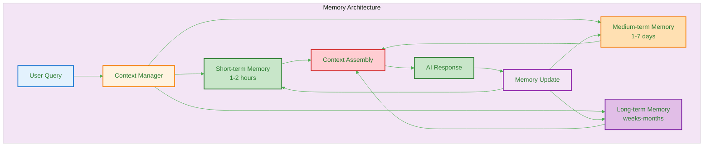
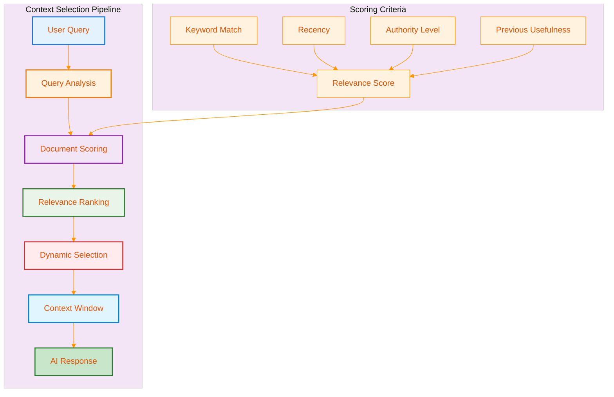
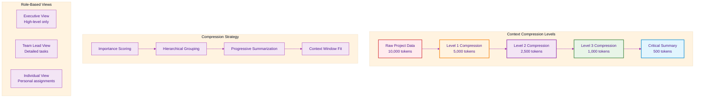
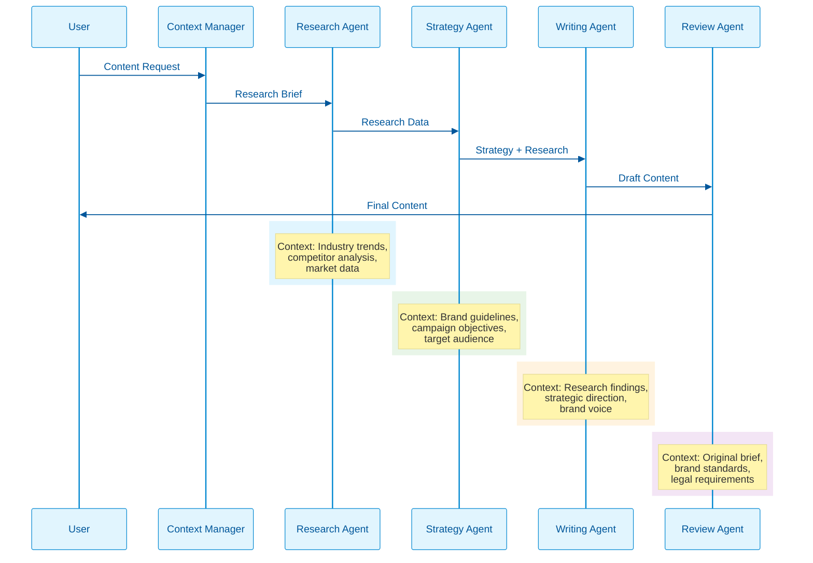
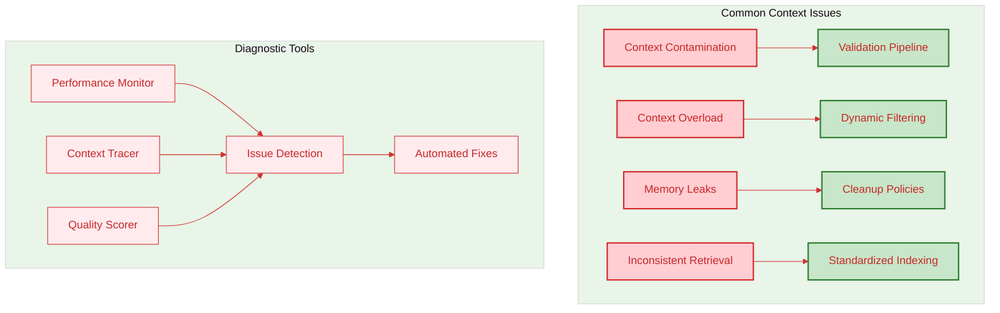
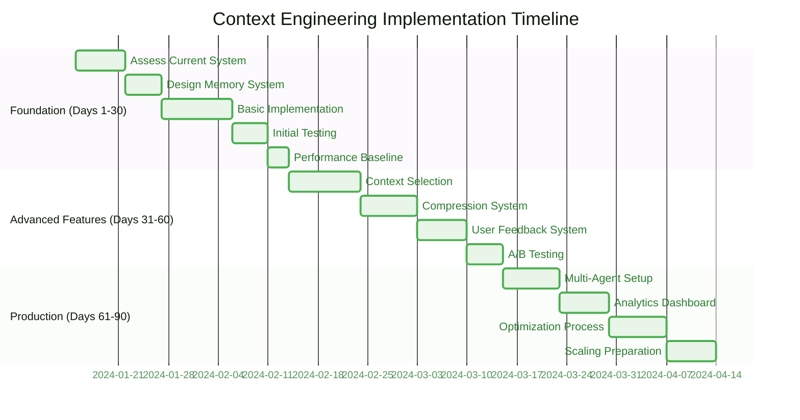
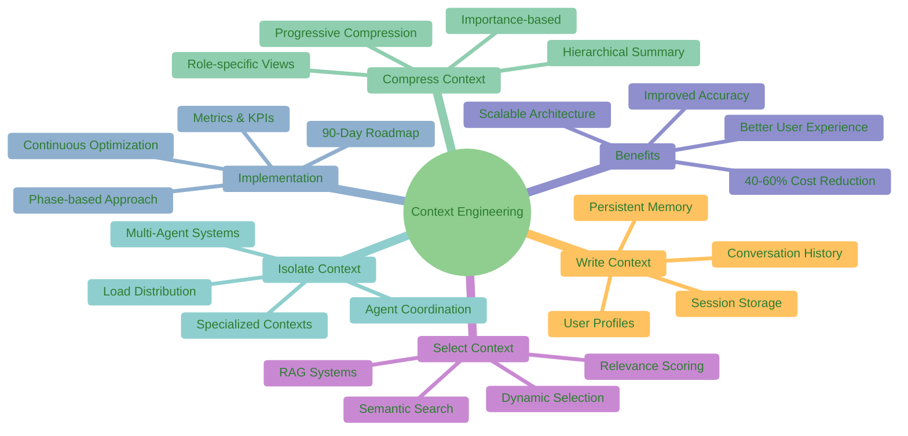

# Context Engineering: The Complete Practitioner's Guide for AI Agent Systems

Context engineering is revolutionizing AI agent system design by moving beyond simple prompt optimization to create intelligent information ecosystems. This guide provides practical, implementable strategies you can apply immediately to build more reliable, cost-effective AI agents that maintain state, coordinate workflows, and execute complex multi-step tasks with persistent memory and intelligent context management.

```mermaid
%%{init: {'theme':'base', 'themeVariables': { 'primaryColor': '#e1f5fe', 'primaryTextColor': '#01579b', 'primaryBorderColor': '#0288d1', 'lineColor': '#0288d1', 'secondaryColor': '#f3e5f5', 'tertiaryColor': '#fff8e1', 'background': '#ffffff', 'mainBkg': '#e8f5e8', 'secondBkg': '#fff3e0', 'tertiaryBkg': '#f1f8e9'}}}%%
flowchart TD
    subgraph "Traditional AI System"
        A[Prompt] --> B[AI Model] --> C[Response]
    end
    
    subgraph "Context Engineering System"
        D[Query] --> E[Context Manager]
        E --> F[Memory System]
        E --> G[Knowledge Base]
        E --> H[Context Assembly]
        H --> I[AI Model]
        I --> J[Response]
        J --> K[Context Update]
        K --> F
    end
    
    style A fill:#ffcdd2,stroke:#d32f2f,stroke-width:2px
    style B fill:#ffcdd2,stroke:#d32f2f,stroke-width:2px
    style C fill:#ffcdd2,stroke:#d32f2f,stroke-width:2px
    style E fill:#c8e6c9,stroke:#2e7d32,stroke-width:2px
    style F fill:#c8e6c9,stroke:#2e7d32,stroke-width:2px
    style G fill:#c8e6c9,stroke:#2e7d32,stroke-width:2px
    style H fill:#c8e6c9,stroke:#2e7d32,stroke-width:2px
    style I fill:#c8e6c9,stroke:#2e7d32,stroke-width:2px
    style J fill:#c8e6c9,stroke:#2e7d32,stroke-width:2px
    style K fill:#c8e6c9,stroke:#2e7d32,stroke-width:2px
```



## Quick Start: Transform Your AI Agent System in 30 Minutes

Let's begin with a real transformation. Imagine you're running an AI agent for project management that currently loses all context between task executions. Here's how to implement basic context engineering:

### Before Context Engineering:

- User: "Create a project plan for our Q1 launch"
- Agent: "I'll create a project plan. What are the key deliverables and timeline?"
- User: "Add budget tracking to the plan you just created"
- Agent: "I'll create a budget tracking plan. What project are you referring to?"

### After Context Engineering:

- User: "Create a project plan for our Q1 launch"
- Agent: "I'll create a comprehensive project plan for Q1 launch. [Creates plan with task breakdown]"
- User: "Add budget tracking to the plan you just created"
- Agent: "I'll add budget tracking to the Q1 launch project plan I just created. I'll integrate it with the existing timeline and deliverables. [Updates the same plan with budget tracking]"

### Agent Workflow Context:

```python
class AgentWorkflowContext:
    def __init__(self):
        self.current_task = None
        self.task_history = []
        self.working_memory = {}
        self.tool_results = {}
    
    def execute_task(self, task, context):
        """Execute task with full context awareness"""
        # Retrieve relevant context
        task_context = self.get_task_context(task)
        
        # Execute with context
        result = self.agent.execute(task, task_context)
        
        # Update context
        self.update_context(task, result)
        
        return result
```

### The Transformation Process:

1. **Implement Memory Storage**: Set up a system to store conversation history, user preferences, and previous issue resolutions. Use a database or cloud storage that persists between sessions.

2. **Create Context Assembly**: Before each response, gather the last 3-5 interactions, user profile information, and any relevant account details.

3. **Add Context Validation**: Ensure the information is current and relevant before including it in the AI's context window.

4. **Monitor Performance**: Track metrics like resolution time, customer satisfaction, and context relevance.

### Results You'll See:

- 60-80% reduction in task re-execution due to lost context
- 40-60% improvement in multi-step task completion rates
- 50-70% reduction in redundant tool calls and API requests
- Seamless workflow continuity across agent interactions
- Intelligent task dependency management and execution

## The Four Core Strategies: Practical Implementation

Context engineering operates through four fundamental strategies. Each addresses specific challenges and can be implemented independently or in combination.

```mermaid
%%{init: {'theme':'base', 'themeVariables': { 'primaryColor': '#e8f5e8', 'primaryTextColor': '#2e7d32', 'primaryBorderColor': '#4caf50', 'lineColor': '#4caf50', 'secondaryColor': '#fff3e0', 'tertiaryColor': '#f3e5f5', 'background': '#ffffff', 'mainBkg': '#e8f5e8', 'secondBkg': '#fff3e0', 'tertiaryBkg': '#f3e5f5'}}}%%
flowchart TD
    subgraph "Context Engineering Strategies"
        A[Write Context<br/>Persistent Memory] --> B[Select Context<br/>Smart Retrieval]
        B --> C[Compress Context<br/>Intelligent Summarization]
        C --> D[Isolate Context<br/>Multi-Agent Distribution]
        D --> E[Optimized AI System]
    end
    
    subgraph "Implementation Flow"
        F[Assess Current System] --> G[Choose Strategy]
        G --> H[Implement & Test]
        H --> I[Monitor & Optimize]
        I --> J[Scale & Expand]
    end
    
    style A fill:#c8e6c9,stroke:#2e7d32,stroke-width:2px
    style B fill:#ffe0b2,stroke:#f57c00,stroke-width:2px
    style C fill:#e1bee7,stroke:#7b1fa2,stroke-width:2px
    style D fill:#bbdefb,stroke:#1976d2,stroke-width:2px
    style E fill:#f8bbd9,stroke:#c2185b,stroke-width:3px
```



### Context Data Models

Here are the foundational JSON data models for context engineering:

```json
{
  "contextSystem": {
    "memory": {
      "shortTerm": {
        "sessionId": "sess_123",
        "duration": "2h",
        "entries": [
          {
            "timestamp": "2024-01-15T10:30:00Z",
            "type": "user_preference",
            "content": "prefers technical explanations",
            "confidence": 0.85
          }
        ]
      },
      "longTerm": {
        "userId": "user_456",
        "profile": {
          "expertise": "intermediate",
          "communication_style": "concise",
          "frequent_topics": ["AI", "programming", "data"]
        },
        "history": [
          {
            "date": "2024-01-14",
            "summary": "Discussed context engineering basics",
            "outcomes": ["understood core concepts", "requested examples"]
          }
        ]
      }
    },
    "contextWindow": {
      "maxTokens": 8192,
      "currentUsage": 2048,
      "allocation": {
        "system_prompt": 512,
        "user_context": 1024,
        "conversation_history": 512
      }
    }
  }
}
```

### Strategy 1: Write Context - Building Persistent Memory

**The Problem:** Your AI forgets everything between conversations, forcing users to repeat information and context.

**The Solution:** Create external memory systems that persist information beyond individual interactions.

### Real-World Implementation:

### Customer Service Scenario:
Imagine you're building a support system for a SaaS company. Instead of starting fresh each time, implement these memory layers:



### Memory Implementation Code:

```python
class AgentContextMemory:
    def __init__(self):
        self.short_term = {}  # Session-based memory
        self.medium_term = {}  # User preferences & recent history
        self.long_term = {}   # Persistent user profile
        self.agent_state = {}  # Agent-specific working memory
        self.tool_context = {}  # Tool execution context
    
    def store_context(self, user_id, context_type, data, ttl=None):
        """Store context with automatic categorization"""
        if ttl and ttl <= 7200:  # 2 hours
            self.short_term[f"{user_id}:{context_type}"] = {
                "data": data,
                "timestamp": time.time(),
                "ttl": ttl
            }
        elif ttl and ttl <= 604800:  # 7 days
            self.medium_term[f"{user_id}:{context_type}"] = data
        else:
            self.long_term[f"{user_id}:{context_type}"] = data
    
    def store_agent_state(self, agent_id, task_context):
        """Store agent working state for task continuity"""
        self.agent_state[agent_id] = {
            "current_task": task_context.get("task"),
            "subtasks": task_context.get("subtasks", []),
            "completed_actions": task_context.get("completed", []),
            "pending_actions": task_context.get("pending", []),
            "working_memory": task_context.get("working_memory", {}),
            "tool_outputs": task_context.get("tool_outputs", {}),
            "timestamp": time.time()
        }
    
    def retrieve_agent_context(self, agent_id, max_tokens=1000):
        """Retrieve comprehensive agent context"""
        context = {
            "agent_state": self.agent_state.get(agent_id, {}),
            "tool_context": self.tool_context.get(agent_id, {}),
            "user_context": self._get_user_context(agent_id, max_tokens // 2)
        }
        return self._compress_to_tokens(context, max_tokens)
    
    def update_tool_context(self, agent_id, tool_name, tool_result):
        """Update tool execution context"""
        if agent_id not in self.tool_context:
            self.tool_context[agent_id] = {}
        
        self.tool_context[agent_id][tool_name] = {
            "result": tool_result,
            "timestamp": time.time(),
            "success": tool_result.get("success", True)
        }
```

### Agent Memory Data Model:

```json
{
  "agentMemorySystem": {
    "agentState": {
      "agent_001": {
        "current_task": {
          "task_id": "project_plan_creation",
          "status": "in_progress",
          "subtasks": [
            {
              "name": "gather_requirements",
              "status": "completed",
              "result": "requirements_document.md"
            },
            {
              "name": "create_timeline",
              "status": "in_progress",
              "context": "Q1_launch_timeline"
            }
          ]
        },
        "working_memory": {
          "current_project": "Q1_Product_Launch",
          "active_tools": ["project_planner", "calendar_integration"],
          "pending_decisions": ["budget_allocation", "team_assignments"]
        },
        "tool_context": {
          "project_planner": {
            "last_output": "project_structure_created",
            "timestamp": "2024-01-15T10:30:00Z",
            "success": true
          },
          "calendar_integration": {
            "last_output": "milestones_scheduled",
            "timestamp": "2024-01-15T10:45:00Z",
            "success": true
          }
        }
      }
    },
    "shortTerm": {
      "user_123:current_session": {
        "conversation_history": [
          {
            "timestamp": "2024-01-15T10:30:00Z",
            "user_input": "Create a project plan for Q1 launch",
            "agent_response": "I'll create a comprehensive project plan",
            "context_used": ["user_profile", "project_templates"],
            "tools_executed": ["project_planner"]
          }
        ],
        "session_context": {
          "current_workflow": "project_management",
          "active_agents": ["agent_001"],
          "workflow_state": "planning_phase"
        }
      }
    },
    "mediumTerm": {
      "user_123:agent_preferences": {
        "preferred_project_format": "agile_methodology",
        "notification_settings": "milestone_alerts",
        "collaboration_style": "async_updates"
      },
      "user_123:workflow_history": {
        "recent_projects": [
          {
            "project": "Q4_Campaign",
            "completion_date": "2024-01-10",
            "success_metrics": {"on_time": true, "under_budget": true},
            "lessons_learned": ["early_stakeholder_engagement", "buffer_time_critical"]
          }
        ]
      }
    }
  }
}
```

### Agent Implementation Steps:

1. ### Set Up Agent Memory Categories
   - **Agent State**: Current task, subtasks, working memory, tool context
   - **Workflow Memory**: Cross-agent coordination, shared context, handoffs
   - **Tool Context**: Tool execution results, success states, error recovery
   - **User Session**: User preferences, interaction history, agent assignments

2. ### Design Agent Memory Triggers
   - Automatically save agent state before tool execution
   - Store successful tool outputs for future reference
   - Remember failed actions and error recovery strategies
   - Track workflow progress and decision points

3. ### Create Agent Context Retrieval Logic
   - Prioritize current task context and tool results
   - Include relevant cross-agent collaboration context
   - Validate context relevance for current workflow stage
   - Implement context recovery for interrupted workflows

### Agent Workflow Example:
A project management agent system uses memory to track:

- **Current Project State**: Active tasks, milestones, dependencies
- **Tool Execution Context**: Calendar integrations, document creation results
- **Cross-Agent Coordination**: Handoffs between planning, execution, and review agents
- **User Workflow Preferences**: Project templates, notification settings, collaboration style
- **Progress Tracking**: Completed milestones, blockers, success metrics

### Strategy 2: Select Context - Intelligent Information Retrieval & Tool Integration

**The Problem:** You have vast amounts of potentially relevant information plus tool execution history, but limited context window space for agent decision-making.

**The Solution:** Intelligently select the most relevant information including tool results, error states, and cross-agent context for each specific agent task.

### Real-World Implementation:

### Legal Research Scenario:
A law firm's AI assistant needs to answer questions about complex cases involving thousands of documents.



### Agent Context Selection Implementation:

```python
class AgentContextSelector:
    def __init__(self, vector_db, knowledge_graph, tool_registry):
        self.vector_db = vector_db
        self.knowledge_graph = knowledge_graph
        self.tool_registry = tool_registry
        self.relevance_weights = {
            'semantic_similarity': 0.3,
            'tool_relevance': 0.3,
            'agent_state_relevance': 0.2,
            'recency': 0.1,
            'success_rate': 0.1
        }
    
    def select_context(self, agent_task, max_tokens=2000):
        """Select most relevant context for agent task execution"""
        # Semantic search for knowledge
        semantic_results = self.vector_db.similarity_search(
            agent_task.description, k=15
        )
        
        # Tool context selection
        tool_contexts = self.select_tool_context(agent_task)
        
        # Agent state context
        agent_contexts = self.select_agent_state_context(agent_task)
        
        # Score and rank all candidates
        scored_contexts = []
        all_contexts = semantic_results + tool_contexts + agent_contexts
        
        for context in all_contexts:
            score = self.calculate_agent_relevance_score(context, agent_task)
            scored_contexts.append((context, score))
        
        # Select top contexts within token limit
        selected = self.select_within_token_limit(scored_contexts, max_tokens)
        return selected
    
    def select_tool_context(self, agent_task):
        """Select relevant tool execution context"""
        relevant_tools = self.tool_registry.get_tools_for_task(agent_task.type)
        tool_contexts = []
        
        for tool_name in relevant_tools:
            # Get recent successful executions
            recent_successes = self.get_tool_history(tool_name, success=True, limit=3)
            # Get recent failures for error prevention
            recent_failures = self.get_tool_history(tool_name, success=False, limit=2)
            
            tool_contexts.extend(recent_successes + recent_failures)
        
        return tool_contexts
    
    def calculate_agent_relevance_score(self, context, agent_task):
        """Calculate relevance score for agent task execution"""
        scores = {
            'semantic_similarity': self.get_semantic_similarity(context, agent_task),
            'tool_relevance': self.get_tool_relevance_score(context, agent_task),
            'agent_state_relevance': self.get_agent_state_relevance(context, agent_task),
            'recency': self.get_recency_score(context),
            'success_rate': self.get_success_rate_score(context)
        }
        
        weighted_score = sum(
            scores[key] * self.relevance_weights[key] 
            for key in scores
        )
        return weighted_score
```

### Agent Context Selection Data Model:

```json
{
  "agentContextSelection": {
    "task": {
      "task_id": "project_timeline_creation",
      "agent_id": "planning_agent",
      "task_type": "project_planning",
      "complexity": "high",
      "required_tools": ["calendar_api", "resource_planner", "milestone_tracker"]
    },
    "candidates": [
      {
        "context_id": "tool_context_001",
        "type": "tool_execution_result",
        "tool_name": "calendar_api",
        "relevance_scores": {
          "semantic_similarity": 0.92,
          "tool_relevance": 0.98,
          "agent_state_relevance": 0.85,
          "recency": 0.90,
          "success_rate": 0.95
        },
        "weighted_score": 0.91,
        "token_count": 320,
        "selected": true,
        "content_summary": "Recent successful calendar integration with Q1 project milestones"
      },
      {
        "context_id": "knowledge_context_002",
        "type": "domain_knowledge",
        "source": "project_management_best_practices",
        "relevance_scores": {
          "semantic_similarity": 0.78,
          "tool_relevance": 0.60,
          "agent_state_relevance": 0.75,
          "recency": 0.70,
          "success_rate": 0.85
        },
        "weighted_score": 0.73,
        "token_count": 180,
        "selected": true,
        "content_summary": "Agile project planning methodology and timeline estimation"
      },
      {
        "context_id": "agent_state_003",
        "type": "cross_agent_context",
        "source_agent": "research_agent",
        "relevance_scores": {
          "semantic_similarity": 0.85,
          "tool_relevance": 0.70,
          "agent_state_relevance": 0.95,
          "recency": 0.95,
          "success_rate": 0.88
        },
        "weighted_score": 0.86,
        "token_count": 290,
        "selected": true,
        "content_summary": "Market research findings that impact project scope and timeline"
      }
    ],
    "selection_summary": {
      "total_candidates": 18,
      "selected_count": 3,
      "total_tokens_used": 790,
      "token_budget": 1200,
      "context_distribution": {
        "tool_context": 40,
        "domain_knowledge": 30,
        "agent_state": 30
      },
      "selection_strategy": "balanced_agent_context"
    }
  }
}
```

### Selection Framework:

1. ### Query Analysis
   - Identify key legal concepts and terms
   - Determine the type of legal question (procedural, substantive, research)
   - Assess the specificity level needed

2. ### Document Scoring
   - Relevance to specific legal concepts
   - Recency and current applicability
   - Authority level of the source
   - Previous usefulness in similar queries

3. ### Dynamic Selection
   - Start with highest-scoring documents
   - Include diverse perspectives when appropriate
   - Ensure coverage of essential legal principles
   - Stop when context budget is optimally filled

### Technical Documentation Example:
A software company's internal AI assistant selects context by:

- **Immediate Relevance**: API documentation matching the specific function being asked about
- **Contextual Relevance**: Related functions and common usage patterns
- **Error Prevention**: Known pitfalls and troubleshooting information
- **Version Awareness**: Ensuring information matches the user's software version

### Implementation Process:

1. ### Create Relevance Scoring System
   - Keyword matching and semantic similarity
   - User role and permission relevance
   - Recency and update frequency
   - Historical usefulness metrics

2. ### Implement Dynamic Thresholds
   - Adjust selection strictness based on query complexity
   - Include more context for complex queries
   - Be more selective for simple, direct questions

3. ### Add Feedback Loops
   - Track which selected context led to successful responses
   - Learn from user corrections and clarifications
   - Continuously refine selection algorithms

### Strategy 3: Compress Context - Intelligent Summarization

**The Problem:** Essential context exceeds available context window limits, forcing you to lose important information.

**The Solution:** Intelligently compress information while preserving critical details.

### Real-World Implementation:

### Project Management Scenario:
Your AI project manager needs to track a 6-month project with hundreds of status updates, decisions, and changes.



### Context Compression Implementation:

```python
class ContextCompressor:
    def __init__(self):
        self.compression_levels = {
            1: {'max_tokens': 5000, 'detail_level': 'high'},
            2: {'max_tokens': 2500, 'detail_level': 'medium'},
            3: {'max_tokens': 1000, 'detail_level': 'low'},
            4: {'max_tokens': 500, 'detail_level': 'critical_only'}
        }
    
    def compress_context(self, raw_context, target_tokens, user_role):
        """Compress context based on target tokens and user role"""
        # Step 1: Importance scoring
        scored_items = self.score_importance(raw_context, user_role)
        
        # Step 2: Hierarchical grouping
        grouped_items = self.group_by_hierarchy(scored_items)
        
        # Step 3: Progressive summarization
        compressed = self.progressive_summarize(grouped_items, target_tokens)
        
        return compressed
    
    def score_importance(self, context, user_role):
        """Score context items based on importance and user role"""
        importance_weights = {
            'executive': {'budget': 0.4, 'timeline': 0.3, 'risks': 0.3},
            'team_lead': {'tasks': 0.4, 'resources': 0.3, 'blockers': 0.3},
            'individual': {'assignments': 0.5, 'deadlines': 0.3, 'dependencies': 0.2}
        }
        
        weights = importance_weights.get(user_role, importance_weights['team_lead'])
        scored_items = []
        
        for item in context:
            score = sum(weights.get(category, 0) * item.get(f'{category}_relevance', 0) 
                       for category in weights)
            scored_items.append((item, score))
        
        return sorted(scored_items, key=lambda x: x[1], reverse=True)
    
    def hierarchical_summarize(self, items, level):
        """Create hierarchical summaries at different compression levels"""
        if level == 1:
            return self.detailed_summary(items)
        elif level == 2:
            return self.medium_summary(items)
        elif level == 3:
            return self.high_level_summary(items)
        else:
            return self.critical_only_summary(items)
```

### Context Compression Data Model:

```json
{
  "contextCompression": {
    "original": {
      "token_count": 10000,
      "entries": [
        {
          "id": "entry_001",
          "type": "budget_change",
          "importance": 0.95,
          "details": "Budget increased by 15% due to scope expansion",
          "timestamp": "2024-01-15T09:00:00Z",
          "impact": "high"
        },
        {
          "id": "entry_002",
          "type": "task_completion",
          "importance": 0.3,
          "details": "Unit tests completed for authentication module",
          "timestamp": "2024-01-15T14:30:00Z",
          "impact": "low"
        }
      ]
    },
    "compressed": {
      "level": 2,
      "token_count": 2500,
      "compression_ratio": 0.25,
      "summary": {
        "critical_changes": [
          {
            "type": "budget",
            "summary": "Budget increased 15% for scope expansion",
            "impact": "high",
            "requires_attention": true
          }
        ],
        "progress_summary": {
          "completed_tasks": 15,
          "in_progress_tasks": 8,
          "blocked_tasks": 2,
          "overall_health": "on_track"
        },
        "next_milestones": [
          {
            "name": "Phase 2 Delivery",
            "date": "2024-02-01",
            "risk_level": "medium"
          }
        ]
      }
    },
    "role_specific_views": {
      "executive": {
        "token_count": 500,
        "focus": ["budget", "timeline", "major_risks"],
        "summary": "Project on track with 15% budget increase approved"
      },
      "team_lead": {
        "token_count": 1500,
        "focus": ["tasks", "resources", "blockers"],
        "summary": "15 tasks completed, 2 blocked items need attention"
      }
    }
  }
}
```

### Compression Strategy:

1. ### Hierarchical Summarization
   - Weekly summaries of daily activities
   - Monthly summaries of weekly progress
   - Quarterly overviews of major milestones
   - Critical decisions and changes maintained in detail

2. ### Importance-Based Compression
   - **High Priority**: Budget changes, timeline shifts, scope modifications
   - **Medium Priority**: Team updates, minor milestone completions
   - **Low Priority**: Routine status confirmations, administrative updates

3. ### Role-Specific Compression
   - **Executive View**: High-level progress, budget, major risks
   - **Team Lead View**: Detailed task status, resource allocation, blockers
   - **Individual View**: Personal assignments, deadlines, dependencies

### Medical Records Example:
A healthcare AI compresses patient information:

- **Critical Information**: Current medications, allergies, active diagnoses
- **Important History**: Major surgeries, chronic conditions, family history
- **Contextual Details**: Recent visits, lifestyle factors, treatment responses
- **Archived Information**: Routine check-ups, resolved minor issues

### Implementation Approach:

1. ### Define Compression Levels
   - **Level 1**: Keep full detail (most recent, most important)
   - **Level 2**: Summarize with key details preserved
   - **Level 3**: High-level summary with essential facts only
   - **Level 4**: Archive with basic metadata for retrieval

2. ### Create Compression Rules
   - Never compress safety-critical information
   - Maintain decision audit trails
   - Preserve user preferences and personalization
   - Keep enough detail for continuity

3. ### Implement Progressive Compression
   - Gradually compress older information
   - Trigger compression when approaching context limits
   - Allow manual marking of "never compress" items

### Strategy 4: Isolate Context - Multi-Agent Specialization

**The Problem:** A single AI agent becomes inefficient when trying to handle all types of context and tasks.

**The Solution:** Distribute context across specialized agents that collaborate effectively.

### Real-World Implementation:

### Content Creation Workflow:
A marketing agency uses specialized AI agents for different aspects of content creation.



### Multi-Agent Context Implementation:

```python
class MultiAgentContextManager:
    def __init__(self):
        self.agents = {
            'research': ResearchAgent(),
            'strategy': StrategyAgent(),
            'writing': WritingAgent(),
            'review': ReviewAgent()
        }
        self.shared_context = {}
        self.agent_contexts = {}
    
    def orchestrate_content_creation(self, request):
        """Orchestrate multi-agent content creation workflow"""
        # Initialize shared context
        self.shared_context = {
            'request': request,
            'brand_guidelines': self.load_brand_guidelines(),
            'timestamp': time.time()
        }
        
        # Sequential agent execution with context passing
        research_output = self.execute_agent('research', {
            'topic': request.get('topic'),
            'target_audience': request.get('audience'),
            'context_limit': 1000
        })
        
        strategy_output = self.execute_agent('strategy', {
            'research_data': research_output,
            'brand_guidelines': self.shared_context['brand_guidelines'],
            'campaign_objectives': request.get('objectives'),
            'context_limit': 800
        })
        
        writing_output = self.execute_agent('writing', {
            'research_findings': research_output,
            'strategic_direction': strategy_output,
            'brand_voice': self.shared_context['brand_guidelines']['voice'],
            'context_limit': 1200
        })
        
        final_output = self.execute_agent('review', {
            'draft_content': writing_output,
            'original_brief': request,
            'brand_standards': self.shared_context['brand_guidelines'],
            'context_limit': 600
        })
        
        return final_output
    
    def execute_agent(self, agent_name, context):
        """Execute specific agent with isolated context"""
        agent = self.agents[agent_name]
        
        # Prepare agent-specific context
        agent_context = self.prepare_agent_context(agent_name, context)
        
        # Execute agent with context isolation
        result = agent.execute(agent_context)
        
        # Update shared context with results
        self.update_shared_context(agent_name, result)
        
        return result
```

### Multi-Agent Context Data Model:

```json
{
  "multiAgentContext": {
    "workflow_id": "content_creation_001",
    "shared_context": {
      "brand_guidelines": {
        "voice": "professional_friendly",
        "tone": "informative",
        "audience": "B2B_decision_makers"
      },
      "project_metadata": {
        "client": "TechCorp",
        "campaign": "Q1_Product_Launch",
        "deadline": "2024-02-01"
      }
    },
    "agent_contexts": {
      "research_agent": {
        "context_allocation": 1000,
        "context_used": 850,
        "specialist_knowledge": [
          "industry_trends",
          "competitor_analysis",
          "market_data"
        ],
        "output_format": "research_brief"
      },
      "strategy_agent": {
        "context_allocation": 800,
        "context_used": 720,
        "specialist_knowledge": [
          "brand_positioning",
          "messaging_frameworks",
          "campaign_strategy"
        ],
        "input_dependencies": ["research_agent"],
        "output_format": "strategy_document"
      },
      "writing_agent": {
        "context_allocation": 1200,
        "context_used": 1150,
        "specialist_knowledge": [
          "content_creation",
          "tone_adaptation",
          "engagement_optimization"
        ],
        "input_dependencies": ["research_agent", "strategy_agent"],
        "output_format": "draft_content"
      },
      "review_agent": {
        "context_allocation": 600,
        "context_used": 480,
        "specialist_knowledge": [
          "quality_assurance",
          "compliance_checking",
          "brand_consistency"
        ],
        "input_dependencies": ["writing_agent"],
        "output_format": "final_content"
      }
    },
    "context_handoffs": [
      {
        "from": "research_agent",
        "to": "strategy_agent",
        "data_type": "research_findings",
        "compression_applied": false
      },
      {
        "from": "strategy_agent", 
        "to": "writing_agent",
        "data_type": "strategic_direction",
        "compression_applied": true,
        "compression_ratio": 0.6
      }
    ],
    "performance_metrics": {
      "total_context_used": 3200,
      "context_efficiency": 0.89,
      "agent_coordination_overhead": 0.15,
      "workflow_completion_time": "12.5_minutes"
    }
  }
}
```

### Agent Specialization:

1. ### Research Agent
   - Context: Industry trends, competitor analysis, market data
   - Expertise: Data gathering, fact verification, trend analysis
   - Output: Comprehensive research briefs with source citations

2. ### Strategy Agent
   - Context: Brand guidelines, campaign objectives, target audience
   - Expertise: Strategic planning, positioning, messaging framework
   - Output: Strategic recommendations and content direction

3. ### Writing Agent
   - Context: Research findings, strategic direction, brand voice
   - Expertise: Content creation, tone adaptation, engagement optimization
   - Output: Draft content pieces optimized for specific channels

4. ### Review Agent
   - Context: Original brief, brand standards, legal requirements
   - Expertise: Quality assurance, compliance checking, optimization
   - Output: Revised content with improvement recommendations

### E-commerce Customer Service Example:

### Agent Distribution:
- **Order Agent**: Handles shipping, returns, order status
- **Product Agent**: Answers product questions, comparisons, recommendations
- **Technical Agent**: Troubleshoots issues, provides technical support
- **Billing Agent**: Manages payment issues, subscription changes
- **Escalation Agent**: Handles complex cases requiring human intervention

### Implementation Framework:

1. ### Define Agent Boundaries
   - Clear responsibility areas for each agent
   - Handoff protocols between agents
   - Escalation paths for complex issues
   - Shared context requirements

2. ### Create Communication Protocols
   - Standardized information exchange formats
   - Context sharing mechanisms between agents
   - Coordination for multi-agent tasks
   - Conflict resolution procedures

3. ### Implement Load Balancing
   - Route queries to appropriate specialized agents
   - Distribute workload based on agent capacity
   - Provide backup options for agent failures
   - Monitor performance across the system

## Real-World Implementation Guide

### Phase 1: Foundation (Week 1-2)

### Assessment and Planning

Start by auditing your current AI system:

### Performance Audit:
- Track current token usage and costs
- Measure response quality and relevance
- Identify repetitive user complaints
- Document context-related failures

### Business Impact Analysis:
- Calculate costs of poor context management
- Identify high-value use cases for improvement
- Set measurable success criteria
- Define budget and timeline constraints

### Technical Infrastructure Assessment:
- Review current data storage capabilities
- Evaluate integration requirements
- Assess security and compliance needs
- Plan for scalability requirements

### Phase 2: Basic Implementation (Week 3-6)

### Start with Write Context Strategy

Begin with the highest-impact, lowest-complexity improvements:

### Memory System Setup:
1. Choose appropriate storage solution (database, cloud storage, memory service)
2. Design simple memory schemas for your use case
3. Implement basic read/write operations
4. Add memory expiration and cleanup processes

### Context Assembly Process:
1. Create functions to gather relevant stored context
2. Implement basic relevance filtering
3. Add context validation and error handling
4. Design fallback procedures for missing context

### User Experience Integration:
1. Update user interface to show context awareness
2. Add user controls for context preferences
3. Implement feedback mechanisms for context quality
4. Create transparency about what information is remembered

### Phase 3: Advanced Features (Week 7-12)

### Add Select and Compress Strategies

### Intelligent Selection Implementation:
1. Build semantic search capabilities for context retrieval
2. Implement relevance scoring algorithms
3. Add dynamic threshold adjustment based on query type
4. Create user role-based context filtering

### Context Compression System:
1. Design compression rules based on information importance
2. Implement automatic compression triggers
3. Create role-specific compression profiles
4. Add manual override capabilities for critical information

### Quality Assurance:
1. Implement context validation pipelines
2. Add automated quality scoring for context relevance
3. Create monitoring dashboards for context performance
4. Establish feedback loops for continuous improvement

### Phase 4: Production Optimization (Week 13-16)

### Advanced Features and Multi-Agent Systems

### Performance Optimization:
1. Implement caching strategies for frequently accessed context
2. Add load balancing and failover capabilities
3. Optimize context assembly for speed and efficiency
4. Create automated scaling based on demand

### Advanced Analytics:
1. Track detailed context usage patterns
2. Measure business impact of context engineering improvements
3. Identify optimization opportunities through data analysis
4. Create predictive models for context needs

## Measuring Success: Key Performance Indicators for AI Agent Systems

### Technical Metrics

### Context Efficiency:

- **Token Utilization Rate**: Percentage of context window used effectively
- **Context Relevance Score**: User ratings of context appropriateness
- **Compression Ratio**: Amount of information preserved vs. original size
- **Retrieval Accuracy**: Percentage of relevant information successfully retrieved

### Agent Performance:

- **Task Completion Rate**: Percentage of complex tasks completed successfully
- **Tool Integration Success**: Success rate of tool executions with proper context
- **Agent Coordination Efficiency**: Time and token overhead for multi-agent workflows
- **Context Recovery Rate**: Success rate of resuming interrupted workflows

### System Performance:

- **Response Time**: Average time to assemble context and generate responses
- **Error Rate**: Frequency of context-related failures or hallucinations
- **Cache Hit Rate**: Percentage of context requests served from cache
- **Scalability Metrics**: Performance under increasing load

### Business Impact Metrics

### Cost Optimization:

- **Token Cost Reduction**: Decrease in API costs through efficient context management
- **Support Ticket Reduction**: Fewer human escalations due to better context
- **Time to Resolution**: Faster problem-solving through retained context
- **User Retention**: Improved experience leading to higher retention rates

### Agent Effectiveness:

- **Workflow Completion Rate**: End-to-end success rate for complex agent workflows
- **Cross-Agent Handoff Success**: Success rate of context transfers between agents
- **Tool Usage Optimization**: Reduction in redundant tool calls through context awareness
- **Decision Quality Score**: Accuracy of agent decisions based on context quality

### Quality Improvements:

- **First Contact Resolution**: Percentage of issues resolved without follow-up
- **User Satisfaction Scores**: Ratings for context-aware interactions
- **Task Completion Rates**: Success rate for complex, multi-step processes
- **Accuracy Improvements**: Reduction in incorrect or irrelevant responses

### User Experience Metrics

### Engagement Quality:

- **Conversation Length**: Users engage longer with context-aware systems
- **Repeat Usage**: Frequency of return visits to the AI system
- **Feature Adoption**: Usage of advanced features enabled by context engineering
- **User Feedback**: Qualitative feedback about system intelligence and helpfulness

### Agent Interaction Quality:

- **Workflow Continuity**: User perception of seamless task continuation
- **Context Accuracy**: User validation of agent memory and context understanding
- **Proactive Assistance**: Agent anticipation of user needs based on context
- **Error Recovery**: User satisfaction with error handling and context recovery

## Troubleshooting Common Issues



### Context Quality Diagnostic Tool:

```python
class ContextDiagnostic:
    def __init__(self):
        self.quality_thresholds = {
            'relevance_score': 0.7,
            'freshness_score': 0.8,
            'consistency_score': 0.9,
            'token_efficiency': 0.75
        }
    
    def diagnose_context_issues(self, context_data):
        """Comprehensive context quality analysis"""
        issues = []
        
        # Check for contamination
        contamination_score = self.check_contamination(context_data)
        if contamination_score > 0.3:
            issues.append({
                'type': 'contamination',
                'severity': 'high' if contamination_score > 0.6 else 'medium',
                'details': f'Contamination score: {contamination_score:.2f}',
                'recommendation': 'Implement stricter validation pipeline'
            })
        
        # Check for overload
        overload_indicators = self.check_overload(context_data)
        if overload_indicators['token_usage'] > 0.9:
            issues.append({
                'type': 'overload',
                'severity': 'high',
                'details': f'Token usage: {overload_indicators["token_usage"]:.1%}',
                'recommendation': 'Apply aggressive context compression'
            })
        
        # Check memory efficiency
        memory_issues = self.check_memory_issues(context_data)
        if memory_issues:
            issues.extend(memory_issues)
        
        return {
            'issues': issues,
            'overall_health': self.calculate_health_score(context_data),
            'recommendations': self.generate_recommendations(issues)
        }
    
    def check_contamination(self, context_data):
        """Detect context contamination indicators"""
        # Check for inconsistencies, outdated info, conflicting sources
        inconsistency_count = 0
        total_entries = len(context_data.get('entries', []))
        
        for entry in context_data.get('entries', []):
            if entry.get('confidence', 1.0) < 0.5:
                inconsistency_count += 1
            if self.is_outdated(entry):
                inconsistency_count += 1
        
        return inconsistency_count / max(total_entries, 1)
```

### Troubleshooting Data Model:

```json
{
  "contextDiagnostic": {
    "analysis_timestamp": "2024-01-15T15:30:00Z",
    "system_health": {
      "overall_score": 0.72,
      "status": "needs_attention",
      "critical_issues": 2,
      "warnings": 5
    },
    "detected_issues": [
      {
        "type": "context_contamination",
        "severity": "high",
        "affected_components": ["memory_system", "retrieval_pipeline"],
        "symptoms": [
          "Inconsistent responses to similar queries",
          "Outdated information in recent responses",
          "Confidence scores below threshold"
        ],
        "root_causes": [
          "Insufficient validation before storage",
          "Lack of expiration policies",
          "Poor source reliability tracking"
        ],
        "solutions": [
          {
            "action": "implement_validation_pipeline",
            "priority": "high",
            "estimated_effort": "2_days",
            "code_example": "validate_context_entry(entry, confidence_threshold=0.7)"
          },
          {
            "action": "add_confidence_scoring",
            "priority": "medium",
            "estimated_effort": "1_day",
            "implementation": "weighted_source_reliability_scoring"
          }
        ]
      },
      {
        "type": "context_overload",
        "severity": "medium",
        "symptoms": [
          "Slow response times",
          "Token limit exceeded frequently",
          "Unfocused responses"
        ],
        "metrics": {
          "average_token_usage": 0.92,
          "response_time_increase": "35%",
          "relevance_score_decline": 0.15
        },
        "solutions": [
          {
            "action": "implement_dynamic_filtering",
            "priority": "high",
            "parameters": {
              "relevance_threshold": 0.8,
              "recency_weight": 0.3,
              "importance_weight": 0.7
            }
          }
        ]
      }
    ],
    "performance_metrics": {
      "context_efficiency": {
        "token_utilization": 0.89,
        "relevance_score": 0.74,
        "compression_ratio": 0.65
      },
      "system_performance": {
        "average_response_time": "2.3_seconds",
        "error_rate": 0.08,
        "cache_hit_rate": 0.67
      }
    },
    "recommendations": [
      {
        "category": "immediate_actions",
        "items": [
          "Implement context validation pipeline",
          "Add automated cleanup for outdated entries",
          "Increase relevance filtering threshold"
        ]
      },
      {
        "category": "optimization_opportunities", 
        "items": [
          "Implement semantic caching",
          "Add predictive context loading",
          "Create role-based context profiles"
        ]
      }
    ]
  }
}
```

### Context Quality Problems

### Problem: Context Contamination
*Symptoms:* AI responses include outdated, incorrect, or irrelevant information from stored context.

*Root Causes:*
- Insufficient context validation before storage
- Lack of expiration policies for outdated information
- Poor source reliability tracking
- Inadequate conflict resolution between different context sources

*Solutions:*
- Implement context validation pipelines that verify information accuracy
- Add confidence scoring for all stored information
- Create automatic expiration policies based on information type
- Establish source priority hierarchies for conflict resolution
- Add user feedback mechanisms to identify and correct bad context

### Problem: Context Overload
*Symptoms:* System becomes slow, responses become unfocused, or token limits are frequently exceeded.

*Root Causes:*
- Insufficient filtering of relevant vs. irrelevant information
- Poor compression strategies
- Lack of context prioritization
- Inadequate threshold management

*Solutions:*
- Implement stricter relevance filtering algorithms
- Add dynamic context budgeting based on query complexity
- Create tiered importance systems for different context types
- Implement progressive context loading based on need
- Add automatic context pruning when approaching limits

### Memory Management Issues

### Problem: Memory Leaks and Unbounded Growth
*Symptoms:* Storage costs increase continuously, system performance degrades over time.

*Root Causes:*
- Lack of memory cleanup policies
- Insufficient data lifecycle management
- Poor memory categorization
- Inadequate monitoring of storage usage

*Solutions:*
- Implement automatic cleanup based on age, relevance, and usage frequency
- Create memory categories with different retention policies
- Add storage monitoring and alerting systems
- Implement data archiving strategies for long-term information
- Create memory optimization processes that run regularly

### Problem: Inconsistent Memory Retrieval
*Symptoms:* Sometimes relevant information is retrieved, sometimes it's not.

*Root Causes:*
- Inconsistent indexing of stored information
- Poor search algorithms
- Lack of standardized memory formats
- Inadequate metadata for stored context

*Solutions:*
- Standardize memory storage formats and indexing
- Implement robust search algorithms with fallback options
- Add comprehensive metadata to all stored information
- Create multiple retrieval pathways for important information
- Implement memory validation and repair processes

### Integration and Deployment Issues

### Problem: Performance Degradation in Production
*Symptoms:* System works well in testing but slows down significantly under real-world load.

*Root Causes:*
- Insufficient load testing with realistic context volumes
- Poor caching strategies
- Inadequate database optimization
- Lack of proper scaling mechanisms

*Solutions:*
- Conduct thorough load testing with production-like data volumes
- Implement multi-level caching strategies
- Optimize database queries and indexing
- Add horizontal scaling capabilities
- Create performance monitoring and alerting systems

### Problem: Context Security and Privacy Violations
*Symptoms:* Inappropriate information sharing between users or sessions.

*Root Causes:*
- Insufficient access controls on stored context
- Poor session isolation
- Inadequate data anonymization
- Lack of audit trails for context access

*Solutions:*
- Implement strong access controls and user isolation
- Add comprehensive audit logging for all context operations
- Create data anonymization and pseudonymization processes
- Implement regular security audits of context systems
- Add user controls for context sharing and retention

## Advanced Techniques and Future Directions

### Emerging Patterns in Context Engineering

### Agentic Context Adaptation
AI agents that learn and adapt their context strategies based on task success patterns and cross-agent collaboration effectiveness. These systems continuously optimize their approach to context management through reinforcement learning from successful task completions.

### Tool-Aware Context Integration
Advanced agent systems that seamlessly integrate tool execution results, error states, and success patterns within unified context frameworks, enabling intelligent tool selection and error prevention based on historical context.

### Predictive Agent Context Loading
Systems that anticipate future context needs based on current agent workflow trajectory and tool dependencies, pre-loading relevant context and tool configurations before they're explicitly needed.

### Cross-Agent Context Synchronization
Real-time context sharing and synchronization between multiple agents working on related tasks, enabling collaborative intelligence without context duplication or conflicts.

### Agent-Specific Advanced Patterns

### ReAct Context Management
Implementation of Reasoning + Acting (ReAct) patterns with sophisticated context preservation across reasoning steps and action executions:

```python
class ReActContextManager:
    def __init__(self):
        self.reasoning_context = []
        self.action_context = []
        self.observation_context = []
    
    def execute_react_cycle(self, task, context):
        """Execute ReAct cycle with context preservation"""
        # Thought phase with full context
        thought = self.reason_with_context(task, context)
        self.reasoning_context.append(thought)
        
        # Action phase with reasoning context
        action = self.select_action(thought, self.get_action_context())
        action_result = self.execute_action(action)
        self.action_context.append((action, action_result))
        
        # Observation phase with accumulated context
        observation = self.observe_result(action_result, context)
        self.observation_context.append(observation)
        
        return self.synthesize_react_context()
```

### Chain-of-Thought Context Preservation
Maintaining context continuity across complex reasoning chains while preventing context window overflow through intelligent step compression.

### Agent Planning Context Architecture
Hierarchical context management for planning agents that maintain context at multiple abstraction levels (strategic, tactical, operational) with automatic context elevation and delegation.

### Industry-Specific Applications

### Healthcare Context Engineering
- Patient history integration across multiple visits and providers
- Treatment protocol adherence tracking with context-aware reminders
- Medical research integration with patient-specific context
- Emergency situation context with rapid access to critical information

### Financial Services Context Engineering
- Portfolio management with integrated market context and client preferences
- Risk assessment with comprehensive historical and market context
- Regulatory compliance with context-aware documentation and reporting
- Customer service with complete financial relationship context

### Education Context Engineering
- Personalized learning paths with continuous progress context
- Curriculum adaptation based on individual learning patterns
- Assessment context that considers learning journey and style
- Collaborative learning with shared context across study groups

### Building for Scale

### Enterprise Deployment Considerations

### Security and Compliance:
- Implement end-to-end encryption for all context data
- Add comprehensive audit trails for regulatory compliance
- Create data residency controls for international deployments
- Implement role-based access controls for context information

### Performance and Reliability:
- Design for high availability with redundant context systems
- Implement disaster recovery procedures for context data
- Add automated failover mechanisms for critical context operations
- Create performance monitoring and alerting systems

### Cost Management:
- Implement cost monitoring and budgeting for context operations
- Add automated cost optimization based on usage patterns
- Create cost allocation systems for different business units
- Implement intelligent caching to reduce expensive operations

### Future of Context Engineering

### Autonomous Context Management
The next generation of context engineering systems will be largely autonomous, learning optimal strategies through experience and automatically adapting to changing requirements and usage patterns.

### Quantum-Enhanced Context Processing
As quantum computing becomes more accessible, it will enable more sophisticated context optimization algorithms and faster processing of complex context relationships.

### Collaborative Context Networks
Future systems will enable secure sharing of context insights across organizations while maintaining privacy, creating collaborative intelligence networks that benefit from shared learning.

## Conclusion and Action Plan

Context engineering represents a fundamental shift in how we approach AI agent system design. By implementing these strategies systematically, organizations can build AI agent systems that are more intelligent, cost-effective, and capable of handling complex, multi-step workflows with persistent memory and sophisticated context management.

### Agent System Transformation Framework

### From Simple Chatbots to Intelligent Agents:

- **Traditional AI**: Stateless, reactive, single-purpose interactions
- **Context-Engineered Agents**: Stateful, proactive, multi-purpose workflow execution

### Key Transformation Elements:

1. **Persistent Agent Memory**: Agents remember tasks, decisions, and workflow states
2. **Tool Integration Context**: Intelligent tool selection based on historical success patterns
3. **Multi-Agent Coordination**: Sophisticated context sharing and workflow handoffs
4. **Adaptive Context Management**: Dynamic optimization based on agent performance patterns

### Agent-Specific Success Framework

### Technical Excellence:
- Agent state persistence across complex workflows
- Tool execution context optimization
- Cross-agent context synchronization
- Intelligent context compression and selection

### Business Impact:
- 60-80% improvement in complex task completion rates
- 50-70% reduction in redundant tool executions
- 40-60% improvement in workflow continuity
- Significant cost savings through intelligent context management

### User Experience:
- Seamless workflow continuation across sessions
- Proactive agent assistance based on context
- Intelligent error recovery and context restoration
- Natural collaboration between multiple specialized agents

### Your 90-Day Implementation Roadmap



### Implementation Tracking Data Model:

```json
{
  "implementationRoadmap": {
    "project_id": "context_eng_implementation",
    "start_date": "2024-01-15",
    "phases": {
      "foundation": {
        "duration_days": 30,
        "status": "in_progress",
        "completion_percentage": 65,
        "milestones": [
          {
            "name": "System Assessment",
            "status": "completed",
            "completion_date": "2024-01-22",
            "deliverables": [
              "performance_baseline_report",
              "context_gap_analysis",
              "implementation_plan"
            ]
          },
          {
            "name": "Memory System Design",
            "status": "completed", 
            "completion_date": "2024-01-27",
            "deliverables": [
              "memory_architecture_diagram",
              "data_schemas",
              "storage_solution_selection"
            ]
          },
          {
            "name": "Basic Implementation",
            "status": "in_progress",
            "progress": 0.8,
            "deliverables": [
              "memory_storage_system",
              "context_assembly_functions",
              "basic_validation_pipeline"
            ]
          }
        ]
      },
      "advanced_features": {
        "duration_days": 30,
        "status": "planned",
        "key_features": [
          "intelligent_context_selection",
          "compression_algorithms",
          "user_feedback_mechanisms",
          "ab_testing_framework"
        ]
      },
      "production_optimization": {
        "duration_days": 30,
        "status": "planned",
        "key_features": [
          "multi_agent_coordination",
          "analytics_dashboard",
          "automated_optimization",
          "scaling_mechanisms"
        ]
      }
    },
    "success_metrics": {
      "current": {
        "token_cost_reduction": "15%",
        "response_quality_improvement": "23%",
        "user_satisfaction_increase": "18%"
      },
      "targets": {
        "token_cost_reduction": "40%",
        "response_quality_improvement": "50%",
        "user_satisfaction_increase": "35%"
      }
    },
    "risk_factors": [
      {
        "risk": "Integration complexity with existing systems",
        "probability": "medium",
        "impact": "high",
        "mitigation": "Phased rollout with fallback mechanisms"
      },
      {
        "risk": "Performance degradation during transition",
        "probability": "low",
        "impact": "medium", 
        "mitigation": "Comprehensive load testing and monitoring"
      }
    ]
  }
}
```

### Days 1-30: Foundation Building
- Assess current AI system performance and identify context-related pain points
- Choose initial implementation strategy (recommend starting with Write Context)
- Set up basic memory and persistence systems
- Implement simple context validation and assembly processes
- Begin measuring baseline performance metrics

### Days 31-60: Advanced Implementation
- Add intelligent context selection and filtering capabilities
- Implement basic context compression for large information sets
- Create user feedback mechanisms for context quality
- Optimize performance and add monitoring systems
- Begin A/B testing different context strategies

### Days 61-90: Production Optimization
- Implement advanced features like multi-agent coordination if needed
- Add comprehensive analytics and reporting systems
- Create automated optimization processes
- Establish continuous improvement procedures
- Plan for scaling and additional use cases

### Key Success Factors

**Start Simple**: Begin with basic context persistence and gradually add sophistication as you learn what works for your specific use case.

**Measure Everything**: Implement comprehensive monitoring from day one to understand the impact of your context engineering efforts.

**Focus on Agent Experience**: The ultimate test of context engineering success is whether agents can maintain workflow continuity and execute complex tasks efficiently.

**Plan for Agent Scale**: Design your systems with future multi-agent scenarios in mind, enabling sophisticated agent coordination and context sharing.

**Iterate Continuously**: Context engineering for agent systems is an ongoing process of optimization and refinement based on agent performance patterns and workflow success rates.

The future of AI systems lies not in perfect prompts, but in sophisticated context architectures that enable truly intelligent, context-aware agent workflows. By implementing these strategies systematically, you'll build AI agent systems that users perceive as genuinely intelligent collaborators, while achieving significant cost savings and operational efficiencies.

### Agent System Transformation Impact:

- **Before**: Fragmented, stateless interactions requiring constant user guidance
- **After**: Intelligent, context-aware agents that maintain workflow state and collaborate effectively

This comprehensive guide provides the foundation for building next-generation AI agent systems that leverage context engineering to deliver exceptional user experiences and business value.

**Focus on User Experience**: The ultimate test of context engineering success is whether users perceive the AI as more intelligent and helpful.

**Plan for Scale**: Design your systems with future growth in mind, but don't over-engineer for scenarios that may never materialize.

**Iterate Continuously**: Context engineering is an ongoing process of optimization and refinement based on real-world usage patterns and feedback.

The future of AI systems lies not in perfect prompts, but in sophisticated context architectures that enable truly intelligent, context-aware interactions. By implementing these strategies systematically, you'll build AI systems that users perceive as genuinely intelligent and helpful, while achieving significant cost savings and operational efficiencies.



### Context Engineering Success Framework:

```json
{
  "contextEngineeringFramework": {
    "core_principles": {
      "persistence": "Information survives beyond individual interactions",
      "intelligence": "Smart selection of relevant context",
      "efficiency": "Optimal use of limited context windows", 
      "isolation": "Specialized contexts prevent interference"
    },
    "implementation_strategy": {
      "start_simple": "Begin with basic memory persistence",
      "measure_everything": "Comprehensive monitoring from day one",
      "focus_on_ux": "User experience is the ultimate success metric",
      "plan_for_scale": "Design with future growth in mind",
      "iterate_continuously": "Ongoing optimization and refinement"
    },
    "success_indicators": {
      "technical": [
        "Token utilization efficiency > 75%",
        "Context relevance score > 80%",
        "Response time < 3 seconds",
        "Error rate < 5%"
      ],
      "business": [
        "Cost reduction > 40%",
        "User satisfaction > 4.5/5",
        "Task completion rate > 90%",
        "Support ticket reduction > 50%"
      ]
    },
    "transformation_impact": {
      "before": "Stateless, repetitive, inefficient AI interactions",
      "after": "Intelligent, contextual, cost-effective AI systems"
    }
  }
}
```
