# Complete Guide to Managing Generative AI Risks: Best Practices and Implementation Strategies

This comprehensive guide provides a practical, implementation-focused approach to managing the eight critical risk categories in Generative AI systems. Built on proven risk management methodologies and aligned with the EU AI Act requirements, this tutorial offers real-world strategies, tools, and frameworks that organizations can immediately apply to build responsible, compliant, and trustworthy AI systems.

Whether you're a risk manager, AI practitioner, or business leader, this guide will help you transform AI risk management from a compliance checkbox into a strategic advantage that protects your organization while enabling innovation.

## Table of Contents

1. [Understanding the Risk Landscape](#understanding-the-risk-landscape)
2. [Real-World Examples and Case Studies](#real-world-examples-and-case-studies)
3. [Fairness Risks](#fairness-risks)
4. [Explainability Challenges](#explainability-challenges)
5. [Controllability Issues](#controllability-issues)
6. [Safety Concerns](#safety-concerns)
7. [Privacy & Security](#privacy--security)
8. [Governance Framework](#governance-framework)
9. [Transparency Requirements](#transparency-requirements)
10. [Veracity & Robustness](#veracity--robustness)
11. [Recommended Tools and Technologies](#recommended-tools-and-technologies)
12. [Regulatory Compliance Mapping](#regulatory-compliance-mapping)
13. [Quick Start Guide (30-Day Implementation)](#quick-start-guide-30-day-implementation)
14. [Implementation Roadmap](#implementation-roadmap)
15. [Key Performance Indicators (KPIs)](#key-performance-indicators-kpis)
11. [Real-World Examples and Case Studies](#real-world-examples-and-case-studies)
12. [Regulatory Compliance Mapping](#regulatory-compliance-mapping)
13. [Quick Start Guide](#quick-start-guide)

## Understanding the Risk Landscape

### What is Risk Management?

Risk management is a systematic process of identifying, analyzing, and responding to potential threats that could negatively impact an organization's ability to achieve its objectives. It's a discipline that has evolved over decades across industries, from traditional sectors like finance and insurance to modern technology applications.

The fundamental risk management process follows these proven steps:

1. **Risk Identification**: Discovering potential threats and vulnerabilities
2. **Risk Assessment**: Evaluating the likelihood and impact of identified risks
3. **Risk Mitigation**: Developing strategies to reduce or eliminate risks
4. **Risk Monitoring**: Continuously tracking and reviewing risk levels
5. **Risk Communication**: Ensuring stakeholders understand and respond to risks

### Why AI Risk Management Follows Established Methodologies

AI risk management is not fundamentally different from traditional risk management—it applies the same proven methodologies to a new domain. The core principles remain unchanged:

- **Systematic Approach**: Structured identification and assessment of risks
- **Proportionate Response**: Balancing risk mitigation with business objectives
- **Continuous Improvement**: Regular review and adaptation of risk controls
- **Stakeholder Engagement**: Involving all relevant parties in risk decisions
- **Documentation and Audit**: Maintaining clear records for accountability

What makes AI risk management unique is not the process, but the specific types of risks that emerge from artificial intelligence systems: algorithmic bias, lack of explainability, data privacy violations, and unpredictable behavior patterns.

### The EU AI Act: Built on Proven Risk Management Foundations

The European Union's AI Act (Regulation 2024/1689) explicitly builds upon established risk management standards and methodologies, particularly:

- **ISO 31000**: International standard for risk management principles and guidelines
- **ISO/IEC 27001**: Information security management systems
- **ISO 14971**: Medical device risk management
- **COSO Framework**: Enterprise risk management framework

The EU AI Act's risk-based approach categorizes AI systems into different risk levels (minimal, limited, high, unacceptable) and applies proportionate requirements—a methodology directly borrowed from traditional risk management practices used in aviation, healthcare, and financial services.

Key EU AI Act principles that mirror traditional risk management:

- **Risk-based approach**: Higher risk systems require stricter controls
- **Proportionality**: Compliance requirements match risk levels
- **Lifecycle management**: Continuous monitoring and improvement
- **Documentation requirements**: Audit trails and accountability
- **Third-party assessment**: Independent validation for high-risk systems

### The AI Risk Framework: Eight Interconnected Categories

Generative AI systems present unique challenges that require a comprehensive risk management approach. The eight categories shown represent interconnected areas where failures can have significant business, ethical, and legal consequences.

### Why This Matters

- **Regulatory Compliance**: Emerging AI regulations require proactive risk management
- **Brand Protection**: AI failures can damage reputation and customer trust
- **Operational Continuity**: Unmanaged risks can disrupt business operations
- **Ethical Responsibility**: Organizations have a duty to deploy AI responsibly

## 1. Fairness Risks

### Common Issues

- **Racism**: AI models perpetuating racial stereotypes or discrimination
- **Biased & Stereotyped Queries**: Systems responding inappropriately to sensitive topics
- **Inappropriate Queries**: Generating content that violates ethical standards

### Best Practices

**Risk Assessment**

- Conduct bias testing across demographic groups
- Test edge cases and controversial topics
- Implement diverse evaluation datasets
- Regular fairness audits

**Mitigation Strategies**

- Diverse training data
- Bias detection algorithms
- Human oversight for sensitive outputs
- Regular model retraining

### Implementation Steps

1. **Baseline Assessment**: Test current models for bias across protected categories
2. **Data Auditing**: Review training data for representation gaps
3. **Monitoring Systems**: Implement real-time bias detection
4. **Feedback Loops**: Create mechanisms for users to report biased outputs

## 2. Explainability Challenges

### Common Issues

- **Opaque System Design**: Black-box models that can't explain decisions
- **Lack of Explainability**: No clear reasoning for outputs
- **No Continuous Improvements**: Systems that don't learn from mistakes
- **Non-transparent Response**: Users can't understand how conclusions were reached

### Best Practices

**Explainability Framework**

- Document model architecture
- Implement attention mechanisms
- Provide confidence scores
- Create explanation interfaces

**Technical Solutions**

- LIME (Local Interpretable Model-agnostic Explanations)
- SHAP (SHapley Additive exPlanations)
- Attention visualization
- Decision trees for critical paths

### Implementation Steps

1. **Model Documentation**: Create comprehensive technical documentation
2. **Explanation Interfaces**: Build user-facing explanation tools
3. **Confidence Metrics**: Implement uncertainty quantification
4. **Continuous Learning**: Establish feedback mechanisms for improvement

## 3. Controllability Issues

### Common Issues

- **HIL (Human-in-the-Loop) Gaps**: Insufficient human oversight
- **Incident Response Planning**: Lack of preparedness for AI failures

### Best Practices

**Control Mechanisms**

- Human approval workflows
- Real-time monitoring dashboards
- Automated safety switches
- Escalation procedures

**Incident Response**

- AI-specific incident playbooks
- Cross-functional response teams
- Communication protocols
- Recovery procedures

### Implementation Steps

1. **Control Architecture**: Design human oversight touchpoints
2. **Monitoring Systems**: Implement real-time performance tracking
3. **Response Procedures**: Create AI-specific incident protocols
4. **Training Programs**: Educate teams on control mechanisms

## 4. Safety Concerns

### Common Issues

- **Generation of False/Unverified Content**: Hallucinations and misinformation
- **Data Poisoning**: Malicious manipulation of training data
- **Model Selection**: Choosing inappropriate models for tasks
- **Overconfidence of System Response**: Presenting uncertain outputs as facts

### Best Practices

<table>
  <tr>
    <th align="left">Safety Measures</th>
    <th align="left">Data Protection</th>
  </tr>
  <tr>
    <td>
      <ul>
        <li>Fact-checking mechanisms</li>
        <li>Content verification systems</li>
        <li>Uncertainty quantification</li>
        <li>Output validation</li>
      </ul>
    </td>
    <td>
      <ul>
        <li>Data provenance tracking</li>
        <li>Input sanitization</li>
        <li>Adversarial testing</li>
        <li>Secure training pipelines</li>
      </ul>
    </td>
  </tr>
</table>

### Implementation Steps

1. **Verification Systems**: Implement fact-checking and validation
2. **Uncertainty Handling**: Add confidence intervals to outputs
3. **Adversarial Testing**: Regular red-team exercises
4. **Data Security**: Secure the entire data pipeline

## 5. Privacy & Security

### Common Issues

- **Disclosure of Personal Data**: Leaking private information in outputs
- **Disclosure of Sensitive Information**: Revealing confidential data
- **Prompt Injection**: Malicious prompts that manipulate the system
- **Access Control**: Inadequate user permission management
- **User Session Termination**: Improper session handling

### Best Practices

**Privacy Protection**

- Data anonymization
- Differential privacy
- PII detection and redaction
- Consent management

**Security Measures**

- Input validation
- Rate limiting
- Authentication systems
- Encryption at rest and in transit

### Implementation Steps

1. **Data Classification**: Identify and categorize sensitive data
2. **Access Controls**: Implement role-based permissions
3. **Prompt Security**: Deploy injection detection systems
4. **Session Management**: Secure user session handling

## 6. Governance Framework

### Common Issues

- **Incident Processes**: Inadequate response procedures
- **AI Culture & Commitment**: Lack of organizational AI ethics
- **Generative & Responsible AI Policies**: Missing or unclear guidelines
- **Auditing Processes**: Insufficient review mechanisms
- **Verification of Third-party Requirements**: Vendor risk management
- **Review of Organizational Tolerance**: Risk appetite assessment
- **Monitor Generative AI Harm**: Ongoing impact assessment
- **Roles and Responsibilities**: Unclear accountability
- **AI Impact Assessment**: Systematic evaluation processes

### Best Practices

**Governance Structure**

- AI Ethics Committee
- Clear roles and responsibilities
- Regular policy reviews
- Compliance monitoring

**Policy Framework**

- AI use policies
- Ethical guidelines
- Vendor requirements
- Risk tolerance definitions

### Implementation Steps

1. **Committee Formation**: Establish AI governance body
2. **Policy Development**: Create comprehensive AI policies
3. **Process Documentation**: Define roles and procedures
4. **Regular Reviews**: Schedule periodic assessments

## 7. Transparency Requirements

### Common Issues

- **Documentation from Model Provider**: Insufficient vendor transparency
- **User Documentation**: Poor user guidance
- **Incident Tracking**: Inadequate problem logging
- **Acceptable Usage of the System**: Unclear guidelines
- **Downstream Impact Assessment**: Missing impact analysis
- **Opaque System for Users**: Poor user experience
- **Access to Logs**: Insufficient audit trails
- **Data Sources for RAG**: Unclear data provenance
- **Communication of Model Performance**: Poor performance reporting

### Best Practices

**Transparency Measures**

- Model cards and documentation
- User guides and tutorials
- Performance dashboards
- Audit logs and trails

**Communication**

- Regular performance reports
- Incident communications
- Usage guidelines
- Data source documentation

### Implementation Steps

1. **Documentation Standards**: Create comprehensive documentation requirements
2. **User Education**: Develop training and guidance materials
3. **Logging Systems**: Implement comprehensive audit trails
4. **Communication Protocols**: Establish regular reporting

## 8. Veracity & Robustness

### Common Issues

- **Model Hallucination**: Generating false or nonsensical content
- **Enforcing System's Scope**: Staying within intended boundaries
- **Specificity of the Generated Response**: Vague or irrelevant outputs
- **Consistency of Model's Responses**: Inconsistent behavior

### Best Practices

**Robustness Testing**

- Stress testing
- Edge case evaluation
- Consistency validation
- Performance benchmarking

**Quality Assurance**

- Output validation
- Hallucination detection
- Scope enforcement
- Response quality metrics

### Implementation Steps

1. **Testing Framework**: Develop comprehensive testing protocols
2. **Quality Metrics**: Define and monitor quality indicators
3. **Validation Systems**: Implement output verification
4. **Continuous Monitoring**: Track model performance over time

## Implementation Roadmap

## Key Performance Indicators (KPIs)

Track these metrics to measure your risk management effectiveness:

```mermaid
graph TB
    A[AI Risk Management KPIs] --> B[Technical KPIs]
    A --> C[Process KPIs]
    A --> D[Business KPIs]
    
    B --> B1[Bias Detection Rate<br/>📊 % of biased outputs caught]
    B --> B2[Hallucination Rate<br/>📊 Frequency of false content]
    B --> B3[System Uptime<br/>📊 Availability metrics]
    B --> B4[Response Time<br/>📊 Performance metrics]
    
    C --> C1[Incident Response Time<br/>⏱️ Speed of resolution]
    C --> C2[Audit Compliance<br/>✅ Governance adherence]
    C --> C3[User Satisfaction<br/>😊 Transparency feedback]
    C --> C4[Training Completion<br/>📚 Staff education levels]
    
    D --> D1[Risk Reduction<br/>📉 Quantified mitigation]
    D --> D2[Regulatory Compliance<br/>⚖️ Legal adherence]
    D --> D3[Cost of Risk<br/>💰 Financial impact]
    D --> D4[Stakeholder Trust<br/>🤝 Confidence levels]
    
    classDef main fill:#F5F5F5,stroke:#616161,stroke-width:3px,color:#2E2E2E
    classDef category fill:#E3F2FD,stroke:#1976D2,stroke-width:2px,color:#2E2E2E
    classDef technical fill:#E8F5E8,stroke:#388E3C,stroke-width:2px,color:#2E2E2E
    classDef process fill:#FFF3E0,stroke:#F57C00,stroke-width:2px,color:#2E2E2E
    classDef business fill:#F3E5F5,stroke:#7B1FA2,stroke-width:2px,color:#2E2E2E
    
    class A main
    class B,C,D category
    class B1,B2,B3,B4 technical
    class C1,C2,C3,C4 process
    class D1,D2,D3,D4 business
```

## Recommended Tools and Technologies

### Open Source Tools

**Bias Detection & Fairness**
- **Fairlearn** (Microsoft): Toolkit for assessing and mitigating unfairness in ML models
- **AI Fairness 360** (IBM): Comprehensive library for bias detection and mitigation
- **What-If Tool** (Google): Visual interface for exploring ML model behavior

**Explainability & Interpretability**
- **SHAP** (SHapley Additive exPlanations): Model-agnostic explanation framework
- **LIME** (Local Interpretable Model-agnostic Explanations): Local explanation tool
- **InterpretML** (Microsoft): Unified framework for machine learning interpretability

**Model Monitoring & Observability**
- **Evidently AI**: Open-source ML monitoring and testing
- **WhyLabs**: Data and ML monitoring platform
- **MLflow**: ML lifecycle management with monitoring capabilities

**Privacy & Security**
- **Opacus** (Meta): PyTorch library for differential privacy
- **TensorFlow Privacy**: Privacy-preserving ML toolkit
- **PySyft**: Secure and private data science

### Enterprise Solutions

**Comprehensive Platforms**
- **Azure ML Responsible AI**: End-to-end responsible AI lifecycle management
- **AWS SageMaker Clarify**: Bias detection and model explainability
- **Google Cloud AI Platform**: Integrated ML ops with responsible AI features
- **DataRobot**: AutoML with built-in governance and explainability

**Specialized Tools**
- **Avanade AI Ethics**: Governance and compliance framework
- **Dataiku**: Data science platform with responsible AI features
- **H2O.ai**: Automated ML with interpretability features

### Implementation Cost Estimates

**Small Organization (< 100 employees)**
- **Open Source Tools**: $0-$5,000/month (implementation and maintenance)
- **Cloud Services**: $500-$2,000/month
- **Training and Consulting**: $10,000-$25,000 one-time
- **Total First Year**: $15,000-$50,000

**Medium Organization (100-1000 employees)**
- **Enterprise Tools**: $5,000-$15,000/month
- **Cloud Services**: $2,000-$8,000/month
- **Professional Services**: $50,000-$150,000 one-time
- **Total First Year**: $150,000-$400,000

**Large Organization (> 1000 employees)**
- **Enterprise Platforms**: $15,000-$50,000/month
- **Cloud Services**: $8,000-$25,000/month
- **Custom Development**: $200,000-$500,000 one-time
- **Total First Year**: $500,000-$1,500,000

## Real-World Examples and Case Studies

```mermaid
graph TD
    A[Risk Identification] --> B[Risk Assessment]
    B --> C[Solution Design]
    C --> D[Implementation]
    D --> E[Monitoring]
    E --> F[Results Measurement]
    F --> G[Continuous Improvement]
    G --> A
    
    B --> B1[Healthcare: Safety & Privacy<br/>85% confidence threshold]
    B --> B2[Finance: Fairness & Transparency<br/>Bias testing framework]
    B --> B3[E-commerce: Controllability<br/>Real-time monitoring]
    
    C --> C1[Human-in-the-loop<br/>Differential privacy<br/>Fact-checking integration]
    C --> C2[Bias detection<br/>Explanation systems<br/>Compliance checks]
    C --> C3[Circuit breakers<br/>Fallback systems<br/>A/B testing]
    
    F --> F1[95% reduction errors<br/>Zero privacy violations<br/>40% satisfaction ↑]
    F --> F2[Eliminated bias<br/>100% compliance<br/>25% trust ↑]
    F --> F3[99.9% uptime<br/>30% accuracy ↑<br/>15% conversion ↑]
    
    classDef process fill:#E3F2FD,stroke:#1976D2,stroke-width:2px,color:#2E2E2E
    classDef healthcare fill:#E8F5E8,stroke:#388E3C,stroke-width:2px,color:#2E2E2E
    classDef finance fill:#FFF3E0,stroke:#F57C00,stroke-width:2px,color:#2E2E2E
    classDef ecommerce fill:#F3E5F5,stroke:#7B1FA2,stroke-width:2px,color:#2E2E2E
    classDef results fill:#FCE4EC,stroke:#C2185B,stroke-width:2px,color:#2E2E2E
    
    class A,B,C,D,E,F,G process
    class B1,C1,F1 healthcare
    class B2,C2,F2 finance
    class B3,C3,F3 ecommerce
```

### Example 1: Healthcare AI Chatbot Risk Management

**Scenario**: A hospital implements an AI chatbot for patient triage and initial consultation.

**Risk Category**: Safety & Privacy
- **Challenge**: Chatbot might provide incorrect medical advice or leak patient data
- **Solution Applied**: 
  - Implemented human-in-the-loop validation for all medical recommendations
  - Added confidence thresholds (responses below 85% confidence redirect to human staff)
  - Deployed differential privacy for training data
  - Created medical fact-checking integration with verified medical databases

**Results**: 
- 95% reduction in inappropriate medical advice
- Zero privacy violations in 6 months of operation
- 40% improvement in patient satisfaction scores

### Example 2: Financial Services Content Generation

**Scenario**: A bank uses AI to generate personalized financial advice and marketing content.

**Risk Category**: Fairness & Transparency
- **Challenge**: AI might discriminate against certain demographic groups in financial advice
- **Solution Applied**:
  - Implemented bias testing across age, gender, and ethnic groups
  - Created transparent explanation system showing advice reasoning
  - Added regulatory compliance checks for financial advice
  - Established diverse evaluation datasets

**Results**:
- Eliminated demographic bias in advice generation
- Achieved 100% regulatory compliance rate
- Increased customer trust scores by 25%

### Example 3: E-commerce Recommendation System

**Scenario**: An online retailer uses AI for product recommendations and dynamic pricing.

**Risk Category**: Controllability & Veracity
- **Challenge**: AI recommendations becoming erratic during high-traffic periods
- **Solution Applied**:
  - Implemented real-time monitoring with automatic fallback systems
  - Added circuit breakers for anomalous behavior detection
  - Created human oversight dashboard for real-time intervention
  - Established A/B testing framework for recommendation quality

**Results**:
- 99.9% system uptime during peak shopping periods
- 30% improvement in recommendation accuracy
- 15% increase in customer conversion rates

## Regulatory Compliance Mapping

```mermaid
graph TD
    A[Regulatory Compliance Framework] --> B[EU AI Act]
    A --> C[GDPR]
    A --> D[Industry-Specific]
    
    B --> B1[High-Risk AI Systems<br/>📋 Risk Management]
    B --> B2[Data Governance<br/>📊 Article 10]
    B --> B3[Transparency<br/>🔍 Article 13]
    B --> B4[Human Oversight<br/>👥 Article 14]
    B --> B5[Accuracy & Robustness<br/>✅ Article 15]
    
    C --> C1[Privacy by Design<br/>🛡️ Data Protection]
    C --> C2[Impact Assessments<br/>📋 DPIA Requirements]
    C --> C3[Data Subject Rights<br/>⚖️ Automated Decisions]
    C --> C4[Consent Management<br/>📝 Training Data]
    
    D --> D1[Healthcare<br/>🏥 HIPAA, FDA]
    D --> D2[Financial<br/>💰 PCI DSS, SOX]
    D --> D3[Government<br/>🏛️ Public Sector]
    
    B1 --> E[AI Risk Framework<br/>8 Categories]
    B2 --> E
    B3 --> E
    B4 --> E
    B5 --> E
    C1 --> E
    C2 --> E
    C3 --> E
    C4 --> E
    
    classDef main fill:#F5F5F5,stroke:#616161,stroke-width:3px,color:#2E2E2E
    classDef regulation fill:#E3F2FD,stroke:#1976D2,stroke-width:2px,color:#2E2E2E
    classDef euai fill:#E8F5E8,stroke:#388E3C,stroke-width:2px,color:#2E2E2E
    classDef gdpr fill:#FFF3E0,stroke:#F57C00,stroke-width:2px,color:#2E2E2E
    classDef industry fill:#F3E5F5,stroke:#7B1FA2,stroke-width:2px,color:#2E2E2E
    classDef framework fill:#FCE4EC,stroke:#C2185B,stroke-width:3px,color:#2E2E2E
    
    class A main
    class B,C,D regulation
    class B1,B2,B3,B4,B5 euai
    class C1,C2,C3,C4 gdpr
    class D1,D2,D3 industry
    class E framework
```

```mermaid
graph LR
    A[Compliance Checklist] --> B[Risk Assessment<br/>📋 Article 9]
    A --> C[Data Governance<br/>📊 Article 10]
    A --> D[Technical Documentation<br/>📄 Article 11]
    A --> E[Automatic Logging<br/>📝 Article 12]
    A --> F[Transparency<br/>🔍 Article 13]
    A --> G[Human Oversight<br/>👥 Article 14]
    A --> H[Accuracy Testing<br/>✅ Article 15]
    
    B --> I[✅ Completed]
    C --> J[🔄 In Progress]
    D --> K[📋 Required]
    E --> L[✅ Completed]
    F --> M[🔄 In Progress]
    G --> N[📋 Required]
    H --> O[✅ Completed]
    
    classDef main fill:#F5F5F5,stroke:#616161,stroke-width:3px,color:#2E2E2E
    classDef requirement fill:#E3F2FD,stroke:#1976D2,stroke-width:2px,color:#2E2E2E
    classDef completed fill:#E8F5E8,stroke:#388E3C,stroke-width:2px,color:#2E2E2E
    classDef inProgress fill:#FFF3E0,stroke:#F57C00,stroke-width:2px,color:#2E2E2E
    classDef required fill:#FFEBEE,stroke:#D32F2F,stroke-width:2px,color:#2E2E2E
    
    class A main
    class B,C,D,E,F,G,H requirement
    class I,L,O completed
    class J,M inProgress
    class K,N required
```

## Quick Start Guide (30-Day Implementation)

```mermaid
graph TD
    A[30-Day Implementation] --> B[Week 1: Assessment & Planning]
    A --> C[Week 2: Policy & Governance]
    A --> D[Week 3: Technical Implementation]
    A --> E[Week 4: Testing & Validation]
    
    B --> B1[Day 1-2: Initial Assessment<br/>• Risk assessment<br/>• System identification<br/>• Priority areas]
    B --> B2[Day 3-5: Team Assembly<br/>• Form governance committee<br/>• Assign owners<br/>• Communication protocols]
    B --> B3[Day 6-7: Tool Selection<br/>• Choose tools<br/>• Setup dashboards<br/>• Begin procurement]
    
    C --> C1[Day 8-10: Policy Development<br/>• Draft AI policies<br/>• Incident procedures<br/>• Approval workflows]
    C --> C2[Day 11-14: Documentation<br/>• System documentation<br/>• Model cards<br/>• Audit trails]
    
    D --> D1[Day 15-17: Monitoring Setup<br/>• Deploy bias detection<br/>• Logging systems<br/>• Alert configuration]
    D --> D2[Day 18-21: Safety Measures<br/>• Human-in-the-loop<br/>• Fact-checking<br/>• Safety switches]
    
    E --> E1[Day 22-24: Testing<br/>• Bias testing<br/>• Adversarial testing<br/>• Explanation validation]
    E --> E2[Day 25-28: Training<br/>• Staff procedures<br/>• Tabletop exercises<br/>• Response testing]
    E --> E3[Day 29-30: Go-Live<br/>• Activate monitoring<br/>• Begin reporting<br/>• Schedule reviews]
    
    classDef week fill:#E3F2FD,stroke:#1976D2,stroke-width:2px,color:#2E2E2E
    classDef assessment fill:#E8F5E8,stroke:#388E3C,stroke-width:2px,color:#2E2E2E
    classDef policy fill:#FFF3E0,stroke:#F57C00,stroke-width:2px,color:#2E2E2E
    classDef technical fill:#F3E5F5,stroke:#7B1FA2,stroke-width:2px,color:#2E2E2E
    classDef validation fill:#FCE4EC,stroke:#C2185B,stroke-width:2px,color:#2E2E2E
    classDef main fill:#F5F5F5,stroke:#616161,stroke-width:3px,color:#2E2E2E
    
    class A main
    class B week
    class C week
    class D week
    class E week
    class B1,B2,B3 assessment
    class C1,C2 policy
    class D1,D2 technical
    class E1,E2,E3 validation
```

## Conclusion

Managing Generative AI risks requires a comprehensive, multi-faceted approach that addresses technical, operational, and governance challenges. Success depends on:

1. **Proactive Planning**: Addressing risks before they become problems
2. **Cross-functional Collaboration**: Involving all stakeholders in risk management
3. **Continuous Monitoring**: Ongoing assessment and improvement
4. **Stakeholder Communication**: Transparent reporting and feedback
5. **Regulatory Awareness**: Staying current with evolving requirements

By following this framework and adapting it to your specific context, you can build robust, responsible, and trustworthy Generative AI systems that deliver value while managing risks effectively.

Remember: AI risk management is not a one-time project but an ongoing responsibility that evolves with technology, regulations, and organizational needs.
