# AWS Guardrail Tutorial: Building Safe Generative AI Applications with Code Examples

## 1. Introduction

Imagine you’re running an online bookstore with a chatbot that helps customers find books. It’s powered by generative AI, answering questions like “What’s a good mystery novel?” with ease. But one day, it suggeTest the Guardrail using the `ApplyGuardrail` API to simulate user inputs.

```python
try:
    # Test Guardrail
    test_input = {
        'guardrailIdentifier': guardrail_id,
        'guardrailVersion': 'DRAFT',
        'source': 'INPUT',
        'content': [
            {
                'text': {
                    'text': 'What\'s the price of this book? Damn, it better be cheap!'
                }
            }
        ]
    }
    
    response = bedrock.apply_guardrail(**test_input)
    print("📊 Guardrail Test Results:")
    print(json.dumps(response, indent=2))
    
except ClientError as e:
    print(f"❌ Guardrail test failed: {e}")
```ok, uses offensive language, or accidentally shares a customer’s email. These mishaps can damage your reputation, violate laws, or worse. Amazon Bedrock Guardrails are your safety net, ensuring your AI stays helpful, safe, and compliant.

This tutorial explains why Guardrails are essential, what they do, and how to implement them with practical code examples. Using the Richard Feynman technique, we’ll break down complex concepts as if explaining to a curious beginner. Whether you’re a developer, data scientist, or business owner, this guide will help you build responsible AI applications.

### 1.1 Overview of Generative AI and Its Challenges

Generative AI, like large language models (LLMs), creates content—text, images, or code—from prompts. It’s like a creative assistant who can write stories, summarize reports, or answer questions. But it has flaws:

- **Hallucinations**: The AI might invent facts, like claiming a book was published in 2050.
- **Harmful Content**: It could produce offensive or biased responses, alienating users.
- **Privacy Risks**: It might leak sensitive data, like a customer’s address.
- **Misuse**: Bad actors could use it to generate fake news or malicious content.

### 1.2 Introduction to Amazon Bedrock

Amazon Bedrock is a managed service that simplifies building generative AI applications. It provides access to foundation models (FMs) from providers like Anthropic, Meta, and Amazon, all through a unified API. Think of Bedrock as a workshop: it supplies the tools (AI models), but you need safety protocols to use them responsibly.

### 1.3 What Are Guardrails?

Amazon Bedrock Guardrails are configurable policies that filter AI inputs and outputs to ensure safety, accuracy, and compliance. They’re like a quality control team, checking every conversation to prevent harmful or inappropriate content. For example, in a banking app, Guardrails can block investment advice or mask account numbers.

### 1.4 Purpose and Audience

This tutorial is for anyone building AI applications with Amazon Bedrock who wants to ensure safety and compliance. No advanced AI expertise is required—just familiarity with AWS and a willingness to follow step-by-step instructions. We'll include Python code examples using the AWS SDK to make implementation concrete.

## 1.5 AWS Guardrails Process Flow

The following diagram illustrates how Amazon Bedrock Guardrails work in practice, showing the complete flow from user input to safe response delivery:

```mermaid
---
title: AWS Bedrock Guardrails Process Flow
config:
  theme: base
  themeVariables:
    primaryColor: "#E8F4FD"
    primaryTextColor: "#2C3E50"
    primaryBorderColor: "#5DADE2"
    lineColor: "#5DADE2"
    secondaryColor: "#F7DC6F"
    tertiaryColor: "#F8C471"
    background: "#FFFFFF"
    mainBkg: "#EBF5FB"
    secondBkg: "#FEF9E7"
    tertiaryBkg: "#FDEDEC"
    clusterBkg: "#F4F6F7"
---
flowchart TD
    Start(["`🚀 **User Input**
    Question/Prompt`"]) --> InputGuard{"`🛡️ **Input Guardrail**
    Policy Check`"}
    
    InputGuard -->|✅ Safe| ContentFilter{"`🔍 **Content Filters**
    • Hate Speech
    • Violence
    • Sexual Content
    • Insults`"}
    
    InputGuard -->|❌ Blocked| Block1["`🚫 **Blocked Response**
    'Sorry, your input violates 
    our policies'`"]
    
    ContentFilter -->|✅ Pass| TopicCheck{"`📋 **Topic Validation**
    Denied Topics Check`"}
    
    ContentFilter -->|❌ Fail| Block2["`🚫 **Content Blocked**
    Harmful content detected`"]
    
    TopicCheck -->|✅ Allowed| WordFilter{"`🔤 **Word Filters**
    • Profanity
    • Custom Words
    • Competitor Names`"}
    
    TopicCheck -->|❌ Denied| Block3["`🚫 **Topic Blocked**
    Discussion not permitted`"]
    
    WordFilter -->|✅ Clean| PIICheck{"`🔐 **PII Detection**
    • Email Addresses
    • Phone Numbers
    • Credit Cards`"}
    
    WordFilter -->|❌ Contains| Block4["`🚫 **Word Blocked**
    Inappropriate language`"]
    
    PIICheck -->|✅ Safe| ModelCall["`🤖 **Foundation Model**
    Generate Response`"]
    
    PIICheck -->|❌ Detected| Anonymize["`🎭 **PII Handling**
    Mask/Block/Anonymize`"]
    
    Anonymize --> ModelCall
    
    ModelCall --> OutputGuard{"`🛡️ **Output Guardrail**
    Response Validation`"}
    
    OutputGuard -->|✅ Safe| GroundCheck{"`🎯 **Grounding Check**
    Context Alignment`"}
    
    OutputGuard -->|❌ Unsafe| Block5["`🚫 **Output Blocked**
    Response violates policies`"]
    
    GroundCheck -->|✅ Grounded| FinalResponse(["`✨ **Safe Response**
    Delivered to User`"])
    
    GroundCheck -->|❌ Hallucination| Block6["`🚫 **Hallucination Blocked**
    Response not grounded`"]
    
    subgraph Legend ["`**🔧 Guardrail Components**`"]
        L1["`🛡️ **Input/Output Filters**
        Block harmful content`"]
        L2["`📋 **Topic Control**
        Restrict discussions`"]
        L3["`🔐 **Privacy Protection**
        Handle sensitive data`"]
        L4["`🎯 **Accuracy Control**
        Prevent hallucinations`"]
    end
    
    classDef startEnd fill:#E8F5E8,stroke:#27AE60,stroke-width:3px,color:#1E8449
    classDef decision fill:#FFF2CC,stroke:#F39C12,stroke-width:2px,color:#D68910
    classDef process fill:#E8F4FD,stroke:#5DADE2,stroke-width:2px,color:#2874A6
    classDef blocked fill:#FDEDEC,stroke:#E74C3C,stroke-width:2px,color:#C0392B
    classDef legend fill:#F4F6F7,stroke:#85929E,stroke-width:1px,color:#566573
    
    class Start,FinalResponse startEnd
    class InputGuard,ContentFilter,TopicCheck,WordFilter,PIICheck,OutputGuard,GroundCheck decision
    class ModelCall,Anonymize process
    class Block1,Block2,Block3,Block4,Block5,Block6 blocked
    class L1,L2,L3,L4 legend
```



**Key Benefits of This Process:**

- **🛡️ Multiple Security Layers**: Each step provides a different type of protection
- **🎯 Precision Filtering**: Specific checks for different types of content and risks
- **🔄 Bidirectional Protection**: Filters both input prompts and output responses
- **⚡ Real-time Processing**: All checks happen seamlessly during AI interaction
- **📊 Transparency**: Clear feedback on why content was blocked or allowed

This comprehensive filtering ensures that your AI application maintains safety, compliance, and user trust while delivering helpful responses.

## 2. WHY: The Need for Guardrails in Generative AI

### 2.1 Risks Associated with Generative AI

Let’s use the Feynman technique to explain the risks simply:

- **Hallucinations**: Imagine asking your AI, “Who won the 2024 World Series?” It might say, “The Moonwalkers,” a team that doesn’t exist. This is a hallucination—the AI made it up. In critical applications like healthcare, this could lead to dangerous misinformation.
- **Harmful Content**: Picture a chatbot that, when asked about book recommendations, responds with hate speech. This could offend users and violate platform policies.
- **Privacy Issues**: If a customer asks, “What’s my order status?” and the AI includes their credit card number, that’s a privacy breach.
- **Misuse**: Without controls, someone could prompt the AI to write phishing emails or propaganda, causing real-world harm.

### 2.2 Importance of Responsible AI

Responsible AI ensures technology is used ethically and safely. It’s like teaching a child to use their imagination without causing harm. Key principles include:

- **Fairness**: Avoiding bias or discrimination in AI responses.
- **Transparency**: Making AI behavior clear to users.
- **Accountability**: Having mechanisms to correct errors or prevent harm.
- **Privacy**: Protecting user data from exposure.

### 2.3 How Guardrails Address These Risks

Guardrails mitigate risks by:

- **Filtering Harmful Content**: Blocking toxic language, hate speech, or violence.
- **Preventing Hallucinations**: Ensuring responses are grounded in provided context.
- **Protecting Privacy**: Detecting and redacting sensitive data like phone numbers.
- **Enforcing Policies**: Aligning AI with your organization’s rules, like avoiding certain topics.

For example, a bookstore chatbot could use Guardrails to ensure responses are family-friendly and don’t include personal data.

## 3. WHAT: Understanding Amazon Bedrock Guardrails

### 3.1 Definition and Purpose

Amazon Bedrock Guardrails are policies that control what your AI application can say or do. Their purpose is to:

- Ensure safety by blocking harmful content.
- Maintain accuracy by reducing hallucinations.
- Protect privacy by filtering sensitive information.
- Align AI with your business policies.

Think of Guardrails as a gatekeeper, checking every prompt and response to ensure it meets your standards.

### 3.2 Key Features

Guardrails offer several tools to customize AI behavior:

| **Feature**                       | **Description**                                                                                |
| --------------------------------- | ---------------------------------------------------------------------------------------------- |
| **Content Filters**               | Block harmful content like hate speech, insults, sexual content, violence, and prompt attacks. |
| **Denied Topics**                 | Prevent discussion of specific topics, like medical advice in a non-medical app.               |
| **Word Filters**                  | Block specific words or phrases, such as profanity or competitor names.                        |
| **Sensitive Information Filters** | Detect and mask or block sensitive data, like credit card numbers or emails.                   |
| **Contextual Grounding Check**    | Ensure responses are based on provided context, reducing hallucinations.                       |
| **Input Tagging**                 | Selectively evaluate parts of input using XML tags (e.g., for RAG applications).               |

### 3.3 How They Work

Using an analogy: imagine your AI is a librarian answering questions. Guardrails are like a supervisor who:

1. **Checks the Question**: Ensures the question isn’t inappropriate (e.g., asking for illegal content).
2. **Checks the Answer**: Verifies the response is accurate, safe, and doesn’t include sensitive data.
3. **Takes Action**: Blocks or modifies non-compliant inputs/outputs, or returns a polite error message.

Technically, Guardrails evaluate inputs and outputs against configured policies, using machine learning and rule-based systems to enforce compliance.

## 4. HOW: Implementing Guardrails with Code Examples

### 4.1 Prerequisites

Before starting, ensure you have:

- An AWS account with access to Amazon Bedrock (available in regions like `us-east-1`, `us-west-2`).
- AWS CLI installed and configured with credentials (`aws configure`).
- Python 3.8+ with the `boto3` SDK installed (`pip install boto3`).
- IAM permissions for Bedrock (`bedrock:CreateGuardrail`, `bedrock:InvokeModel`, etc.).
- A basic understanding of JSON and Python.

### 4.2 Step-by-Step Guide to Creating a Guardrail

Let’s create a Guardrail for a bookstore chatbot that blocks harmful content, prevents book price discussions, and protects customer data.

#### Step 1: Set Up Your Environment

Install the AWS SDK for Python:

```bash
pip install boto3
```

Create a Python script (`create_guardrail.py`) to interact with Bedrock.

#### Step 2: Create a Guardrail with AWS SDK

Use the `boto3` client to create a Guardrail programmatically.

```python
import boto3
import json
from botocore.exceptions import ClientError

# Initialize Bedrock client (add error handling for region issues)
try:
    bedrock = boto3.client('bedrock', region_name='us-east-1')
except Exception as e:
    print(f"❌ Failed to initialize Bedrock client: {e}")
    exit(1)

# Define Guardrail configuration
guardrail_config = {
    'name': 'BookstoreGuardrail',
    'description': 'Guardrail for bookstore chatbot to ensure safe and compliant responses.',
    'contentPolicyConfig': {
        'filters': [
            {'type': 'HATE', 'threshold': 'HIGH'},
            {'type': 'INSULTS', 'threshold': 'HIGH'},
            {'type': 'SEXUAL', 'threshold': 'HIGH'},
            {'type': 'VIOLENCE', 'threshold': 'HIGH'},
            {'type': 'MISCONDUCT', 'threshold': 'HIGH'},
            {'type': 'PROMPT_ATTACK', 'threshold': 'HIGH'}
        ]
    },
    'deniedTopicsConfig': [
        {
            'name': 'BookPricing',
            'definition': 'Discussion about book prices or discounts.'
        }
    ],
    'wordPolicyConfig': {
        'customWords': [{'match': 'damn'}, {'match': 'hell'}],
        'managedWordLists': ['PROFANITY']
    },
    'sensitiveInformationPolicyConfig': {
        'piiEntities': [
            {'type': 'EMAIL', 'action': 'BLOCK'},
            {'type': 'PHONE_NUMBER', 'action': 'BLOCK'},
            {'type': 'CREDIT_CARD', 'action': 'ANONYMIZE'}
        ]
    },
    'blockedInputMessaging': 'Sorry, your input violates our policies.',
    'blockedOutputsMessaging': 'Sorry, I can’t respond to that due to policy restrictions.'
}

# Create Guardrail with error handling
try:
    response = bedrock.create_guardrail(**guardrail_config)
    
    # Output Guardrail ID  
    guardrail_id = response['guardrailId']
    print(f"✅ Guardrail created successfully with ID: {guardrail_id}")
    
except ClientError as e:
    error_code = e.response['Error']['Code']
    if error_code == 'AccessDeniedException':
        print("❌ Access denied. Check your IAM permissions for Bedrock.")
    elif error_code == 'ValidationException':
        print("❌ Invalid configuration. Check your guardrail parameters.")
    else:
        print(f"❌ Error creating guardrail: {e}")
    exit(1)
```

- **Explanation**:
  - `contentPolicyConfig`: Blocks harmful content with high thresholds.
  - `deniedTopicsConfig`: Prevents discussion of book prices.
  - `wordPolicyConfig`: Blocks profanity and custom words like “damn.”
  - `sensitiveInformationPolicyConfig`: Blocks emails and phone numbers, anonymizes credit card numbers.
  - Save the `guardrail_id` for later use.

#### Step 3: Test the Guardrail

Test the Guardrail using the `ApplyGuardrail` API to simulate user inputs.

```python
# Test Guardrail
test_input = {
    'guardrailIdentifier': guardrail_id,
    'guardrailVersion': 'DRAFT',
    'source': 'INPUT',
    'content': [
        {
            'text': {
                'text': 'What’s the price of this book? Damn, it better be cheap!'
            }
        }
    ]
}

response = bedrock.apply_guardrail(**test_input)
print(json.dumps(response, indent=2))
```

- **Expected Output**:
  ```json
  {
    "action": "GUARDRAIL_INTERVENED",
    "outputs": [
      {
        "text": "Sorry, your input violates our policies."
      }
    ],
    "assessments": [
      {
        "contentPolicy": {
          "filters": [
            {
              "type": "PROFANITY",
              "confidence": 0.9,
              "action": "BLOCKED"
            }
          ]
        },
        "topicPolicy": {
          "topics": [
            {
              "name": "BookPricing",
              "action": "BLOCKED"
            }
          ]
        }
      }
    ]
  }
  ```
- **Explanation**: The input is blocked due to the word “damn” (profanity) and the denied topic (book pricing).

#### Step 4: Integrate Guardrail with a Model

Apply the Guardrail when invoking a foundation model (e.g., Anthropic Claude).

```python
try:
    # Invoke model with Guardrail
    model_input = {
        'modelId': 'anthropic.claude-v2',
        'contentType': 'application/json',
        'accept': 'application/json',
        'body': json.dumps({
            'prompt': 'Tell me about book prices.',
            'max_tokens_to_sample': 100
        }),
        'guardrailIdentifier': guardrail_id,
        'guardrailVersion': 'DRAFT'
    }
    
    response = bedrock.invoke_model(**model_input)
    result = json.loads(response['body'].read())
    print(json.dumps(result, indent=2))
    
except ClientError as e:
    print(f"❌ Model invocation failed: {e}")
```

- **Expected Output**: The response will be blocked with the message “Sorry, I can’t respond to that due to policy restrictions” because it violates the denied topic.

#### Step 5: Deploy the Guardrail

Once tested, create a version of the Guardrail to make it active:

```python
response = bedrock.create_guardrail_version(
    guardrailIdentifier=guardrail_id,
    description='Version 1 for bookstore chatbot'
)
version = response['version']
print(f"Guardrail version created: {version}")
```

Use the versioned Guardrail in production API calls.

### 4.3 Best Practices

- **Start Simple**: Use default content filters, then customize.
- **Test Extensively**: Try edge cases (e.g., subtle profanity or complex prompts).
- **Monitor with CloudWatch**: Track `guardrailAction` metrics to identify violations.
- **Version Control**: Create new Guardrail versions for significant changes.
- **Document Configurations**: Maintain records for compliance audits.

### 4.4 Example Use Cases with Code

#### Use Case 1: Chat Application with Content Filtering

**Scenario**: A customer support chatbot for a bookstore.  
**Goal**: Block harmful content and profanity.  
**Code**:

```python
try:
    # Create Guardrail for chat app
    chat_guardrail = {
        'name': 'ChatGuardrail',
        'description': 'Guardrail for bookstore chatbot.',
        'contentPolicyConfig': {
            'filters': [
                {'type': 'HATE', 'threshold': 'MEDIUM'},
                {'type': 'INSULTS', 'threshold': 'MEDIUM'},
                {'type': 'SEXUAL', 'threshold': 'HIGH'},
                {'type': 'VIOLENCE', 'threshold': 'HIGH'}
            ]
        },
        'wordPolicyConfig': {
            'managedWordLists': ['PROFANITY']
        },
        'blockedInputMessaging': 'Input not allowed.',
        'blockedOutputsMessaging': 'Response not allowed.'
    }
    
    response = bedrock.create_guardrail(**chat_guardrail)
    guardrail_id = response['guardrailId']
    
    # Test with harmful input
    test_input = {
        'guardrailIdentifier': guardrail_id,
        'guardrailVersion': 'DRAFT',
        'source': 'INPUT',
        'content': [{'text': {'text': 'This service is stupid!'}}]
    }
    response = bedrock.apply_guardrail(**test_input)
    print("🔍 Chat Guardrail Test:")
    print(json.dumps(response, indent=2))
    
except ClientError as e:
    print(f"❌ Chat guardrail creation failed: {e}")
```

- **Outcome**: Blocks insults and profanity, ensuring polite interactions.

#### Use Case 2: Summarization Tool with Truthfulness Checks

**Scenario**: A tool that summarizes book reviews.
**Goal**: Ensure summaries are grounded in the input.
**Code**:

```python
# Create Guardrail with grounding check
summary_guardrail = {
    'name': 'SummaryGuardrail',
    'description': 'Guardrail for book review summarization.',
    'contextualGroundingPolicyConfig': {
        'filters': [{'type': 'GROUNDING', 'threshold': 0.8}]
    },
    'blockedInputMessaging': 'Input not grounded.',
    'blockedOutputsMessaging': 'Response not grounded.'
}

response = bedrock.create_guardrail(**summary_guardrail)
guardrail_id = response['guardrailId']

# Test with ungrounded input
test_input = {
    'guardrailIdentifier': guardrail_id,
    'guardrailVersion': 'DRAFT',
    'source': 'OUTPUT',
    'content': [
        {
            'text': {
                'text': 'The book is about aliens invading Mars.',
                'sourceAttributions': [{'content': 'The book is a romance novel.'}]
            }
        }
    ]
}
response = bedrock.apply_guardrail(**test_input)
print(json.dumps(response, indent=2))
```

- **Outcome**: Blocks ungrounded responses, ensuring summaries match the source.

#### Use Case 3: Banking App with Custom Policies

**Scenario**: A banking app answering account questions.
**Goal**: Block investment advice and mask account numbers.
**Code**:

```python
# Create Guardrail for banking app
banking_guardrail = {
    'name': 'BankingGuardrail',
    'description': 'Guardrail for banking app.',
    'deniedTopicsConfig': [
        {
            'name': 'InvestmentAdvice',
            'definition': 'Guidance on managing funds or investments.'
        }
    ],
    'sensitiveInformationPolicyConfig': {
        'piiEntities': [
            {'type': 'BANK_ACCOUNT_NUMBER', 'action': 'ANONYMIZE'}
        ]
    },
    'blockedInputMessaging': 'Input restricted.',
    'blockedOutputsMessaging': 'Response restricted.'
}

response = bedrock.create_guardrail(**banking_guardrail)
guardrail_id = response['guardrailId']

# Test with sensitive data
test_input = {
    'guardrailIdentifier': guardrail_id,
    'guardrailVersion': 'DRAFT',
    'source': 'OUTPUT',
    'content': [{'text': {'text': 'Your account number is 1234567890.'}}]
}
response = bedrock.apply_guardrail(**test_input)
print(json.dumps(response, indent=2))
```

- **Outcome**: Anonymizes account numbers and blocks investment advice.

### 4.5 Troubleshooting Common Issues

When implementing Guardrails, you might encounter these common issues:

#### **Permission Errors**
```python
# Common IAM permission error
ClientError: An error occurred (AccessDeniedException) when calling the CreateGuardrail operation

# Solution: Ensure your IAM role has these permissions:
{
    "Version": "2012-10-17",
    "Statement": [
        {
            "Effect": "Allow",
            "Action": [
                "bedrock:CreateGuardrail",
                "bedrock:GetGuardrail",
                "bedrock:ApplyGuardrail",
                "bedrock:InvokeModel",
                "bedrock:CreateGuardrailVersion"
            ],
            "Resource": "*"
        }
    ]
}
```

#### **Regional Availability**
```python
# Error: Bedrock not available in region
# Solution: Use supported regions
SUPPORTED_REGIONS = ['us-east-1', 'us-west-2', 'eu-west-1', 'ap-southeast-1']
bedrock = boto3.client('bedrock', region_name='us-east-1')
```

#### **Rate Limiting**
```python
import time
from botocore.exceptions import ClientError

def create_guardrail_with_retry(config, max_retries=3):
    for attempt in range(max_retries):
        try:
            return bedrock.create_guardrail(**config)
        except ClientError as e:
            if e.response['Error']['Code'] == 'ThrottlingException':
                wait_time = 2 ** attempt  # Exponential backoff
                time.sleep(wait_time)
                continue
            raise e
    raise Exception("Max retries exceeded")
```

### 4.6 Cost Considerations

Understanding AWS Bedrock Guardrails pricing helps optimize your implementation:

**💰 Pricing Factors:**

- **Model Invocations**: Charged per request to foundation models
- **Guardrail Evaluations**: Additional cost per guardrail check
- **CloudWatch Monitoring**: Storage and query costs for metrics

**🎯 Cost Optimization Tips:**

```python
# 1. Use guardrail versioning to avoid recreation costs
# 2. Implement response caching for repeated patterns
# 3. Monitor thresholds to balance safety vs. cost
# 4. Use CloudWatch metrics to track usage patterns

import time
from functools import lru_cache

@lru_cache(maxsize=1000)
def cached_guardrail_check(text_hash):
    """Cache guardrail responses for identical inputs"""
    return bedrock.apply_guardrail(
        guardrailIdentifier=guardrail_id,
        guardrailVersion='1',
        source='INPUT',
        content=[{'text': {'text': text}}]
    )
```

## 5. Advanced Topics

### 5.1 Automating Guardrail Application with AWS Lambda

Automate Guardrail selection based on resource tags (addressing the user’s question about tag-based limits).

```python
import boto3
import json

def lambda_handler(event, context):
    bedrock = boto3.client('bedrock')
    resource_arn = event['resource_arn']  # e.g., agent ARN
    response = bedrock.list_tags_for_resource(resourceArn=resource_arn)
    tags = {tag['key']: tag['value'] for tag in response['tags']}

    guardrail_id = 'BankingGuardrail' if tags.get('Department') == 'Finance' else 'ChatGuardrail'
    model_input = {
        'modelId': 'anthropic.claude-v2',
        'body': json.dumps(event['prompt']),
        'guardrailIdentifier': guardrail_id,
        'guardrailVersion': '1'
    }

    response = bedrock.invoke_model(**model_input)
    return json.loads(response['body'].read())
```

- **Explanation**: Selects a Guardrail based on the resource’s `Department` tag.

### 5.2 Using IAM Policies for Access Control

Restrict Guardrail usage with IAM policies:

```json
{
  "Version": "2012-10-17",
  "Statement": [
    {
      "Effect": "Allow",
      "Action": "bedrock:InvokeModel",
      "Resource": "*",
      "Condition": {
        "StringEquals": {
          "aws:ResourceTag/Department": "Finance",
          "bedrock:GuardrailId": "BankingGuardrail"
        }
      }
    }
  ]
}
```

### 5.3 Monitoring with Amazon CloudWatch

Track Guardrail interventions:

```python
import boto3
from datetime import datetime, timedelta

cloudwatch = boto3.client('cloudwatch')
response = cloudwatch.get_metric_data(
    MetricDataQueries=[
        {
            'Id': 'guardrailInterventions',
            'MetricStat': {
                'Metric': {
                    'Namespace': 'AWS/Bedrock',
                    'MetricName': 'GuardrailAction',
                    'Dimensions': [{'Name': 'GuardrailId', 'Value': guardrail_id}]
                },
                'Period': 3600,
                'Stat': 'Sum'
            }
        }
    ],
    StartTime=datetime.now() - timedelta(hours=24),
    EndTime=datetime.now()
)
print(response['MetricDataResults'])
```

## 6. Conclusion

Amazon Bedrock Guardrails are essential for building safe, responsible generative AI applications. By filtering harmful content, ensuring accuracy, and protecting privacy, they enable you to deploy AI with confidence. This tutorial provided a detailed, code-driven guide to implementing Guardrails, from creation to advanced automation.

As AI adoption grows, Guardrails will remain critical for ethical and compliant applications. Experiment with the provided code, test thoroughly, and explore AWS documentation for the latest features.

### References

- [Amazon Bedrock Guardrails](https://aws.amazon.com/bedrock/guardrails/)
- [AWS SDK for Python (Boto3)](https://boto3.amazonaws.com/v1/documentation/api/latest/reference/services/bedrock.html)
- [AWS Bedrock Documentation](https://docs.aws.amazon.com/bedrock/latest/userguide/guardrails.html)
