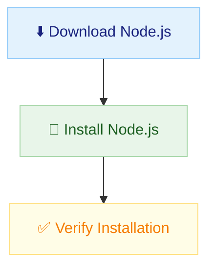
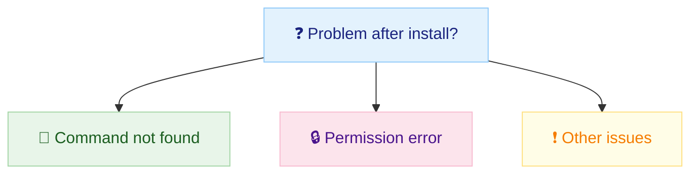
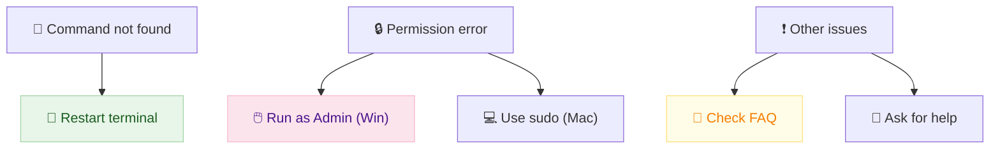
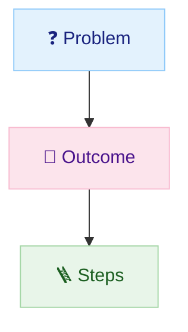
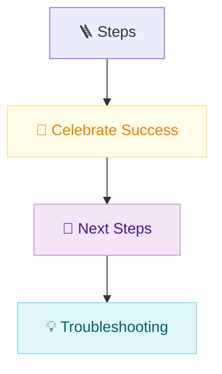
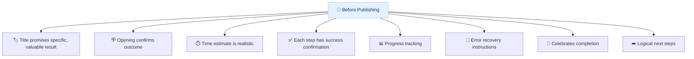
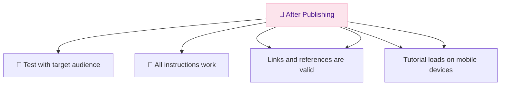

# Build Your First Actionable Tutorial: From Broken to Brilliant in 20 Minutes

> **TL;DR:** This guide shows you how to create tutorials people actually finish—fast. You'll build a real, actionable example (install Node.js), get a reusable template, and a quality checklist. Skip to the template at the end if you're in a hurry.

> **Your readers abandon tutorials because they're boring information dumps. Let's fix that by building a working example together.**

## The Problem: 89% Tutorial Abandonment

Most tutorials fail because they teach ABOUT doing instead of actually DOING.

**Today we fix this by building a real tutorial step-by-step.**

## 🎯 What You'll Build

**In 20 minutes, you'll create:**

- ✅ A working "Install Node.js" tutorial using the ACTION framework

- ✅ All the templates you need for future tutorials
- ✅ A checklist to ensure every tutorial succeeds

---

### 🛣️ Tutorial Creation Journey

```mermaid
flowchart LR
    style S1 fill:#e3f2fd,stroke:#90caf9,color:#1a237e
    style S2 fill:#fce4ec,stroke:#f8bbd0,color:#4a148c
    style S3 fill:#e8f5e9,stroke:#a5d6a7,color:#1b5e20
    style S4 fill:#fffde7,stroke:#ffe082,color:#f57c00
    style S5 fill:#f3e5f5,stroke:#ce93d8,color:#4a148c
    style S6 fill:#e0f7fa,stroke:#80deea,color:#006064
    S1["📄 Create File"]
    S2["🪝 Add Anchor"]
    S3["📈 Track Progress"]
    S4["🎉 Celebrate Success"]
    S5["💡 Troubleshooting"]
    S6["🧪 Test Tutorial"]
    S1 --> S2 --> S3 --> S4 --> S5 --> S6
```




*This roadmap shows the 6 actionable steps you’ll take to build your tutorial, each with a pastel color for clarity and motivation.*

---

**⏱️ Time:** 20 minutes  
**📊 Difficulty:** Beginner  
**🔧 Prerequisites:** Text editor and basic writing experience

---

## 🚀 The ACTION Framework (Learn by Doing)

We'll build our Node.js tutorial using the ACTION framework:

- **A**nchor with Real Problems
- **C**larify the Exact Outcome  
- **T**rack Progress Visibly
- **I**mplement Step-by-Step
- **O**ptimize the Learning Path
- **N**avigate Forward


**Let's build this tutorial together right now.**

---

### 🗺️ ACTION Framework Overview

```mermaid
flowchart LR
    style A fill:#e3f2fd,stroke:#90caf9,color:#1a237e
    style C fill:#fce4ec,stroke:#f8bbd0,color:#4a148c
    style T fill:#e8f5e9,stroke:#a5d6a7,color:#1b5e20
    style I fill:#fffde7,stroke:#ffe082,color:#f57c00
    style O fill:#f3e5f5,stroke:#ce93d8,color:#4a148c
    style N fill:#e0f7fa,stroke:#80deea,color:#006064
    A["🪝 Anchor"]
    C["🔍 Clarify Outcome"]
    T["📈 Track Progress"]
    I["🛠️ Implement Steps"]
    O["✨ Optimize Path"]
    N["🧭 Navigate Forward"]
    A --> C --> T --> I --> O --> N
```




*Each step is color-coded for clarity and visual appeal. Pastel backgrounds with dark text ensure readability and a professional look.*


## Step 1: Create Your Tutorial File (2 minutes)

**✅ Action:** Create a new file called `install-nodejs.md`

Open your text editor and create a new file. We'll build this tutorial step by step.

### 🎯 Progress: 1/6 steps complete | ⏱️ 2 minutes elapsed

---

## Step 2: Add the Anchor (3 minutes)

**✅ Action:** Copy this opening to your file:

```markdown
# Fix "Command Not Found" Errors: Install Node.js in 5 Minutes

> **Your JavaScript code won't run because Node.js isn't installed. Let's fix that right now.**

## The Problem

You're trying to run `npm install` or `node app.js` but getting "command not found" errors.

**Root cause:** Node.js isn't installed on your system.

## 🎯 What You'll Get

**In 5 minutes, you'll have:**
- ✅ Node.js installed and working
- ✅ npm package manager ready to use  
- ✅ Ability to run any JavaScript project

**⏱️ Time:** 5 minutes  
**📊 Difficulty:** Beginner  
**🔧 Prerequisites:** Computer with internet connection
```

<sub>**Why this works:** Starts with a real problem and promises a concrete outcome—so readers know exactly what they'll get.</sub>

### 🎯 Progress: 2/6 steps complete | ⏱️ 5 minutes elapsed

---

## Step 3: Add Progress Tracking (2 minutes)

**✅ Action:** Add this progress section to your tutorial:

```markdown
---


## 🚀 Quick Install




*This diagram summarizes the three key steps for installing Node.js, using pastel colors for clarity and a professional look.*

### Step 1: Download Node.js
**🎯 Progress: 1/3 steps | ⏱️ 2 minutes remaining**

1. Go to [nodejs.org](https://nodejs.org)
2. Click the green "LTS" download button
3. Save the installer file

**✅ Success Check:** You should see a `.msi` (Windows) or `.pkg` (Mac) file in your Downloads folder

### Step 2: Install Node.js  
**🎯 Progress: 2/3 steps | ⏱️ 1 minute remaining**

1. Double-click the downloaded installer
2. Click "Next" through all prompts (defaults are fine)
3. Click "Install" and wait for completion

**✅ Success Check:** Installation should complete without errors

### Step 3: Verify Installation
**🎯 Progress: 3/3 steps | ⏱️ 30 seconds remaining**

1. Open Terminal (Mac) or Command Prompt (Windows)
2. Type `node --version` and press Enter
3. Type `npm --version` and press Enter

**✅ Success Check:** You should see version numbers like:

```text
v18.17.0
9.6.7
```

**🚨 If not working:** See troubleshooting below

```markdown

<sub>**Why this works:** Progress is visible and every step has a quick success check—so users never feel lost.</sub>

### 🎯 Progress: 3/6 steps complete | ⏱️ 10 minutes elapsed

---

## Step 4: Add Success Celebration (1 minute)

**✅ Action:** Add the completion section:

```markdown
---

## 🎉 You Did It!

**Congratulations!** Node.js is now installed and ready to use.

**You can now:**
- Run JavaScript files with `node filename.js`  
- Install packages with `npm install package-name`
- Start any JavaScript project

## 🚀 What's Next?

Ready to build something? Try these:
- **[Build Your First Web Server](build-web-server.md)** (10 minutes)
- **[Create a REST API](create-rest-api.md)** (20 minutes)  
- **[Deploy to Production](deploy-nodejs-app.md)** (15 minutes)
```

<sub>**Why this works:** Celebrates success and gives readers a reason to keep going.</sub>

### 🎯 Progress: 4/6 steps complete | ⏱️ 12 minutes elapsed

---

## Step 5: Add Troubleshooting (2 minutes)

**✅ Action:** Add this troubleshooting section:

```markdown
---


## 💡 Troubleshooting






*This decision tree helps users quickly find the right troubleshooting step, with pastel colors for clarity and calm.*

### "Command not found" after installation

**Problem:** Terminal doesn't recognize `node` command  
**Solution:** Restart your terminal and try again

### Permission errors during installation

**Problem:** "Access denied" or permission errors  
**Solution:** Right-click installer and "Run as Administrator" (Windows) or use `sudo` (Mac)

### Still having issues?

- **Check our FAQ:** [common-nodejs-issues.md](common-nodejs-issues.md)
- **Get help:** (Add your real support link here)
```

<sub>**Why this works:** Anticipates common problems and provides quick solutions—no dead ends.</sub>

### 🎯 Progress: 5/6 steps complete | ⏱️ 15 minutes elapsed

---

## Step 6: Test Your Tutorial (3 minutes)

**✅ Action:** Read through your complete tutorial and check:

- [ ] Does it solve a specific problem?
- [ ] Are the outcomes clearly defined?
- [ ] Can someone follow it without getting lost?
- [ ] Does each step have a success check?
- [ ] Is there a clear next step?

**✅ Success Check:** Your tutorial should be scannable in 5 seconds and actionable in 5 minutes.

### 🎯 Progress: 6/6 steps complete | ⏱️ 18 minutes elapsed

---

## 🎉 Congratulations! You Built an Actionable Tutorial

**You now have:**

- ✅ A working tutorial that follows the ACTION framework
- ✅ A template you can reuse for any topic
- ✅ The skills to create tutorials people actually complete

## 🔧 Your Tutorial Template


Use this template for your next tutorial:






*This block diagram shows the essential sections of a great tutorial, each with a pastel color for clarity and structure.*

```markdown
# [Fix Specific Problem]: [Achieve Outcome] in [Time]

> **[Pain point]. Let's fix that right now.**

## The Problem
[Specific issue they're facing]

## 🎯 What You'll Get
- ✅ [Concrete deliverable 1]
- ✅ [Concrete deliverable 2] 
- ✅ [Concrete deliverable 3]

**⏱️ Time:** [Realistic estimate]
**📊 Difficulty:** [Clear level]
**🔧 Prerequisites:** [Specific requirements]

---

## 🚀 Quick [Action]

### Step 1: [Action Verb] [Specific Task]
**🎯 Progress: 1/X steps | ⏱️ X minutes remaining**

[Clear instructions]

**✅ Success Check:** [What they should see/experience]

### Step 2: [Action Verb] [Specific Task]  
**🎯 Progress: 2/X steps | ⏱️ X minutes remaining**

[Clear instructions]

**✅ Success Check:** [What they should see/experience]

---

## 🎉 You Did It!
[Celebration + summary]

## 🚀 What's Next?
- [Related tutorial 1]
- [Related tutorial 2]
- [Advanced topic]

---

## 💡 Troubleshooting
[Common issues and solutions]
```

## ✅ Quality Checklist


Use this checklist for every tutorial:





*This checklist diagram visually reinforces the key quality checks before and after publishing, using pastel colors for clarity and motivation.*


**Before Publishing (must-have):**
- [ ] **Title promises a specific, valuable result**
- [ ] **Opening paragraph confirms the outcome**  
- [ ] **Each step has a clear success check**
- [ ] **Progress tracking every few minutes**
- [ ] **Celebrates completion**
- [ ] Provides logical next steps
- [ ] Time estimate is realistic
- [ ] Clear error recovery instructions


**After Publishing:**
- [ ] Test with someone from target audience
- [ ] All instructions actually work
- [ ] Links and references are valid
- [ ] Tutorial loads on mobile devices

## 🚀 What's Next?

**Immediate Actions (Next 24 hours):**

1. **Use your template** to create one more tutorial
2. **Test it** with a colleague or friend
3. **Share it** and gather feedback

**This Week:**

1. **Build 3 tutorials** using this framework
2. **Create a tutorial series** that builds on each other
3. **Start measuring** completion rates and feedback

---

**💡 Remember:** The best tutorial enables immediate success and builds confidence for continued learning.

Your tutorials should leave readers thinking: *"That was easier than I expected, and I actually built something that works!"*

**Now go create tutorials that change lives, one actionable step at a time.** 🚀
