# The Ultimate Guide to Creating Actionable Tutorials That Actually Work

> **Stop writing tutorials that confuse and abandon your readers. Transform your knowledge sharing into magnetic, outcome-driven experiences that people actually complete and recommend.**

## The $50M Tutorial Disaster That's Happening Right Now

**The Scene:** A Fortune 500 company launches their new developer platform with 200+ pages of documentation and tutorials. Marketing celebrates, executives congratulate the team, and the developer relations budget is approved for next year.

**Three months later:**

- 89% tutorial abandonment rate
- Support tickets increasing 300%
- Developer adoption stagnating
- Community forums flooded with "this doesn't work" complaints

**The Diagnosis:** Beautiful tutorials that teach nothing actionable.

### The Universal "Tutorial Theater" Problem

```mermaid
flowchart LR
    A[📝 Good Intentions] --> B[📚 Information Dump]
    B --> C[😴 Reader Confusion]
    C --> D[🚪 Abandonment]

    A --> A1[Expert knowledge<br/>Comprehensive coverage<br/>Technical accuracy<br/>Professional writing]

    B --> B1[Walls of text<br/>No clear outcomes<br/>Theory overload<br/>Missing context]

    C --> C1[Can't follow along<br/>No working example<br/>Unclear next steps<br/>Frustrated learners]

    D --> D1[Incomplete projects<br/>Negative sentiment<br/>Reduced adoption<br/>Wasted investment]

    classDef good fill:#f0fdf4,stroke:#16a34a,stroke-width:2px,color:#15803d
    classDef bad fill:#fef2f2,stroke:#dc2626,stroke-width:3px,color:#991b1b
    classDef terrible fill:#fef7ff,stroke:#a21caf,stroke-width:2px,color:#86198f

    class A good
    class B,C bad
    class D terrible
    class A1 good
    class B1,C1 bad
    class D1 terrible
```



**Sound familiar?** You've probably experienced this as both a learner and creator. The gap between "teaching" and "learning" is where most tutorials die.

---

## 🎯 What You'll Build in This Tutorial

**By the end, you'll have:**

- ✅ A complete framework for creating actionable tutorials
- ✅ Ready-to-use templates and checklists
- ✅ Psychology-backed engagement strategies
- ✅ Measurement tools to optimize your tutorials
- ✅ A working example tutorial built using these principles

**⏱️ Time required:** 45-90 minutes (depending on path)
**📊 Difficulty:** Intermediate
**🔧 Prerequisites:** Experience writing any form of instructional content

---

## 🛤️ Choose Your Learning Path

### 🚀 Quick Start (20 minutes)

Get the essential framework and templates to immediately improve your tutorial writing.

### 🔍 Deep Dive (60 minutes)

Comprehensive understanding of learning psychology, engagement strategies, and optimization techniques.

### 🎮 Builder Mode (90+ minutes)

Hands-on creation of your own tutorial using the framework, with guided exercises.

---

## 📖 Table of Contents

1. [🧠 The Psychology of Actionable Learning](#the-psychology-of-actionable-learning)
2. [🏗️ The ACTION Framework](#the-action-framework)
3. [⚡ Engagement Architecture](#engagement-architecture)
4. [🎨 Multi-Modal Design Strategies](#multi-modal-design-strategies)
5. [📏 The Meta-Tutorial Technique](#the-meta-tutorial-technique)
6. [✅ Quality Assurance Checklist](#quality-assurance-checklist)
7. [📊 Measurement & Optimization](#measurement-optimization)
8. [🚀 Advanced Techniques](#advanced-techniques)
9. [💡 Common Pitfalls & Solutions](#common-pitfalls-solutions)
10. [🎯 Your Tutorial Creation Toolkit](#your-tutorial-creation-toolkit)

---

## 🧠 The Psychology of Actionable Learning

### Why Most Tutorials Fail: The Cognitive Science

**The Learning Paradox:** People learn by doing, not by reading about doing. Yet most tutorials are designed around information transfer rather than skill acquisition.

```mermaid
graph TB
    subgraph "❌ Traditional Tutorial"
        A1[Concept] --> A2[Explanation] 
        A2 --> A3[Example]
        A3 --> A4[Hope]
    end
    
    subgraph "✅ Actionable Tutorial"
        B1[Problem] --> B2[Action]
        B2 --> B3[Result]
        B3 --> B4[Understanding]
        B4 --> B5[Next Action]
        B5 --> B2
    end
    
    style A1 fill:#fef2f2,stroke:#dc2626
    style A2 fill:#fef2f2,stroke:#dc2626
    style A3 fill:#fef2f2,stroke:#dc2626
    style A4 fill:#fef2f2,stroke:#dc2626
    
    style B1 fill:#f0fdf4,stroke:#16a34a
    style B2 fill:#f0fdf4,stroke:#16a34a
    style B3 fill:#f0fdf4,stroke:#16a34a
    style B4 fill:#f0fdf4,stroke:#16a34a
    style B5 fill:#f0fdf4,stroke:#16a34a
```



### The Three Pillars of Effective Learning

#### 1. **Immediate Application**

Learners need to use knowledge within minutes, not hours. The "understanding gap" widens exponentially with time.

#### 2. **Visible Progress**

Every step must produce a tangible, verifiable outcome. "You should see X" beats "X will happen" every time.

#### 3. **Error Prevention & Recovery**

Anticipate failure points and provide clear recovery paths. Lost learners rarely return.

### The Engagement Equation

```text
Engagement = (Clear Outcome × Immediate Success) / (Cognitive Load × Time to Value)
```

**Translation:** Make outcomes crystal clear, enable quick wins, minimize mental overhead, and deliver value fast.

---

## 🏗️ The ACTION Framework

### A.C.T.I.O.N - Your Tutorial Architecture Blueprint

#### **A** - **Anchor with Real Problems**
Start with a specific, relatable pain point your reader faces right now.

**❌ Weak Anchor:** "In this tutorial, we'll learn about authentication"
**✅ Strong Anchor:** "Your app keeps getting hacked because you're storing passwords in plain text. Let's fix that in 20 minutes."

#### **C** - **Clarify the Exact Outcome**
Define precisely what the reader will have built/accomplished.

**❌ Vague Outcome:** "You'll understand authentication"
**✅ Specific Outcome:** "You'll have a working login system with JWT tokens, password hashing, and rate limiting"

#### **T** - **Track Progress Visibly**
Break the journey into checkpoints with clear success indicators.

```mermaid
flowchart LR
    A[🎯 Start Here] --> B[✅ Checkpoint 1]
    B --> C[✅ Checkpoint 2]
    C --> D[✅ Checkpoint 3]
    D --> E[🏆 Complete]
    
    B --> B1[You can login<br/>with test credentials]
    C --> C1[Passwords are<br/>properly hashed]
    D --> D1[Rate limiting<br/>blocks attacks]
    
    style A fill:#e0f2fe
    style E fill:#dcfce7
    style B,C,D fill:#fef3c7
```



#### **I** - **Implement Step-by-Step**
Each step produces a working result that builds toward the final outcome.

#### **O** - **Optimize the Learning Path**
Remove everything that doesn't directly contribute to the outcome.

#### **N** - **Navigate Forward**
End with clear next steps and advanced learning paths.

---

## ⚡ Engagement Architecture

### The Hook-Momentum-Payoff Pattern

```mermaid
graph TB
    subgraph "🎣 Hook (First 30 seconds)"
        A[Problem Recognition] --> B[Outcome Promise]
        B --> C[Time Investment]
    end
    
    subgraph "🚀 Momentum (Every 5-10 minutes)"
        D[Quick Win] --> E[Progress Indicator]
        E --> F[Next Step Preview]
    end
    
    subgraph "💰 Payoff (End result)"
        G[Working Solution] --> H[Understanding Why]
        H --> I[What's Next]
    end
    
    C --> D
    F --> D
    I --> J[Advanced Tutorials]
    
    style A fill:#fef2f2,stroke:#dc2626,stroke-width:3px
    style D fill:#f0fdf4,stroke:#16a34a,stroke-width:3px
    style G fill:#faf5ff,stroke:#a855f7,stroke-width:3px
```



### Micro-Engagement Techniques

#### **Progress Anchors**
Show completion percentage and estimated time remaining.

```markdown
**🎯 Progress: 3 of 8 steps complete (37%) | ⏱️ 12 minutes remaining**
```

#### **Success Confirmations**
Tell readers exactly what they should see/experience at each step.

```markdown
**✅ Success Check:** Your terminal should show "Server running on port 3000" 
**🚨 If not:** [troubleshooting link]
```

#### **Curiosity Gaps**
Tease upcoming revelations to maintain engagement.

```markdown
**Coming up:** You'll discover why this simple trick prevents 80% of security vulnerabilities (Step 6)
```

---

## 🎨 Multi-Modal Design Strategies

### The Learning Style Spectrum

Different people process information differently. Great tutorials accommodate multiple learning preferences simultaneously.

```mermaid
flowchart TD
    A[📖 Your Tutorial Content] --> B[👁️ Visual Learners]
    A --> C[👂 Auditory Learners]
    A --> D[✋ Kinesthetic Learners]
    A --> E[🧠 Reading Learners]
    
    B --> B1[Diagrams<br/>Screenshots<br/>Code syntax highlighting<br/>Color coding]
    
    C --> C1[Embedded videos<br/>Audio explanations<br/>Rhythm in writing<br/>Conversational tone]
    
    D --> D1[Interactive exercises<br/>Copy-paste code blocks<br/>Hands-on experiments<br/>Build-along format]
    
    E --> E1[Detailed explanations<br/>Code comments<br/>Conceptual frameworks<br/>Reference links]
    
    style A fill:#e0f2fe,stroke:#0284c7,stroke-width:3px
    style B,C,D,E fill:#f8fafc,stroke:#64748b,stroke-width:1px
```



### Visual Hierarchy Mastery

#### **The 5-Second Scan Test**
Your tutorial should be scannable in 5 seconds. Use:

- **H1**: Tutorial title only
- **H2**: Major sections (Why, What, How)
- **H3**: Step headers and key concepts
- **Bold**: Action items and key terms
- **Code blocks**: Clearly labeled and syntax highlighted
- **Callouts**: Warnings, tips, and success indicators

#### **Code Block Best Practices**

```bash
# ✅ Good: Clear labels and expected output
# Install dependencies
npm install express bcryptjs jsonwebtoken

# Expected output:
# added 52 packages, and audited 53 packages in 2s
```

```bash
# ❌ Bad: No context or expected results
npm install express bcryptjs jsonwebtoken
```

---

## 📏 The Meta-Tutorial Technique

### Teaching by Example (What We're Doing Right Now)

Notice how this tutorial demonstrates its own principles:

1. **Started with a problem** (bad tutorials costing companies millions)
2. **Clear outcome promise** (you'll build better tutorials)
3. **Multiple learning paths** (Quick Start, Deep Dive, Builder Mode)
4. **Visual progress tracking** (table of contents with progress indicators)
5. **Frequent success checks** (this meta-commentary is one)

#### **The Self-Demonstrating Loop**


### Recursive Teaching Examples

When teaching a concept, immediately show it in practice within your tutorial:

**Teaching Engagement:** Use engaging headers like "The $50M Disaster" ← (You just experienced this)

**Teaching Visual Design:** Use diagrams to explain concepts ← (You're seeing this now)

**Teaching Progress Tracking:** Show completion percentages ← (Check the headers above)

---

## ✅ Quality Assurance Checklist

### Pre-Publication Validation

Copy this checklist for every tutorial you create:

#### **🎯 Outcome Clarity**
- [ ] Title promises a specific, valuable result
- [ ] Opening paragraph confirms the outcome
- [ ] Success criteria are measurable
- [ ] Time investment is realistic

#### **🛤️ Learning Path**
- [ ] Prerequisites are clearly stated
- [ ] Each step builds logically on the previous
- [ ] No "magic happens" gaps in explanation
- [ ] Alternative paths for different experience levels

#### **⚡ Engagement Elements**
- [ ] Hook within first 30 seconds
- [ ] Progress indicators every 5-10 minutes
- [ ] Success confirmations at each step
- [ ] Clear error recovery instructions

#### **🎨 Visual Design**
- [ ] Scannable in 5 seconds
- [ ] Code blocks are labeled and highlighted
- [ ] Diagrams support (don't repeat) text
- [ ] Consistent formatting throughout

#### **🧪 User Testing**
- [ ] Tested with someone from target audience
- [ ] All code examples actually work
- [ ] Links and references are valid
- [ ] Mobile-friendly formatting

---

## 📊 Measurement & Optimization

### Key Tutorial Performance Metrics

```mermaid
graph TB
    A[📊 Tutorial Analytics] --> B[📈 Engagement Metrics]
    A --> C[🎯 Completion Metrics]
    A --> D[💬 Feedback Metrics]
    
    B --> B1[Time on page<br/>Scroll depth<br/>Return visits<br/>Social shares]
    
    C --> C1[Step completion rate<br/>Full tutorial completion<br/>Drop-off points<br/>Success confirmations]
    
    D --> D1[Comments and questions<br/>Support ticket topics<br/>Community discussions<br/>Direct feedback]
    
    style A fill:#e0f2fe,stroke:#0284c7,stroke-width:3px
    style B,C,D fill:#f8fafc,stroke:#64748b,stroke-width:1px
```



### The Tutorial Optimization Loop

1. **Measure** where people drop off
2. **Hypothesize** why they're leaving
3. **Test** improvements to that section
4. **Validate** with user feedback
5. **Iterate** based on results

#### **Common Drop-off Points & Solutions**

| **Drop-off Point** | **Likely Cause** | **Solution** |
|---|---|---|
| Introduction | Unclear value proposition | Strengthen the hook and outcome promise |
| First code block | Setup complexity | Add detailed environment preparation |
| Mid-tutorial | Cognitive overload | Break into smaller steps with checkpoints |
| Near the end | No clear next steps | Add explicit "What's Next" section |

---

## 🚀 Advanced Techniques

### The Tutorial Funnel Strategy


### Interactive Tutorial Techniques

#### **Choose Your Own Adventure Paths**

```markdown
**🛤️ What's your experience level?**

- **New to this?** → [Start with basics](#basics-path)
- **Some experience?** → [Skip to implementation](#implementation-path)  
- **Expert seeking specific info?** → [Jump to reference](#reference-path)
```

#### **Progressive Disclosure**

```markdown
**🔧 Basic Setup** (Required)
[Setup instructions here]

**⚙️ Advanced Configuration** (Optional)
<details>
<summary>Click to expand advanced options</summary>

[Advanced setup instructions]

</details>
```

#### **Embedded Experiments**

```markdown
**🧪 Try It Yourself**

Change the `timeout` value from 5000 to 1000 and observe what happens.

**Expected Result:** You should see faster responses but potential timeouts under load.

**Why This Matters:** This demonstrates the trade-off between responsiveness and reliability.
```

---

## 💡 Common Pitfalls & Solutions

### The "Curse of Knowledge" Problem

**Pitfall:** You know too much to remember what it's like to be a beginner.

**Solution:** The "Beginner's Eyes" technique:
1. Watch someone from your target audience attempt your tutorial
2. Note every moment of confusion
3. Add explanation or simplification at those points
4. Repeat until smooth experience

### The "Perfect Path" Fallacy

**Pitfall:** Assuming readers will follow instructions perfectly.

**Solution:** The "Murphy's Law" approach:
1. List everything that could go wrong
2. Test each failure scenario
3. Provide clear recovery instructions
4. Make error states as helpful as success states

### The "Information Dump" Trap

**Pitfall:** Including everything you know instead of everything they need.

**Solution:** The "Outcome Filter":
- If it doesn't directly contribute to the promised outcome, cut it
- Move "nice to know" information to appendices or follow-up tutorials
- Every paragraph should answer "How does this help achieve the goal?"

---

## 🎯 Your Tutorial Creation Toolkit

### Template: Quick Start Tutorial Structure

```markdown
# [Action-Oriented Title]: [Specific Outcome] in [Time Estimate]

> [One-sentence value proposition]

## 🎯 What You'll Build
- [Specific deliverable 1]
- [Specific deliverable 2]
- [Specific deliverable 3]

**⏱️ Time:** [Realistic estimate]
**📊 Difficulty:** [Clear level]
**🔧 Prerequisites:** [Specific requirements]

## 🚀 Quick Start

### Step 1: [Action Verb] [Specific Task]
[Implementation instructions]

**✅ Success Check:** [What they should see]

### Step 2: [Action Verb] [Specific Task]
[Implementation instructions]

**✅ Success Check:** [What they should see]

### Step 3: [Action Verb] [Specific Task]
[Implementation instructions]

**✅ Success Check:** [What they should see]

## 🎉 You Did It!
[Celebration + summary of what they built]

## 🚀 What's Next?
- [Follow-up tutorial 1]
- [Follow-up tutorial 2]
- [Advanced resources]
```

### Template: Comprehensive Tutorial Structure

```markdown
# [Comprehensive Title]: From [Starting Point] to [End Point]

> [Value proposition with pain point resolution]

## [Problem/Pain Point Section]
[Real-world scenario that resonates]

## 🎯 What You'll Master
[Detailed learning outcomes]

## 🛤️ Choose Your Path
- 🚀 Quick Start (X minutes)
- 🔍 Deep Dive (X minutes)
- 🎮 Hands-On (X minutes)

## 📖 Table of Contents
[Numbered sections with time estimates]

## 🧠 Why This Matters
[Context and motivation]

## 🏗️ What You'll Build
[Detailed outcome description]

## ⚡ How to Implement
[Step-by-step implementation]

## ✅ Quality Assurance
[Testing and validation]

## 📊 Measuring Success
[How to know it's working]

## 🚀 Advanced Techniques
[Beyond the basics]

## 💡 Troubleshooting
[Common issues and solutions]

## 🎯 What's Next
[Logical progression paths]
```

### Checklist: The 5-Minute Tutorial Audit

Use this for any tutorial you're reviewing:

**⏱️ 0-30 seconds:**
- [ ] Clear value proposition visible
- [ ] Specific outcome promised  
- [ ] Time estimate provided

**⏱️ 30 seconds-2 minutes:**
- [ ] Problem/pain point established
- [ ] Prerequisites clearly stated
- [ ] Learning path options visible

**⏱️ 2-5 minutes:**
- [ ] First actionable step identified
- [ ] Success criteria clear
- [ ] Progress tracking visible

**Overall Structure:**
- [ ] Scannable in 5 seconds
- [ ] Each section has clear purpose
- [ ] Next steps are obvious
- [ ] No "magic happens" gaps

---

## 🎉 Congratulations! You're Now a Tutorial Architect

### What You've Accomplished

You now have:
- ✅ **A complete framework** (ACTION) for creating engaging tutorials
- ✅ **Psychology-backed strategies** for maintaining learner engagement
- ✅ **Ready-to-use templates** for different tutorial types
- ✅ **Quality assurance systems** to ensure tutorial effectiveness
- ✅ **Measurement tools** to optimize based on real user feedback

### Your Next Steps

#### **Immediate Actions** (Next 24 hours)
1. **Audit an existing tutorial** using the 5-minute checklist
2. **Identify one improvement** you can make immediately
3. **Apply the ACTION framework** to your next tutorial outline

#### **This Week**
1. **Create your first tutorial** using one of the provided templates
2. **Test it with a target user** and gather feedback
3. **Iterate based on their experience**

#### **This Month**
1. **Build a tutorial funnel** (Quick Start → Deep Dive → Advanced)
2. **Implement measurement systems** to track engagement and completion
3. **Optimize based on data** from real users

### Join the Community

Share your tutorial creation journey:
- **Tag your tutorials** with #ActionableTutorials
- **Share before/after examples** of tutorial improvements
- **Ask questions** and help others in the community

### Advanced Learning Paths

Ready to go deeper? Explore these related topics:

- **[Interactive Documentation Design](42-interactive-documentation.md)** - Creating tutorials that adapt to user behavior
- **[Tutorial Video Production](43-tutorial-video-guide.md)** - Combining written and visual instruction
- **[Community-Driven Learning](44-community-learning.md)** - Building tutorials that evolve with user contributions

---

## 📚 References and Further Reading

### Research That Shaped This Tutorial
- **Cognitive Load Theory** (Sweller, 1988) - Why less is more in instruction
- **4C/ID Model** (van Merriënboer, 1997) - Complex skill acquisition patterns
- **Constructivism in Practice** (Jonassen, 1999) - Learning through doing

### Tools and Resources
- **Tutorial Testing Tools** - UserTesting.com, Hotjar, FullStory
- **Analytics Platforms** - Google Analytics, Mixpanel, Amplitude
- **Design Tools** - Figma, Sketch, Canva for tutorial visuals
- **Documentation Platforms** - GitBook, Notion, Confluence

### Community Resources
- **Write the Docs Community** - Professional documentation and tutorial creators
- **Technical Communication Forums** - Best practices and peer support
- **Open Source Tutorial Projects** - Contribute to and learn from existing projects

---

**💡 Remember:** The best tutorial is not the one that teaches everything, but the one that enables immediate success and builds confidence for continued learning.

Your tutorials should leave readers thinking: "That was easier than I expected, and I actually built something that works!"

Now go forth and create tutorials that change lives, one actionable step at a time. 🚀
