# Build a GitLab CI/CD Pipeline for Multi-Arch Docker to AWS ECR: From Zero to Push in 30 Minutes

> **TL;DR:** This tutorial guides you step-by-step to build a GitLab pipeline that builds Docker images for multiple architectures and publishes them to AWS ECR. You’ll get a working example, a reusable template, and a troubleshooting checklist. Skip to the template at the end if you’re in a hurry.

> **Most DevOps guides are too abstract or skip real-world issues. Here, you’ll build a working pipeline, see every command, and learn how to avoid common pitfalls.**

## The Problem: Multi-Arch Docker Delivery is Hard

Building and publishing Docker images for multiple architectures (x86, ARM) is essential for modern cloud and edge deployments—but it’s easy to get stuck on CI/CD, authentication, or manifest issues.

**Today you’ll build a real pipeline that works, with all the gotchas explained.**

## 🎯 What You’ll Build

**In 30 minutes, you’ll create:**

- ✅ A working GitLab pipeline that builds and pushes multi-arch Docker images to AWS ECR
- ✅ A template you can reuse for any Docker project
- ✅ A troubleshooting checklist for common CI/CD and ECR errors

---

**⏱️ Time:** 30 minutes  
**📊 Difficulty:** Intermediate  
**🔧 Prerequisites:** GitLab and AWS accounts, Docker, AWS CLI, basic CI/CD knowledge
# 🚀 Solution Overview: Your Multi-Arch Docker Pipeline at a Glance

Before you dive in, here’s what you’ll build and how all the pieces fit together.

---

## 🛣️ High-Level Architecture

```mermaid
flowchart LR
    A["📝 GitLab Repo"] --> B["⚙️ GitLab CI/CD Pipeline"]
    B --> C["🐳 Docker Buildx (Multi-Arch)"]
    C --> D["☁️ AWS ECR (Container Registry)"]
    D --> E["🚀 Deploy Anywhere (Cloud, Edge, ARM, x86)"]
    style A fill:#e3f2fd,stroke:#90caf9,color:#1a237e
    style B fill:#fce4ec,stroke:#f8bbd0,color:#4a148c
    style C fill:#e8f5e9,stroke:#a5d6a7,color:#1b5e20
    style D fill:#fffde7,stroke:#ffe082,color:#f57c00
    style E fill:#e0f7fa,stroke:#80deea,color:#006064
```



*This diagram shows the flow: code → CI/CD → multi-arch build → ECR → deploy anywhere.*

---

## What This Pipeline Solves

- **Automates** multi-architecture Docker builds (x86, ARM)
- **Pushes** images to AWS ECR securely
- **Works** with any GitLab project (template provided)
- **Handles** authentication, manifest lists, and common CI/CD pitfalls

---

**By the end, you’ll have a robust, production-ready pipeline you can adapt for any project.**
# Prerequisites and Setup: Get Ready to Build

Before you start, let’s make sure you have everything you need for a smooth experience.

---

## 🧰 What You Need

- **GitLab account** (with permissions to create projects and CI/CD pipelines)
- **AWS account** (with permissions to create ECR repositories and IAM users)
- **Docker** (with Buildx support)
- **AWS CLI** (v2 recommended)
- **GitLab Runner** (if using self-hosted runners)

---

## 🛠️ Step 1: Check Your Tools

Open your terminal and run:

```sh
docker --version
aws --version
git --version
```

If you see version numbers, you’re good to go. If not, install the missing tools:
- [Install Docker](https://docs.docker.com/get-docker/)
- [Install AWS CLI](https://docs.aws.amazon.com/cli/latest/userguide/getting-started-install.html)
- [Install GitLab Runner](https://docs.gitlab.com/runner/install/)

---

## 🛡️ Step 2: Set Up AWS Permissions

1. **Create an IAM user** with programmatic access.
2. **Attach the following policy** (minimum required for ECR push):

```json
{
  "Version": "2012-10-17",
  "Statement": [
    { "Effect": "Allow", "Action": [
      "ecr:GetAuthorizationToken",
      "ecr:BatchCheckLayerAvailability",
      "ecr:CompleteLayerUpload",
      "ecr:GetDownloadUrlForLayer",
      "ecr:InitiateLayerUpload",
      "ecr:PutImage",
      "ecr:UploadLayerPart"
    ], "Resource": "*" },
    { "Effect": "Allow", "Action": ["ecr:CreateRepository"], "Resource": "*" }
  ]
}
```

3. **Save your AWS Access Key ID and Secret Access Key** for use in GitLab CI/CD variables.

---

## 🏷️ Step 3: Create Your ECR Repository

```sh
aws ecr create-repository --repository-name my-multiarch-app
```

---

## 🔒 Security Note

- Adding a user to the `docker` group or running privileged CI jobs grants root-level access. Use with caution and restrict permissions where possible.

---

**✅ Success Check:**
- You can run `docker --version`, `aws --version`, and `git --version` without errors
- You have AWS credentials and an ECR repository ready

*You’re now ready to start building your pipeline!*
# Project Structure: Organize for Success

A clear project structure makes your pipeline easier to build, test, and maintain.

---

## 🗂️ Example Repository Layout

```
my-multiarch-app/
├── .gitlab-ci.yml         # GitLab pipeline definition
├── Dockerfile             # Docker build instructions
├── README.md              # Project overview
└── scripts/
    └── entrypoint.sh      # (Optional) Custom scripts for your app
```

---

## 📄 Key Files Explained

- **.gitlab-ci.yml**: Defines your CI/CD pipeline, jobs, and stages
- **Dockerfile**: Instructions for building your multi-arch Docker image
- **scripts/**: (Optional) Store helper scripts for build or runtime

---

**✅ Success Check:**
- Your repo contains a `.gitlab-ci.yml` and a `Dockerfile` at the root
- Any custom scripts are in a `scripts/` directory

*With this structure, you’re ready to start building your pipeline logic!*
# GitLab CI/CD Pipeline Basics: Your Automation Engine

Let’s break down how GitLab CI/CD works and set up a minimal pipeline to get you started.

---

## 🧩 What is `.gitlab-ci.yml`?

This file defines your pipeline: stages, jobs, and the order they run. It lives at the root of your repo.

---

## 🏗️ Minimal Working Example

```yaml
stages:
  - build

build-image:
  stage: build
  image: docker:24.0.5
  services:
    - docker:24.0.5-dind
  variables:
    DOCKER_DRIVER: overlay2
    DOCKER_TLS_CERTDIR: "/certs"
  before_script:
    - docker info
  script:
    - docker build -t my-multiarch-app .
```

---

## 🏃 Runners: Shared vs. Custom

- **Shared runners**: Provided by GitLab.com, easy to use, but may have restrictions
- **Custom runners**: You control the environment, required for advanced features (like privileged mode or custom Docker)

---

## ⚠️ Best Practices

- **Pin Docker image versions** (e.g., `docker:24.0.5`) for stability
- **Use the `overlay2` storage driver** for better performance
- **Avoid plaintext secrets**—use GitLab CI/CD variables

---

**✅ Success Check:**
- You have a `.gitlab-ci.yml` with a working build job
- The pipeline runs and builds your Docker image without errors

*You’re now ready to add multi-architecture support!*
# Multi-Architecture Docker Builds: Build Once, Run Anywhere

Modern apps need to run on both x86 and ARM. Here’s how to automate multi-arch builds in your pipeline.

---

## 🌍 Why Multi-Arch?
- Cloud providers and edge devices use different CPU architectures
- One image for all platforms = less maintenance, more reach

---

## 🏗️ Enable Buildx in GitLab CI

Add a setup step in your pipeline to enable Buildx:

```yaml
before_script:
  - docker run --rm --privileged multiarch/qemu-user-static --reset -p yes
  - docker buildx create --use
  - docker buildx inspect --bootstrap
```

---

## 🛠️ Build and Push Multi-Arch Images

Example job in `.gitlab-ci.yml`:

```yaml
build-multiarch:
  stage: build
  image: docker:24.0.5
  services:
    - docker:24.0.5-dind
  variables:
    DOCKER_DRIVER: overlay2
    DOCKER_TLS_CERTDIR: "/certs"
  before_script:
    - docker run --rm --privileged multiarch/qemu-user-static --reset -p yes
    - docker buildx create --use
    - docker buildx inspect --bootstrap
  script:
    - docker buildx build --platform linux/amd64,linux/arm64 -t $IMAGE_TAG --push .
```

---

## 🧪 Validate Your Manifest

After pushing, check your image manifest:

```sh
docker buildx imagetools inspect $IMAGE_TAG
```

You should see both `linux/amd64` and `linux/arm64` listed.

---

## 🛠️ Troubleshooting
- **QEMU errors:** Make sure the QEMU setup step runs before Buildx
- **Missing platforms:** Check your `--platform` flag and Buildx version
- **Build fails on one arch:** Test your Dockerfile on both platforms locally if possible

---

**✅ Success Check:**
- Your pipeline builds and pushes a multi-arch image to your registry
- `docker buildx imagetools inspect` shows both architectures

*You’re now ready to push your images to AWS ECR!*
# AWS ECR Integration: Push Your Images to the Cloud

Now that you can build multi-arch images, let’s push them to AWS ECR for secure, scalable storage and deployment.

---

## 🏷️ Create Your ECR Repository

If you haven’t already:

```sh
aws ecr create-repository --repository-name my-multiarch-app
```

---

## 🔑 Authenticate Docker to ECR

Add this to your pipeline before pushing:

```sh
aws ecr get-login-password --region <your-region> | \
  docker login --username AWS --password-stdin <aws_account_id>.dkr.ecr.<your-region>.amazonaws.com
```

Store your AWS credentials as GitLab CI/CD variables for security.

---

## 🏷️ Tag and Push Your Image

```sh
docker tag my-multiarch-app:latest <aws_account_id>.dkr.ecr.<your-region>.amazonaws.com/my-multiarch-app:latest
docker push <aws_account_id>.dkr.ecr.<your-region>.amazonaws.com/my-multiarch-app:latest
```

For multi-arch, Buildx can push directly:

```sh
docker buildx build --platform linux/amd64,linux/arm64 -t <aws_account_id>.dkr.ecr.<your-region>.amazonaws.com/my-multiarch-app:latest --push .
```

---

## 🧪 Validate Your Image in ECR

- Go to the AWS Console → ECR → your repository
- You should see your image and both architectures in the manifest

---

## 🛠️ Troubleshooting
- **Auth errors:** Double-check AWS credentials and region
- **Push fails:** Ensure your IAM user has ECR permissions
- **Missing manifest:** Confirm you used `--push` with Buildx and the correct tag

---

**✅ Success Check:**
- Your image appears in ECR and is multi-arch
- You can pull and run it from any supported platform

*You’re now ready to automate the entire process in your pipeline!*
# Complete Pipeline Walkthrough: From Code to Cloud

Let’s put it all together—a full GitLab CI/CD pipeline that builds and pushes multi-arch Docker images to AWS ECR.

---

## 📝 Full `.gitlab-ci.yml` Example

```yaml
stages:
  - build
  - push

variables:
  IMAGE_NAME: my-multiarch-app
  IMAGE_TAG: "$CI_REGISTRY_IMAGE:$CI_COMMIT_REF_SLUG"
  ECR_REGISTRY: <aws_account_id>.dkr.ecr.<your-region>.amazonaws.com
  ECR_REPO: $ECR_REGISTRY/$IMAGE_NAME

before_script:
  - apk add --no-cache curl jq
  - docker run --rm --privileged multiarch/qemu-user-static --reset -p yes
  - docker buildx create --use
  - docker buildx inspect --bootstrap

build-multiarch:
  stage: build
  image: docker:24.0.5
  services:
    - docker:24.0.5-dind
  variables:
    DOCKER_DRIVER: overlay2
    DOCKER_TLS_CERTDIR: "/certs"
  script:
    - docker buildx build --platform linux/amd64,linux/arm64 -t $ECR_REPO:$CI_COMMIT_SHORT_SHA --push .

push-to-ecr:
  stage: push
  image: docker:24.0.5
  services:
    - docker:24.0.5-dind
  variables:
    DOCKER_DRIVER: overlay2
    DOCKER_TLS_CERTDIR: "/certs"
  script:
    - aws ecr get-login-password --region <your-region> | docker login --username AWS --password-stdin $ECR_REGISTRY
    - docker pull $ECR_REPO:$CI_COMMIT_SHORT_SHA
    - docker tag $ECR_REPO:$CI_COMMIT_SHORT_SHA $ECR_REPO:latest
    - docker push $ECR_REPO:latest
  only:
    - main
```

---

## 🔍 Explanation
- **Stages:** Separate build and push for clarity and control
- **Variables:** Centralize image names, tags, and registry info
- **before_script:** Prepares QEMU and Buildx for multi-arch builds
- **build-multiarch:** Builds and pushes the multi-arch image to ECR with a commit-specific tag
- **push-to-ecr:** Authenticates to ECR, tags the image as `latest`, and pushes it (only on `main` branch)

---

## 🔐 Secrets Management
- Store AWS credentials as GitLab CI/CD variables (`AWS_ACCESS_KEY_ID`, `AWS_SECRET_ACCESS_KEY`, `AWS_DEFAULT_REGION`)
- Never hardcode secrets in your pipeline or repo

---

## ⚡ Performance & Best Practices
- Use layer caching and registry mirrors for faster builds (optional)
- Pin Docker image versions for reproducibility
- Use least-privilege IAM policies for ECR

---

**✅ Success Check:**
- Your pipeline runs end-to-end, builds, and pushes multi-arch images to ECR
- The `latest` tag is updated only on the main branch

*You now have a production-ready, multi-arch Docker pipeline!*
# Validation and Testing: Make Sure It Works Everywhere

You’ve built and pushed your images—now let’s make sure they work as expected on all platforms.

---

## 🧪 Verify Your Image in AWS ECR
- Go to the AWS Console → ECR → your repository
- Confirm your image is present and lists both `amd64` and `arm64` architectures in the manifest

---

## 🖥️ Test Pull and Run on Multiple Platforms

### On x86 (e.g., your laptop or a cloud VM):
```sh
docker pull <aws_account_id>.dkr.ecr.<your-region>.amazonaws.com/my-multiarch-app:latest
docker run --rm <aws_account_id>.dkr.ecr.<your-region>.amazonaws.com/my-multiarch-app:latest
```

### On ARM (e.g., Raspberry Pi, AWS Graviton):
```sh
docker pull <aws_account_id>.dkr.ecr.<your-region>.amazonaws.com/my-multiarch-app:latest
docker run --rm <aws_account_id>.dkr.ecr.<your-region>.amazonaws.com/my-multiarch-app:latest
```

You should see your app start up successfully on both platforms.

---

## 🛠️ Troubleshooting
- **Image not found:** Double-check your ECR repo and image tag
- **Wrong architecture:** Make sure you used `--platform` and pushed a manifest list
- **Run errors:** Test your Dockerfile locally for both platforms using emulation if needed

---

**✅ Success Check:**
- You can pull and run your image on both x86 and ARM
- The app works as expected on both platforms

*You’re now ready to apply best practices and secure your pipeline!*
# Best Practices and Security: Build with Confidence

A great pipeline is not just functional—it’s secure, efficient, and cost-effective. Here’s how to level up your workflow.

---

## 🔐 Secrets Management
- **Never hardcode secrets** in your repo or pipeline
- Use GitLab CI/CD variables for AWS credentials and other secrets
- Limit variable scope to only the jobs that need them

---

## ⚡ Caching and Performance
- Enable Docker layer caching for faster builds (if your runner supports it)
- Use registry mirrors to avoid Docker Hub rate limits
- Pin Docker image versions for reproducibility

---

## 💸 Cost Considerations
- Monitor GitLab CI/CD build minutes (especially on shared runners)
- Clean up unused ECR images to save storage costs
- Use minimal base images to reduce build and storage size

---

## 🛡️ Security Tips
- Use least-privilege IAM policies for AWS ECR
- Restrict who can trigger pipelines and push to protected branches
- Be cautious with privileged mode and Docker group membership
- Audit pipeline logs and access regularly

---

**✅ Success Check:**
- No secrets are exposed in your repo or logs
- Pipeline runs are fast and cost-effective
- IAM and pipeline permissions follow least-privilege principles

*You’re now ready to wrap up and apply this template to your own projects!*
# Conclusion and Next Steps: Ship with Confidence

Congratulations! You’ve built a robust, production-ready GitLab pipeline for multi-architecture Docker images and AWS ECR.

---

## 🎉 What You’ve Achieved
- Automated multi-arch Docker builds with Buildx and QEMU
- Securely pushed images to AWS ECR
- Validated your images on multiple platforms
- Applied best practices for security, cost, and performance

---

## 🚀 What’s Next?
- Use this template for your next project
- Share your pipeline with your team
- Explore advanced topics: automated tests, deployment to Kubernetes, GitOps

---

## 📄 Reusable Pipeline Template

Copy and adapt the provided `.gitlab-ci.yml` and project structure for any Docker project needing multi-arch support and cloud delivery.

---

## 📚 Further Reading
- [GitLab CI/CD Documentation](https://docs.gitlab.com/ee/ci/)
- [Docker Buildx Guide](https://docs.docker.com/build/buildx/)
- [AWS ECR User Guide](https://docs.aws.amazon.com/AmazonECR/latest/userguide/what-is-ecr.html)

---

**💡 Remember:** The best pipelines are simple, secure, and empower you to deliver anywhere. Keep iterating and share your learnings!
