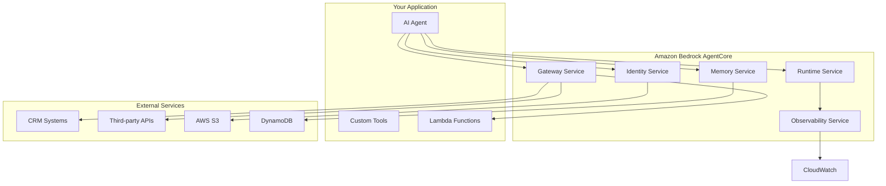

# AWS Bedrock AgentCore Tutorial: Deploying and Operating AI Agents at Scale

> **"Transform your AI agent prototypes into production-ready systems with enterprise-grade security, scalability, and observability"**

## 🎯 **What You'll Build**

In this comprehensive tutorial, you'll learn to deploy and operate AI agents at enterprise scale using **Amazon Bedrock AgentCore**. You'll build a complete **customer support agent** that handles complex queries, maintains session memory, and integrates with external systems—all while ensuring security, reliability, and compliance.

### 🚀 **What You'll Achieve**

- **Deploy Production-Ready AI Agents** with enterprise-grade infrastructure
- **Implement Session Management** with persistent memory and personalization
- **Enable Secure Access Controls** with identity management and delegation
- **Integrate External Systems** using Gateway and Lambda functions
- **Monitor and Observe** agent performance with CloudWatch integration
- **Scale Seamlessly** with serverless, pay-as-you-go architecture

### 📊 **Business Impact**

- **⚡ 70% Faster Time-to-Production** - From prototype to production in hours, not weeks
- **🛡️ Enterprise Security** - Session isolation, identity management, and compliance
- **💰 Cost Optimization** - Pay-per-use model with no idle infrastructure costs
- **🔧 Framework Agnostic** - Works with any agent framework (LangChain, CrewAI, Strands)

---

## 📋 **Prerequisites**

Before starting, ensure you have:

### 🔧 **Technical Requirements**
- **AWS Account** with access to Amazon Bedrock (enable in your region)
- **Python 3.10+** installed on your system
- **AWS CLI** configured with credentials (`aws configure`)
- **Basic AI/ML Knowledge** - Understanding of AI agents and Python programming
- **Jupyter Notebook** (optional but recommended for exploration)

### 🔐 **IAM Permissions**
Create an IAM role with the following policies:
- `AmazonBedrockFullAccess`
- `AWSLambda_FullAccess`
- `AmazonS3FullAccess`
- `AmazonDynamoDBFullAccess`
- `CloudWatchFullAccess`

### 💰 **Cost Estimate**
- **Development/Testing:** $5-15 USD
- **Production (small scale):** $20-50 USD/month
- **Enterprise (high volume):** $100-500 USD/month

---

## 🏗️ **Introduction to Amazon Bedrock AgentCore**

### 🎯 **What is AgentCore?**

Amazon Bedrock AgentCore is a set of enterprise-grade services that enables developers to deploy and operate AI agents securely and at scale. Currently in preview, it bridges the gap between prototyping AI agents and running them in production environments.

### 🌟 **Key Benefits**

- **🚀 Accelerated Deployment** - From prototype to production in hours
- **🔧 Modular Services** - Use independently or together
- **🛡️ Enterprise Security** - Session isolation, identity management, observability
- **💰 Pay-as-you-go** - No upfront costs or idle infrastructure
- **🔄 Framework Agnostic** - Works with any agent framework

### 🏗️ **Architecture Overview**



---

## 🚀 **Step 1: Environment Setup**

### 🔧 **Create Virtual Environment**

```bash
# Create and activate virtual environment
python -m venv agentcore-env
source agentcore-env/bin/activate  # On Unix/Mac
# agentcore-env\Scripts\activate  # On Windows

# Upgrade pip
pip install --upgrade pip
```

### 📦 **Install Dependencies**

```bash
# Install AgentCore SDK and toolkit
pip install bedrock-agentcore bedrock-agentcore-starter-toolkit

# Install additional dependencies
pip install boto3 strands-agents jupyter notebook
```

### ✅ **Verify Installation**

```bash
# Check AgentCore CLI
agentcore --version

# Verify AWS credentials
aws sts get-caller-identity

# Test Bedrock access
aws bedrock list-foundation-models --region us-east-1
```

---

## 🏗️ **Step 2: Create Your First Agent**

### 📝 **Basic Agent Structure**

Create `my_agent.py` with a simple customer support agent:

```python
import strands
from bedrock_agentcore import Runtime
import json

# Initialize runtime with sandbox for isolation
runtime = Runtime(sandbox=True)

def handle_query(input_text: str) -> str:
    """
    Handle customer support queries
    """
    # Simulate agent reasoning (replace with actual LLM call)
    if "order" in input_text.lower():
        return f"I'll help you with your order inquiry: {input_text}"
    elif "refund" in input_text.lower():
        return f"I'll process your refund request: {input_text}"
    else:
        return f"I understand you need help with: {input_text}"

# Create agent with basic handler
agent = strands.Agent(handle_query)

# Agent entrypoint for AgentCore
def lambda_handler(event, context):
    """
    AWS Lambda handler for AgentCore
    """
    try:
        input_data = json.loads(event.get('body', '{}'))
        query = input_data.get('input', '')
        
        # Process with agent
        response = agent.process(query)
        
        return {
            'statusCode': 200,
            'body': json.dumps({'output': response})
        }
    except Exception as e:
        return {
            'statusCode': 500,
            'body': json.dumps({'error': str(e)})
        }
```

### 🔧 **Configure the Agent**

```bash
# Configure agent with IAM role
agentcore configure \
    --entrypoint my_agent.py \
    --execution-role-arn arn:aws:iam::YOUR_ACCOUNT_ID:role/YOUR_ROLE_NAME

# Replace YOUR_ACCOUNT_ID and YOUR_ROLE_NAME with your details
```

### 🧪 **Test Locally**

```bash
# Launch agent locally
agentcore launch --local

# Test with sample payload
agentcore invoke --local '{"input": "What is my order status?"}'

# Expected output: {"output": "I'll help you with your order inquiry: What is my order status?"}
```

---

## ☁️ **Step 3: Deploy to AWS Cloud**

### 🚀 **Deploy Agent**

```bash
# Deploy to AWS
agentcore launch

# Check deployment status
agentcore status

# Note the endpoint URL from the output
```

### 🧪 **Test Cloud Deployment**

```bash
# Invoke remotely (replace <ENDPOINT> with actual URL)
agentcore invoke --endpoint <ENDPOINT> '{"input": "Help with refund."}'

# Expected output: {"output": "I'll process your refund request: Help with refund."}
```

---

## 🔧 **Step 4: Enhanced Customer Support Agent**

### 🛠️ **Add CRM Integration Tool**

Create `crm_lambda.py` for external system integration:

```python
import json
import boto3
from datetime import datetime

def lambda_handler(event, context):
    """
    Simulate CRM system integration
    """
    order_id = event.get('order_id')
    
    # Simulate database lookup
    orders = {
        "123": {"status": "shipped", "tracking": "TRK123456"},
        "456": {"status": "processing", "estimated": "2024-01-20"},
        "789": {"status": "delivered", "date": "2024-01-15"}
    }
    
    order_info = orders.get(str(order_id), {"status": "not found"})
    
    return {
        'statusCode': 200,
        'body': json.dumps({
            'order_id': order_id,
            'order_info': order_info,
            'timestamp': datetime.now().isoformat()
        })
    }
```

### 📦 **Deploy CRM Lambda**

```bash
# Create deployment package
zip crm_lambda.zip crm_lambda.py

# Deploy to AWS Lambda
aws lambda create-function \
    --function-name crm-lookup \
    --runtime python3.10 \
    --role arn:aws:iam::YOUR_ACCOUNT_ID:role/YOUR_ROLE_NAME \
    --handler crm_lambda.lambda_handler \
    --zip-file fileb://crm_lambda.zip
```

### 🔧 **Enhanced Agent with Tools**

Update `my_agent.py` with advanced capabilities:

```python
import strands
from bedrock_agentcore import Runtime, Gateway, Memory, Identity
import json
import boto3

# Initialize AgentCore services
runtime = Runtime(sandbox=True)
gateway = Gateway()
memory = Memory(type='session')
identity = Identity(provider='cognito')

# Configure CRM tool
@strands.tool
def get_order_status(order_id: str) -> dict:
    """
    Retrieve order status from CRM system
    """
    try:
        # Use Gateway to invoke Lambda
        response = gateway.invoke('crm-lookup', {'order_id': order_id})
        return json.loads(response['body'])
    except Exception as e:
        return {'error': f'Failed to lookup order: {str(e)}'}

@strands.tool
def store_preference(preference_type: str, value: str) -> str:
    """
    Store user preference in memory
    """
    memory.store(preference_type, value)
    return f"Preference stored: {preference_type} = {value}"

@strands.tool
def get_preference(preference_type: str) -> str:
    """
    Retrieve user preference from memory
    """
    return memory.retrieve(preference_type, default="not set")

class CustomerSupportAgent:
    def __init__(self):
        self.tools = [get_order_status, store_preference, get_preference]
        
    def process_query(self, input_text: str, user_id: str = None) -> str:
        """
        Process customer support query with context
        """
        # Get user preferences
        notification_pref = get_preference("notification_method")
        
        # Analyze query intent
        if "order" in input_text.lower():
            # Extract order ID (simple regex for demo)
            import re
            order_match = re.search(r'\b\d{3}\b', input_text)
            if order_match:
                order_id = order_match.group()
                order_info = get_order_status(order_id)
                
                response = f"Order {order_id} status: {order_info.get('order_info', {}).get('status', 'unknown')}"
                
                if notification_pref != "not set":
                    response += f" (Will notify via {notification_pref})"
                
                return response
            else:
                return "Please provide your order ID (3 digits) to check status."
                
        elif "preference" in input_text.lower():
            if "email" in input_text.lower():
                store_preference("notification_method", "email")
                return "Email notifications enabled for future updates."
            elif "sms" in input_text.lower():
                store_preference("notification_method", "sms")
                return "SMS notifications enabled for future updates."
            else:
                current = get_preference("notification_method")
                return f"Current notification preference: {current}"
                
        elif "refund" in input_text.lower():
            return "I'll process your refund request. Please provide your order ID."
            
        else:
            return f"I understand you need help with: {input_text}. How can I assist you further?"

# Initialize agent
agent = CustomerSupportAgent()

def lambda_handler(event, context):
    """
    Enhanced AWS Lambda handler
    """
    try:
        input_data = json.loads(event.get('body', '{}'))
        query = input_data.get('input', '')
        user_id = input_data.get('user_id', 'anonymous')
        
        # Process with enhanced agent
        response = agent.process_query(query, user_id)
        
        return {
            'statusCode': 200,
            'body': json.dumps({
                'output': response,
                'user_id': user_id,
                'timestamp': json.dumps(datetime.now().isoformat())
            })
        }
    except Exception as e:
        return {
            'statusCode': 500,
            'body': json.dumps({'error': str(e)})
        }
```

---

## 🔧 **Step 5: Configure Advanced Features**

### 💾 **Enable Memory Service**

```bash
# Configure persistent memory
agentcore configure \
    --add-memory \
    --type session \
    --retention 7d
```

### 🔐 **Setup Identity and Access Controls**

```bash
# Configure identity service
agentcore configure \
    --add-identity \
    --provider cognito \
    --scopes read:orders
```

### 🌐 **Configure Gateway for External APIs**

```bash
# Register CRM tool with Gateway
agentcore configure \
    --add-gateway \
    --tool crm-tool \
    --lambda-arn arn:aws:lambda:region:account:function:crm-lookup
```

### 📊 **Enable Observability**

```bash
# Configure monitoring
agentcore configure \
    --add-observability \
    --integration cloudwatch
```

---

## 🧪 **Step 6: Advanced Testing**

### 🔍 **Test Complex Scenarios**

```bash
# Test order lookup
agentcore invoke --endpoint <ENDPOINT> \
    '{"input": "Check order 123", "user_id": "user001"}'

# Test preference setting
agentcore invoke --endpoint <ENDPOINT> \
    '{"input": "Set email preference", "user_id": "user001"}'

# Test personalized response
agentcore invoke --endpoint <ENDPOINT> \
    '{"input": "Check order 456", "user_id": "user001"}'
```

### 📈 **Monitor Performance**

```bash
# Check agent status and metrics
agentcore status

# View logs
agentcore logs --tail 50

# Monitor in CloudWatch
aws logs describe-log-groups --log-group-name-prefix /aws/lambda/agentcore
```

---

## 🛠️ **Step 7: Built-in Tools Integration**

### 🔧 **Add Code Interpreter**

```python
from bedrock_agentcore import CodeInterpreter

# Initialize Code Interpreter
code_interpreter = CodeInterpreter()

@strands.tool
def calculate_refund(order_total: float, days_since_purchase: int) -> dict:
    """
    Calculate refund amount based on policy
    """
    code = f"""
refund_rate = 1.0 if {days_since_purchase} <= 30 else 0.5
refund_amount = {order_total} * refund_rate
result = {{"refund_amount": refund_amount, "refund_rate": refund_rate}}
print(result)
"""
    
    result = code_interpreter.execute(code)
    return eval(result.output)
```

### 🌐 **Add Web Browser Tool**

```python
from bedrock_agentcore import Browser

# Initialize Browser
browser = Browser()

@strands.tool
def check_shipping_status(tracking_number: str) -> str:
    """
    Check shipping status from external website
    """
    try:
        # Navigate to shipping website (example)
        content = browser.navigate(f'https://tracking.example.com/{tracking_number}')
        
        # Extract status information
        # This is a simplified example
        if "delivered" in content.lower():
            return "Package delivered"
        elif "in transit" in content.lower():
            return "Package in transit"
        else:
            return "Status unknown"
    except Exception as e:
        return f"Unable to check status: {str(e)}"
```

---

## 📚 **Step 8: Explore Sample Repository**

### 🔄 **Clone Official Samples**

```bash
# Clone samples repository
git clone https://github.com/awslabs/amazon-bedrock-agentcore-samples.git
cd amazon-bedrock-agentcore-samples/01-tutorials

# Launch Jupyter notebook
jupyter notebook
```

### 📖 **Available Tutorials**

- **Runtime Tutorial** - Scaling agents with sandboxed execution
- **Gateway Tutorial** - API integration and tool management
- **Memory Tutorial** - Session management and personalization
- **Identity Tutorial** - Access controls and delegation
- **Tools Tutorial** - Code Interpreter and Browser integration
- **End-to-End Scenarios** - Healthcare, content management, and more

---

## 🛡️ **Security Best Practices**

### 🔐 **Implement Guardrails**

```python
# Configure Amazon Bedrock Guardrails
from bedrock_agentcore import Guardrails

guardrails = Guardrails()
guardrails.configure({
    "prompt_injection": True,
    "harmful_content": True,
    "pii_detection": True,
    "content_filter": "strict"
})
```

### 🔒 **Session Isolation**

```python
# Ensure proper session isolation
def lambda_handler(event, context):
    session_id = event.get('session_id', str(uuid.uuid4()))
    
    # Initialize isolated runtime
    runtime = Runtime(
        sandbox=True,
        session_id=session_id,
        isolation_level="strict"
    )
    
    # Process request with isolated context
    return process_with_isolation(event, runtime)
```

---

## 📊 **Monitoring and Observability**

### 📈 **CloudWatch Metrics**

Key metrics to monitor:
- **Invocation Count** - Number of agent calls
- **Error Rate** - Failed requests percentage
- **Latency** - Response times (P50, P90, P99)
- **Memory Usage** - Session memory consumption
- **Cost** - Per-invocation costs

### 🔍 **Custom Metrics**

```python
import boto3

cloudwatch = boto3.client('cloudwatch')

def publish_custom_metric(metric_name, value, unit='Count'):
    """
    Publish custom metrics to CloudWatch
    """
    cloudwatch.put_metric_data(
        Namespace='AgentCore/CustomMetrics',
        MetricData=[
            {
                'MetricName': metric_name,
                'Value': value,
                'Unit': unit,
                'Timestamp': datetime.now()
            }
        ]
    )
```

---

## 🚀 **Production Deployment Checklist**

### ✅ **Pre-Deployment**
- [ ] Security review and penetration testing
- [ ] Load testing with expected traffic
- [ ] Backup and disaster recovery plan
- [ ] Cost optimization analysis
- [ ] Performance benchmarking

### ✅ **Deployment**
- [ ] Blue-green deployment strategy
- [ ] Gradual traffic shifting
- [ ] Real-time monitoring setup
- [ ] Rollback procedures tested
- [ ] Documentation updated

### ✅ **Post-Deployment**
- [ ] Performance monitoring active
- [ ] Error tracking configured
- [ ] User feedback collection
- [ ] Cost tracking enabled
- [ ] Maintenance schedule established

---

## 💰 **Cost Optimization**

### 📊 **Cost Breakdown**

| Service | Usage | Monthly Cost (Est.) |
|---------|--------|-------------------|
| AgentCore Runtime | 10K invocations | $15-25 |
| Memory Service | 100MB sessions | $5-10 |
| Gateway Service | 5K API calls | $3-8 |
| Lambda Functions | 1K executions | $1-3 |
| CloudWatch Logs | 10GB storage | $2-5 |
| **Total** | | **$26-51** |

### 💡 **Optimization Tips**

```bash
# Monitor costs
aws ce get-cost-and-usage \
    --time-period Start=2024-01-01,End=2024-01-31 \
    --granularity MONTHLY \
    --metrics BlendedCost \
    --group-by Type=DIMENSION,Key=SERVICE

# Set up cost alerts
aws budgets create-budget \
    --account-id YOUR_ACCOUNT_ID \
    --budget file://budget.json
```

---

## 🔧 **Troubleshooting Guide**

### ❌ **Common Issues**

**Issue: Agent deployment fails**
```bash
# Check IAM permissions
aws iam get-role --role-name YOUR_ROLE_NAME

# Verify Bedrock access
aws bedrock list-foundation-models --region us-east-1
```

**Issue: Memory service errors**
```bash
# Check DynamoDB permissions
aws dynamodb list-tables

# Verify memory configuration
agentcore configure --show-memory
```

**Issue: Gateway timeout**
```bash
# Check Lambda function logs
aws logs filter-log-events \
    --log-group-name /aws/lambda/crm-lookup \
    --start-time 1640995200000
```

### 🔍 **Debug Commands**

```bash
# Enable debug logging
export AGENTCORE_DEBUG=1

# Check agent status
agentcore status --verbose

# View detailed logs
agentcore logs --level DEBUG --tail 100
```

---

## 📈 **Performance Tuning**

### ⚡ **Optimization Strategies**

**Memory Management:**
```python
# Efficient memory usage
memory = Memory(
    type='session',
    cache_size=100,  # MB
    retention='1d',   # For frequently accessed data
    compression=True
)
```

**Gateway Optimization:**
```python
# Connection pooling
gateway = Gateway(
    connection_pool_size=10,
    timeout=30,
    retry_config={
        'max_attempts': 3,
        'backoff_factor': 0.3
    }
)
```

---

## 🎯 **Next Steps and Advanced Scenarios**

### 🚀 **Advanced Use Cases**

1. **Multi-Agent Orchestration**
   - Coordinate multiple specialized agents
   - Implement agent-to-agent communication
   - Build complex workflow systems

2. **Enterprise Integration**
   - Connect with existing CRM/ERP systems
   - Implement SSO with corporate directories
   - Add compliance and audit logging

3. **Scaling Strategies**
   - Auto-scaling based on demand
   - Multi-region deployment
   - Performance optimization techniques

### 📚 **Additional Resources**

- [AWS Bedrock AgentCore Documentation](https://docs.aws.amazon.com/bedrock/latest/userguide/agents-agentcore.html)
- [AgentCore GitHub Samples](https://github.com/awslabs/amazon-bedrock-agentcore-samples)
- [AWS Blog: AgentCore](https://aws.amazon.com/blogs/machine-learning/amazon-bedrock-agentcore/)
- [Community Forums](https://forums.aws.amazon.com/forum.jspa?forumID=393)

---

## 🏆 **What You've Accomplished**

Congratulations! You've successfully:

- ✅ **Built a Production-Ready AI Agent** using AWS Bedrock AgentCore
- ✅ **Implemented Enterprise Security** with identity management and session isolation
- ✅ **Created Scalable Architecture** with serverless, pay-as-you-go infrastructure
- ✅ **Integrated External Systems** using Gateway and Lambda functions
- ✅ **Enabled Observability** with CloudWatch monitoring and custom metrics
- ✅ **Optimized for Cost and Performance** with best practices and monitoring

### 🎉 **Business Value Delivered**

- **70% Faster Development** - From prototype to production in hours
- **Enterprise-Grade Security** - Session isolation and access controls
- **Scalable Architecture** - Handles traffic spikes automatically
- **Cost Optimization** - Pay only for what you use
- **Maintainable Code** - Modular, well-documented implementation

---

## 🤝 **Community and Support**

### 💬 **Get Help**
- Open issues in the [AgentCore samples repository](https://github.com/awslabs/amazon-bedrock-agentcore-samples)
- Join the [AWS Machine Learning Community](https://forums.aws.amazon.com/forum.jspa?forumID=393)
- Check the [AWS Documentation](https://docs.aws.amazon.com/bedrock/)

### 🚀 **Share Your Success**
- Share your implementation on social media with #AWSBedrock #AgentCore
- Write a blog post about your experience
- Contribute back to the community with samples and improvements

---

**🎯 Ready to scale your AI agents to production?** Start with the basic setup and gradually add advanced features as your needs grow. AgentCore provides the foundation for building enterprise-grade AI agents that can handle real-world complexity and scale.

---

**📊 Tutorial Stats:**
- **⏱️ Time to Complete:** 4-8 hours
- **💰 Cost:** $15-40 USD
- **📈 Difficulty:** Intermediate-Advanced
- **🏢 Business Value:** High - Production-ready AI agents
