# AWS Bedrock AgentCore Tutorial: Deploying and Operating AI Agents at Scale

> **"Transform your AI agent prototypes into production-ready systems with enterprise-grade security, scalability, and observability"**

## 🎯 **What You'll Build**

In this comprehensive tutorial, you'll learn to deploy and operate AI agents at enterprise scale using **Amazon Bedrock AgentCore**. You'll build a complete **customer support agent** that handles complex queries, maintains session memory, and integrates with external systems—all while ensuring security, reliability, and compliance.

### 🚀 **What You'll Achieve**

- **Deploy Production-Ready AI Agents** with enterprise-grade infrastructure
- **Implement Session Management** with persistent memory and personalization
- **Enable Secure Access Controls** with identity management and delegation
- **Integrate External Systems** using Gateway and Lambda functions
- **Monitor and Observe** agent performance with CloudWatch integration
- **Scale Seamlessly** with serverless, pay-as-you-go architecture

### 📊 **Business Impact**

- **⚡ 70% Faster Time-to-Production** - From prototype to production in hours, not weeks
- **🛡️ Enterprise Security** - Session isolation, identity management, and compliance
- **💰 Cost Optimization** - Pay-per-use model with no idle infrastructure costs
- **🔧 Framework Agnostic** - Works with any agent framework (LangChain, CrewAI, Strands)

---

## 📋 **Prerequisites**

Before starting, ensure you have:

### 🔧 **Technical Requirements**
- **AWS Account** with access to Amazon Bedrock (enable in your region)
- **Python 3.10+** installed on your system
- **AWS CLI** configured with credentials (`aws configure`)
- **Basic AI/ML Knowledge** - Understanding of AI agents and Python programming
- **Jupyter Notebook** (optional but recommended for exploration)

### 🔐 **IAM Permissions**
Create an IAM role with the following policies:
- `AmazonBedrockFullAccess`
- `AWSLambda_FullAccess`
- `AmazonS3FullAccess`
- `AmazonDynamoDBFullAccess`
- `CloudWatchFullAccess`

### 💰 **Cost Estimate**
- **Development/Testing:** $5-15 USD
- **Production (small scale):** $20-50 USD/month
- **Enterprise (high volume):** $100-500 USD/month

---

## 🏗️ **Introduction to Amazon Bedrock AgentCore**

### 🎯 **What is AgentCore?**

Amazon Bedrock AgentCore is a set of enterprise-grade services that enables developers to deploy and operate AI agents securely and at scale. Currently in preview, it bridges the gap between prototyping AI agents and running them in production environments.

### 🌟 **Key Benefits**

- **🚀 Accelerated Deployment** - From prototype to production in hours
- **🔧 Modular Services** - Use independently or together
- **🛡️ Enterprise Security** - Session isolation, identity management, observability
- **💰 Pay-as-you-go** - No upfront costs or idle infrastructure
- **🔄 Framework Agnostic** - Works with any agent framework

### 🏗️ **Architecture Overview**

#### **Core AgentCore Services**

```mermaid
graph TB
    subgraph "Amazon Bedrock AgentCore Services"
        RT["🚀 Runtime Service<br/>Agent Execution"]
        MEM["💾 Memory Service<br/>Session Storage"]
        ID["🔐 Identity Service<br/>Authentication"]
        GW["🌐 Gateway Service<br/>API Integration"]
        OBS["📊 Observability Service<br/>Monitoring"]
    end
    
    classDef coreService fill:#E8F4FD,stroke:#2E86AB,stroke-width:2px,color:#1A365D
    classDef coreServiceText color:#1A365D
    
    class RT,MEM,ID,GW,OBS coreService
```



#### **Agent Application Layer**

```mermaid
graph LR
    subgraph "Your AI Agent Application"
        AGENT["🤖 AI Agent<br/>Main Logic"]
        TOOLS["🔧 Custom Tools<br/>Business Logic"]
        LAMBDA["⚡ Lambda Functions<br/>External Integrations"]
    end
    
    AGENT --> TOOLS
    AGENT --> LAMBDA
    
    classDef appLayer fill:#F0F9E8,stroke:#38A169,stroke-width:2px,color:#2D3748
    
    class AGENT,TOOLS,LAMBDA appLayer
```



#### **External Services Integration**

```mermaid
graph TB
    subgraph "External Services"
        CRM["🏢 CRM Systems<br/>Customer Data"]
        API["🔗 Third-party APIs<br/>External Services"]
        S3["🗂️ AWS S3<br/>File Storage"]
        DDB["🗄️ DynamoDB<br/>Database"]
        CW["📈 CloudWatch<br/>Metrics & Logs"]
    end
    
    classDef external fill:#FFF5E6,stroke:#D69E2E,stroke-width:2px,color:#744210
    
    class CRM,API,S3,DDB,CW external
```



#### **Complete System Flow**

```mermaid
graph TB
    subgraph "Client Layer"
        USER["👤 User Request"]
    end
    
    subgraph "AgentCore Services"
        RT["🚀 Runtime"]
        MEM["💾 Memory"]
        ID["🔐 Identity"]
        GW["🌐 Gateway"]
        OBS["📊 Observability"]
    end
    
    subgraph "Application Layer"
        AGENT["🤖 AI Agent"]
    end
    
    subgraph "External Layer"
        EXT["🔗 External APIs"]
    end
    
    USER --> ID
    ID --> RT
    RT --> AGENT
    AGENT --> MEM
    AGENT --> GW
    GW --> EXT
    RT --> OBS
    
    classDef client fill:#F7E6FF,stroke:#805AD5,stroke-width:2px,color:#553C9A
    classDef core fill:#E8F4FD,stroke:#2E86AB,stroke-width:2px,color:#1A365D
    classDef app fill:#F0F9E8,stroke:#38A169,stroke-width:2px,color:#2D3748
    classDef ext fill:#FFF5E6,stroke:#D69E2E,stroke-width:2px,color:#744210
    
    class USER client
    class RT,MEM,ID,GW,OBS core
    class AGENT app
    class EXT ext
```



---

## 🚀 **Step 1: Environment Setup**

### 🔧 **Create Virtual Environment**

```bash
# Create and activate virtual environment
python -m venv agentcore-env
source agentcore-env/bin/activate  # On Unix/Mac
# agentcore-env\Scripts\activate  # On Windows

# Upgrade pip
pip install --upgrade pip
```

### 📦 **Install Dependencies**

```bash
# Install AgentCore SDK and toolkit (now available on PyPI)
pip install bedrock-agentcore bedrock-agentcore-starter-toolkit

# Install additional dependencies
pip install boto3 strands-agents strands-agents-tools jupyter notebook

# For better package management (recommended)
pip install uv
```

### ✅ **Verify Installation**

```bash
# Verify AWS credentials
aws sts get-caller-identity

# Test Bedrock access
aws bedrock list-foundation-models --region us-east-1

# Verify Python packages
python -c "import bedrock_agentcore; print('AgentCore SDK installed')"
python -c "import strands; print('Strands Agents installed')"
```

---

## 🏗️ **Step 2: Create Your First Agent**

### 📝 **Basic Agent Structure**

Create `my_agent.py` with a simple customer support agent:

```python
from strands import Agent, tool
from strands.models import BedrockModel
from bedrock_agentcore.runtime import BedrockAgentCoreApp
import json

# Initialize the AgentCore app
app = BedrockAgentCoreApp()

# Create custom tools
@tool
def get_order_status(order_id: str) -> str:
    """Get the status of an order by order ID"""
    # Simulate order lookup
    orders = {
        "123": "shipped",
        "456": "processing", 
        "789": "delivered"
    }
    return f"Order {order_id} status: {orders.get(order_id, 'not found')}"

@tool
def calculate_refund(order_total: float, days_since_purchase: int) -> str:
    """Calculate refund amount based on policy"""
    if days_since_purchase <= 30:
        refund_amount = order_total
    else:
        refund_amount = order_total * 0.5
    return f"Refund amount: ${refund_amount:.2f}"

# Create the Bedrock model
model = BedrockModel(
    model_id="us.anthropic.claude-sonnet-4-20250514-v1:0",
    temperature=0.7
)

# Create the agent with tools
agent = Agent(
    model=model,
    tools=[get_order_status, calculate_refund]
)

# AgentCore entrypoint
@app.entrypoint
def customer_support_agent(payload):
    """
    Main entrypoint for the customer support agent
    """
    user_input = payload.get("prompt", "")
    
    # Process the query with the agent
    response = agent(user_input)
    
    return response
```

### 🔧 **Configure the Agent**

Create a `requirements.txt` file:

```txt
strands-agents
strands-agents-tools
bedrock-agentcore
bedrock-agentcore-starter-toolkit
boto3
```

### 🧪 **Test Locally**

You can test your agent locally before deploying:

```python
# Test the agent locally
if __name__ == "__main__":
    # Test payload
    test_payload = {"prompt": "What is the status of order 123?"}
    
    # Run the agent
    response = customer_support_agent(test_payload)
    print(f"Response: {response}")
```

---

## ☁️ **Step 3: Deploy to AWS Cloud**

### 🚀 **Deploy Agent using AgentCore Runtime**

```python
import sys
import os
import time
import json
import boto3
from bedrock_agentcore_starter_toolkit import Runtime
from boto3.session import Session

# Set up AWS session
boto_session = Session()
region = boto_session.region_name

# Create IAM role for AgentCore (helper function)
def create_agentcore_role(agent_name):
    """Create IAM role for AgentCore runtime"""
    import boto3
    
    iam = boto3.client('iam')
    
    # Trust policy for AgentCore
    trust_policy = {
        "Version": "2012-10-17",
        "Statement": [
            {
                "Effect": "Allow",
                "Principal": {
                    "Service": "bedrock.amazonaws.com"
                },
                "Action": "sts:AssumeRole"
            }
        ]
    }
    
    # Create role
    role_name = f"AgentCore-{agent_name}-Role"
    
    try:
        response = iam.create_role(
            RoleName=role_name,
            AssumeRolePolicyDocument=json.dumps(trust_policy),
            Description=f"Role for AgentCore agent {agent_name}"
        )
        
        # Attach basic policies
        iam.attach_role_policy(
            RoleName=role_name,
            PolicyArn='arn:aws:iam::aws:policy/AmazonBedrockFullAccess'
        )
        
        return response
        
    except iam.exceptions.EntityAlreadyExistsException:
        return iam.get_role(RoleName=role_name)

# Initialize AgentCore Runtime
agent_name = "customer-support-agent"
agentcore_iam_role = create_agentcore_role(agent_name)
agentcore_runtime = Runtime()

# Configure the agent
response = agentcore_runtime.configure(
    entrypoint="my_agent.py",
    execution_role=agentcore_iam_role['Role']['Arn'],
    auto_create_ecr=True,
    requirements_file="requirements.txt",
    region=region,
    agent_name=agent_name
)

print(f"Configuration response: {response}")
```

### 🧪 **Launch and Test**

```python
# Launch the agent
launch_result = agentcore_runtime.launch()
print(f"Launch result: {launch_result}")

# Wait for deployment to complete
status_response = agentcore_runtime.status()
status = status_response.endpoint['status']
end_status = ['READY', 'CREATE_FAILED', 'DELETE_FAILED', 'UPDATE_FAILED']

while status not in end_status:
    time.sleep(10)
    status_response = agentcore_runtime.status()
    status = status_response.endpoint['status']
    print(f"Status: {status}")

if status == 'READY':
    print("Agent is ready for invocation!")
    
    # Test the deployed agent
    invoke_response = agentcore_runtime.invoke({
        "prompt": "What is the status of order 123?"
    })
    
    print(f"Response: {invoke_response}")
```

---

## 🔧 **Step 4: Enhanced Customer Support Agent**

### 🛠️ **Using boto3 for Direct AgentCore API Access**

You can also use the AgentCore services directly via boto3:

```python
import boto3
import json

# Initialize AgentCore clients
region = 'us-east-1'  # Your AWS region
agentcore_client = boto3.client('bedrock-agentcore', region_name=region)
agentcore_control_client = boto3.client('bedrock-agentcore-control', region_name=region)

# Example: Invoke agent using boto3
def invoke_agent_with_boto3(agent_arn, payload):
    """Invoke AgentCore agent using boto3"""
    try:
        response = agentcore_client.invoke_agent_runtime(
            agentRuntimeArn=agent_arn,
            qualifier="DEFAULT",
            payload=json.dumps(payload)
        )
        
        # Handle streaming response
        if "text/event-stream" in response.get("contentType", ""):
            # Process event stream
            event_stream = response['body']
            events = []
            
            try:
                for event in event_stream:
                    if 'chunk' in event:
                        chunk = event['chunk']
                        if 'bytes' in chunk:
                            events.append(chunk['bytes'])
            except Exception as e:
                events = [f"Error reading EventStream: {e}"]
                
            return events
        else:
            return response.get('body', '')
            
    except Exception as e:
        return f"Error invoking agent: {str(e)}"

# Example usage
if __name__ == "__main__":
    # Replace with your actual agent ARN
    agent_arn = "arn:aws:bedrock:us-east-1:123456789012:agent-runtime/ABCDEFGHIJ"
    
    # Test payload
    test_payload = {"prompt": "What is the status of order 123?"}
    
    # Invoke agent
    result = invoke_agent_with_boto3(agent_arn, test_payload)
    print(f"Agent response: {result}")
```

### 🔧 **Advanced Agent with Multiple Services**

Here's an enhanced agent that uses multiple AgentCore services:

```python
from strands import Agent, tool
from strands.models import BedrockModel
from bedrock_agentcore.runtime import BedrockAgentCoreApp
import boto3
import json
import uuid
from datetime import datetime

# Initialize the AgentCore app
app = BedrockAgentCoreApp()

# Initialize AWS clients for additional services
dynamodb = boto3.resource('dynamodb')
s3 = boto3.client('s3')

# Enhanced tools with real functionality
@tool
def get_order_details(order_id: str) -> dict:
    """Get detailed order information from database"""
    try:
        # In a real implementation, this would query your database
        order_data = {
            "123": {
                "status": "shipped",
                "tracking": "TRK123456",
                "items": ["Widget A", "Widget B"],
                "total": 99.99,
                "purchase_date": "2024-01-15"
            },
            "456": {
                "status": "processing",
                "estimated_delivery": "2024-01-20",
                "items": ["Gadget C"],
                "total": 49.99,
                "purchase_date": "2024-01-18"
            }
        }
        
        return order_data.get(order_id, {"error": "Order not found"})
        
    except Exception as e:
        return {"error": f"Database error: {str(e)}"}

@tool
def create_support_ticket(issue_description: str, customer_email: str) -> str:
    """Create a support ticket for the customer"""
    try:
        ticket_id = str(uuid.uuid4())[:8]
        
        # In a real implementation, this would save to your ticketing system
        ticket_data = {
            "ticket_id": ticket_id,
            "description": issue_description,
            "customer_email": customer_email,
            "created_at": datetime.now().isoformat(),
            "status": "open"
        }
        
        return f"Support ticket {ticket_id} created successfully. We'll respond within 24 hours."
        
    except Exception as e:
        return f"Error creating ticket: {str(e)}"

@tool
def check_return_policy(days_since_purchase: int) -> str:
    """Check if item is eligible for return based on purchase date"""
    if days_since_purchase <= 30:
        return "Item is eligible for full return/refund"
    elif days_since_purchase <= 60:
        return "Item is eligible for store credit only"
    else:
        return "Item is outside return window"

# Create the enhanced agent
model = BedrockModel(
    model_id="us.anthropic.claude-sonnet-4-20250514-v1:0",
    temperature=0.7,
    max_tokens=1000
)

agent = Agent(
    model=model,
    tools=[get_order_details, create_support_ticket, check_return_policy],
    system_prompt="""You are a helpful customer support agent. You have access to tools to:
    1. Look up order details
    2. Create support tickets
    3. Check return policies
    
    Always be polite and helpful. If you need more information, ask clarifying questions.
    """
)

# Enhanced entrypoint with session management
@app.entrypoint
def enhanced_support_agent(payload):
    """
    Enhanced customer support agent with session management
    """
    user_input = payload.get("prompt", "")
    session_id = payload.get("session_id", str(uuid.uuid4()))
    user_id = payload.get("user_id", "anonymous")
    
    # Add session context to the prompt
    context = f"Session ID: {session_id}, User ID: {user_id}\n"
    enhanced_input = context + user_input
    
    # Process with the agent
    response = agent(enhanced_input)
    
    # Return response with metadata
    return {
        "response": response,
        "session_id": session_id,
        "user_id": user_id,
        "timestamp": datetime.now().isoformat()
    }
```

---

## � **Step 5: Deploy to AgentCore Runtime**

### 🛠️ **Using the Starter Toolkit for Deployment**

The `bedrock-agentcore-starter-toolkit` provides deployment utilities:

```python
# deployment_script.py
from bedrock_agentcore_starter_toolkit import deploy_agent
import json

def deploy_customer_support_agent():
    """Deploy the customer support agent to AgentCore Runtime"""
    
    # Configuration for deployment
    deployment_config = {
        "agent_name": "customer-support-agent",
        "agent_description": "Customer support agent with order lookup and ticketing",
        "runtime_config": {
            "memory_size": 512,
            "timeout": 300,
            "environment": "production"
        },
        "model_config": {
            "model_id": "us.anthropic.claude-sonnet-4-20250514-v1:0",
            "temperature": 0.7,
            "max_tokens": 1000
        }
    }
    
    # Deploy using the starter toolkit
    try:
        deployment_result = deploy_agent(
            agent_path="./customer_support_agent.py",
            config=deployment_config,
            region="us-east-1"
        )
        
        print(f"Deployment successful!")
        print(f"Agent ARN: {deployment_result['agent_arn']}")
        print(f"Runtime URL: {deployment_result['runtime_url']}")
        
        return deployment_result
        
    except Exception as e:
        print(f"Deployment failed: {str(e)}")
        return None

if __name__ == "__main__":
    result = deploy_customer_support_agent()
    if result:
        print("\nDeployment completed successfully!")
        print(f"Test your agent at: {result['runtime_url']}")
```

### �🔧 **Manual Deployment Using boto3**

For more control over the deployment process:

```python
# manual_deployment.py
import boto3
import json
import time

def deploy_agent_manually():
    """Deploy agent using boto3 AgentCore clients"""
    
    # Initialize clients
    agentcore_control = boto3.client('bedrock-agentcore-control')
    
    # Create agent configuration
    agent_config = {
        "agentName": "customer-support-agent",
        "agentDescription": "Enhanced customer support agent with tools",
        "runtimeConfig": {
            "memorySize": 512,
            "timeout": 300,
            "environment": {
                "BEDROCK_MODEL_ID": "us.anthropic.claude-sonnet-4-20250514-v1:0",
                "LOG_LEVEL": "INFO"
            }
        },
        "modelConfig": {
            "modelId": "us.anthropic.claude-sonnet-4-20250514-v1:0",
            "temperature": 0.7,
            "maxTokens": 1000
        }
    }
    
    try:
        # Create the agent
        create_response = agentcore_control.create_agent_runtime(
            agentName=agent_config["agentName"],
            agentDescription=agent_config["agentDescription"],
            runtimeConfig=agent_config["runtimeConfig"],
            modelConfig=agent_config["modelConfig"]
        )
        
        agent_arn = create_response['agentRuntimeArn']
        print(f"Agent created with ARN: {agent_arn}")
        
        # Wait for deployment to complete
        print("Waiting for deployment to complete...")
        while True:
            status_response = agentcore_control.get_agent_runtime(
                agentRuntimeArn=agent_arn
            )
            
            status = status_response['agentRuntime']['status']
            print(f"Current status: {status}")
            
            if status == 'ACTIVE':
                print("Agent deployment completed successfully!")
                break
            elif status == 'FAILED':
                print("Agent deployment failed!")
                print(f"Error: {status_response['agentRuntime'].get('failureReason', 'Unknown error')}")
                return None
            
            time.sleep(10)  # Wait 10 seconds before checking again
            
        return {
            'agent_arn': agent_arn,
            'status': status,
            'runtime_url': status_response['agentRuntime'].get('endpointUrl')
        }
        
    except Exception as e:
        print(f"Deployment error: {str(e)}")
        return None

if __name__ == "__main__":
    result = deploy_agent_manually()
    if result:
        print(f"\nDeployment successful!")
        print(f"Agent ARN: {result['agent_arn']}")
        print(f"Runtime URL: {result['runtime_url']}")
```

### 🧪 **Testing the Deployed Agent**

```python
# test_deployed_agent.py
import boto3
import json
from datetime import datetime

def test_deployed_agent(agent_arn):
    """Test the deployed agent with sample queries"""
    
    # Initialize AgentCore client
    agentcore = boto3.client('bedrock-agentcore')
    
    # Test cases
    test_cases = [
        {
            "name": "Order Status Check",
            "payload": {
                "prompt": "What is the status of order 123?",
                "session_id": "test-session-1",
                "user_id": "test-user"
            }
        },
        {
            "name": "Support Ticket Creation",
            "payload": {
                "prompt": "I need help with a defective product, my email is customer@example.com",
                "session_id": "test-session-2",
                "user_id": "test-user"
            }
        },
        {
            "name": "Return Policy Check",
            "payload": {
                "prompt": "I bought an item 45 days ago, can I return it?",
                "session_id": "test-session-3",
                "user_id": "test-user"
            }
        }
    ]
    
    # Execute tests
    for test_case in test_cases:
        print(f"\n{'='*50}")
        print(f"Test: {test_case['name']}")
        print(f"{'='*50}")
        
        try:
            # Invoke the agent
            response = agentcore.invoke_agent_runtime(
                agentRuntimeArn=agent_arn,
                qualifier="DEFAULT",
                payload=json.dumps(test_case['payload'])
            )
            
            # Process response
            if "text/event-stream" in response.get("contentType", ""):
                # Handle streaming response
                event_stream = response['body']
                full_response = ""
                
                for event in event_stream:
                    if 'chunk' in event:
                        chunk = event['chunk']
                        if 'bytes' in chunk:
                            full_response += chunk['bytes'].decode('utf-8')
                
                print(f"Response: {full_response}")
            else:
                print(f"Response: {response.get('body', 'No response body')}")
                
        except Exception as e:
            print(f"Test failed: {str(e)}")
        
        print(f"Timestamp: {datetime.now().isoformat()}")

if __name__ == "__main__":
    # Replace with your actual agent ARN
    agent_arn = "arn:aws:bedrock:us-east-1:123456789012:agent-runtime/ABCDEFGHIJ"
    test_deployed_agent(agent_arn)
```

---

## 🔧 **Step 6: Configure Advanced Features**

### 💾 **Enable Memory Service**

Configure persistent memory using the AgentCore Memory service:

```python
# memory_config.py
import boto3
from bedrock_agentcore_starter_toolkit import configure_memory

def setup_memory_service():
    """Configure AgentCore Memory service for session persistence"""
    
    # Initialize clients
    agentcore_control = boto3.client('bedrock-agentcore-control')
    
    # Memory configuration
    memory_config = {
        "memoryType": "session",
        "retentionDays": 7,
        "encryptionConfig": {
            "kmsKeyId": "arn:aws:kms:us-east-1:123456789012:key/abcd1234-5678-90ab-cdef-EXAMPLE11111"
        },
        "storageConfig": {
            "s3BucketName": "my-agentcore-memory-bucket",
            "s3KeyPrefix": "agent-memory/"
        }
    }
    
    try:
        # Configure memory service
        response = agentcore_control.configure_memory_service(
            memoryConfig=memory_config
        )
        
        print(f"Memory service configured successfully!")
        print(f"Memory service ARN: {response['memoryServiceArn']}")
        
        return response
        
    except Exception as e:
        print(f"Memory configuration failed: {str(e)}")
        return None

if __name__ == "__main__":
    setup_memory_service()
```

### 🔐 **Setup Identity and Access Controls**

Configure identity and access controls using AWS Cognito:

```python
# identity_config.py
import boto3
import json

def setup_identity_service():
    """Configure identity service for agent authentication"""
    
    # Initialize clients
    cognito_client = boto3.client('cognito-idp')
    agentcore_control = boto3.client('bedrock-agentcore-control')
    
    # Create user pool for agent authentication
    try:
        # Create Cognito User Pool
        user_pool_response = cognito_client.create_user_pool(
            PoolName='agentcore-users',
            Policies={
                'PasswordPolicy': {
                    'MinimumLength': 8,
                    'RequireUppercase': True,
                    'RequireLowercase': True,
                    'RequireNumbers': True,
                    'RequireSymbols': True
                }
            },
            Schema=[
                {
                    'Name': 'email',
                    'AttributeDataType': 'String',
                    'Mutable': True,
                    'Required': True
                }
            ]
        )
        
        user_pool_id = user_pool_response['UserPool']['Id']
        
        # Create app client
        app_client_response = cognito_client.create_user_pool_client(
            UserPoolId=user_pool_id,
            ClientName='agentcore-client',
            GenerateSecret=True,
            ExplicitAuthFlows=['ADMIN_NO_SRP_AUTH']
        )
        
        client_id = app_client_response['UserPoolClient']['ClientId']
        
        # Configure identity service with AgentCore
        identity_config = {
            "identityProvider": "cognito",
            "cognitoConfig": {
                "userPoolId": user_pool_id,
                "clientId": client_id,
                "region": "us-east-1"
            },
            "authorizationConfig": {
                "defaultRole": "agent-user",
                "scopes": ["read:orders", "create:tickets"]
            }
        }
        
        agentcore_response = agentcore_control.configure_identity_service(
            identityConfig=identity_config
        )
        
        print(f"Identity service configured successfully!")
        print(f"User Pool ID: {user_pool_id}")
        print(f"Client ID: {client_id}")
        print(f"Identity Service ARN: {agentcore_response['identityServiceArn']}")
        
        return {
            'user_pool_id': user_pool_id,
            'client_id': client_id,
            'identity_service_arn': agentcore_response['identityServiceArn']
        }
        
    except Exception as e:
        print(f"Identity configuration failed: {str(e)}")
        return None

if __name__ == "__main__":
    setup_identity_service()
```

### 🌐 **Configure Gateway for External APIs**

Configure the Gateway service to handle external API integrations:

```python
# gateway_config.py
import boto3
import json

def setup_gateway_service():
    """Configure Gateway service for external API integrations"""
    
    # Initialize clients
    agentcore_control = boto3.client('bedrock-agentcore-control')
    lambda_client = boto3.client('lambda')
    
    # Gateway configuration
    gateway_config = {
        "routingRules": [
            {
                "path": "/support/order/*",
                "method": "POST",
                "targetType": "lambda",
                "targetArn": "arn:aws:lambda:us-east-1:123456789012:function:crm-lookup",
                "timeout": 30,
                "retryPolicy": {
                    "maxRetries": 3,
                    "backoffFactor": 2
                }
            },
            {
                "path": "/support/general",
                "method": "POST",
                "targetType": "agentcore",
                "targetArn": "arn:aws:bedrock:us-east-1:123456789012:agent-runtime/ABCDEFGHIJ",
                "rateLimit": {
                    "requestsPerMinute": 100,
                    "burstLimit": 20
                }
            }
        ],
        "authenticationRules": [
            {
                "path": "/support/*",
                "requiredRoles": ["customer", "support_agent"],
                "tokenValidation": True
            }
        ]
    }
    
    try:
        # Configure gateway service
        response = agentcore_control.configure_gateway_service(
            gatewayConfig=gateway_config
        )
        
        print(f"Gateway service configured successfully!")
        print(f"Gateway Service ARN: {response['gatewayServiceArn']}")
        print(f"Gateway Endpoint: {response['gatewayEndpoint']}")
        
        return response
        
    except Exception as e:
        print(f"Gateway configuration failed: {str(e)}")
        return None

if __name__ == "__main__":
    setup_gateway_service()
```

### 📊 **Enable Observability**

Set up comprehensive observability for your AgentCore deployment:

```python
# observability_config.py
import boto3
import json

def setup_observability():
    """Configure observability for AgentCore agents"""
    
    # Initialize clients
    agentcore_control = boto3.client('bedrock-agentcore-control')
    cloudwatch = boto3.client('cloudwatch')
    
    # Observability configuration
    observability_config = {
        "logging": {
            "logLevel": "INFO",
            "logDestination": "cloudwatch",
            "logGroupName": "/aws/bedrock/agentcore/customer-support",
            "retentionInDays": 14
        },
        "metrics": {
            "enabled": True,
            "namespace": "AWS/BedrockAgentCore",
            "customMetrics": [
                {
                    "name": "OrderLookupLatency",
                    "unit": "Milliseconds",
                    "description": "Time taken to lookup order information"
                },
                {
                    "name": "TicketCreationSuccess",
                    "unit": "Count",
                    "description": "Number of successfully created support tickets"
                }
            ]
        },
        "tracing": {
            "enabled": True,
            "samplingRate": 0.1,
            "xrayTracingConfig": {
                "tracingConfig": "Active"
            }
        }
    }
    
    try:
        # Configure observability service
        response = agentcore_control.configure_observability_service(
            observabilityConfig=observability_config
        )
        
        # Create custom CloudWatch dashboard
        dashboard_body = {
            "widgets": [
                {
                    "type": "metric",
                    "properties": {
                        "metrics": [
                            ["AWS/BedrockAgentCore", "InvocationCount"],
                            ["AWS/BedrockAgentCore", "ErrorRate"],
                            ["AWS/BedrockAgentCore", "Duration"]
                        ],
                        "period": 300,
                        "stat": "Average",
                        "region": "us-east-1",
                        "title": "Agent Performance"
                    }
                }
            ]
        }
        
        cloudwatch.put_dashboard(
            DashboardName='AgentCore-CustomerSupport',
            DashboardBody=json.dumps(dashboard_body)
        )
        
        print(f"Observability configured successfully!")
        print(f"Observability Service ARN: {response['observabilityServiceArn']}")
        print(f"CloudWatch Dashboard: AgentCore-CustomerSupport")
        
        return response
        
    except Exception as e:
        print(f"Observability configuration failed: {str(e)}")
        return None

if __name__ == "__main__":
    setup_observability()
```

```bash
# Configure monitoring
agentcore configure \
    --add-observability \
    --integration cloudwatch
```

---

## 🧪 **Step 6: Advanced Testing**

### 🔍 **Test Complex Scenarios**

```bash
# Test order lookup
agentcore invoke --endpoint <ENDPOINT> \
    '{"input": "Check order 123", "user_id": "user001"}'

# Test preference setting
agentcore invoke --endpoint <ENDPOINT> \
    '{"input": "Set email preference", "user_id": "user001"}'

# Test personalized response
agentcore invoke --endpoint <ENDPOINT> \
    '{"input": "Check order 456", "user_id": "user001"}'
```

### 📈 **Monitor Performance**

```bash
# Check agent status and metrics
agentcore status

# View logs
agentcore logs --tail 50

# Monitor in CloudWatch
aws logs describe-log-groups --log-group-name-prefix /aws/lambda/agentcore
```

---

## 🛠️ **Step 7: Built-in Tools Integration**

### 🔧 **Add Code Interpreter**

```python
from bedrock_agentcore import CodeInterpreter

# Initialize Code Interpreter
code_interpreter = CodeInterpreter()

@strands.tool
def calculate_refund(order_total: float, days_since_purchase: int) -> dict:
    """
    Calculate refund amount based on policy
    """
    code = f"""
refund_rate = 1.0 if {days_since_purchase} <= 30 else 0.5
refund_amount = {order_total} * refund_rate
result = {{"refund_amount": refund_amount, "refund_rate": refund_rate}}
print(result)
"""
    
    result = code_interpreter.execute(code)
    return eval(result.output)
```

### 🌐 **Add Web Browser Tool**

```python
from bedrock_agentcore import Browser

# Initialize Browser
browser = Browser()

@strands.tool
def check_shipping_status(tracking_number: str) -> str:
    """
    Check shipping status from external website
    """
    try:
        # Navigate to shipping website (example)
        content = browser.navigate(f'https://tracking.example.com/{tracking_number}')
        
        # Extract status information
        # This is a simplified example
        if "delivered" in content.lower():
            return "Package delivered"
        elif "in transit" in content.lower():
            return "Package in transit"
        else:
            return "Status unknown"
    except Exception as e:
        return f"Unable to check status: {str(e)}"
```

---

## 📚 **Step 8: Explore Sample Repository**

### 🔄 **Clone Official Samples**

```bash
# Clone samples repository
git clone https://github.com/awslabs/amazon-bedrock-agentcore-samples.git
cd amazon-bedrock-agentcore-samples/01-tutorials

# Launch Jupyter notebook
jupyter notebook
```

### 📖 **Available Tutorials**

- **Runtime Tutorial** - Scaling agents with sandboxed execution
- **Gateway Tutorial** - API integration and tool management
- **Memory Tutorial** - Session management and personalization
- **Identity Tutorial** - Access controls and delegation
- **Tools Tutorial** - Code Interpreter and Browser integration
- **End-to-End Scenarios** - Healthcare, content management, and more

---

## 🛡️ **Security Best Practices**

### 🔐 **Implement Guardrails**

```python
# Configure Amazon Bedrock Guardrails
from bedrock_agentcore import Guardrails

guardrails = Guardrails()
guardrails.configure({
    "prompt_injection": True,
    "harmful_content": True,
    "pii_detection": True,
    "content_filter": "strict"
})
```

### 🔒 **Session Isolation**

```python
# Ensure proper session isolation
def lambda_handler(event, context):
    session_id = event.get('session_id', str(uuid.uuid4()))
    
    # Initialize isolated runtime
    runtime = Runtime(
        sandbox=True,
        session_id=session_id,
        isolation_level="strict"
    )
    
    # Process request with isolated context
    return process_with_isolation(event, runtime)
```

---

## 📊 **Step 7: Performance Monitoring and Optimization**

### 🔍 **Monitor Agent Performance**

Use CloudWatch and X-Ray to monitor your agent's performance:

```python
# monitoring.py
import boto3
import json
from datetime import datetime, timedelta

def get_agent_metrics(agent_arn):
    """Get performance metrics for the AgentCore agent"""
    
    # Initialize clients
    cloudwatch = boto3.client('cloudwatch')
    
    # Define time range (last 24 hours)
    end_time = datetime.utcnow()
    start_time = end_time - timedelta(hours=24)
    
    # Get metrics
    try:
        # Invocation count
        invocation_metrics = cloudwatch.get_metric_statistics(
            Namespace='AWS/BedrockAgentCore',
            MetricName='InvocationCount',
            Dimensions=[
                {
                    'Name': 'AgentArn',
                    'Value': agent_arn
                }
            ],
            StartTime=start_time,
            EndTime=end_time,
            Period=3600,  # 1 hour
            Statistics=['Sum']
        )
        
        # Error rate
        error_metrics = cloudwatch.get_metric_statistics(
            Namespace='AWS/BedrockAgentCore',
            MetricName='ErrorRate',
            Dimensions=[
                {
                    'Name': 'AgentArn',
                    'Value': agent_arn
                }
            ],
            StartTime=start_time,
            EndTime=end_time,
            Period=3600,
            Statistics=['Average']
        )
        
        # Duration
        duration_metrics = cloudwatch.get_metric_statistics(
            Namespace='AWS/BedrockAgentCore',
            MetricName='Duration',
            Dimensions=[
                {
                    'Name': 'AgentArn',
                    'Value': agent_arn
                }
            ],
            StartTime=start_time,
            EndTime=end_time,
            Period=3600,
            Statistics=['Average']
        )
        
        return {
            'invocations': invocation_metrics['Datapoints'],
            'errors': error_metrics['Datapoints'],
            'duration': duration_metrics['Datapoints']
        }
        
    except Exception as e:
        print(f"Error getting metrics: {str(e)}")
        return None

def create_performance_dashboard(agent_arn):
    """Create a CloudWatch dashboard for agent performance"""
    
    cloudwatch = boto3.client('cloudwatch')
    
    dashboard_body = {
        "widgets": [
            {
                "type": "metric",
                "x": 0,
                "y": 0,
                "width": 12,
                "height": 6,
                "properties": {
                    "metrics": [
                        ["AWS/BedrockAgentCore", "InvocationCount", "AgentArn", agent_arn],
                        [".", "ErrorRate", ".", "."],
                        [".", "Duration", ".", "."]
                    ],
                    "period": 300,
                    "stat": "Average",
                    "region": "us-east-1",
                    "title": "Agent Performance Overview"
                }
            },
            {
                "type": "log",
                "x": 0,
                "y": 6,
                "width": 24,
                "height": 6,
                "properties": {
                    "query": f"SOURCE '/aws/bedrock/agentcore/customer-support' | fields @timestamp, @message | filter @message like /ERROR/ | sort @timestamp desc | limit 100",
                    "region": "us-east-1",
                    "title": "Recent Errors"
                }
            }
        ]
    }
    
    try:
        cloudwatch.put_dashboard(
            DashboardName='AgentCore-Performance',
            DashboardBody=json.dumps(dashboard_body)
        )
        
        print("Performance dashboard created successfully!")
        return True
        
    except Exception as e:
        print(f"Error creating dashboard: {str(e)}")
        return False

if __name__ == "__main__":
    # Replace with your actual agent ARN
    agent_arn = "arn:aws:bedrock:us-east-1:123456789012:agent-runtime/ABCDEFGHIJ"
    
    # Get metrics
    metrics = get_agent_metrics(agent_arn)
    if metrics:
        print(f"Agent metrics retrieved successfully!")
        print(f"Total invocations: {len(metrics['invocations'])}")
        print(f"Error data points: {len(metrics['errors'])}")
        print(f"Duration data points: {len(metrics['duration'])}")
    
    # Create dashboard
    create_performance_dashboard(agent_arn)
```

### � **Performance Optimization**

Optimize your agent's performance based on metrics:

```python
# optimization.py
import boto3
import json

def optimize_agent_performance(agent_arn):
    """Optimize agent performance based on metrics"""
    
    # Initialize clients
    agentcore_control = boto3.client('bedrock-agentcore-control')
    cloudwatch = boto3.client('cloudwatch')
    
    # Analyze performance metrics
    metrics = get_agent_metrics(agent_arn)
    
    if not metrics:
        print("Unable to retrieve metrics for optimization")
        return False
    
    # Calculate averages
    avg_duration = sum(d['Average'] for d in metrics['duration']) / len(metrics['duration']) if metrics['duration'] else 0
    avg_errors = sum(e['Average'] for e in metrics['errors']) / len(metrics['errors']) if metrics['errors'] else 0
    
    print(f"Average duration: {avg_duration:.2f}ms")
    print(f"Average error rate: {avg_errors:.2%}")
    
    # Optimization recommendations
    optimizations = []
    
    # If duration is too high, recommend increasing memory
    if avg_duration > 5000:  # 5 seconds
        optimizations.append({
            "type": "memory_increase",
            "current": 512,
            "recommended": 1024,
            "reason": "High average duration detected"
        })
    
    # If error rate is high, recommend timeout increase
    if avg_errors > 0.05:  # 5%
        optimizations.append({
            "type": "timeout_increase",
            "current": 300,
            "recommended": 600,
            "reason": "High error rate detected"
        })
    
    # Apply optimizations
    for optimization in optimizations:
        try:
            if optimization["type"] == "memory_increase":
                agentcore_control.update_agent_runtime(
                    agentRuntimeArn=agent_arn,
                    runtimeConfig={
                        "memorySize": optimization["recommended"]
                    }
                )
                print(f"Memory increased to {optimization['recommended']}MB")
                
            elif optimization["type"] == "timeout_increase":
                agentcore_control.update_agent_runtime(
                    agentRuntimeArn=agent_arn,
                    runtimeConfig={
                        "timeout": optimization["recommended"]
                    }
                )
                print(f"Timeout increased to {optimization['recommended']}s")
                
        except Exception as e:
            print(f"Error applying optimization: {str(e)}")
    
    return True

if __name__ == "__main__":
    # Replace with your actual agent ARN
    agent_arn = "arn:aws:bedrock:us-east-1:123456789012:agent-runtime/ABCDEFGHIJ"
    optimize_agent_performance(agent_arn)
```

### 🔧 **Key Performance Metrics to Monitor**

- **Invocation Count** - Number of agent calls
- **Error Rate** - Failed requests percentage  
- **Latency** - Response times (P50, P90, P99)
- **Memory Usage** - Session memory consumption
- **Cost** - Per-invocation costs

### � **Custom Metrics**

```python
# custom_metrics.py
import boto3

def publish_custom_metric(metric_name, value, unit='Count'):
    """Publish custom metrics to CloudWatch"""
    
    cloudwatch = boto3.client('cloudwatch')
    
    try:
        cloudwatch.put_metric_data(
            Namespace='AgentCore/CustomMetrics',
            MetricData=[
                {
                    'MetricName': metric_name,
                    'Value': value,
                    'Unit': unit
                }
            ]
        )
        
        print(f"Custom metric {metric_name} published successfully")
        return True
        
    except Exception as e:
        print(f"Error publishing metric: {str(e)}")
        return False

*# Example usage
if __name__ == "__main__":
    # Publish custom metrics
    publish_custom_metric('OrderLookupLatency', 150.5, 'Milliseconds')
    publish_custom_metric('TicketCreationSuccess', 1, 'Count')
                'Value': value,
                'Unit': unit,
                'Timestamp': datetime.now()
            }
        ]
    )*
```

---

## 🚀 **Production Deployment Checklist**

### ✅ **Pre-Deployment**
- [ ] Security review and penetration testing
- [ ] Load testing with expected traffic
- [ ] Backup and disaster recovery plan
- [ ] Cost optimization analysis
- [ ] Performance benchmarking

### ✅ **Deployment**
- [ ] Blue-green deployment strategy
- [ ] Gradual traffic shifting
- [ ] Real-time monitoring setup
- [ ] Rollback procedures tested
- [ ] Documentation updated

### ✅ **Post-Deployment**
- [ ] Performance monitoring active
- [ ] Error tracking configured
- [ ] User feedback collection
- [ ] Cost tracking enabled
- [ ] Maintenance schedule established

---

## 💰 **Cost Optimization**

### 📊 **Cost Breakdown**

| Service | Usage | Monthly Cost (Est.) |
|---------|--------|-------------------|
| AgentCore Runtime | 10K invocations | $15-25 |
| Memory Service | 100MB sessions | $5-10 |
| Gateway Service | 5K API calls | $3-8 |
| Lambda Functions | 1K executions | $1-3 |
| CloudWatch Logs | 10GB storage | $2-5 |
| **Total** | | **$26-51** |

### 💡 **Optimization Tips**

```bash
# Monitor costs
aws ce get-cost-and-usage \
    --time-period Start=2024-01-01,End=2024-01-31 \
    --granularity MONTHLY \
    --metrics BlendedCost \
    --group-by Type=DIMENSION,Key=SERVICE

# Set up cost alerts
aws budgets create-budget \
    --account-id YOUR_ACCOUNT_ID \
    --budget file://budget.json
```

---

## 🔧 **Troubleshooting Guide**

### ❌ **Common Issues**

**Issue: Agent deployment fails**
```bash
# Check IAM permissions
aws iam get-role --role-name YOUR_ROLE_NAME

# Verify Bedrock access
aws bedrock list-foundation-models --region us-east-1
```

**Issue: Memory service errors**
```bash
# Check DynamoDB permissions
aws dynamodb list-tables

# Verify memory configuration
agentcore configure --show-memory
```

**Issue: Gateway timeout**
```bash
# Check Lambda function logs
aws logs filter-log-events \
    --log-group-name /aws/lambda/crm-lookup \
    --start-time 1640995200000
```

### 🔍 **Debug Commands**

```bash
# Enable debug logging
export AGENTCORE_DEBUG=1

# Check agent status
agentcore status --verbose

# View detailed logs
agentcore logs --level DEBUG --tail 100
```

---

## 📈 **Performance Tuning**

### ⚡ **Optimization Strategies**

**Memory Management:**
```python
# Efficient memory usage
memory = Memory(
    type='session',
    cache_size=100,  # MB
    retention='1d',   # For frequently accessed data
    compression=True
)
```

**Gateway Optimization:**
```python
# Connection pooling
gateway = Gateway(
    connection_pool_size=10,
    timeout=30,
    retry_config={
        'max_attempts': 3,
        'backoff_factor': 0.3
    }
)
```

---

## 🎯 **Next Steps and Advanced Scenarios**

### 🚀 **Advanced Use Cases**

1. **Multi-Agent Orchestration**
   - Coordinate multiple specialized agents
   - Implement agent-to-agent communication
   - Build complex workflow systems

2. **Enterprise Integration**
   - Connect with existing CRM/ERP systems
   - Implement SSO with corporate directories
   - Add compliance and audit logging

3. **Scaling Strategies**
   - Auto-scaling based on demand
   - Multi-region deployment
   - Performance optimization techniques

### 📚 **Additional Resources**

- [AWS Bedrock AgentCore Documentation](https://docs.aws.amazon.com/bedrock/latest/userguide/agents-agentcore.html)
- [AgentCore GitHub Samples](https://github.com/awslabs/amazon-bedrock-agentcore-samples)
- [AWS Blog: AgentCore](https://aws.amazon.com/blogs/machine-learning/amazon-bedrock-agentcore/)
- [Community Forums](https://forums.aws.amazon.com/forum.jspa?forumID=393)

---

## 🏆 **What You've Accomplished**

Congratulations! You've successfully:

- ✅ **Built a Production-Ready AI Agent** using AWS Bedrock AgentCore
- ✅ **Implemented Enterprise Security** with identity management and session isolation
- ✅ **Created Scalable Architecture** with serverless, pay-as-you-go infrastructure
- ✅ **Integrated External Systems** using Gateway and Lambda functions
- ✅ **Enabled Observability** with CloudWatch monitoring and custom metrics
- ✅ **Optimized for Cost and Performance** with best practices and monitoring

### 🎉 **Business Value Delivered**

- **70% Faster Development** - From prototype to production in hours
- **Enterprise-Grade Security** - Session isolation and access controls
- **Scalable Architecture** - Handles traffic spikes automatically
- **Cost Optimization** - Pay only for what you use
- **Maintainable Code** - Modular, well-documented implementation

---

## 🤝 **Community and Support**

### 💬 **Get Help**
- Open issues in the [AgentCore samples repository](https://github.com/awslabs/amazon-bedrock-agentcore-samples)
- Join the [AWS Machine Learning Community](https://forums.aws.amazon.com/forum.jspa?forumID=393)
- Check the [AWS Documentation](https://docs.aws.amazon.com/bedrock/)

### 🚀 **Share Your Success**
- Share your implementation on social media with #AWSBedrock #AgentCore
- Write a blog post about your experience
- Contribute back to the community with samples and improvements

---

**🎯 Ready to scale your AI agents to production?** Start with the basic setup and gradually add advanced features as your needs grow. AgentCore provides the foundation for building enterprise-grade AI agents that can handle real-world complexity and scale.

---

**📊 Tutorial Stats:**
- **⏱️ Time to Complete:** 4-8 hours
- **💰 Cost:** $15-40 USD
- **📈 Difficulty:** Intermediate-Advanced
- **🏢 Business Value:** High - Production-ready AI agents
