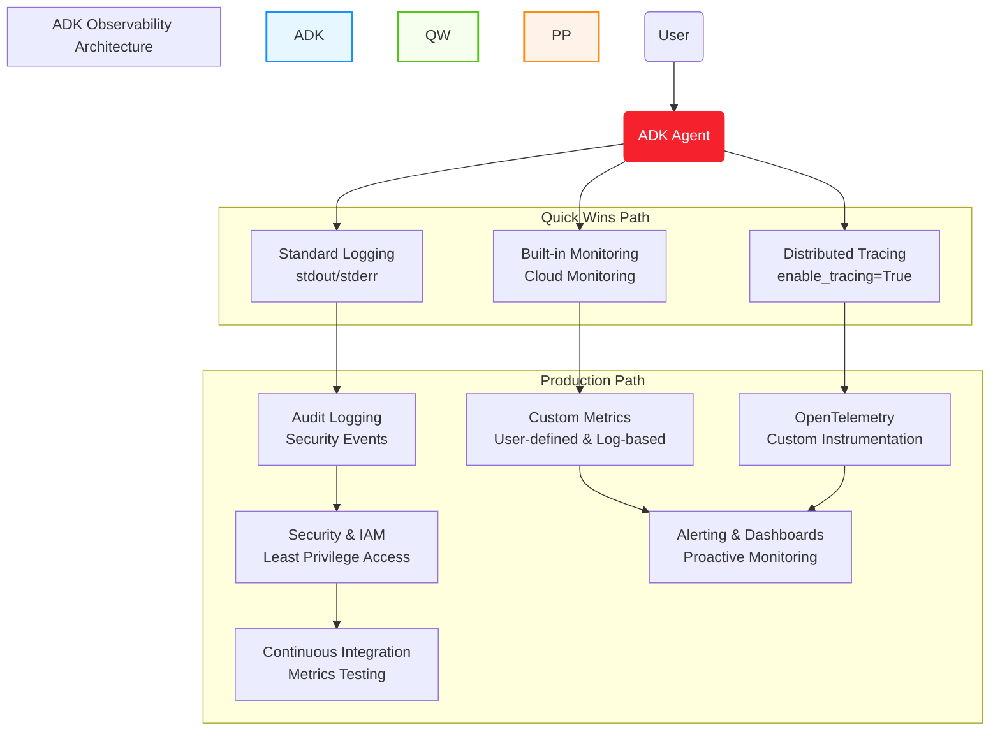

# ADK Observability: Monitoring, Tracing, and Security for Production Agents

## Overview

Observability is essential for running production-grade AI agents. With Google ADK and Vertex AI Agent Engine, you get robust, cloud-native monitoring, logging, and distributed tracing out of the box. This guide offers two paths:

- **Quick Wins Path (5 minutes)**: Get immediate visibility with built-in tools
- **Production Path**: Enterprise-grade observability with security and best practices



## Understanding Observability: Metrics, Logs, and Traces

Before diving into implementation, let's understand the three pillars of observability and how they work together for AI agents:

### **Metrics**

**What they are:** Numerical measurements of system behavior over time  
**When to use:**

- Performance monitoring
- Resource utilization
- Business KPIs
- Alerting thresholds  

**ADK Examples:**

- Request count
- Latency percentiles
- Token usage
- Error rates

### **Logs**

**What they are:** Time-stamped records of discrete events  
**When to use:**

- Debugging
- Audit trails
- Error investigation
- Security monitoring  

**ADK Examples:**

- Tool execution details
- LLM prompt/response
- Authentication events
- Error messages

### **Traces**

**What they are:** End-to-end request flows across components  
**When to use:**

- Performance bottlenecks
- Component dependencies
- Request path analysis  

**ADK Examples:**

- Full agent query flow
- Tool call sequences
- LLM invocation timing
- Cross-service calls

> **🔑 Quick Tip:** Think of observability like a detective story: **Metrics** tell you something happened (system is slow), **Logs** provide clues and context (error in tool X), and **Traces** show the complete timeline and connections between events (exactly how the request flowed through your system).

Using all three together provides a complete picture of your ADK agent's behavior, enabling both proactive monitoring and effective troubleshooting.

---

## ⚡ Quick Wins Path (5 Minutes)

This path provides immediate visibility into your ADK agents with minimal configuration.

### 1. Built-in Monitoring with Cloud Monitoring (2 minutes)

Vertex AI Agent Engine automatically exports key operational metrics to Cloud Monitoring with no additional configuration required:

```python
# No additional code needed - metrics are collected automatically
```

**Metrics available out-of-the-box:**

- **Request count**
- **Request latencies (p50, p95, p99)**
- **CPU and memory allocation**

**How to view metrics (2 minutes):**

1. Go to [Metrics Explorer](https://console.cloud.google.com/monitoring/metrics-explorer)
2. Select your project
3. Search for `Vertex AI Reasoning Engine`
4. Choose metrics like `request_count` or `request_latencies`

### 2. Enable Distributed Tracing (1 minute)

Distributed tracing lets you analyze the end-to-end flow of agent queries, tool calls, and LLM invocations:

```python
from vertexai.preview.reasoning_engines import AdkApp
from google.adk.agents import Agent

agent = Agent(
    model="gemini-2.5-flash",
    name="my_agent",
    # Agent configuration...
)

app = AdkApp(
    agent=agent,
    enable_tracing=True,  # <--- Just add this one line!
)
```

**How to view traces (2 minutes):**

1. Go to [Trace Explorer](https://console.cloud.google.com/traces/list)
2. Select your project
3. Filter by `Vertex AI Reasoning Engine` resource
4. Inspect traces and spans for each agent query

### 3. Basic Logging (Already Working!)

All your `print()` statements and Python logging are automatically captured:

```python
# Standard Python print statements work automatically
print(f"Processing request: {request_id}")

# Or use Python's logging module for structured logs
import logging
logger = logging.getLogger(__name__)
logger.info("Tool execution complete", extra={"tool": "search", "duration_ms": 350})
```

**View logs:**

1. Go to [Logs Explorer](https://console.cloud.google.com/logs/query)
2. Filter by `Vertex AI Reasoning Engine` resource

---

## 🏢 Production Path

For enterprise deployments requiring robust monitoring, security, and advanced observability.

### 1. Enhanced Security & IAM Configuration

### IAM Role Configuration for Observability

ADK agents run using the Vertex AI Reasoning Engine Service Agent (`service-PROJECT_NUMBER@gcp-sa-aiplatform-re.iam.gserviceaccount.com`).

```bash
# Grant minimal monitoring roles to the service account
gcloud projects add-iam-policy-binding $PROJECT_ID \
    --member="serviceAccount:service-$PROJECT_NUMBER@gcp-sa-aiplatform-re.iam.gserviceaccount.com" \
    --role="roles/monitoring.metricWriter"

# Grant tracing permissions
gcloud projects add-iam-policy-binding $PROJECT_ID \
    --member="serviceAccount:service-$PROJECT_NUMBER@gcp-sa-aiplatform-re.iam.gserviceaccount.com" \
    --role="roles/cloudtrace.agent"
```

### Least Privilege Security Checklist

- [ ] Use dedicated service accounts for different agent functions
- [ ] Apply resource-level access controls where possible
- [ ] Configure VPC Service Controls for sensitive deployments
- [ ] Enable audit logging for IAM changes
- [ ] Set up Secret Manager for API keys and credentials
- [ ] Schedule regular access reviews (monthly/quarterly)

### Security Best Practices

1. **Separate Monitoring Account**: Consider routing observability data to a dedicated monitoring project
2. **Data Redaction**: Configure log filters to prevent sensitive data from appearing in logs
3. **Conditional IAM Bindings**: Use time-limited access for elevated privileges
4. **Workload Identity**: Avoid using service account keys in favor of Workload Identity Federation

### 2. Advanced Monitoring Configuration

### Custom Metrics for Business KPIs

Define business-specific metrics for your agents:

```python
# Using Cloud Monitoring client libraries
from google.cloud import monitoring_v3

client = monitoring_v3.MetricServiceClient()
project_name = client.common_project_path(PROJECT_ID)

# Create a custom metric to track token usage
series = monitoring_v3.TimeSeries()
series.metric.type = "custom.googleapis.com/adk/token_usage"
series.resource.type = "aiplatform.googleapis.com/ReasoningEngine"
series.resource.labels["reasoning_engine_id"] = RESOURCE_ID
series.resource.labels["location"] = LOCATION
series.resource.labels["project_id"] = PROJECT_ID

# Add metric labels for analysis dimensions
series.metric.labels["model"] = "gemini-2.5-flash"
series.metric.labels["agent"] = "customer_service_agent"

# Add the data point
point = series.points.add()
point.value.int64_value = 2500  # Number of tokens used
now = time.time()
point.interval.end_time.seconds = int(now)
point.interval.end_time.nanos = int((now - int(now)) * 10**9)
client.create_time_series(name=project_name, time_series=[series])
```

### Log-Based Metrics for Tool Analytics

Create log-based metrics to track tool execution patterns:

1. Go to [Log-based Metrics](https://console.cloud.google.com/logs/metrics)
2. Create a counter metric named `tool_execution_count`
3. Filter: `resource.type="aiplatform.googleapis.com/ReasoningEngine" textPayload=~"Tool .* executed"`
4. Add labels to extract tool name and execution status

### Comprehensive Alerting Strategy

Set up alerts for critical conditions:

1. Go to [Alerting](https://console.cloud.google.com/monitoring/alerting)
2. Create policies for:
   - Error rate > 5% over 5 minutes
   - P95 latency > 2000ms over 10 minutes
   - Failed tool executions > 10 in 5 minutes
   - Token usage approaching quota limits

### 3. OpenTelemetry Integration

For custom agents, implement advanced tracing with OpenTelemetry:

```python
from opentelemetry import trace
from opentelemetry.sdk.trace import TracerProvider
from opentelemetry.exporter.otlp.proto.grpc.trace_exporter import OTLPSpanExporter
from opentelemetry.sdk.trace.export import BatchSpanProcessor
from opentelemetry.sdk.resources import Resource
from opentelemetry.semconv.resource import ResourceAttributes

# Configure trace provider with semantic conventions
resource = Resource.create({
    ResourceAttributes.SERVICE_NAME: "customer-service-agent",
    ResourceAttributes.DEPLOYMENT_ENVIRONMENT: "production",
})

trace.set_tracer_provider(TracerProvider(resource=resource))
tracer = trace.get_tracer(__name__)

# Configure Cloud Trace exporter
span_processor = BatchSpanProcessor(OTLPSpanExporter())
trace.get_tracer_provider().add_span_processor(span_processor)

# Instrument your tool execution
def my_custom_tool(input_data):
    with tracer.start_as_current_span("my_custom_tool") as span:
        span.set_attribute("tool.name", "my_custom_tool")
        span.set_attribute("tool.input", str(input_data))
        
        # Tool implementation
        result = process_data(input_data)
        
        span.set_attribute("tool.result", str(result))
        return result
```

### 4. Audit Logging and Security Monitoring

Enable comprehensive audit logging for security events:

```bash
# Enable audit logging for data access and admin activity
gcloud logging sinks create adk-audit \
    bigquery.googleapis.com/projects/$PROJECT_ID/datasets/security_audit \
    --log-filter="protoPayload.methodName:SetIamPolicy OR protoPayload.methodName:CreateServiceAccount"

# Create a log-based metric for security violations
gcloud logging metrics create adk-security-violations \
    --description="ADK security violations" \
    --log-filter="resource.type=aiplatform.googleapis.com/ReasoningEngine severity>=WARNING textPayload:\"security violation\""
```

Set up security dashboards and alerts:

1. Monitor unusual access patterns
2. Track authentication failures
3. Monitor service account usage
4. Set up alerts for policy violations

### 5. Observability Testing in CI/CD

Integrate observability testing into your CI/CD pipeline:

```yaml
# Example GitHub Actions workflow step
- name: Validate observability configuration
  run: |
    # Validate monitoring configuration
    python ./tests/validate_monitoring.py
    
    # Test custom metrics
    python ./tests/test_custom_metrics.py
    
    # Verify alerts are properly configured
    python ./tests/verify_alerts.py
```

---

## Best Practices for All Deployments

- **Enable tracing in production** for all agents
- **Set up alerts** for error rates and high latency
- **Instrument custom tools** with proper logging and tracing
- **Correlate logs and traces** using trace IDs
- **Review dashboards regularly** to catch regressions early
- **Implement proper security boundaries** between agents
- **Use structured logging** for machine-parseable logs
- **Monitor token usage** to control costs

## Observability for ADK Agents on Cloud Run

When deploying ADK agents to Cloud Run instead of using Vertex AI Agent Engine directly, you need a different approach to observability. Cloud Run provides its own built-in monitoring capabilities while requiring some custom configuration for advanced tracing and metrics.

### Key Differences in Observability Approach

| Vertex AI Agent Engine | Cloud Run Deployment |
|---|---|
| Built-in metric collection | Built-in Cloud Run metrics with option for custom metrics |
| Distributed tracing with simple flag | Automatic trace generation with optional custom spans |
| Automatic context propagation | W3C trace context propagation header support |
| Uses Vertex AI service identity | Requires custom service account configuration |
| Higher tracing sampling rate | Limited to 0.1 requests per second per instance |

### 1. Metrics Collection for Cloud Run ADK Agents

Cloud Run automatically provides built-in operational metrics without any configuration required:

```python
# Cloud Run built-in metrics (no code needed)
# - Container CPU utilization
# - Container memory utilization
# - Request count and latencies
# - Container instance count
# - Maximum concurrent requests
# - Sent/received bytes
```

For ADK-specific metrics (like token usage or tool execution counts), you have two options:

1. **Use log-based metrics** (simpler approach)
   - Structure your logs to include key metrics data
   - Create log-based metrics in Cloud Monitoring
   
2. **Deploy an OpenTelemetry Collector sidecar** (more powerful approach):

```yaml
# service.yaml for Cloud Run deployment with OpenTelemetry sidecar
apiVersion: serving.knative.dev/v1
kind: Service
metadata:
  name: adk-agent-service
  annotations:
    run.googleapis.com/launch-stage: BETA
spec:
  template:
    metadata:
      annotations:
        run.googleapis.com/container-dependencies: "{app:[collector]}"
    spec:
      containers:
      - image: gcr.io/PROJECT_ID/adk-agent:latest
        name: app
        env:
        - name: "OTEL_EXPORTER_OTLP_ENDPOINT"
          value: "http://localhost:4317"
      - image: us-docker.pkg.dev/cloud-ops-agents-artifacts/google-cloud-opentelemetry-collector/otelcol-google:latest
        name: collector
        startupProbe:
          httpGet:
            path: /
            port: 13133
        # OpenTelemetry collector configuration
```

### 2. Distributed Tracing for Cloud Run ADK Agents

Cloud Run automatically generates traces without any instrumentation required. The standard W3C trace context propagation header (`traceparent`) is automatically populated for Cloud Run requests.

**Important note:** Automatically generated traces in Cloud Run do not result in billing charges. Cloud Run samples traces at a maximum rate of 0.1 requests per second for each instance (one request every 10 seconds).

If you need to add custom spans to measure specific ADK operations (optional):

```python
from opentelemetry import trace
from opentelemetry.sdk.trace import TracerProvider
from opentelemetry.exporter.otlp.proto.grpc.trace_exporter import OTLPSpanExporter
from opentelemetry.sdk.trace.export import BatchSpanProcessor

# Configure tracer for ADK agent on Cloud Run
tracer_provider = TracerProvider()
tracer_provider.add_span_processor(
    BatchSpanProcessor(OTLPSpanExporter(endpoint="localhost:4317"))
)
trace.set_tracer_provider(tracer_provider)
tracer = trace.get_tracer(__name__)

# Instrument ADK agent requests with custom spans
def handle_request(request):
    with tracer.start_as_current_span("adk_agent_request") as span:
        span.set_attribute("user_query", request.query)
        
        # ADK agent processing
        result = process_with_adk(request)
        
        span.set_attribute("response_tokens", len(result.text))
        return result
```

**Important:** Custom spans created through instrumentation will incur standard Cloud Trace billing charges. You only need to add this custom instrumentation if you require detailed timing information about specific operations within your ADK agent.

### 3. Service Identity and Security

When running on Cloud Run, ADK agents use Cloud Run's service identity to access Google APIs. There are two types of service accounts that can be used:

1. **User-managed service account (recommended)**: Create a dedicated service account with minimal permissions for your ADK agent.
2. **Compute Engine default service account**: Automatically provided but often has more permissions than needed.

**Important security recommendation**: Avoid using the default service account for production deployments. Instead, create a user-managed service account with only the necessary permissions:

```bash
# Create a dedicated service account for your ADK agent
gcloud iam service-accounts create adk-agent-sa \
    --description="Service account for ADK agent" \
    --display-name="ADK Agent Service Account"

# Grant necessary permissions to the service account
gcloud projects add-iam-policy-binding $PROJECT_ID \
    --member="serviceAccount:adk-agent-sa@$PROJECT_ID.iam.gserviceaccount.com" \
    --role="roles/monitoring.metricWriter"

gcloud projects add-iam-policy-binding $PROJECT_ID \
    --member="serviceAccount:adk-agent-sa@$PROJECT_ID.iam.gserviceaccount.com" \
    --role="roles/cloudtrace.agent"

# For ADK-specific permissions (e.g., for Vertex AI model access)
gcloud projects add-iam-policy-binding $PROJECT_ID \
    --member="serviceAccount:adk-agent-sa@$PROJECT_ID.iam.gserviceaccount.com" \
    --role="roles/aiplatform.user"
```

Then specify this service account when deploying your Cloud Run service:

```bash
gcloud run deploy adk-agent-service \
    --image=gcr.io/PROJECT_ID/adk-agent:latest \
    --service-account=adk-agent-sa@$PROJECT_ID.iam.gserviceaccount.com
```

### 4. Structured Logging for Cloud Run ADK Agents

Implement structured logging that works well with Cloud Logging and enables creating log-based metrics:

```python
import logging
import json
import os
import time
import uuid
import google.cloud.logging
from flask import request

# Optional: Configure Cloud Logging client
client = google.cloud.logging.Client()
client.setup_logging()

# Configure structured logging for Cloud Run
class StructuredLogFormatter(logging.Formatter):
    def format(self, record):
        log_record = {
            "severity": record.levelname,
            "message": super().format(record),
            "time": self.formatTime(record, self.datefmt),
            "service": os.environ.get("K_SERVICE", "adk-agent"),
            "revision": os.environ.get("K_REVISION", "unknown"),
        }
        
        # Add trace context if available
        trace_header = request.headers.get('X-Cloud-Trace-Context', '')
        if trace_header:
            trace_id = trace_header.split('/')[0]
            log_record['logging.googleapis.com/trace'] = f"projects/{os.environ.get('GOOGLE_CLOUD_PROJECT')}/traces/{trace_id}"
        
        # Add any extra attributes from the record
        if hasattr(record, 'extras'):
            for key, value in record.extras.items():
                log_record[key] = value
                
        return json.dumps(log_record)

# Set up logger
logger = logging.getLogger("adk_agent")
handler = logging.StreamHandler()
handler.setFormatter(StructuredLogFormatter())
logger.addHandler(handler)
logger.setLevel(logging.INFO)

# Example usage with context information for observability
def log_adk_event(event_type, details, trace_id=None):
    request_id = str(uuid.uuid4())
    logger.info(
        f"ADK Event: {event_type}", 
        extra={
            "extras": {
                "event_type": event_type,
                "request_id": request_id,
                "details": details,
                "trace_id": trace_id,
                "timestamp_ms": int(time.time() * 1000)
            }
        }
    )
    return request_id
```

This structured logging format:

- Automatically includes service name and revision
- Links logs to traces when available
- Includes consistent fields for filtering and creating log-based metrics
- Works with Cloud Logging's built-in JSON parsing

### 5. Viewing and Dashboarding Cloud Run ADK Agent Metrics

Access your metrics through Google Cloud Monitoring:

1. Go to [Metrics Explorer](https://console.cloud.google.com/monitoring/metrics-explorer)
2. Select resource type: `Cloud Run Revision`
3. Browse available metrics:
   - Request count
   - Request latencies
   - Container CPU utilization
   - Container memory utilization
   - Instance count
   - Network sent/received bytes

For custom metrics created with OpenTelemetry:

1. Select resource type: `Prometheus Target`
2. Browse your custom metrics (like token usage, tool execution counts, etc.)

For log-based metrics:

1. Look under the "Logging Metrics" section in Metrics Explorer
2. Select the log-based metrics you've created

Create custom dashboards specifically for ADK agent monitoring:

1. Go to [Dashboards](https://console.cloud.google.com/monitoring/dashboards)
2. Create a new dashboard with these recommended panels:
   
   **Operational Health:**
   - Request volume (requests/min)
   - Error rate (% of total requests)
   - P50/P95/P99 latency
   - Instance count
   
   **ADK-Specific Metrics:**
   - Token usage by model
   - Tool execution count by tool type
   - Success rate by tool
   - Response generation time
   
   **Resource Utilization:**
   - CPU utilization
   - Memory utilization
   - Network traffic

You can also set up alerts based on these metrics, for example:

- High error rates (>5%)
- Elevated P95 latency (>2s)
- Excessive token usage
- Abnormal tool failure rates

---

## Quotas, Limits, and Retention

Understanding the limitations of observability tools is crucial for proper planning and implementation:

### Vertex AI Agent Engine

- **Trace Data Retention**: Cloud Trace stores data for 30 days
- **Trace API Limits**:
  - Maximum 1,000 spans per trace
  - Maximum trace size: 50 MB
  - Maximum 32 attributes per span
 
### Cloud Run

- **Trace Sampling Rate**: Maximum 0.1 requests per second per instance (one request every 10 seconds)
- **Custom Metrics**: No charge for built-in metrics on Cloud Run
- **Trace Data Retention**: 30 days, same as all Cloud Trace data

### Monitoring Quotas

- **API Read Operations**: 300 per 60 seconds across all read operations
- **API Write Operations**: 4,800 per 60 seconds across all write operations
- **Ingested Spans**: 3-5 billion per day (depending on your account)

### Managing Quotas

You can monitor your quota usage in the Google Cloud console:

1. Go to [IAM & Admin > Quotas](https://console.cloud.google.com/iam-admin/quotas)
2. Filter by service: "Cloud Trace API" or "Monitoring API"
3. View your current usage and limits

For production systems, consider:

- Creating alerting policies on quota usage
- Implementing sampling strategies for high-volume systems
- Requesting quota increases for critical workloads

## References

- [Vertex AI Agent Engine Monitoring](https://cloud.google.com/vertex-ai/generative-ai/docs/agent-engine/manage/monitoring)
- [Vertex AI Agent Engine Tracing](https://cloud.google.com/vertex-ai/generative-ai/docs/agent-engine/manage/tracing)
- [Cloud Trace Python Setup](https://cloud.google.com/trace/docs/setup/python)
- [OpenTelemetry Python](https://opentelemetry.io/docs/languages/python/)
- [Cloud Logging for Agents](https://cloud.google.com/vertex-ai/generative-ai/docs/agent-engine/manage/logging)
- [Managing Access for Deployed Agents](https://cloud.google.com/vertex-ai/generative-ai/docs/agent-engine/manage/access)
- [Google Cloud IAM Best Practices](https://cloud.google.com/iam/docs/using-iam-securely)
- [Cloud Run Monitoring](https://cloud.google.com/run/docs/monitoring)
- [Cloud Run Distributed Tracing](https://cloud.google.com/run/docs/trace)
- [Cloud Run OpenTelemetry Integration](https://cloud.google.com/run/docs/tutorials/custom-metrics-opentelemetry-sidecar)
- [Cloud Run Service Identity](https://cloud.google.com/run/docs/securing/service-identity)
- [OpenTelemetry Semantic Conventions for GenAI](https://opentelemetry.io/docs/specs/semconv/gen-ai/)

## Last updated

June 2025
