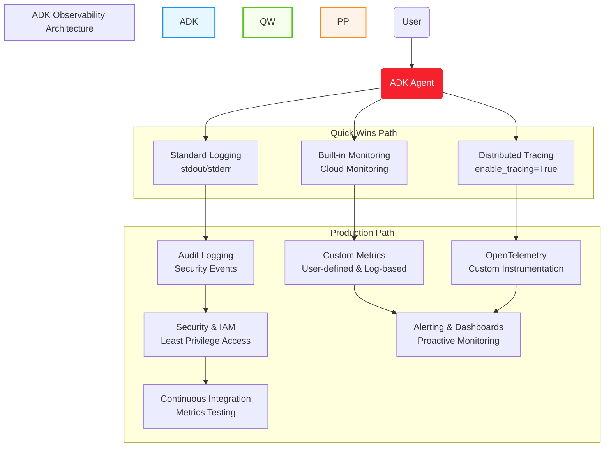

# ADK Observability: Monitoring, Tracing, and Security for Production Agents

## Overview

Observability is essential for running production-grade AI agents. With Google ADK and Vertex AI Agent Engine, you get robust, cloud-native monitoring, logging, and distributed tracing out of the box. This guide offers two paths:

- **Quick Wins Path (5 minutes)**: Get immediate visibility with built-in tools
- **Production Path**: Enterprise-grade observability with security and best practices



---

## ⚡ Quick Wins Path (5 Minutes)

This path provides immediate visibility into your ADK agents with minimal configuration.

### 1. Built-in Monitoring with Cloud Monitoring (2 minutes)

Vertex AI Agent Engine automatically exports key operational metrics to Cloud Monitoring with no additional configuration required:

```python
# No additional code needed - metrics are collected automatically
```

**Metrics available out-of-the-box:**
- **Request count**
- **Request latencies (p50, p95, p99)**
- **CPU and memory allocation**

**How to view metrics (2 minutes):**
1. Go to [Metrics Explorer](https://console.cloud.google.com/monitoring/metrics-explorer)
2. Select your project
3. Search for `Vertex AI Reasoning Engine`
4. Choose metrics like `request_count` or `request_latencies`

### 2. Enable Distributed Tracing (1 minute)

Distributed tracing lets you analyze the end-to-end flow of agent queries, tool calls, and LLM invocations:

```python
from vertexai.preview.reasoning_engines import AdkApp
from google.adk.agents import Agent

agent = Agent(
    model="gemini-2.5-flash",
    name="my_agent",
    # Agent configuration...
)

app = AdkApp(
    agent=agent,
    enable_tracing=True,  # <--- Just add this one line!
)
```

**How to view traces (2 minutes):**
1. Go to [Trace Explorer](https://console.cloud.google.com/traces/list)
2. Select your project
3. Filter by `Vertex AI Reasoning Engine` resource
4. Inspect traces and spans for each agent query

### 3. Basic Logging (Already Working!)

All your `print()` statements and Python logging are automatically captured:

```python
# Standard Python print statements work automatically
print(f"Processing request: {request_id}")

# Or use Python's logging module for structured logs
import logging
logger = logging.getLogger(__name__)
logger.info("Tool execution complete", extra={"tool": "search", "duration_ms": 350})
```

**View logs:**
1. Go to [Logs Explorer](https://console.cloud.google.com/logs/query)
2. Filter by `Vertex AI Reasoning Engine` resource

---

## 🏢 Production Path

For enterprise deployments requiring robust monitoring, security, and advanced observability.

### 1. Enhanced Security & IAM Configuration

### IAM Role Configuration for Observability

ADK agents run using the Vertex AI Reasoning Engine Service Agent (`service-PROJECT_NUMBER@gcp-sa-aiplatform-re.iam.gserviceaccount.com`).

```bash
# Grant minimal monitoring roles to the service account
gcloud projects add-iam-policy-binding $PROJECT_ID \
    --member="serviceAccount:service-$PROJECT_NUMBER@gcp-sa-aiplatform-re.iam.gserviceaccount.com" \
    --role="roles/monitoring.metricWriter"

# Grant tracing permissions
gcloud projects add-iam-policy-binding $PROJECT_ID \
    --member="serviceAccount:service-$PROJECT_NUMBER@gcp-sa-aiplatform-re.iam.gserviceaccount.com" \
    --role="roles/cloudtrace.agent"
```

### Least Privilege Security Checklist

- [ ] Use dedicated service accounts for different agent functions
- [ ] Apply resource-level access controls where possible
- [ ] Configure VPC Service Controls for sensitive deployments
- [ ] Enable audit logging for IAM changes
- [ ] Set up Secret Manager for API keys and credentials
- [ ] Schedule regular access reviews (monthly/quarterly)

### Security Best Practices

1. **Separate Monitoring Account**: Consider routing observability data to a dedicated monitoring project
2. **Data Redaction**: Configure log filters to prevent sensitive data from appearing in logs
3. **Conditional IAM Bindings**: Use time-limited access for elevated privileges
4. **Workload Identity**: Avoid using service account keys in favor of Workload Identity Federation

### 2. Advanced Monitoring Configuration

### Custom Metrics for Business KPIs

Define business-specific metrics for your agents:

```python
# Using Cloud Monitoring client libraries
from google.cloud import monitoring_v3

client = monitoring_v3.MetricServiceClient()
project_name = client.common_project_path(PROJECT_ID)

# Create a custom metric to track token usage
series = monitoring_v3.TimeSeries()
series.metric.type = "custom.googleapis.com/adk/token_usage"
series.resource.type = "aiplatform.googleapis.com/ReasoningEngine"
series.resource.labels["reasoning_engine_id"] = RESOURCE_ID
series.resource.labels["location"] = LOCATION
series.resource.labels["project_id"] = PROJECT_ID

# Add metric labels for analysis dimensions
series.metric.labels["model"] = "gemini-2.5-flash"
series.metric.labels["agent"] = "customer_service_agent"

# Add the data point
point = series.points.add()
point.value.int64_value = 2500  # Number of tokens used
now = time.time()
point.interval.end_time.seconds = int(now)
point.interval.end_time.nanos = int((now - int(now)) * 10**9)
client.create_time_series(name=project_name, time_series=[series])
```

### Log-Based Metrics for Tool Analytics

Create log-based metrics to track tool execution patterns:

1. Go to [Log-based Metrics](https://console.cloud.google.com/logs/metrics)
2. Create a counter metric named `tool_execution_count`
3. Filter: `resource.type="aiplatform.googleapis.com/ReasoningEngine" textPayload=~"Tool .* executed"`
4. Add labels to extract tool name and execution status

### Comprehensive Alerting Strategy

Set up alerts for critical conditions:

1. Go to [Alerting](https://console.cloud.google.com/monitoring/alerting)
2. Create policies for:
   - Error rate > 5% over 5 minutes
   - P95 latency > 2000ms over 10 minutes
   - Failed tool executions > 10 in 5 minutes
   - Token usage approaching quota limits

### 3. OpenTelemetry Integration

For custom agents, implement advanced tracing with OpenTelemetry:

```python
from opentelemetry import trace
from opentelemetry.sdk.trace import TracerProvider
from opentelemetry.exporter.otlp.proto.grpc.trace_exporter import OTLPSpanExporter
from opentelemetry.sdk.trace.export import BatchSpanProcessor
from opentelemetry.sdk.resources import Resource
from opentelemetry.semconv.resource import ResourceAttributes

# Configure trace provider with semantic conventions
resource = Resource.create({
    ResourceAttributes.SERVICE_NAME: "customer-service-agent",
    ResourceAttributes.DEPLOYMENT_ENVIRONMENT: "production",
})

trace.set_tracer_provider(TracerProvider(resource=resource))
tracer = trace.get_tracer(__name__)

# Configure Cloud Trace exporter
span_processor = BatchSpanProcessor(OTLPSpanExporter())
trace.get_tracer_provider().add_span_processor(span_processor)

# Instrument your tool execution
def my_custom_tool(input_data):
    with tracer.start_as_current_span("my_custom_tool") as span:
        span.set_attribute("tool.name", "my_custom_tool")
        span.set_attribute("tool.input", str(input_data))
        
        # Tool implementation
        result = process_data(input_data)
        
        span.set_attribute("tool.result", str(result))
        return result
```

### 4. Audit Logging and Security Monitoring

Enable comprehensive audit logging for security events:

```bash
# Enable audit logging for data access and admin activity
gcloud logging sinks create adk-audit \
    bigquery.googleapis.com/projects/$PROJECT_ID/datasets/security_audit \
    --log-filter="protoPayload.methodName:SetIamPolicy OR protoPayload.methodName:CreateServiceAccount"

# Create a log-based metric for security violations
gcloud logging metrics create adk-security-violations \
    --description="ADK security violations" \
    --log-filter="resource.type=aiplatform.googleapis.com/ReasoningEngine severity>=WARNING textPayload:\"security violation\""
```

Set up security dashboards and alerts:
1. Monitor unusual access patterns
2. Track authentication failures
3. Monitor service account usage
4. Set up alerts for policy violations

### 5. Observability Testing in CI/CD

Integrate observability testing into your CI/CD pipeline:

```yaml
# Example GitHub Actions workflow step
- name: Validate observability configuration
  run: |
    # Validate monitoring configuration
    python ./tests/validate_monitoring.py
    
    # Test custom metrics
    python ./tests/test_custom_metrics.py
    
    # Verify alerts are properly configured
    python ./tests/verify_alerts.py
```

---

## Best Practices for All Deployments

- **Enable tracing in production** for all agents
- **Set up alerts** for error rates and high latency
- **Instrument custom tools** with proper logging and tracing
- **Correlate logs and traces** using trace IDs
- **Review dashboards regularly** to catch regressions early
- **Implement proper security boundaries** between agents
- **Use structured logging** for machine-parseable logs
- **Monitor token usage** to control costs

---

## References

- [Vertex AI Agent Engine Monitoring](https://cloud.google.com/vertex-ai/generative-ai/docs/agent-engine/manage/monitoring)
- [Vertex AI Agent Engine Tracing](https://cloud.google.com/vertex-ai/generative-ai/docs/agent-engine/manage/tracing)
- [Cloud Trace Python Setup](https://cloud.google.com/trace/docs/setup/python)
- [OpenTelemetry Python](https://opentelemetry.io/docs/languages/python/)
- [Cloud Logging for Agents](https://cloud.google.com/vertex-ai/generative-ai/docs/agent-engine/manage/logging)
- [Managing Access for Deployed Agents](https://cloud.google.com/vertex-ai/generative-ai/docs/agent-engine/manage/access)
- [Google Cloud IAM Best Practices](https://cloud.google.com/iam/docs/using-iam-securely)

---

## Last updated

August 2024
