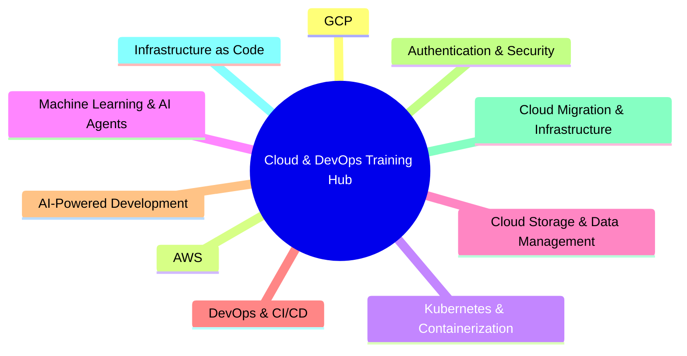

# Cloud & DevOps Training Hub 🚀

Welcome to your comprehensive collection of **enterprise-grade cloud computing and DevOps tutorials**! This repository provides hands-on, actionable training materials to help you master modern cloud technologies, from basic containerization to advanced AI agent development and multi-cloud architecture.

## 📚 Purpose

This project offers a curated collection of **production-ready training tutorials** designed to transform you from beginner to cloud enterprise architect. Our focus areas span the complete cloud ecosystem:

- **Google Cloud Platform (GCP)**: Enterprise services, advanced configurations, and production deployments
- **Amazon Web Services (AWS)**: Migration strategies, managed services, and infrastructure as code
- **Kubernetes & Containerization**: Advanced orchestration, scaling, and production management
- **Machine Learning & AI Agents**: End-to-end ML pipelines, Vertex AI, and intelligent multi-agent systems
- **Cloud Storage & Data Management**: Enterprise-grade storage solutions, database optimization, and data engineering
- **DevOps & CI/CD**: Advanced automation, GitLab pipelines, AWS ECR, and deployment strategies
- **AI-Powered Development**: Revolutionary development acceleration with Amazon Q and VS Code Copilot Agent
- **Enterprise Authentication & Security**: OAuth2, OpenID Connect, API management, and enterprise identity
- **Cloud Migration & Infrastructure**: Strategic HAProxy-to-AWS migrations and infrastructure transformation
- **Infrastructure as Code**: Advanced Terraform, CDK TypeScript, and scalable architecture patterns



Each tutorial features:

- **Step-by-step, production-ready instructions** with enterprise best practices
- **Real-world examples and business use cases** with measurable ROI analysis
- **Clear prerequisites and detailed cost estimates** for budget planning
- **Comprehensive troubleshooting guides** and professional debugging techniques
- **24-hour challenges** for accelerated, hands-on mastery
- **Business impact analysis** with competitive market insights
- **Multi-framework support** for maximum adoption flexibility

Start your journey with confidence—whether you're new to the cloud or architecting enterprise-grade solutions for Fortune 500 companies.

Start your journey with confidence—whether you’re new to the cloud or aiming for advanced, production-ready skills.

---

## 🎯 Quick Start Guide

Choose your learning path based on your experience level:

### 🔰 **Complete Beginner**

Start here if you're new to cloud computing:

1. [Install Google Cloud CLI](#-cloud-tools--setup)
2. [Kubernetes Basics](#-container-orchestration)
3. [Create Your First GCP Storage](#-storage--data-management)

### 🚀 **Intermediate**

If you have some cloud experience:

1. [GCP Crash Course for AWS Users](#-cloud-platforms--migration)
2. [AI-Powered Development with Amazon Q](#-ai-powered-developer-tools)
3. [CI/CD Automation with GitLab and AWS](#-devops--cicd-automation)
4. [Deploy Applications to Cloud Platforms](#-application-deployment--saas-development)
5. [Advanced Storage Solutions](#-storage--data-management)
6. [Machine Learning with Vertex AI](#-artificial-intelligence--machine-learning)

### 🎓 **Advanced**

For experienced professionals seeking enterprise-grade AI solutions:

1. [Complete ML Production Pipeline](#-artificial-intelligence--machine-learning)
2. [Enterprise AI Agent Development](#-artificial-intelligence--machine-learning)
3. [Multi-Agent System Orchestration](#-artificial-intelligence--machine-learning)
4. [Business Impact & ROI Analysis](#-artificial-intelligence--machine-learning)


---

## 📋 Training Categories

### 🔧 **Cloud Tools & Setup**

Essential tools and installation guides for getting started with cloud development.

| Tutorial                                                                  | Level    | Duration  | Language | Description                                                                                    |
| ------------------------------------------------------------------------- | -------- | --------- | -------- | ---------------------------------------------------------------------------------------------- |
| [📖 How to Install Google Cloud CLI](./03_how_to_install_google_cloud.md) | Beginner | 30-45 min | English  | Complete guide to installing and configuring Google Cloud CLI across macOS, Linux, and Windows |

**What you'll learn:**

- Multiple installation methods (package managers, interactive installer, manual)
- Post-installation setup and verification
- Authentication and configuration
- Common troubleshooting solutions

---

### 📦 **Container Orchestration**

Learn containerization and Kubernetes from the ground up.

| Tutorial                                                            | Level    | Duration  | Language | Description                                       |
| ------------------------------------------------------------------- | -------- | --------- | -------- | ------------------------------------------------- |
| [📖 Kubernetes for Absolute Beginners](./01_kubernetes_beginner.md) | Beginner | 2-3 hours | English  | Deploy your first app on Amazon EKS with OpenLens |

**What you'll learn:**

- Kubernetes fundamentals and core concepts
- Setting up Amazon EKS clusters
- Deploying applications to Kubernetes
- Using OpenLens for cluster management
- Real-world container orchestration

**Prerequisites:** Computer with 8GB+ RAM, AWS account (Free Tier)
**Estimated Cost:** $0-5 USD

---

### 💾 **Storage & Data Management**

Master cloud storage solutions and data handling strategies.

| Tutorial                                                               | Level    | Duration  | Language | Description                                           |
| ---------------------------------------------------------------------- | -------- | --------- | -------- | ----------------------------------------------------- |
| [📖 Google Cloud SQL for Postgres for the Impatient](./19_google_cloud_sql.md) | Beginner to Intermediate | 3-5 hours | English  | Fast-track guide to Google Cloud SQL for PostgreSQL: setup, security, performance, and best practices |
| [📖 Create GCP Storage Bucket (English)](./02_create_gcp_bucket_en.md) | Beginner | 1-2 hours | English  | Set up Google Cloud Storage for conversational agents |

**What you'll learn:**

- Google Cloud Storage bucket creation and configuration
- Permission management and security best practices
- Data upload and organization strategies
- Integration with conversational AI agents
- Cost management and cleanup procedures

---

### ☁️ **Cloud Platforms & Migration**

Comprehensive guides for mastering Google Cloud Platform, especially for AWS professionals.

| Tutorial                                                              | Level        | Duration  | Language | Description                                                      |
| --------------------------------------------------------------------- | ------------ | --------- | -------- | ---------------------------------------------------------------- |
| [📖 GCP Crash Course for AWS Professionals](./04_gcp_crash_course.md) | Intermediate | 4-6 hours | English  | Complete transition guide from AWS to GCP with hands-on examples |

**What you'll learn:**

- **12 comprehensive modules** covering all major GCP services
- Direct AWS-to-GCP service mapping and translations
- Hands-on labs for each service category
- Real-world project implementation
- Cost optimization strategies

**Modules include:**

- Identity & Access Management
- Compute Services (Compute Engine, App Engine, Cloud Run)
- Storage & Databases
- Networking & Security
- Container Services (GKE)
- Serverless & Cloud Functions
- Data & Analytics
- DevOps & CI/CD
- Monitoring & Observability

---

### 🚀 **Application Deployment & SaaS Development**

Master modern deployment strategies and build production-ready SaaS platforms with enterprise-grade architecture.

| Tutorial                                                                                                         | Level                    | Duration  | Language | Description                                                                                                 |
| ---------------------------------------------------------------------------------------------------------------- | ------------------------ | --------- | -------- | ----------------------------------------------------------------------------------------------------------- |
| [📖 Deploy Next.js to GCP: From Novice to Practitioner](./06_deploy_nextjs_to_gcp.md)                            | Beginner to Advanced     | 3-4 hours | English  | Complete guide to deploying Next.js applications on GCP with professional-grade practices                   |
| [📖 AWS ECS Fargate SaaS Development: Complete Masterclass](./14_developing_a_saas_using_aws_and_ecs_fargate.md) | Intermediate to Advanced | 24 hours  | English  | Build production-ready SaaS platforms using AWS ECS Fargate, CDK TypeScript, and microservices architecture |

**What you'll learn:**

#### Next.js Deployment (GCP Focus)

- **Multiple deployment strategies** (Firebase Hosting, Cloud Run, Compute Engine)
- **Docker containerization** with multi-stage builds for optimization
- **CI/CD pipelines** with GitHub Actions
- **Performance optimization** and security hardening
- **Monitoring and alerting** setup
- **Cost management** and auto-scaling
- **Enterprise deployment** patterns
- **Troubleshooting and debugging** techniques

#### SaaS Development (AWS Focus)

- **Microservices architecture** with 4 core services (Auth, User Management, Payment, Notifications)
- **AWS ECS Fargate** containerization and serverless compute
- **CDK (Cloud Development Kit) with TypeScript** for Infrastructure as Code
- **Production-ready patterns** for security, monitoring, and reliability
- **Auto-scaling capabilities** handling traffic from 10 to 100,000+ users
- **Multi-database strategy** (PostgreSQL, DynamoDB, Redis, ElastiCache)
- **Advanced CI/CD pipelines** with CodePipeline and blue-green deployments
- **Custom CDK constructs** for reusable infrastructure components
- **Cost optimization** strategies saving thousands monthly
- **Enterprise features** including WAF, multi-region deployments, and observability

**Key Features:**

- From 5-minute static deployments to enterprise-grade SaaS systems
- Real-world examples and production-ready configurations
- Interactive exercises and hands-on challenges
- Comprehensive troubleshooting guides
- **24-hour challenge** to build complete SaaS platform
- Business impact focus with ROI calculations

---

### 🔧 **DevOps & CI/CD Automation**

Master continuous integration and deployment with modern DevOps practices and automation tools.

| Tutorial                                                                              | Level                | Duration  | Language | Description                                                                               |
| ------------------------------------------------------------------------------------- | -------------------- | --------- | -------- | ----------------------------------------------------------------------------------------- |
| [📖 GitLab CI/CD with AWS ECR: From Novice to Practitioner](./15_ci_cd_gitlab_ecr.md) | Beginner to Advanced | 6-8 hours | English  | Complete guide to building automated Docker image pipelines with GitLab CI/CD and AWS ECR |

**What you'll learn:**

- **GitLab CI/CD fundamentals** and pipeline architecture
- **Docker image automation** with multi-stage builds and optimization
- **AWS ECR integration** for secure container registry management
- **Authentication and security** best practices for CI/CD
- **Production-ready pipelines** with testing, security scanning, and monitoring
- **Advanced patterns** including environment-specific deployments
- **Troubleshooting techniques** for common CI/CD issues
- **Performance optimization** and cost management strategies

**Key Features:**

- From basic pipelines to enterprise-grade automation
- Real-world examples with Node.js and Python applications
- Security scanning and vulnerability management
- Environment-specific deployment strategies
- **24-hour challenge** to build complete CI/CD pipeline
- Comprehensive troubleshooting and debugging guides

---

### 🧠 **AI-Powered Developer Tools**

Leverage artificial intelligence to accelerate development workflow and boost productivity.

| Tutorial                                                                                              | Level                | Duration  | Language | Description                                                                                                                      |
| ----------------------------------------------------------------------------------------------------- | -------------------- | --------- | -------- | -------------------------------------------------------------------------------------------------------------------------------- |
| [📖 Amazon Q for the Impatient: From Novice to Practitioner](./16_amazon_q.md)                        | Beginner to Advanced | 4-6 hours | English  | Master AI-powered code generation, security scanning, and development acceleration with Amazon Q                                 |
| [📖 Intent-Based Development Using VSCode Copilot AI Agent](./17_intent_based_dev_vs_code_copilot.md) | Beginner to Advanced | 6-8 hours | English  | Master the revolutionary approach to software development using natural language and AI collaboration with VS Code Copilot Agent |
| [📖 Modern Python Development Toolkit 2025](./23-modern-python-dev-toolkit.md) | Intermediate to Advanced | 2-4 hours | English  | Unified, high-performance Python dev workflow with UV, Ruff, Pyright, Taskipy, and pre-commit. Modern best practices, automation, and CI/CD. |
| [📖 MCP 2025-06-18 Documentation: From Novice to Practitioner](./24-mcp.md) | Beginner to Advanced | 8-12 hours | English | Master the Model Context Protocol (MCP) 2025-06-18 specification for seamless AI integration with structured outputs, interactive elicitation, OAuth 2.1 security, and enterprise-grade development |

**What you'll learn:**

#### Amazon Q Developer

- **Amazon Q Developer fundamentals** and ecosystem understanding
- **AI-powered code generation** from natural language prompts
- **Intelligent code completion** and suggestion optimization
- **Automated security scanning** and vulnerability detection
- **Code transformation and modernization** capabilities
- **Custom plugin development** and enterprise integration
- **Performance optimization** and benchmarking techniques
- **Real-world development workflows** with AI assistance

#### Intent-Based Development with VS Code Copilot

- **Intent-based programming paradigm** and natural language development
- **VS Code Copilot Agent Mode** mastery and advanced configuration
- **MCP (Model Context Protocol) servers** integration and custom tooling
- **AI-collaborative workflows** for architecture, documentation, and testing
- **Agent-driven development** from concept to production deployment
- **Quality assurance patterns** for AI-generated code validation
- **Production deployment** with AI-optimized CI/CD pipelines
- **Advanced prompt engineering** for complex software architecture
- **Context management** for large-scale project development
- **Documentation automation** with living, synchronized project docs

#### Modern Python Development Toolkit 2025

- **Unified Python development workflow** with modern tools
- **UVicorn** for high-performance ASGI server
- **Ruff** for fast, flexible linting
- **Pyright** for static type checking
- **Taskipy** for task automation
- **pre-commit** for managing and maintaining multi-language pre-commit hooks
- **Best practices** for Python project structure, dependency management, and CI/CD integration
- **Real-world examples** and hands-on exercises

#### Model Context Protocol (MCP) 2025-06-18

- **MCP 2025-06-18 specification** mastery and core architectural concepts
- **Structured tool outputs** for predictable, schema-validated AI responses
- **Interactive elicitation** for dynamic user conversations and data collection
- **OAuth 2.1 with Resource Indicators (RFC 8707)** for enterprise-grade security
- **Resource linking** for connected information ecosystems
- **Protocol version negotiation** and compatibility validation
- **Enterprise MCP server development** with TypeScript and Python
- **Production-ready authentication** and authorization patterns
- **Real-world implementation patterns** including customer analytics and compliance
- **Monitoring and observability** for production MCP deployments
- **Progressive data collection workflows** with adaptive user interactions
- **Multi-layer security validation** and audit trail management

**Key Features:**

- From simple code completion to complete application generation
- Multi-language support (Python, JavaScript, Java, C#, and more)
- IDE integration with popular development environments
- Command-line interface for terminal-based workflows
- **24-hour challenge** to transform your development process
- Security-first approach with built-in code reviews
- Enterprise features for team collaboration
- **Revolutionary workflow transformation** from implementation-focused to intention-focused development
- **Natural language as code** interface for software creation
- **Autonomous AI agent collaboration** for complex development tasks
- **Standardized AI integration** with MCP protocol for seamless data source connections
- **Enterprise-grade security** with OAuth 2.1 and Resource Indicators implementation
- **Production-ready MCP servers** with comprehensive monitoring and observability

---

### 🤖 **Artificial Intelligence & Machine Learning**

Advanced ML training with Google Cloud's Vertex AI platform and AI agent development.

| Tutorial                                                                                          | Level    | Duration   | Language | Description                                                                    |
| ------------------------------------------------------------------------------------------------- | -------- | ---------- | -------- | ------------------------------------------------------------------------------ |
| [📖 Vertex AI Crash Course: Zero to ML Production](./05_vertex_ai.md)                             | Advanced | 6-8 hours  | English  | Complete machine learning pipeline using Google Cloud Vertex AI                |
| [📖 Vertex AI & Agent Engine Observability: A Practical Guide](./31_observability_llm_adk_vertex.md) | Intermediate to Advanced | 2-4 hours | English | Master comprehensive observability for Vertex AI applications with real-time monitoring, cost tracking, and production-grade alerting |
| [📖 Google Agent Development Kit (ADK) for the Impatient](./07_agent/index.md) | Advanced | 40-60 hours | English  | Comprehensive 12-chapter tutorial series to master Google's Agent Development Kit (ADK) quickly and effectively |
| [📖 Vertex AI Agent Engine for the Impatient](./22_google_vertex_agent_engine.md) | Advanced | 12-24 hours | English | Master enterprise-grade AI agent development and deployment with Vertex AI Agent Engine, featuring multi-agent systems, production-ready orchestration, and comprehensive business impact analysis |
| [📖 Transcribing Audio and Video with Gemini 2.5: A Comprehensive Guide](./25-video-transcription-with-gemini-2-5.md) | Beginner to Advanced | 3-5 hours | English | Master AI-powered transcription using Gemini 2.5 with timestamps, speaker identification, batch processing, and production-ready workflows for both Vertex AI and Gemini API |
| [📖 A2A Protocol for the Impatient: From Novice to Practitioner in Record Time](./28-a2a.md) | Beginner to Advanced | 8-12 hours | English | Master the Agent-to-Agent Protocol (A2A) - the Linux Foundation standard for AI agent communication, featuring multi-agent workflows, enterprise integration, and production-ready implementation |

**What you'll learn:**

- **Vertex AI architecture** and unified ML platform
- **AutoML** for no-code machine learning solutions
- **Custom training** for advanced ML models
- **Model deployment** and endpoint management
- **MLOps** with Vertex AI Pipelines
- **Generative AI** and Model Garden
- **AI Agent development** with Google ADK
- **Gemini 2.5 model integration** and optimization
- **Production observability** for Vertex AI applications with logs, metrics, and traces
- **Real-time monitoring** and cost tracking for AI workloads
- **Custom dashboards** and alerting for production AI systems
- **Vertex AI Agent Engine** enterprise-grade development and deployment
- **Multi-agent systems** and advanced orchestration patterns
- **Production monitoring** and management
- **Cost optimization** for ML workloads
- **Enterprise security** and VPC controls for AI agents
- **Session management** and context preservation
- **Quality evaluation** and performance optimization
- **Framework flexibility** (LangChain, LangGraph, ADK, AG2, LlamaIndex, CrewAI)
- **Business impact analysis** and ROI measurement
- **Competitive market strategies** in the $47B AI agents market
- **Audio/video transcription** with Gemini 2.5 Flash and Pro models
- **Speaker diarization** and timestamp generation for multi-speaker content
- **Batch processing optimization** for large-scale transcription workflows
- **Production-ready error handling** and quality assurance for AI transcription
- **Multi-language transcription** support (40+ languages)
- **Cloud Storage integration** for enterprise file management
- **A2A Protocol fundamentals** and Linux Foundation governance
- **Agent-to-agent communication** with natural language interfaces
- **Multi-agent workflow orchestration** and coordination patterns
- **Enterprise-grade security** with OAuth 2.0 and Bearer token authentication
- **Production deployment** of A2A agents with monitoring and observability
- **Cross-platform SDK usage** (Python, JavaScript, Java, Go, .NET)
- **Real-time streaming** with Server-Sent Events (SSE) for live updates
- **Agent discovery and registration** with standardized Agent Cards
- **Task lifecycle management** and state tracking
- **Integration with Google ADK** and other enterprise AI frameworks

**Key Features:**

- From data engineering to model deployment
- Real-world examples and best practices
- Collaborative ML workflows
- Scalable infrastructure utilization
- Intelligent agent development and deployment
- Enterprise-grade multi-agent systems
- Production-ready AI agent orchestration
- **AI-powered transcription** with near-human accuracy and speed
- **Automated speaker identification** and timestamp precision
- **Enterprise file management** with Google Cloud Storage integration
- **Cost-effective processing** for audio/video content at scale
- **Multi-modal AI capabilities** supporting both audio and video transcription
- **Production deployment patterns** for transcription services
- **24-hour challenge** for comprehensive hands-on experience
- **Business impact focus** with measurable ROI and competitive analysis
- **Multi-framework support** for maximum flexibility and adoption
- **VPC-SC compliance** and enterprise security features
- **Three comprehensive examples**: Hello World, Calculator, and Travel Planning agents
- **Linux Foundation governance** ensuring vendor-neutral, community-driven development
- **Industry-standard protocol** with backing from Google, Amazon, Microsoft, Cisco, Salesforce, SAP, and ServiceNow
- **Real-world multi-agent systems** including translation coordination and task processing
- **Production-ready patterns** for security, error handling, and scalability
- **Comprehensive testing frameworks** and best practices for A2A agent development
- **Enterprise integration** with existing AI agent frameworks and cloud services
- **24-hour challenge** to build complete agent-to-agent communication systems

---

### 🧪 **API Testing & Automation**

Master modern API testing, automation, and CI/CD integration with open-source tools.

| Tutorial                                                                                 | Level                | Duration  | Language | Description                                                                                 |
| ---------------------------------------------------------------------------------------- | -------------------- | --------- | -------- | ------------------------------------------------------------------------------------------- |
| [📖 Bruno for API for the Impatient: From Novice to Practitioner in Record Time](./26-bruno.md) | Beginner to Advanced | 2-4 hours | English  | End-to-end guide to API testing, scripting, automation, and CI/CD integration using Bruno    |

**What you'll learn:**

- Bruno installation (GUI & CLI) and setup for all platforms
- Creating, organizing, and versioning API collections with plain text `.bru` files
- Using environment variables for flexible, secure API testing
- Writing pre-request and post-response scripts for dynamic workflows
- Automated assertions and advanced test scripting
- CLI automation for local and CI/CD pipelines
- Generating test reports (JSON, JUnit, HTML) for dashboards and stakeholders
- Real-world e-commerce API workflow: registration, product search, cart, order, and payment
- Security best practices for secrets and test data
- Advanced integration: webhooks, GraphQL, and error handling
- 24-hour challenge: Build a production-ready API suite for GitHub

**Key Features:**

- Local-first, Git-friendly API collections (no cloud lock-in)
- Human-readable `.bru` syntax for maintainable tests
- Seamless integration with GitHub Actions and other CI/CD tools
- Performance and security testing patterns
- Real-world examples and troubleshooting tips
- Bonus: Advanced scripting, dynamic data, and reporting

---

### 🖼️ **Prompt Engineering for Diagrams**

Master the art of generating clean, modern diagrams using prompt engineering techniques for AI tools.

| Tutorial                                                                                 | Level                | Duration  | Language | Description                                                                                 |
| ---------------------------------------------------------------------------------------- | -------------------- | --------- | -------- | ------------------------------------------------------------------------------------------- |
| [📖 Prompts for Diagram Generation](./27_promp_for_diagrams/prompts_for_diagram.md)      | Beginner to Advanced | 1-2 hours | English  | Practical guide to crafting effective prompts for generating diagrams with AI tools          |

**What you'll learn:**

- How to write clear, effective prompts for diagram generation
- Best practices for different diagram types (flowcharts, mindmaps, process diagrams, etc.)
- Examples of prompts and resulting diagrams
- Tips for achieving clean, modern visual styles
- Troubleshooting common issues with AI diagram tools

---

## 🎯 Learning Paths

### Path 1: Cloud Beginner to Professional

```text
1. Install Google Cloud CLI → 2. Kubernetes Basics → 3. GCP Storage → 4. GCP Crash Course → 5. Next.js Deployment
```

### Path 2: AWS to GCP Migration

```text
1. Install Google Cloud CLI → 2. GCP Crash Course → 3. Next.js Deployment → 4. Vertex AI (if ML focused)
```

### Path 3: ML/AI Specialization

```text
1. Install Google Cloud CLI → 2. GCP Storage → 3. GCP Crash Course → 4. Vertex AI Complete Course → 5. AI Agent Development → 6. Vertex AI Agent Engine
```

### Path 4: DevOps & Containers Focus

```text
1. Install Google Cloud CLI → 2. Kubernetes Beginner → 3. Amazon Q Developer → 4. GitLab CI/CD with AWS ECR → 5. Next.js Deployment → 6. GCP Crash Course (Container modules)
```

### Path 5: AI-Powered Development

```text
1. Amazon Q Developer → 2. Intent-Based Development with VS Code Copilot → 3. Install Google Cloud CLI → 4. GCP Crash Course → 5. GitLab CI/CD with AWS ECR → 6. Vertex AI Complete Course
```

### Path 6: Frontend Developer to Full-Stack

```text
1. Install Google Cloud CLI → 2. Amazon Q Developer → 3. Intent-Based Development with VS Code Copilot → 4. Next.js Deployment → 5. GCP Storage → 6. GCP Crash Course
```

### Path 7: Data Engineering Specialization

```text
1. Install Google Cloud CLI → 2. GCP Crash Course → 3. Tower.dev Platform → 4. Vertex AI (for ML pipelines)
```

### Path 8: API Management & Integration

```text
1. Install Google Cloud CLI → 2. GCP Crash Course → 3. OAuth2 Authentication → 4. OpenID Connect → 5. Apigee API Management → 6. Next.js Deployment
```

### Path 9: Advanced AI & Data Platform

```text
1. Install Google Cloud CLI → 2. Tower.dev Platform → 3. Vertex AI → 4. AI Agent Development → 5. Vertex AI Agent Engine → 6. OAuth2 & OIDC → 7. Apigee Integration
```

### Path 10: Authentication & Security Mastery

```text
1. Install Google Cloud CLI → 2. GCP Crash Course → 3. OAuth2 Authentication → 4. OpenID Connect → 5. Apigee API Management
```

### Path 11: SaaS Development & Enterprise Architecture

```text
1. Install Google Cloud CLI → 2. GCP Crash Course → 3. OAuth2 Authentication → 4. AWS ECS Fargate SaaS Development → 5. HAProxy to AWS Migration
```

### Path 12: Cloud Migration & Infrastructure

```text
1. Install Google Cloud CLI → 2. GCP Crash Course → 3. HAProxy to AWS Migration → 4. Apigee API Management
```

### Path 13: Intent-Based Development Mastery

```text
1. Intent-Based Development with VS Code Copilot → 2. Amazon Q Developer → 3. Install Google Cloud CLI → 4. GCP Crash Course → 5. Next.js Deployment → 6. GitLab CI/CD with AWS ECR
```

### Path 14: Enterprise AI & Multi-Agent Systems

```text
1. Install Google Cloud CLI → 2. GCP Crash Course → 3. Vertex AI → 4. AI Agent Development → 5. Vertex AI Agent Engine → 6. OAuth2 & OIDC → 7. Enterprise Production Deployment
```

---

## 🛠️ Prerequisites

### **General Requirements**

- Computer with **8GB+ RAM** and **10GB+ free disk space**
- Stable internet connection
- Credit card for cloud provider signup (most tutorials use free tiers)

### **Software Requirements**

- Terminal/Command Line access
- Web browser
- Text editor or IDE

### **Cloud Accounts Needed**

- **Google Cloud Platform** account (free tier available)
- **AWS** account (for Kubernetes, SaaS development, and HAProxy migration tutorials, free tier available)

---

## 💰 Cost Estimates

| Tutorial                                      | Estimated Cost | Free Tier Coverage                                                                          |
| --------------------------------------------- | -------------- | ------------------------------------------------------------------------------------------- |
| Google Cloud CLI Installation                 | $0             | ✅ Completely Free                                                                          |
| Kubernetes on EKS                             | $0-5 USD       | ⚠️ Mostly covered, cleanup promptly                                                         |
| GCP Storage Bucket                            | $0-2 USD       | ✅ Free tier generous                                                                       |
| GCP Crash Course                              | $0-10 USD      | ✅ Most labs covered                                                                        |
| Next.js Deployment to GCP                     | $0-5 USD       | ✅ Firebase free, Cloud Run generous free tier                                              |
| GitLab CI/CD with AWS ECR                     | $0-10 USD      | ✅ GitLab free tier, AWS ECR free for 500MB storage                                         |
| Amazon Q Developer                            | $0             | ✅ Generous free tier with unlimited code suggestions                                       |
| Intent-Based Development with VS Code Copilot | $0-20 USD      | ✅ GitHub Copilot subscription required ($10/month for individuals, $19/month for business) |
| Vertex AI Course                              | $5-20 USD      | ⚠️ Some advanced features cost extra                                                        |
| AI Agent Development                          | $10-30 USD     | ⚠️ Gemini API calls and compute costs                                                       |
| Vertex AI Agent Engine                        | $15-40 USD     | ⚠️ Managed runtime, Gemini API calls, and Agent Engine services usage                      |
| Tower.dev Platform                            | $0-15 USD      | ⚠️ Platform usage and compute resources                                                     |
| Apigee API Management                         | $0-10 USD      | ✅ Evaluation tier available                                                                |
| OAuth2 Authentication                         | $0-5 USD       | ✅ Most examples use free services                                                          |
| OpenID Connect (OIDC)                         | $0-5 USD       | ✅ Free identity providers available                                                        |
| AWS ECS Fargate SaaS Development              | $15-50 USD     | ⚠️ Multiple AWS services, 24-hour comprehensive project                                     |
| HAProxy to AWS Migration                      | $10-25 USD     | ⚠️ AWS services usage, cleanup after tutorial                                               |

> **💡 Cost Tip:** All tutorials include detailed cleanup instructions to minimize costs. Most can be completed within free tier limits.

---

## 🚦 Getting Started

1. **Choose your learning path** based on your experience level
2. **Set up prerequisites** for your chosen tutorials
3. **Follow tutorials in order** for the best learning experience
4. **Practice with real projects** using the knowledge gained
5. **Clean up resources** after each tutorial to avoid unnecessary costs

---

## 🤝 Contributing

This is a living collection of tutorials. If you:

- Find errors or outdated information
- Have suggestions for improvements
- Want to contribute new tutorials
- Need help with specific sections

Please feel free to open an issue or submit a pull request!

---

## 📞 Support

If you encounter issues while following these tutorials:

1. **Check prerequisites** - ensure all requirements are met
2. **Review error messages** carefully - most include helpful hints
3. **Consult troubleshooting sections** in individual tutorials
4. **Search for similar issues** in cloud provider documentation
5. **Ask for help** by opening an issue in this repository

---

## 🏆 Completion Badges

Track your progress through the training:

- [ ] 🔧 **Cloud Tools Master** - Completed CLI installation and setup
- [ ] 📦 **Container Orchestrator** - Deployed first Kubernetes application
- [ ] 🔄 **CI/CD Automation Master** - Built automated Docker pipelines with GitLab CI/CD and AWS ECR
- [ ] 💾 **Storage Architect** - Set up and managed cloud storage solutions
- [ ] ☁️ **Cloud Professional** - Completed GCP crash course
- [ ] 🚀 **Deployment Expert** - Mastered Next.js deployment strategies on GCP
- [ ] 🏢 **SaaS Architect** - Built complete production-ready SaaS platform with AWS ECS Fargate and CDK
- [ ] 🤖 **ML Engineer** - Built end-to-end ML pipeline with Vertex AI
- [ ] 🧠 **AI Agent Developer** - Created intelligent AI agents with Google ADK and Gemini
- [ ] 🏗️ **Data Platform Engineer** - Mastered Tower.dev for data engineering
- [ ] 🌐 **API Management Expert** - Implemented enterprise API solutions with Apigee
- [ ] 🔐 **OAuth2 Security Specialist** - Mastered authentication and authorization patterns
- [ ] 🔑 **OpenID Connect Expert** - Implemented enterprise identity and authentication solutions
- [ ] 🚀 **Cloud Migration Specialist** - Successfully migrated infrastructure to AWS managed services
- [ ] 🎯 **Enterprise AI Specialist** - Mastered Vertex AI Agent Engine and multi-agent systems deployment

---

**Happy Learning! 🎓**

_Last updated: June 2025_
