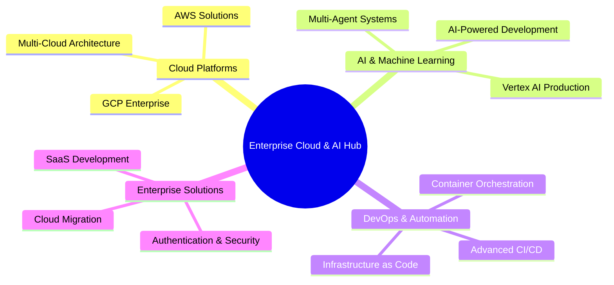
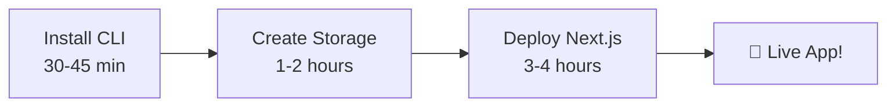
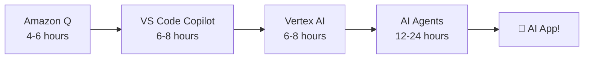
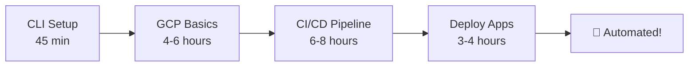
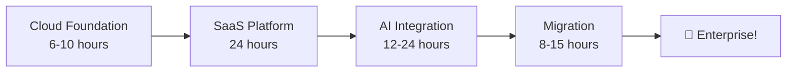
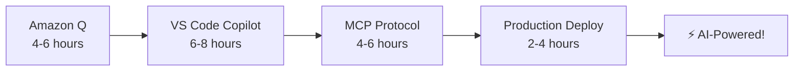
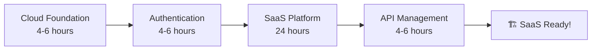

# ☁️ Cloud AI/Architect Academy: From Zero to AI Hero 🚀

> **"Democratizing enterprise-grade cloud and AI knowledge for the next generation of technology leaders"**

## 🎯 **Our Mission**

**Empowerin developers worldwide** to master cloud computing and AI technologies through hands-on, production-ready learning experiences. We believe that cutting-edge technical skills should be accessible to everyone—from complete beginners taking their first steps into the cloud, to seasoned professionals architecting the future of enterprise AI.

### 👨‍💻 **Meet Your Guide: Raphaël MANSUY**

Meet **Raphaël MANSUY**—your guide on this journey. With hands-on experience leading cloud and AI projects at startups and global enterprises, Raphaël is passionate about making advanced technology accessible to all developers. As CTO of [Elitizon](https://www.elitizon.com/) and founder of [QuantaLogic](https://www.quantalogic.app/), he brings practical insights and a collaborative approach to help you master real-world cloud and AI skills.

---

Welcome to your **comprehensive enterprise training ecosystem** for modern cloud computing, DevOps, and AI development! This repository delivers hands-on, production-ready tutorials that transform developers into cloud architects and AI engineers—spanning from fundamental containerization to cutting-edge multi-agent AI systems and enterprise-scale cloud architecture.

## 🌟 What Makes Cloud Architect Academy Unique

- **🎯 Accelerated Learning Paths**: 24-hour challenges for rapid, hands-on skill mastery
- **💼 Business Impact Focus**: Measurable ROI analysis and competitive market insights
- **🔧 Multi-Framework Support**: Flexible implementation options for maximum adoption

**Ready to transform your career?** Whether you're taking your first steps into cloud computing or architecting enterprise-grade AI solutions for Fortune 500 companies—this hub provides your complete learning pathway to success.

## 🎯 Mission & Vision

This project provides a **complete learning pathway** with production-ready training materials designed to accelerate your journey from cloud beginner to enterprise architect and AI specialist. Our comprehensive curriculum covers the entire modern technology stack:

- **Google Cloud Platform (GCP)**: Enterprise services, advanced configurations, and production deployments
- **Amazon Web Services (AWS)**: Migration strategies, managed services, and infrastructure as code
- **Kubernetes & Containerization**: Advanced orchestration, scaling, and production management
- **Machine Learning & AI Agents**: End-to-end ML pipelines, Vertex AI, and intelligent multi-agent systems
- **Cloud Storage & Data Management**: Enterprise-grade storage solutions, database optimization, and data engineering
- **DevOps & CI/CD**: Advanced automation, GitLab pipelines, AWS ECR, and deployment strategies
- **AI-Powered Development**: Revolutionary development acceleration with Amazon Q and VS Code Copilot Agent
- **Enterprise Authentication & Security**: OAuth2, OpenID Connect, API management, and enterprise identity
- **Cloud Migration & Infrastructure**: Strategic HAProxy-to-AWS migrations and infrastructure transformation
- **🏗️ Infrastructure as Code**: Advanced Terraform, AWS CDK TypeScript, and scalable architecture patterns

### 🎓 What Makes This Training Unique

Each tutorial is **enterprise-grade** and features:

- **Step-by-step, production-ready instructions** with enterprise best practices
- **Real-world examples and business use cases** with measurable ROI analysis
- **Clear prerequisites and detailed cost estimates** for budget planning
- **Comprehensive troubleshooting guides** and professional debugging techniques
- **24-hour challenges** for accelerated, hands-on mastery
- **Business impact analysis** with competitive market insights
- **Multi-framework support** for maximum adoption flexibility

Start your journey with confidence—whether you're new to the cloud or architecting enterprise-grade solutions for Fortune 500 companies.

Start your journey with confidence—whether you’re new to the cloud or aiming for advanced, production-ready skills.

---

## 🚀 How To Get Started

### 📊 Step 1: Assess Your Current Level & Choose Your Path

<strong>🔰 Complete Beginner</strong> - New to cloud computing

**What you'll achieve:** Deploy your first application to the cloud in under 4 hours

**Recommended Path:**

1. [Install Google Cloud CLI](#-cloud-tools--setup) (30-45 min)
2. [Create Your First GCP Storage](#-storage--data-management) (1-2 hours)
3. [Kubernetes Basics](#-container-orchestration) (2-3 hours)

**Time Investment:** 2-4 hours/week for 2-3 weeks
**Cost:** $0-5 USD (mostly free tier)

<strong>🚀 Intermediate</strong> - Have some cloud experience

**What you'll achieve:** Build production-ready applications with CI/CD automation

**Recommended Path:**

1. [GCP Crash Course for AWS Users](#-cloud-platforms--migration) (4-6 hours)
2. [AI-Powered Development with Amazon Q](#-ai-powered-developer-tools) (4-6 hours)
3. [Deploy Applications to Cloud Platforms](#-application-deployment--saas-development) (3-4 hours)
4. [CI/CD Automation with GitLab and AWS](#-devops--cicd-automation) (6-8 hours)

**Time Investment:** 5-10 hours/week for 3-4 weeks
**Cost:** $5-25 USD

<strong>🎓 Advanced</strong> - Experienced professionals seeking enterprise-grade solutions

**What you'll achieve:** Master AI agent development and enterprise architecture

**Recommended Path:**

1. [Complete ML Production Pipeline](#-artificial-intelligence--machine-learning) (6-8 hours)
2. [Enterprise AI Agent Development](#-artificial-intelligence--machine-learning) (40-60 hours)
3. [Multi-Agent System Orchestration](#-artificial-intelligence--machine-learning) (12-24 hours)
4. [Business Impact & ROI Analysis](#-artificial-intelligence--machine-learning)

**Time Investment:** 10-20 hours/week for 6-8 weeks
**Cost:** $20-80 USD

### ✅ Step 2: Choose by Career Goal

| **I Want To...**                 | **Recommended Path**                                            | **Time**    | **Level**             |
| -------------------------------- | --------------------------------------------------------------- | ----------- | --------------------- |
| 🚀 **Deploy my first app**       | [Quick Deployment Track](#quick-deployment-track)               | 4-6 hours   | Beginner              |
| 🤖 **Build AI applications**     | [AI Developer Track](#ai-developer-track)                       | 20-40 hours | Intermediate-Advanced |
| 🔄 **Automate my workflow**      | [DevOps Automation Track](#devops-automation-track)             | 15-25 hours | Intermediate          |
| 🏢 **Lead enterprise migration** | [Enterprise Architecture Track](#enterprise-architecture-track) | 40-80 hours | Advanced              |
| 👨‍💻 **Accelerate development**    | [AI-Powered Developer Track](#ai-powered-developer-track)       | 12-20 hours | Intermediate          |
| 🏗️ **Build production SaaS**     | [SaaS Architecture Track](#saas-architecture-track)             | 30-50 hours | Advanced              |

### ⏱️ Step 3: Choose by Time Available

<strong>⚡ Quick Wins</strong> (30 min - 2 hours) - Perfect for evenings

- [Install Google Cloud CLI](./03_how_to_install_google_cloud.md) (30-45 min)
- [Create GCP Storage Bucket](./02_create_gcp_bucket_en.md) (1-2 hours)
- [Prompts for Diagram Generation](./27_promp_for_diagrams/prompts_for_diagram.md) (1-2 hours)
- [Modern Python Development Toolkit](./23-modern-python-dev-toolkit.md) (2-4 hours)

**Perfect for:** Busy professionals, quick skill building

<strong>🛠️ Weekend Projects</strong> (2-8 hours) - Comprehensive learning

- [Kubernetes for Absolute Beginners](./01_kubernetes_beginner.md) (2-3 hours)
- [Deploy Next.js to GCP](./06_deploy_nextjs_to_gcp.md) (3-4 hours)
- [Transcribing Audio/Video with Gemini 2.5](./25-video-transcription-with-gemini-2-5.md) (3-5 hours)
- [Amazon Q Developer](./16_amazon_q.md) (4-6 hours)
- [GCP Crash Course](./04_gcp_crash_course.md) (4-6 hours)
- [GitLab CI/CD with AWS ECR](./15_ci_cd_gitlab_ecr.md) (6-8 hours)
- [Intent-Based Development](./17_intent_based_dev_vs_code_copilot.md) (6-8 hours)

**Perfect for:** Hands-on learners, weekend warriors

<strong>🏗️ Deep Dives</strong> (8+ hours) - Mastery-focused

- [MCP 2025-06-18 Documentation](./24-mcp.md) (8-12 hours)
- [A2A Protocol Mastery](./28-a2a.md) (8-12 hours)
- [Vertex AI Agent Engine](./22_google_vertex_agent_engine.md) (12-24 hours)
- [AWS ECS Fargate SaaS Development](./14_developing_a_saas_using_aws_and_ecs_fargate.md) (24 hours)
- [Google Agent Development Kit (ADK)](./07_agent/index.md) (40-60 hours)

**Perfect for:** Career transitions, skill specialization

<strong>🎯 Learning Sprints</strong> (Week-long commitments) - Intensive growth

**Week 1: Cloud Foundations**

- Days 1-2: CLI Setup + Storage
- Days 3-4: GCP Crash Course
- Days 5-7: First Deployment + Practice

**Week 2: AI-Powered Development**

- Days 1-2: Amazon Q Developer
- Days 3-5: Intent-Based Development
- Days 6-7: Real project implementation

**Week 3: Enterprise AI**

- Days 1-3: Vertex AI Complete
- Days 4-5: AI Agent Development
- Days 6-7: Production deployment

**Perfect for:** Bootcamp-style learning, career pivots

### 🎯 Step 4: Pick Your First Tutorial

Based on your selections above, here are your personalized recommendations:

**🔰 New to Cloud?** → Start with [Install Google Cloud CLI](./03_how_to_install_google_cloud.md)
**🚀 Have Experience?** → Jump to [GCP Crash Course](./04_gcp_crash_course.md)
**🤖 Want AI Focus?** → Begin with [Amazon Q Developer](./16_amazon_q.md)
**⚡ Need Quick Win?** → Try [Modern Python Toolkit](./23-modern-python-dev-toolkit.md)

---

## 🏆 Track Your Progress

### 📊 Progress Dashboard

**Current Skill Level:** [Select Your Level Above](#-step-1-assess-your-current-level--choose-your-path)
**Active Track:** [Choose Your Track](#-comprehensive-learning-tracks)
**Progress:** ░░░░░░░░░░ 0% Complete

### 🎯 Achievement System

<strong>🔰 Foundation Achievements</strong> (Beginner Level)

- [ ] 🔧 **Cloud Tools Master** - Completed CLI installation and setup
- [ ] 💾 **Storage Architect** - Set up and managed cloud storage solutions
- [ ] 📦 **Container Orchestrator** - Deployed first Kubernetes application
- [ ] 🚀 **First Deployment** - Successfully deployed application to cloud

**Unlock Requirement:** Complete any 3 foundation tutorials
**Next Level:** Intermediate Achievements unlocked!

<strong>🚀 Intermediate Achievements</strong> (Developing Expertise)

- [ ] ☁️ **Cloud Professional** - Completed GCP crash course
- [ ] 🔄 **CI/CD Automation Master** - Built automated Docker pipelines
- [ ] 🤖 **AI-Powered Developer** - Mastered Amazon Q and VS Code Copilot
- [ ] 📱 **Full-Stack Deployer** - Deployed complex applications to production

**Unlock Requirement:** Complete Foundation level + 2 intermediate tutorials
**Next Level:** Advanced Achievements unlocked!

<strong>🎓 Advanced Achievements</strong> (Expert Level)

- [ ] 🏢 **SaaS Architect** - Built complete production-ready SaaS platform
- [ ] 🧠 **AI Agent Developer** - Created intelligent AI agents
- [ ] 🌐 **API Management Expert** - Implemented enterprise API solutions
- [ ] 🔐 **Security Specialist** - Mastered OAuth2 and OpenID Connect
- [ ] 🚀 **Cloud Migration Expert** - Led infrastructure transformation

**Unlock Requirement:** Complete Intermediate level + 2 advanced tutorials
**Next Level:** Enterprise Master unlocked!

<strong>🏆 Enterprise Master</strong> (Industry Leadership)

- [ ] 🎯 **Enterprise AI Specialist** - Mastered multi-agent systems deployment
- [ ] 🏗️ **Data Platform Engineer** - Built production data engineering solutions
- [ ] 🌟 **Cloud Transformation Leader** - Led complete enterprise cloud adoption
- [ ] 💼 **Solution Architect** - Designed enterprise-grade cloud architectures

**Unlock Requirement:** Complete Advanced level + 3 enterprise tutorials
**Reward:** Industry recognition & career advancement opportunities!

### 📈 Smart Recommendations

Based on your progress, here are your next suggested tutorials:

**🎯 Immediate Next Steps:**

- Complete your current tutorial
- Review and practice concepts
- Plan your next learning milestone

**🚀 Suggested Progression:**

- [Your recommendations will appear here based on completed tutorials]

**💡 Pro Tips:**

- Set aside dedicated learning time each week
- Practice with real projects between tutorials
- Join the community discussions for support

---

## 📚 Tutorials by Outcome

### 🎯 **Get Your First App Live** (Beginner Success)

_Perfect for newcomers who want to see immediate results_

| Tutorial                                                           | Duration  | Level             | What You'll Build             |
| ------------------------------------------------------------------ | --------- | ----------------- | ----------------------------- |
| [📖 Install Google Cloud CLI](./03_how_to_install_google_cloud.md) | 30-45 min | Beginner          | Development environment setup |
| [📖 Create GCP Storage Bucket](./02_create_gcp_bucket_en.md)       | 1-2 hours | Beginner          | Cloud storage for your apps   |
| [📖 Deploy Next.js to GCP](./06_deploy_nextjs_to_gcp.md)           | 3-4 hours | Beginner-Advanced | Live web application          |

**🎉 End Result:** A production-ready web application running on Google Cloud
**💰 Cost:** $0-5 USD | **⏱️ Total Time:** 4-6 hours

### 🔄 **Automate Your Development Workflow** (Productivity Boost)

_Perfect for developers who want to work smarter, not harder_

| Tutorial                                                                                     | Duration  | Level                 | What You'll Build             |
| -------------------------------------------------------------------------------------------- | --------- | --------------------- | ----------------------------- |
| [📖 Amazon Q for the Impatient](./16_amazon_q.md)                                            | 4-6 hours | Beginner-Advanced     | AI-powered code generation    |
| [📖 Intent-Based Development with VS Code Copilot](./17_intent_based_dev_vs_code_copilot.md) | 6-8 hours | Beginner-Advanced     | Natural language programming  |
| [📖 GitLab CI/CD with AWS ECR](./15_ci_cd_gitlab_ecr.md)                                     | 6-8 hours | Beginner-Advanced     | Automated deployment pipeline |
| [📖 Modern Python Development Toolkit](./23-modern-python-dev-toolkit.md)                    | 2-4 hours | Intermediate-Advanced | Optimized Python workflow     |

**🎉 End Result:** AI-accelerated development with fully automated deployments
**💰 Cost:** $10-30 USD | **⏱️ Total Time:** 18-26 hours

### 🤖 **Build AI-Powered Applications** (Cutting Edge)

_Perfect for developers ready to integrate AI into their applications_

| Tutorial                                                                                   | Duration    | Level             | What You'll Build            |
| ------------------------------------------------------------------------------------------ | ----------- | ----------------- | ---------------------------- |
| [📖 Vertex AI Crash Course](./05_vertex_ai.md)                                             | 6-8 hours   | Advanced          | Complete ML pipeline         |
| [📖 Google Agent Development Kit (ADK)](./07_agent/index.md)                               | 40-60 hours | Advanced          | Intelligent AI agents        |
| [📖 Vertex AI Agent Engine](./22_google_vertex_agent_engine.md)                            | 12-24 hours | Advanced          | Enterprise AI agent platform |
| [📖 Transcribing Audio/Video with Gemini 2.5](./25-video-transcription-with-gemini-2-5.md) | 3-5 hours   | Beginner-Advanced | AI transcription service     |
| [📖 A2A Protocol](./28-a2a.md)                                                             | 8-12 hours  | Beginner-Advanced | Agent-to-agent communication |
| [📖 MCP 2025-06-18 Documentation](./24-mcp.md)                                             | 8-12 hours  | Beginner-Advanced | AI integration protocols     |
| [📖 LLM Documentation Mastery](./41-llm-documentation-mastery.md)                       | 4-8 hours  | Intermediate-Advanced | AI-optimized knowledge systems |
| [📖 Documentation for GenAI](./39-documentation-for-genai.md)                           | 2-4 hours  | Intermediate          | LLM-friendly content strategy  |

**🎉 End Result:** Production-ready AI applications with intelligent agents
**💰 Cost:** $30-80 USD | **⏱️ Total Time:** 77-111 hours

### 🏢 **Scale to Enterprise Production** (Business Ready)

_Perfect for teams and organizations ready for enterprise-grade solutions_

| Tutorial                                                                                   | Duration   | Level                 | What You'll Build             |
| ------------------------------------------------------------------------------------------ | ---------- | --------------------- | ----------------------------- |
| [📖 GCP Crash Course for AWS Professionals](./04_gcp_crash_course.md)                      | 4-6 hours  | Intermediate          | Multi-cloud expertise         |
| [📖 AWS ECS Fargate SaaS Development](./14_developing_a_saas_using_aws_and_ecs_fargate.md) | 24 hours   | Intermediate-Advanced | Complete SaaS platform        |
| [📖 OAuth2 Authentication](./11_oauth2.md)                                                 | 2-3 hours  | Intermediate          | Enterprise authentication     |
| [📖 OpenID Connect (OIDC)](./12_oidc_connect.md)                                           | 2-3 hours  | Intermediate          | Identity management           |
| [📖 Apigee API Management](./10_apigee.md)                                                 | 3-4 hours  | Intermediate          | Enterprise API platform       |
| [📖 HAProxy to AWS Migration](./13_migration_from_haproxy_to_aws_managed_services.md)      | 8-12 hours | Advanced              | Infrastructure transformation |

**🎉 End Result:** Enterprise-grade cloud architecture with security and scalability
**💰 Cost:** $25-75 USD | **⏱️ Total Time:** 43-52 hours

### 🔧 **Master Essential Cloud Skills** (Foundation Building)

_Perfect for building solid cloud computing fundamentals_

| Tutorial                                                            | Duration  | Level                 | What You'll Build              |
| ------------------------------------------------------------------- | --------- | --------------------- | ------------------------------ |
| [📖 Kubernetes for Absolute Beginners](./01_kubernetes_beginner.md) | 2-3 hours | Beginner              | Container orchestration        |
| [📖 Google Cloud SQL for Postgres](./19_google_cloud_sql.md)        | 3-5 hours | Beginner-Intermediate | Cloud database                 |
| [📖 Google Cloud IAM](./20_google_iam.md)                           | 2-3 hours | Intermediate          | Identity and access management |
| [📖 Google Cloud Run](./21_google_cloud_run.md)                     | 2-3 hours | Intermediate          | Serverless containers          |
| [📖 Terraform Foundations](./18_terraform.md)                       | 4-6 hours | Intermediate          | Infrastructure as Code         |

**🎉 End Result:** Solid foundation in cloud computing essentials
**💰 Cost:** $5-20 USD | **⏱️ Total Time:** 13-20 hours

_Perfect for deep diving into specific technologies and methodologies_

| Tutorial                                                                             | Duration   | Level                 | What You'll Build         |
| ------------------------------------------------------------------------------------ | ---------- | --------------------- | ------------------------- |
| [📖 Bruno for API Testing](./26-bruno.md)                                            | 2-4 hours  | Beginner-Advanced     | API testing automation    |
| [📖 AG-UI Protocol](./33_ag_ui.md)                                                   | 6-10 hours | Beginner-Advanced     | Interactive AI interfaces |
| [📖 Vertex AI Observability](./31_observability_llm_adk_vertex.md)                   | 2-4 hours  | Intermediate-Advanced | Production monitoring     |
| [📖 Mastering Embedding Types](./32_embeddings/index.md)                             | 8-12 hours | Intermediate-Advanced | Semantic search systems   |
| [📖 Context Engineering](./32_context_engineering/README.md)                         | 4-6 hours  | Intermediate-Advanced | AI context optimization   |
| [📖 Prompt Engineering for Diagrams](./27_promp_for_diagrams/prompts_for_diagram.md) | 1-2 hours  | Beginner-Advanced     | AI diagram generation     |
| [📖 Agentic AI Design Patterns](./34_agentic_ai_design_patterns.md)                  | 8-12 hours | Advanced              | Agentic system architecture → <a href="https://cloud.google.com/blog/products/ai-machine-learning/unlock-ai-agent-collaboration-convert-adk-agents-for-a2a/?hl=en" target="_blank">Unlock AI Agent Collaboration: Convert ADK Agents for A2A (Google Cloud Blog)</a> |
| [📖 Data Context Modeling: Context Engineering](./35_context_engineering_context_datamodel.md) | 4-6 hours  | Intermediate-Advanced | AI context optimization   |
| [📖 Context Engineering for Sales Agents](./37-contex-engineering-for-sales-agent.md) | 8-12 hours | Advanced-Executive    | Enterprise-grade AI sales agent context, frameworks, and production code |

**🎉 End Result:** Specialized expertise in cutting-edge technologies
**💰 Cost:** $10-40 USD | **⏱️ Total Time:** 23-38 hours

### 🛡️ **AI Risk Management** (Governance & Compliance)

_Essential for organizations and professionals seeking to manage, govern, and deploy AI responsibly_

| Tutorial                                                                                 | Duration   | Level                 | What You'll Build                |
| ---------------------------------------------------------------------------------------- | ---------- | --------------------- | -------------------------------- |
| [📖 AI Risk Management: Best Practices & Implementation](./38-ai-risk-management.md)      | 8-12 hours | Intermediate-Advanced | Comprehensive AI risk framework, compliance mapping, and implementation strategies |

**🎉 End Result:** Responsible, compliant, and trustworthy AI systems
**💰 Cost:** $10-30 USD | **⏱️ Total Time:** 8-12 hours

---

## 🧠 Context Engineering: The Next Frontier in AI & Cloud

Context Engineering is rapidly becoming a core discipline for building intelligent, adaptive, and enterprise-ready AI systems. Mastering context engineering enables you to design agents and applications that:

- Maintain situational awareness across long, complex interactions
- Optimize information flow for accuracy, speed, and efficiency
- Implement advanced memory, retrieval, and relevance mechanisms
- Balance privacy, scalability, and business impact in real-world deployments

### 📚 Key Tutorials

- [Context Engineering: Principles & Patterns](./32_context_engineering/README.md) — Start here for a practical overview and foundational concepts
- [Data Context Modeling: A Key Sub-Discipline of Context Engineering for AI Agents](./35_context_engineering_context_datamodel.md) — Deep dive into advanced architectures, real-world case studies, and implementation checklists

**Why focus on context?**

> "The most successful AI agents excel not because they have better models, but because they have better context."

Whether you’re building chatbots, multi-agent systems, or enterprise AI platforms, context engineering is the skill that will set you apart. Explore the tutorials above to future-proof your AI and cloud expertise.

---

## ✨ Prompt Engineering: The Multiplier for Everyday Life & Business

Prompt engineering is the art and science of communicating with AI to get exactly the results you want—faster, better, and with less effort. Mastering prompt engineering transforms AI from a generic tool into your personal expert, creative partner, and productivity multiplier.

### 📚 Key Tutorial

- [Prompt Engineering Mastery: From Everyday Life to Business Excellence](./36_prompt_engineering_for_everiday_life_to_business.md) — Learn the PRECISE framework, 9+ core techniques, and 70+ practical examples for maximizing AI value in daily work and business.

**Why focus on prompt engineering?**

> "The difference between mediocre and world-class AI results is not the model—it's the prompt."

**What you'll gain:**
- 50-80% reduction in AI revision cycles
- 300-500% improvement in output quality
- Immediate ROI in time saved and business impact

Whether you're writing emails, building business strategies, or automating workflows, prompt engineering is the essential skill for the AI-powered era. Start with the dedicated tutorial above to unlock the full potential of AI in your daily life and work.

---

## 🤖 AI Agents: Building the Next Generation of Intelligent Systems

AI agents are at the heart of modern automation, decision-making, and user interaction. Mastering AI agent development empowers you to:

- Design autonomous systems that reason, plan, and act in complex environments
- Orchestrate multi-agent collaboration for advanced workflows and business processes
- Integrate with cloud platforms, APIs, and enterprise data for real-world impact
- Apply agentic design patterns for scalable, maintainable, and explainable AI

### 📚 Key Tutorials

- [Google Agent Development Kit (ADK)](./07_agent/index.md) — Build production-ready AI agents from scratch
- [Agentic AI Design Patterns](./34_agentic_ai_design_patterns.md) — Architect robust, reusable agent systems
- [Vertex AI Agent Engine](./22_google_vertex_agent_engine.md) — Deploy and manage enterprise-scale agent platforms
- [A2A Protocol Mastery](./28-a2a.md) — Enable agent-to-agent communication and orchestration
- [MCP 2025-06-18 Documentation](./24-mcp.md) — Integrate agents with modern AI protocols

**Why focus on agents?**

> "AI agents are the building blocks of tomorrow’s intelligent applications—capable of learning, adapting, and collaborating at scale."

Whether you’re automating business processes, building conversational assistants, or orchestrating multi-agent systems, these tutorials will accelerate your journey to becoming an AI agent developer and architect.

---

## 🎯 Alternative Learning Paths

For users who prefer traditional structured paths, here are curated sequences:

| Path                              | Focus                   | Duration    | Description                                                    |
| --------------------------------- | ----------------------- | ----------- | -------------------------------------------------------------- |
| **Cloud Beginner → Professional** | Foundation Building     | 15-20 hours | CLI → Kubernetes → Storage → GCP Course → Deployment           |
| **AWS → GCP Migration**           | Platform Transition     | 8-12 hours  | CLI → GCP Course → Deployment → ML (optional)                  |
| **ML/AI Specialization**          | Artificial Intelligence | 60-90 hours | CLI → Storage → GCP → Vertex AI → AI Agents → Production       |
| **DevOps & Containers**           | Automation Focus        | 20-30 hours | CLI → Kubernetes → Amazon Q → CI/CD → Deployment               |
| **AI-Powered Development**        | Modern Workflows        | 25-35 hours | Amazon Q → Copilot → CLI → GCP → CI/CD → Vertex AI             |
| **Enterprise Architecture**       | Large-Scale Systems     | 50-80 hours | CLI → GCP → Authentication → SaaS → Migration → API Management |

**💡 Pro Tip:** These paths can be mixed and matched based on your specific goals and time availability.

---

## 🗺️ Comprehensive Learning Tracks

### Quick Deployment Track

_Perfect for: Getting your first app live quickly_
**Time:** 4-6 hours | **Level:** Beginner | **Cost:** $0-5

**Path:**

1. [Install Google Cloud CLI](./03_how_to_install_google_cloud.md) → Set up your environment
2. [Create GCP Storage Bucket](./02_create_gcp_bucket_en.md) → Learn cloud storage basics
3. [Deploy Next.js to GCP](./06_deploy_nextjs_to_gcp.md) → Get your app live

**What You'll Build:** A production-ready web application deployed to Google Cloud

### AI Developer Track

_Perfect for: Building intelligent applications_
**Time:** 20-40 hours | **Level:** Intermediate-Advanced | **Cost:** $10-50

**Path:**

1. [Amazon Q Developer](./16_amazon_q.md) → AI-powered coding
2. [Intent-Based Development](./17_intent_based_dev_vs_code_copilot.md) → Natural language programming
3. [Vertex AI Crash Course](./05_vertex_ai.md) → Machine learning platform
4. [Vertex AI Agent Engine](./22_google_vertex_agent_engine.md) → Production AI agents

**What You'll Build:** Intelligent AI-powered applications with natural language interfaces

### DevOps Automation Track

_Perfect for: Streamlining development workflows_  
**Time:** 15-25 hours | **Level:** Intermediate | **Cost:** $5-25

**Path:**

1. [Install Google Cloud CLI](./03_how_to_install_google_cloud.md) → Development environment
2. [GCP Crash Course](./04_gcp_crash_course.md) → Cloud platform mastery
3. [GitLab CI/CD with AWS ECR](./15_ci_cd_gitlab_ecr.md) → Automation pipelines
4. [Deploy Next.js to GCP](./06_deploy_nextjs_to_gcp.md) → Production deployment

**What You'll Build:** Fully automated CI/CD pipeline with cloud deployment

### Enterprise Architecture Track

_Perfect for: Leading large-scale cloud transformations_
**Time:** 40-80 hours | **Level:** Advanced | **Cost:** $20-80

**Path:**

1. [GCP Crash Course](./04_gcp_crash_course.md) → Multi-cloud expertise
2. [AWS ECS Fargate SaaS Development](./14_developing_a_saas_using_aws_and_ecs_fargate.md) → Enterprise SaaS
3. [Vertex AI Agent Engine](./22_google_vertex_agent_engine.md) → AI integration
4. [HAProxy to AWS Migration](./13_migration_from_haproxy_to_aws_managed_services.md) → Infrastructure transformation

**What You'll Build:** Complete enterprise-grade cloud architecture with AI capabilities

### AI-Powered Developer Track

_Perfect for: Accelerating development with AI tools_
**Time:** 12-20 hours | **Level:** Intermediate | **Cost:** $10-30

**Path:**

1. [Amazon Q Developer](./16_amazon_q.md) → AI code generation
2. [Intent-Based Development](./17_intent_based_dev_vs_code_copilot.md) → Natural language coding
3. [MCP 2025-06-18 Documentation](./24-mcp.md) → AI integration protocols
4. [Deploy Next.js to GCP](./06_deploy_nextjs_to_gcp.md) → Production deployment

**What You'll Build:** AI-accelerated development workflow with intelligent code generation

### SaaS Architecture Track

_Perfect for: Building production-ready SaaS platforms_
**Time:** 30-50 hours | **Level:** Advanced | **Cost:** $15-60

**Path:**

1. [GCP Crash Course](./04_gcp_crash_course.md) → Cloud platform foundation
2. [OAuth2 Authentication](./11_oauth2.md) + [OpenID Connect](./12_oidc_connect.md) → Security
3. [AWS ECS Fargate SaaS Development](./14_developing_a_saas_using_aws_and_ecs_fargate.md) → Core platform
4. [Apigee API Management](./10_apigee.md) → API layer

**What You'll Build:** Complete production-ready SaaS platform with enterprise features

---

## 💰 Cost Estimates

| Tutorial Category                                 | Estimated Cost | Free Tier Coverage      |
| ------------------------------------------------- | -------------- | ----------------------- |
| **Quick Wins** (CLI, Storage, Python)             | $0-5 USD       | ✅ Completely covered   |
| **Weekend Projects** (Kubernetes, Deployment)     | $0-15 USD      | ✅ Mostly covered       |
| **AI Development** (Amazon Q, Copilot, Vertex AI) | $10-40 USD     | ⚠️ Some paid features   |
| **Enterprise Projects** (SaaS, Migration)         | $15-60 USD     | ⚠️ Multiple services    |
| **Advanced AI** (ADK, Agent Engine)               | $20-80 USD     | ⚠️ Production workloads |

> **💡 Cost Tip:** All tutorials include detailed cleanup instructions to minimize costs. Most can be completed within free tier limits.

> **🚀 Featured Cost Savings:** The [Video Transcription with Gemini 2.5](./25-video-transcription-with-gemini-2-5.md) tutorial includes advanced optimization techniques that can reduce transcription costs by up to 50% while maintaining quality - potentially saving $691+ annually for high-volume processing!

---

## 🚦 Getting Started

1. **Choose your learning approach** from the options above
2. **Set up prerequisites** for your chosen tutorials
3. **Follow the tutorials** at your own pace
4. **Track your progress** using our achievement system
5. **Clean up resources** after each tutorial to avoid unnecessary costs

---

## 📞 Support & Community

If you encounter issues while following these tutorials:

1. **Check prerequisites** - ensure all requirements are met
2. **Review error messages** carefully - most include helpful hints
3. **Consult troubleshooting sections** in individual tutorials
4. **Search for similar issues** in cloud provider documentation
5. **Ask for help** by opening an issue in this repository

**🤝 Contributing:** Found an error or want to add content? We welcome contributions! Open an issue or submit a pull request.

---

**Happy Learning! 🎓**

_Transform your career with enterprise-grade cloud and AI skills_

---

## 🤝 Connect & Community Hub

### 👨‍💻 **About the Author**

This repository has been developed with ❤️ by **Raphaël MANSUY** - a passionate technologist and AI expert with decades of experience transforming businesses through cloud and AI technologies.

**Raphaël's Background:**

- 🚀 **CTO & Founder** - Running [Elitizon](https://www.elitizon.com/) startup studio in Hong Kong
- 🤖 **AI Pioneer** - Founder of [QuantaLogic](https://www.quantalogic.app/) AI Platform
- 📚 **Published Author** - [The Definitive Guide to Data Integration](https://www.packtpub.com/en-us/product/the-definitive-guide-to-data-integration-9781837631919)
- 🎯 **Board Member** - French Tech Board Member & Technical Advisor
- 👨‍💻 **Lifelong Developer** - Coding since age 14, passionate about DataEngineering, DataScience & AI

### 🌐 **Join Our Growing Community**

**Connect with 10,000+ AI developers, cloud architects, and tech innovators worldwide:**

#### **📱 Follow & Connect**

| Platform            | Link                                                        | What You'll Get                          |
| ------------------- | ----------------------------------------------------------- | ---------------------------------------- |
| 🔗 **LinkedIn**     | [raphaelmansuy](https://www.linkedin.com/in/raphaelmansuy/) | Professional insights & industry updates |
| 🐦 **Twitter/X**    | [@raphaelmansuy](https://twitter.com/raphaelmansuy)         | Daily AI tips & tech discussions         |
| 📧 **Newsletter**   | [Exponential AI](https://exponentialai.substack.com/)       | Weekly AI breakthroughs & analysis       |
| 📝 **Medium**       | [@raphael.mansuy](https://medium.com/@raphael.mansuy)       | In-depth AI & Data Engineering articles  |
| 💬 **Consultation** | [Book a Session](https://topmate.io/raphael_mansuy)         | 1-on-1 technical guidance                |

#### **🚀 Explore More Projects**

**Check out Raphaël's other innovative projects:**

- 🏛️ **[Digital Palace](https://github.com/raphaelmansuy/digital_palace)** - Personal knowledge management system & AI insights
- 🔧 **[Code2Prompt](https://github.com/raphaelmansuy/code2prompt)** - Transform codebases into LLM-ready prompts (850+ ⭐)
- 🤖 **[QuantaLogic](https://github.com/quantalogic/quantalogic)** - ReAct coding agent framework (425+ ⭐)
- 🧠 **[Iteration of Thought](https://github.com/raphaelmansuy/iteration_of_tought)** - Advanced AI reasoning implementation
- 📚 **[Course Generator](https://github.com/raphaelmansuy/course_generator)** - AI-powered educational content creation

### 💬 **Community Support & Discussions

#### **🎓 Learning Support**

- **🆘 Need Help?** Open an issue in this repository with detailed questions
- **💡 Share Ideas** Contribute improvements via pull requests
- **📚 Study Groups** Connect with other learners in the community
- **🔧 Technical Issues** Get help from experienced developers

#### **🤝 Professional Network**

- **🏢 Enterprise Consulting** Available for cloud migration projects
- **📈 Business Strategy** AI adoption and digital transformation guidance
- **🎤 Speaking Engagements** Conference talks and workshops
- **🎯 Mentorship** Career guidance for aspiring cloud architects and AI engineers

### 🌟 **Ways to Support This Project**

#### **🎯 Immediate Actions**

- ⭐ **Star this repository** if you find it valuable
- 🔄 **Share with colleagues** and on social media
- 📢 **Spread the word** about your learning success stories
- 💼 **Recommend to teams** looking for cloud/AI training

#### **🚀 Get Involved**

- 📝 **Contribute tutorials** based on your expertise
- 🐛 **Report issues** or suggest improvements
- 💡 **Submit new ideas** for tutorials or learning paths
- 🎨 **Improve documentation** and user experience

#### **💎 Premium Support**

- 🔍 **Code Reviews** - Get expert feedback on your cloud projects
- 🎯 **Custom Training** - Tailored workshops for your team
- 📊 **Architecture Consulting** - Enterprise-grade solution design
- 🚀 **Implementation Support** - Hands-on project assistance

### 📈 **Community Growth & Impact**

**Join an emerging ecosystem of learners and innovators - we're just getting started!**

| Metric                      | Current Status                                                                                                             | Growth Potential                                |
| --------------------------- | -------------------------------------------------------------------------------------------------------------------------- | ----------------------------------------------- |
| 🌟 **Community Interest**   |  | 📈 Just launched - growing daily                |
| 📚 **Tutorial Collection**  | 30+ comprehensive guides                                                                                                   | 🚀 Expanding with new content weekly            |
| 🌍 **Global Accessibility** | Available worldwide                                                                                                        | 🌐 Reaching developers in every timezone        |
| 💼 **Career Impact Focus**  | Enterprise-grade training                                                                                                  | 📊 Designed for measurable skill transformation |

### 🎯 **Ready to Transform Your Career?**

#### 🚀 Start Your Journey Today

Choose your path above and begin your transformation from cloud beginner to enterprise architect and AI specialist.

#### 💡 Questions? Need guidance?

[📧 Contact Raphaël](mailto:raphael.mansuy@gmail.com) | [💬 Book Consultation](https://topmate.io/raphael_mansuy) | [🔗 Connect on LinkedIn](https://www.linkedin.com/in/raphaelmansuy/)

---

**"Technology is best when it brings people together."** - Matt Mullenweg

_Let's build the future of cloud and AI together!_

---

Last updated: June 2025
