# Cloud & DevOps Training Hub 🚀

Welcome to your comprehensive collection of **enterprise-grade cloud computing and DevOps tutorials**! This repository provides hands-on, actionable training materials to help you master modern cloud technologies, from basic containerization to advanced AI agent development and multi-cloud architecture.

## 📚 Purpose

This project offers a curated collection of **production-ready training tutorials** designed to transform you from beginner to cloud enterprise architect. Our focus areas span the complete cloud ecosystem:

- **Google Cloud Platform (GCP)**: Enterprise services, advanced configurations, and production deployments
- **Amazon Web Services (AWS)**: Migration strategies, managed services, and infrastructure as code
- **Kubernetes & Containerization**: Advanced orchestration, scaling, and production management
- **Machine Learning & AI Agents**: End-to-end ML pipelines, Vertex AI, and intelligent multi-agent systems
- **Cloud Storage & Data Management**: Enterprise-grade storage solutions, database optimization, and data engineering
- **DevOps & CI/CD**: Advanced automation, GitLab pipelines, AWS ECR, and deployment strategies
- **AI-Powered Development**: Revolutionary development acceleration with Amazon Q and VS Code Copilot Agent
- **Enterprise Authentication & Security**: OAuth2, OpenID Connect, API management, and enterprise identity
- **Cloud Migration & Infrastructure**: Strategic HAProxy-to-AWS migrations and infrastructure transformation
- **Infrastructure as Code**: Advanced Terraform, CDK TypeScript, and scalable architecture patterns

Each tutorial features:

- **Step-by-step, production-ready instructions** with enterprise best practices
- **Real-world examples and business use cases** with measurable ROI analysis
- **Clear prerequisites and detailed cost estimates** for budget planning
- **Comprehensive troubleshooting guides** and professional debugging techniques
- **24-hour challenges** for accelerated, hands-on mastery
- **Business impact analysis** with competitive market insights
- **Multi-framework support** for maximum adoption flexibility

Start your journey with confidence—whether you're new to the cloud or architecting enterprise-grade solutions for Fortune 500 companies.

Start your journey with confidence—whether you’re new to the cloud or aiming for advanced, production-ready skills.

---

## 🚀 How To Get Started

### 📊 Step 1: Assess Your Current Level & Choose Your Path

<strong>🔰 Complete Beginner</strong> - New to cloud computing

**What you'll achieve:** Deploy your first application to the cloud in under 4 hours

**Recommended Path:**
1. [Install Google Cloud CLI](#-cloud-tools--setup) (30-45 min)
2. [Create Your First GCP Storage](#-storage--data-management) (1-2 hours)
3. [Kubernetes Basics](#-container-orchestration) (2-3 hours)

**Time Investment:** 2-4 hours/week for 2-3 weeks
**Cost:** $0-5 USD (mostly free tier)

<strong>🚀 Intermediate</strong> - Have some cloud experience

**What you'll achieve:** Build production-ready applications with CI/CD automation

**Recommended Path:**
1. [GCP Crash Course for AWS Users](#-cloud-platforms--migration) (4-6 hours)
2. [AI-Powered Development with Amazon Q](#-ai-powered-developer-tools) (4-6 hours)
3. [Deploy Applications to Cloud Platforms](#-application-deployment--saas-development) (3-4 hours)
4. [CI/CD Automation with GitLab and AWS](#-devops--cicd-automation) (6-8 hours)

**Time Investment:** 5-10 hours/week for 3-4 weeks
**Cost:** $5-25 USD

<strong>📠Advanced</strong> - Experienced professionals seeking enterprise-grade solutions

**What you'll achieve:** Master AI agent development and enterprise architecture

**Recommended Path:**
1. [Complete ML Production Pipeline](#-artificial-intelligence--machine-learning) (6-8 hours)
2. [Enterprise AI Agent Development](#-artificial-intelligence--machine-learning) (40-60 hours)
3. [Multi-Agent System Orchestration](#-artificial-intelligence--machine-learning) (12-24 hours)
4. [Business Impact & ROI Analysis](#-artificial-intelligence--machine-learning)

**Time Investment:** 10-20 hours/week for 6-8 weeks
**Cost:** $20-80 USD

### � Step 2: Choose by Career Goal

| **I Want To...** | **Recommended Path** | **Time** | **Level** |
|-------------------|---------------------|----------|-----------|
| 🚀 **Deploy my first app** | [Quick Deployment Track](#quick-deployment-track) | 4-6 hours | Beginner |
| 🤖 **Build AI applications** | [AI Developer Track](#ai-developer-track) | 20-40 hours | Intermediate-Advanced |
| 🔄 **Automate my workflow** | [DevOps Automation Track](#devops-automation-track) | 15-25 hours | Intermediate |
| 🏢 **Lead enterprise migration** | [Enterprise Architecture Track](#enterprise-architecture-track) | 40-80 hours | Advanced |
| 👨‍💻 **Accelerate development** | [AI-Powered Developer Track](#ai-powered-developer-track) | 12-20 hours | Intermediate |
| 🏗️ **Build production SaaS** | [SaaS Architecture Track](#saas-architecture-track) | 30-50 hours | Advanced |

### ⏱️ Step 3: Choose by Time Available

<strong>⚡ Quick Wins</strong> (30 min - 2 hours) - Perfect for evenings

- [Install Google Cloud CLI](./03_how_to_install_google_cloud.md) (30-45 min)
- [Create GCP Storage Bucket](./02_create_gcp_bucket_en.md) (1-2 hours)
- [Prompts for Diagram Generation](./27_promp_for_diagrams/prompts_for_diagram.md) (1-2 hours)
- [Modern Python Development Toolkit](./23-modern-python-dev-toolkit.md) (2-4 hours)

**Perfect for:** Busy professionals, quick skill building

<strong>🛠️ Weekend Projects</strong> (2-8 hours) - Comprehensive learning

- [Kubernetes for Absolute Beginners](./01_kubernetes_beginner.md) (2-3 hours)
- [Deploy Next.js to GCP](./06_deploy_nextjs_to_gcp.md) (3-4 hours)
- [Amazon Q Developer](./16_amazon_q.md) (4-6 hours)
- [GCP Crash Course](./04_gcp_crash_course.md) (4-6 hours)
- [GitLab CI/CD with AWS ECR](./15_ci_cd_gitlab_ecr.md) (6-8 hours)
- [Intent-Based Development](./17_intent_based_dev_vs_code_copilot.md) (6-8 hours)

**Perfect for:** Hands-on learners, weekend warriors

<strong>🏗️ Deep Dives</strong> (8+ hours) - Mastery-focused

- [MCP 2025-06-18 Documentation](./24-mcp.md) (8-12 hours)
- [A2A Protocol Mastery](./28-a2a.md) (8-12 hours)
- [Vertex AI Agent Engine](./22_google_vertex_agent_engine.md) (12-24 hours)
- [AWS ECS Fargate SaaS Development](./14_developing_a_saas_using_aws_and_ecs_fargate.md) (24 hours)
- [Google Agent Development Kit (ADK)](./07_agent/index.md) (40-60 hours)

**Perfect for:** Career transitions, skill specialization

<strong>🯠Learning Sprints</strong> (Week-long commitments) - Intensive growth

**Week 1: Cloud Foundations**
- Days 1-2: CLI Setup + Storage
- Days 3-4: GCP Crash Course
- Days 5-7: First Deployment + Practice

**Week 2: AI-Powered Development**
- Days 1-2: Amazon Q Developer
- Days 3-5: Intent-Based Development
- Days 6-7: Real project implementation

**Week 3: Enterprise AI**
- Days 1-3: Vertex AI Complete
- Days 4-5: AI Agent Development
- Days 6-7: Production deployment

**Perfect for:** Bootcamp-style learning, career pivots

### 🎯 Step 4: Pick Your First Tutorial

Based on your selections above, here are your personalized recommendations:

**🔰 New to Cloud?** → Start with [Install Google Cloud CLI](./03_how_to_install_google_cloud.md)
**🚀 Have Experience?** → Jump to [GCP Crash Course](./04_gcp_crash_course.md) 
**🤖 Want AI Focus?** → Begin with [Amazon Q Developer](./16_amazon_q.md)
**⚡ Need Quick Win?** → Try [Modern Python Toolkit](./23-modern-python-dev-toolkit.md)

---

## 🏆 Track Your Progress

### 📊 Progress Dashboard

**Current Skill Level:** [Select Your Level Above](#-step-1-assess-your-current-level--choose-your-path)
**Active Track:** [Choose Your Track](#-comprehensive-learning-tracks)
**Progress:** ░░░░░░░░░░ 0% Complete

### 🎯 Achievement System

<strong>🔰 Foundation Achievements</strong> (Beginner Level)

- [ ] 🔧 **Cloud Tools Master** - Completed CLI installation and setup
- [ ] 💾 **Storage Architect** - Set up and managed cloud storage solutions  
- [ ] 📦 **Container Orchestrator** - Deployed first Kubernetes application
- [ ] 🚀 **First Deployment** - Successfully deployed application to cloud

**Unlock Requirement:** Complete any 3 foundation tutorials
**Next Level:** Intermediate Achievements unlocked!

<strong>🚀 Intermediate Achievements</strong> (Developing Expertise)

- [ ] ☁️ **Cloud Professional** - Completed GCP crash course
- [ ] 🔄 **CI/CD Automation Master** - Built automated Docker pipelines
- [ ] 🤖 **AI-Powered Developer** - Mastered Amazon Q and VS Code Copilot
- [ ] 📱 **Full-Stack Deployer** - Deployed complex applications to production

**Unlock Requirement:** Complete Foundation level + 2 intermediate tutorials
**Next Level:** Advanced Achievements unlocked!

<strong>📠Advanced Achievements</strong> (Expert Level)

- [ ] 🏢 **SaaS Architect** - Built complete production-ready SaaS platform
- [ ] 🧠 **AI Agent Developer** - Created intelligent AI agents
- [ ] 🌐 **API Management Expert** - Implemented enterprise API solutions
- [ ] 🔐 **Security Specialist** - Mastered OAuth2 and OpenID Connect
- [ ] 🚀 **Cloud Migration Expert** - Led infrastructure transformation

**Unlock Requirement:** Complete Intermediate level + 2 advanced tutorials
**Next Level:** Enterprise Master unlocked!

<strong>🆠Enterprise Master</strong> (Industry Leadership)

- [ ] 🎯 **Enterprise AI Specialist** - Mastered multi-agent systems deployment
- [ ] 🏗️ **Data Platform Engineer** - Built production data engineering solutions
- [ ] 🌟 **Cloud Transformation Leader** - Led complete enterprise cloud adoption
- [ ] 💼 **Solution Architect** - Designed enterprise-grade cloud architectures

**Unlock Requirement:** Complete Advanced level + 3 enterprise tutorials
**Reward:** Industry recognition & career advancement opportunities!

### 📈 Smart Recommendations

Based on your progress, here are your next suggested tutorials:

**🎯 Immediate Next Steps:**
- Complete your current tutorial
- Review and practice concepts
- Plan your next learning milestone

**🚀 Suggested Progression:**
- [Your recommendations will appear here based on completed tutorials]

**💡 Pro Tips:**
- Set aside dedicated learning time each week
- Practice with real projects between tutorials
- Join the community discussions for support

---

## 📚 Tutorials by Outcome

### 🎯 **Get Your First App Live** (Beginner Success)
*Perfect for newcomers who want to see immediate results*

| Tutorial | Duration | Level | What You'll Build |
|----------|----------|-------|-------------------|
| [📖 Install Google Cloud CLI](./03_how_to_install_google_cloud.md) | 30-45 min | Beginner | Development environment setup |
| [📖 Create GCP Storage Bucket](./02_create_gcp_bucket_en.md) | 1-2 hours | Beginner | Cloud storage for your apps |
| [📖 Deploy Next.js to GCP](./06_deploy_nextjs_to_gcp.md) | 3-4 hours | Beginner-Advanced | Live web application |

**🎉 End Result:** A production-ready web application running on Google Cloud
**💰 Cost:** $0-5 USD | **⏱️ Total Time:** 4-6 hours

### 🔄 **Automate Your Development Workflow** (Productivity Boost)
*Perfect for developers who want to work smarter, not harder*

| Tutorial | Duration | Level | What You'll Build |
|----------|----------|-------|-------------------|
| [📖 Amazon Q for the Impatient](./16_amazon_q.md) | 4-6 hours | Beginner-Advanced | AI-powered code generation |
| [📖 Intent-Based Development with VS Code Copilot](./17_intent_based_dev_vs_code_copilot.md) | 6-8 hours | Beginner-Advanced | Natural language programming |
| [📖 GitLab CI/CD with AWS ECR](./15_ci_cd_gitlab_ecr.md) | 6-8 hours | Beginner-Advanced | Automated deployment pipeline |
| [📖 Modern Python Development Toolkit](./23-modern-python-dev-toolkit.md) | 2-4 hours | Intermediate-Advanced | Optimized Python workflow |

**🎉 End Result:** AI-accelerated development with fully automated deployments
**💰 Cost:** $10-30 USD | **⏱️ Total Time:** 18-26 hours

### 🤖 **Build AI-Powered Applications** (Cutting Edge)
*Perfect for developers ready to integrate AI into their applications*

| Tutorial | Duration | Level | What You'll Build |
|----------|----------|-------|-------------------|
| [📖 Vertex AI Crash Course](./05_vertex_ai.md) | 6-8 hours | Advanced | Complete ML pipeline |
| [📖 Google Agent Development Kit (ADK)](./07_agent/index.md) | 40-60 hours | Advanced | Intelligent AI agents |
| [📖 Vertex AI Agent Engine](./22_google_vertex_agent_engine.md) | 12-24 hours | Advanced | Enterprise AI agent platform |
| [📖 Transcribing Audio/Video with Gemini 2.5](./25-video-transcription-with-gemini-2-5.md) | 3-5 hours | Beginner-Advanced | AI transcription service |
| [📖 A2A Protocol](./28-a2a.md) | 8-12 hours | Beginner-Advanced | Agent-to-agent communication |
| [📖 MCP 2025-06-18 Documentation](./24-mcp.md) | 8-12 hours | Beginner-Advanced | AI integration protocols |

**🎉 End Result:** Production-ready AI applications with intelligent agents
**💰 Cost:** $30-80 USD | **⏱️ Total Time:** 77-111 hours

### 🏢 **Scale to Enterprise Production** (Business Ready)
*Perfect for teams and organizations ready for enterprise-grade solutions*

| Tutorial | Duration | Level | What You'll Build |
|----------|----------|-------|-------------------|
| [📖 GCP Crash Course for AWS Professionals](./04_gcp_crash_course.md) | 4-6 hours | Intermediate | Multi-cloud expertise |
| [📖 AWS ECS Fargate SaaS Development](./14_developing_a_saas_using_aws_and_ecs_fargate.md) | 24 hours | Intermediate-Advanced | Complete SaaS platform |
| [📖 OAuth2 Authentication](./11_oauth2.md) | 2-3 hours | Intermediate | Enterprise authentication |
| [📖 OpenID Connect (OIDC)](./12_oidc_connect.md) | 2-3 hours | Intermediate | Identity management |
| [📖 Apigee API Management](./10_apigee.md) | 3-4 hours | Intermediate | Enterprise API platform |
| [📖 HAProxy to AWS Migration](./13_migration_from_haproxy_to_aws_managed_services.md) | 8-12 hours | Advanced | Infrastructure transformation |

**🎉 End Result:** Enterprise-grade cloud architecture with security and scalability
**💰 Cost:** $25-75 USD | **⏱️ Total Time:** 43-52 hours

### 🔧 **Master Essential Cloud Skills** (Foundation Building)
*Perfect for building solid cloud computing fundamentals*

| Tutorial | Duration | Level | What You'll Build |
|----------|----------|-------|-------------------|
| [📖 Kubernetes for Absolute Beginners](./01_kubernetes_beginner.md) | 2-3 hours | Beginner | Container orchestration |
| [📖 Google Cloud SQL for Postgres](./19_google_cloud_sql.md) | 3-5 hours | Beginner-Intermediate | Cloud database |
| [📖 Google Cloud IAM](./20_google_iam.md) | 2-3 hours | Intermediate | Identity and access management |
| [📖 Google Cloud Run](./21_google_cloud_run.md) | 2-3 hours | Intermediate | Serverless containers |
| [📖 Terraform Foundations](./18_terraform.md) | 4-6 hours | Intermediate | Infrastructure as Code |

**🎉 End Result:** Solid foundation in cloud computing essentials
**💰 Cost:** $5-20 USD | **⏱️ Total Time:** 13-20 hours

### 🧪 **Advanced Specializations** (Expert Level)
*Perfect for deep diving into specific technologies and methodologies*

| Tutorial | Duration | Level | What You'll Build |
|----------|----------|-------|-------------------|
| [📖 Bruno for API Testing](./26-bruno.md) | 2-4 hours | Beginner-Advanced | API testing automation |
| [📖 AG-UI Protocol](./33_ag_ui.md) | 6-10 hours | Beginner-Advanced | Interactive AI interfaces |
| [📖 Vertex AI Observability](./31_observability_llm_adk_vertex.md) | 2-4 hours | Intermediate-Advanced | Production monitoring |
| [📖 Mastering Embedding Types](./32_embeddings/index.md) | 8-12 hours | Intermediate-Advanced | Semantic search systems |
| [📖 Context Engineering](./32_context_engineering/README.md) | 4-6 hours | Intermediate-Advanced | AI context optimization |
| [📖 Prompt Engineering for Diagrams](./27_promp_for_diagrams/prompts_for_diagram.md) | 1-2 hours | Beginner-Advanced | AI diagram generation |

**🎉 End Result:** Specialized expertise in cutting-edge technologies
**💰 Cost:** $10-40 USD | **⏱️ Total Time:** 23-38 hours

---

## 🎯 Alternative Learning Paths

For users who prefer traditional structured paths, here are curated sequences:

| Path | Focus | Duration | Description |
|------|-------|----------|-------------|
| **Cloud Beginner → Professional** | Foundation Building | 15-20 hours | CLI → Kubernetes → Storage → GCP Course → Deployment |
| **AWS → GCP Migration** | Platform Transition | 8-12 hours | CLI → GCP Course → Deployment → ML (optional) |
| **ML/AI Specialization** | Artificial Intelligence | 60-90 hours | CLI → Storage → GCP → Vertex AI → AI Agents → Production |
| **DevOps & Containers** | Automation Focus | 20-30 hours | CLI → Kubernetes → Amazon Q → CI/CD → Deployment |
| **AI-Powered Development** | Modern Workflows | 25-35 hours | Amazon Q → Copilot → CLI → GCP → CI/CD → Vertex AI |
| **Enterprise Architecture** | Large-Scale Systems | 50-80 hours | CLI → GCP → Authentication → SaaS → Migration → API Management |

**💡 Pro Tip:** These paths can be mixed and matched based on your specific goals and time availability.

---

## 🗺️ Comprehensive Learning Tracks

### Quick Deployment Track
*Perfect for: Getting your first app live quickly*
**Time:** 4-6 hours | **Level:** Beginner | **Cost:** $0-5

```mermaid
graph LR
    A[Install CLI<br/>30-45 min] --> B[Create Storage<br/>1-2 hours]
    B --> C[Deploy Next.js<br/>3-4 hours]
    C --> D[🎉 Live App!]
```

**Path:**
1. [Install Google Cloud CLI](./03_how_to_install_google_cloud.md) → Set up your environment
2. [Create GCP Storage Bucket](./02_create_gcp_bucket_en.md) → Learn cloud storage basics  
3. [Deploy Next.js to GCP](./06_deploy_nextjs_to_gcp.md) → Get your app live

**What You'll Build:** A production-ready web application deployed to Google Cloud

### AI Developer Track  
*Perfect for: Building intelligent applications*
**Time:** 20-40 hours | **Level:** Intermediate-Advanced | **Cost:** $10-50

```mermaid
graph LR
    A[Amazon Q<br/>4-6 hours] --> B[VS Code Copilot<br/>6-8 hours]
    B --> C[Vertex AI<br/>6-8 hours]
    C --> D[AI Agents<br/>12-24 hours]
    D --> E[🤖 AI App!]
```

**Path:**
1. [Amazon Q Developer](./16_amazon_q.md) → AI-powered coding
2. [Intent-Based Development](./17_intent_based_dev_vs_code_copilot.md) → Natural language programming
3. [Vertex AI Crash Course](./05_vertex_ai.md) → Machine learning platform
4. [Vertex AI Agent Engine](./22_google_vertex_agent_engine.md) → Production AI agents

**What You'll Build:** Intelligent AI-powered applications with natural language interfaces

### DevOps Automation Track
*Perfect for: Streamlining development workflows*  
**Time:** 15-25 hours | **Level:** Intermediate | **Cost:** $5-25

```mermaid
graph LR
    A[CLI Setup<br/>45 min] --> B[GCP Basics<br/>4-6 hours]
    B --> C[CI/CD Pipeline<br/>6-8 hours]
    C --> D[Deploy Apps<br/>3-4 hours]
    D --> E[🔄 Automated!]
```

**Path:**
1. [Install Google Cloud CLI](./03_how_to_install_google_cloud.md) → Development environment
2. [GCP Crash Course](./04_gcp_crash_course.md) → Cloud platform mastery
3. [GitLab CI/CD with AWS ECR](./15_ci_cd_gitlab_ecr.md) → Automation pipelines
4. [Deploy Next.js to GCP](./06_deploy_nextjs_to_gcp.md) → Production deployment

**What You'll Build:** Fully automated CI/CD pipeline with cloud deployment

### Enterprise Architecture Track
*Perfect for: Leading large-scale cloud transformations*
**Time:** 40-80 hours | **Level:** Advanced | **Cost:** $20-80

```mermaid
graph LR
    A[Cloud Foundation<br/>6-10 hours] --> B[SaaS Platform<br/>24 hours]
    B --> C[AI Integration<br/>12-24 hours]
    C --> D[Migration<br/>8-15 hours]
    D --> E[🏢 Enterprise!]
```

**Path:**
1. [GCP Crash Course](./04_gcp_crash_course.md) → Multi-cloud expertise
2. [AWS ECS Fargate SaaS Development](./14_developing_a_saas_using_aws_and_ecs_fargate.md) → Enterprise SaaS
3. [Vertex AI Agent Engine](./22_google_vertex_agent_engine.md) → AI integration
4. [HAProxy to AWS Migration](./13_migration_from_haproxy_to_aws_managed_services.md) → Infrastructure transformation

**What You'll Build:** Complete enterprise-grade cloud architecture with AI capabilities

### AI-Powered Developer Track
*Perfect for: Accelerating development with AI tools*
**Time:** 12-20 hours | **Level:** Intermediate | **Cost:** $10-30

```mermaid
graph LR
    A[Amazon Q<br/>4-6 hours] --> B[VS Code Copilot<br/>6-8 hours]
    B --> C[MCP Protocol<br/>4-6 hours]
    C --> D[Production Deploy<br/>2-4 hours]
    D --> E[⚡ AI-Powered!]
```

**Path:**
1. [Amazon Q Developer](./16_amazon_q.md) → AI code generation
2. [Intent-Based Development](./17_intent_based_dev_vs_code_copilot.md) → Natural language coding
3. [MCP 2025-06-18 Documentation](./24-mcp.md) → AI integration protocols
4. [Deploy Next.js to GCP](./06_deploy_nextjs_to_gcp.md) → Production deployment

**What You'll Build:** AI-accelerated development workflow with intelligent code generation

### SaaS Architecture Track
*Perfect for: Building production-ready SaaS platforms*
**Time:** 30-50 hours | **Level:** Advanced | **Cost:** $15-60

```mermaid
graph LR
    A[Cloud Foundation<br/>4-6 hours] --> B[Authentication<br/>4-6 hours]
    B --> C[SaaS Platform<br/>24 hours]
    C --> D[API Management<br/>4-6 hours]
    D --> E[🏗️ SaaS Ready!]
```

**Path:**
1. [GCP Crash Course](./04_gcp_crash_course.md) → Cloud platform foundation
2. [OAuth2 Authentication](./11_oauth2.md) + [OpenID Connect](./12_oidc_connect.md) → Security
3. [AWS ECS Fargate SaaS Development](./14_developing_a_saas_using_aws_and_ecs_fargate.md) → Core platform
4. [Apigee API Management](./10_apigee.md) → API layer

**What You'll Build:** Complete production-ready SaaS platform with enterprise features

---

## 🛠️ Prerequisites

### **General Requirements**

- Computer with **8GB+ RAM** and **10GB+ free disk space**
- Stable internet connection
- Credit card for cloud provider signup (most tutorials use free tiers)

### **Software Requirements**

- Terminal/Command Line access
- Web browser
- Text editor or IDE

### **Cloud Accounts Needed**

- **Google Cloud Platform** account (free tier available)
- **AWS** account (for Kubernetes, SaaS development, and HAProxy migration tutorials, free tier available)

---

## 💰 Cost Estimates

| Tutorial Category | Estimated Cost | Free Tier Coverage |
|-------------------|----------------|-------------------|
| **Quick Wins** (CLI, Storage, Python) | $0-5 USD | ✅ Completely covered |
| **Weekend Projects** (Kubernetes, Deployment) | $0-15 USD | ✅ Mostly covered |
| **AI Development** (Amazon Q, Copilot, Vertex AI) | $10-40 USD | ⚠️ Some paid features |
| **Enterprise Projects** (SaaS, Migration) | $15-60 USD | ⚠️ Multiple services |
| **Advanced AI** (ADK, Agent Engine) | $20-80 USD | ⚠️ Production workloads |

> **💡 Cost Tip:** All tutorials include detailed cleanup instructions to minimize costs. Most can be completed within free tier limits.

---

## 🚦 Getting Started

1. **Choose your learning approach** from the options above
2. **Set up prerequisites** for your chosen tutorials  
3. **Follow the tutorials** at your own pace
4. **Track your progress** using our achievement system
5. **Clean up resources** after each tutorial to avoid unnecessary costs

---

## 📞 Support & Community

If you encounter issues while following these tutorials:

1. **Check prerequisites** - ensure all requirements are met
2. **Review error messages** carefully - most include helpful hints
3. **Consult troubleshooting sections** in individual tutorials
4. **Search for similar issues** in cloud provider documentation
5. **Ask for help** by opening an issue in this repository

**🤝 Contributing:** Found an error or want to add content? We welcome contributions! Open an issue or submit a pull request.

---

**Happy Learning! 🎓**

*Transform your career with enterprise-grade cloud and AI skills*

_Last updated: June 2025_
