%% Example: How to split a complex embedding pipeline into multiple diagrams

%% Diagram 1: Data Sources Layer

```mermaid
flowchart TD
    subgraph "Data Sources"
        direction LR
        DB[🗄️ Production DB]
        DataLake[📁 Data Lake]
        CMS[🗄️ Content Mgmt System]
    end

    subgraph "Data Collection Interface"
        Collector[📥 Data Collector]
    end

    DB --> Collector
    DataLake --> Collector
    CMS --> Collector

    style DB fill:#E8F4FD,stroke:#2C5AA0
    style DataLake fill:#E8F4FD,stroke:#2C5AA0
    style CMS fill:#E8F4FD,stroke:#2C5AA0
    style Collector fill:#E8F6F3,stroke:#1B5E4F
```

%% Diagram 2: Data Processing Pipeline

```mermaid
flowchart TD
    subgraph "Processing Pipeline"
        direction TB
        A[📥 Extract Data]
        B[🔧 Clean & Preprocess]
        C[🤖 Generate Embeddings]
        D[📦 Prepare for Ingestion]
    end

    A --> B
    B --> C
    C --> D

    style A fill:#E8F4FD,stroke:#2C5AA0
    style B fill:#E8F6F3,stroke:#1B5E4F
    style C fill:#FFF2CC,stroke:#B7950B
    style D fill:#F4ECF7,stroke:#7D3C98
```

%% Diagram 3: External Services Integration

```mermaid
flowchart TD
    subgraph "Embedding Infrastructure"
        direction TB
        ModelService[🌐 Embedding Model Service<br/>Hugging Face, OpenAI API]
    end

    subgraph "Processing"
        EmbedStep[🤖 Generate Embeddings]
    end

    EmbedStep -- "API Call" --> ModelService
    ModelService -- "Returns Vectors" --> EmbedStep

    style ModelService fill:#FADBD8,stroke:#A93226
    style EmbedStep fill:#FFF2CC,stroke:#B7950B
```

%% Diagram 4: Storage Layer

%% High-Level System Overview (Optional)

```mermaid
flowchart LR
    Sources[📊 Data Sources] --> Processing[⚙️ Processing Pipeline]
    Processing --> External[🌐 External Services]
    Processing --> Storage[💾 Storage Layer]

    style Sources fill:#E8F4FD,stroke:#2C5AA0
    style Processing fill:#E8F6F3,stroke:#1B5E4F
    style External fill:#FADBD8,stroke:#A93226
    style Storage fill:#F4ECF7,stroke:#7D3C98
```

