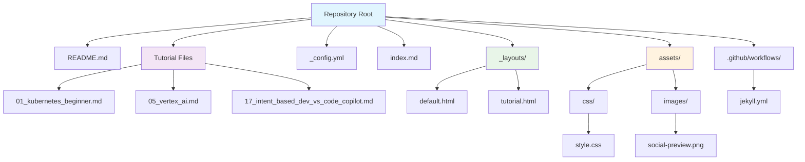
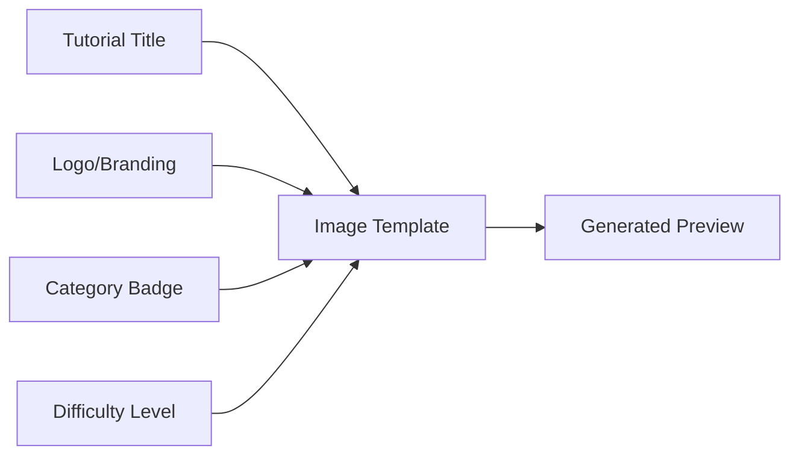
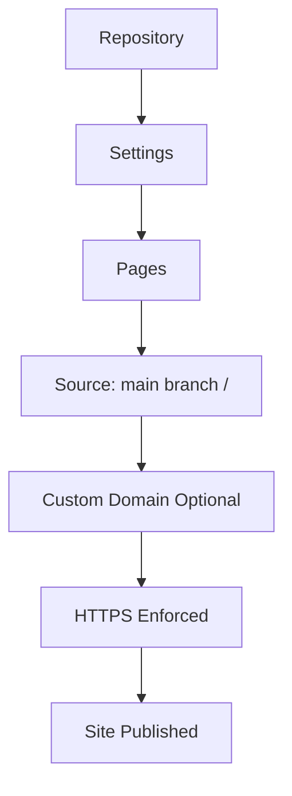

# Step-by-Step Guide: Free GitHub-Hosted Publication Website for Your Tutorials

This guide provides a comprehensive walkthrough for setting up a free, SEO-optimized publication website for your tutorial repositories using GitHub Pages with Jekyll, keeping your Markdown files at the repository root.

## 1. Technical Requirements & Setup

### 1.1. Configure GitHub Pages

1. **Navigate to your repository's settings:** Go to `Settings` > `Pages`.
2. **Choose a source:** Select the `main` branch and **`/ (root)`** as the source for your GitHub Pages site.
3. **Save your changes.** Your site will be available at `https://<your-username>.github.io/<repository-name>/`.

### 1.2. Repository Structure

Keep your existing tutorial files at the root level. Here's the recommended structure:



**Key Files:**
* **Tutorial `.md` files**: Your existing tutorials at repository root (e.g., `01_kubernetes_beginner.md`)
* **`README.md`**: Repository documentation (unchanged)
* **`index.md`**: Website homepage (new)
* **`_config.yml`**: Jekyll configuration (new)
* **`_layouts/`**: HTML templates for your pages (new)
* **`assets/`**: CSS, images, and other static files (new)

## 2. Jekyll Setup for Root-Level Markdown Pages

GitHub Pages uses Jekyll to automatically convert Markdown files to HTML. This setup keeps your tutorial files at the repository root while providing full SEO optimization.

### 2.1. Jekyll Configuration (`_config.yml`)

Create a `_config.yml` file at your repository root:

```yaml
title: Cloud & DevOps Training Hub
description: A collection of high-quality tutorials on cloud computing, DevOps, and more.
author: Your Name
url: "https://<your-username>.github.io"
baseurl: "/<repository-name>"

# Build settings
markdown: kramdown
highlighter: rouge
plugins:
  - jekyll-feed
  - jekyll-sitemap
  - jekyll-seo-tag

# Exclude files from processing
exclude:
  - README.md
  - .github/
  - .gitignore
  - Gemfile
  - Gemfile.lock
  - .vscode/
  - .pytest_cache/
  - .venv/

# Default values for all pages
defaults:
  - scope:
      path: ""
      type: "pages"
    values:
      layout: "default"
  - scope:
      path: ""
      type: "pages"
    values:
      layout: "tutorial"
```

### 2.2. Create Layout Templates

#### Default Layout (`_layouts/default.html`)

Create the `_layouts` directory at your repository root and add this template:

```html
<!DOCTYPE html>
<html lang="en">
<head>
    <meta charset="UTF-8">
    <meta name="viewport" content="width=device-width, initial-scale=1.0">
    <title>{{ page.title | default: site.title }}</title>
    <meta name="description" content="{{ page.description | default: site.description }}">
    <meta name="keywords" content="{{ page.keywords | join: ', ' }}">
    <meta name="author" content="{{ site.author }}">

    <!-- Open Graph Protocol -->
    <meta property="og:title" content="{{ page.title | default: site.title }}" />
    <meta property="og:description" content="{{ page.description | default: site.description }}" />
    <meta property="og:image" content="{{ site.url }}{{ site.baseurl }}/assets/images/social-preview.png" />
    <meta property="og:url" content="{{ site.url }}{{ page.url }}" />
    <meta property="og:type" content="website" />

    <!-- Twitter Card -->
    <meta name="twitter:card" content="summary_large_image">
    <meta name="twitter:title" content="{{ page.title | default: site.title }}">
    <meta name="twitter:description" content="{{ page.description | default: site.description }}">
    <meta name="twitter:image" content="{{ site.url }}{{ site.baseurl }}/assets/images/social-preview.png">

    <link rel="stylesheet" href="{{ "/assets/css/style.css" | relative_url }}">
</head>
<body>
    <header>
        <h1>{{ site.title }}</h1>
        <nav>
            <a href="{{ "/" | relative_url }}">Home</a>
            <a href="{{ "/tutorials" | relative_url }}">Tutorials</a>
        </nav>
    </header>
    <main>
        {{ content }}
    </main>
    <footer>
        <p>&copy; {{ 'now' | date: "%Y" }} {{ site.author }}</p>
    </footer>
</body>
</html>
```

### 2.3. Creating Markdown Pages

Now you can create your pages in Markdown. Each Markdown file should start with YAML front matter to specify metadata:

#### Homepage (`index.md`)

```markdown
---
layout: default
title: Welcome to Your Tutorial Hub
description: A comprehensive collection of cloud computing and DevOps tutorials
keywords: [tutorials, cloud, devops, gcp, aws, kubernetes]
---

# Welcome to Your Tutorial Hub

Discover our comprehensive collection of hands-on tutorials covering:

## 🌟 Featured Tutorials

* [Kubernetes for Absolute Beginners](./tutorials/kubernetes-beginner)
* [Google Cloud Platform Crash Course](./tutorials/gcp-crash-course)
* [Vertex AI Complete Guide](./tutorials/vertex-ai-guide)

## 📚 Browse by Category

### Cloud Computing
- Google Cloud Platform (GCP)
- Amazon Web Services (AWS)
- Cloud Architecture

### Container Orchestration
- Kubernetes
- Docker
- Container Best Practices

### DevOps & CI/CD
- GitLab CI/CD
- Infrastructure as Code
- Automation Tools

---

*Start your learning journey today!*
```

#### Tutorial Layout (`_layouts/tutorial.html`)

Create a specialized layout for tutorials:

```html
<!DOCTYPE html>
<html lang="en">
<head>
    <meta charset="UTF-8">
    <meta name="viewport" content="width=device-width, initial-scale=1.0">
    <title>{{ page.title }} - {{ site.title }}</title>
    <meta name="description" content="{{ page.description | default: site.description }}">
    <meta name="keywords" content="{{ page.keywords | join: ', ' }}">
    <meta name="author" content="{{ site.author }}">

    <!-- Open Graph Protocol -->
    <meta property="og:title" content="{{ page.title }}" />
    <meta property="og:description" content="{{ page.description }}" />
    <meta property="og:image" content="{{ site.url }}{{ site.baseurl }}/assets/images/{{ page.image | default: 'social-preview.png' }}" />
    <meta property="og:url" content="{{ site.url }}{{ page.url }}" />
    <meta property="og:type" content="article" />
    <meta property="article:published_time" content="{{ page.date | date_to_xmlschema }}" />
    <meta property="article:author" content="{{ site.author }}" />

    <!-- Twitter Card -->
    <meta name="twitter:card" content="summary_large_image">
    <meta name="twitter:title" content="{{ page.title }}">
    <meta name="twitter:description" content="{{ page.description }}">
    <meta name="twitter:image" content="{{ site.url }}{{ site.baseurl }}/assets/images/{{ page.image | default: 'social-preview.png' }}">

    <!-- Structured Data -->
    <script type="application/ld+json">
    {
      "@context": "https://schema.org",
      "@type": "TechArticle",
      "headline": "{{ page.title }}",
      "description": "{{ page.description }}",
      "author": {
        "@type": "Person",
        "name": "{{ site.author }}"
      },
      "datePublished": "{{ page.date | date_to_xmlschema }}",
      "dateModified": "{{ page.last_modified_at | default: page.date | date_to_xmlschema }}",
      "mainEntityOfPage": {
        "@type": "WebPage",
        "@id": "{{ site.url }}{{ page.url }}"
      },
      "publisher": {
        "@type": "Organization",
        "name": "{{ site.title }}"
      }
    }
    </script>

    <link rel="stylesheet" href="{{ "/assets/css/style.css" | relative_url }}">
</head>
<body>
    <header>
        <h1><a href="{{ "/" | relative_url }}">{{ site.title }}</a></h1>
        <nav>
            <a href="{{ "/" | relative_url }}">Home</a>
            <a href="{{ "/tutorials" | relative_url }}">Tutorials</a>
        </nav>
    </header>
    <main>
        <article>
            <header class="tutorial-header">
                <h1>{{ page.title }}</h1>
                <div class="tutorial-meta">
                    <span class="difficulty">{{ page.difficulty }}</span>
                    <span class="duration">{{ page.duration }}</span>
                    <span class="tags">
                        
                            <span class="tag">{{ tag }}</span>
                        
                    </span>
                </div>
            </header>
            {{ content }}
        </article>
    </main>
    <footer>
        <p>&copy; {{ 'now' | date: "%Y" }} {{ site.author }}</p>
    </footer>
</body>
</html>
```

#### Example Tutorial Page (`tutorials/kubernetes-beginner.md`)

```markdown
---
layout: tutorial
title: "Kubernetes for Absolute Beginners"
description: "Learn Kubernetes from scratch with this comprehensive beginner's guide covering containers, pods, deployments, and services."
keywords: [kubernetes, containers, docker, devops, orchestration]
difficulty: "Beginner"
duration: "2-3 hours"
tags: [kubernetes, containers, aws, eks]
date: 2025-06-18
image: "kubernetes-tutorial.png"
---

# Kubernetes for Absolute Beginners

Welcome to the complete beginner's guide to Kubernetes! In this tutorial, you'll learn everything you need to know to get started with container orchestration.

## What You'll Learn

By the end of this tutorial, you'll be able to:

- ✅ Understand what Kubernetes is and why it's important
- ✅ Set up a Kubernetes cluster on AWS EKS
- ✅ Deploy your first application
- ✅ Manage pods, deployments, and services
- ✅ Troubleshoot common issues

## Prerequisites

Before starting this tutorial, make sure you have:

- A computer with 8GB+ RAM and 10GB+ free disk space
- An AWS account (Free Tier covers most costs)
- Basic familiarity with command line interfaces
- No prior Kubernetes experience required!

## Table of Contents

1. [Understanding Containers and Kubernetes](#understanding-containers)
2. [Setting Up Your Environment](#setup)
3. [Creating Your First Cluster](#first-cluster)
4. [Deploying Applications](#deploying-apps)
5. [Managing Your Cluster](#managing-cluster)
6. [Troubleshooting](#troubleshooting)
7. [Next Steps](#next-steps)

---

## Understanding Containers and Kubernetes {#understanding-containers}

Kubernetes is like a smart manager for your containerized applications...

[Continue with your tutorial content here]
```

### 2.4. Enhanced CSS Styling (`assets/css/style.css`)

Create the `assets/css/style.css` file at your repository root with modern, responsive styling:

```css
/* Base Styles */
* {
    box-sizing: border-box;
}

body {
    font-family: -apple-system, BlinkMacSystemFont, 'Segoe UI', Roboto, sans-serif;
    line-height: 1.6;
    margin: 0;
    padding: 0;
    background: #ffffff;
    color: #333333;
}

/* Header */
header {
    background: linear-gradient(135deg, #667eea 0%, #764ba2 100%);
    color: #ffffff;
    padding: 1rem 0;
    box-shadow: 0 2px 10px rgba(0,0,0,0.1);
}

header h1 {
    margin: 0;
    text-align: center;
    font-size: 2rem;
}

header h1 a {
    color: #ffffff;
    text-decoration: none;
}

nav {
    text-align: center;
    margin-top: 1rem;
}

nav a {
    color: #ffffff;
    text-decoration: none;
    margin: 0 1rem;
    padding: 0.5rem 1rem;
    border-radius: 4px;
    transition: background-color 0.3s;
}

nav a:hover {
    background-color: rgba(255,255,255,0.2);
}

/* Main Content */
main {
    max-width: 800px;
    margin: 2rem auto;
    padding: 0 1rem;
}

/* Tutorial Cards */
.tutorial-card {
    background: #f8f9fa;
    border: 1px solid #dee2e6;
    border-radius: 8px;
    padding: 1.5rem;
    margin: 1rem 0;
    border-left: 4px solid #667eea;
    transition: transform 0.2s, box-shadow 0.2s;
}

.tutorial-card:hover {
    transform: translateY(-2px);
    box-shadow: 0 4px 12px rgba(0,0,0,0.1);
}

.tutorial-card h3 {
    margin-top: 0;
    color: #667eea;
}

.tutorial-card h3 a {
    color: inherit;
    text-decoration: none;
}

/* Tutorial Meta Information */
.tutorial-meta {
    display: flex;
    flex-wrap: wrap;
    gap: 0.5rem;
    margin-top: 1rem;
}

.difficulty {
    padding: 0.25rem 0.75rem;
    border-radius: 20px;
    font-size: 0.8rem;
    font-weight: bold;
    color: white;
}

.difficulty-beginner { background: #28a745; }
.difficulty-intermediate { background: #ffc107; color: #212529; }
.difficulty-advanced { background: #dc3545; }

.duration {
    background: #6c757d;
    color: white;
    padding: 0.25rem 0.75rem;
    border-radius: 20px;
    font-size: 0.8rem;
    font-weight: bold;
}

.tags {
    display: flex;
    flex-wrap: wrap;
    gap: 0.25rem;
}

.tag {
    background: #e9ecef;
    color: #495057;
    padding: 0.25rem 0.5rem;
    border-radius: 12px;
    font-size: 0.75rem;
    font-weight: 500;
}

/* Tutorial Header */
.tutorial-header {
    border-bottom: 2px solid #dee2e6;
    padding-bottom: 1rem;
    margin-bottom: 2rem;
}

.tutorial-header h1 {
    color: #333;
    margin-bottom: 1rem;
}

/* Code Blocks */
pre {
    background: #f8f9fa;
    padding: 1rem;
    border-radius: 8px;
    overflow-x: auto;
    border-left: 4px solid #667eea;
    line-height: 1.4;
}

code {
    background: #f8f9fa;
    padding: 0.2rem 0.4rem;
    border-radius: 4px;
    font-family: 'Monaco', 'Menlo', 'Courier New', monospace;
    font-size: 0.9em;
}

pre code {
    background: none;
    padding: 0;
}

/* Lists */
ul, ol {
    padding-left: 2rem;
}

li {
    margin-bottom: 0.5rem;
}

/* Checkboxes in lists */
li input[type="checkbox"] {
    margin-right: 0.5rem;
}

/* Links */
a {
    color: #667eea;
    text-decoration: none;
}

a:hover {
    text-decoration: underline;
}

/* Headings */
h1, h2, h3, h4, h5, h6 {
    color: #333;
    margin-top: 2rem;
    margin-bottom: 0.5rem;
}

h1 { font-size: 2.5rem; }
h2 { font-size: 2rem; border-bottom: 1px solid #eee; padding-bottom: 0.3rem; }
h3 { font-size: 1.5rem; }

/* Tables */
table {
    width: 100%;
    border-collapse: collapse;
    margin: 1rem 0;
    background: white;
}

th, td {
    padding: 0.75rem;
    text-align: left;
    border-bottom: 1px solid #dee2e6;
}

th {
    background: #f8f9fa;
    font-weight: 600;
    color: #495057;
}

tr:hover {
    background: #f8f9fa;
}

/* Blockquotes */
blockquote {
    border-left: 4px solid #667eea;
    margin: 1rem 0;
    padding: 0.5rem 1rem;
    background: #f8f9fa;
    border-radius: 0 4px 4px 0;
}

/* Footer */
footer {
    background: #343a40;
    color: #ffffff;
    text-align: center;
    padding: 2rem 0;
    margin-top: 4rem;
}

/* Responsive Design */
@media (max-width: 768px) {
    main {
        padding: 0 1rem;
    }
    
    header h1 {
        font-size: 1.5rem;
    }
    
    nav a {
        display: block;
        margin: 0.25rem 0;
    }
    
    .tutorial-meta {
        flex-direction: column;
        align-items: flex-start;
    }
    
    pre {
        font-size: 0.8rem;
    }
    
    h1 { font-size: 2rem; }
    h2 { font-size: 1.5rem; }
    h3 { font-size: 1.2rem; }
}

/* Print Styles */
@media print {
    header, nav, footer {
        display: none;
    }
    
    body {
        font-size: 12pt;
        line-height: 1.4;
    }
    
    a {
        color: #000;
        text-decoration: none;
    }
    
    a:after {
        content: " (" attr(href) ")";
        font-size: 0.8em;
        color: #666;
    }
}
```

### 2.6. Create All Tutorials Index

Create an `all-tutorials.md` file at your repository root:

```markdown
---
layout: default
title: All Tutorials
description: Browse our complete collection of tutorials
permalink: /all-tutorials/
---

# 📚 All Tutorials

Browse our complete collection of {{ site.pages | where: "layout", "tutorial" | size }} tutorials.




  
  

## {{ difficulty }} Level ({{ difficulty_tutorials.size }} tutorials)


<div class="tutorial-card">
  <h3><a href="{{ tutorial.url | relative_url }}">{{ tutorial.title }}</a></h3>
  <p>{{ tutorial.description }}</p>
  <div class="tutorial-meta">
    <span class="difficulty difficulty-{{ tutorial.difficulty | downcase }}">{{ tutorial.difficulty }}</span>
    <span class="duration">{{ tutorial.duration }}</span>
    <div class="tags">
      
        <span class="tag">{{ tag }}</span>
      
    </div>
  </div>
</div>


  

```

## 3. Automated Deployment with GitHub Actions

GitHub Pages automatically builds Jekyll sites, but you can create a custom workflow for more control.

### 3.1. Built-in Jekyll Support (Recommended)

The simplest approach:

1. Go to repository **Settings** → **Pages**
2. Select **Deploy from a branch**
3. Choose **main branch** and **/ (root)**
4. GitHub automatically detects Jekyll and builds your site

### 3.2. Custom Jekyll Workflow (Optional)

For advanced control, create `.github/workflows/jekyll.yml`:

```yaml
name: Build and Deploy Jekyll Site

on:
  push:
    branches: [ main ]
  pull_request:
    branches: [ main ]

permissions:
  contents: read
  pages: write
  id-token: write

concurrency:
  group: "pages"
  cancel-in-progress: false

jobs:
  build:
    runs-on: ubuntu-latest
    steps:
      - name: Checkout
        uses: actions/checkout@v4
        
      - name: Setup Ruby
        uses: ruby/setup-ruby@v1
        with:
          ruby-version: '3.1'
          bundler-cache: true
          
      - name: Setup Pages
        id: pages
        uses: actions/configure-pages@v4
        
      - name: Build with Jekyll
        run: bundle exec jekyll build --baseurl "${{ steps.pages.outputs.base_path }}"
        env:
          JEKYLL_ENV: production
          
      - name: Upload artifact
        uses: actions/upload-pages-artifact@v3
        with:
          path: ./_site

  deploy:
    environment:
      name: github-pages
      url: ${{ steps.deployment.outputs.page_url }}
    runs-on: ubuntu-latest
    needs: build
    steps:
      - name: Deploy to GitHub Pages
        id: deployment
        uses: actions/deploy-pages@v4
```

### 3.3. Gemfile for Dependencies

Create a `Gemfile` at your repository root:

```ruby
source "https://rubygems.org"

gem "jekyll", "~> 4.3"
gem "jekyll-feed", "~> 0.12"
gem "jekyll-sitemap", "~> 1.4"
gem "jekyll-seo-tag", "~> 2.8"

# GitHub Pages compatibility
gem "github-pages", group: :jekyll_plugins

# Windows and JRuby support
gem "tzinfo-data", platforms: [:mingw, :mswin, :x64_mingw, :jruby]
gem "wdm", "~> 0.1.1", platforms: [:mingw, :mswin, :x64_mingw, :jruby]
```

## 4. Open Graph Image Generation Strategy

### 4.1. Template-Based Approach

Create a consistent design template for your social media previews:



### 4.2. Implementation Options

#### Option 1: Static Images
Create individual preview images for each tutorial and store them in `assets/images/`:

```
assets/images/
├── social-preview.png          # Default image
├── kubernetes-preview.png      # Tutorial-specific
├── gcp-preview.png
└── vertex-ai-preview.png
```

#### Option 2: Automated Generation
Use GitHub Actions to generate preview images automatically:

```yaml
# Add to your Jekyll workflow
- name: Generate Social Images
  uses: ethomson/remark-preset-social@v1
  with:
    input: '*.md'
    output: 'assets/images/'
```

### 4.3. Social Media Preview Validation

Test your Open Graph images using:
* **Facebook Debugger**: https://developers.facebook.com/tools/debug/
* **Twitter Card Validator**: https://cards-dev.twitter.com/validator
* **LinkedIn Post Inspector**: https://www.linkedin.com/post-inspector/

## 5. Performance Optimization Checklist

### 5.1. Image Optimization

```yaml
# Add to GitHub Actions workflow
- name: Optimize Images
  uses: calibreapp/image-actions@main
  with:
    githubToken: ${{ secrets.GITHUB_TOKEN }}
    compressOnly: true
    jpegQuality: 80
    pngQuality: 80
```

### 5.2. CSS and JavaScript Minification

Jekyll automatically minifies CSS and JavaScript in production mode.

### 5.3. Performance Targets

* **Page Load Speed**: < 2 seconds
* **First Contentful Paint**: < 1.5 seconds
* **Largest Contentful Paint**: < 2.5 seconds
* **Cumulative Layout Shift**: < 0.1

## 6. Leveraging GitHub Features

### 6.1. GitHub Pages Configuration



### 6.2. Custom Domain Setup (Optional)

1. Add `CNAME` file to repository root:
   ```
   yourdomain.com
   ```

2. Configure DNS records:
   ```
   Type: CNAME
   Name: www
   Value: yourusername.github.io
   ```

### 6.3. Repository Features

* **README Integration**: Link to your publication site
* **Issues**: Community feedback and tutorial requests
* **Discussions**: Q&A and community engagement
* **Actions**: Automated testing and deployment

## 7. Success Metrics & Validation

### 7.1. SEO Audit Checklist

- [ ] **Meta descriptions** under 160 characters
- [ ] **Title tags** unique and descriptive
- [ ] **Heading structure** (H1 → H2 → H3)
- [ ] **Alt text** for all images
- [ ] **Internal linking** between tutorials
- [ ] **Sitemap** generated automatically
- [ ] **Robots.txt** configured
- [ ] **Schema markup** for articles

### 7.2. Performance Testing Tools

* **Google Lighthouse**: Built into Chrome DevTools
* **PageSpeed Insights**: https://pagespeed.web.dev/
* **GTmetrix**: https://gtmetrix.com/
* **WebPageTest**: https://www.webpagetest.org/

### 7.3. Mobile Responsiveness

Test on multiple devices and screen sizes:
* Mobile phones (320px - 480px)
* Tablets (768px - 1024px)  
* Desktop (1200px+)

### 7.4. Social Media Preview Testing

Validate Open Graph previews on:
* Facebook
* Twitter/X
* LinkedIn
* Discord
* Slack

## 8. Migration Guide: Converting Your Existing Tutorials

### 8.1. Step-by-Step Conversion

For your current tutorial files:

1. **Add front matter** to each file:

```markdown
---
layout: tutorial
title: "Kubernetes for Absolute Beginners"
description: "Complete guide to deploying your first app on Amazon EKS"
keywords: [kubernetes, aws, eks, beginners, containers]
difficulty: "Beginner"
duration: "2-3 hours"
tags: [kubernetes, aws, devops]
date: 2025-06-18
permalink: /kubernetes-beginner/
---
```

2. **Update file mapping**:

| Original File | New Permalink | Title |
|---------------|---------------|-------|
| `01_kubernetes_beginner.md` | `/kubernetes-beginner/` | Kubernetes for Absolute Beginners |
| `02_create_gcp_bucket.md` | `/gcp-storage-bucket/` | Create GCP Storage Bucket |
| `05_vertex_ai.md` | `/vertex-ai-guide/` | Complete Vertex AI Guide |
| `17_intent_based_dev_vs_code_copilot.md` | `/copilot-intent-development/` | Intent-Based Development with VS Code Copilot |

### 8.2. Automated Conversion Script

Create a simple script to add front matter to all tutorials:

```bash
#!/bin/bash
for file in *.md; do
  if [[ $file != "README.md" && $file != "index.md" ]]; then
    echo "Converting $file..."
    # Extract title from first heading
    title=$(grep "^# " "$file" | head -1 | sed 's/^# //')
    # Add front matter
    {
      echo "---"
      echo "layout: tutorial"
      echo "title: \"$title\""
      echo "description: \"Brief description needed\""
      echo "keywords: [keyword1, keyword2]"
      echo "difficulty: \"Beginner\""
      echo "duration: \"2-3 hours\""
      echo "tags: [tag1, tag2]"
      echo "date: $(date +%Y-%m-%d)"
      echo "permalink: /$(basename "$file" .md | tr '[:upper:]' '[:lower:]' | sed 's/[^a-z0-9]/-/g' | sed 's/--*/-/g' | sed 's/^-\|-$//g')/"
      echo "---"
      echo ""
      cat "$file"
    } > "temp_$file" && mv "temp_$file" "$file"
  fi
done
```

## 9. Constraints & Free Tier Limits

### 9.1. GitHub Pages Limitations

* **Bandwidth**: 100GB per month
* **Storage**: 1GB repository size limit
* **Build time**: 10 minutes per build
* **Sites**: Unlimited public repositories

### 9.2. Free Services Used

* ✅ **GitHub Pages**: Free hosting
* ✅ **Jekyll**: Free static site generator
* ✅ **GitHub Actions**: 2,000 minutes/month free
* ✅ **Domain**: GitHub subdomain free
* ✅ **SSL Certificate**: Free via Let's Encrypt

### 9.3. Scalability Considerations

* **Multiple repositories**: Each can have its own GitHub Pages site
* **Content**: No limit on number of tutorials
* **Traffic**: Scales automatically with GitHub's CDN
* **Maintenance**: Minimal - mostly automated

---

## 🎉 Summary

This guide provides everything you need to create a professional, SEO-optimized tutorial publication website using only free GitHub features. Your setup will include:

* ✅ **Professional design** with responsive layouts
* ✅ **SEO optimization** with meta tags and structured data  
* ✅ **Social media integration** with Open Graph previews
* ✅ **Automated deployment** via GitHub Actions
* ✅ **Performance optimization** for fast loading
* ✅ **Zero maintenance costs** using free tier services

Your tutorial repository will transform from a simple collection of Markdown files into a polished, discoverable publication platform that can scale across multiple projects.
