# GitHub Copilot Instructions for Tutorials Workspace

## Mermaid Diagram Generation Rules

When generating or editing Mermaid diagrams in this workspace, follow these strict syntax rules to av### 11. Layout and Styling Guidelines

- Use consistent styling across related diagrams
- Group related elements in subgraphs
- Use directional flow (`TD`, `LR`, etc.) appropriately
- Apply colors meaningfully to enhance understanding

### 12. Diagram Complexity Management

#### Maximum Complexity Guidelines

✅ **RECOMMENDED limits for single diagrams**:

- **Maximum 15-20 nodes** per diagram for optimal readability
- **Maximum 3-4 subgraphs** per diagram to avoid visual clutter
- **Maximum 25-30 connections** to maintain clarity
- **Screen-friendly size** - should fit comfortably on standard displays

#### When to Split Complex Diagrams

🚨 **MANDATORY splitting when diagrams exceed**:

- **More than 20 nodes** - becomes difficult to follow
- **More than 4 subgraphs** - creates visual overload
- **Multiple conceptual layers** - different abstraction levels
- **Different time phases** - sequence of events over time
- **Different stakeholders** - various system perspectives

#### Decomposition Strategies

**1. Logical Separation by Function**

```mermaid
%% Diagram 1: Data Ingestion Layer
flowchart TD
    subgraph "Data Sources"
        DB[🗄️ Production DB]
        Files[📁 Data Files]
    end

    subgraph "Ingestion"
        Extract[📥 Extract]
        Validate[✅ Validate]
    end

    DB --> Extract
    Files --> Extract
    Extract --> Validate
```

```mermaid
%% Diagram 2: Data Processing Layer
flowchart TD
    subgraph "Processing"
        Transform[🔧 Transform]
        Enrich[✨ Enrich]
        Aggregate[📊 Aggregate]
    end

    subgraph "Output"
        Store[💾 Store]
        Index[🔍 Index]
    end

    Transform --> Enrich
    Enrich --> Aggregate
    Aggregate --> Store
    Store --> Index
```





**2. Sequential Phase Separation**

```mermaid
%% Phase 1: Data Collection
flowchart LR
    Source[📊 Data Source] --> Collect[📥 Collect]
    Collect --> Buffer[📦 Buffer]
```

```mermaid
%% Phase 2: Data Processing
flowchart LR
    Buffer[📦 Buffer] --> Process[⚙️ Process]
    Process --> Transform[🔧 Transform]
```

```mermaid
%% Phase 3: Data Storage
flowchart LR
    Transform[🔧 Transform] --> Store[💾 Store]
    Store --> Index[🔍 Index]
```







**3. Abstraction Level Separation**

```mermaid
%% High-Level Architecture Overview
flowchart TD
    Frontend[🌐 Frontend Layer]
    Backend[⚙️ Backend Layer]
    Database[🗄️ Database Layer]

    Frontend --> Backend
    Backend --> Database
```

```mermaid
%% Detailed Backend Services
flowchart TD
    subgraph "Backend Services"
        API[🌐 API Gateway]
        Auth[🔐 Auth Service]
        Business[⚙️ Business Logic]
        Cache[⚡ Cache Service]
    end

    API --> Auth
    API --> Business
    Business --> Cache
```





#### Naming Convention for Related Diagrams

- **Use descriptive prefixes**: `Architecture Overview`, `Data Flow Detail`, `Security Layer`
- **Number sequential diagrams**: `Phase 1: Collection`, `Phase 2: Processing`
- **Reference connections**: Clearly indicate how diagrams connect to each other

#### Documentation for Diagram Series

When creating multiple related diagrams:

- **Add introductory text** explaining the overall system
- **Reference connections** between diagrams
- **Use consistent styling** across all related diagrams
- **Include a summary diagram** showing how all parts fit together

#### Example Multi-Diagram Structure

````markdown
## System Architecture Overview

The complete data pipeline consists of three main phases:

### Phase 1: Data Ingestion

```mermaid
%% First diagram here
```
````

### Phase 2: Data Processing

```mermaid
%% Second diagram here
```

### Phase 3: Data Storage and Retrieval

```mermaid
%% Third diagram here
```

### Complete System Integration

```mermaid
%% High-level overview showing all phases connected
```

````endering errors:

### 1. Critical Node Label Restrictions

#### Node Labels with Numbers and Periods
❌ **NEVER use numbered list format**: `A[1. Extract Data]`
✅ **Always use clean labels**: `A[Extract Data]`

**Problem**: Mermaid interprets numbered lists (e.g., "1. ", "2. ") as markdown syntax, causing "Unsupported markdown: list" errors.

**Solutions**:
- Remove numbered list format from node labels
- Use sequential naming: `Step1[Extract Data]`, `Step2[Clean Data]`
- Use arrow flow to show sequence
- Use descriptive labels without numbers

#### Parentheses in Labels
❌ **NEVER use parentheses in node text**: `Service[CDC Service<br/>(e.g., Debezium)]`
✅ **Use alternative formatting**: `Service[CDC Service<br/>Debezium]`

**Problem**: Parentheses `()` conflict with Mermaid's node shape syntax and cause parse errors.

#### Other Special Characters
- **NEVER use square brackets `[]` in node text** - they interfere with node syntax
- **NEVER use curly braces `{}` in node text** - they conflict with styling syntax
- Use simple descriptive text without special characters

#### Emojis in Labels for Accessibility
✅ **RECOMMENDED: Use emojis to enhance colorblind accessibility**
- Add semantic emojis to help distinguish node types beyond just color
- Use consistent emoji patterns across similar diagrams
- Emojis provide visual cues that don't rely on color perception

**Common Emoji Patterns**:
- 🗄️ **Database/Storage**: `DB[🗄️ Production DB]`
- ⚙️ **Processing/Services**: `Service[⚙️ Data Processing]`
- 🔄 **Workflow/Pipeline**: `Step[🔄 Transform Data]`
- 🔐 **Security/Auth**: `Auth[🔐 Authentication]`
- 🌐 **External/API**: `API[🌐 External API]`
- 📊 **Analytics/Reporting**: `Report[📊 Dashboard]`
- ☁️ **Cloud/Infrastructure**: `Cloud[☁️ Cloud Service]`
- 📁 **Files/Documents**: `Files[📁 Data Files]`
- 🚀 **Deployment/Launch**: `Deploy[🚀 Deploy Service]`
- 🔍 **Search/Query**: `Search[🔍 Vector Search]`

**Benefits of Emoji Usage**:
- **Colorblind-friendly**: Visual distinction doesn't rely solely on color
- **Quick recognition**: Instant visual categorization of components
- **Universal symbols**: Cross-cultural understanding
- **Professional appearance**: Modern, clean look when used consistently
- **Accessibility**: Helps users with visual processing differences

### 2. Alternative Text Formatting Strategies
When you need to include additional information that would normally use parentheses:
- Use hyphens: `API Gateway - Load Balancer`
- Use "e.g." without parentheses: `Metadata Store e.g. for collections, schemas`
- Use line breaks with `<br/>`: `Shard 1<br/>Vector Index<br/>Metadata Store`
- Use commas: `Authentication, Authorization`
- Use "such as", "like", or simply list examples without parentheses

### 3. Common Text Replacements
- `(e.g., something)` → `e.g. something`
- `(like this)` → `like this`
- `(HTTP/REST)` → `HTTP REST`
- `(optional)` → `optional`
- `(1. Extract Data)` → `Extract Data`
- `Service (Debezium)` → `Service - Debezium`

### 4. Subgraph Best Practices
❌ **Avoid**: `subgraph "Layer 1 (Medium Links)"`
✅ **Use**: `subgraph Layer1["Layer 1 - Medium Links"]`

**Guidelines**:
- Always use quotes for subgraph titles: `subgraph "Title"`
- Use ID-based subgraph naming with bracket notation for titles
- Replace parentheses with dashes or other separators
- Keep titles simple and descriptive

### 5. Styling and Color Guidelines

#### Professional Color Palette (High Contrast Pastels)
Always use these approved color combinations that ensure excellent text readability:

**Primary Colors (Dark text on light backgrounds)**:
- `fill:#E8F4FD,stroke:#2C5AA0` - Light blue with dark blue border
- `fill:#E8F6F3,stroke:#1B5E4F` - Light mint with dark green border
- `fill:#FFF2CC,stroke:#B7950B` - Light yellow with dark gold border
- `fill:#FADBD8,stroke:#A93226` - Light coral with dark red border
- `fill:#F4ECF7,stroke:#7D3C98` - Light purple with dark purple border

**Secondary Colors**:
- `fill:#EAEDED,stroke:#566573` - Light gray with dark gray border
- `fill:#FEF9E7,stroke:#D68910` - Light cream with dark orange border
- `fill:#E1F5FE,stroke:#1976D2` - Light sky blue with dark blue border

#### Color Usage Rules
- **ALWAYS use high contrast combinations** - dark borders with light fills
- **NEVER use light text on light backgrounds** or dark text on dark backgrounds
- **Test readability** - text must be clearly visible in all lighting conditions
- **Use semantic colors** - consistent colors for similar elements across diagrams
- **Limit color palette** - use maximum 5-6 colors per diagram for clarity

#### Color Application Best Practices
- Apply styles after the complete diagram definition
- Use consistent styling across related diagrams in the same document
- Group related elements with similar colors
- Use colors to enhance understanding, not just decoration

#### Forbidden Color Combinations (Poor Contrast)
❌ **NEVER use these combinations**:
- Light colors with white text
- Dark colors with black text
- Similar hue combinations (e.g., light blue fill with blue text)
- Neon or overly bright colors that strain the eyes

#### Accessibility and Professional Standards
- **WCAG AA Compliance**: All color combinations meet Web Content Accessibility Guidelines
- **Print-friendly**: Colors work well in both digital and printed formats
- **Colorblind-friendly**: Avoid red-green combinations as primary differentiators
- **Emoji enhancement**: Use emojis alongside colors to ensure accessibility for colorblind users
- **Corporate professional**: Suitable for business presentations and documentation
- **High contrast ratio**: Minimum 4.5:1 contrast ratio between text and background
- **Universal design**: Diagrams should be comprehensible regardless of color perception abilities

#### Quick Color Reference
For rapid diagram creation, use these semantic color assignments:
- **Infrastructure/Systems**: Light blue (`fill:#E8F4FD,stroke:#2C5AA0`)
- **Data/Storage**: Light yellow (`fill:#FFF2CC,stroke:#B7950B`)
- **Processing/Services**: Light mint (`fill:#E8F6F3,stroke:#1B5E4F`)
- **Security/Auth**: Light purple (`fill:#F4ECF7,stroke:#7D3C98`)
- **External/Third-party**: Light coral (`fill:#FADBD8,stroke:#A93226`)
- **Generic/Neutral**: Light gray (`fill:#EAEDED,stroke:#566573`)

### 6. Accessibility and Colorblind-Friendly Design

#### Multi-Modal Visual Cues (Essential for Accessibility)
✅ **ALWAYS combine multiple visual indicators**:
- **Color + Emoji**: `Processing[🔄 Data Processing]` with blue color
- **Color + Shape**: Use different node shapes (rectangles, cylinders, diamonds) for different types
- **Color + Pattern**: Consistent emoji patterns for similar components across diagrams

#### Colorblind-Friendly Strategies
- **Never rely solely on color** to convey information
- **Use semantic emojis** as primary visual differentiators
- **Avoid problematic color combinations**: Red-green, blue-purple for primary distinctions
- **Test diagrams** with colorblind simulation tools when possible
- **Use high contrast** between text and background colors

#### Universal Design Principles
- **Semantic meaning**: Emojis should have clear, universal meaning
- **Consistent patterns**: Same emoji types for same component categories
- **Professional appearance**: Clean, modern look suitable for business contexts
- **Cross-cultural understanding**: Use widely recognized symbols

### 7. Mandatory Validation Process
Before finalizing any Mermaid diagram:
1. **Check all node text for forbidden characters** (especially parentheses and numbered lists)
2. **Verify subgraph syntax**
3. **Ensure proper connection syntax**
4. **Test the diagram in a Mermaid preview tool**
5. **Validate using mermaid-diagram-validator if available**

### 8. Troubleshooting Common Errors

#### "Unsupported markdown: list" Error
- **Cause**: Numbered list syntax in node labels (`1. `, `2. `, etc.)
- **Fix**: Remove numbered list format from all node labels

#### Parse errors with node shapes
- **Cause**: Conflicting parentheses or brackets in labels
- **Fix**: Check for proper text formatting, remove problematic characters

#### "Expecting..." syntax errors
- **Cause**: Malformed connections or node definitions
- **Fix**: Verify all nodes are properly defined before use in connections

### 9. Debugging Steps for Complex Diagrams
1. Start with a minimal version of the diagram
2. Add complexity incrementally
3. Validate each addition
4. Use browser developer tools to see detailed error messages
5. Check the official Mermaid documentation for syntax updates

### 10. Node Naming Best Practices
- Use descriptive, clear labels
- Keep labels concise but informative
- Use consistent naming patterns within a diagram
- Avoid special characters that conflict with Mermaid syntax

### 11. Layout and Styling Guidelines
- Use consistent styling across related diagrams
- Group related elements in subgraphs
- Use directional flow (`TD`, `LR`, etc.) appropriately
- Apply colors meaningfully to enhance understanding

## Example Templates

### Basic Architecture Diagram
```mermaid
flowchart TD
    subgraph "Client Layer"
        Client[🌐 Client Application]
    end

    subgraph "Service Layer"
        API[🌐 API Gateway]
        Auth[🔐 Authentication Service]
    end

    subgraph "Data Layer"
        DB[🗄️ Database]
        Cache[⚡ Cache]
    end

    Client --> API
    API --> Auth
    API --> DB
    API --> Cache

    style Client fill:#E8F4FD,stroke:#2C5AA0
    style API fill:#E8F6F3,stroke:#1B5E4F
    style Auth fill:#F4ECF7,stroke:#7D3C98
    style DB fill:#FFF2CC,stroke:#B7950B
    style Cache fill:#FADBD8,stroke:#A93226
````

### Data Pipeline Template

```mermaid
flowchart TD
    subgraph "Data Sources"
        DB[🗄️ Production DB]
        Files[📁 Data Files]
    end

    subgraph "Processing"
        Extract[📥 Extract Data]
        Transform[🔧 Transform Data]
        Load[💾 Load Data]
    end

    subgraph "Destination"
        Warehouse[🗄️ Data Warehouse]
    end

    DB --> Extract
    Files --> Extract
    Extract --> Transform
    Transform --> Load
    Load --> Warehouse

    style Extract fill:#E8F4FD,stroke:#2C5AA0
    style Transform fill:#E8F6F3,stroke:#1B5E4F
    style Load fill:#FFF2CC,stroke:#B7950B
```

    Extract --> Transform
    Transform --> Load
    Load --> Warehouse

    style Extract fill:#E8F4FD,stroke:#2C5AA0
    style Transform fill:#E8F6F3,stroke:#1B5E4F
    style Load fill:#FFF2CC,stroke:#B7950B
    style DB fill:#F4ECF7,stroke:#7D3C98
    style Files fill:#FADBD8,stroke:#A93226
    style Warehouse fill:#EAEDED,stroke:#566573

````

### Vector Database Architecture Template
```mermaid
flowchart TD
    subgraph "Client"
        SDK[SDK / API Client]
    end

    subgraph "Gateway"
        API_Gateway[API Gateway]
        Auth[Authentication]
    end

    subgraph "Services"
        Ingestion[Ingestion Service]
        Query[Query Service]
    end

    subgraph "Storage"
        Shard1[Shard 1]
        Shard2[Shard 2]
        ShardN[Shard N]
    end

    SDK --> API_Gateway
    API_Gateway --> Auth
    API_Gateway --> Ingestion
    API_Gateway --> Query
    Ingestion --> Shard1
    Ingestion --> Shard2
    Ingestion --> ShardN
    Query --> Shard1
    Query --> Shard2
    Query --> ShardN

    style SDK fill:#E8F4FD,stroke:#2C5AA0
    style API_Gateway fill:#E8F6F3,stroke:#1B5E4F
    style Auth fill:#EAEDED,stroke:#566573
    style Ingestion fill:#FFF2CC,stroke:#B7950B
    style Query fill:#FADBD8,stroke:#A93226
    style Shard1 fill:#F4ECF7,stroke:#7D3C98
    style Shard2 fill:#F4ECF7,stroke:#7D3C98
    style ShardN fill:#F4ECF7,stroke:#7D3C98
````

## VS Code Extensions for Mermaid

Recommended extensions:

- **Mermaid Editor**: For syntax highlighting and preview
- **Markdown Preview Enhanced**: For viewing diagrams in markdown
- **Mermaid Markdown Syntax Highlighting**: For better syntax support

## Resources and Documentation

- [Official Mermaid Documentation](https://mermaid.js.org/)
- [Mermaid Live Editor](https://mermaid.live/) - For testing diagrams
- [VS Code Mermaid Extensions](https://marketplace.visualstudio.com/search?term=mermaid&target=VSCode)
- [Mermaid Syntax Reference](https://mermaid.js.org/syntax.html)
- [WCAG Accessibility Guidelines](https://www.w3.org/WAI/WCAG21/quickref/) - For color contrast requirements

## Additional Guidelines

### File Organization

- Keep tutorial files well-structured with clear headings
- Use consistent markdown formatting
- Include code examples with proper syntax highlighting

### Documentation Standards

- Always include explanations for complex diagrams
- Provide context for technical concepts
- Use bullet points for key features or concepts

### Code Examples

- Test all code examples before inclusion
- Use appropriate language identifiers in code blocks
- Include comments for complex code sections

---

_These instructions help maintain consistency and prevent syntax errors in Mermaid diagrams throughout the tutorials workspace._

**Last updated: June 28, 2025**
_This is the comprehensive Mermaid guidelines document for this workspace. All separate Mermaid guideline files have been consolidated here._
