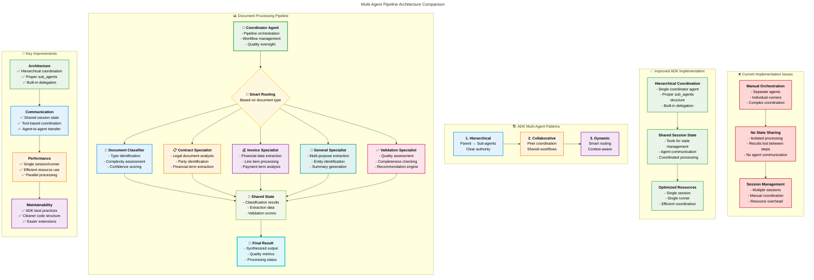

```mermaid
---
title: Multi-Agent Pipeline Architecture Comparison
---
flowchart TB
    subgraph "❌ Current Implementation Issues"
        direction TB
        C1["`**Manual Orchestration**
        - Separate agents
        - Individual runners
        - Complex coordination`"]
        
        C2["`**No State Sharing**
        - Isolated processing
        - Results lost between steps
        - No agent communication`"]
        
        C3["`**Session Management**
        - Multiple sessions
        - Manual coordination
        - Resource overhead`"]
        
        C1 --> C2 --> C3
    end
    
    subgraph "✅ Improved ADK Implementation"
        direction TB
        I1["`**Hierarchical Coordination**
        - Single coordinator agent
        - Proper sub_agents structure
        - Built-in delegation`"]
        
        I2["`**Shared Session State**
        - Tools for state management
        - Agent communication
        - Coordinated processing`"]
        
        I3["`**Optimized Resources**
        - Single session
        - Single runner
        - Efficient coordination`"]
        
        I1 --> I2 --> I3
    end
    
    subgraph "🏗️ ADK Multi-Agent Patterns"
        direction LR
        P1["`**1. Hierarchical**
        Parent → Sub-agents
        Clear authority`"]
        
        P2["`**2. Collaborative**
        Peer coordination
        Shared workflows`"]
        
        P3["`**3. Dynamic**
        Smart routing
        Context-aware`"]
        
        P1 --> P2 --> P3
    end
    
    subgraph "📊 Document Processing Pipeline"
        direction TB
        
        D1["`🎯 **Coordinator Agent**
        - Pipeline orchestration
        - Workflow management
        - Quality oversight`"]
        
        D1 --> D2{"`🧠 **Smart Routing**
        Based on document type`"}
        
        D2 --> D3["`📄 **Document Classifier**
        - Type identification
        - Complexity assessment
        - Confidence scoring`"]
        
        D2 --> D4["`📋 **Contract Specialist**
        - Legal document analysis
        - Party identification
        - Financial term extraction`"]
        
        D2 --> D5["`💰 **Invoice Specialist**
        - Financial data extraction
        - Line item processing
        - Payment term analysis`"]
        
        D2 --> D6["`📑 **General Specialist**
        - Multi-purpose extraction
        - Entity identification
        - Summary generation`"]
        
        D2 --> D7["`✅ **Validation Specialist**
        - Quality assessment
        - Completeness checking
        - Recommendation engine`"]
        
        D3 --> D8["`💾 **Shared State**
        - Classification results
        - Extraction data
        - Validation scores`"]
        
        D4 --> D8
        D5 --> D8
        D6 --> D8
        D7 --> D8
        
        D8 --> D9["`🎯 **Final Result**
        - Synthesized output
        - Quality metrics
        - Processing status`"]
    end
    
    subgraph "🔧 Key Improvements"
        direction TB
        K1["`**Architecture**
        ✅ Hierarchical coordination
        ✅ Proper sub_agents
        ✅ Built-in delegation`"]
        
        K2["`**Communication**
        ✅ Shared session state
        ✅ Tool-based coordination
        ✅ Agent-to-agent transfer`"]
        
        K3["`**Performance**
        ✅ Single session/runner
        ✅ Efficient resource use
        ✅ Parallel processing`"]
        
        K4["`**Maintainability**
        ✅ ADK best practices
        ✅ Cleaner code structure
        ✅ Easier extensions`"]
        
        K1 --> K2 --> K3 --> K4
    end
    
    %% Styling
    style C1 fill:#ffd7d7,stroke:#d32f2f,stroke-width:2px,color:#000
    style C2 fill:#ffd7d7,stroke:#d32f2f,stroke-width:2px,color:#000
    style C3 fill:#ffd7d7,stroke:#d32f2f,stroke-width:2px,color:#000
    
    style I1 fill:#e8f5e8,stroke:#4caf50,stroke-width:2px,color:#000
    style I2 fill:#e8f5e8,stroke:#4caf50,stroke-width:2px,color:#000
    style I3 fill:#e8f5e8,stroke:#4caf50,stroke-width:2px,color:#000
    
    style P1 fill:#e3f2fd,stroke:#2196f3,stroke-width:2px,color:#000
    style P2 fill:#fff3e0,stroke:#ff9800,stroke-width:2px,color:#000
    style P3 fill:#f3e5f5,stroke:#9c27b0,stroke-width:2px,color:#000
    
    style D1 fill:#e8f5e8,stroke:#4caf50,stroke-width:3px,color:#000
    style D2 fill:#fff8e1,stroke:#ffc107,stroke-width:2px,color:#000
    style D3 fill:#e3f2fd,stroke:#2196f3,stroke-width:2px,color:#000
    style D4 fill:#fff3e0,stroke:#ff9800,stroke-width:2px,color:#000
    style D5 fill:#f3e5f5,stroke:#9c27b0,stroke-width:2px,color:#000
    style D6 fill:#e0f2f1,stroke:#009688,stroke-width:2px,color:#000
    style D7 fill:#fce4ec,stroke:#e91e63,stroke-width:2px,color:#000
    style D8 fill:#f1f8e9,stroke:#8bc34a,stroke-width:2px,color:#000
    style D9 fill:#e0f7fa,stroke:#00bcd4,stroke-width:3px,color:#000
    
    style K1 fill:#e8f5e8,stroke:#4caf50,stroke-width:2px,color:#000
    style K2 fill:#e3f2fd,stroke:#2196f3,stroke-width:2px,color:#000
    style K3 fill:#fff3e0,stroke:#ff9800,stroke-width:2px,color:#000
    style K4 fill:#f3e5f5,stroke:#9c27b0,stroke-width:2px,color:#000
```
