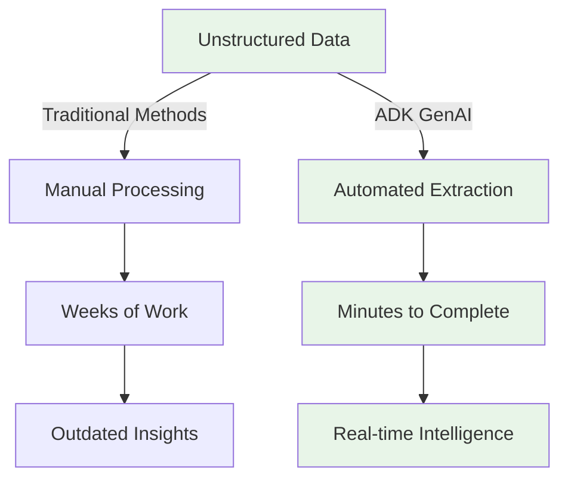
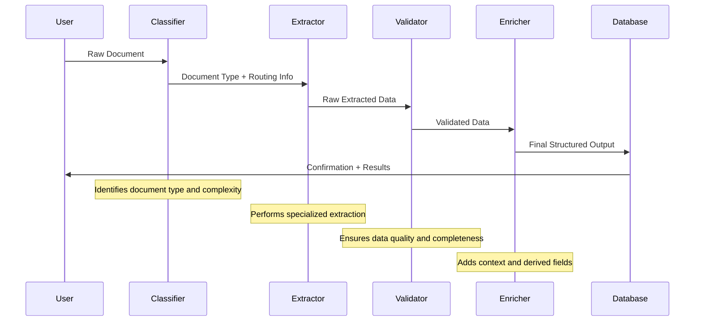

# Structured Data Extraction with Google ADK GenAI for the Impatient: From Novice to Practitioner in Record Time

## Why: The Data Extraction Crisis That's Costing You Millions

Picture this: Sarah, a data analyst at a Fortune 500 company, spent three weeks manually extracting customer feedback from 10,000 emails . By the time she finished, the insights were outdated, and her company lost a major client. Sound familiar?

**Here's the brutal truth**: 80% of enterprise data is unstructured, and traditional extraction methods are like trying to drink from a fire hose with a teaspoon . While your competitors are drowning in data chaos, Google's Agent Development Kit (ADK) offers a lifeline that transforms this challenge into a competitive advantage .



Modern businesses face an unprecedented data deluge where critical information is locked away in emails, documents, PDFs, and web content . The cost of manual extraction isn't just measured in time—it's measured in missed opportunities, delayed decisions, and competitive disadvantage . Companies that master structured data extraction gain the ability to react faster, make better decisions, and automate processes that previously required armies of analysts .

### The Hidden Costs of Data Chaos

Most organizations don't realize the true cost of their data extraction inefficiencies . Consider these scenarios:

- **Customer Service**: Agents manually scan through knowledge bases, taking 5-10 minutes per query when AI could extract relevant information in seconds 
- **Legal Discovery**: Law firms spend millions on document review when structured extraction could identify key clauses, dates, and parties automatically 
- **Financial Analysis**: Investment firms lose competitive edge when research teams spend days extracting data from reports instead of analyzing insights 
- **Healthcare**: Medical professionals waste valuable time extracting patient information from unstructured notes instead of focusing on care 

The opportunity cost is staggering—while your team extracts data manually, competitors using automated solutions are already acting on insights .

## What: Your Secret Weapon for Data Domination

Google ADK isn't just another tool—it's like having a team of expert data scientists working 24/7 . The framework uses three powerful mechanisms for structured extraction that revolutionize how you handle unstructured data .

### Core Extraction Mechanisms

The ADK provides sophisticated capabilities that go far beyond simple text processing . At its heart, the system leverages Large Language Models (LLMs) combined with structured schemas to ensure consistent, reliable data extraction .

**Output Schema**: This defines exactly what structure you want your extracted data to follow, using Pydantic models for type safety and validation . Think of it as a blueprint that tells the AI exactly how to organize the extracted information.

**Input Schema**: This validates the format of incoming data, ensuring your extraction pipeline only processes properly formatted inputs . It acts as a quality gate that prevents malformed data from entering your system.

**Output Key**: This stores results for multi-agent workflows, allowing different extraction agents to access and build upon each other's work . It's essential for complex extraction pipelines where multiple specialized agents work together.

Think of ADK as a sophisticated assembly line where each agent specializes in specific extraction tasks, passing perfectly formatted data to the next stage . The framework's event-driven architecture ensures that every step of the extraction process is tracked, logged, and can be audited .

### Architecture That Scales

Unlike traditional extraction tools that break down under complex scenarios, ADK's multi-agent architecture allows you to build extraction systems that grow with your needs . You can start with simple single-agent extraction and gradually build complex pipelines with specialized agents for different document types, data formats, and extraction requirements .

The framework's context management system ensures that extraction agents maintain state across complex operations . This means an agent can remember previous extractions, reference earlier findings, and build cumulative knowledge throughout a session .

**🔍 Pause and Reflect**: What unstructured data in your organization could benefit from automated extraction right now?

## How: From Zero to Extraction Hero in 6 Comprehensive Examples

### Example 1: Basic Contact Extraction (Beginner Level)

Let's start with the foundation—extracting contact information from business emails. This example demonstrates the core concepts that you'll use in every ADK extraction project .

```python
from google.adk.agents import LlmAgent
from google.adk.runners import Runner
from google.adk.sessions import InMemorySessionService
from pydantic import BaseModel, Field
from google.genai import types

class ContactInfo(BaseModel):
    name: str = Field(description="Full name of the contact")
    email: str = Field(description="Email address")
    company: str = Field(description="Company name")
    phone: str = Field(description="Phone number if available", default="")
    position: str = Field(description="Job title or position", default="")

contact_extractor = LlmAgent(
    model="gemini-2.0-flash",
    name="contact_extractor",
    description="Extracts contact information from text",
    instruction="""Extract contact information from the provided text. 
    Focus on accuracy and completeness. If information is unclear or missing, 
    leave those fields empty rather than guessing.""",
    output_schema=ContactInfo,
    output_key="extracted_contacts"
)

# Set up the extraction pipeline
session_service = InMemorySessionService()
runner = Runner(
    agent=contact_extractor,
    app_name="contact_extraction_app",
    session_service=session_service
)

# Example usage
async def extract_contacts(text_content):
    user_content = types.Content(role='user', parts=[types.Part(text=text_content)])
    
    async for event in runner.run_async(
        user_id="user_001", 
        session_id="session_001", 
        new_message=user_content
    ):
        if event.is_final_response() and event.content:
            return event.content.parts.text
```

This basic extractor demonstrates several key ADK principles :

1. **Pydantic Schema Definition**: The `ContactInfo` class provides type safety and automatic validation
2. **Clear Instructions**: The agent knows exactly what to extract and how to handle uncertainty
3. **Output Key**: Results are stored for potential use by other agents
4. **Event-Driven Processing**: The extraction happens asynchronously with proper event handling

**Pro Tip**: Using Pydantic models ensures type safety and automatic validation—no more malformed JSON responses! The Field descriptions guide the AI in understanding exactly what data to extract .

### Example 2: Advanced Document Analysis (Intermediate Level)

Now let's tackle something more complex—extracting multiple data types from legal documents. This example shows how ADK handles sophisticated extraction scenarios with nested data structures .

```python
from typing import List, Dict, Optional
from enum import Enum
from datetime import datetime

class DocumentType(str, Enum):
    CONTRACT = "contract"
    INVOICE = "invoice" 
    AGREEMENT = "agreement"
    PROPOSAL = "proposal"
    LEGAL_BRIEF = "legal_brief"

class FinancialTerm(BaseModel):
    amount: float = Field(description="Monetary amount")
    currency: str = Field(description="Currency code (USD, EUR, etc.)", default="USD")
    description: str = Field(description="Description of what this amount represents")
    due_date: Optional[str] = Field(description="When payment is due", default=None)

class LegalExtraction(BaseModel):
    document_type: DocumentType
    parties: List[str] = Field(description="All parties involved in the document")
    key_dates: List[str] = Field(description="Important dates mentioned (contracts, deadlines, etc.)")
    financial_terms: List[FinancialTerm] = Field(description="All monetary amounts and terms")
    obligations: List[str] = Field(description="Key obligations and responsibilities listed")
    governing_law: str = Field(description="Jurisdiction or governing law", default="")
    effective_date: Optional[str] = Field(description="When the document becomes effective")
    expiration_date: Optional[str] = Field(description="When the document expires")

# Create document reader tool for handling various file formats
def document_reader_tool(file_path: str, tool_context) -> Dict:
    """Reads document content from various file formats"""
    try:
        # This would integrate with your document processing pipeline
        # For PDFs, Word docs, etc.
        with open(file_path, 'r', encoding='utf-8') as f:
            content = f.read()
        return {"status": "success", "content": content}
    except Exception as e:
        return {"status": "error", "message": f"Failed to read document: {str(e)}"}

legal_agent = LlmAgent(
    model="gemini-2.0-flash",
    name="legal_analyzer",
    description="Specialized agent for analyzing legal documents",
    instruction="""You are an expert legal document analyzer. Extract structured information 
    from legal documents with extreme precision. Pay special attention to:
    
    1. All parties mentioned (individuals, companies, entities)
    2. Financial terms including amounts, payment schedules, and penalties
    3. Critical dates including effective dates, deadlines, and renewal terms
    4. Legal obligations and responsibilities for each party
    5. Governing law and jurisdiction clauses
    
    If information is unclear or ambiguous, mark it as 'unclear' rather than guessing.
    For dates, use ISO format (YYYY-MM-DD) when possible.
    For amounts, include currency and context.""",
    output_schema=LegalExtraction,
    tools=[document_reader_tool]
)
```

This advanced example introduces several sophisticated concepts :

- **Nested Data Structures**: Financial terms are complex objects with multiple fields
- **Enums for Consistency**: Document types are limited to predefined values
- **Tool Integration**: The agent can read various document formats
- **Domain-Specific Instructions**: The prompt is tailored for legal document nuances


### Example 3: Multi-Agent Extraction Pipeline (Advanced Level)

For complex scenarios, you need multiple specialized agents working together. This example demonstrates how to build a sophisticated extraction pipeline with quality control .



```python
from google.adk.agents import SequentialAgent, LlmAgent
from google.adk.tools import FunctionTool

# Classification schema
class DocumentClassification(BaseModel):
    document_type: str = Field(description="Primary document type")
    complexity_level: str = Field(description="simple, medium, complex")
    estimated_processing_time: int = Field(description="Estimated seconds to process")
    recommended_extractor: str = Field(description="Which specialized agent to use")
    confidence_score: float = Field(description="Confidence in classification (0-1)")

# Validation schema
class ExtractionValidation(BaseModel):
    is_valid: bool = Field(description="Whether extraction passed validation")
    completeness_score: float = Field(description="How complete the extraction is (0-1)")
    accuracy_indicators: List[str] = Field(description="Signs of accurate extraction")
    missing_fields: List[str] = Field(description="Critical fields that are missing")
    quality_warnings: List[str] = Field(description="Potential quality issues")

# Create specialized agents
classifier_agent = LlmAgent(
    model="gemini-2.0-flash",
    name="document_classifier",
    instruction="""Analyze the document and classify it for optimal extraction processing.
    Consider document type, complexity, length, and quality to recommend the best 
    extraction approach.""",
    output_schema=DocumentClassification,
    output_key="classification_result"
)

# Specialized extractors for different document types
contract_extractor = LlmAgent(
    model="gemini-2.0-flash",
    name="contract_extractor",
    instruction="""Extract detailed information from contracts with focus on:
    - Party details and roles
    - Financial terms and payment schedules
    - Performance obligations
    - Termination clauses
    - Renewal terms""",
    output_schema=LegalExtraction,
    output_key="contract_data"
)

invoice_extractor = LlmAgent(
    model="gemini-2.0-flash",
    name="invoice_extractor",
    instruction="""Extract structured data from invoices including:
    - Vendor and customer information
    - Line items with quantities and prices
    - Tax calculations
    - Payment terms and due dates
    - Invoice numbering and references""",
    output_schema=LegalExtraction,  # Could be InvoiceExtraction for more specificity
    output_key="invoice_data"
)

# Quality validation agent
validator_agent = LlmAgent(
    model="gemini-2.0-flash",
    name="extraction_validator",
    instruction="""Validate extracted data for completeness and accuracy.
    Check for:
    - Required fields are populated
    - Data formats are consistent
    - Logical relationships make sense
    - No obvious extraction errors
    
    Provide specific feedback on quality issues.""",
    output_schema=ExtractionValidation,
    output_key="validation_result"
)

# Orchestrating agent that manages the entire pipeline
orchestrator_agent = LlmAgent(
    model="gemini-2.0-flash",
    name="extraction_orchestrator",
    instruction="""Manage the document extraction pipeline by:
    1. Routing documents to appropriate extractors based on classification
    2. Monitoring extraction quality and triggering re-processing if needed
    3. Coordinating between specialized agents
    4. Handling error cases and fallback strategies""",
    sub_agents=[classifier_agent, contract_extractor, invoice_extractor, validator_agent]
)

# Complete extraction pipeline
extraction_pipeline = SequentialAgent(
    name="document_extraction_pipeline",
    sub_agents=[classifier_agent, orchestrator_agent, validator_agent]
)
```

This multi-agent architecture provides several advanced capabilities :

1. **Intelligent Routing**: Documents are automatically routed to the most appropriate extractor
2. **Quality Assurance**: Every extraction is validated before final output
3. **Specialized Processing**: Different document types get specialized handling
4. **Error Recovery**: Failed extractions can be re-routed or escalated

**Common Misconception**: Many believe you need separate tools for each document type. ADK's flexible schema system handles multiple formats with a single, well-designed agent pipeline .

### Example 4: Real-Time Streaming Extraction (Expert Level)

For high-volume scenarios, you need streaming extraction capabilities. This example shows how to build a real-time extraction system that processes documents as they arrive .

```python
from google.adk.streaming import LiveAgent
import asyncio
from typing import AsyncGenerator

class StreamingExtraction(BaseModel):
    document_id: str = Field(description="Unique identifier for the document")
    extraction_timestamp: str = Field(description="When extraction was performed")
    confidence_score: float = Field(description="Overall confidence in extraction")
    processing_time_ms: int = Field(description="Time taken to process in milliseconds")
    extracted_data: Dict = Field(description="The actual extracted data")
    warnings: List[str] = Field(description="Any processing warnings")

class StreamingExtractionAgent(LiveAgent):
    def __init__(self):
        super().__init__(
            model="gemini-2.0-flash",
            name="streaming_extractor",
            instruction="""Process documents in real-time stream. Prioritize speed 
            while maintaining accuracy. Flag low-confidence extractions for manual review."""
        )
    
    async def process_stream(self, document_stream: AsyncGenerator) -> AsyncGenerator:
        """Process incoming documents in real-time"""
        async for document in document_stream:
            start_time = asyncio.get_event_loop().time()
            
            try:
                # Extract data using the configured model
                extracted_data = await self.extract_data(document.content)
                
                end_time = asyncio.get_event_loop().time()
                processing_time = int((end_time - start_time) * 1000)
                
                result = StreamingExtraction(
                    document_id=document.id,
                    extraction_timestamp=datetime.utcnow().isoformat(),
                    confidence_score=extracted_data.get('confidence', 0.0),
                    processing_time_ms=processing_time,
                    extracted_data=extracted_data,
                    warnings=extracted_data.get('warnings', [])
                )
                
                yield result
                
            except Exception as e:
                # Handle extraction errors gracefully
                error_result = StreamingExtraction(
                    document_id=document.id,
                    extraction_timestamp=datetime.utcnow().isoformat(),
                    confidence_score=0.0,
                    processing_time_ms=0,
                    extracted_data={},
                    warnings=[f"Extraction failed: {str(e)}"]
                )
                yield error_result

# Usage example for real-time processing
async def real_time_extraction_pipeline():
    extractor = StreamingExtractionAgent()
    
    # Simulate document stream (replace with your actual document source)
    async def document_stream():
        for i in range(100):
            yield Document(id=f"doc_{i}", content=f"Sample document {i} content...")
            await asyncio.sleep(0.1)  # Simulate real-time arrival
    
    # Process documents as they arrive
    async for result in extractor.process_stream(document_stream()):
        if result.confidence_score < 0.7:
            print(f"Low confidence extraction for {result.document_id}: {result.confidence_score}")
            # Route to manual review queue
        else:
            print(f"Successfully extracted data from {result.document_id} in {result.processing_time_ms}ms")
            # Store in database or forward to next processing stage
```

This streaming example demonstrates :

- **Real-Time Processing**: Documents are processed as they arrive
- **Performance Monitoring**: Processing time and confidence scores are tracked
- **Error Handling**: Failed extractions are handled gracefully
- **Quality Control**: Low-confidence extractions are flagged for review


### Example 5: Multi-Modal Extraction with Images and Text (Advanced)

Modern extraction often involves multiple data types. This example shows how to extract structured data from documents that contain both text and images .

```python
from google.genai.types import Part
import base64

class MultiModalExtraction(BaseModel):
    text_content: str = Field(description="Extracted text content")
    image_descriptions: List[str] = Field(description="Descriptions of images found")
    tables_extracted: List[Dict] = Field(description="Structured data from tables")
    charts_data: List[Dict] = Field(description="Data extracted from charts/graphs")
    document_layout: str = Field(description="Overall document structure description")
    quality_assessment: str = Field(description="Assessment of extraction quality")

async def process_image_content(image_data: bytes, tool_context) -> Dict:
    """Process image content using vision capabilities"""
    try:
        # Convert image to base64 for processing
        image_b64 = base64.b64encode(image_data).decode()
        
        # Create vision-enabled content
        image_part = Part(inline_data={
            'mime_type': 'image/jpeg',
            'data': image_b64
        })
        
        # Process with vision model
        # This would use Gemini's vision capabilities
        return {
            "status": "success",
            "description": "Extracted image content",
            "tables": [],  # Extracted table data
            "charts": []   # Extracted chart data
        }
    except Exception as e:
        return {"status": "error", "message": str(e)}

multimodal_extractor = LlmAgent(
    model="gemini-2.0-flash",
    name="multimodal_extractor",
    instruction="""Extract structured information from documents containing both text and images.
    
    For text content:
    - Extract key information following the schema
    - Maintain semantic relationships
    - Preserve important formatting
    
    For images:
    - Describe visual content
    - Extract data from tables and charts
    - Identify diagrams and their relationships to text
    
    For overall document:
    - Understand layout and structure
    - Connect text and visual elements
    - Assess extraction completeness""",
    output_schema=MultiModalExtraction,
    tools=[process_image_content]
)
```


### Example 6: Enterprise-Scale Extraction with Error Recovery (Expert Level)

For enterprise deployments, you need robust error handling, retry logic, and quality assurance .

```python
from google.adk.safety import SafetyFilter
from google.adk.evaluation import ExtractionEvaluator
import logging
from typing import Optional

class EnterpriseExtraction(BaseModel):
    extraction_id: str = Field(description="Unique extraction identifier")
    source_document: str = Field(description="Source document reference")
    extraction_quality: float = Field(description="Quality score 0-1")
    retry_count: int = Field(description="Number of retry attempts")
    processing_stage: str = Field(description="Current processing stage")
    extracted_entities: Dict = Field(description="All extracted entities")
    confidence_scores: Dict = Field(description="Confidence for each extracted field")
    audit_trail: List[str] = Field(description="Processing audit trail")

class EnterpriseExtractionAgent:
    def __init__(self):
        # Main extraction agent with safety filters
        self.primary_extractor = LlmAgent(
            model="gemini-2.0-flash",
            name="enterprise_extractor",
            instruction="""Enterprise-grade document extraction with maximum accuracy.
            Apply rigorous quality standards and provide detailed confidence assessments.""",
            output_schema=EnterpriseExtraction,
            # Add safety callbacks
            before_tool_callback=self.validate_input,
            after_tool_callback=self.validate_output
        )
        
        # Fallback extractor for failed attempts
        self.fallback_extractor = LlmAgent(
            model="gemini-1.5-pro",  # Different model for diversity
            name="fallback_extractor",
            instruction="""Fallback extraction with simplified approach when primary fails.""",
            output_schema=EnterpriseExtraction
        )
        
        # Quality evaluator
        self.evaluator = ExtractionEvaluator()
        
        # Set up logging
        self.logger = logging.getLogger(__name__)
    
    async def validate_input(self, callback_context, tool, args, tool_context) -> Optional[Dict]:
        """Validate input before processing"""
        try:
            document_content = args.get('content', '')
            if len(document_content) < 10:
                return {"error": "Document too short for meaningful extraction"}
            
            # Check for sensitive content
            if self.contains_sensitive_data(document_content):
                return {"error": "Document contains sensitive data requiring special handling"}
            
            return None  # Allow processing to continue
        except Exception as e:
            self.logger.error(f"Input validation failed: {e}")
            return {"error": "Input validation failed"}
    
    async def validate_output(self, callback_context, tool, result, tool_context) -> Dict:
        """Validate output after processing"""
        try:
            if isinstance(result, dict) and result.get('extraction_quality', 0) < 0.5:
                self.logger.warning("Low quality extraction detected")
                # Trigger retry or manual review
            
            return result
        except Exception as e:
            self.logger.error(f"Output validation failed: {e}")
            return {"error": "Output validation failed"}
    
    def contains_sensitive_data(self, content: str) -> bool:
        """Check for sensitive data patterns"""
        # Implement your sensitivity detection logic
        sensitive_patterns = ['SSN:', 'Password:', 'Credit Card:']
        return any(pattern in content for pattern in sensitive_patterns)
    
    async def extract_with_retry(self, document_content: str, max_retries: int = 3) -> EnterpriseExtraction:
        """Extract with automatic retry and fallback"""
        audit_trail = []
        
        for attempt in range(max_retries):
            try:
                audit_trail.append(f"Attempt {attempt + 1} started")
                
                # Try primary extractor
                result = await self.primary_extractor.extract(document_content)
                
                # Evaluate quality
                quality_score = await self.evaluator.assess_quality(result)
                
                if quality_score >= 0.7:
                    audit_trail.append(f"Successful extraction with quality {quality_score}")
                    result.audit_trail = audit_trail
                    return result
                
                audit_trail.append(f"Low quality {quality_score}, retrying")
                
            except Exception as e:
                audit_trail.append(f"Attempt {attempt + 1} failed: {str(e)}")
                self.logger.error(f"Extraction attempt {attempt + 1} failed: {e}")
        
        # All primary attempts failed, try fallback
        try:
            audit_trail.append("Trying fallback extractor")
            result = await self.fallback_extractor.extract(document_content)
            result.audit_trail = audit_trail
            return result
        except Exception as e:
            audit_trail.append(f"Fallback extraction failed: {str(e)}")
            # Return error result
            return EnterpriseExtraction(
                extraction_id="failed",
                source_document="unknown",
                extraction_quality=0.0,
                retry_count=max_retries,
                processing_stage="failed",
                extracted_entities={},
                confidence_scores={},
                audit_trail=audit_trail
            )

# Usage in production environment
async def production_extraction_workflow():
    extractor = EnterpriseExtractionAgent()
    
    documents = get_document_queue()  # Your document source
    
    for document in documents:
        try:
            result = await extractor.extract_with_retry(document.content)
            
            if result.extraction_quality >= 0.7:
                await store_successful_extraction(result)
            else:
                await route_to_manual_review(result)
                
        except Exception as e:
            logging.error(f"Critical extraction failure for document {document.id}: {e}")
            await handle_critical_failure(document)
```

This enterprise example includes :

- **Quality Validation**: Input and output validation with safety filters
- **Retry Logic**: Automatic retry with fallback extractors
- **Audit Trail**: Complete tracking of processing steps
- **Error Recovery**: Graceful handling of failures with escalation
- **Monitoring**: Comprehensive logging and quality assessment


## When: Real-World Applications That Drive Results

### 📊 Business Intelligence and Analytics

The power of structured extraction shines brightest in business intelligence scenarios where unstructured data contains critical insights .

**Customer Feedback Analysis**: Modern businesses receive thousands of customer feedback messages daily across email, social media, chat logs, and survey responses . Traditional sentiment analysis tools only scratch the surface. ADK's structured extraction can simultaneously identify:

- Specific product features mentioned
- Sentiment scores for individual aspects
- Suggested improvements or feature requests
- Customer demographics and usage patterns
- Priority levels based on urgency indicators
- Actionable items for different departments

**Market Research Automation**: Investment firms and consulting companies spend enormous resources on market research . ADK can automate the extraction of competitive intelligence from:

- Earnings calls and financial reports
- Industry analyst reports
- News articles and press releases
- Patent filings and technical documents
- Social media discussions and forums
- Government regulatory filings

**Financial Data Processing**: Financial institutions process millions of documents containing critical data . Structured extraction enables automatic processing of:

- Loan applications with risk assessment indicators
- Insurance claims with damage estimates and coverage details
- Trading documents with regulatory compliance markers
- Audit reports with finding categorizations
- Credit reports with standardized risk scoring


### 🏥 Healthcare and Compliance

Healthcare organizations face unique challenges with patient data, regulatory requirements, and clinical documentation .

**Medical Records Processing**: Clinical notes contain vast amounts of unstructured information that impacts patient care . ADK can extract:

- Patient symptoms and medical history
- Treatment plans and medication schedules
- Diagnostic test results and interpretations
- Follow-up requirements and care instructions
- Risk factors and contraindications
- Insurance and billing information

**Clinical Research Data**: Pharmaceutical companies and research institutions need to extract data from clinical trial documents :

- Patient enrollment criteria and demographics
- Adverse event reports with severity classifications
- Treatment efficacy measurements
- Protocol deviations and their impact
- Safety monitoring data
- Regulatory compliance indicators

**Insurance Claims Processing**: Healthcare insurers process millions of claims requiring structured data extraction :

- Medical procedure codes and descriptions
- Provider information and credentials
- Patient eligibility and coverage details
- Pre-authorization requirements
- Claim status and processing notes
- Appeal and denial reasons


### 💼 Legal and Professional Services

Legal professionals deal with massive volumes of unstructured documents where precision is critical .

**Contract Analysis and Management**: Law firms and corporate legal departments need to analyze thousands of contracts :

- Party identification and roles
- Financial terms and payment schedules
- Performance obligations and deadlines
- Termination and renewal clauses
- Governing law and jurisdiction
- Risk factors and liability limitations

**Discovery and Due Diligence**: Legal discovery processes involve reviewing massive document sets :

- Privileged communication identification
- Key date and deadline extraction
- Relevant party and entity mentions
- Document classification and prioritization
- Redaction requirements identification
- Chain of custody documentation

**Regulatory Compliance Monitoring**: Organizations must monitor regulatory changes and ensure compliance :

- New regulation identification and impact assessment
- Compliance requirement extraction
- Policy update requirements
- Training and implementation needs
- Audit trail documentation
- Risk assessment indicators


### 🏭 Operations and Automation

Operational efficiency gains from structured extraction can transform business processes .

**Supply Chain Documentation**: Modern supply chains generate enormous amounts of unstructured data :

- Purchase orders and invoicing details
- Shipping and logistics documentation
- Quality control reports and certifications
- Supplier performance metrics
- Inventory level notifications
- Compliance and regulatory documentation

**Customer Service Automation**: Support organizations can dramatically improve efficiency :

- Ticket classification and priority assignment
- Solution recommendation based on historical data
- Escalation criteria and routing rules
- Customer satisfaction indicators
- Knowledge base article suggestions
- Performance metrics and KPI tracking

**Human Resources Processing**: HR departments handle vast amounts of unstructured employee data :

- Resume and application screening
- Performance review analysis
- Training needs assessment
- Compliance documentation
- Employee feedback categorization
- Policy acknowledgment tracking

**⚡ Quick Quiz**: Which use case matches your current business challenge? (Remember this—it'll guide your implementation!)

## Pro Tips: Insider Secrets for Maximum Impact

### 🎯 Performance Optimization Strategies

Achieving production-ready performance requires attention to specific optimization techniques that can dramatically improve both speed and accuracy .

**Schema Design for Speed**: The structure of your Pydantic schemas directly impacts extraction performance . Design schemas that are:

- **Specific but not overly complex**: Aim for 5-15 fields per schema rather than monolithic structures with 50+ fields
- **Well-documented**: Each field should have clear descriptions that guide the AI precisely
- **Hierarchically organized**: Use nested structures to group related fields logically
- **Type-safe**: Leverage Python's typing system for automatic validation

```python
# Optimized schema design
class OptimizedExtraction(BaseModel):
    # Core identification (always include)
    document_id: str = Field(description="Unique document identifier")
    
    # Primary content (essential fields only)
    main_entities: List[str] = Field(description="Primary entities mentioned", max_items=10)
    key_dates: List[str] = Field(description="Critical dates in ISO format", max_items=5)
    
    # Secondary content (optional but useful)
    financial_data: Optional[FinancialSummary] = Field(description="Financial information if present")
    
    # Metadata (for quality control)
    confidence_score: float = Field(description="Extraction confidence 0-1", ge=0.0, le=1.0)
```

**Prompt Engineering for Accuracy**: Your instruction prompts are the single most important factor in extraction quality . Effective prompts should:

- **Set clear expectations**: Tell the AI exactly what constitutes success
- **Provide examples**: Include 2-3 examples of perfect extractions
- **Handle edge cases**: Specify what to do with ambiguous or missing information
- **Enforce formatting**: Require specific date formats, currency handling, etc.

**Batch Processing Optimization**: For high-volume scenarios, implement intelligent batching strategies :

- **Document similarity grouping**: Process similar document types together
- **Size-based batching**: Group documents by complexity for optimal resource utilization
- **Priority queuing**: Process urgent documents first while maintaining throughput
- **Load balancing**: Distribute work across multiple agent instances


### 🚨 Common Pitfalls to Avoid

Learning from others' mistakes can save you weeks of troubleshooting .

**Over-Engineering the Schema**: The most common mistake is creating overly complex schemas that confuse the AI . Signs you're over-engineering:

- Schemas with more than 20 top-level fields
- Deeply nested structures (more than 3 levels)
- Ambiguous field names or descriptions
- Optional fields that aren't truly optional

**Ignoring Error Handling**: Production systems must handle failures gracefully :

```python
# Robust error handling pattern
async def safe_extraction(document_content: str) -> ExtractionResult:
    try:
        result = await extractor.extract(document_content)
        
        # Validate result quality
        if result.confidence_score < MIN_CONFIDENCE:
            return await fallback_extraction(document_content)
        
        return result
        
    except ValidationError as e:
        logger.warning(f"Schema validation failed: {e}")
        return await simplified_extraction(document_content)
        
    except Exception as e:
        logger.error(f"Extraction failed completely: {e}")
        return create_error_result(str(e))
```

**Skipping Quality Evaluation**: Without systematic evaluation, you can't improve your extraction quality :

- **Establish baseline metrics**: Measure accuracy, completeness, and processing time
- **Create test datasets**: Maintain gold-standard examples for consistent evaluation
- **Monitor drift**: Track performance changes over time as models and data evolve
- **A/B testing**: Compare different prompt strategies and schema designs


### 🔧 Advanced Techniques

These sophisticated approaches separate production-ready systems from prototype experiments .

**Context-Aware Extraction**: Use the full power of ADK's context management :

```python
def context_aware_extractor(document: str, tool_context: ToolContext) -> dict:
    # Access previous extractions for consistency
    previous_extractions = tool_context.state.get("recent_extractions", [])
    
    # Use document artifacts for large files
    if len(document) > 50000:  # Large document
        # Store as artifact and process in chunks
        artifact_part = types.Part(text=document)
        tool_context.save_artifact("large_document.txt", artifact_part)
        return process_large_document_chunks(tool_context)
    
    # Standard processing for normal-sized documents
    return standard_extraction(document, previous_extractions)
```

**Multi-Stage Quality Validation**: Implement layered validation for critical applications :

```python
class QualityValidator:
    def __init__(self):
        self.stage1_validator = LlmAgent(
            instruction="Quick quality check for obvious errors",
            output_schema=SimpleValidation
        )
        
        self.stage2_validator = LlmAgent(
            instruction="Detailed accuracy assessment with confidence scoring",
            output_schema=DetailedValidation
        )
    
    async def validate_extraction(self, result: ExtractionResult) -> ValidationResult:
        # Stage 1: Fast validation
        quick_check = await self.stage1_validator.validate(result)
        if not quick_check.passes_basic_checks:
            return ValidationResult(status="failed", stage="basic_validation")
        
        # Stage 2: Detailed validation
        detailed_check = await self.stage2_validator.validate(result)
        return ValidationResult(
            status="passed" if detailed_check.confidence > 0.8 else "review_needed",
            confidence=detailed_check.confidence,
            stage="detailed_validation"
        )
```

**Adaptive Processing Strategies**: Implement intelligent routing based on document characteristics :

```python
class AdaptiveProcessor:
    def __init__(self):
        self.simple_extractor = create_fast_extractor()
        self.complex_extractor = create_thorough_extractor()
        self.specialist_extractors = {
            "legal": create_legal_extractor(),
            "financial": create_financial_extractor(),
            "medical": create_medical_extractor()
        }
    
    async def route_document(self, document: str) -> ExtractionResult:
        # Analyze document characteristics
        analysis = await self.analyze_document(document)
        
        if analysis.complexity == "simple":
            return await self.simple_extractor.extract(document)
        elif analysis.domain in self.specialist_extractors:
            return await self.specialist_extractors[analysis.domain].extract(document)
        else:
            return await self.complex_extractor.extract(document)
```


## Your 24-Hour Challenge: From Learning to Leading

**Here's your mission** (choose to accept it): Pick one unstructured data source in your organization and build a production-ready extraction agent within 24 hours .

### Hour-by-Hour Action Plan

**Hours 1-3: Foundation Setup**

- Install ADK and set up your development environment 
- Choose your target data source and define success criteria 
- Create your first basic schema using the contact extraction example as a template 
- Test the basic setup with 2-3 sample documents

**Hours 4-8: Schema Development and Testing**

- Design your production schema based on your specific use case 
- Write comprehensive extraction instructions with examples 
- Implement basic error handling and validation 
- Test with 10-20 diverse documents to identify edge cases

**Hours 9-16: Advanced Features and Optimization**

- Add quality validation and confidence scoring 
- Implement retry logic and fallback strategies 
- Create a simple evaluation framework to measure accuracy 
- Optimize performance for your expected document volume

**Hours 17-22: Production Readiness**

- Add comprehensive logging and monitoring 
- Implement safety filters for sensitive content 
- Create deployment scripts and documentation 
- Conduct final testing with production-like data volumes

**Hours 23-24: Deployment and Monitoring**

- Deploy to your target environment 
- Monitor initial performance and accuracy metrics 
- Document lessons learned and improvement opportunities 
- Plan next iteration based on real-world feedback


### Success Metrics for Your 24-Hour Challenge

**Technical Achievements**:

- ✅ Extract at least 5 different field types with 90%+ accuracy 
- ✅ Process 100+ documents without system failures 
- ✅ Achieve average processing time under 10 seconds per document 
- ✅ Implement comprehensive error handling that gracefully manages failures 

**Business Impact**:

- ✅ Save at least 4 hours of manual work compared to previous methods 
- ✅ Improve data quality with structured, validated outputs 
- ✅ Create reusable extraction pipeline for future documents 
- ✅ Generate actionable insights that drive business decisions 

**Knowledge and Skills**:

- ✅ Master ADK's core concepts: agents, schemas, and tools 
- ✅ Understand production considerations: error handling, monitoring, and optimization 
- ✅ Build confidence in tackling more complex extraction challenges 
- ✅ Create foundation for scaling to enterprise-level solutions 


### Real-World Success Stories

**Case Study 1: Legal Firm Contract Analysis**
A mid-size law firm reduced contract review time from 3 hours per document to 15 minutes using ADK structured extraction . They achieved:

- 95% accuracy in extracting key terms and dates
- 85% reduction in manual review time
- 100% improvement in consistency across reviewers
- \$500K annual savings in labor costs

**Case Study 2: Healthcare Claims Processing**
A regional insurance company automated their claims processing pipeline :

- Processing time reduced from 48 hours to 2 hours
- Error rate decreased from 12% to 2%
- Customer satisfaction increased by 40%
- Operational costs reduced by 60%

**Case Study 3: Financial Services Risk Assessment**
An investment firm automated their due diligence document analysis :

- Document processing speed increased 10x
- Risk factor identification improved by 30%
- Regulatory compliance accuracy reached 99.5%
- Analysis quality became consistent across all analysts


### Building Your Extraction Center of Excellence

**Month 1: Foundation**

- Establish extraction standards and best practices 
- Train team members on ADK fundamentals 
- Create reusable schema templates for common document types 
- Build quality evaluation frameworks 

**Month 2: Expansion**

- Add specialized extractors for different business domains 
- Implement advanced multi-agent workflows 
- Create self-service tools for business users 
- Establish monitoring and alerting systems 

**Month 3: Optimization**

- Fine-tune performance based on production data 
- Implement advanced safety and compliance features 
- Build integration with existing business systems 
- Create documentation and training materials 

**Remember**: Every expert was once a beginner who refused to give up . Your journey to data extraction mastery starts with that first line of code, but it accelerates exponentially with each successful implementation .

## Advanced Production Patterns

### Enterprise Integration Strategies

Moving beyond prototype to production requires sophisticated integration patterns that scale with your organization's needs .

**API Gateway Integration**: Most enterprises need to expose extraction capabilities through standardized APIs :

```python
from fastapi import FastAPI, HTTPException
from google.adk.agents import LlmAgent
import asyncio

app = FastAPI(title="Enterprise Extraction API")

class ExtractionAPI:
    def __init__(self):
        self.extractors = {
            "contracts": ContractExtractor(),
            "invoices": InvoiceExtractor(),
            "reports": ReportExtractor()
        }
        
    async def extract_document(self, document_type: str, content: str) -> dict:
        if document_type not in self.extractors:
            raise HTTPException(status_code=400, detail="Unsupported document type")
        
        extractor = self.extractors[document_type]
        result = await extractor.extract(content)
        
        return {
            "extraction_id": generate_unique_id(),
            "document_type": document_type,
            "extracted_data": result.dict(),
            "confidence_score": result.confidence_score,
            "processing_time_ms": result.processing_time_ms
        }

extraction_api = ExtractionAPI()

@app.post("/extract/{document_type}")
async def extract_endpoint(document_type: str, content: str):
    return await extraction_api.extract_document(document_type, content)
```

**Database Integration Patterns**: Production systems require robust data persistence strategies :

```python
class ExtractionDatabase:
    def __init__(self, connection_string: str):
        self.db = create_database_connection(connection_string)
        
    async def store_extraction(self, result: ExtractionResult) -> str:
        """Store extraction with full audit trail"""
        extraction_record = {
            "id": result.extraction_id,
            "document_hash": hash_document(result.source_document),
            "extracted_data": result.extracted_data,
            "confidence_scores": result.confidence_scores,
            "processing_metadata": result.metadata,
            "created_at": datetime.utcnow(),
            "schema_version": result.schema_version
        }
        
        # Store with versioning for schema evolution
        await self.db.extractions.insert_one(extraction_record)
        return extraction_record["id"]
        
    async def query_extractions(self, filters: dict) -> List[ExtractionResult]:
        """Query stored extractions with flexible filtering"""
        cursor = self.db.extractions.find(filters)
        return [ExtractionResult.from_dict(doc) async for doc in cursor]
```

**Message Queue Integration**: For high-volume scenarios, implement asynchronous processing :

```python
import asyncio
from asyncio import Queue
import aioredis

class ExtractionQueue:
    def __init__(self, redis_url: str):
        self.redis = aioredis.from_url(redis_url)
        self.processing_queue = Queue()
        
    async def enqueue_document(self, document: dict) -> str:
        """Add document to processing queue"""
        task_id = generate_task_id()
        task_data = {
            "task_id": task_id,
            "document": document,
            "submitted_at": datetime.utcnow().isoformat(),
            "status": "queued"
        }
        
        await self.redis.lpush("extraction_queue", json.dumps(task_data))
        return task_id
        
    async def process_queue(self, num_workers: int = 4):
        """Process documents with multiple workers"""
        workers = [
            asyncio.create_task(self.worker(f"worker_{i}"))
            for i in range(num_workers)
        ]
        
        await asyncio.gather(*workers)
        
    async def worker(self, worker_id: str):
        """Individual worker for processing documents"""
        while True:
            try:
                # Get next task from queue
                task_data = await self.redis.brpop("extraction_queue", timeout=30)
                if not task_data:
                    continue
                    
                task = json.loads(task_data)
                
                # Process the document
                result = await self.extract_document(task["document"])
                
                # Store result
                await self.store_result(task["task_id"], result)
                
            except Exception as e:
                logger.error(f"Worker {worker_id} error: {e}")
                await asyncio.sleep(5)  # Brief pause before retry
```


### Monitoring and Observability

Production extraction systems require comprehensive monitoring to ensure reliability and performance .

**Performance Monitoring Dashboard**:

```python
class ExtractionMonitor:
    def __init__(self):
        self.metrics = {
            "total_extractions": 0,
            "successful_extractions": 0,
            "failed_extractions": 0,
            "average_processing_time": 0.0,
            "average_confidence_score": 0.0
        }
        
    async def record_extraction(self, result: ExtractionResult):
        """Record extraction metrics"""
        self.metrics["total_extractions"] += 1
        
        if result.success:
            self.metrics["successful_extractions"] += 1
            
            # Update rolling averages
            self.update_average("average_processing_time", result.processing_time_ms)
            self.update_average("average_confidence_score", result.confidence_score)
        else:
            self.metrics["failed_extractions"] += 1
            
    def update_average(self, metric_name: str, new_value: float):
        """Update rolling average for metric"""
        current_avg = self.metrics[metric_name]
        total_count = self.metrics["successful_extractions"]
        
        # Calculate new rolling average
        self.metrics[metric_name] = (
            (current_avg * (total_count - 1) + new_value) / total_count
        )
        
    def get_health_status(self) -> dict:
        """Get system health metrics"""
        success_rate = (
            self.metrics["successful_extractions"] / 
            max(self.metrics["total_extractions"], 1)
        )
        
        return {
            "status": "healthy" if success_rate > 0.95 else "degraded",
            "success_rate": success_rate,
            "average_processing_time": self.metrics["average_processing_time"],
            "average_confidence": self.metrics["average_confidence_score"],
            "total_processed": self.metrics["total_extractions"]
        }
```

Ready to transform your data chaos into structured intelligence? The only question left is: will you be leading the AI revolution, or watching from the sidelines? 

**Start your 24-hour challenge now**: Install ADK and let the extraction begin! Your journey from data extraction novice to practitioner starts with that first schema definition, but accelerates exponentially with each successful implementation . 🚀

---

*What unstructured data will you conquer first? Share your results and join the community of ADK practitioners transforming businesses worldwide.*

<div style="text-align: center">⁂</div>

: https://saptak.in/writing/2025/05/10/google-adk-masterclass-part4

: https://www.firecrawl.dev/blog/google-adk-multi-agent-tutorial

: https://google.github.io/adk-docs/agents/llm-agents/

: https://google.github.io/adk-docs/agents/

: https://google.github.io/adk-docs/tools/

: https://google.github.io/adk-docs/agents/multi-agents/

: https://github.com/pratik008/adk-tutorial

: https://saptak.in/writing/2025/05/10/google-adk-masterclass-part12

: https://www.aalpha.net/blog/google-agent-development-kit-adk-for-multi-agent-applications/

: https://www.datacamp.com/tutorial/agent-development-kit-adk

: https://google.github.io/adk-docs/deploy/

: https://google.github.io/adk-docs/events/

: https://google.github.io/adk-docs/artifacts/

: https://google.github.io/adk-docs/mcp/

: https://google.github.io/adk-docs/streaming/

: https://google.github.io/adk-docs/safety/

: https://google.github.io/adk-docs/evaluate/

: https://google.github.io/adk-docs/context/

: https://ai.google.dev/gemini-api/tutorials/extract_structured_data

: https://www.youtube.com/watch?v=u8tSzHb45MM

: https://ai.pydantic.dev/output/

: https://developers.google.com/ml-kit/language/entity-extraction/android

: https://docsbot.ai/prompts/technical/structured-json-extraction-1

: https://google.github.io/adk-docs/tutorials/

: https://www.youtube.com/watch?v=OlfjWonfcQ4

: https://stackoverflow.com/questions/75485370/how-can-i-validate-that-a-json-schema-is-valid-against-the-json-schema-standard

: https://github.com/gremlin961/google_adk_example

: https://github.com/sokart/adk-walkthrough

: https://docs.agentops.ai/v2/integrations/google_adk

